.. meta::
    :version: renaissance
    :author: Michael Eichberg
    :keywords: "Distributed Applications", "Models", "Architectures", "Architectural Styles"
    :description lang=de: Architecture of distributed Applications
    :id: lecture-ds-architectures
    :first-slide: last-viewed
    :master-password: WirklichSchwierig!

.. include:: ../docutils.defs

Architectures of Distributed Applications
==========================================================================

A first overview.

:Lecturer: `Prof. Dr. Michael Eichberg <https://delors.github.io/cv/folien.de.rst.html>`__
:Contact: michael.eichberg@dhbw.de, Raum 149B
:Version: 1.0

.. supplemental::

  :Slides: 
          |html-source|

          |pdf-source|
          
  :Reporting issues:

          https://github.com/Delors/delors.github.io/issues

.. container:: footer-left 

    Selected slides are based on slides by Maarten van Steen ( *Distributed Systems*)

    All errors are my own.

.. class:: transition-fade new-section

Basic architectures
-------------------------------------

Architectural Styles
----------------------------------------------

An architectural style is formulated in the form of

.. class:: incremental-list

- (interchangeable) components with clearly defined interfaces
- the way in which the components are connected to each other
- the data exchanged between the components
- the way in which these components and connections are configured together to form a system System.  

.. supplemental::

  .. rubric:: Connector

  A mechanism that mediates communication, coordination or co-operation between components. Example: Facilities for (remote) procedure calls (RPC), message transmission or streaming.

Layered Architectures
----------------------

.. class:: columns incremental-list

- \
  
  .. image:: images/common_application_architectures/n-layered_architectures.svg
       
- \ 
  
  .. image:: images/common_application_architectures/n-layered_architectures-jump_over_layers.svg
       
- \
 
  .. image:: images/common_application_architectures/n-layered_architectures-and-callbacks.svg
       
       

Example of a 3-tier Architecture
--------------------------------------

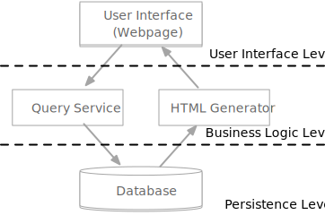

Traditional Architectures
-------------------------

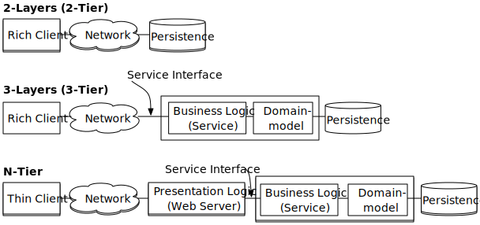

.. supplemental::

  .. rubric:: Traditional 3-tier Architecture

  This architecture can be found in many distributed information systems with traditional database technology and associated applications.

  - The presentation layer represents the interface to users or external applications.
  - The processing layer implements the business logic.
  - The persistence/data layer is responsible for data storage.

*Publish and Subscribe* Architectures
-------------------------------------

Dependencies between the components are realised using the *Publish and Subscribe* paradigm with the aim of loose coupling.

.. deck::  incremental
 
  .. card::

    **Taxonomy of coordination approaches with regard to communication and coordination:**

    .. csv-table::
      :class: highlight-row-on-hover
      :widths: 12 40 40      
      :stub-columns: 1
      :header-rows: 1
      
      "", "Coupled in time", "Decoupled in time"
      Referentially coupled, "Direct Coordination", "Mailbox Coordination"
      Referentially decoupled, "Event-based Coordination", "Shared Data Space"

  .. card:: 
        
    .. rubric:: Event-based Coordination

    .. image:: images/pubsub/event-based.svg
       :align: center

  .. card::
        
    .. rubric:: *Shared Data Space*

    .. image:: images/pubsub/shared-data-space.svg
       :align: center

.. container:: incremental 

  *Event-based coordination* in combination with *shared data space* is often used to realise publish and subscribe architectures.

.. supplemental::

  .. rubric:: Direct coordination

  A process interacts directly (⇒ temporal coupling) with exactly one other well-defined process (⇒ referential coupling).

  .. rubric:: Mailbox coordination

  The processes communicating with each other do not interact directly with each other, but via a unique mailbox (⇒ referential coupling). This means that the processes do not have to be available at the same time.

  .. rubric:: Event-based coordination

  A process triggers events to which *any* other process reacts directly. A process that is not available at the time the event occurs does not see the event.

  .. rubric:: Shared data storage

  Processes communicate via tuples that are stored in a shared data space. A process that is not available at the time of writing can read the tuple later. Processes define patterns with regard to the tuples they want to read.

.. TODO Expand the discussion of PubSub architectures.

Structure of cloud computing applications
---------------------------------------------

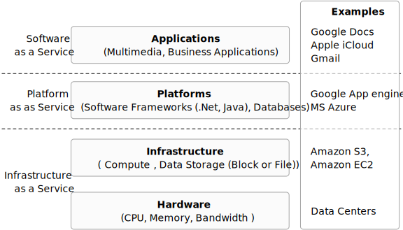

.. supplemental:: 

  A distinction can be made between four layers:

  .. class:: list-with-explanations

  - Hardware: processors, routers, power supply and cooling systems. 
   
    Normally completely transparent for customers.
  - Infrastructure: Use of virtualization techniques for the purpose of allocating and managing virtual storage and virtual servers.
  - Platforms: Provides higher level abstractions for storage and the like. 
   
    Example: The Amazon S3 storage system provides an API for (locally created) files that can be organized and stored in so-called buckets.
  - Application: Actual applications, such as office suites (word processing programmes, spreadsheet programmes, presentation applications). 
   
    Comparable to the suite of applications that are delivered with operating systems.

.. class:: new-section transition-fade

Microservices [Newman2021]_
---------------------------

.. class:: no-title 

Microservice with REST Interface
-------------------------------------

.. class:: columns

- .. rubric:: Microservices

  A simple microservice that offers a REST interface and emits events.

  .. container:: incremental question 

    Where are the challenges?

- .. image:: images/microservices/base_example.svg
  
.. supplemental::

    A major challenge is the design of the interfaces. To achieve true independence, the interfaces must be very well defined. If the interfaces are not clearly defined or inadequate, this can lead to a lot of work and coordination between the teams, which is actually undesirable!

Key Concepts of Microservices
-------------------------------------

.. class:: incremental-list list-with-explanations

- can be deployed independently/are independently deployable
  
  (... and are developed independently.)
- model a business domain
  
  (Often along a bounded context or an aggregate determined using DDDs.)
- manage their own state
  
  (I.e. they have no shared database.)
- are small
  
  (Small enough to be developed by (max.) one team.)

- flexible in terms of scalability, robustness and the used technologies
- allow the architecture to be aligned with the organization (see Conway's Law)

Microservices and Conway's Law
-------------------------------------

.. class:: columns incremental-list

- .. rubric:: Traditional Layered Architectures
       
  .. image:: images/microservices/traditional-architecture-scope-of-change.svg
       
- .. rubric:: Microservices Architectures

  .. image:: images/microservices/microservices-architecture-scope-of-change.svg
       

Microservices and Usage of Technologies
-----------------------------------------

Microservices are flexible with regard to the use of technology and enable the use of “the most suitable” technology.

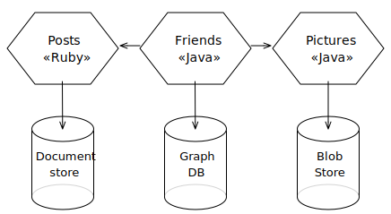

.. class:: vertical-title

Aktuelle Standardtechnologien
-------------------------------------

.. deck::

  .. card::
  
    .. image:: screenshots/tiobe_2012-04.webp
       :align: center

    Quelle: TIOBE Programming Community Index - April 2012

  .. card::

    .. image:: screenshots/tiobe_2024-02.webp
       :align: center

    Quelle: `TIOBE Programming Community Index - Feb. 2024 <https://www.tiobe.com/tiobe-index/>`__

Microservices and Scalability
-------------------------------------

Well designed microservices can also be scaled very well.

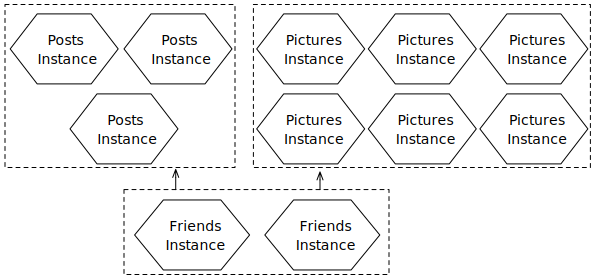

Implementation of a long-lived transactions?
-------------------------------------------------

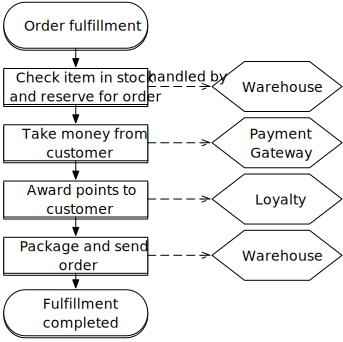

.. supplemental::

  The implementation of transactions is one of the biggest challenges in the development of microservices. 

Using SAGAs for long-lived transactions
---------------------------------------------------------------

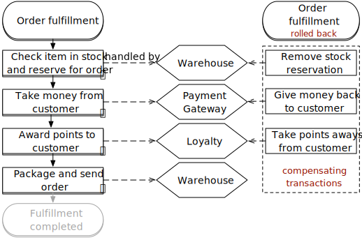

.. supplemental::

  A *saga* is a sequence of actions that are executed to implement a long-lived transaction. 
  
  Sagas cannot guarantee atomicity. However, each system can guarantee atomicity (e.g. by using traditional database transactions).

  If the transaction needs to be aborted, a traditional *rollback* cannot be performed. The saga must then carry out the corresponding compensating transactions, which undo all previously successful actions.

Minimize the probability of possible *rollbacks*
--------------------------------------------------------------------------------

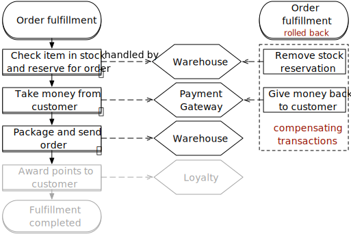

.. supplemental::

  The processing sequence of the actions can be optimized to minimize the probability of *rollbacks*. In this case, the probability of a *rollback* occurring during the "package and send order” step is significantly higher than for the “award customer bonus” step.

Long-lived transactions with orchestrated sagas
--------------------------------------------------------

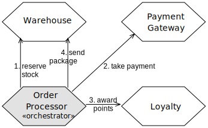

.. supplemental::

  The orchestrated saga is one way of implementing long-lived transactions. 

  .. class:: positive-list
  
  - Conceptually simple

  .. class:: negative-list list-with-explanations 

  - High degree of *domain coupling* 
  
    As this is essentially domain-driven coupling, this coupling is often acceptable. The coupling does not generate any technical debt.
  - High degree of *request-response* interactions
  - Risk that functionality that would be better accommodated in the individual services (or possibly new services) is moved to the ordering service.

Long-lived transactions with choreographed sagas
----------------------------------------------------------

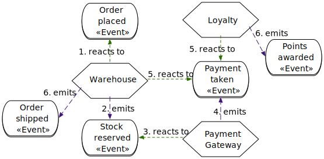

.. supplemental::

  A major problem with choreographed sagas is keeping track of the current status. This problem can be alleviated by using a “correlation ID”.

*Dual-write Problem*
---------------------

.. deck::

  .. card:: 

    .. grid::

      .. cell::
          
        .. image:: images/dual-write/no-crash-no-problem.svg
       
      .. cell::

        Where could there be a problem?

        .. warning::
          :class: incremental
          
          Writing to two different systems (here: database and event-processing middleware) always requires a transactional context. 
          
          If this cannot be established, inconsistencies can occur (*dual-write problem*).

  .. card:: 

    .. grid:: 

      .. cell::
 
        .. image:: images/dual-write/crash.svg
          :align: center

      .. cell::

        .. rubric:: Solution Ideas

        .. class:: incremental-list negative-list
        
        - 2PC is not an option in the context of microservices (too slow, too complex)
        - Changing the order of actions (1st *publish* then 2nd *update*) still leads to inconsistencies
        - notifying the event processing middleware (synchronously) - i. e. as part of the database update - is also not an option:
        
          .. class:: negative-list

          - What happens if the middleware cannot be reached?
          - What happens if the event cannot be processed? 
  
        .. container:: incremental assessment
          
          Strict consistency cannot be achieved.

*Dual-write Problem* - Outbox Pattern
-----------------------------------------

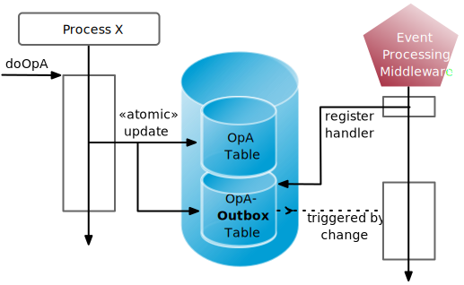

.. supplemental:: 
  
  .. rubric:: *(a) Solution: Outbox Pattern*

  - The actions are (additionally) saved in an outbox table and then processed **asynchronously**.

  - This enables *eventual consistency* to be achieved.

.. class:: no-title center-content transition-fade

Choosing the right architecture is a trade-off!
-----------------------------------------------------

.. container:: accentuate

  The choice of software architecture is always a consideration of many trade-offs!

.. supplemental::

  Other aspects that can/must be considered:

  - Cloud (and possibly serverless)
  - Mechanical Sympathy
  - Testing and deployment of microservices (keyword: *Canary Releases*)
  - Monitoring and logging
  - Service meshes
  - ...

Literature
-------------------------------------

.. [Newman2021] Sam Newman, **Building Microservices: Designing Fine-Grained Systems**, O'Reilly, 2021.
