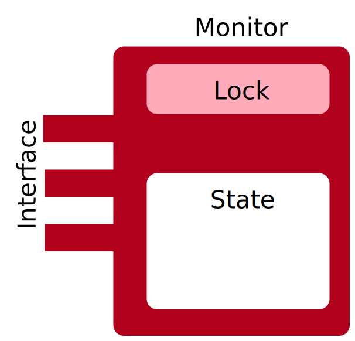
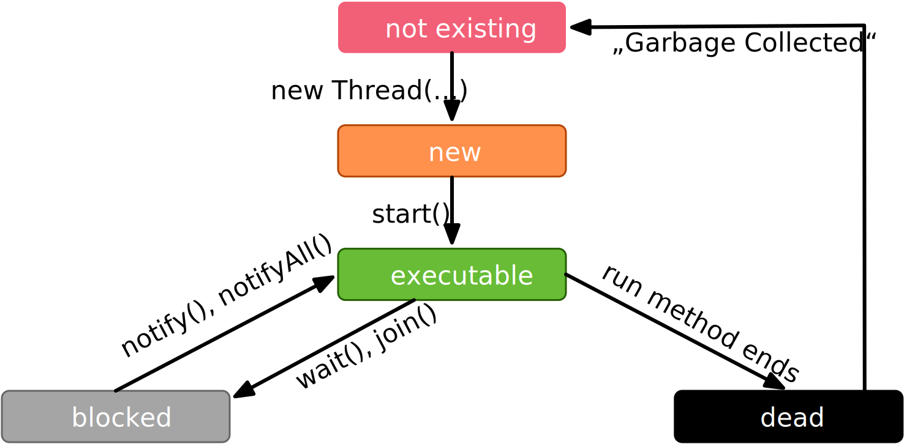

.. meta::
    :author: Michael Eichberg
    :keywords: Java, Concurrency
    :description lang=de: Nebenläufigkeit in Java
    :description lang=en: Concurrency in Java
    :id: lecture-ds-concurrency-in-java
    :first-slide: last-viewed
    :master-password: WirklichSchwierig!

.. include:: ../docutils.defs

Concurrency in Java
===============================================================================

:Dozent: `Prof. Dr. Michael Eichberg <https://delors.github.io/cv/folien.de.rst.html>`__
:Kontakt: michael.eichberg@dhbw.de
:Version: 1.0.1

.. supplemental::

  :Slides/Scripts:

    |html-source|

    |pdf-source|
  :Reporting errors:

    https://github.com/Delors/delors.github.io/issues

.. class:: no-title center-content

Concurrency
--------------------------------------------------------------------------------

.. container:: exclamation-mark

  A good understanding of concurrent programming is essential for the development of distributed applications, as servers always process several requests simultaneously.

Processes vs. threads
--------------------------------------------------------

.. deck::

  .. card::

    .. image:: images/threads/threads.svg
      :alt: Prozesse vs. Threads
      :align: center

  .. card:: overlay

    .. image:: images/threads/fibres.svg
      :align: center

  .. card:: overlay

    .. image:: images/threads/virtual_threads.svg
      :align: center

.. supplemental::

  - Processes are isolated from each other and can only communicate with each other via explicit mechanisms; processes do not share the same address space.
  - All threads of a process share the same address space. *Native threads* are threads supported by the operating system that are managed directly by the operating system. Standard Java threads are *native threads*.

  - Fibres* (also *coroutines*) always use cooperative multitasking. This means that a fibre explicitly passes control to another fibre. (Formerly also referred to as *green threads*.) These are invisible to the operating system.

  - As of Java 21, Java not only supports classic (native) threads but also virtual threads (which are "somewhere" between green threads and native threads. The latter in particular allow very natural programming of middleware that takes care of parallelization/concurrency.

Communication and synchronization with the help of *monitors*
-------------------------------------------------------------------

A *monitor* is an object in which the methods are executed in mutual exclusion (*mutual exclusion*).

.. rubric:: Condition synchronization

- expresses a condition on the order in which operations are executed.
- For example, data can only be removed from a buffer once data has been entered into the buffer.
- Java only supports one (anonymous) condition variable per monitor, with the classic methods :java:`wait` and :java:`notify` or :java:`notifyAll`.

.. supplemental::

  .. warning::

     In Java, mutual exclusion only takes place between methods that have been explicitly declared as :java:`synchronized`.

  *Monitors* are just one model (alternatives: *Semaphores*, *Message Passing*) that enables the communication and synchronization of threads. It is the standard model in Java and is directly supported by the Java Virtual Machine (JVM).

Communication between threads with the help of monitors
--------------------------------------------------------------------

- By reading and writing data encapsulated in shared objects that are protected by monitors.
- Each object is implicitly derived from the class :java:`java.lang.Object`, which defines a mutual exclusion lock.
- Methods in a class can be marked as :java:`synchronized`. The method is only executed when the lock is present. It waits until then. This process happens automatically.
- The lock can also be acquired via a :java:`synchronized` statement that names the object.
- A thread can wait for a single (anonymous) condition variable and notify it.

Concurrency in Java
--------------------------------------------------------------------------------

.. image:: images/threads/java-threads.svg
   :alt: java.lang.Thread
   :align: center

.. supplemental::

  - Threads are provided in Java via the predefined class :java:`java.lang.Thread`.
  - Alternatively, the interface:

    :java:`public interface Runnable { void run(); }`

    can be implemented and an instance can then be passed to a Thread-Objekt.
  - Threads only start their execution when the :java:`start` method is called in the thread class. The :java:`thread.start` method calls the :java:`run` method. Calling the :java:`run` method directly does not lead to parallel execution.
  - The current thread can be determined using the static method :java:`Thread.currentThread()`.
  - A thread is terminated when the execution of its run method ends either normally or as the result of an unhandled exception.

  - Java distinguishes between *user* threads and *daemon* threads.

    *Daemon threads* are threads that provide general services and are normally never terminated.

    When all user threads are terminated, the daemon threads are terminated by the JVM and the main programme is terminated.

    The method :java:`setDaemon` must be called before the thread is started.

Inter-thread communication and coordination
--------------------------------------------------------------------------------

- A thread can wait (with or without a timeout) for another thread (the target) to finish, by calling the :java:`join` method of the target thread.
- A thread can use the :java:`isAlive` method to determine whether the target thread has ended.

Java Thread States
--------------------------------------------------------------------------------

:java:`synchronized`-Methods and :java:`synchronized`-Blocks
--------------------------------------------------------------------
- A mutual exclusion lock is assigned to each object. The lock cannot be accessed explicitly by the application. This happens implicitly if:

  - a method uses the method modifier :java:`synchronized`
  - block synchronization with the keyword :java:`synchronized` is used

- If a method is marked as :java:`synchronized`, the method can only be accessed if the system has received the lock.
- Therefore, :java:`synchronized` methods have mutually exclusive access to the data encapsulated by the object, :red:`if this data is only accessed in other synchronized contexts`.
- Non-\ :java:`synchronized` methods do not require a lock and can therefore be called *at any time*.

Example: synchronized method
--------------------------------------------------------------------------------

.. deck::

  .. card::

    .. code:: java
      :class: copy-to-clipboard
      :number-lines:

      public class SynchronizedCounter {

        private int count = 0;

        public synchronized void increment() {
          count++;
        }

        public synchronized int getCount() {
          return count;
        }
      }

  .. card::

    .. code:: java
      :class: copy-to-clipboard
      :number-lines:

        public class SharedLong {

          private long theData; // reading and writing longs is not atomic

          public SharedLong(long initialValue) {
            theData = initialValue;
          }

          public synchronized long read() { return theData; }

          public synchronized void write(long newValue) { theData = newValue; }

          public synchronized void incrementBy(long by) {
            theData = theData + by;
          }
        }

        SharedLong myData = new SharedLong(42);

  .. card::

    .. code:: java
      :class: copy-to-clipboard
      :number-lines:

      public class SynchronizedCounter {

        private int count = 0;

        public void increment() {
          synchronized(this) {
            count++;
          }
        }

        public int getCount() {
          synchronized(this) {
            return count;
          }
        }
      }

.. supplemental::

  .. warning::

    When :java:`synchronized` is used in all its generality, it can undermine one of the advantages of classic monitors: The encapsulation of synchronization constraints associated with an object in a single place in the program!

    .. container:: peripheral

      This is because it is not possible to understand the synchronization associated with a particular object just by looking at the object itself. Other objects can use a :java:`synchronized` block in relation to the object.

Complex return values
------------------------------

.. code:: java
  :class: copy-to-clipboard
  :number-lines:

  public class SharedCoordinate {

    private int x, y;

    public SharedCoordinate(int initX, int initY) {
      this.x = initX; this.y = initY;
    }

    public synchronized void write(int newX, int newY) {
      this.x = newX; this.y = newY;
    }

    /*⚠️*/ public /* synchronized irrelevant */ int readX() { return x; } /*⚠️*/
    /*⚠️*/ public /* synchronized irrelevant */ int readY() { return y; } /*⚠️*/

    public synchronized SharedCoordinate read() {
      return new SharedCoordinate(x, y);
  } }

.. supplemental::

  The two methods: :java:`readX` and :java:`readY` are not synchronized, as reading :java:`int` values is atomic. However, they do allow an inconsistent state to be read! It is conceivable that the corresponding thread is interrupted directly after a :java:`readX` and another thread changes the values of :java:`x` and :java:`y`. If the original thread is then continued and calls :java:`readY`, it receives the new value of :java:`y` and thus has a pair of :java:`x`, :java:`y` that never existed in this form.

  A consistent state can only be determined by the method :java:`read`, which reads the values of :java:`x` and :java:`y` in one step and returns them as a pair.

  If it can be ensured that a reading thread names the instance in a :java:`synchronized` block, then the reading of a consistent state can also be ensured for several consecutive method calls.

  .. code:: java
    :class: copy-to-clipboard
    :number-lines:

    SharedCoordinate point = new SharedCoordinate(0,0);
    synchronized (point1) {
      var x = point1.readX();
      var y = point1.readY();
    }
    // do something with x and y

  However, this "solution" is very dangerous, as the probability of programming errors is *very high* and this can lead to either *race conditions* (here) or *deadlocks* (in general).

Conditional synchronization
--------------------------------------------------------------------------------

For the purpose of conditional synchronisation, the methods :java:`wait`, :java:`notify` and :java:`notifyAll` can be used in Java.  These methods allow you to wait for certain conditions and notify other threads when the condition has changed.

.. deck:: incremental

  .. card::

    - These methods can only be used within methods that hold the object lock; otherwise a :java:`IllegalMonitorStateException` is thrown.

  .. card::

    - The :java:`wait` method always blocks the calling thread and releases the lock associated with the object.

  .. card::

    - The :java:`notify` method wakes up *a* waiting thread. Which thread is woken up is not specified.

      :java:`notify` does not release the lock; therefore, the awakened thread must wait until it can receive the lock before it can continue.
    - Use :java:`notifyAll` to wake up all waiting threads.

      If the threads are waiting due to different conditions, :java:`notifyAll` must always be used.

    - If no thread is waiting, then :java:`notify` and :java:`notifyAll` have no effect.

  .. card::

    .. important::

      When a thread is woken up, it cannot assume that its condition has been fulfilled!

      The condition must always be checked in a loop and the thread may have to be put back into the wait state.

Example: Synchronisation with *condition variables*
-------------------------------------------------------------------------------

.. deck::

  .. card::

    If a thread is waiting for a condition, no other thread can wait for the other condition.

    :peripheral:`With the primitives presented so far, direct modelling of this scenario is not possible. Instead, all threads must always be woken up to ensure that the intended thread is also woken up. This is why it is also necessary to check the condition in a loop.`

  .. card::

    A *BoundedBuffer* traditionally uses two condition variables: *BufferNotFull* und *BufferNotEmpty*.

    .. code:: java
      :class: copy-to-clipboard
      :number-lines:

      public class BoundedBuffer {
        private final int buffer[];
        private int first;
        private int last;
        private int numberInBuffer = 0;
        private final int size;

        public BoundedBuffer(int length) {
          size = length;
          buffer = new int[size];
          last = 0;
          first = 0;
        };

  .. card::

    .. code:: java
      :class: copy-to-clipboard
      :number-lines: 14

        public synchronized void put(int item) throws InterruptedException {
          while (numberInBuffer == size)
            wait();
          last = (last + 1) % size;
          numberInBuffer++;
          buffer[last] = item;
          notifyAll();
        };

  .. card::

    .. code:: java
      :class: copy-to-clipboard
      :number-lines: 22

        public synchronized int get() throws InterruptedException {
          while (numberInBuffer == 0)
            wait();
          first = (first + 1) % size;
          numberInBuffer--;
          notifyAll();
          return buffer[first];
        }
      }

  .. card::

    Error situation that could occur when using :java:`notify` instead of :java:`notifyAll`:

    .. code:: java
      :class: copy-to-clipboard
      :number-lines: 1

      BoundedBuffer bb = new BoundedBuffer(1);
      Thread g1,g2 = new Thread(() => { bb.get(); });
      Thread p1,p2 = new Thread(() => { bb.put(new Object()); });
      g1.start(); g2.start(); p1.start(); p2.start();

    .. csv-table::
      :header: "", "Operation", "Change of State of the Buffer", "Waiting for the lock", "Waiting for the condition"
      :widths: 3, 25, 50, 33, 39
      :class: s-font-size-90 incremental-table-rows

      1, "**g1:bb.get()** :raw-html:` `
      g2:bb.get(), p1:bb.put(), p2:bb.put()", empty, "{g2,p1,p2}", {g1}
      2,"**g2:bb.get()**",empty,"{p1,p2}","{g1,g2}"
      3,"**p1:bb.put()**",empty → not empty,"{p2,g1}",{g2}
      4,"**p2:bb.put()**",not empty,{g1},"{g2,p2}"
      5,"**g1:bb.get()**",not empty → empty ,{g2},{p2}
      6,**g2:bb.get()**,empty,∅,"{g2,p2}"

.. supplemental::

  In step 5, the VM woke up the :java:`g2` thread - instead of the :java:`p2` thread - due to the call of :java:`notify` by :java:`g1`. The awakened thread :java:`g2` checks the condition (step 6) and realises that the buffer is empty. It goes back to the wait state. Now both a thread that wants to write a value and a thread that wants to read a value are waiting.

.. class:: new-section

Advanced synchronisation mechanisms, primitives and concepts.
--------------------------------------------------------------------------------

Java API for concurrent programming
--------------------------------------------------------------------------------

.. class:: incremental-list

:java.util.concurrent: Provides various classes to support common concurrent programming paradigms, e.g. support for *BoundedBuffers* or thread pools.
:java.util.concurrent.atomic: Provides support for *lock-free*, thread-safe programming on simple variables - such as atomic integers.
:java.util.concurrent.locks: Provides various lock algorithms that complement the Java language mechanisms, e.g. read-write locks and conditional variables. This enables, for example: "Hand-over-Hand" or "Chain Locking".

.. class:: smaller

Example: Synchronization with *ReentrantLock*\ s.
-------------------------------------------------------------------------------

A *BoundedBuffer*, for example, traditionally has two condition variables: *BufferNotFull* and *BufferNotEmpty*.

.. deck::

  .. card::

    .. code:: java
      :class: copy-to-clipboard
      :number-lines:

      public class BoundedBuffer<T> {

        private final T buffer[];
        private int first;
        private int last;
        private int numberInBuffer;
        private final int size;

        private final Lock lock = new ReentrantLock();
        private final Condition notFull = lock.newCondition();
        private final Condition notEmpty = lock.newCondition();

  .. card::

    .. code:: java
      :class: copy-to-clipboard
      :number-lines: 12

        public BoundedBuffer(int length) { /* Normal constructor. */
          size = length;
          buffer = (T[]) new Object[size];
          last = 0;
          first = 0;
          numberInBuffer = 0;
        }

  .. card::

    .. code:: java
      :class:  copy-to-clipboard
      :number-lines: 19

        public void put(T item) throws InterruptedException {
          lock.lock();
          try {

            while (numberInBuffer == size) { notFull.await(); }
            last = (last + 1) % size;
            numberInBuffer++;
            buffer[last] = item;
            notEmpty.signal();

          } finally {
            lock.unlock();
          }
        }

  .. card::

    .. code:: java
      :class: copy-to-clipboard
      :number-lines: 33

        public T get() ... {
          lock.lock();
          try {

            while (numberInBuffer == 0) { notEmpty.await(); }
            first = (first + 1) % size;
            numberInBuffer--;
            notFull.signal();
            return buffer[first];

          } finally {
            lock.unlock();
          }
        }
      }

Thread Priorities
--------------------------------------------------------------------------------

.. class:: incremental-list

- Although priorities can be assigned to the Java threads (:java:`setPriority`), they only serve the underlying scheduler as a guideline for resource allocation.
- A thread can explicitly give up the processor resources by calling the :java:`yield` method.
- :java:`yield` places the thread at the end of the queue for its priority level.
- However, Java's scheduling and priority models are weak:

  - There is no guarantee that the thread with the highest priority that can run will always be executed.
  - Threads with the same priority may or may not be divided into time slices.
  - When using native threads, different Java priorities can be mapped to the same operating system priority.

Best Practices
-----------------------------------------------------------

.. class:: important incremental-list

- :java:`synchronized` code should be kept as short as possible.
- Nested monitor calls should be avoided as the outer lock is not released when the inner monitor is waiting. This can easily lead to a deadlock occurring.

.. class:: no-title center-content

Always lock resources in the same order
------------------------------------------------------------------

.. warning::

  If two (or more) threads access the same resources in a different order, a deadlock can occur.

.. important::
  :class: incremental width-100

  **Resources must always be locked in the same order** to avoid deadlocks.

.. class:: new-section

Thread Safety
--------------------------------------------------------------------------------

Thread Safety - Prerequisites
--------------------------------------------------------------------------------

For a class to be thread-safe, it must behave correctly in a single-threaded environment.

.. deck::

  .. card::

    I.e. if a class is implemented correctly, then no sequence of operations (reading or writing public fields and calling public methods) on objects of this class should be able to

    - set the object to an invalid state,
    - observe the object in an invalid state, or
    - violate one of the invariants, preconditions or postconditions of the class.

  .. card::

    The class must also behave correctly when accessed by multiple threads.

    - Independent of *scheduling* or the interleaving of the execution of these threads by the runtime environment,
    - Without additional synchronisation on the part of the calling code.

    .. container:: framed incremental

        As a result, operations on a thread-safe object appear to all threads as if the operations were performed in a fixed, globally consistent order.

Thread Safety Level
--------------------------------------------------------------------------------

.. class:: incremental-list

:Immutable: The objects are constant and cannot be changed.
:Thread-safe: The objects can be changed, but support concurrent access as the methods are synchronized accordingly.
:Conditionally thread-safe: All objects where each individual operation is thread-safe, but certain sequences of operations may require external synchronization.
:Thread-compatible: All objects that have no synchronization at all. However, the caller can take over the synchronization externally if necessary.
:Thread-hostile: Objects that are not thread-safe and cannot be made thread-safe as they manipulate global status, for example.

.. class:: exercises

Exercise
---------------------

.. exercise:: Delayed Execution

  Implement a class (:java:`DelayingExecutor`) that accepts tasks (instances of :java:`java.lang.Runable`) and executes them after a certain time. The class must not block or be locked during this time.

  Consider using virtual threads. A virtual thread can be created using the method: :java:`Thread.ofVirtual()`. A :java:`Runnable` object can then be passed to the :java:`start` method.

  Delay the execution (:java:`Thread.sleep()`) by an average of 100ms with a standard deviation of 20ms. (Use :java:`Random.nextGaussian(mean,stddev)`)

  Start 100 000 virtual threads. How long does the execution take? How long does the execution take with 100 000 platform (*native*) threads?

  It is recommended to use the template.

  .. solution::
    :pwd: MyDelayedRunner

    .. code:: java
      :class: copy-to-clipboard
      :number-lines:

      Thread thread = Thread.ofVirtual().start(
          () -> {
              try {
                  var sleepTime =  (long) random.nextGaussian(100,20);
                  if (sleepTime < 0 ) {
                      // we found a gremlin...
                      return;
                  }
                  System.out.println(
                    "delaying " + id +
                    " by " + sleepTime + "ms");
                  Thread.sleep(sleepTime);
              } catch (InterruptedException e) {
                  Thread.currentThread().interrupt();
              }
              task.run();
          }
        );
      return thread;

.. supplemental::

  .. code:: java
    :class: copy-to-clipboard
    :number-lines:

    import java.util.ArrayList;
    import java.util.List;
    import java.util.Random;

    public class DelayingExecutor {

      private final Random random = new Random();

      private Thread runDelayed(int id, Runnable task) {
        // TODO
      }

      public static void main(String[] args) throws Exception {
        var start = System.nanoTime();
        DelayingExecutor executor = new DelayingExecutor();
        List<Thread> threads = new ArrayList<>();
        for (int i = 0; i < 100000; i++) {
          final var no = i;
          var thread = executor.runDelayed(
              i,
              () -> System.out.println("i'm no.: " + no));
          threads.add(thread);
        }
        System.out.println("finished starting all threads");
        for (Thread thread : threads) {
          thread.join();
        }
        var runtime = (System.nanoTime() - start)/1_000_000;
        System.out.println(
          "all threads finished after: " + runtime + "ms"
        );
      }
    }

.. class:: exercises

Exercise
----------------------------------------------

.. scrollable::

  .. exercise:: Thread-safe programming

    Implement a class :java:`ThreadsafeArray` to store non-:java:`null` objects (:java:`java.lang.Object`) at selected indices - comparable to a normal array. Compared to a normal array, however, a thread which wants to read a value should be blocked if the cell is occupied. The class should provide the following methods:

    :`get(int index)`:java:: Returns the value at the position :java:`index`. The calling thread may be blocked until a value has been saved at the :java:`index` position. (The :java:`get` method does not remove the value from the array).
    :`set(int index, Object value)`:java:: Stores the value :java:`value` at the position :java:`index`. If a value has already been saved at the position :java:`index`, the calling thread is blocked until the value at the position :java:`index` has been deleted.
    :`delete(int index)`:java:: Deletes the value at position :java:`index` if a value exists. Otherwise, the thread is blocked until there is a value that can be deleted.

    (a) Implement the :java:`ThreadsafeArray` class using only the standard primitives: :java:`synchronized`, :java:`wait`, :java:`notify` and :java:`notifyAll`. Use the template.
    (b) Can you use both :java:`notify` and :java:`notifyAll`?

    (c) Implement the :java:`ThreadsafeArray` class using :java:`ReentrantLock`\ s and :java:`Condition`\ s. Use the template.
    (d) What are the advantages of using :java:`ReentrantLock`\ s?

    .. solution::
      :pwd: ThreadSafeArrays

      (a)

        .. code:: java
          :class: copy-to-clipboard
          :number-lines:

          public synchronized Object get(int index) throws InterruptedException {
            var v = array[index];
            while (v == null) {
              var tName = Thread.currentThread().getName();
              /*DEBUG*/ out.println(tName + " will go to sleep");
              wait();
              v = array[index];
            }
            return v;
          }

          public synchronized void set(int index, Object value) throws InterruptedException {
            while (array[index] != null) {
              var tName = Thread.currentThread().getName();
              /*DEBUG*/ out.println(Thread.currentThread().getName() + " will go to sleep");
              wait();
            }
            array[index] = value;
            notifyAll();
          }

          public synchronized void delete(int index) throws InterruptedException {
            while (array[index] == null) {
              /*DEBUG*/ out.println(Thread.currentThread().getName() + " will go to sleep");
              wait();
            }
            array[index] = null;
            notifyAll();
          }

      (b) java:`notify` cannot be used because we have different conditions and using :java:`notify` could wake up an unsuitable thread. This could lead to all threads being in the waiting state although progress would be possible.

      (c)
          .. code:: java
            :class: copy-to-clipboard
            :number-lines:

            private final Object[] array;
            private final ReentrantLock[] locks;
            private final Condition[] notEmptyConditions;
            private final Condition[] notFullConditions;

            public ThreadsafeArrayWithConditionVariables(int size) {
              this.array = new Object[size];
              this.locks = new ReentrantLock[size];
              this.notEmptyConditions = new Condition[size];
              this.notFullConditions = new Condition[size];
              for (int i = 0; i < size; i++) {
                locks[i] = new ReentrantLock(true);
                notEmptyConditions[i] = locks[i].newCondition();
                notFullConditions[i] = locks[i].newCondition();
              }
            }

            public Object get(int index) throws InterruptedException {
              locks[index].lock();
              try {
                var v = array[index];
                while (v == null) {
                  out.println(Thread.currentThread().getName() + " will go to sleep");
                  notEmptyConditions[index].await();
                  out.println(Thread.currentThread().getName() + " awakened");
                  v = array[index];
                }
                return v;
              } finally {
                locks[index].unlock();
              }
            }

            public void set(int index, Object value) throws InterruptedException {
              locks[index].lock();
              try {
                while (array[index] != null) {
                  out.println(Thread.currentThread().getName() + " will go to sleep");
                  notFullConditions[index].await();
                  out.println(Thread.currentThread().getName() + " awakened");
                }
                array[index] = value;
                // "signalAll", because otherwise, it may happen that we "just"
                // wake up a getter thread...
                notEmptyConditions[index].signalAll();
              } finally {
                locks[index].unlock();
              }
            }

            public void delete(int index) throws InterruptedException{
              locks[index].lock();
              try {
                while (array[index] == null) {
                  out.println(Thread.currentThread().getName() + " will go to sleep");
                  notEmptyConditions[index].await();
                  out.println(Thread.currentThread().getName() + " awakened");
                }
                array[index] = null;
                notFullConditions[index].signal();
              } finally {
                locks[index].unlock();
              }
            }

      (d) We can at least use :java:`signal` for the condition *notFull*, since only the :java:`set` method may be waiting on the condition variable *notFull*. For the condition *notEmpty*, however, we can only use :java:`signalAll`, as both the :java:`get` and the :java:`delete` methods can wait on the condition variable *notEmpty* and it could otherwise happen that no :java:`delete` is awakened after a :java:`set` call.

.. supplemental::

  You can also consider the class :java:`ThreadsafeArray` as an array of *BoundedBuffers* with the size 1.

  .. code:: java
    :class: copy-to-clipboard
    :number-lines:

    public class ThreadsafeArray {

      private final Object[] array;

      public ThreadsafeArray(int size) {
        this.array = new Object[size];
      }

      // complete method signatures and implementations
      Object get(int index)
      void set(int index, Object value)
      void remove(int index)

      public static void main(String[] args) throws Exception {
        final var ARRAY_SIZE = 2;
        final var SLEEP_TIME = 1; // ms
        var array = new ThreadsafeArray(ARRAY_SIZE);
        for (int i = 0; i < ARRAY_SIZE; i++) {
          final var threadId = i;

          final var readerThreadName = "Reader";
          var t2 = new Thread(() -> {
            while (true) {
              int j = (int) (Math.random() * ARRAY_SIZE);
              try {
                out.println(readerThreadName + "[" + j + "]" );
                var o = array.get(j);
                out.println(readerThreadName +
                    "[" + j + "] ⇒ #" + o.hashCode());
                Thread.sleep(SLEEP_TIME);
              } catch (InterruptedException e) {
                e.printStackTrace();
              }
            }
          }, readerThreadName);
          t2.start();

          // One Thread for each slot that will eventually
          // write some content
          final var writerThreadName = "Writer[" + threadId + "]";
          var t1 = new Thread(() -> {
            while (true) {
              try {
                var o = new Object();
                out.println(writerThreadName + " = #" + o.hashCode());
                array.set(threadId, o);
                out.println(writerThreadName + " done");
                Thread.sleep(SLEEP_TIME);
              } catch (InterruptedException e) {
                e.printStackTrace();
              }
            }
          }, writerThreadName);
          t1.start();

          // One Thread for each slot that will eventually
          // delete the content
          final var deleterThreadName = "Delete[" + threadId + "]";
          var t3 = new Thread(() -> {
            while (true) {
              try {
                out.println(deleterThreadName);
                array.delete(threadId);
                Thread.sleep(SLEEP_TIME);
              } catch (InterruptedException e) {
                e.printStackTrace();
              }
            }
          }, deleterThreadName);
          t3.start();
        }
      }
    }
