.. meta::
    :author: Michael Eichberg
    :keywords: "Verteilte Systeme"
    :description lang=de: Verteilte Systeme
    :id: lecture-ds-einfuehrung
    :first-slide: last-viewed
    :master-password: WirklichSchwierig!

.. include:: ../docutils.defs

Einführung in verteilte Systeme
================================================

:Dozent: `Prof. Dr. Michael Eichberg <https://delors.github.io/cv/folien.de.rst.html>`__
:Kontakt: michael.eichberg@dhbw.de, Raum 149B
:Version: 1.0.1

.. class:: sources

:Quellen: 

    Zum Teil basierend auf Folien von:

    (a) Maarten van Steen (Veröffentlicht zum Buch *Distributed Systems*)

    (b) Henning Pagnia (basierend auf seiner Vorlesung *Verteilte Systeme*).

    Alle Fehler sind meine eigenen.

.. supplemental::

  :Folien:

      |html-source|

      |pdf-source|

  :Fehler melden:

      https://github.com/Delors/delors.github.io/issues

.. class:: padding-none no-title transition-scale

Terminologie verteilter Systeme
----------------------------------

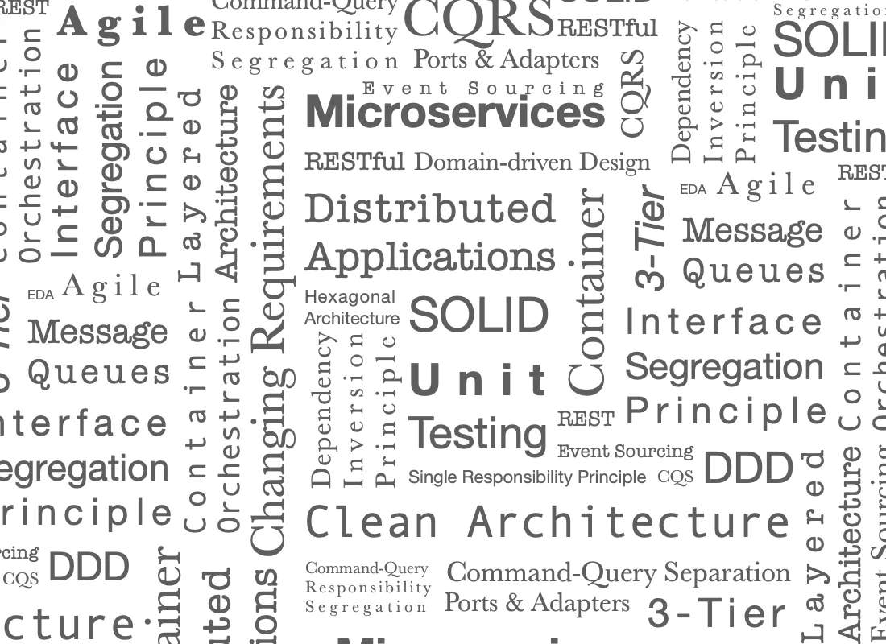

Empfohlene Literatur
---------------------

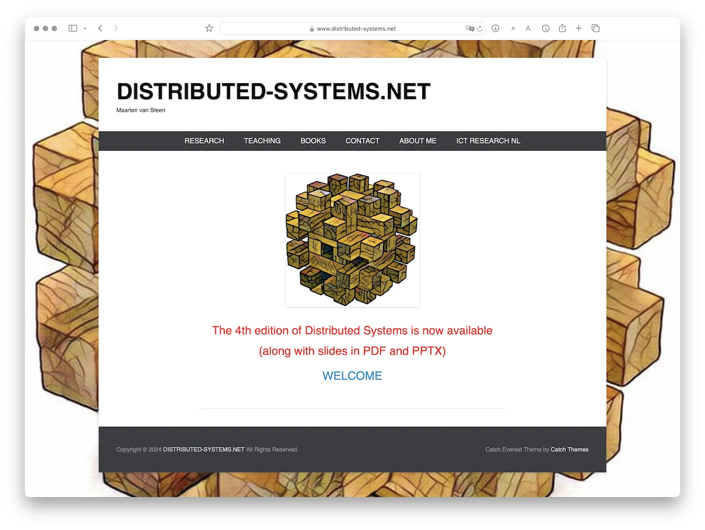

.. supplemental::

    Ergänzend bzw. für interessierte Studierende:

    .. image:: screenshots/microservices.jpg
        :align: center
        :class: trbl-shadow

Podcast: `SE-Radio <https://se-radio.net>`__
-----------------------------------------------------------

Podcast: `Thoughtworks Technology Podcast <https://www.thoughtworks.com/en-de/insights/podcasts/technology-podcasts>`__
-------------------------------------------------------------------------------------------------------------------------------------

.. class:: new-section transition-fade

Verteilte Systeme: Beschreibung und Eigenschaften
------------------------------------------------------------

Verteilt vs. Dezentralisiert
-------------------------------------------------------------------

.. supplemental::

    :ger:`Verteilt vs. Dezentralisiert` ≘ :eng:`Distributed vs. Decentralized`

    .. admonition:: Zwei Ansichten zur Realisierung verteilter Systeme

        - **Integrative Sichtweise**: Verbindung bestehender (lokal) vernetzter Computersysteme zu einem größeren System.
        - **Expansive Sichtweise**: ein bestehendes vernetztes Computersystem wird um zusätzliche Computer erweitert.

    .. admonition:: Zwei Definitionen

        - Ein **dezentrales System** ist ein vernetztes Computersystem, in dem Prozesse und Ressourcen *notwendigerweise* über mehrere Computer verteilt sind.
        - Ein **verteiltes System** ist ein vernetztes Computersystem, bei dem Prozesse und Ressourcen *hinreichend* über mehrere Computer verteilt sind.

Häufige Missverständnisse bzgl. zentralisierter Systeme
--------------------------------------------------------

.. class:: incremental-list

1. **Zentralisierte Lösungen lassen sich nicht skalieren**

   Es gilt zwischen logischer und physischer Zentralisierung zu unterscheiden. Zum Beispiel ist das *Domain Name System*:

   - logisch zentralisiert
   - physisch (massiv) verteilt
   - dezentralisiert über mehrere Organisationen

2. **Zentralisierte Lösungen haben einen Single Point of Failure**

   Im Allgemeinen nicht zutreffend (z. B. DNS).

   Ein einzelne mögliche Fehlerquelle ist weiterhin oft:

   - leichter zu verwalten
   - einfacher robuster zu machen

.. supplemental::

    .. warning::

        Es gibt viele, schlecht begründete Missverständnisse in Bezug auf, z. B. Skalierbarkeit, Fehlertoleranz oder Sicherheit. Wir müssen Fähigkeiten entwickeln, mit denen verteilte Systeme leicht verstanden werden können, um solche Missverständnisse zu vermeiden.

Sichtweisen auf verteilte Systeme
----------------------------------

**Verteilte Systeme sind komplex.**

.. class:: incremental-list

- Welche Architekturen und „Architekturellen Stile“ (:eng:`architectural styles`) gibt es?
- Prozesse: Welche Art von Prozessen gibt es und wie sind deren Beziehungen?
- Kommunikation: Welche Möglichkeiten zum Austausch von Daten gibt es?
- Koordinierung: Wie erfolgt die Koordinierung der beteiligten Systeme?
- Benennung: Wie identifiziert man Ressourcen?
- Konsistenz und Replikation: Welche Tradeoffs müssen in Hinblick auf die Konsistenz der Daten, der Replikation derselben und der Performance getroffen werden?
- Fehlertoleranz: Wie kann eine Aufrechterhaltung des Betriebs auch bei Teilausfällen gewährleistet werden?
- Sicherheit: Wie kann der autorisierte Zugriff auf Ressourcen gewährleistet werden?

Entwurfsziele verteilter Systeme
----------------------------------

.. class:: incremental-list dhbw-list

- `gemeinsame Nutzung von Ressourcen`_
- `Verteilungstransparenz`_ (:eng:`Distribution Transparency`)
- `Offenheit`_
- `Skalierbarkeit`_

.. class:: new-subsection transition-fade

Gemeinsame Nutzung von Ressourcen
------------------------------------

Gemeinsame Nutzung von Ressourcen - Examples
---------------------------------------------

.. class:: incremental-list

- Cloud-basierter gemeinsamer Speicher und Dateien
- Peer-to-Peer-unterstütztes Multimedia-Streaming
- Gemeinsame E-Mail-Dienste (z. B. ausgelagerte E-Mail-Systeme)
- Gemeinsames Webhosting (z. B. *Content Distribution Networks*)

.. class:: new-subsection transition-fade

Verteilungstransparenz
-------------------------------------------------------------

(:eng:`Distribution Transparency`)

Definition
----------------------------------------------------------

.. definition::

    .. rubric:: Verteilungstransparenz

    Transparenz beschreibt die Eigenschaft, dass ein verteiltes System versucht, die Tatsache zu verbergen, dass seine Prozesse und Ressourcen physisch auf mehrere Computer verteilt sind, die möglicherweise durch große Entfernungen voneinander getrennt sind.

.. container:: incremental margin-top-2em

  Die Verteilungstransparenz wird durch viele verschiedene Techniken von der so genannten *Middleware* realisiert - einer Schicht zwischen Anwendungen und Betriebssystemen.

Aspekte der Verteilungstransparenz
----------------------------------------------------------------------------

.. csv-table::
    :class: incremental-table-rows booktabs
    :stub-columns: 1

    Datenzugriff, Verbergen von Unterschieden in der Datendarstellung und der Art des Zugriffs auf ein lokales bzw. entferntes Objekt
    Ort der Datenhaltung, "Verbergen, wo sich ein Objekt befindet"
    Verschieben, "Verbergen, dass ein Objekt während der Verwendung an einen anderen Ort verschoben werden kann"
    Migration, "Verbergen, dass ein Objekt an einen anderen Ort verschoben werden kann"
    Replikation, "Verbergen, dass ein Objekt repliziert wird"
    Nebenläufigkeit, "Verbergen, dass ein Objekt von mehreren unabhängigen Benutzern gemeinsam genutzt werden kann"
    Fehlertransparenz, Verbergen des Ausfalls und der Wiederherstellung eines Objekts

.. supplemental::

    Datendarstellung: Big-Endian vs. Little-Endian; ASCII vs. Iso-Latin 8859-1 vs. UTF-8

Grad der erreichbaren Verteilungstransparenz
--------------------------------------------

.. observation::

    Eine vollständige Verteilungstransparenz ist nicht erreichbar.

.. container:: incremental

    Jedoch kann auch eine sehr hohe Verteilungstransparenz bereits hohe Kosten nach sich ziehen.

.. class:: incremental-list

- Es gibt Kommunikationslatenzen, die nicht verborgen werden können.
- Es ist (theoretisch und praktisch) unmöglich, Ausfälle von Netzen und Knoten vollständig zu verbergen.
- Man kann einen langsamen Computer nicht von einem ausgefallenen Computer unterscheiden.
- Man kann nie sicher sein, dass ein Server tatsächlich eine Operation durchgeführt hat, bevor er abgestürzt ist.
- Vollständige Transparenz kostet Performance und legt die Verteilung des Systems offen.

  - Die Replikate exakt auf dem Stand des Masters zu halten, kostet Zeit
  - Schreibvorgänge werden zur Fehlertoleranz sofort auf die Festplatte übertragen

Die Verteilung offen zu legen, kann Vorteile bringen
-----------------------------------------------------

.. class:: incremental-list

- Nutzung von standortbezogenen Diensten (Auffinden von Freunden in der Nähe)
- Beim Umgang mit Benutzern in verschiedenen Zeitzonen
- Wenn es für einen Benutzer einfacher ist, zu verstehen, was vor sich geht (wenn z. B. ein Server lange Zeit nicht antwortet, kann er als ausgefallen gemeldet werden).

.. observation::
    :class: incremental

    Verteilungstransparenz ist ein hehres Ziel, aber oft schwer zu erreichen, und häufig auch nicht erstrebenswert.

.. class:: new-subsection transition-fade

Offene verteilte Systeme
-------------------------------------------------------------

.. _offenheit:

\

Offene verteilte Systeme
----------------------------------

.. definition::

    Ein offenes verteiltes System bietet Komponenten an, die leicht von anderen Systemen verwendet oder in andere Systeme integriert werden können.

    Ein offenes verteiltes System besteht selbst oft aus Komponenten, die von woanders stammen.

.. container:: incremental

    Offene verteilte Systeme müssen in der Lage sein, mit Diensten anderer (offener) Systeme zu interagieren, unabhängig von der zugrunde liegenden Umgebung:

    .. class:: incremental-list

    - Sie sollten wohl-definierte Schnittstellen korrekt realisieren
    - Sie sollten leicht mit anderen Systemen interagieren können
    - Sie sollten die Portabilität von Anwendungen unterstützen
    - Sie sollten leicht erweiterbar sein

.. supplemental::

    Ein Beispiel sind Authentifizierungsdienste, die von vielen verschiedenen Anwendungen genutzt werden können.

Vorgaben/Richtlinien vs. Umsetzungen
--------------------------------------------------

.. supplemental::

    :eng:`Policies vs. Mechanisms` ≘ :ger:`Vorgaben/Richtlinien vs. Umsetzungen`

.. rubric:: Richtlinien für die Umsetzung von Offenheit

.. class:: incremental-list

- Welchen Grad an Konsistenz benötigen wir für Daten im Client-Cache?
- Welche Operationen erlauben wir heruntergeladenem Code?
- Welche QoS-Anforderungen passen wir angesichts schwankender Bandbreiten an?
- Welchen Grad an Geheimhaltung benötigen wir für die Kommunikation?

.. class:: incremental

.. rubric:: Mechanismen bzgl. der Umsetzung von Offenheit

.. class:: incremental-list

- Ermöglichung der (dynamischen) Einstellung von Caching-Richtlinien
- Unterstützung verschiedener Vertrauensstufen für mobilen Code
- Bereitstellung einstellbarer QoS-Parameter pro Datenstrom
- Angebot verschiedener Verschlüsselungsalgorithmen

.. supplemental::

    Die harte Kodierung von Richtlinien vereinfacht oft die Verwaltung und reduziert die Komplexität des Systems. Hat jedoch den Preis geringerer Flexibilität.

Sicherheit in verteilten Systemen - Schutzziele
-------------------------------------------------

.. observation::

    Ein verteiltes System, das nicht sicher ist, ist nicht verlässlich.

.. container:: incremental

    .. rubric:: Grundlegende Schutzziele

    :Vertraulichkeit: Informationen werden nur an autorisierte Parteien weitergegeben.
    :Integrität: Änderungen an den Werten eines Systems dürfen nur auf autorisierte Weise vorgenommen werden können.

.. supplemental::

    Zusammen mit dem dritten Schutzziel: Verfügbarkeit, bilden diese drei Schutzziele die CIA-Triade der Informationssicherheit (:eng:`Confidentiality, Integrity, and Availability`).

Sicherheit in verteilten Systemen - Autorisierung, Authentifizierung, Vertrauen
-------------------------------------------------------------------------------------

.. class:: incremental-list

:Authentifizierung `Authentication`:eng:: Prozess zur Überprüfung der Korrektheit einer behaupteten Identität.
:Autorisierung `Authorization`:eng:: Verfügt eine identifizierte Einheit über die richtigen Zugriffsrechte?
:Vertrauen `Trust`:eng:: Eine Komponente kann sich sicher sein, dass eine andere Komponente bestimmte Handlungen gemäß den Erwartungen ausführt.

Sicherheit - Verschlüsselung und Signaturen
---------------------------------------------

Es geht im Wesentlichen um das Ver- und Entschlüsseln von Daten (:math:`X`) mit Hilfe von Schlüsseln.

.. deck::

    .. card:: padding-1em

        :math:`E(K,X)` bedeutet, dass wir die Nachricht X mit dem Schlüssel :math:`K`  verschlüsseln (:eng:`encryption`).

        :math:`D(K,X)` bezeichnet die Umkehrfunktion, die die Daten wieder entschlüsselt (:eng:`decryption`).

    .. card:: trbl-shadow padding-1em

        .. rubric:: Symmetrische Verschlüsselung

        Der Schlüssel zur Verschlüsselung ist identisch mit dem Schlüssel zur Entschlüsselung (:eng:`decryption` (:math:`D`)).

        .. math::
            X = D(K,E(K,X))

    .. card:: trbl-shadow padding-1em

        .. rubric:: Asymmetrische Verschlüsselung

        Wir unterscheiden zwischen privaten (:math:`PR`) und öffentlichen Schlüsseln (:math:`PU`) (:math:`PU` :math:`\neq` :math:`PR`). Ein privater und ein öffentlicher Schlüssel bilden immer ein Paar. Der private Schlüssel ist immer geheim zu halten.

        .. deck:: incremental

            .. card::

                **Verschlüsselung von Nachrichten**

                Alice sendet eine Nachricht an Bob mit Hilfe des öffentlichen Schlüssels von Bob.

                .. math::
                    Y = E(PU_{Bob},X) \\
                    X = D(PR_{Bob},Y)

            .. card::

                **Signierung von Nachrichten**

                Alice „signiert“ (:math:`S`) eine Nachricht mit ihrem privaten Schlüssel.

                .. math::
                    Y = E(PR_{Alice},X) \\
                    X = D(PU_{Alice},Y)

Sicherheit - Sicheres Hashing
-------------------------------------------------------

Eine sichere Hash-Funktion :math:`Digest(X)` gibt eine Zeichenkette fester Länge (:math:`H`) zurück.

- Jede Änderung - noch so klein - der Eingabedaten führt zu einer völlig anderen Zeichenkette.
- Bei einem Hash-Wert ist es rechnerisch unmöglich die ursprüngliche Nachricht X basierend auf :math:`Digest(X)` zu finden.

.. container:: incremental

    .. rubric:: Signieren von Nachrichten

    Alice signiert eine Nachricht :math:`X` mit ihrem privaten Schlüssel.

    .. math::
        Alice: [E(PR_{Alice},H=Digest(X)),X] \\

    Bob prüft die Nachricht :math:`X` auf Authentizität:

    .. math::
        Bob: D(PU_{Alice},H) \stackrel{?}{=} Digest(X)

.. supplemental::

    :ger:`Sicheres Hashing` ≘ :eng:`Secure Hashing`

.. class:: exercises

Zwischenfrage
----------------

.. exercise:: Verschlüsselung mit Public-Private-Key Verfahren

    Wenn Alice eine mit Bobs öffentlichen Schlüssel verschlüsselte Nachricht an Ihn schickt, welches Sicherheitsproblem kann dann aufkommen?

    .. solution::
        :pwd: nicht sicher

        Alice kann nicht sicher sein, dass Ihre Nachricht nicht ausgetauscht wird! Jeder, der die Nachricht abfängt kann die Nachricht verwerfen und eine eigene mit Bobs öffentlichen Schlüssel verschlüsseln. Je nach Hintergrundwissen der dritten Person kann diese Nachricht ggf. auch so aussehen, als ob sie von Alice stammt.

        Bob kann also nicht sicher sein, dass die Nachricht von Alice stammt.

.. class:: new-subsection transition-fade

Skalierbarkeit
----------------------

Skalierbarkeit in verteilten Systemen
-----------------------------------------

Wir können mind. drei Arten von Skalierbarkeit unterscheiden:

.. class:: incremental-list

- Anzahl der Benutzer oder Prozesse (Skalierbarkeit der Größe)
- Maximale Entfernung zwischen den Knoten (geografische Skalierbarkeit)
- Anzahl der administrativen Domänen (administrative Skalierbarkeit)

Ursachen für Skalierbarkeitsprobleme bei zentralisierten Lösungen:
---------------------------------------------------------------------

- Die Rechenkapazität, da diese begrenzt ist durch die Anzahl CPUs
- Die Speicherkapazität, einschließlich der Übertragungsrate zwischen CPUs und Festplatten
- Das Netzwerk zwischen dem Benutzer und dem zentralisierten Dienst

.. supplemental::

    Die Skalierbarkeit bzgl. der Größe kann oft durch den Einsatz von mehr und leistungsstärkeren Servern, die parallel betrieben werden, erreicht werden.

    Die geografische und administrative Skalierbarkeit ist häufig eine größere Herausforderung.

Formale Analyse der Skalierbarkeit zentralisierter Systeme
------------------------------------------------------------

Ein zentralisierter Dienst kann als einfaches Warteschlangensystem modelliert werden:

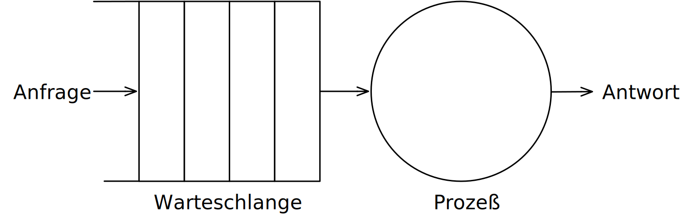

.. rubric:: Annahmen

Die Warteschlange hat eine unendliche Kapazität; d. h. die Ankunftsrate der Anfragen wird nicht durch die aktuelle Länge der Warteschlange oder durch das, was gerade bearbeitet wird, beeinflusst.

Formale Analyse der Skalierbarkeit zentralisierter Systeme
------------------------------------------------------------

.. grid::

    .. cell::

        - Ankunftsrate der Anfragen:

          :math:`\lambda` *(Anfragen pro Sekunde)*

        - Verarbeitungskapazität des Services:

          :math:`\mu` *(Anfragen pro Sekunde)*

          Anteil der Zeit mit :math:`x` Anfragen im System:

          .. math::

                p_x  = \bigl(1 - \frac{\lambda}{\mu}\bigr)\bigl(\frac{\lambda}{\mu}\bigr)^x

    .. cell::

        .. figure:: drawings/number_of_requests_in_system.svg
            :align: center

            # Anfragen in Bearbeitung und in Warteschlange

            Z. B. ist der Anteil der Zeit, in der der Rechner *idle* ist (d. h. :math:`p_0`) : 90 %, 60 % und 30 %.

            .. presenter-note::

                :math:`p_0`; d. h.es gibt keine bzw. 0 Anfragen.

.. presenter-note::

    Anschaulich kann man die Formel:
    :math:`p_x  = \bigl(1 - \frac{\lambda}{\mu}\bigr)\bigl(\frac{\lambda}{\mu}\bigr)^x` so verstehen, dass die Wahrscheinlichkeit, dass sich :math:`x` Anfragen im System befinden, mit der Anzahl der Anfragen im System abnimmt. Deswegen gilt :math:`\bigl(\frac{\lambda}{\mu}\bigr)^x` weiterhin müssen wir modellieren, dass es „nur“ zwei Anfragen gibt (d. h. das System ist sonst `idle`). Deswegen müssen wir noch mit :math:`p_0 = 1 - \frac{\lambda}{\mu}` multiplizieren.

.. class:: smaller

Formale Analyse der Skalierbarkeit zentralisierter Systeme
------------------------------------------------------------

.. note::

    :math:`x` = # Anfragen im Sys.

    .. math::
        p_x  = \bigl(1 - \frac{\lambda}{\mu}\bigr)\bigl(\frac{\lambda}{\mu}\bigr)^x

:math:`U` ist der Anteil der Zeit, in der ein Dienst ausgelastet ist:

.. math::

    U = \sum_{x > 0} p_x = 1 - p_0 = \frac{\lambda}{\mu} \Rightarrow p_x = (1-U) U^x

.. container:: incremental

    Durchschnittliche Anzahl der Anfragen:

    .. math::

        \bar{N} = \sum_{x\geq 0} x \cdot p_x
        = \sum_{x \geq 0} x \cdot (1-U)U^x
        = (1-U)\sum_{x\geq 0} x\cdot U^x
        = \frac{(1-U)U}{(1-U)^2} = \frac{U}{1-U}

.. container:: incremental

    Durchschnittlicher Durchsatz:

    .. math::

        X = \underbrace{U \cdot \mu}_{\mbox{ausgelastet}} + \underbrace{(1-U) \cdot 0}_{\mbox{ungenutzt}} = \frac{\lambda}{\mu} \cdot \mu = \lambda

.. supplemental::

    Für eine `unendliche geometrische Reihe <https://de.wikipedia.org/wiki/Geometrische_Reihe#Konvergenz_und_Wert_der_geometrischen_Reihe>`__ mit dem Quotienten :math:`U` gilt:

    .. math::
        \sum_{k\geq 0} k\cdot U^k  = \frac{U}{(1-U)^2}

    Darstellung der durchschnittlichen Anzahl an Anfragen im System in Abhängigkeit von der Auslastung :math:`U`:

    .. image:: drawings/average_number_of_requests_in_system.svg
        :align: center

Formale Analyse der Skalierbarkeit zentralisierter Systeme
------------------------------------------------------------

.. class:: columns

- Die Antwortszeit (:eng:`response time`) ist die Gesamtzeit für die Bearbeitung einer Anfrage

  .. math::

    R = \frac{\bar{N}}{X} = \frac{S}{1-U} \Rightarrow \frac{R}{S} = \frac{1}{1-U}

  mit :math:`S = \frac{1}{\mu}` für die durchschnittliche Servicezeit.

- \

  .. image:: drawings/response_time.svg
        :alt: Antwortszeit in Abhängigkeit der Auslastung

.. class:: incremental-list

- Wenn :math:`U` klein ist, liegt die Antwortzeit nahe bei 1; d. h.eine Anfrage wird sofort bearbeitet.
- Wenn :math:`U` auf 1 ansteigt, kommt das System zum Stillstand.

Probleme der geografischen Skalierbarkeit
--------------------------------------------

- Viele verteilte Systeme gehen von synchronen Client-Server-Interaktionen aus und dies verhindert einen Übergang vom LAN zum WAN. Die Latenzzeiten können prohibitiv sein, wenn der Client auf eine Anfrage lange warten muss.

.. class:: incremental-list

- WAN-Verbindungen sind oft von Natur aus unzuverlässig.

Probleme der administrativen Skalierbarkeit
--------------------------------------------

.. observation::

    Widersprüchliche Richtlinien in Bezug auf Nutzung (und damit Bezahlung), Verwaltung und Sicherheit

.. deck:: incremental

    .. card::

        .. rubric:: Beispiele

        - Grid Computing: gemeinsame Nutzung teurer Ressourcen über verschiedene Domänen hinweg.
        - Gemeinsam genutzte Geräte: Wie kontrolliert, verwaltet und nutzt man ein gemeinsam genutztes Radioteleskop, das als groß angelegtes gemeinsames Sensornetz konstruiert wurde?

    .. card::

        .. rubric:: Ausnahme

        Verschiedene Peer-to-Peer-Netze [#]_ bei denen Endnutzer zusammenarbeiten und nicht Verwaltungseinheiten:

        - File-Sharing-Systeme (z. B. auf der Grundlage von BitTorrent)
        - Peer-to-Peer-Telefonie (frühe Versionen von Skype)

        .. [#] :eng:`Peer` ist im hier im Sinne von „Gleichgestellter“ zu verstehen. D. h. wir haben ein Netz von gleichgestellten Rechnern.

Ansätze, um Skalierung zu erreichen
------------------------------------

.. deck::

    .. card::

        **Verbergen von Kommunikationslatenzen** durch:

        - Nutzung asynchroner Kommunikation
        - Verwendung separater *Handler* für eingehende Antworten

        .. observation::
            :class: incremental

            Dieses Modell ist jedoch nicht immer anwendbar.

    .. card::

        **Partitionierung von Daten und Berechnungen über mehrere Rechner.**

        - Verlagerung von Berechnungen auf Clients
        - Dezentrale Namensgebungsdienste (DNS)
        - Dezentralisierte Informationssysteme (WWW)

Verlagerung von Berechnungen auf Clients
------------------------------------------

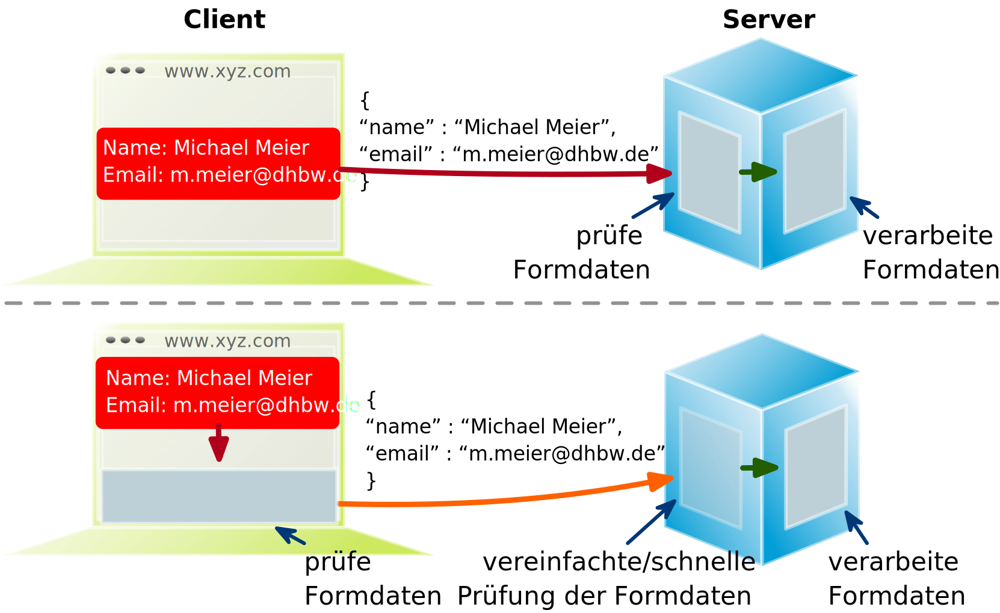

Ansätze, um Skalierung zu erreichen
------------------------------------

**Einsatz von Replikation und Caching, um Kopien von Daten auf verschiedenen Rechnern verfügbar zu machen.**

.. class:: incremental-list

- replizierte Dateiserver und Datenbanken
- gespiegelte Websites
- Web-Caches (in Browsern und Proxies)
- Datei-Caching (auf Server und Client)

Herausforderungen bei der Replikation
---------------------------------------

.. class:: incremental-list

- Mehrere Kopien (zwischengespeichert (:eng:`cached`) oder repliziert) führen zwangsläufig zu Inkonsistenzen. Die Änderung einer Kopie führt dazu, dass sich diese Kopie von den anderen unterscheidet.
- Zur Erreichung von Konsistenz ist bei jeder Änderung eine globale Synchronisierung erforderlich.
- Die globale Synchronisierung schließt Lösungen im großen Maßstab aus.

.. supplemental::

    Inwieweit Inkonsistenzen toleriert werden können, ist anwendungsspezifisch. Können diese jedoch toleriert werden, dann kann der Bedarf an globaler Synchronisation verringert werden.

Paralleles Rechnen (:eng:`Parallel Computing`)
------------------------------------------------

.. class:: columns

- Multiprozessor

  .. image:: drawings/multiprocessor-vs-multicomputer/multiprocessor.svg
            :align: center

- Multicomputer

  .. image:: drawings/multiprocessor-vs-multicomputer/multicomputer.svg
            :align: center

.. supplemental::

    Das verteilte Hochleistungsrechnen begann mit dem parallelen Rechnen.

    **Verteilte Systeme mit gemeinsamem Speicher** (:eng:`Multicomputer with shared memory`) als alternative Architektur haben die Erwartungen nicht erfüllt und sind daher nicht mehr relevant.

Amdahls Gesetz - Grenzen der Skalierbarkeit
-----------------------------------------------------

.. deck::

    .. card::

        .. class:: list-with-explanations

        - Lösen von **fixen Problemen** in möglichst kurzer Zeit

            (Beispiel: Hochfahren (:eng:`Booten`) eines Rechners. Inwieweit lässt sich durch mehr CPUs/Kerne die Zeit verkürzen?)
        - Es modelliert die erwartete Beschleunigung (*Speedup*) eines zum Teil parallelisierten/parallelisierbaren Programms relativ zu der nicht-parallelisierten Variante

        .. definition::
            :class: encapsulate-floats

            .. note::

                :math:`C` = Anzahl CPUs

                :math:`P` = Parallelisierungsgrad in Prozent

                :math:`S` = Speedup

            :math:`S(C) = \frac{1}{(1-P) + \frac{P}{C}}`

    .. card::

        .. image:: drawings/amdahl.svg
            :alt: Amdahls Gesetz visualisiert
            :align: center

Gustafsons Gesetz - Grenzen der Skalierbarkeit
-----------------------------------------------------

.. class:: list-with-explanations

- Lösen von Problemen mit (sehr) großen, sich strukturell wiederholenden Datensätzen in **fixer Zeit**; der serielle Anteil des Programms wird als  konstant angenommen.

  (Beispiel: Erstelle innerhalb der nächsten 24 Stunden die Wettervorhersage für übermorgen. Inwieweit lässt sich durch mehr CPUs/Rechner die Präzision der Vorhersage verbessern?)

.. container:: encapsulate-floats incremental

    .. note::
        :class: width-60 dd-margin-left-2em

        :`C`:math::  Anzahl CPUs

        :`P`:math::  Parallelisierungsgrad in Abhängigkeit von der Problemgröße n

        :`S`:math::  Speedup

    Beschleunigung (Speedup) eines parallelisierten Programms relativ zu der nicht-parallelisierten Variante: :math:`S(C) = 1 + P(n) \cdot (C-1)`

.. container:: incremental

    .. example::

       Sei der Parallelisierungsgrad ab einer relevanten Problemgröße :math:`n` 80 %. Dann ergibt sich für 4 CPUs ein Speedup von :math:`(1+0.8*3) = 3.4`, für 8 CPUs ein Speedup von 6.6 und für 16 CPUs ein Speedup von 13.

.. class:: exercises

Übung
----------------

.. exercise:: Speedup berechnen

    Sie sind Pentester und versuchen in ein System einzudringen indem Sie die Passwörter der Administratoren angreifen. Momentan setzen Sie dazu 2 Grafikkarten mit je 2048 Compute Units ein. Der serielle Anteil des Angriffs beträgt 10 %. Wie hoch ist der Speedup, den Sie erwarten können, wenn Sie zwei weitere vergleichbare Grafikkarten mit weiteren 2048 Compute Units je GPU hinzufügen?

      Hintergrund: Die Angriffe sind hochgradig parallelisierbar und hängen effektiv von der Anzahl an CUs ab. Die Grafikkarten sind in der Lage, die Angriffe effektiv zu beschleunigen.

    .. solution:: Berechnung des Speedup
        :pwd: so schnell wird's

        Es handelt sich hierbei um ein Problem mit sich strukturell wiederholenden Datensätzen, d. h. Gustafsons Gesetz ist anwendbar. Der serielle Anteil beträgt 10 %, d. h.der Parallelisierungsgrad beträgt 90 %. Der Speedup beträgt dann:

        .. math::

                S(2*2048=4096) = 1 + 0.9 * 4095 = 3.686,5

                S((2*2048)+(2*2048)=8192) = 1 + 0.9 * 8191 = 7.372,9

                S(4096) / S(2048) \approx 1,9999457495

                S(8192) / S(4096) \approx 1,999972874

        Das Rechnen mit GPUs als solches, d. h. mit 2-GPUs vs. 4-GPUs führt zu einem geringeren Speedup, da der serielle Anteil des Angriffs noch mehr in Gewicht fällt.

.. class:: new-section transition-fade

Anforderungen an verteilter Systeme
-------------------------------------

Verlässlichkeit verteilter Systeme
------------------------------------------------------------

.. container:: peripheral

    (:eng:`Dependability`)

.. admonition:: Abhängigkeiten

    Eine **Komponente**\ [#]_ stellt ihren **Clients** **Dienste** zur Verfügung. Dafür kann die Komponente jedoch wiederum Dienste von anderen Komponenten benötigen und somit ist eine Komponente  von einer anderen Komponente abhängig (:eng:`depend`).

.. definition::

    Eine Komponente :math:`C` hängt von :math:`C^*` ab, wenn die Korrektheit des Verhaltens von :math:`C` von der Korrektheit des Verhaltens von :math:`C^*` abhängt.

.. [#] Komponenten seien Prozesse oder Kanäle.

Anforderungen an die Verlässlichkeit verteilter Systeme
------------------------------------------------------------

.. csv-table::
    :class: incremental-table-rows booktabs
    :header: "Anforderung", "Beschreibung"

    "Verfügbarkeit", "Das System ist nutzbar."
    "Zuverlässigkeit", "Kontinuität der korrekten Leistungserbringung."
    "Sicherheit
    (:eng:`Safety`\ [#]_)", "Niedrige Wahrscheinlichkeit für ein katastrophales Ereignis"
    "Wartbarkeit", "Wie leicht kann ein fehlgeschlagenes System wiederhergestellt werden?"

.. [#] :eng:`Safety` und :eng:`Security` werden beide im Deutschen gleich mit Sicherheit übersetzt und sind daher leicht zu verwechseln. :eng:`Safety` bezieht sich auf die Sicherheit von Personen und Sachen, während :eng:`Security` sich auf die Sicherheit von Daten und Informationen bezieht.

.. class:: smaller-slide-title smaller

Zuverlässigkeit (:eng:`Reliability`) vs. Verfügbarkeit (:eng:`Availability`) in verteilten Systemen
----------------------------------------------------------------------------------------------------

.. rubric:: Verlässlichkeit :math:`R(t)` der Komponente :math:`C`

Bedingte Wahrscheinlichkeit, dass :math:`C` während :math:`[0,t)` korrekt funktioniert hat, wenn :math:`C` zum Zeitpunkt :math:`T = 0` korrekt funktionierte.

.. compound::
    :class: incremental

    .. rubric:: Traditionelle Metriken

    .. class:: incremental-list

    - Mittlere Zeit bis zum Versagen (:eng:`Mean Time to Failure` (:math:`MTTF`)):

      Die durchschnittliche Zeit bis zum Ausfall einer Komponente.

    - Mittlere Zeit bis zur Reparatur (:eng:`Mean Time to Repair` (:math:`MTTR`)):

      Die durchschnittliche Zeit, die für die Reparatur einer Komponente benötigt wird.

    - Mittlere Zeit zwischen Ausfällen (:eng:`Mean Time Between Failures` (:math:`MTBF`)):

      :math:`MTTF + MTTR = MTBF`.

.. supplemental::

    - Zuverlässigkeit: Wie wahrscheinlich ist es, dass ein System *korrekt* arbeitet?
    - Verfügbarkeit: Wie wahrscheinlich ist es, dass ein System zu einem bestimmten Zeitpunkt verfügbar ist?

    .. rubric:: MTBF vs. MTTR

    Wenn die MTTF einer Komponente 100 Stunden beträgt und die MTTR 10 Stunden beträgt, dann ist die MTBF :math:`= MTTF + MTTR = 100 + 10 = 110` Stunden.

MapReduce - Programmiermodell und Middleware für paralleles Rechnen
---------------------------------------------------------------------

.. class:: incremental-list list-with-explanations

- MapReduce ist ein Programmiermodel und eine entsprechende Implementierung (ein Framework ursprünglich entwickelt von Google) zur Verarbeitung sehr großer Datenmengen (ggf. TBytes).
- Programme, die mit Hilfe von MapReduce implementiert werden, werden automatisch parallelisiert und auf einem großen Cluster von handelsüblichen Rechnern ausgeführt.

  Die Laufzeitumgebung übernimmt:

  - Partitionierung der Eingabedaten und Verteilung selbiger auf die Rechner des Clusters
  - Einplanung und Ausführung der “Map”- und “Reduce”- Funktionen auf den Rechnern des Clusters
  - Behandlung von Fehlern und die Kommunikation zwischen den Rechnern

.. hint::
    :class: incremental

    Nicht alle Arten von Berechnungen können mit Hilfe von MapReduce durchgeführt werden.

.. class:: smaller-slide-title

MapReduce - Visualisierung und Beispiel
----------------------------------------------------------

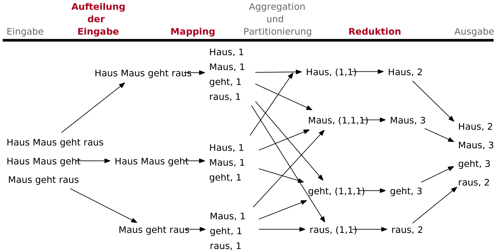

.. supplemental::

    Hier ist es die Berechnung der Häufigkeit von Wörtern in einem sehr großen Datensatz.

    Ein weiteres kanonisches Beispiel ist die Berechnung eines invertierten Indexes.

.. class:: exercises

Übung: Verfügbarkeit und Ausfallwahrscheinlichkeit
------------------------------------------------------

.. exercise:: Ausfallwahrscheinlichkeit

    Gegeben sei ein größeres verteiltes System bestehend aus 500 unabhängigen Rechnern, die auch unabhängig voneinander ausfallen. Im Mittel ist jeder Rechner innerhalb von zwei Tagen zwölf Stunden lang nicht erreichbar.

    (a) Bestimmen Sie die Intaktwahrscheinlichkeit eines einzelnen Rechners.
    (b) Ein Datensatz ist aus Gründen der Fehlertoleranz auf drei Rechnern identisch repliziert gespeichert. Wie hoch ist seine mittlere Zugriffsverfügbarkeit beim Lesen?
    (c) Auf wie vielen Rechnern müssen Sie identische Kopien dieses Datensatzes speichern, damit die mittlere Zugriffsverfügbarkeit beim Lesen bei 99,999 % liegt
    (d) Für wie viele Minuten im Jahr (mit 365 Tagen) ist im Mittel bei einer Verfügbarkeit von 99,999 % *kein Lesen des Datensatzes* möglich?

    .. solution:: Lösung
        :pwd: Laufend?

        (a) Die Verfügbarkeit eines einzelnen Rechners beträgt p = 36h/48h = 0,75
        (b) Die mittlere Zugriffsverfügbarkeit (für :math:`p = 0.75`) beim Lesen beträgt :math:`1 - (1 - p)^3 = 0,984375`; :math:`(1-p)` ist die Ausfallwahrscheinlichkeit.
        (c) (Erinnerung: :math:`log_a(u^v) = v \cdot log_a(u)`).

            Die Wahrscheinlichkeit, dass alle gleichzeitig ausfallen, muss kleiner(gleich) der erlaubten Nichtverfügbarkeit sein:  :math:`(1-p)^x \leq (1-0,99999) \Leftrightarrow x \cdot log(1-p) \geq log(1-0,99999)`

            :math:`\Rightarrow x \geq log(1-0,99999)/log(1-p) \approx 8,3`

            Die Anzahl der Rechner, auf denen der Datensatz repliziert werden muss, beträgt :math:`\lceil \frac{log(1-0,99999)}{log(1-p)} \rceil = 9`
        (d) Bei 365 Tagen im Jahr: (1-0,99999) * 365 * 24 * 60 = 5,256 Minuten

.. class:: new-section transition-fade

Klassifikation Verteilte Systeme
-------------------------------------

Cluster Computing
--------------------

Eine Gruppe von „High-End-Systemen“, die über ein LAN verbunden sind.

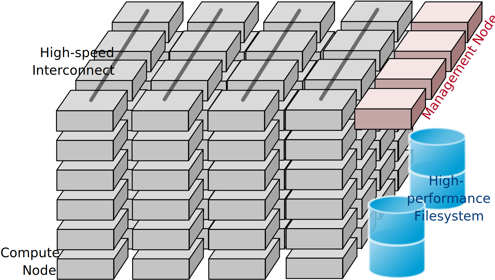

.. supplemental::

    Die einzelnen Rechner/Compute Nodes sind oft identisch (Hardware und Software) und werden von einem Verwaltungsknotenpunkt (:eng:`management node`) verwaltet.

Grid Computing
-------------------

Weiterführung des Cluster Computing.

- Viele heterogene, weit und über mehrere Organisationen verstreute Knotenpunkte.
- Die Knotenpunkte sind über das WAN verbunden.
- Die Zusammenarbeit erfolgt im Rahmen einer virtuellen Organisation.

.. supplemental::

    (Volunteer) Grid Computing - Beispiel:

    https://scienceunited.org

    https://einsteinathome.org

.. class:: dd-margin-left-2em

Grundlegende Architektur für Grid-Computing
---------------------------------------------

.. grid::

    .. cell::

        .. class:: no-margin

        :Anwendungen: Enthält tatsächliche Grid-Anwendungen in einer einzelnen Organisation.
        :Collective Layer: Verwaltet den Zugriff auf mehrere Ressourcen: Auffindung, Einplanung und Replikation.
        :Konnektivitätsschicht: Kommunikations- / Transaktions- /Authentifizierungsprotokolle, z. B. für die Übertragung von Daten zwischen Ressourcen.

    .. cell::

        .. image:: drawings/architecture-for-grid-computing.svg
            :loading: embed

.. class:: no-margin

:Ressourcenschicht: Verwaltet eine Ressource, z. B. Erstellen von Prozessen oder Lesen von Daten.
:Fabric Layer: Bietet Schnittstellen zu lokalen Ressourcen (zur Abfrage von Status und Fähigkeiten, Sperren usw.)

.. supplemental::

    Auffindung (:eng:`Discovery`), Einplanung (:eng:`Scheduling`)

Peer-to-Peer-Systeme
----------------------

:Vision: „Das Netzwerk ist der Computer.“ Es gibt einen Datenbestand, der immer weltweit erreichbar ist.
:Idee:
   Keine dedizierten Clients und Server, jeder Teilnehmer (Peer) ist gleichzeitig Anbieter und Kunde.

   Selbstorganisierend, ohne zentrale Infrastruktur (Koordinator, Datenbestand, Teilnehmerverzeichnis).

   Jeder Peer ist autonom und kann jederzeit offline sein, Netzwerkadressen können sich beliebig ändern.

:Hauptanwendung:
   File-Sharing-Systeme (insbesondere BitTorrent)

.. supplemental::

    Die große Zeit der klassischen Peer-to-Peer-Systeme war in den 2000er Jahren.

    .. class:: positive-list

    - Vorteile von P2P Systemen sind: billig, fehlertolerant, dynamisch, selbstkonfigurierend, immens hohe Speicherkapazität, hohe Datenzugriffsgeschwindigkeit.

    .. class:: negative-list

    - Probleme von P2P Systemen sind: Start-Up, schlecht angebundene, leistungsschwache Peers; *Free-Riders*; Copyright-Probleme.

Cloud-Computing
------------------

.. admonition:: Definition

   Cloud-Computing bezeichnet die Bereitstellung von Rechenleistung, Speicher und Anwendungen als Dienstleistung. Es ist die  Weiterentwicklung des Grid-Computing.

.. container:: incremental margin-top-1em

    .. rubric:: Varianten

    .. class:: list-with-explanations

    - Public Cloud (z. B. Amazon EC2, Google Apps, Microsoft Azure, …)
    - Private Cloud
    - Hybrid Cloud

      (Private Cloud wird bei Bedarf durch Public Cloud ergänzt.)
    - Virtual Private Cloud

.. supplemental::

    .. class:: positive-list

    - Vorteile des Cloud-Computings: Kosten, Aktualität von Daten und Diensten, keine eigene Infrastruktur notwendig, Unterstützung von mobilen Teilnehmern

    .. class:: negative-list

    - Probleme des Cloud-Computings: Sicherheit und Vertrauen, Verlust von eigenem Know-How, Umgang mit klassifizierten Daten.

      Ein Ausweg könnte `Hommomorphe Verschlüsselung <https://de.wikipedia.org/wiki/Homomorphe_Verschlüsselung>`_ sein, die es ermöglicht, Berechnungen auf verschlüsselten Daten durchzuführen.

*Serverless Computing*
----------------------

*Serverless Computing* ermöglicht es Entwicklern Anwendungen schneller zu erstellen, da sie sich nicht mehr um die Verwaltung der Infrastruktur kümmern müssen.

.. class:: positive-list incremental

- Der Cloud-Service-Anbieter stellt die für die Ausführung des Codes erforderliche Infrastruktur automatisch bereit, skaliert und verwaltet sie.

.. class:: negative-list incremental list-with-explanations

  - Vendor-Lock-In
  - Kaltstart-Latenz

    Zeit bis der erste Code ausgeführt wird kann höher sein, da die Instanziierung der Serverless-Funktionen erst bei Bedarf erfolgt.
  - Debugging und Monitoring

    Klassische Tools und Methoden sind nicht mehr anwendbar.
  - Kostentransparenz/-management

    Die Kosten für Serverless-Computing sind schwer vorherzusagen und zu kontrollieren.

.. class:: new-section transition-fade

Herausforderungen bei der Entwicklung verteilter Systeme
-------------------------------------------------------------

Integration von Anwendungen
---------------------------------

.. container:: assessment

    Die Standardanwendungen in Unternehmen sind vernetzte Anwendungen und die Herstellung der Interoperabilität zwischen diesen Anwendungen ist eine große Herausforderung.

.. container:: incremental margin-top-1em

    .. rubric:: Grundlegender Ansatz

    *Clients* kombinieren Anfragen für (verschiedene) Anwendungen, senden diese, sammeln die Antworten und präsentieren dem Benutzer ein kohärentes Ergebnis.

.. container:: incremental margin-top-1em

    .. rubric:: Weiterentwicklung

    Die direkte Kommunikation zwischen den Anwendungen führt zur Integration von Unternehmensanwendungen (:eng:`Enterprise Application Integration (EAI)`).

.. supplemental::

    Eine vernetzte Anwendung ist eine Anwendung, die auf einem Server läuft und ihre Dienste für entfernte Clients verfügbar macht.

Transaktionen auf Geschäftsprozessebene
-----------------------------------------

.. grid::

    .. cell::

        .. image:: drawings/transactions/transaction.svg
            :align: center

        .. container:: text-align-center margin-top-1em

            **„Alles oder nichts.“**

    .. cell:: width-60

        .. deck::

            .. card::

                .. csv-table::
                    :header: "Primitiv", "Beschreibung"

                    BEGINN DER TRANSAKTION, Zeigt den Beginn einer Transaktion an.
                    ENDE DER TRANSAKTION, Beendigung der Transaktion mit dem Versuch eines COMMIT.
                    ABBRUCH DER TRANSAKTION, Beenden der Transaktion und Wiederherstellung des alten Zustands.
                    LESEN, "Lesen von Daten aus (z. B.) einer Datei oder einer Tabelle."
                    SCHREIBEN, "Schreiben von Daten (z. B.) in eine Datei oder eine Tabelle."

            .. card::

                :Atomar `Atomic`:eng:: geschieht untrennbar (scheinbar)
                :Konsistent `Consistent`:eng:: keine Verletzung von Systeminvarianten
                :Isoliert `Isolated`:eng:: keine gegenseitige Beeinflussung
                :Dauerhaft `Durable`:eng:: Nach einem Commit sind die Änderungen dauerhaft

                ≙ :eng:`ACID`\ -Eigenschaften

*Transaction Processing Monitor (TPM)*
---------------------------------------

.. container:: assessment

    Die für eine Transaktion benötigten Daten, sind oft verteilt über mehrere Server.

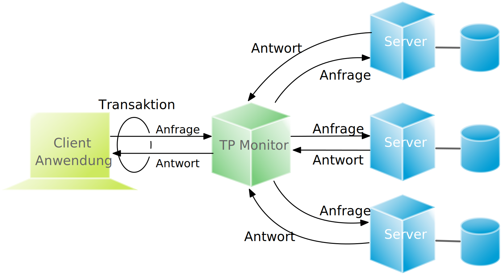

.. container:: incremental smaller

    Ein TPM ist für die Koordination der Ausführung einer Transaktion verantwortlich.

.. supplemental::

    Insbesondere im Zusammenhang mit Microservices ist der Einsatz von TPMs und 2PC zum Zwecke der Koordination von Geschäftsprozessen häufig nicht die 1. Wahl.

    Nichtsdestotrotz sind verteilte Transaktionen ein wichtiger Bestandteil von verteilten Systemen und Google hat z. B. mit Spanner eine Lösung entwickelt, die Transaktionen im globalen Maßstab ermöglicht  (*Global Consistency*). (https://cloud.google.com/spanner?hl=en und https://www.youtube.com/watch?v=iKQhPwbzzxU).

*Middleware* und *Enterprise Application Integration (EAI)*
------------------------------------------------------------

Middleware ermöglicht Kommunikation zwischen den Anwendungen.

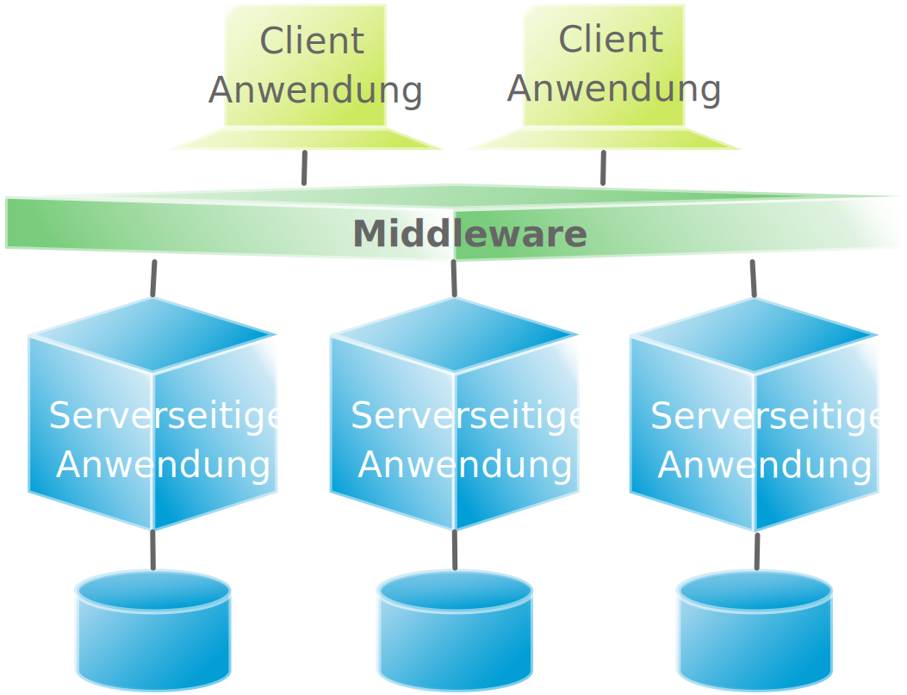

.. supplemental::

    :Remote Procedure Call (RPC): Anfragen werden über einen lokalen Prozeduraufruf gesendet, als Nachricht verpackt, verarbeitet, von einer Nachricht beantwortet und das Ergebnis ist dann der Rückgabewert des Prozeduraufrufs.

    :Nachrichtenorientierte Middleware `Message Oriented Middleware (MOM)`:eng:: Nachrichten werden an einen logischen Kontaktpunkt gesendet (d. h.veröffentlicht) und Anwendungen weitergeleitet, die diese Nachrichten abonnieren.

.. class:: smaller

Wie kann die Anwendungsintegration erreicht werden?
-----------------------------------------------------

.. class:: incremental-list dd-margin-left-2em

:Dateiübertragung:

  Technisch einfach, aber nicht flexibel:

  - Dateiformat und Layout herausfinden
  - Dateiverwaltung regeln
  - Weitergabe von Aktualisierungen und Aktualisierungsbenachrichtigungen
:Gemeinsame Datenbank: Sehr viel flexibler, erfordert aber immer noch ein gemeinsames Datenschema neben dem Risiko eines Engpasses.
:Entfernter Prozeduraufruf `Remote Procedure Call (RPC)`:eng:: Wirksam, wenn die Ausführung einer Reihe von Aktionen erforderlich ist.
:Nachrichtenübermittlung `Messaging`:eng:: Ermöglicht eine zeitliche und räumliche Entkopplung im Vergleich zu RPCs.

.. class:: new-section transition-fade

Moderne verteilte Systeme
--------------------------------------------

*Distributed Pervasive/Ubiquitous Systems*
------------------------------------------------------------------------

.. container:: minor

    (:ger:`verteilte, allgegenwärtige/alles durchdringende Systeme`)

.. container:: assessment

    Moderne verteilte Systeme zeichnen sich dadurch aus, dass die Knoten klein, mobil und oft in ein größeres System eingebettet sind. Das System bettet sich auf natürliche Weise in die Umgebung des Benutzers ein. Die Vernetzung ist drahtlos.

.. container:: incremental footnotesize

    Drei (sich überschneidende) Untertypen

    :Ubiquitous Computing: *allgegenwärtig und ständig präsent*; d. h., es besteht eine ständige Interaktion zwischen System und Benutzer.
    :Mobile Computing: *allgegenwärtig*; der Schwerpunkt liegt auf der Tatsache, dass Geräte von Natur aus mobil sind.
    :Sensor-/Actuator Networks: *allgegenwärtig*; Schwerpunkt liegt auf der tatsächlichen (kollaborativen) Erfassung (:eng:`sensing`) und Betätigung (:eng:`actuation`).

*Ubiquitous Systems* - Kernbestandteile
--------------------------------------------

.. class:: incremental-list

1. :eng:`Distribution`: Die Geräte sind vernetzt, verteilt und ohne Hürde zugänglich.
2. :eng:`Interaction`: Die Interaktion zwischen Benutzern und Geräten ist in hohem Maße unaufdringlich.
3. :eng:`Context Awareness`: Das System kennt den Kontext eines Benutzers, um die Interaktion zu optimieren.
4. :eng:`Autonomy`: Die Geräte arbeiten autonom, ohne menschliches Eingreifen, und verwalten sich in hohem Maße eigenständig.
5. :eng:`Intelligence`: Das System als Ganzes kann ein breites Spektrum dynamischer Aktionen und Interaktionen bewältigen.

*Mobile Computing* - Auszeichnende Merkmale
--------------------------------------------

.. class:: incremental-list

- Eine Vielzahl unterschiedlicher mobiler Geräte (Smartphones, Tablets, GPS-Geräte, Fernbedienungen, aktive Ausweise).
- Mobil bedeutet, dass sich der Standort eines Geräts im Laufe der Zeit ändern kann. Dies kann z. B. Auswirkung haben auf die lokalen Dienste oder die Erreichbarkeit.
- Die Aufrechterhaltung einer stabilen Kommunikation kann zu ernsthaften Problemen führen.

.. observation::
    :class: incremental margin-top-1em

    Aktueller Stand ist, dass mobile Geräte Verbindungen zu stationären Servern herstellen, wodurch diese im Prinzip *Clients* von Cloud-basierten Diensten sind.

*Mobile Cloud Computing*
--------------------------------------------

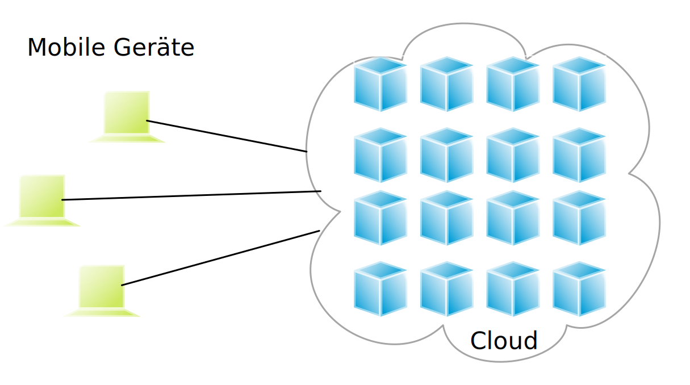

*Mobile Edge Computing*
--------------------------------------------

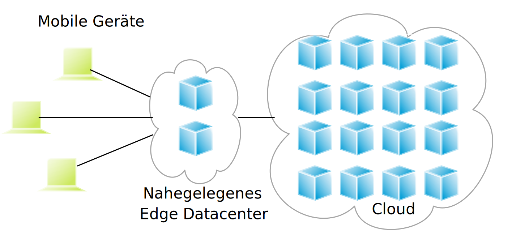

*Sensor Networks*
--------------------------------------------

Die Knoten, an denen Sensoren angebracht sind:

- „viele“
- einfach (geringe Speicher- / Rechen- / Kommunikationskapazität)
- oft batteriebetrieben (oder sogar batterielos)

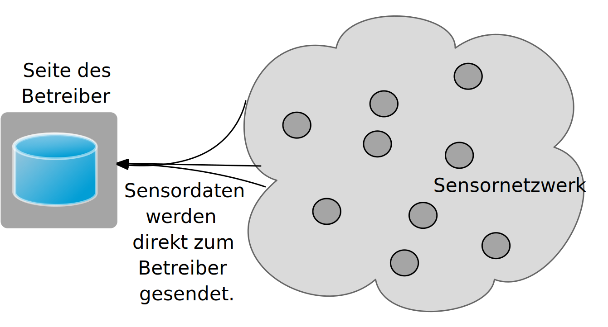

*Sensor Networks* als verteilte Datenbanken
--------------------------------------------

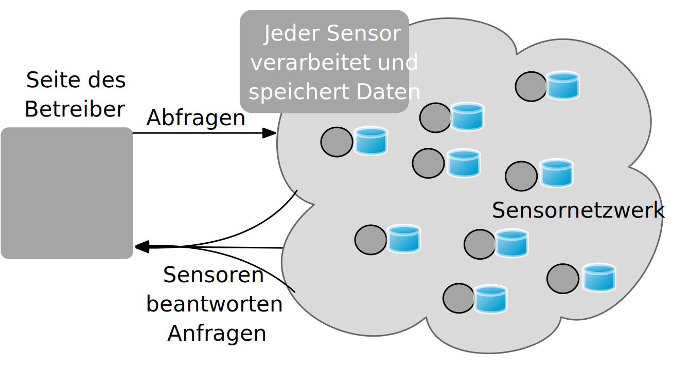

Das *Cloud-Edge Continuum*
--------------------------------

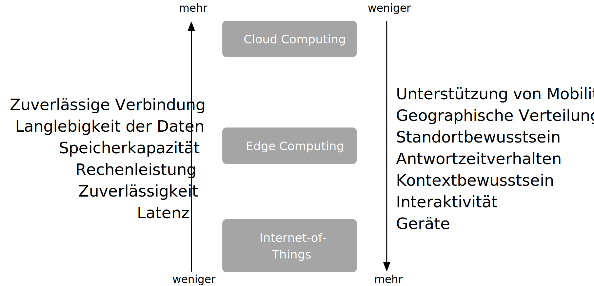

Fallstricke bei der Entwicklung verteilter Systeme
-----------------------------------------------------

.. observation::

    Viele verteilte Systeme sind unnötig komplex aufgrund fehlerhafter Annahmen sowie von Architektur- und Designfehlern, die später nachgebessert werden müssen.

.. container:: incremental

    .. rubric:: Falsche (und oft versteckte) Annahmen

    .. class:: incremental-list

    - Das Netzwerk ist zuverlässig
    - Das Netzwerk ist sicher
    - Das Netz ist homogen
    - Die Topologie ändert sich nicht
    - Die Latenz ist gleich null
    - Die Bandbreite ist unendlich
    - Die Transportkosten sind gleich null
    - Es gibt nur einen Administrator
