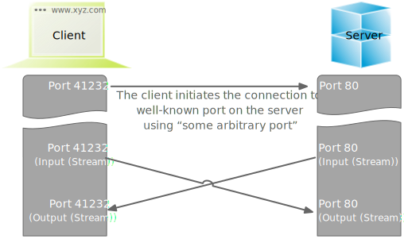

.. meta::
    :version: renaissance
    :author: Michael Eichberg
    :keywords: "HTTP", "Sockets"
    :description lang=de: HTTP und Socketprogrammierung
    :description lang=en: HTTP and Sockets
    :id: lecture-ds-http-and-sockets-java
    :first-slide: last-viewed
    :master-password: WirklichSchwierig!

.. |html-source| source::
    :prefix: https://delors.github.io/
    :suffix: .html
.. |pdf-source| source::
    :prefix: https://delors.github.io/
    :suffix: .html.pdf
.. |at| unicode:: 0x40

.. role:: incremental
.. role:: eng
.. role:: ger
.. role:: peripheral
.. role:: obsolete

.. role:: java(code)
  :language: java
.. role:: raw-html(raw)
   :format: html

HTTP and Sockets (in Java)
=============================

----

:Dozent: `Prof. Dr. Michael Eichberg <https://delors.github.io/cv/folien.de.rst.html>`__
:Kontakt: michael.eichberg@dhbw.de
:Version: 1.0

.. supplemental::

  :Lecture Material: 
      [HTML] |html-source|

      [PDF] |pdf-source|
      
  :Reporting Errors:
      https://github.com/Delors/delors.github.io/issues

.. container:: footer-left

    This set of slides is based on slides by Prof Dr Henning Pagnia.
    
    All errors are my own.

.. class:: repetition

IP
--------------------------------------

The network layer (Internet layer)

- handles the routing
- realizes end-to-end communication
- transmits packets
- is realized in the Internet through IP
- solves the following problems:

  - Sender and receiver receive network-wide unique identifiers (⇒ IP addresses)
  - the packets are forwarded by special devices (⇒ routers)

.. class:: repetition

TCP and UDP
--------------------------------------

.. grid::

  .. cell:: width-50

    .. rubric:: Transmission Control Protocol (TCP), RFC 793

    - connection-orientated communication
    - also the concept of ports
    - Establishing a connection between two processes (triple handshake, full-duplex communication)

      - Ordered communication
      - reliable communication
      - Flow control
      - high overhead ⇒ rather slow
      - only unicasts

  .. cell:: width-50

    .. rubric:: User Datagram Protocol (UDP), RFC 768
    
    - connectionless communication

      - unreliable (⇒ no error control)
      - unordered (⇒ arbitrary order)
      - little overhead (⇒ fast)
    - Size of the user data is 65507 bytes

      - Apps with predominantly short messages (e.g. NTP, RPC, NIS)
      - Apps with high throughput that tolerate some errors (e.g. multimedia)
      - Multicasts and broadcasts

.. supplemental::

   In practice datagrams (i. e. packages sent using UDP) are usually much smaller than 65507 bytes.

.. class:: new-section transition-scale

Hypertext Transfer Protocol (HTTP)
--------------------------------------

HTTP
--------------------------------------

• `RFC 7230 <http://www.ietf.org/rfc/rfc7230.txt>`__ – 7235: HTTP/1.1 (updated in 2014; orig. 1999 RFC 2626) 
• RFC 7540: HTTP/2 (standardized since May 2015)
• Properties:
  
  - Client / server (browser / web server)
  - based on TCP, usually port 80
  - Server (mostly) stateless
  - since HTTP/1.1 also persistent connections and pipelining
  - Secure transmission (encryption) possible using Secure Socket Layer (SSL) or Transport Layer Security (TLS)

Conceptual process
--------------------------------------

.. grid:: 

  .. cell:: 

    .. image:: images/http/http.svg

  .. cell::

    .. rubric:: HTTP-Kommandos 
    
    ("Verbs")

    - HEAD
    - GET
    - POST
    - PUT
    - PATCH
    - DELETE
    - OPTIONS
    - TRACE
    - CONNECT
    - ...

Protocol definition
--------------------------------------

Structure of document identifiers  *Uniform Resource Locator (URL)*

.. container:: accentuate text-align-center

  ``scheme://host[:port][abs_path[?query][#anchor]]``

.. deck::

  .. card::

    :``scheme``: Protocol (case-insensitive) (z. B. ``http``, ``https`` oder ``ftp``)
    :``host``: DNS-Name (or IP-address) of the server (case-insensitive)
    :``port``: (optional) if empty, 80 in case of ``http`` and 443 in case of ``https`` 
    :``abs_path``: (optional) path-expression relative to the server-root (case-sensitive)
    :``?query``: (optional) direct parameter transfer (case-sensitive) (``?from=…&to=…``)
    :``#anchor``: (optional) jump label within the document

  .. card::

    Uniform Resource Identifier (URI) are a generalization URLs.

    - defined in RFC 1630 in 1994
    - either a URL (location) or a URN (name) (e. g. ``urn:isbn:1234567890``)
    - examples of URIs that are not URLs are *XML Namespace Iidentifiers*

      .. code:: XML 

        <svg version="1.1" xmlns="http://www.w3.org/2000/svg">...</svg>

.. supplemental::

  Quite frequently URIs take the shape of URLs and hence are often referred to as URLs thought they do not primarily identify locations but rather names.
  

The GET command
--------------------------------------

.. deck::

  .. card::

    - Used to request HTML data from the server (request method).
    - Minimal request:
    
      :Request:

        .. code:: http
          :number-lines:

          GET <Path> HTTP/1.1
          Host: <Hostname>
          Connection: close
          <Leerzeile (CRLF)>

      :Options:     
          - Clients can also send additional information about the request and itself.
          - Servers send the status of the request as well as information about itself and, if applicable, the requested HTML file.

    - Error messages may also be packaged by the server as HTML data and sent as a response.

  .. card::

    .. rubric:: Example request

    .. code:: http
      :number-lines:

      GET /web/web.php HTTP/1.1
      Host: archive.org
      **CRLF**

    .. rubric:: Example response

    .. code:: http
      :number-lines:

      HTTP/1.1 200 OK
      Server: nginx/1.25.1
      Date: Thu, 22 Feb 2024 19:47:11 GMT
      Content-Type: text/html; charset=UTF-8
      Transfer-Encoding: chunked
      Connection: close
      **CRLF**
      <!DOCTYPE html>
      … 
      </html>**CRLF**

.. class:: new-section transition-scale

Sockets
--------------------------------------

Sockets in Java
--------------------------------------

**Sockets are communication endpoints.**

- Sockets are addressed via the IP address (InetAddress object) and an internal port number (int value).
- Sockets exist for TCP and also for UDP, but with different properties:

  :TCP: connection-orientated communication via *streams*
  :UDP: connectionless communication via *datagrams*
- Receiving data is always blocking, i. e. the receiving thread or process waits if no data is available.

TCP Sockets
--------------------------------------

.. supplemental::

  (1) The server process waits at the known server port.
  (2) The client process creates a private socket.
  (3) The socket establishes a connection to the server process - if the server accepts the connection.
  (4) Communication is stream-orientated: An input stream and an output stream are set up for both parties, via which data can now be exchanged.
  (5) When all data has been exchanged, both parties generally close the connection.

(A simple) Portscanner in Java
--------------------------------------

.. code:: java
  :class: copy-to-clipboard
  :number-lines:

  import java.net.*;
  import java.io.*;
  
  public class LowPortScanner {
    public static void main(String [] args) {
      String host = "localhost";
      if (args.length > 0) { host = args [0]; }
      for (int i = 1; i < 1024; i++) {
        try {
          Socket s = new Socket(host, i);
          System.out.println("There is a server on port "+ i + "at "+host);
          s.close();
        } catch (UnknownHostException e) {
          System.err.println(e);
          break ;
        }
        catch (IOException e) {/* probably no server waiting at this port */ }
  } } }

Exchange of Data
--------------------------------------

.. class:: incremental-list

- Once the connection has been established, data can be exchanged between the client and server using the Socket-InputStream and Socket-OutputStream.
- The best way to do this is to pass the raw data through suitable filter streams in order to achieve the highest possible semantic level.

  - Examples: :java:`PrintWriter`, :java:`BufferedReader`, :java:`BufferedInputStream`, :java:`BufferedOutputStream`
  - Network communication can then be conveniently carried out via well-known and convenient input and output routines (e.g. :java:`readLine` or :java:`println`).
  - Filter streams are also used to access other devices and files.

.. supplemental::

  By using the *decorater pattern*, the filter streams can be nested as required and used in a variety of ways. This makes application programming easier and allows, for example, the simple conversion of character strings, data compression, encryption, etc.

(Nesting of streams) A simple Echo service 
------------------------------------------------------

.. deck:: 

  .. card::
        
    .. code:: java
      :class: copy-to-clipboard
      :number-lines:

      import java.net.*; import java.io.*;

      public class EchoClient {
        public static void main(String[] args) throws IOException {
          BufferedReader userIn = new BufferedReader(new InputStreamReader(System.in));
          while (true) {
            String theLine = userIn.readLine();
            if (theLine.equals(".")) break;
            try (Socket s = new Socket("localhost"/*hostname*/, 7/*serverPort*/)) {
              BufferedReader networkIn = 
                  new BufferedReader(new InputStreamReader(s.getInputStream()));
              PrintWriter networkOut = new PrintWriter(s.getOutputStream());
              networkOut.println(theLine);
              networkOut.flush();
              System.out.println(networkIn.readLine());
      } } } }

  .. card:: 

    .. code:: java
      :class: copy-to-clipboard
      :number-lines:

      import java.net.*; import java.io.*;

      public class EchoServer {
        public static void main(String[] args) {
          BufferedReader in = null;
          try {
            ServerSocket server = new ServerSocket(7 /*DEFAULT PORT*/);
            while (true) {
              try (Socket con = server.accept()) {
                in = new BufferedReader(new InputStreamReader(con.getInputStream()));
                PrintWriter out = new PrintWriter(con.getOutputStream());
                out.println(in.readLine()); out.flush() ;
              } catch (IOException e) { System.err.println(e); }
            } 
          } catch (IOException e) { System.err.println(e); }
      } }

UDP Sockets
--------------------------------------

.. grid:: 

  .. cell:: width-50

    .. rubric:: At the client side

    1. create :java:`DatagramSocket` 
    2. create :java:`DatagramPacket`  
    3. send :java:`DatagramPacket` 
    4. wait for response and process it, if needed

  .. cell:: width-50

    .. rubric:: At the server side

    1. create :java:`DatagramSocket` with a fixed port
    2. stard endless loop
    3. prepare :java:`DatagramPacket` 
    4. receive :java:`DatagramPacket` 
    5. process :java:`DatagramPacket` 
    6. create and send response if needed

  
UDP based Echo Server
------------------------------------------------------

.. code:: java
  :class: copy-to-clipboard
  :number-lines:

  import java.net.*; import java.io.*;

  public class UDPEchoServer {
    public final static int DEFAULT_PORT = 7; // privileged port
    public static void main(String[] args) {
      try (DatagramSocket server = new DatagramSocket(DEFAULT_PORT)) {
        while(true) {
          try {
            byte[] buffer = new byte[65507]; // room for incoming message
            DatagramPacket dp = new DatagramPacket(buffer, buffer.length);
            server.receive(dp) ;
            String data = new String(dp.getData(),0,dp.getLength());
            DatagramPacket dp2 = 
              new DatagramPacket(data.getBytes(),
                data.getBytes().length, dp.getAddress(), dp.getPort());
            server.send(dp2) ;
          } catch (IOException e) {System.err.println(e);}
  } } } }

.. class:: exercises transition-fade

Exercise 
------------------------------------------------------

.. exercise:: A simple HTTP-Client

  .. class:: list-with-explanations

  (a) Write an HTTP client that contacts the server ``www.michael-eichberg.de``, requests the file ``/index.html`` and displays the server response on the screen.

      Use HTTP/1.1 and a structure similar to the echo client presented in the lecture.

      Send the GET command, the host line and an empty line to the server as strings.
  (b) Modify your client so that a URL is accepted as a command line parameter.

      Use the (existing) class URL to decompose the specified URL.
  (c) Modify your program so that the response from the server is saved in a local file. Load the file into a browser for display.

      Use the class :java:`FileOutputStream` or :java:`FileWriter` to save the file.

      Can your programme also save image files (e.g. ‘/exercises/star.jpg’) correctly?

  .. solution::
    :pwd: a-b-c 

    (a):

    .. code:: java
      :class: copy-to-clipboard
      :number-lines:
    
      import java.net.*;
      import java.io.*;
      public class HTTPClient {
        public static void main(String [] args){
          BufferedReader in = null ;
          PrintWriter out = null ;
          String hostname = "www.michael-eichberg.de";
          String filename = "/index.html";
          try(Socket s = new Socket(hostname ,80) ;){
            
            in = new BufferedReader(new InputStreamReader(s.getInputStream()));
            out = new PrintWriter(s.getOutputStream());
            out.print("GET " + url.getFile() + " HTTP/1.1\r\n");
            out.print("HOST: " + url.getHost()+ "\r\n");
            out.print("Connection: close"+ "\r\n");
            out.print("\r\n");
            out.flush();
            String line = null;
            while ((line = in.readLine()) != null){
              System.out.println (line);
            }
            
          } catch(Exception e){e.printStackTrace();}
        }
      }

    (b) and (c):

    .. code:: java
      :class: copy-to-clipboard
      :number-lines:

      import java.net.*;
      import java.io.*;

      public class HTTPGet {
          public static void getFile(URL url) {
              int c;
              FileOutputStream f = null;
              System.err.println("Connecting to " + url.getHost());
              try (Socket s = new Socket(url.getHost(), 80); // connect to server
                      var in = new BufferedInputStream(s.getInputStream());
                      var out = new PrintWriter(s.getOutputStream());) {
                  int pos = url.getFile().lastIndexOf("/");
                  System.err.println("-> new file: " + url.getFile().substring(pos + 1));
                  f = new FileOutputStream(url.getFile().substring(pos + 1));
                  System.err.print("** Anfordern von <" + url + "> ...");
                  out.print("GET " + url.getFile() + " HTTP/1.1\r\n");
                  out.print("HOST: " + url.getHost()+ "\r\n");
                  out.print("Connection: close"+ "\r\n");
                  out.print("\r\n");
                  out.flush();
                  System.err.print(" request sent ");
                  // skip HTTP/1.x header data up to ’CR LF CR LF’
                  while (true) {
                      if (in.read() == 13) // CR
                          if (in.read() == 10) // LF
                              if (in.read() == 13) // CR
                                  if (in.read() == 10) { // LF
                                      System.err.println("... removing meta data ");
                                      break; // CRLF CRLF found; content follows
                                  }
                  }
                  while ((c = in.read()) != -1) {
                      f.write(c); // store data into local file
                      System.err.print((char) c);
                  }
                  f.close();
                  System.err.println(" ... done.");

              } catch (Exception e) {
                  System.err.println(e);
              }
          }

          /**
           * Downloads a file from a given URL. 
           * (Example: "java HTTPGet.java http://www.google.de/index.html")
           * 
           * @param args URL of the file to be downloaded. E.g.,
           *             "http://www.michael-eichberg.de/index.html".
           *              
           */
          public static void main(String args[]) {
              try {
                  if (args.length < 1) {
                      System.err.println("[ERROR] URL missing.");
                      System.out.println("java HttpGet.java <url>");
                      System.exit(-1);
                  } else {
                      URL myUrl = URI.create(args[0]).toURL();
                      getFile(myUrl);
                  }
              } catch (MalformedURLException e) {
                  System.err.println("Invalid URL: " + e);
                  System.exit(-2);
              }
          }
      }

.. class:: exercises

Exercise 
------------------------------------------------------

.. exercise:: Protokollaggregation

  Write a UDP-based Java programme with which log messages can be displayed centrally on a server. The programme should consist of several clients and a server. Each client reads an input line from the keyboard in the form of a string, which is then immediately sent to the server. The server waits on port 4999 and receives the messages from any client, which it then outputs immediately.

  .. solution:: 
    :pwd: Now with UDP.
    
    .. code:: java
      :class: copy-to-clipboard
      :number-lines:

      import java.net.*;

      public class SyslogServer {
        public final static int DEFAULT_PORT = 4999;
        public final static int MAX_PACKET_SIZE = 65507;

        public static void main(String[] args) {
          try (
                var socket = new DatagramSocket(DEFAULT_PORT);) {
            System.out.println("∗∗∗ SyslogServer ***");
            while (true) {
              try {
                byte[] buffer = new byte[MAX_PACKET_SIZE];
                DatagramPacket dp = new DatagramPacket(buffer, buffer.length);
                socket.receive(dp); // wait for new message
                String s = new String(dp.getData(), 0, dp.getLength());
                System.out.println("[" + dp.getAddress() +
                        ":" + dp.getPort() + "] " + s);
              } catch (Exception e) {
                System.err.println(e);
              }
            } // while
          } catch (Exception e) {
            System.err.println(e);
          }
        }
      }

    .. code:: java
      :class: copy-to-clipboard smaller

      import java.net.*;
      import java.io.*;

      class SyslogClient {
        public final static int DEFAULT_SERVER_PORT = 4999;
        public final static int MAX_PACKET_SIZE = 65507;

        public static void main(String[] args) {
          final String hostname = "localhost";
          try (final var socket = new DatagramSocket();) {
            InetAddress host = InetAddress.getByName(hostname);
            BufferedReader userIn = 
                new BufferedReader(new InputStreamReader(System.in));
            System.out.println(
                "[INFO] SyslogClient: type message to send or <CTRL + d> to exit.");
            do {
              System.out.print("> "); // user prompt
              String s = userIn.readLine();
              if (s == null)
                break; // CTRL+d has been pressed
              byte[] data = s.getBytes();
              if (data.length > MAX_PACKET_SIZE)
                System.err.println("Message too large.");
              DatagramPacket dp = 
                  new DatagramPacket(data, data.length, host, DEFAULT_SERVER_PORT);
              socket.send(dp);
            } while (true);
          } catch (Exception e) {
            System.err.println(e);
          }
        }
      }