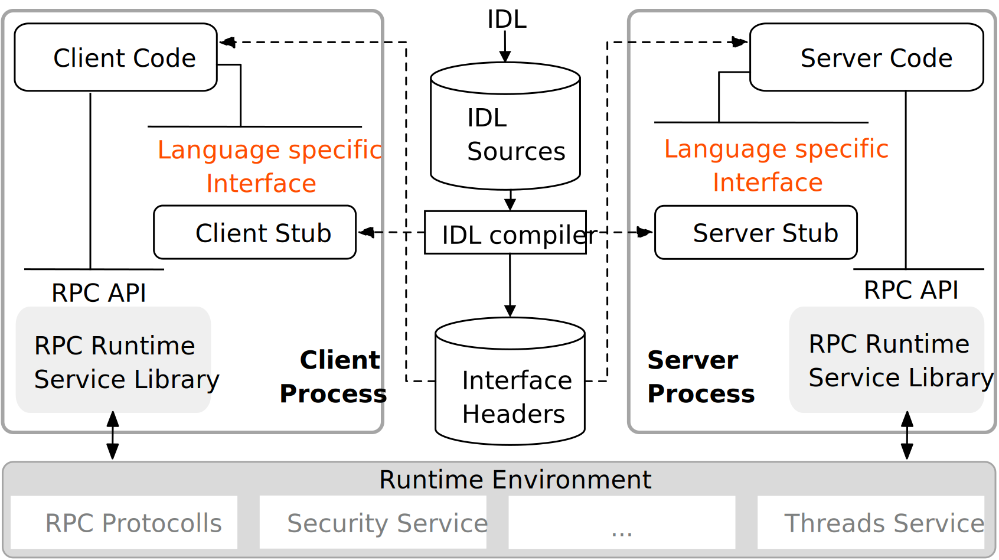
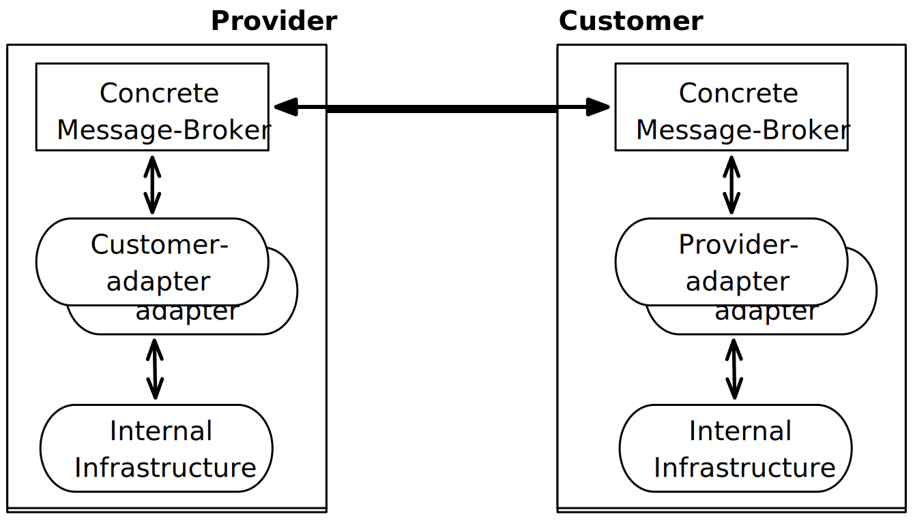
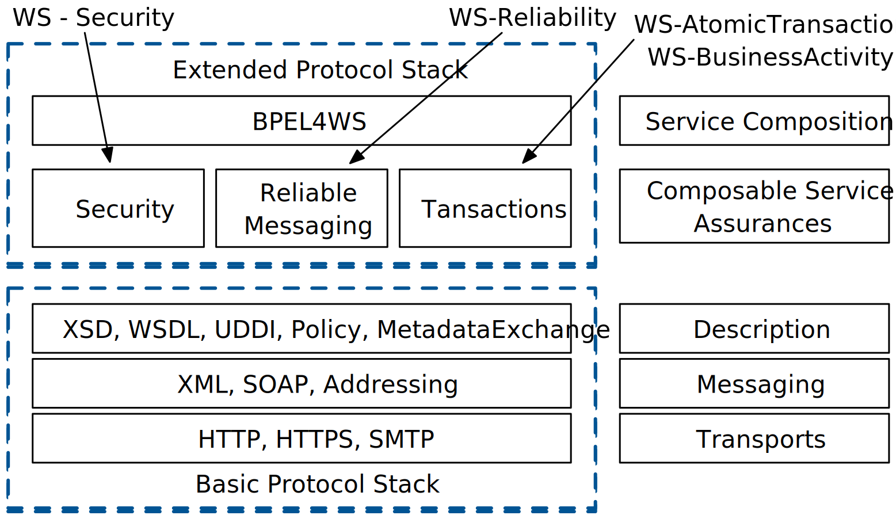
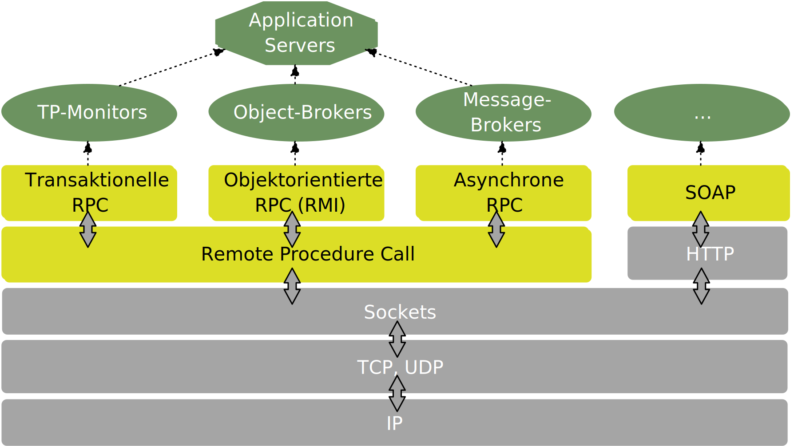
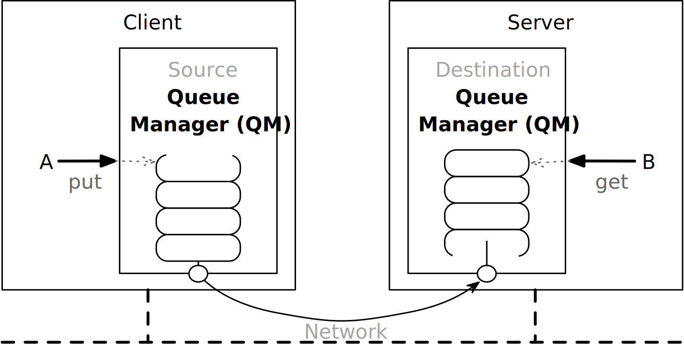

.. meta::
    :author: Michael Eichberg
    :keywords: Middleware, RPC, RMI, MoM
    :description lang=de: Einführung in Middleware (eng.)
    :description lang=en: Introduction to Middleware
    :id: lecture-distributed-systems-middleware
    :first-slide: last-viewed
    :master-password: WirklichSchwierig!

.. include:: ../docutils.defs

A Brief Introduction to Middleware
===============================================================================

.. container::

  :Dozent: `Prof. Dr. Michael Eichberg <https://delors.github.io/cv/folien.de.rst.html>`__
  :Kontakt: michael.eichberg@dhbw.de, Raum 149B
  :Version: 1.0

.. supplemental::

  :Folien:
      [HTML] |html-source|

      [PDF] |pdf-source|
  :Fehler melden:
      https://github.com/Delors/delors.github.io/issues

.. class:: new-section transition-fade

Middleware - Basics
---------------------------

Was ist Middleware?
-----------------------

.. definition::

    Middleware is a class of software technologies that serve two purposes,

    (I) reduce the complexity and

    (II) manage the heterogeneity of distributed systems.

Middleware as a Programming Abstraction
------------------------------------------

.. deck::

    .. card::

        .. image:: drawings/middleware.svg
            :align: center
            :alt: Positioning of Middleware

    .. card::

        The programming abstractions offered by middleware hide some of the heterogeneity and manage some of the complexity that programmers of a distributed application have to deal with:

        .. class:: incremental-list positive-list

        - Middleware always masks the heterogeneity of the underlying networks and hardware.
        - Middleware usually masks the heterogeneity of operating systems and/or programming languages.
        - peripheral:`Some middleware even masks the heterogeneity between implementations of the same middleware standard by different vendors`.

.. supplemental::

    .. rubric:: Middlware ...

    - A software layer above the operating system and below the application program that provides a common programming abstraction in a distributed system.

    - A building block at a higher level than the APIs provided by the operating system (e.g. sockets)

    .. rubric:: History

    Old middleware standards - such as CORBA - were very complex and the implementations of different manufacturers were usually not fully compatible.

Transparency Goals of Middleware from a Programming Perspective
-----------------------------------------------------------------

Middleware provides transparency (when programming) in relation to one or more of the following dimensions:

- Location
- Concurrency
- replication
- Failures (but only to a limited degree)

.. assessment::

    Middleware is the software that makes a distributed system (DS) programmable.

Middleware as Infrastructure
---------------------------------

.. deck::

    .. card::

        .. class:: incremental list-with-explanations

        - Behind programming abstractions is a complex infrastructure that implements these abstractions

          Middleware platforms can be very complex software systems.
        - As the programming abstractions reach ever higher levels, the underlying infrastructure that implements the abstractions must grow accordingly.
        - Additional functionality is almost always implemented through additional software layers.
        - The additional software layers increase the scope and complexity of the infrastructure required to use the new abstractions.

        .. supplemental::

            For decades, it has been observed that middleware has become increasingly complex, to the point where the complexity was barely manageable. At these points in time, new approaches were often developed that reduced the complexity until this in turn found its way into more complex middleware products.

            Approaches such as REST have proven to be quite successful, but present developers with new challenges.

    .. card::

        .. rubric:: Non-functional Requirements

        The infrastructure takes care of non-functional properties that are normally ignored by data models, programming models and programming languages:

        - Performance
        - availability
        - resource management
        - reliability
        - etc.

    .. card::

        .. rubric:: Supporting Development and Operations

        Middleware supports additional functions that make development, maintenance and monitoring easier and more cost-effective (excerpt):

        .. class:: incremental-list

        - Logging
        - Recovery
        - (Programming) Language primitives for transactional delimitation

          (:peripheral:`E.g., advanced transaction models (e.g. transactional RPC) or transactional file systems`)

Middleware - Conceptional (historic)\ [#]_
-----------------------------------------------------

.. [#] Based on: Alonso; Web services: Concepts, Architectures and Applications; Springer, 2004

.. supplemental::

    Today, the generation of stubs and skeletons - if required at all - is now typically carried out automatically by the middleware.

Evolution of Middleware
---------------------------

- Middleware aims to hide the details of hardware, networks and distribution at a low level.
- Continuing trend towards ever more powerful primitives (*events*) that have additional properties or allow more flexible use of the concept.
- The development and appearance for the programmer is dictated by the trends in programming languages:

  - RPC and C
  - CORBA and C++
  - RMI (Corba) and Java
  - "Classic" web services and XML
  - RESTful web services and JSON

.. class:: new-section transition-scale

Middleware-Technologies
---------------------------------------------------------------------------

Remote Procedure Call (RPC)
-------------------------------

.. container:: accentuate

    Focus: hiding network communication.

.. container:: incremental

    A process can call a procedure whose implementation is located on a remote computer:

    - Distributed system programmers no longer have to worry about all the details of network programming (i.e. no more "explicit" sockets).
    - Bridging the conceptual gap between calling local functionality via procedures and calling remote functionality via sockets.

RPCs Conceptual (synchronous Communication)
------------------------------------------------

.. grid::

  .. cell::

    - A server is a program that implements certain services.
    - Cients want to use these services:

      .. class:: incremental-list

      - Communication takes place by sending messages (no shared memory, no shared disks, etc.)
      - Some minimal guarantees must be given (handling of errors, call semantics, etc.)

  .. cell:: width-40

    .. image:: drawings/rpc_conceptual.svg

RPCs - Key Issues and Challenges
-------------------------------------------------------

.. deck::

  .. card::

    .. question::

        Should remote calls be transparent or non-transparent for the developer?

    .. remark::

        A remote call is completely different from a local call; should the programmer be aware of this?

  .. card::

    .. question::

        How can data be exchanged between machines that may use different representations for different data types?

  .. card::

    Complex data types must be linearized:

    :**Marshalling**: the process of preparing the data into a form suitable for transmission in a message.
    :**Unmarshalling**: the process of restoring the data on arrival at its destination in order to obtain a faithful representation.

  .. card::

    How do you find and bind the service you actually want in a potentially large collection of services and servers?

    .. remark::

        The aim is that the customer does not necessarily need to know where the server is located or even which server offers the service (location transparency).

  .. card::

    How to deal with mistakes more or less elegantly:

    - Server is down
    - Communication is disrupted
    - Server busy
    - duplicate requests ...

High-level View at RPC
---------------------------

.. container:: framed

    For programmers, a "remote" procedure call looks and works almost identically to a "local" procedure call - this is how transparency is achieved.

.. container:: incremental

    To achieve transparency, RPC introduced many concepts of middleware systems:

    .. class:: incremental-list list-with-explanations

    - *Interface Description Language* (IDL)
    - Directory and naming services
    - Dynamic binding
    - Marshalling and unmarshalling
    - Opaque references to refer to the same data structure or entity on the server for different calls.

      (The server is responsible for providing these opaque references).

RPC - Call Semantics
-----------------------

Suppose a client makes an RPC request to a service of a particular server.
After the timeout expires, the client decides to resend the request. The final behavior depends on the semantics of the call (aka `Call Semantics`):

.. deck::

  .. card::

    .. rubric:: Maybe (no guarantee)

    The target method may have been executed and the response message(s) were lost or the method was not executed at all because the request was lost.

    .. container:: peripheral

        ``XMLHTTPRequests`` and ``fetch()`` in web browsers use this semantics.

  .. card::

    .. rubric:: At least once

    The procedure will be executed as long as the server does not finally fail.

    However, it is possible that it will be executed more than once if the client has resent the request after a timeout.

  .. card::

    .. rubric:: At most once

    The procedure is either executed once or not at all. Sending the request again does not result in the procedure being executed more than once.

  .. card::

    .. rubric:: Exactly once

    The system guarantees the same semantics as for local calls under the assumption that a crashed server will restart at some point.

    Orphaned calls, i.e. Calls on crashed server computers are retained so that they can later be taken over by a new server.

RPC - Assessment
---------------------

.. class:: incremental-list positive-list

- RPC provides a mechanism to implement distributed applications in a simple and efficient way.
- RPC enables the modular and hierarchical structure of large distributed systems:

  - Client and server are separate entities
  - The server encapsulates and hides the details of the backend systems (such as databases)

.. class:: incremental-list negative-list

- RPC is not a standard, but has been implemented in many different ways.
- RPC enables developers to set up distributed systems, but only solves selected aspects.

.. container:: incremental

  The Network File System (NFS) and SMB are two well-known applications based on RPC.

.. class:: new-subsection transition-fade

Classic Web Services and SOAP
----------------------------------

Integration von Unternehmensanwendungen\ [#]_
-----------------------------------------------

The problems of enabling cross-company point-to-point integration led to the development of the next generation of middleware technologies.

.. [#] Based on *Web Services - Concepts, Architectures and Applications; Alonso et al.; Springer 2004*

.. supplemental::

    Each company uses its own "concrete" message broker(s) - if we want to communicate with multiple companies, we need to implement and maintain multiple adapters/solutions.

.. class:: no-title center-content

Web Services
--------------

.. epigraph::

  Webservices are self-contained, modular business applications that have open, internet-oriented, standards-based interfaces.

  -- UDDI Konsortium

Web Services - Protocol Stack
--------------------------------

SOAP
-------------------------------------

.. class:: incremental-list

- SOAP is the protocol of classic web services and enables communication between applications.
- SOAP comprises the following parts:

  - A message format that describes how a message can be wrapped in an XML document (envelopes, headers, body...)
  - A set of encoding rules for data
  - A description of how a SOAP message should be transported using the underlying transport protocol (HTTP or SMTP). How a SOAP message can be embedded in an HTTP request or in an e-mail (SMTP).
  - A set of rules to follow when processing a SOAP message and the entities involved in this processing; which parts of the messages should be read and by whom, and what action these entities should take if they do not understand the content.

.. supplemental::

    SOAP is a further development of XML-RPC and originally stood for Simple Object Access Protocol.

    SOAP (from version 1.2) is a standard of the W3C.

Structure of a SOAP message
---------------------------

.. grid::

  .. cell:: width-40

    .. image:: drawings/soap_message.svg
        :align: center

  .. cell:: width-60 dd-margin-left-2em

    Messages are envelopes in which the application's user data is enclosed.

    A message has two main components:

    :Header (optional): Intended for infrastructural data such as security or reliability.
    :Body (mandatory): Intended for application level data. Each part can be divided into blocks.

Example of a SOAP-Message
-------------------------------

.. code:: xml
  :number-lines:

  <SOAP-ENV:Envelope
      xmlns:SOAP-ENV="http://schemas.xmlsoap.org/soap/envelope/"
      SOAP-ENV:encodingStyle="http://schemas.xmlsoap.org/soap/encoding/" />

    <SOAP-ENV:Header>
      <t:Transaction xmlns:t="ws-transactions-URI" SOAP-ENV:mustUnderstand="1">
        57539
      </t:Transaction>
    </SOAP-ENV:Header>

    <SOAP-ENV:Body>
      <m:GetLastTradePrice xmlns:m="Some-URI">
        <symbol>DEF</symbol>
      </m:GetLastTradePrice>
    </SOAP-ENV:Body>

  </SOAP-ENV:Envelope>

Example of a SOAP-Request
---------------------------

.. code:: http
  :number-lines:

  POST /StockQuote HTTP/1.1
  Host: www.stockquoteserver.com
  Content-Type: text/xml; charset="utf-8"
  Content-Length: nnnn
  SOAPAction: "Some-URI"

  <SOAP-ENV:Envelope
    xmlns:SOAP-ENV="http://schemas.xmlsoap.org/soap/envelope/"
    SOAP-ENV:encodingStyle="http://schemas.xmlsoap.org/soap/encoding/">

    <SOAP-ENV:Body>
      <m:GetLastTradePrice xmlns:m="Some-URI">
        <symbol>DIS</symbol>
      </m:GetLastTradePrice>
    </SOAP-ENV:Body>
  </SOAP-ENV:Envelope>

Example of a SOAP-Response
---------------------------

.. code:: http
  :number-lines:

  HTTP/1.1 200 OK
  Content-Type: text/xml; charset="utf-8"
  Content-Length: nnnn

  <SOAP-ENV:Envelope
    xmlns:SOAP-ENV="http://schemas.xmlsoap.org/soap/envelope/"
    SOAP-ENV:encodingStyle="http://schemas.xmlsoap.org/soap/encoding/" />

  <SOAP-ENV:Body>
    <m:GetLastTradePriceResponse xmlns:m="Some-URI">
      <Price>34.5</Price>
    </m:GetLastTradePriceResponse>
  </SOAP-ENV:Body>
  </SOAP-ENV:Envelope>

Web Services - Standardization
--------------------------------

.. deck::

  .. card::

    .. image:: screenshots/ws_standards.webp
      :width: 600
      :align: right

  .. card:: overlay

    .. image:: screenshots/ws_standards_w3c.webp
      :width: 900
      :align: left

.. class:: vertical-title

Overview
---------------------

.. class:: new-section transition-move-to-top

Messaging and Message-oriented Communication/Middleware
-----------------------------------------------------------

ZeroMQ
--------------------------------

.. class:: incremental-list

- ZeroMQ is a messaging infrastructure without an explicit server ("broker").
- ZeroMQ supports connection-oriented but asynchronous communication.
- ZeroMQ is based on classic sockets, but adds new abstractions to enable the following messaging patterns:

  - *request-reply*
  - *pub-sub* (publish-subscribe)
  - pipeplining (*processing in parallel*)

  - ZeroMQ enables N-to-N communication.
  - ZeroMQ supports many programming languages; the user is responsible for the appropriate marshalling or unmarshalling.

.. supplemental::

    If, for example, the server is written in Java and the client in C, then the understanding of how a string is transferred may be different (e.g. terminated with ``null`` or provided with an explicit length).

ZeroMQ - Messaging Patterns
----------------------------

.. scrollable::

    .. image:: drawings/zeromq/client-server.svg
      :align: center
      :class: framed

    .. image:: drawings/zeromq/pub-sub.svg
      :align: center
      :class: framed

    .. image:: drawings/zeromq/pipeline.svg
      :align: center
      :class: framed

.. supplemental::

    :*Client-Server*: Enables the "usual" communication between a client and a server. However, buffering may take place if the server is not available.

    :*Publish-Subscribe*: Allows clients to subscribe to a specific topic and then receive all messages published on that topic. A message with a specific topic is sent to all registered clients.

    :Pipeline: Enables a task to be sent to exactly one worker from a set of (homogeneous) workers.

ZeroMQ - Example *Publish-Subscribe*: Publisher (Java)
--------------------------------------------------------

.. code:: java
  :class: copy-to-clipboard
  :number-lines:

  import static java.lang.Thread.currentThread
  import org.zeromq.SocketType;
  import org.zeromq.ZMQ;
  import org.zeromq.ZContext;

  public class Publisher {
    public static void main(String[] args) throws Exception {
    try (ZContext context = new ZContext()) {
      ZMQ.Socket publisher = context.createSocket(SocketType.PUB);
      publisher.bind("tcp://*:5556");
      publisher.bind("ipc://" + <endpoint>);

      while (!currentThread().isInterrupted()) {
        int zipcode = <some zipcode>
        //  Send to all subscribers
        String update = String.format("%05d %s", zipcode, <some msg>);
        publisher.send(update, 0);
  } } } }

ZeroMQ - Example *Publish-Subscribe*: Subscriber (Java)
---------------------------------------------------------

.. code:: java
  :class: copy-to-clipboard
  :number-lines:

  import java.util.StringTokenizer;
  import org.zeromq.SocketType;
  import org.zeromq.ZMQ;
  import org.zeromq.ZContext;

  public class Subscriber{
    public static void main(String[] args) {
    try (ZContext context = new ZContext()) {
      ZMQ.Socket subscriber = context.createSocket(SocketType.SUB);
      subscriber.connect("tcp://localhost:5556");
      subscriber.subscribe(<zipcode(Str)>.getBytes(ZMQ.CHARSET));
      while(true) {
        String string = subscriber.recvStr(0);
        // e.g. take string apart:
        //   part1: zipcode
        //   part2: message
        System.out.println(string);
  } } } }

ZeroMQ - Example *Publish-Subscribe* (Python)
-----------------------------------------------

.. grid::

  .. cell::

    .. code:: python
      :class: copy-to-clipboard
      :number-lines:

      import signal
      import time
      import zmq

      signal.signal(signal.SIGINT,
                    signal.SIG_DFL)

      context = zmq.Context()
      socket = context.socket(zmq.PUB)
      socket.bind('tcp://*:5555')

      for i in range(5):
          socket.send(b'status 5')
          socket.send(b'All is well')
          time.sleep(1)

  .. cell::

    .. code:: python
      :class: copy-to-clipboard
      :number-lines:

      import signal
      import zmq

      signal.signal(signal.SIGINT,
                    signal.SIG_DFL)

      context = zmq.Context()
      socket = context.socket(zmq.SUB)
      socket.connect('tcp://localhost:5555')
      socket.setsockopt(zmq.SUBSCRIBE, b'status')

      while True:
          message = socket.recv_multipart()
          print(f'Received: {message}')

.. supplemental::

  Bzgl. des Handlings von Signalen in Python siehe auch: https://docs.python.org/3/library/signal.html#signal.signal

MOM - Message Oriented Middleware
-----------------------------------

.. class:: incremental-list list-with-explanations

- MOM or message-queueing systems support persistent asynchronous communication.
- Very large messages are supported.
- There is only a guarantee that messages are ultimately placed in the recipient's queue and that the messages arrive in the correct order.

  (In particular, there is no guarantee that the message will be read).
- The sender and recipient are not necessarily active at the same time.
- Messages always have a unique recipient and virtually arbitrary content.

MOM - Basic Interface
--------------------------------

.. csv-table::
   :header: "Operation", "Beschreibung"
   :class: highlight-row-on-hover booktabs

   PUT, "Places a message in a specific queue."
   GET, "Blocks at a specific queue until a message is available. Removes the first message."
   POLL, "Checks whether a message is available in a specific queue. Removes the first message if necessary. POLL never blocks."
   NOTIFY, "Registers a handler (*callback*) that is called when a message is added to a specific queue."

MOM - Queue Managers
----------------------

.. supplemental::

    *Queue managers* are the central building block of message queueing systems. In general, there is (at least conceptually) one local *Queue Manager* per process. A *Queue Manager* is a process that stores and manages messages in queues. If required, it can manage several queues and forward them to other *Queue Managers*.
