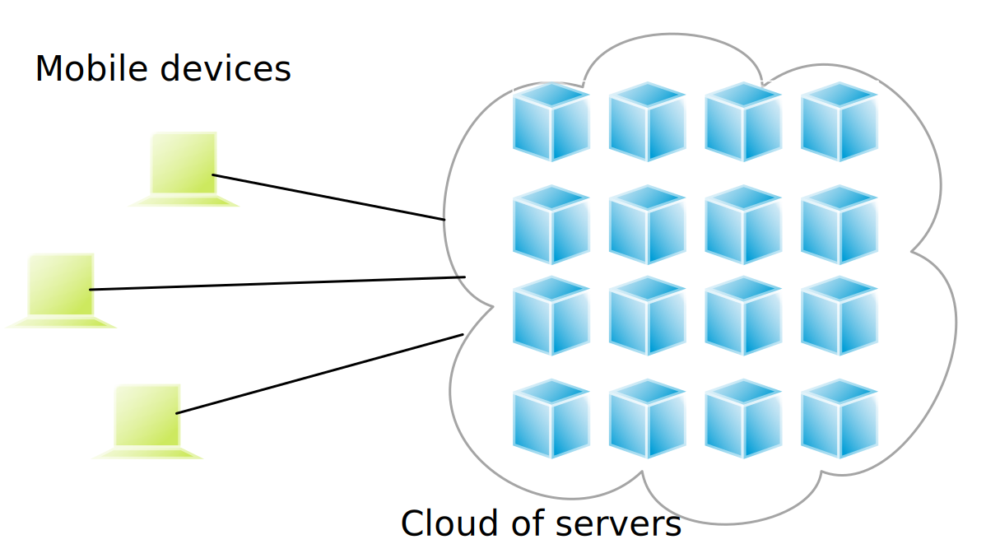
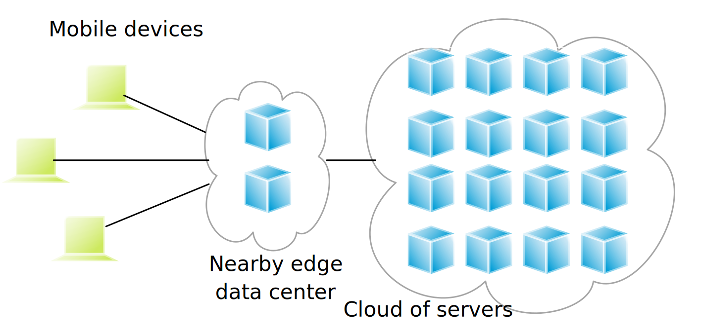

.. meta::
    :version: renaissance
    :author: Michael Eichberg
    :keywords: "Distributed Systems"
    :description lang=en: Introduction to Distributed Systems
    :id: lecture-ds-introduction
    :first-slide: last-viewed
    :exercises-master-password: WirklichSchwierig!
    
.. |html-source| source::
    :prefix: https://delors.github.io/
    :suffix: .html
.. |pdf-source| source::
    :prefix: https://delors.github.io/
    :suffix: .html.pdf

.. |at| unicode:: 0x40

.. role:: incremental   
.. role:: eng
.. role:: ger
.. role:: red
.. role:: green
.. role:: the-blue
.. role:: peripheral
.. role:: obsolete
.. role:: math-i
.. role:: math-r
.. role:: math-b

.. role:: raw-html(raw)
   :format: html

Introduction to Distributed Systems
================================================

A broad overview of distributed systems!

----

:Dozent: `Prof. Dr. Michael Eichberg <https://delors.github.io/cv/folien.de.rst.html>`__
:Kontakt: michael.eichberg@dhbw.de, Raum 149B
:Version: 1.0

.. supplemental::

  :Folien: 

      |html-source|

      |pdf-source|
      

  :Fehler melden:

      https://github.com/Delors/delors.github.io/issues

.. container:: footer-left incremental peripheral

    This slide set is based in parts on the following sources:
    
    (a) Maarten van Steen (material related to his book on *Distributed Systems*)

    (b) Henning Pagnia (based on his lecture *Verteilte Systeme*). 

    All errors are my own.

.. class:: padding-none no-title transition-scale

Basic Terminologioe of Distributed Systems
-------------------------------------------

.. image:: images/modern_software_architecture-tag_cloud.png
    :width: 100%
    :align: center

Recommended Literature
-----------------------

.. supplemental::

    Supplemental material for interested students:

    .. image:: screenshots/microservices.jpg
        :width: 70%
        :align: center
        :class: trbl-shadow 

Recommended Podcast: `SE-Radio <https://se-radio.net>`__
-----------------------------------------------------------

.. image:: screenshots/se-radio.net.png
    :width: 75%
    :align: center

Recommended Podcast: `Thoughtworks Technology Podcast <https://www.thoughtworks.com/en-de/insights/podcasts/technology-podcasts>`__
-------------------------------------------------------------------------------------------------------------------------------------

.. image:: screenshots/thoughtworks-technology-podcast.png  
    :width: 70%
    :align: center
    :class: trbl-shadow
    

.. class:: new-section transition-fade

Distributed Systems - Definition and Properties
------------------------------------------------------------

Distributed vs. Decentralized 
-------------------------------------------------------------------

.. supplemental:: 

    .. admonition:: Zwei Ansichten zur Realisierung verteilter Systeme

        - **Integrative view**: Connection of existing (locally) networked computer systems to form a larger system.
        - **Expansive view**: an existing networked computer system is expanded to include additional computers.

    .. definition::

        - A **decentralised system** is a networked computer system in which processes and resources are *necessarily* distributed across multiple computers.
        - A **distributed system** is a networked computer system in which processes and resources are *sufficiently* distributed across several computers.

Common misunderstandings regarding centralised systems
--------------------------------------------------------

.. class:: incremental-list 

1. **Centralized solutions do not scale**
         
   A distinction must be made between logical and physical centralization. 
   
   .. example::

      The *Domain Name System (DNS)*:

      .. class:: column-list

      - \ 

        - logisch zentralisiert
        - physisch (massiv) verteilt

      - \ 

        - dezentralisiert über mehrere Organisationen
  
2. **Centralized solutions have a single point of failure**

   Generally not true (e.g. DNS). 
    
   A single possible source of error is often...

   .. class:: column-list

   - \ 

     - easier to manage

   - \ 

     - easier to make more robust

.. supplemental:: 
    
    .. warning:: 

        There are many, poorly founded misconceptions about, for example, scalability, fault tolerance or security. We need to develop skills that make it easy to understand distributed systems in order to avoid such misunderstandings.

Perspectives on Distributed Systems
------------------------------------

**Distributes systems are complex.**

.. class:: incremental-list

:Architectures: What architectures and "architectural styles" are there?
:Processes: What kind of processes are there and what are their relationships?
:Communication: What options are there for exchanging data?
:Coordination: How are the involved systems coordinated?
:Naming: How do you identify resources?
:Consistency and replication: What trade-offs need to be made in terms of data consistency, replication and performance?
:Fault tolerance: How can operations be maintained even in the event of partial failures?
:Security: How can authorized access to resources be guaranteed?

Design-goals of Distributed Systems
------------------------------------

.. class:: incremental-list dhbw-list

- `Shared Usage of Resources`_ 
- `Distribution Transparency`_
- `Openness`_
- `Scalability`_

.. class:: new-subsection transition-fade

Shared Usage of Resources
------------------------------------

Shared Usage of Resources - Examples
---------------------------------------------

.. class:: incremental-list

- Cloud-based shared storage and files
- Peer-to-peer supported multimedia streaming
- Shared email services (e.g. outsourced email systems)
- Shared web hosting (e.g. *content distribution networks*)

.. class:: new-subsection transition-fade

Distribution Transparency
-------------------------------------------------------------

Definition 
----------------------------------------------------------

.. definition::

    .. rubric:: Distribution Transparency

    Transparency describes the property that a distributed system attempts to hide the fact that its processes and resources are physically distributed across multiple computers that may be separated by large(r) distances.
    
.. container:: incremental margin-top-2em

  The distribution transparency is realized by many different techniques of the so-called *middleware* - a layer between applications and operating systems.

Aspects of Distribution Transparency
----------------------------------------------------------------------------

.. csv-table:: 
    :class: incremental-table-rows booktabs
    :stub-columns: 1

    Data access, hide differences in data representation and the type of access to a local or remote object
    Location of data storage, hide where an object is located
    Relocation, hide that an object may be moved to another location while in use
    Migration, hide that an object may be moved to another location
    Replication, hide that an object is replicated
    Concurrency, hide that an object may be shared by several independent users
    Fault transparency, hide the failure and recovery of an object

.. supplemental::

    Datendarstellung: Big-Endian vs. Little-Endian; ASCII vs. Iso-Latin 8859-1 vs. UTF-8

Degree of achievable Distribution Transparency
-----------------------------------------------

.. observation::

    Complete distribution transparency cannot be achieved. 

.. container:: incremental

    However, a high level of distribution transparency can result in high costs.

.. class:: incremental-list

- There are communication latencies that cannot be hidden.
- It is (theoretically and practically) impossible to completely hide network and node failures.
- You cannot distinguish a slow computer from a failed computer.
- You can never be sure that a server was actually performing an operation before it crashed.
- "Complete transparency" costs performance and exposes the distribution of the system.
  
  - Keeping the replicas exactly on the same level as the master takes time 
  - Write operations are immediately transferred to the hard drive for fault tolerance

Disclosing Distribution can bring Advantages
-----------------------------------------------------

.. class:: incremental-list list-with-explanations

- Use of location-based services 
  (E. g. to enable finding friends nearby.)

- When dealing with users in different time zones
- When it is easier for a user to understand what is going on 

  (E.g. if a server does not respond for a long time, it can be reported as down).

.. observation::
    :class: incremental

    Distribution transparency is a noble goal, but often difficult to achieve and frequently not worth striving for. 

.. class:: new-subsection transition-fade

Open Distributed Systems
-------------------------------------------------------------

.. _openness:

\ 

Open Distributed Systems
----------------------------------

.. definition:: 

    An open distributed system offers components that can easily be used by other systems or integrated into other systems. 
    
    An open distributed system itself often consists of components that originate from elsewhere.

.. container:: incremental 

    Open distributed systems must be able to interact with services of other (open) systems, regardless of the underlying environment:

    .. class:: incremental-list

    - they should implement well-defined interfaces correctly
    - they should be able to interact easily with other systems
    - they should support the portability of applications 
    - they should be easily extensible

.. supplemental::
    
    Authentication services are one example. They can be used by many different applications.

Policies vs. Mechanisms
------------------------------------------------------------------------------

.. supplemental:: 

    :eng:`Policies vs. Mechanisms` ≘ :ger:`Vorgaben/Richtlinien vs. Umsetzungen`
    
.. rubric:: Policies when implementing openness

.. class:: incremental-list

- What level of consistency do we need for data in the client cache?
- What operations do we allow downloaded code to perform?
- Which QoS requirements do we adapt in the presence of fluctuating bandwidths?  
- What level of secrecy do we need for communication?

.. class:: incremental

.. rubric:: Mechanisms to support openness

.. class:: incremental-list

- Enabling the (dynamic) setting of caching policies
- Support of different trust levels for mobile code
- Provisioning of adjustable QoS parameters per data stream 
- Provisioning of various encryption algorithms

.. supplemental::

    The hard coding of policies often simplifies administration and reduces the complexity of the system. However, it comes at the price of less flexibility.

Security in Distributed Systems - Security Objectives
------------------------------------------------------

.. observation::

    A distributed system that is not secure is not reliable.

.. container:: incremental

    .. rubric:: Foundational security objectives

    :**Confidentiality**: Information is only passed on to authorized parties.
    :**Integrity**: Changes to the values of a system may only be made in an authorized manner.

.. supplemental::

    Together with the third security objective: **availability**, these three protection objectives form the CIA triad of information security: Confidentiality, Integrity, and Availability.

Security in Distributed Systems - Authorization, Authentication, Trust
-------------------------------------------------------------------------------------

.. class:: incremental-list

:Authentication: Process for verifying the correctness of a claimed identity.
:Authorization: Does an identified unit have the correct access rights?
:Trust: A component can be certain that another component will perform certain actions in accordance with expectations.

Security - Encryption and Signatures
---------------------------------------------

It is essentially about encrypting and decrypting data (:math-i:`X`) with the help of keys.

.. deck::

    .. card:: trbl-shadow padding-1em rounded-corners

        :math-i:`E(K,X)` means that we **e**\ ncrypt the message :math-i:`X` with the key :math-i:`K`. 
        
        :math-i:`D(K,X)` denotes the inverse function that **d**\ ecrypts the data.

    .. card:: trbl-shadow padding-1em

        .. rubric:: Symmetric Encryption

        The encryption key is identical to the decryption key; the same key :math-i:`K` is used for both operations.

        :math-i:`X = D(K,E(K,X))`
    
    .. card:: trbl-shadow padding-1em

        .. rubric:: Asymmetric Encryption

        We distinguish between private (:math-i:`PR`) and public keys (:math-i:`PU`) (:math-i:`PU` :math:`\neq` :math-i:`PR`). A private and a public key always form a pair. The private key must always be kept secret.
        
        .. deck:: incremental

            .. card::

                **Encrypting Messages**

                Alice sends a message to Bob using Bob's public key.

                .. math::
                    
                    Y = E(PU_{Bob},X) \\
                    X = D(PR_{Bob},Y)

            .. card:: 

                **Signing Messages**

                Alice signs (:math:`S`) a message with her private key.

                .. math::

                    Y = E(PR_{Alice},X) \\
                    X = D(PU_{Alice},Y)

Security - Secure Hashing 
------------------------------------------------------- 

A secure hash function :math-i:`Digest(X)` returns a character string of fixed length (:math-i:`H`).

- Any change - no matter how small - to the input data results in a completely different character string.
- With a hash value, it is mathematically impossible to find the original message :math-i:`X` based on :math-i:`Digest(X)`.

.. container:: incremental

    .. rubric:: Signing Messages

    .. class:: column-list incremental-list

    - Alice signs a message :math-i:`X` with her private key.

      .. math::
        \text{Alice:} [E(PR_{\text{Alice}},H=Digest(X)),X] 

    - Bob checks the message :math-i:`X` for authenticity:

      .. math::
        
        \text{Bob:} D(PU_{\text{Alice}},H) \stackrel{?}{=} Digest(X)

.. supplemental::

    :ger:`Sicheres Hashing` ≘ :eng:`Secure Hashing`

.. class:: exercises

Question
----------------

.. exercise:: Encryption with Public-Private Keys/Asymmetric Encryption

    If Alice sends Bob a message encrypted with Bob's public key, what security problem could arise?

    .. solution:: 
        :pwd: MITM_arise

        Alice cannot be sure that her message will not be exchanged! Anyone who intercepts the message can discard the message and encrypt their own with Bob's public key. Depending on the third party's background knowledge, this message may also look as if it comes from Alice.
        
        Bob can therefore not be sure that the message is from Alice.  

.. class:: new-subsection transition-fade

Scalability
---------------------- 

Scalability in Distributed Systems
-----------------------------------------

We can distinguish at least three types of scalability:

.. class:: incremental-list

- Number of users or processes (size scalability)
- Maximum distance between nodes (geographical scalability) 
- Number of administrative domains (administrative scalability)

.. supplemental::

    Scalability in terms of size can often be achieved by using more and more powerful servers that are operated in parallel.

    Geographical and administrative scalability is often a greater challenge.

Analysis of the Scalability of Centralized Systems
------------------------------------------------------------

.. deck::

    .. card::

        A centralized service can be modelled as a simple queuing system:

        .. image:: images/queuing-system.svg
            :align: center

        .. rubric:: Assumptions

        The queue has an infinite capacity, i.e. the arrival rate of requests is not influenced by the current length of the queue or by what is currently being processed.

    .. card::

        .. grid:: 

            .. cell::

                - Arrival rate of requests: 
                    
                  :math:`\lambda` *(requests per second)*

                - Processing capacity of the service: 
                        
                  :math:`\mu` *(requests per second)*

                  Proportion of time with :math-i:`x` requests in the system:

                  .. math::

                        p_x  = \bigl(1 - \frac{\lambda}{\mu}\bigr)\bigl(\frac{\lambda}{\mu}\bigr)^x

            .. cell::

                .. figure:: images/number_of_requests_in_system.svg
                    :align: center

                    # Requests in process and in queue 
                    
                    For example, the proportion of time in which the computer is *idle* (i. e. :math:`p_0`) is : 90 %, 60 % and 30 %.

                    .. presenter-note::
                    
                        :math:`p_0`; i. e. there are no/0 enquiries.

        .. presenter-note::

            The formula math:`p_x = \bigl(1 - \frac{\lambda}{\mu}\bigr)\bigl(\frac{\lambda}{\mu}\bigr)^x`  can be understood as follows: The probability that there are :math-i:`x` requests in the system decreases with the number of requests in the system. Therefore, :math:`\bigl(\frac{\lambda}{\mu}\bigr)^x` applies. Furthermore, we must model that there are "only" two requests (i. e. the system is otherwise "idle"). Therefore, we still have to multiply by :math:`p_0 = 1 - \frac{\lambda}{\mu}`.

    .. card:: 

        .. note::
            
            :math-i:`x` = # Anfragen im Sys.

            .. math::
                p_x  = \bigl(1 - \frac{\lambda}{\mu}\bigr)\bigl(\frac{\lambda}{\mu}\bigr)^x
            

        :math-i:`U` is the proportion of time in which a service is utilized:

        .. math::

            U = \sum_{x > 0} p_x = 1 - p_0 = \frac{\lambda}{\mu} \Rightarrow p_x = (1-U) U^x

        .. container:: incremental
                
            Average number of requests:

            .. math::

                \begin{matrix}
                    \bar{N} & = & \sum_{x\geq 0} x \cdot p_x 
                    = \sum_{x \geq 0} x \cdot (1-U)U^x \\
                    & = & (1-U)\sum_{x\geq 0} x\cdot U^x  
                    = \frac{(1-U)U}{(1-U)^2} = \frac{U}{1-U}
                \end{matrix}

        .. container:: incremental

            .. class:: column-list left-aligned-columns
            
            - Average throughput:
            - .. math::

                X = \underbrace{U \cdot \mu}_{\mbox{utilized}} + \underbrace{(1-U) \cdot 0}_{\mbox{unused}} = \frac{\lambda}{\mu} \cdot \mu = \lambda 

        .. supplemental::

            For an `infinite geometric series <https://de.wikipedia.org/wiki/Geometrische_Reihe#Konvergenz_und_Wert_der_geometrischen_Reihe>`__ with the quotient :math-i:`U` applies:

            .. math::
                \sum_{k\geq 0} k\cdot U^k  = \frac{U}{(1-U)^2} 

            Representation of the average number of requests in the system depending on the utilization :math-i:`U`:

            .. image:: images/average_number_of_requests_in_system.svg
                :align: center

    .. card:: 

        .. class:: column-list

        - The response time is the total time taken to process a request

          .. math::
            
            \begin{matrix}
                R & = \frac{\bar{N}}{X} = \frac{S}{1-U} \\
                & \Rightarrow \frac{R}{S} = \frac{1}{1-U} 
            \end{matrix}

          with :math:`S = \frac{1}{\mu}` for the average service time. 
            
        - \ 

          .. image:: images/response_time.svg
                :alt: Response time w.r.t. utilization
                
          .. class:: incremental-list

        \ 
        
        - If :math-i:`U` is small, the response time is close to :math-r:`1`, i.e. a request is processed immediately.
        - If :math-i:`U` increases to :math-r:`1`, the system comes to a standstill. 

Probleme der geografischen Skalierbarkeit
--------------------------------------------

- Viele verteilte Systeme gehen von synchronen Client-Server-Interaktionen aus und dies verhindert einen Übergang vom LAN zum WAN. Die Latenzzeiten können prohibitiv sein, wenn der Client auf eine Anfrage lange warten muss.
  
.. class:: incremental

- WAN-Verbindungen sind oft von Natur aus unzuverlässig.

Probleme der administrativen Skalierbarkeit
--------------------------------------------

.. observation::

    Widersprüchliche Richtlinien in Bezug auf Nutzung (und damit Bezahlung), Verwaltung und Sicherheit

.. deck:: incremental

    .. card::

        .. rubric:: Beispiele

        - Grid Computing: gemeinsame Nutzung teurer Ressourcen über verschiedene Domänen hinweg.
        - Gemeinsam genutzte Geräte: Wie kontrolliert, verwaltet und nutzt man ein gemeinsam genutztes Radioteleskop, das als groß angelegtes gemeinsames Sensornetz konstruiert wurde?

    .. card::

        .. rubric:: Ausnahme 

        Verschiedene Peer-to-Peer-Netze [#]_ bei denen Endnutzer zusammenarbeiten und nicht Verwaltungseinheiten:

        - File-Sharing-Systeme (z. B. auf der Grundlage von BitTorrent) 
        - Peer-to-Peer-Telefonie (frühe Versionen von Skype) 

        .. [#] :eng:`Peer` ist im hier im Sinne von „Gleichgestellter“ zu verstehen. D. h. wir haben ein Netz von gleichgestellten Rechnern.

Ansätze, um Skalierung zu erreichen
------------------------------------

.. deck::

    .. card::

        **Verbergen von Kommunikationslatenzen** durch:

        - Nutzung asynchroner Kommunikation
        - Verwendung separater *Handler* für eingehende Antworten 

        .. observation:: 
            :class: incremental

            Dieses Modell ist jedoch nicht immer anwendbar.

    .. card::

        **Partitionierung von Daten und Berechnungen über mehrere Rechner.**

        - Verlagerung von Berechnungen auf Clients 
        - Dezentrale Namensgebungsdienste (DNS)
        - Dezentralisierte Informationssysteme (WWW)

Verlagerung von Berechnungen auf Clients
------------------------------------------

Ansätze, um Skalierung zu erreichen
------------------------------------

**Einsatz von Replikation und Caching, um Kopien von Daten auf verschiedenen Rechnern verfügbar zu machen.**

.. class:: incremental-list

- replizierte Dateiserver und Datenbanken 
- gespiegelte Websites
- Web-Caches (in Browsern und Proxies) 
- Datei-Caching (auf Server und Client)

Herausforderungen bei der Replikation 
---------------------------------------

.. class:: incremental

- Mehrere Kopien (zwischengespeichert (:eng:`cached`) oder repliziert) führen zwangsläufig zu Inkonsistenzen. Die Änderung einer Kopie führt dazu, dass sich diese Kopie von den anderen unterscheidet.
- Zur Erreichung von Konsistenz ist bei jeder Änderung eine globale Synchronisierung erforderlich.
- Die globale Synchronisierung schließt Lösungen im großen Maßstab aus.

.. supplemental::

    Inwieweit Inkonsistenzen toleriert werden können, ist anwendungsspezifisch. Können diese jedoch toleriert werden, dann kann der Bedarf an globaler Synchronisation verringert werden.

Paralleles Rechnen (:eng:`Parallel Computing`)
------------------------------------------------

.. class:: column-list
  
- Multiprozessor

  .. image:: images/multiprocessor-vs-multicomputer/multiprocessor.svg
            :align: center

- Multicomputer

  .. image:: images/multiprocessor-vs-multicomputer/multicomputer.svg
            :align: center

.. supplemental::

    Das verteilte Hochleistungsrechnen begann mit dem parallelen Rechnen.

    **Verteilte Systeme mit gemeinsamem Speicher** (:eng:`Multicomputer with shared memory`) als alternative Architektur haben die Erwartungen nicht erfüllt und sind daher nicht mehr relevant.

Amdahls Gesetz - Grenzen der Skalierbarkeit
-----------------------------------------------------

.. deck::

    .. card::

        .. class:: list-with-explanations

        - Lösen von **fixen Problemen** in möglichst kurzer Zeit

            (Beispiel: Hochfahren (:eng:`Booten`) eines Rechners. Inwieweit lässt sich durch mehr CPUs/Kerne die Zeit verkürzen?)
        - Es modelliert die erwartete Beschleunigung (*Speedup*) eines zum Teil parallelisierten/parallelisierbaren Programms relativ zu der nicht-parallelisierten Variante

        .. definition:: 
            :class: encapsulate-floats

            .. note::

                :math:`C` = Anzahl CPUs 

                :math:`P` = Parallelisierungsgrad in Prozent
                
                :math:`S` = Speedup 

            :math:`S(C) = \frac{1}{(1-P) + \frac{P}{C}}`

    .. card::

        .. image:: images/amdahl.svg
            :alt: Amdahls Gesetz visualisiert
            :align: center

Gustafsons Gesetz - Grenzen der Skalierbarkeit
-----------------------------------------------------

.. class:: list-with-explanations

- Lösen von Problemen mit (sehr) großen, sich strukturell wiederholenden Datensätzen in **fixer Zeit**; der serielle Anteil des Programms wird als  konstant angenommen.

  (Beispiel: Erstelle innerhalb der nächsten 24 Stunden die Wettervorhersage für übermorgen. Inwieweit lässt sich durch mehr CPUs/Rechner die Präzision der Vorhersage verbessern?)

.. container:: encapsulate-floats incremental

    .. note:: 
        :class: width-60 dd-margin-left-2em

        :`C`:math::  Anzahl CPUs 

        :`P`:math::  Parallelisierungsgrad in Abhängigkeit von der Problemgröße n
        
        :`S`:math::  Speedup 

    Beschleunigung (Speedup) eines parallelisierten Programms relativ zu der nicht-parallelisierten Variante: :math:`S(C) = 1 + P(n) \cdot (C-1)`

.. container:: incremental

    .. example::

       Sei der Parallelisierungsgrad ab einer relevanten Problemgröße :math:`n` 80 %. Dann ergibt sich für 4 CPUs ein Speedup von :math:`(1+0.8*3) = 3.4`, für 8 CPUs ein Speedup von 6.6 und für 16 CPUs ein Speedup von 13.

.. class:: exercises

Übung
----------------

.. exercise:: Speedup berechnen

    Sie sind Pentester und versuchen in ein System einzudringen indem Sie die Passwörter der Administratoren angreifen. Momentan setzen Sie dazu 2 Grafikkarten mit je 2048 Compute Units ein. Der serielle Anteil des Angriffs beträgt 10 %. Wie hoch ist der Speedup, den Sie erwarten können, wenn Sie zwei weitere vergleichbare Grafikkarten mit weiteren 2048 Compute Units je GPU hinzufügen?

      Hintergrund: Die Angriffe sind hochgradig parallelisierbar und hängen effektiv von der Anzahl an CUs ab. Die Grafikkarten sind in der Lage, die Angriffe effektiv zu beschleunigen.

    .. solution:: Berechnung des Speedup
        :pwd: so schnell wird's

        Es handelt sich hierbei um ein Problem mit sich strukturell wiederholenden Datensätzen, d. h. Gustafsons Gesetz ist anwendbar. Der serielle Anteil beträgt 10 %, d. h.der Parallelisierungsgrad beträgt 90 %. Der Speedup beträgt dann:

        .. math::

                S(2*2048=4096) = 1 + 0.9 * 4095 = 3.686,5

                S((2*2048)+(2*2048)=8192) = 1 + 0.9 * 8191 = 7.372,9

                S(4096) / S(2048) \approx 1,9999457495

                S(8192) / S(4096) \approx 1,999972874

        Das Rechnen mit GPUs als solches, d. h. mit 2-GPUs vs. 4-GPUs führt zu einem geringeren Speedup, da der serielle Anteil des Angriffs noch mehr in Gewicht fällt.

.. class:: new-section transition-fade

Anforderungen an verteilter Systeme
-------------------------------------

Verlässlichkeit verteilter Systeme 
------------------------------------------------------------

.. container:: peripheral

    (:eng:`Dependability`)

.. admonition:: Abhängigkeiten
    
    Eine **Komponente**\ [#]_ stellt ihren **Clients** **Dienste** zur Verfügung. Dafür kann die Komponente jedoch wiederum Dienste von anderen Komponenten benötigen und somit ist eine Komponente  von einer anderen Komponente abhängig (:eng:`depend`).

.. definition::

    Eine Komponente :math:`C` hängt von :math:`C^*` ab, wenn die Korrektheit des Verhaltens von :math:`C` von der Korrektheit des Verhaltens von :math:`C^*` abhängt. 

.. [#] Komponenten seien Prozesse oder Kanäle.

Anforderungen an die Verlässlichkeit verteilter Systeme
------------------------------------------------------------

.. csv-table::
    :class: incremental-table-rows booktabs
    :header: "Anforderung", "Beschreibung"

    "Verfügbarkeit", "Das System ist nutzbar."
    "Zuverlässigkeit", "Kontinuität der korrekten Leistungserbringung."
    "Sicherheit 
    (:eng:`Safety`\ [#]_)", "Niedrige Wahrscheinlichkeit für ein katastrophales Ereignis"
    "Wartbarkeit", "Wie leicht kann ein fehlgeschlagenes System wiederhergestellt werden?"

.. [#] :eng:`Safety` und :eng:`Security` werden beide im Deutschen gleich mit Sicherheit übersetzt und sind daher leicht zu verwechseln. :eng:`Safety` bezieht sich auf die Sicherheit von Personen und Sachen, während :eng:`Security` sich auf die Sicherheit von Daten und Informationen bezieht.

.. class:: smaller-slide-title smaller

Zuverlässigkeit (:eng:`Reliability`) vs. Verfügbarkeit (:eng:`Availability`) in verteilten Systemen
----------------------------------------------------------------------------------------------------

.. rubric:: Verlässlichkeit :math:`R(t)` der Komponente :math:`C`

Bedingte Wahrscheinlichkeit, dass :math:`C` während :math:`[0,t)` korrekt funktioniert hat, wenn :math:`C` zum Zeitpunkt :math:`T = 0` korrekt funktionierte.

.. compound:: 
    :class: incremental

    .. rubric:: Traditionelle Metriken

    .. class:: incremental

    - Mittlere Zeit bis zum Versagen (:eng:`Mean Time to Failure` (:math:`MTTF`)): 
  
      Die durchschnittliche Zeit bis zum Ausfall einer Komponente. 

    - Mittlere Zeit bis zur Reparatur (:eng:`Mean Time to Repair` (:math:`MTTR`)): 
  
      Die durchschnittliche Zeit, die für die Reparatur einer Komponente benötigt wird.

    - Mittlere Zeit zwischen Ausfällen (:eng:`Mean Time Between Failures` (:math:`MTBF`)): 
     
      :math:`MTTF + MTTR = MTBF`.

.. supplemental::

    - Zuverlässigkeit: Wie wahrscheinlich ist es, dass ein System *korrekt* arbeitet?
    - Verfügbarkeit: Wie wahrscheinlich ist es, dass ein System zu einem bestimmten Zeitpunkt verfügbar ist?

    .. rubric:: MTBF vs. MTTR

    Wenn die MTTF einer Komponente 100 Stunden beträgt und die MTTR 10 Stunden beträgt, dann ist die MTBF :math:`= MTTF + MTTR = 100 + 10 = 110` Stunden.

MapReduce - Programmiermodell und Middleware für paralleles Rechnen
---------------------------------------------------------------------

.. class:: incremental-list list-with-explanations

- MapReduce ist ein Programmiermodel und eine entsprechende Implementierung (ein Framework ursprünglich entwickelt von Google) zur Verarbeitung sehr großer Datenmengen (ggf. TBytes).
- Programme, die mit Hilfe von MapReduce implementiert werden, werden automatisch parallelisiert und auf einem großen Cluster von handelsüblichen Rechnern ausgeführt.

  Die Laufzeitumgebung übernimmt:

  - Partitionierung der Eingabedaten und Verteilung selbiger auf die Rechner des Clusters
  - Einplanung und Ausführung der “Map”- und “Reduce”- Funktionen auf den Rechnern des Clusters
  - Behandlung von Fehlern und die Kommunikation zwischen den Rechnern

.. hint:: 
    :class: incremental

    Nicht alle Arten von Berechnungen können mit Hilfe von MapReduce durchgeführt werden.

.. class:: smaller-slide-title

MapReduce - Visualisierung und Beispiel
----------------------------------------------------------

.. image:: images/mapreduce.svg
    :width: 100%
    :align: center

.. supplemental::

    Hier ist es die Berechnung der Häufigkeit von Wörtern in einem sehr großen Datensatz.

    Ein weiteres kanonisches Beispiel ist die Berechnung eines invertierten Indexes.

.. class:: exercises

Übung: Verfügbarkeit und Ausfallwahrscheinlichkeit
------------------------------------------------------

.. exercise:: Ausfallwahrscheinlichkeit

    Gegeben sei ein größeres verteiltes System bestehend aus 500 unabhängigen Rechnern, die auch unabhängig voneinander ausfallen. Im Mittel ist jeder Rechner innerhalb von zwei Tagen zwölf Stunden lang nicht erreichbar.

    (a) Bestimmen Sie die Intaktwahrscheinlichkeit eines einzelnen Rechners.
    (b) Ein Datensatz ist aus Gründen der Fehlertoleranz auf drei Rechnern identisch repliziert gespeichert. Wie hoch ist seine mittlere Zugriffsverfügbarkeit beim Lesen?
    (c) Auf wie vielen Rechnern müssen Sie identische Kopien dieses Datensatzes speichern, damit die mittlere Zugriffsverfügbarkeit beim Lesen bei 99,999 % liegt 
    (d) Für wie viele Minuten im Jahr (mit 365 Tagen) ist im Mittel bei einer Verfügbarkeit von 99,999 % *kein Lesen des Datensatzes* möglich?

    .. solution:: Lösung
        :pwd: Laufend?

        (a) Die Verfügbarkeit eines einzelnen Rechners beträgt p = 36h/48h = 0,75 
        (b) Die mittlere Zugriffsverfügbarkeit (für :math:`p = 0.75`) beim Lesen beträgt :math:`1 - (1 - p)^3 = 0,984375`; :math:`(1-p)` ist die Ausfallwahrscheinlichkeit.
        (c) (Erinnerung: :math:`log_a(u^v) = v \cdot log_a(u)`).
            
            Die Wahrscheinlichkeit, dass alle gleichzeitig ausfallen, muss kleiner(gleich) der erlaubten Nichtverfügbarkeit sein:  :math:`(1-p)^x \leq (1-0,99999) \Leftrightarrow x \cdot log(1-p) \geq log(1-0,99999)`

            :math:`\Rightarrow x \geq log(1-0,99999)/log(1-p) \approx 8,3`
            
            Die Anzahl der Rechner, auf denen der Datensatz repliziert werden muss, beträgt :math:`\lceil \frac{log(1-0,99999)}{log(1-p)} \rceil = 9`
        (d) Bei 365 Tagen im Jahr: (1-0,99999) * 365 * 24 * 60 = 5,256 Minuten

.. class:: new-section transition-fade

Klassifikation Verteilte Systeme
-------------------------------------

Cluster Computing
--------------------

Eine Gruppe von „High-End-Systemen“, die über ein LAN verbunden sind.

.. image:: images/cluster-computing.svg
    :align: center

.. supplemental::

    Die einzelnen Rechner/Compute Nodes sind oft identisch (Hardware und Software) und werden von einem Verwaltungsknotenpunkt (:eng:`management node`) verwaltet.

Grid Computing
-------------------

Weiterführung des Cluster Computing. 

- Viele heterogene, weit und über mehrere Organisationen verstreute Knotenpunkte. 
- Die Knotenpunkte sind über das WAN verbunden. 
- Die Zusammenarbeit erfolgt im Rahmen einer virtuellen Organisation.

.. supplemental::

    (Volunteer) Grid Computing - Beispiel:

    https://scienceunited.org

    https://einsteinathome.org

Grundlegende Architektur für Grid-Computing
---------------------------------------------

.. class:: column-list dd-margin-left-2em

- .. image:: images/architecture-for-grid-computing.svg

- .. class:: no-margin

  :Fabric Layer: Bietet Schnittstellen zu lokalen Ressourcen (zur Abfrage von Status und Fähigkeiten, Sperren usw.)
  :Konnektivitätsschicht: Kommunikations- / Transaktions- /Authentifizierungsprotokolle, z. B. für die Übertragung von Daten zwischen Ressourcen.
  :Ressourcenschicht: Verwaltet eine einzelne Ressource, z. B. das Erstellen von Prozessen oder das Lesen von Daten.
  :Collective Layer: Verwaltet den Zugriff auf mehrere Ressourcen: Auffindung, Einplanung und Replikation.
  :Anwendungen: Enthält tatsächliche Grid-Anwendungen in einer einzelnen Organisation.

.. supplemental::

    Auffindung (:eng:`Discovery`), Einplanung (:eng:`Scheduling`)

Peer-to-Peer-Systeme
----------------------

:Vision: „Das Netzwerk ist der Computer.“ Es gibt einen Datenbestand, der immer weltweit erreichbar ist.
:Idee: 
   Keine dedizierten Clients und Server, jeder Teilnehmer (Peer) ist gleichzeitig Anbieter und Kunde.

   Selbstorganisierend, ohne zentrale Infrastruktur (Koordinator, Datenbestand, Teilnehmerverzeichnis).

   Jeder Peer ist autonom und kann jederzeit offline sein, Netzwerkadressen können sich beliebig ändern.

:Hauptanwendung: 
   File-Sharing-Systeme (insbesondere BitTorrent)

.. supplemental::

    Die große Zeit der klassischen Peer-to-Peer-Systeme war in den 2000er Jahren. 

    .. class:: positive-list

    - Vorteile von P2P Systemen sind: billig, fehlertolerant, dynamisch, selbstkonfigurierend, immens hohe Speicherkapazität, hohe Datenzugriffsgeschwindigkeit.

    .. class:: negative-list

    - Probleme von P2P Systemen sind: Start-Up, schlecht angebundene, leistungsschwache Peers; *Free-Riders*; Copyright-Probleme.

Cloud-Computing
------------------

.. admonition:: Definition

   Cloud-Computing bezeichnet die Bereitstellung von Rechenleistung, Speicher und Anwendungen als Dienstleistung. Es ist die  Weiterentwicklung des Grid-Computing.

.. container:: incremental margin-top-1em

    .. rubric:: Varianten

    .. class:: list-with-explanations

    - Public Cloud (z. B. Amazon EC2, Google Apps, Microsoft Azure, …)
    - Private Cloud
    - Hybrid Cloud 
     
      (Private Cloud wird bei Bedarf durch Public Cloud ergänzt.)
    - Virtual Private Cloud

.. supplemental:: 

    .. class:: positive-list

    - Vorteile des Cloud-Computings: Kosten, Aktualität von Daten und Diensten, keine eigene Infrastruktur notwendig, Unterstützung von mobilen Teilnehmern

    .. class:: negative-list

    - Probleme des Cloud-Computings: Sicherheit und Vertrauen, Verlust von eigenem Know-How, Umgang mit klassifizierten Daten.
  
      Ein Ausweg könnte `Hommomorphe Verschlüsselung <https://de.wikipedia.org/wiki/Homomorphe_Verschlüsselung>`_ sein, die es ermöglicht, Berechnungen auf verschlüsselten Daten durchzuführen. 

*Serverless Computing*
----------------------

*Serverless Computing* ermöglicht es Entwicklern Anwendungen schneller zu erstellen, da sie sich nicht mehr um die Verwaltung der Infrastruktur kümmern müssen. 

.. class:: positive-list incremental

- Der Cloud-Service-Anbieter stellt die für die Ausführung des Codes erforderliche Infrastruktur automatisch bereit, skaliert und verwaltet sie.

.. class:: negative-list incremental list-with-explanations

  - Vendor-Lock-In
  - Kaltstart-Latenz 
  
    Zeit bis der erste Code ausgeführt wird kann höher sein, da die Instanziierung der Serverless-Funktionen erst bei Bedarf erfolgt.
  - Debugging und Monitoring

    Klassische Tools und Methoden sind nicht mehr anwendbar.
  - Kostentransparenz/-management

    Die Kosten für Serverless-Computing sind schwer vorherzusagen und zu kontrollieren. 

.. class:: new-section transition-fade

Herausforderungen bei der Entwicklung verteilter Systeme
-------------------------------------------------------------

Integration von Anwendungen
---------------------------------

.. container:: assessment
    
    Die Standardanwendungen in Unternehmen sind vernetzte Anwendungen und die Herstellung der Interoperabilität zwischen diesen Anwendungen ist eine große Herausforderung.

.. container:: incremental margin-top-1em

    .. rubric:: Grundlegender Ansatz

    *Clients* kombinieren Anfragen für (verschiedene) Anwendungen, senden diese, sammeln die Antworten und präsentieren dem Benutzer ein kohärentes Ergebnis.

.. container:: incremental margin-top-1em

    .. rubric:: Weiterentwicklung

    Die direkte Kommunikation zwischen den Anwendungen führt zur Integration von Unternehmensanwendungen (:eng:`Enterprise Application Integration (EAI)`).

.. supplemental::

    Eine vernetzte Anwendung ist eine Anwendung, die auf einem Server läuft und ihre Dienste für entfernte Clients verfügbar macht. 

Transaktionen auf Geschäftsprozessebene
-----------------------------------------

.. grid:: 

    .. cell:: 

        .. image:: images/transactions/transaction.svg
            :align: center

        .. container:: text-align-center margin-top-1em

            **„Alles oder nichts.“**

    .. cell::
        :class: width-60

        .. deck::

            .. card::

                .. csv-table::
                    :header: "Primitiv", "Beschreibung"

                    BEGINN DER TRANSAKTION, Zeigt den Beginn einer Transaktion an.
                    ENDE DER TRANSAKTION, Beendigung der Transaktion mit dem Versuch eines COMMIT.
                    ABBRUCH DER TRANSAKTION, Beenden der Transaktion und Wiederherstellung des alten Zustands.
                    LESEN, "Lesen von Daten aus (z. B.) einer Datei oder einer Tabelle."
                    SCHREIBEN, "Schreiben von Daten (z. B.) in eine Datei oder eine Tabelle."

            .. card:: 

                :Atomar `Atomic`:eng:: geschieht untrennbar (scheinbar)
                :Konsistent `Consistent`:eng:: keine Verletzung von Systeminvarianten
                :Isoliert `Isolated`:eng:: keine gegenseitige Beeinflussung
                :Dauerhaft `Durable`:eng:: Nach einem Commit sind die Änderungen dauerhaft

                ≙ :eng:`ACID`\ -Eigenschaften

.. class:: smaller

*Transaction Processing Monitor (TPM)*
---------------------------------------

.. container:: assessment

    Die für eine Transaktion benötigten Daten, sind oft verteilt über mehrere Server. 

.. container:: incremental smaller

    Ein TPM ist für die Koordination der Ausführung einer Transaktion verantwortlich.

.. supplemental::

    Insbesondere im Zusammenhang mit Microservices ist der Einsatz von TPMs und 2PC zum Zwecke der Koordination von Geschäftsprozessen häufig nicht die 1. Wahl. 

    Nichtsdestotrotz sind verteilte Transaktionen ein wichtiger Bestandteil von verteilten Systemen und Google hat z. B. mit Spanner eine Lösung entwickelt, die Transaktionen im globalen Maßstab ermöglicht  (*Global Consistency*). (https://cloud.google.com/spanner?hl=en und https://www.youtube.com/watch?v=iKQhPwbzzxU).
       

*Middleware* und *Enterprise Application Integration (EAI)*
------------------------------------------------------------

Middleware ermöglicht Kommunikation zwischen den Anwendungen.

.. image:: images/middleware.svg
    :align: center

.. supplemental::

    :Remote Procedure Call (RPC): Anfragen werden über einen lokalen Prozeduraufruf gesendet, als Nachricht verpackt, verarbeitet, von einer Nachricht beantwortet und das Ergebnis ist dann der Rückgabewert des Prozeduraufrufs.

    :Nachrichtenorientierte Middleware `Message Oriented Middleware (MOM)`:eng:: Nachrichten werden an einen logischen Kontaktpunkt gesendet (d. h.veröffentlicht) und Anwendungen weitergeleitet, die diese Nachrichten abonnieren.

.. class:: smaller

Wie kann die Anwendungsintegration erreicht werden?
-----------------------------------------------------

.. class:: incremental dd-margin-left-2em

:Dateiübertragung: 

  Technisch einfach, aber nicht flexibel:

  - Dateiformat und Layout herausfinden
  - Dateiverwaltung regeln
  - Weitergabe von Aktualisierungen und Aktualisierungsbenachrichtigungen
 
.. class:: incremental dd-margin-left-2em

:Gemeinsame Datenbank: Sehr viel flexibler, erfordert aber immer noch ein gemeinsames Datenschema neben dem Risiko eines Engpasses.

.. class:: incremental dd-margin-left-2em

:Entfernter Prozeduraufruf `Remote Procedure Call (RPC)`:eng:: Wirksam, wenn die Ausführung einer Reihe von Aktionen erforderlich ist.

.. class:: incremental dd-margin-left-2em

:Nachrichtenübermittlung `Messaging`:eng:: Ermöglicht eine zeitliche und räumliche Entkopplung im Vergleich zu RPCs.

.. class:: new-section transition-fade

Moderne verteilte Systeme
--------------------------------------------

*Distributed Pervasive/Ubiquitous Systems* 
------------------------------------------------------------------------

.. container:: minor

    (:ger:`verteilte, allgegenwärtige/alles durchdringende Systeme`)

.. container:: assessment

    Moderne verteilte Systeme zeichnen sich dadurch aus, dass die Knoten klein, mobil und oft in ein größeres System eingebettet sind. Das System bettet sich auf natürliche Weise in die Umgebung des Benutzers ein. Die Vernetzung ist drahtlos.

.. container:: incremental footnotesize

    Drei (sich überschneidende) Untertypen

    :Ubiquitous Computing: *allgegenwärtig und ständig präsent*; d. h., es besteht eine ständige Interaktion zwischen System und Benutzer.
    :Mobile Computing: *allgegenwärtig*; der Schwerpunkt liegt auf der Tatsache, dass Geräte von Natur aus mobil sind.
    :Sensor-/Actuator Networks: *allgegenwärtig*; Schwerpunkt liegt auf der tatsächlichen (kollaborativen) Erfassung (:eng:`sensing`) und Betätigung (:eng:`actuation`).

*Ubiquitous Systems* - Kernbestandteile
--------------------------------------------

.. class:: incremental

1. :eng:`Distribution`: Die Geräte sind vernetzt, verteilt und ohne Hürde zugänglich.
2. :eng:`Interaction`: Die Interaktion zwischen Benutzern und Geräten ist in hohem Maße unaufdringlich. 
3. :eng:`Context Awareness`: Das System kennt den Kontext eines Benutzers, um die Interaktion zu optimieren.
4. :eng:`Autonomy`: Die Geräte arbeiten autonom, ohne menschliches Eingreifen, und verwalten sich in hohem Maße eigenständig.
5. :eng:`Intelligence`: Das System als Ganzes kann ein breites Spektrum dynamischer Aktionen und Interaktionen bewältigen.

*Mobile Computing* - Auszeichnende Merkmale
--------------------------------------------

.. class:: incremental smaller

- Eine Vielzahl unterschiedlicher mobiler Geräte (Smartphones, Tablets, GPS-Geräte, Fernbedienungen, aktive Ausweise).
- Mobil bedeutet, dass sich der Standort eines Geräts im Laufe der Zeit ändern kann. Dies kann z. B. Auswirkung haben auf die lokalen Dienste oder die Erreichbarkeit.
- Die Aufrechterhaltung einer stabilen Kommunikation kann zu ernsthaften Problemen führen.
        
.. container:: assessment margin-top-2em incremental

    Aktueller Stand ist, dass mobile Geräte Verbindungen zu stationären Servern herstellen, wodurch diese im Prinzip *Clients* von Cloud-basierten Diensten sind.

*Mobile Cloud Computing*
-------------------------------------------- 

*Mobile Edge Computing*
--------------------------------------------

                
            

*Sensor Networks* 
--------------------------------------------

Die Knoten, an denen Sensoren angebracht sind:

- „viele“
- einfach (geringe Speicher- / Rechen- / Kommunikationskapazität) 
- oft batteriebetrieben (oder sogar batterielos)

.. image:: images/sensor_networks/operator_stores_and_processes_data.svg
    :align: center

*Sensor Networks* als verteilte Datenbanken
--------------------------------------------

.. image:: images/sensor_networks/nodes_store_and_process_data.svg
    :align: center

Das *Cloud-Edge Continuum*
--------------------------------

.. image:: images/cloud_edge_continuum.svg
    :align: center

Fallstricke bei der Entwicklung verteilter Systeme
-----------------------------------------------------

.. container:: assessment

    Viele verteilte Systeme sind unnötig komplex aufgrund fehlerhafter Annahmen sowie von Architektur- und Designfehlern, die später nachgebessert werden müssen.

.. container:: incremental

    .. rubric:: Falsche (und oft versteckte) Annahmen

    .. class:: incremental

    - Das Netzwerk ist zuverlässig
    - Das Netzwerk ist sicher
    - Das Netz ist homogen 
    - Die Topologie ändert sich nicht 
    - Die Latenz ist gleich null
    - Die Bandbreite ist unendlich
    - Die Transportkosten sind gleich null
    - Es gibt nur einen Administrator

