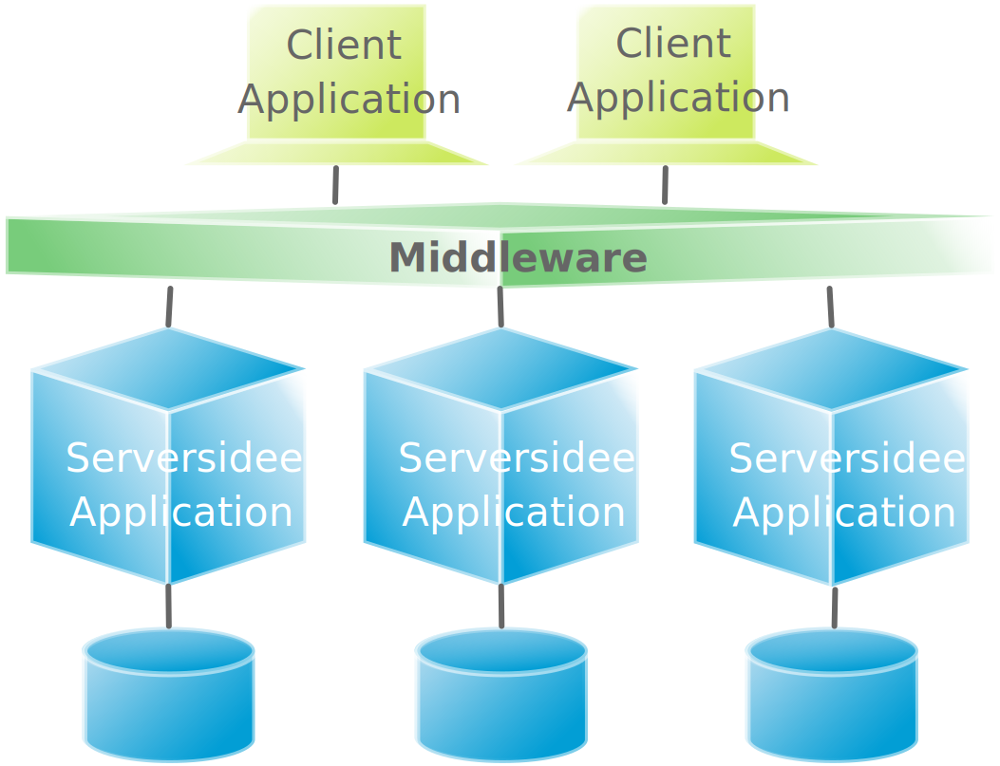
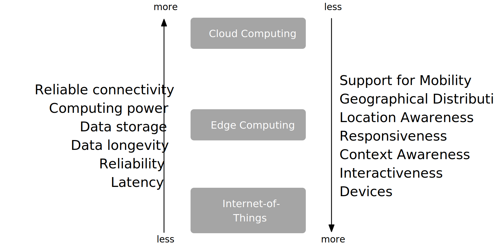

.. meta::
    :version: renaissance
    :author: Michael Eichberg
    :keywords: "Distributed Systems"
    :description lang=en: Introduction to Distributed Systems
    :id: lecture-ds-introduction
    :first-slide: last-viewed
    :exercises-master-password: WirklichSchwierig!
    
.. |html-source| source::
    :prefix: https://delors.github.io/
    :suffix: .html
.. |pdf-source| source::
    :prefix: https://delors.github.io/
    :suffix: .html.pdf

.. |at| unicode:: 0x40

.. role:: incremental   
.. role:: eng
.. role:: ger
.. role:: red
.. role:: green
.. role:: the-blue
.. role:: peripheral
.. role:: obsolete
.. role:: math-i
.. role:: math-r
.. role:: math-b

.. role:: raw-html(raw)
   :format: html

Introduction to Distributed Systems
================================================

A broad overview of distributed systems!

----

:Dozent: `Prof. Dr. Michael Eichberg <https://delors.github.io/cv/folien.de.rst.html>`__
:Kontakt: michael.eichberg@dhbw.de, Raum 149B
:Version: 1.0

.. supplemental::

  :Folien: 

      |html-source|

      |pdf-source|
      

  :Fehler melden:

      https://github.com/Delors/delors.github.io/issues

.. container:: footer-left incremental peripheral

    This slide set is based in parts on the following sources:
    
    (a) Maarten van Steen (material related to his book on *Distributed Systems*)

    (b) Henning Pagnia (based on his lecture *Verteilte Systeme*). 

    All errors are my own.

.. class:: padding-none no-title transition-scale

Basic Terminologioe of Distributed Systems
-------------------------------------------

.. image:: images/modern_software_architecture-tag_cloud.png
    :width: 100%
    :align: center

Recommended Literature
-----------------------

.. image:: screenshots/distributed-systems.net.png
    :width: 75%
    :align: center

.. supplemental::

    Supplemental material for interested students:

    .. image:: screenshots/microservices.jpg
        :width: 70%
        :align: center
        :class: trbl-shadow 

Recommended Podcast: `SE-Radio <https://se-radio.net>`__
-----------------------------------------------------------

Recommended Podcast: `Thoughtworks Technology Podcast <https://www.thoughtworks.com/en-de/insights/podcasts/technology-podcasts>`__
-------------------------------------------------------------------------------------------------------------------------------------

    

.. class:: new-section transition-fade

Distributed Systems - Definition and Properties
------------------------------------------------------------

Distributed vs. Decentralized 
-------------------------------------------------------------------

.. image:: images/distributed-vs-decentralized.svg
    :align: center
    :width: 100%
    :class: icon

.. supplemental:: 

    .. admonition:: Zwei Ansichten zur Realisierung verteilter Systeme

        - **Integrative view**: Connection of existing (locally) networked computer systems to form a larger system.
        - **Expansive view**: an existing networked computer system is expanded to include additional computers.

    .. definition::

        - A **decentralised system** is a networked computer system in which processes and resources are *necessarily* distributed across multiple computers.
        - A **distributed system** is a networked computer system in which processes and resources are *sufficiently* distributed across several computers.

Common misunderstandings regarding centralised systems
--------------------------------------------------------

.. class:: incremental-list 

1. **Centralized solutions do not scale**
         
   A distinction must be made between logical and physical centralization. 
   
   .. example::

      The *Domain Name System (DNS)*:

      .. class:: column-list

      - \ 

        - logisch zentralisiert
        - physisch (massiv) verteilt

      - \ 

        - dezentralisiert über mehrere Organisationen
  
2. **Centralized solutions have a single point of failure**

   Generally not true (e.g. DNS). 
    
   A single possible source of error is often...

   .. class:: column-list

   - \ 

     - easier to manage

   - \ 

     - easier to make more robust

.. supplemental:: 
    
    .. warning:: 

        There are many, poorly founded misconceptions about, for example, scalability, fault tolerance or security. We need to develop skills that make it easy to understand distributed systems in order to avoid such misunderstandings.

Perspectives on Distributed Systems
------------------------------------

**Distributes systems are complex.**

.. class:: incremental-list

:Architectures: What architectures and "architectural styles" are there?
:Processes: What kind of processes are there and what are their relationships?
:Communication: What options are there for exchanging data?
:Coordination: How are the involved systems coordinated?
:Naming: How do you identify resources?
:Consistency and replication: What trade-offs need to be made in terms of data consistency, replication and performance?
:Fault tolerance: How can operations be maintained even in the event of partial failures?
:Security: How can authorized access to resources be guaranteed?

Design-goals of Distributed Systems
------------------------------------

.. class:: incremental-list dhbw-list

- `Shared Usage of Resources`_ 
- `Distribution Transparency`_
- `Openness`_
- `Scalability`_

.. class:: new-subsection transition-fade

Shared Usage of Resources
------------------------------------

Shared Usage of Resources - Examples
---------------------------------------------

.. class:: incremental-list

- Cloud-based shared storage and files
- Peer-to-peer supported multimedia streaming
- Shared email services (e.g. outsourced email systems)
- Shared web hosting (e.g. *content distribution networks*)

.. class:: new-subsection transition-fade

Distribution Transparency
-------------------------------------------------------------

Definition 
----------------------------------------------------------

.. definition::

    .. rubric:: Distribution Transparency

    Transparency describes the property that a distributed system attempts to hide the fact that its processes and resources are physically distributed across multiple computers that may be separated by large(r) distances.
    
.. container:: incremental margin-top-2em

  The distribution transparency is realized by many different techniques of the so-called *middleware* - a layer between applications and operating systems.

Aspects of Distribution Transparency
----------------------------------------------------------------------------

.. csv-table:: 
    :class: incremental-table-rows booktabs
    :stub-columns: 1

    Data access, hide differences in data representation and the type of access to a local or remote object
    Location of data storage, hide where an object is located
    Relocation, hide that an object may be moved to another location while in use
    Migration, hide that an object may be moved to another location
    Replication, hide that an object is replicated
    Concurrency, hide that an object may be shared by several independent users
    Fault transparency, hide the failure and recovery of an object

.. supplemental::

    Datendarstellung: Big-Endian vs. Little-Endian; ASCII vs. Iso-Latin 8859-1 vs. UTF-8

Degree of achievable Distribution Transparency
-----------------------------------------------

.. observation::

    Complete distribution transparency cannot be achieved. 

.. container:: incremental

    However, a high level of distribution transparency can result in high costs.

.. class:: incremental-list

- There are communication latencies that cannot be hidden.
- It is (theoretically and practically) impossible to completely hide network and node failures.
- You cannot distinguish a slow computer from a failed computer.
- You can never be sure that a server was actually performing an operation before it crashed.
- "Complete transparency" costs performance and exposes the distribution of the system.
  
  - Keeping the replicas exactly on the same level as the master takes time 
  - Write operations are immediately transferred to the hard drive for fault tolerance

Disclosing Distribution can bring Advantages
-----------------------------------------------------

.. class:: incremental-list list-with-explanations

- Use of location-based services 
  (E. g. to enable finding friends nearby.)

- When dealing with users in different time zones
- When it is easier for a user to understand what is going on 

  (E.g. if a server does not respond for a long time, it can be reported as down).

.. observation::
    :class: incremental

    Distribution transparency is a noble goal, but often difficult to achieve and frequently not worth striving for. 

.. class:: new-subsection transition-fade

Open Distributed Systems
-------------------------------------------------------------

.. _openness:

\ 

Open Distributed Systems
----------------------------------

.. definition:: 

    An open distributed system offers components that can easily be used by other systems or integrated into other systems. 
    
    An open distributed system itself often consists of components that originate from elsewhere.

.. container:: incremental 

    Open distributed systems must be able to interact with services of other (open) systems, regardless of the underlying environment:

    .. class:: incremental-list

    - they should implement well-defined interfaces correctly
    - they should be able to interact easily with other systems
    - they should support the portability of applications 
    - they should be easily extensible

.. supplemental::
    
    Authentication services are one example. They can be used by many different applications.

Policies vs. Mechanisms
------------------------------------------------------------------------------

.. supplemental:: 

    :eng:`Policies vs. Mechanisms` ≘ :ger:`Vorgaben/Richtlinien vs. Umsetzungen`
    
.. rubric:: Policies when implementing openness

.. class:: incremental-list

- What level of consistency do we need for data in the client cache?
- What operations do we allow downloaded code to perform?
- Which QoS requirements do we adapt in the presence of fluctuating bandwidths?  
- What level of secrecy do we need for communication?

.. class:: incremental

.. rubric:: Mechanisms to support openness

.. class:: incremental-list

- Enabling the (dynamic) setting of caching policies
- Support of different trust levels for mobile code
- Provisioning of adjustable QoS parameters per data stream 
- Provisioning of various encryption algorithms

.. supplemental::

    The hard coding of policies often simplifies administration and reduces the complexity of the system. However, it comes at the price of less flexibility.

Security in Distributed Systems - Security Objectives
------------------------------------------------------

.. observation::

    A distributed system that is not secure is not reliable.

.. container:: incremental

    .. rubric:: Foundational security objectives

    :**Confidentiality**: Information is only passed on to authorized parties.
    :**Integrity**: Changes to the values of a system may only be made in an authorized manner.

.. supplemental::

    Together with the third security objective: **availability**, these three protection objectives form the CIA triad of information security: Confidentiality, Integrity, and Availability.

Security in Distributed Systems - Authorization, Authentication, Trust
-------------------------------------------------------------------------------------

.. class:: incremental-list

:Authentication: Process for verifying the correctness of a claimed identity.
:Authorization: Does an identified unit have the correct access rights?
:Trust: A component can be certain that another component will perform certain actions in accordance with expectations.

Security - Encryption and Signatures
---------------------------------------------

It is essentially about encrypting and decrypting data (:math-i:`X`) with the help of keys.

.. deck::

    .. card:: trbl-shadow padding-1em rounded-corners

        :math-i:`E(K,X)` means that we **e**\ ncrypt the message :math-i:`X` with the key :math-i:`K`. 
        
        :math-i:`D(K,X)` denotes the inverse function that **d**\ ecrypts the data.

    .. card:: trbl-shadow padding-1em

        .. rubric:: Symmetric Encryption

        The encryption key is identical to the decryption key; the same key :math-i:`K` is used for both operations.

        :math-i:`X = D(K,E(K,X))`
    
    .. card:: trbl-shadow padding-1em

        .. rubric:: Asymmetric Encryption

        We distinguish between private (:math-i:`PR`) and public keys (:math-i:`PU`) (:math-i:`PU` :math:`\neq` :math-i:`PR`). A private and a public key always form a pair. The private key must always be kept secret.
        
        .. deck:: incremental

            .. card::

                **Encrypting Messages**

                Alice sends a message to Bob using Bob's public key.

                .. math::
                    
                    Y = E(PU_{Bob},X) \\
                    X = D(PR_{Bob},Y)

            .. card:: 

                **Signing Messages**

                Alice signs (:math:`S`) a message with her private key.

                .. math::

                    Y = E(PR_{Alice},X) \\
                    X = D(PU_{Alice},Y)

Security - Secure Hashing 
------------------------------------------------------- 

A secure hash function :math-i:`Digest(X)` returns a character string of fixed length (:math-i:`H`).

- Any change - no matter how small - to the input data results in a completely different character string.
- With a hash value, it is mathematically impossible to find the original message :math-i:`X` based on :math-i:`Digest(X)`.

.. container:: incremental

    .. rubric:: Signing Messages

    .. class:: column-list incremental-list

    - Alice signs a message :math-i:`X` with her private key.

      .. math::
        \text{Alice:} [E(PR_{\text{Alice}},H=Digest(X)),X] 

    - Bob checks the message :math-i:`X` for authenticity:

      .. math::
        
        \text{Bob:} D(PU_{\text{Alice}},H) \stackrel{?}{=} Digest(X)

.. supplemental::

    :ger:`Sicheres Hashing` ≘ :eng:`Secure Hashing`

.. class:: exercises

Question
----------------

.. exercise:: Encryption with Public-Private Keys/Asymmetric Encryption

    If Alice sends Bob a message encrypted with Bob's public key, what security problem could arise?

    .. solution:: 
        :pwd: MITM_arise

        Alice cannot be sure that her message will not be exchanged! Anyone who intercepts the message can discard the message and encrypt their own with Bob's public key. Depending on the third party's background knowledge, this message may also look as if it comes from Alice.
        
        Bob can therefore not be sure that the message is from Alice.  

.. class:: new-subsection transition-fade

Scalability
---------------------- 

Scalability in Distributed Systems
-----------------------------------------

We can distinguish at least three types of scalability:

.. class:: incremental-list

- Number of users or processes (size scalability)
- Maximum distance between nodes (geographical scalability) 
- Number of administrative domains (administrative scalability)

.. supplemental::

    Scalability in terms of size can often be achieved by using more and more powerful servers that are operated in parallel.

    Geographical and administrative scalability is often a greater challenge.

Analysis of the Scalability of Centralized Systems
------------------------------------------------------------

.. deck::

    .. card::

        A centralized service can be modelled as a simple queuing system:

        .. image:: images/queuing-system.svg
            :align: center

        .. rubric:: Assumptions

        The queue has an infinite capacity, i.e. the arrival rate of requests is not influenced by the current length of the queue or by what is currently being processed.

    .. card::

        .. grid:: 

            .. cell::

                - Arrival rate of requests: 
                    
                  :math:`\lambda` *(requests per second)*

                - Processing capacity of the service: 
                        
                  :math:`\mu` *(requests per second)*

                  Proportion of time with :math-i:`x` requests in the system:

                  .. math::

                        p_x  = \bigl(1 - \frac{\lambda}{\mu}\bigr)\bigl(\frac{\lambda}{\mu}\bigr)^x

            .. cell::

                .. figure:: images/number_of_requests_in_system.svg
                    :align: center

                    # Requests in process and in queue 
                    
                    For example, the proportion of time in which the computer is *idle* (i. e. :math:`p_0`) is : 90 %, 60 % and 30 %.

                    .. presenter-note::
                    
                        :math:`p_0`; i. e. there are no/0 enquiries.

        .. presenter-note::

            The formula math:`p_x = \bigl(1 - \frac{\lambda}{\mu}\bigr)\bigl(\frac{\lambda}{\mu}\bigr)^x`  can be understood as follows: The probability that there are :math-i:`x` requests in the system decreases with the number of requests in the system. Therefore, :math:`\bigl(\frac{\lambda}{\mu}\bigr)^x` applies. Furthermore, we must model that there are "only" two requests (i. e. the system is otherwise "idle"). Therefore, we still have to multiply by :math:`p_0 = 1 - \frac{\lambda}{\mu}`.

    .. card:: 

        .. note::
            
            :math-i:`x` = # Anfragen im Sys.

            .. math::
                p_x  = \bigl(1 - \frac{\lambda}{\mu}\bigr)\bigl(\frac{\lambda}{\mu}\bigr)^x
            

        :math-i:`U` is the proportion of time in which a service is utilized:

        .. math::

            U = \sum_{x > 0} p_x = 1 - p_0 = \frac{\lambda}{\mu} \Rightarrow p_x = (1-U) U^x

        .. container:: incremental
                
            Average number of requests:

            .. math::

                \begin{matrix}
                    \bar{N} & = & \sum_{x\geq 0} x \cdot p_x 
                    = \sum_{x \geq 0} x \cdot (1-U)U^x \\
                    & = & (1-U)\sum_{x\geq 0} x\cdot U^x  
                    = \frac{(1-U)U}{(1-U)^2} = \frac{U}{1-U}
                \end{matrix}

        .. container:: incremental

            .. class:: column-list left-aligned-columns
            
            - Average throughput:
            - .. math::

                X = \underbrace{U \cdot \mu}_{\mbox{utilized}} + \underbrace{(1-U) \cdot 0}_{\mbox{unused}} = \frac{\lambda}{\mu} \cdot \mu = \lambda 

        .. supplemental::

            For an `infinite geometric series <https://de.wikipedia.org/wiki/Geometrische_Reihe#Konvergenz_und_Wert_der_geometrischen_Reihe>`__ with the quotient :math-i:`U` applies:

            .. math::
                \sum_{k\geq 0} k\cdot U^k  = \frac{U}{(1-U)^2} 

            Representation of the average number of requests in the system depending on the utilization :math-i:`U`:

            .. image:: images/average_number_of_requests_in_system.svg
                :align: center

    .. card:: 

        .. class:: column-list

        - The response time is the total time taken to process a request

          .. math::
            
            \begin{matrix}
                R & = \frac{\bar{N}}{X} = \frac{S}{1-U} \\
                & \Rightarrow \frac{R}{S} = \frac{1}{1-U} 
            \end{matrix}

          with :math:`S = \frac{1}{\mu}` for the average service time. 
            
        - \ 

          .. image:: images/response_time.svg
                :alt: Response time w.r.t. utilization
                
          .. class:: incremental-list

        \ 

        - If :math-i:`U` is small, the response time is close to :math-r:`1`, i.e. a request is processed immediately.
        - If :math-i:`U` increases to :math-r:`1`, the system comes to a standstill. 

Problems of Geographical Scalability
--------------------------------------------

- Many distributed systems assume synchronous client-server interactions and this prevents a transition from LAN to WAN. Latency times can be prohibitive if the client has to wait a long time for a request.
  
.. class:: incremental

- WAN connections are often unreliable by nature.

Problems of Administrative Scalability
--------------------------------------------

.. observation::

        Conflicting guidelines in terms of usage (and therefore payment), administration and security.

.. deck:: incremental

    .. card::

        .. example::

            - Grid computing: shared use of expensive resources across different domains.
            - Shared devices: How to control, manage and utilize a shared radio telescope designed as a large-scale shared sensor network?

    .. card::

        .. rubric:: Exception 

        Various peer-to-peer networks [#]_ where end users collaborate rather than administrative units:

        - File sharing systems (e.g. based on BitTorrent) 
        - Peer-to-peer telephony (early versions of Skype) 

        .. [#] Here, "peer" is to be understood as a network of equal computers.

Approaches to achieve Scaling
------------------------------------

.. deck::

    .. card::

        **Hiding communication latencies** through:

        - Use of asynchronous communication
        - Use of separate *handlers* for incoming responses 

        .. presenter-note::

            Here, we do not wait on the response, but continue with other tasks. When the response arrives, the corresponding handler is called and eventually executed.

        .. observation:: 
            :class: incremental

            However, this model is not always applicable.

    .. card::

        **Partitioning of data and calculations across multiple computers.**

        - Relocation of calculations to clients 
        - Decentralized naming services (e.g. DNS)
        - Decentralized information systems (e.g. WWW)

Shifting Calculations to Clients
------------------------------------------

.. image:: images/moving-computations.svg
    :align: center

Scaling via Replication and Caching
------------------------------------

**Use of replication and caching to make copies of data available on different computers.**

.. class:: incremental-list

- replicated file servers and databases 
- mirrored websites
- Web caches (in browsers and proxies) 
- File caching (on server and client)

Challenges of Replication 
---------------------------------------

.. class:: incremental-list

- Multiple copies (cached or replicated) inevitably lead to inconsistencies. Changing one copy means that this copy differs from the others.
- To achieve consistency, global synchronization is required for every change.

  .. attention:: 
    :class: incremental

    Global synchronization rules out solutions on a large scale.

.. supplemental::

    The extent to which inconsistencies can be tolerated is application-specific. However, if these can be tolerated, then the need for global synchronization can be reduced.

Parallel Computing
------------------------------------------------

.. class:: column-list
  
- Multiprocessor

  .. image:: images/multiprocessor-vs-multicomputer/multiprocessor.svg
            :align: center

- Multicomputer

  .. image:: images/multiprocessor-vs-multicomputer/multicomputer.svg
            :align: center

.. supplemental::

    Distributed high-performance computing began with parallel computing.

    **Distributed systems with shared memory** (i. e. multi-computers with shared memory) as an alternative architecture did not fulfil the expectations and are therefore no longer relevant.

Amdahl's law - Limits to Scalability
-----------------------------------------------------

.. deck::

    .. card::

        .. class:: list-with-explanations

        - Solving **fixed problems** in the shortest possible time

          Example: Booting a computer. To what extent can more CPUs/cores shorten the time?
        - It models the expected acceleration (*speedup*) of a partially parallelized/parallelizable program relative to the non-parallelized variant.

        .. definition:: 
            :class: encapsulate-floats

            .. note::

                :math:`C` = Number of CPUs 

                :math:`P` = Degree of parallelisation in percent
                
                :math:`S` = Speedup 

            :math:`S(C) = \frac{1}{(1-P) + \frac{P}{C}}`

    .. card::

        .. image:: images/amdahl.svg
            :alt: Amdahls Law visualized
            :align: center

Gustafson's Law - Limits to Scalability
-----------------------------------------------------

.. deck:: 

    .. card:: 
                
        .. class:: list-with-explanations

        - Solving problems with (very) large, structurally repetitive data sets in **fixed time**; the serial part of the programme is assumed to be constant.

          .. example:: 
            :class: margin-top-1em
            
            Create the weather forecast for the day after tomorrow within the next 24 hours. To what extent can the precision of the forecast be improved by using more CPUs/computers?

    .. card:: 
                
        .. container:: encapsulate-floats 

            .. note:: 
                :class: width-50 dd-margin-left-2em

                :`C`:math::  Number of CPUs 

                :`P`:math::  Degree of parallelisation as a function of the problem size :math-i:`n`
                
                :`S`:math::  Speedup 

            - Beschleunigung (Speedup) eines parallelisierten Programms relativ zu der nicht-parallelisierten Variante: 
            
              :math-i:`S(C)` :math-r:`= 1 +` :math-i:`P(n) · (C-1)`

        .. example::
            :class: incremental

            Let the degree of parallelization for a relevant problem size :math-i:`n` be :math-r:`80 %`. This results in a speedup of :math-r:`(1 + 0.8 · 3) = 3.4` for :math-r:`4` CPUs, a speedup of :math-r:`6.6` for :math-r:`8` CPUs and a speedup of :math-r:`13` for :math-r:`16` CPUs.

.. class:: exercises

Exercise
----------------

.. exercise:: Compute Speedup

    You are a pentester and you try to penetrate a system by attacking the passwords of the administrators. At the moment, you are using 2 graphics cards with 2048 compute units each. The serial part of the attack is 10 %. How high is the speedup you can expect, if you add two more comparable graphics cards with another 2048 compute units per GPU?

    .. background:: 
        
        The attacks are highly parallelizable and effectively depend on the number of CUs. The graphics cards are able to accelerate the attacks effectively.

    .. solution:: Computation of the Speedup
        :pwd: so schnell wird's

        This is a problem with structurally repeating data sets, i.e. Gustafson's law is applicable. The serial part is 10 %, i.e. the degree of parallelization is 90 %. The speedup is then:

        .. math::

                S(2*2048=4096) = 1 + 0.9 * 4095 = 3.686,5

                S((2*2048)+(2*2048)=8192) = 1 + 0.9 * 8191 = 7.372,9

                S(4096) / S(2048) \approx 1,9999457495

                S(8192) / S(4096) \approx 1,999972874

        .. remark:: 

            Computing with GPUs as such, i. e. with 2-GPUs vs. 4-GPUs, leads to a lower speedup, as the serial part of the attack is even more important.

.. class:: new-section transition-fade

Requirements on Distributed Systems
-------------------------------------

Dependability of Distributed Systems
------------------------------------------------------------

.. admonition:: Dependencies
    
    A **component**\ [#]_ provides **services** to its **clients**. For that, the component may in turn require services from other components and therefore the component is dependent on another component (:eng:`depend`).

.. definition::

    A component :math-i:`C` depends on :math:`C^*` if the correctness of the behavior of :math:`C` depends on the correctness of the behavior of :math:`C^*`.  

.. [#] Components are processes or channels.

.. supplemental::

    :eng:`Dependability` ≘ :ger:`Verlässlichkeit`

Requirements on the Reliability of Distributed Systems
------------------------------------------------------------

.. csv-table::
    :class: incremental-table-rows booktabs
    :align: center
    :header: "Requirement", "Description"

    Availability, The system is usable.
    Reliability, Continuity of correct service provision.
    Safety, Low probability of a catastrophic event.
    Maintainability, How easily can a failed system be recovered?

.. supplemental:: 

    .. attention::

        :eng:`Security` ≘ :ger:`Sicherheit`
    
        :eng:`Safety` ≘ :ger:`Sicherheit`
    
        Safety refers to the safety of people and property, while Security refers to the security of data and information.

Reliability vs. Availability in Distributed Systems
----------------------------------------------------------------------------------------------------

.. rubric:: Reliability :math-i:`R(t)` of the component :math-i:`C`

Conditional probability that :math-i:`C` worked correctly during :math:`[0,t)` if :math-i:`C` worked correctly at time :math-i:`T`  :math-r:`= 0`.

.. compound:: 
    :class: incremental

    .. rubric:: Traditional Metrics

    .. class:: incremental-list

    - Mean Time to Failure (:math-r:`MTTF`): 
  
      The average time to failure of a component. 

    - Mean Time to Repair (:math-r:`MTTR`): 
  
      The average time it takes to repair a component.

    - Mean Time between Failures (:math-r:`MTBF`): 
     
      :math-r:`MTTF + MTTR = MTBF`.

.. supplemental::

    :Reliability: How likely is it that a system will work *correctly*?
    :Availability: How likely is it that a system will be available at a given time?

    .. rubric:: :math-r:`MTBF` vs. :math-r:`MTTR`

    If the :math-r:`MTTF` of a component is :math-r:`100` hours and the :math-r:`MTTR` is :math-r:`10` hours, then the :math-r:`MTBF` is :math-r:`= MTTF + MTTR = 100 + 10 = 110` hours.

MapReduce - Programming model and Middleware for Parallel Computing
---------------------------------------------------------------------

.. class:: incremental-list list-with-explanations

- MapReduce is a programming model and a corresponding implementation (a framework originally developed by Google) for processing very large amounts of data (possibly TBytes).
- Programs implemented with the help of MapReduce are automatically parallelized and executed on a large cluster of commodity hardware.

  Responsibility of the runtime environment:

  - Partitioning the input data and distributing it to the computers in the cluster.
  - Scheduling and execution of the ``Map`` and ``Reduce`` functions on the computers of the cluster.
  - Error handling and communication between the computers.

.. hint:: 
    :class: incremental

    Not all kinds of computations can be performed with the help of MapReduce.
    

.. class:: smaller-slide-title

MapReduce - Visualization of an Example
----------------------------------------------------------

.. supplemental::

    Here it is the calculation of the frequency of words in a very large data set.

    Another canonical example is the calculation of an inverted index. I. e., the mapping of words to the documents/webpages in which they occur.

.. class:: exercises

Exercise
------------------------------------------------------

.. exercise:: Availability and Failure Probability

    Consider a large distributed system consisting of 500 independent computers which fail independently of each other. On average, each computer is unavailable for twelve hours within two days.

    (a) Determine the intact probability of a single computer.
    (b) A data set is replicated on three computers for reasons of fault tolerance. What is its average availability when we try to access it?
    (c) On how many computers do you have to store this data set so that the average availability is 99.999%? 
    (d) For how many minutes per year (with 365 days) is it *not possible to read the data set*, when we have an average availability of 99.999%?

    .. solution:: Solution
        :pwd: Laufend?

        (a) The availability of a single computer is :math-i:`p = 36h/48h = 0,75` 
        (b) The average availability (with :math-i:`p = 0.75`) of the data is :math:`1 - (1 - p)^3 = 0,984375` when we have three computers; :math-i:`(1-p)` ist die Ausfallwahrscheinlichkeit.
        (c) (Recall: :math:`log_a(u^v) = v \cdot log_a(u)`).
            
            The probability that they all fail at the same time must be less than or equal to the permitted unavailability:  :math:`(1-p)^x \leq (1-0,99999) \Leftrightarrow x \cdot log(1-p) \geq log(1-0,99999)`

            :math:`\Rightarrow x \geq log(1-0,99999)/log(1-p) \approx 8,3`
            
            The number of computers on which the data set must be replicated is 
            
            :math:`\lceil \frac{log(1-0,99999)}{log(1-p)} \rceil = 9`
        (d) In a year with 365 days, it is not possible to read the data :math-r:`(1 - 0.99999) · 365 · 24 · 60 = 5.256` minutes

.. class:: new-section transition-fade

Classification of Distributed Systems
-------------------------------------

Cluster Computing
--------------------

A group of high-end systems connected via a LAN.

.. supplemental::

    The individual computers/compute nodes are often identical (hardware and software) and are managed by a management node (:eng:`management node`).

Grid Computing
-------------------

Continuation of cluster computing. 

- Many heterogeneous nodes scattered over a wide area and across several organizations. 
- The nodes are connected via the WAN. 
- Collaboration takes place within the framework of a virtual organization.

.. supplemental::

    (Volunteer) Grid Computing - Examples:

    https://scienceunited.org

    https://einsteinathome.org

Basic Architecture for Grid Computing
---------------------------------------------

.. class:: column-list dd-margin-left-2em

- .. image:: images/architecture-for-grid-computing.svg

- .. class:: no-margin

  :Fabric layer: Provides interfaces to local resources (for querying status and capabilities, locking, etc.)
  :Connectivity layer: Communication / transaction / authentication protocols, e.g. for transferring data between resources.
  :Resource layer: Manages a single resource, e.g. creating processes or reading data.

.. class:: no-margin

:Collective Layer: Manages access to multiple resources: discovery, scheduling and replication.
:Applications: Contains actual grid applications in a single organisation.

.. supplemental::

    :ger:`Auffindung` ≘ :eng:`Discovery`

    :ger:`Einplanung` ≘ :eng:`Scheduling`

Peer-to-Peer-Systems
----------------------

:Vision: "The network is the computer." There is a database that is always accessible worldwide.
:Idea: 
   No dedicated clients and servers, each participant (peer) is both provider and customer.

   Self-organising, without a central infrastructure (coordinator, database, directory of participants).

   Each peer is autonomous and can be offline at any time, network addresses can change at will.

:Main Application: 
   File-Sharing-Systems (in particular BitTorrent)

.. supplemental::

    The peak of classic peer-to-peer systems was in the 2000s. 

    .. class:: positive-list

    - Advantages of P2P systems are: cheap, fault-tolerant, dynamic, self-configuring, immensely high storage capacity, high data access speed.

    .. class:: negative-list

    - Problems of P2P systems are: start-up, poorly connected, low performance peers; *free riders*; copyright problems.

Cloud-Computing
------------------

.. admonition:: Definition

   Cloud computing refers to the provision of computing power, storage and applications as a service. It is the continuation of grid computing.

.. container:: incremental margin-top-1em

    .. rubric:: Variants

    .. class:: list-with-explanations

    - Public Cloud (z. B. Amazon EC2, Google Apps, Microsoft Azure, …)
    - Private Cloud
    - Hybrid Cloud 
     
      (The private cloud is supplemented by a public cloud if required).
    - Virtual Private Cloud

.. supplemental:: 

    .. class:: positive-list

    - Advantages of cloud computing: costs, up-to-dateness of data and services, no in-house infrastructure required, support for mobile participants

    .. class:: negative-list

    - Problems of cloud computing: security and trust, loss of in-house expertise, handling of classified data.
  
      One way out could be `homomorphic encryption <https://de.wikipedia.org/wiki/Homomorphe_Verschlüsselung>`_, which makes it possible to perform calculations on encrypted data. 

*Serverless Computing*
----------------------

*Serverless Computing* enables developers to create applications faster, as they no longer have to worry about managing the Infrastructure.  

.. class:: positive-list incremental

- The cloud service provider automatically provides, scales and manages the infrastructure required to run the code.

.. class:: negative-list incremental list-with-explanations

  - Vendor-Lock-In
  - Cold-boot latency
  
    Time until the first code is executed can be longer, as the serverless functions are only instantiated when required.
  - Debugging and Monitoring

    Traditional tools and methods can no longer be used.
  - Cost-transparency/-management

    The costs of serverless computing are difficult to predict and control. 

.. class:: new-section transition-fade

Challenges in Developing Distributed Systems
-------------------------------------------------------------

Application Integration
---------------------------------

.. container:: assessment
    
    Typical enterprise applications in companies are networked applications and establishing interoperability between these applications is a major challenge.

.. container:: incremental margin-top-1em

    .. rubric:: Basic Approach

    *Clients* combine requests for (different) applications, send them, collect the responses and present a coherent result to the user.

.. container:: incremental margin-top-1em

    .. rubric:: Modern Approach

    Direct communication between applications leads to the integration of enterprise applications  (Enterprise Application Integration (EAI)).

.. supplemental::

    A networked application is an application that runs on a server and makes its services available to remote clients. 

Transactions at Business Process Level
-----------------------------------------

.. grid:: 

    .. cell:: 

        .. image:: images/transactions/transaction.svg
            :align: center

        .. container:: text-align-center margin-top-1em

            **„All or nothing.“**

    .. cell::
        :class: width-60

        .. deck::

            .. card::

                .. csv-table::
                    :header: "Primitive", "Description"

                    BEGIN OF TRANSACTION, Indicates the start of a transaction.
                    END OF TRANSACTION, Completes the transaction with an attempt to COMMIT.
                    ROLLBACK OF TRANSACTION, terminate the transaction and restore the old status.
                    READ, "Reading data from (e.g.) a file or a table."
                    WRITE, "Writing data (e.g.) to a file or a table."

            .. card:: 

                .. rubric:: ACID-Properties:

                :Atomic: happens inseparably (seemingly)
                :Consistent: no violation of system invariants
                :Isolated: no mutual influence
                :Durable: after a commit, the changes are permanent

                

.. class:: smaller

*Transaction Processing Monitor (TPM)*
---------------------------------------

.. image:: images/transactions/tpm.svg
    :align: center

.. supplemental::

    .. observation::

        The data required for a transaction is often distributed across several servers. 

        A TPM is responsible for coordinating the execution of a transaction.

.. supplemental::

    When you implement microservices, the use of TPMs and 2PC for the purpose of coordinating business processes is often not the first choice. 

    Nevertheless, distributed transactions are an important part of distributed systems and Google, for example, has developed Spanner, a solution that enables transactions on a global scale (*Global Consistency*). (https://cloud.google.com/spanner?hl=en and https://www.youtube.com/watch?v=iKQhPwbzzxU).
       

*Middleware* and *Enterprise Application Integration (EAI)*
------------------------------------------------------------

Middleware enables communication between applications.

.. supplemental::

    :Remote Procedure Call (RPC): Requests are sent via a local procedure call, packaged as a message, processed, answered by a message and the result is then the return value of the procedure call.

    :Message Oriented Middleware (MOM): Messages are sent (i. e. published) to a logical contact point (i. e. message broker) and forwarded to applications that subscribe to these messages.

How can application integration be achieved?
-----------------------------------------------------

.. class:: incremental-list dd-margin-left-2em

:File transfer: 

  Technically simple, but not flexible:

  - Determine the file format and layout
  - Regulate file management
  - Passing on updates and update notifications
:Shared database: Way more flexible, but still requires a common data schema in addition to the risk of a bottleneck.
:Remote Procedure Call (RPC): Effective when execution of a series of actions is required.
:Messaging: Enables temporal and spatial decoupling compared to RPCs.

.. class:: new-section transition-fade

Modern Distributed Systems
--------------------------------------------

*Distributed Pervasive/Ubiquitous Systems* 
------------------------------------------------------------------------

.. supplemental::

    :eng:`Distributed Pervasive/Ubiquitous Systems` ≘ :ger:`verteilte, allgegenwärtige/alles durchdringende Systeme`

.. container:: margin-bottom-1em

    Modern distributed systems are characterised by the fact that the nodes are small, mobile and often embedded in a larger system. The system embeds itself naturally in the user's environment. Networking is wireless.

.. container:: incremental margin-top-1em

    .. rubric:: Three (overlapping) subtypes

    :Ubiquitous computing: *ubiquitous and always present*; i. e. there is constant interaction between the system and the user.
    :Mobile computing: *ubiquitous*; the focus is on the fact that devices are inherently mobile.
    :Sensor/Actuator Networks: *ubiquitous*; focus is on actual (collaborative) sensing and actuation.

*Ubiquitous Systems* - Key Elements
--------------------------------------------

.. class:: incremental-list

:Distribution: The devices are networked, distributed and accessible without barriers.
:Interaction: The interaction between users and devices is highly unobtrusive. 
:Context awareness: the system knows the user's context in order to optimize the interaction.
:Autonomy: The devices work autonomously, without human intervention, and manage themselves independently to a high degree.
:Intelligence: The system as a whole can handle a wide range of dynamic actions and interactions.

*Mobile Computing* - Characterizing features
--------------------------------------------

.. class:: incremental-list 

- A variety of different mobile devices (smartphones, tablets, GPS devices, remote controls, active ID cards).
- Mobile means that the location of a device can change over time. This can, e. g., have an impact on local services or accessibility.
- Maintaining stable communication can lead to serious problems.
        
.. observation:: 
    :class: incremental margin-top-1em

    The current status is that mobile devices establish connections to stationary servers, making them in principle *clients* of cloud-based services.

*Mobile Cloud Computing*
-------------------------------------------- 

.. image:: images/mobile_computing/mobile_cloud_computing.svg
    :align: center

*Mobile Edge Computing*
--------------------------------------------

.. image:: images/mobile_computing/mobile_edge_computing.svg
    :align: center

*Sensor Networks* 
--------------------------------------------

The nodes to which sensors are attached:

- "many"
- simple (low memory / computing / communication capacity) 
- often battery-operated (or even battery-free)

*Sensor Networks* as Distributed Databases
--------------------------------------------

.. image:: images/sensor_networks/nodes_store_and_process_data.svg
    :align: center

The *Cloud-Edge Continuum*
--------------------------------

Pitfalls in Developing Distributed Systems
-----------------------------------------------------

.. observation::

    Many distributed systems are unnecessarily complex due to incorrect assumptions and architectural and design errors that have to be rectified later.

.. container:: incremental

    .. rubric:: Incorrect (and often hidden) assumptions

    .. class:: incremental-list

    - The network is reliable
    - The network is secure
    - The network is homogeneous 
    - The topology does not change 
    - The latency is zero
    - The bandwidth is infinite
    - The transport costs are zero
    - There is only one administrator

