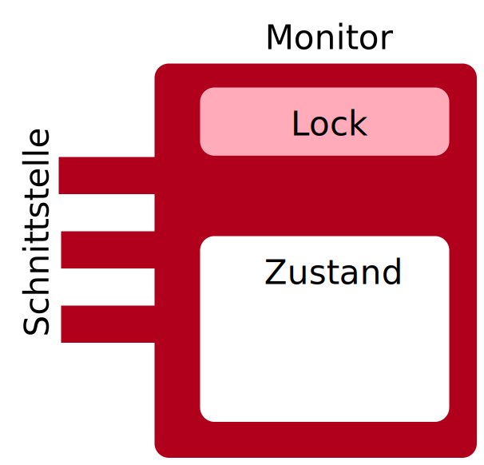
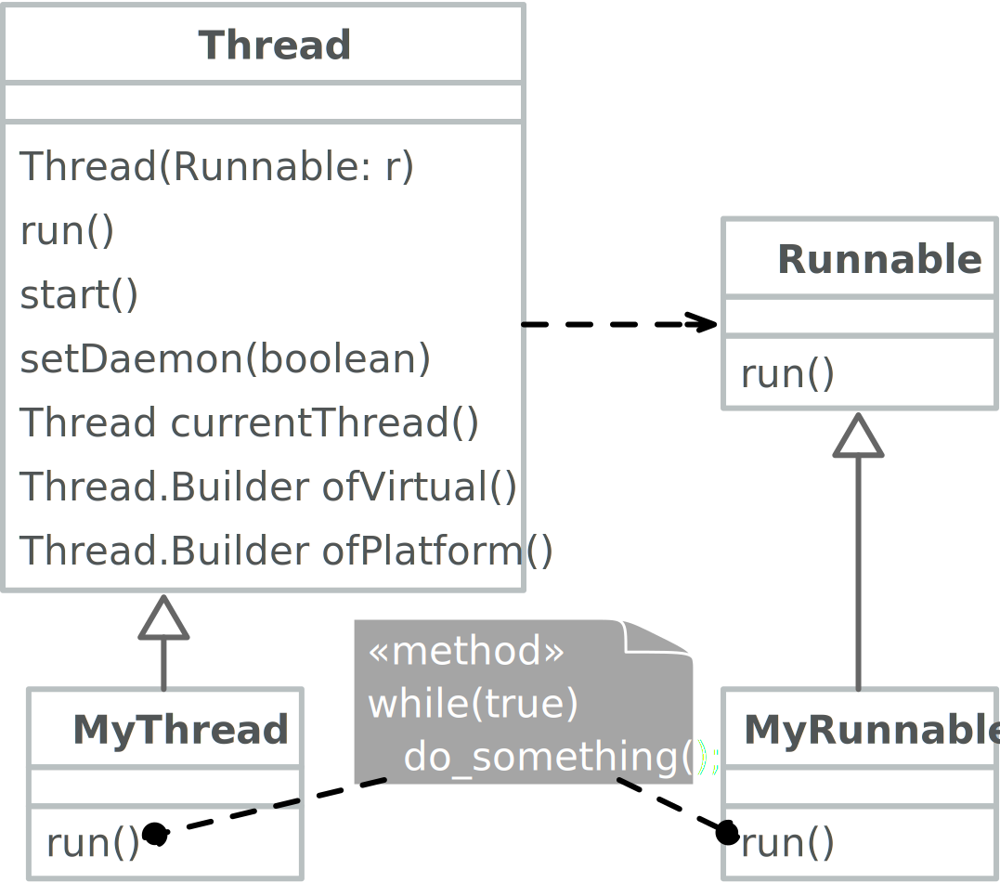
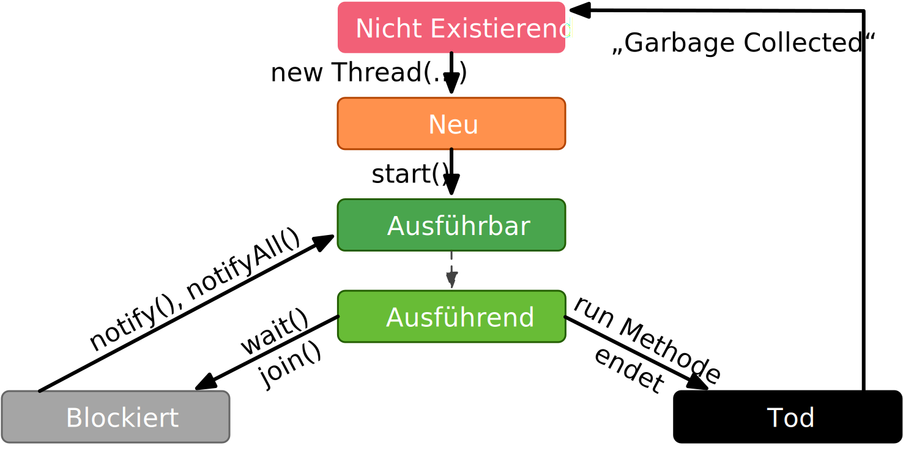

.. meta::
    :version: renaissance
    :author: Michael Eichberg
    :keywords: "Java", "Concurrency"
    :description lang=de: Nebenläufigkeit in Java
    :description lang=en: Concurrency in Java
    :id: lecture-ds-nebenlaeufigkeit-in-java
    :first-slide: last-viewed
    :master-password: WirklichSchwierig!

.. include:: ../docutils.defs

Nebenläufigkeit in Java
===============================================================================

:eng:`Concurrency` in Java

:Dozent: `Prof. Dr. Michael Eichberg <https://delors.github.io/cv/folien.de.rst.html>`__
:Kontakt: michael.eichberg@dhbw.de
:Version: 1.0.1

.. supplemental::

  :Folien:

    |html-source|

    |pdf-source|
  :Fehler melden:

    https://github.com/Delors/delors.github.io/issues

.. class:: no-title center-content

Nebenläufigkeit
--------------------------------------------------------------------------------

.. container:: exclamation-mark

  Ein gutes Verständnis von nebenläufiger Programmierung ist für die Entwicklung von verteilten Anwendungen unerlässlich, da Server immer mehrere Anfragen gleichzeitig bearbeiten.

Prozesse vs. Threads
--------------------------------------------------------

.. deck::

  .. card::

    .. image:: drawings/threads/threads.svg
      :alt: Prozesse vs. Threads
      :align: center

  .. card:: overlay

    .. image:: drawings/threads/fibres.svg
      :align: center

  .. card:: overlay

    .. image:: drawings/threads/virtual_threads.svg
      :align: center

.. supplemental::

  - Prozesse sind voneinander isoliert und können nur über explizite Mechanismen miteinander kommunizieren; Prozesse teilen sich nicht denselben Adressraum.
  - Alle Threads eines Prozesses teilen sich denselben Adressraum. *Native Threads* sind vom Betriebssystem unterstützte Threads, die direkt vom Betriebssystem verwaltet werden. Standard Java Threads sind *Native Threads*.

  - *Fibres* (auch *Coroutines*) nutzen immer kooperatives Multitasking. D. h. ein Fibre gibt die Kontrolle an eine andere Fibre explizit ab. (Früher auch als *Green Threads* bezeichnet.) Diese sind für das Betriebssystem unsichtbar.

  - Ab Java 21 unterstützt Java nicht nur klassische (native) Threads sondern zusätzlich auf Virtual Threads. Letztere erlauben insbesondere eine sehr natürliche Programmierung von Middleware, die sich um die Parallelisierung/Nebenläufigkeit kümmert.

Kommunikation und Synchronisation mit Hilfe von *Monitoren*
-------------------------------------------------------------------

Ein *Monitor* ist ein Objekt, bei dem die Methoden im wechselseitigen Ausschluss (engl. *mutual exclusion*) ausgeführt werden.

Bedingungs-Synchronisation

- drückt eine Bedingung für die Reihenfolge der Ausführung von Operationen aus.
- z. B. können Daten erst dann aus einem Puffer entfernt werden, wenn Daten in den Puffer eingegeben wurden.
- Java unterstützt pro Monitor nur eine (anonyme) Bedingungs-Variable, mit den klassischen Methoden :java:`wait` und :java:`notify` bzw. :java:`notifyAll`.

.. supplemental::

  .. warning::

     In Java findet der wechselseitige Ausschluss nur zwischen solchen Methoden statt, die explizit als :java:`synchronized` deklariert wurden.

  *Monitore* sind nur ein Modell (Alternativen: *Semaphores*, *Message Passing*), das die Kommunikation und Synchronisation von Threads ermöglicht. Es ist das Standardmodell in Java und wird von der Java Virtual Machine (JVM) unterstützt.

Kommunikation zwischen Threads mit Hilfe von Monitoren
--------------------------------------------------------------------

- Durch Lesen und Schreiben von Daten, die in gemeinsamen Objekten gekapselt sind, die durch Monitore geschützt werden.
- Jedes Objekt ist implizit von der Klasse :java:`Object` abgeleitet, welche eine gegenseitige Ausschlusssperre definiert.
- Methoden in einer Klasse können als :java:`synchronized` gekennzeichnet werden. Die Methode wird erst dann ausgeführt, wenn die Sperre vorliegt. Bis dahin wird gewartet. Dieser Prozess geschieht automatisch.
- Die Sperre kann auch über eine :java:`synchronized` Anweisung erworben werden, die das Objekt benennt.
- Ein Thread kann auf eine einzelne (anonyme) Bedingungsvariable warten und diese benachrichtigen.

Nebenläufigkeit in Java
--------------------------------------------------------------------------------

.. supplemental::

  - Threads werden in Java über die vordefinierte Klasse java.lang.Thread bereitgestellt.
  - Alternativ kann das Interface:

    :java:`public interface Runnable { void run(); }`

    implementiert werden und an ein Thread-Objekt übergeben werden.
  - Threads beginnen ihre Ausführung erst, wenn die :java:`start`-Methode in der Thread-Klasse aufgerufen wird. Die :java:`Thread.start`-Methode ruft die :java:`run`-Methode auf. Ein Aufruf der :java:`run`-Methode direkt führt nicht zu einer parallelen Ausführung.
  - Der aktuelle Thread kann mittels der statischen Methode :java:`Thread.currentThread()` ermittelt werden.
  - Ein Thread wird beendet, wenn die Ausführung seiner Run-Methode entweder normal oder als Ergebnis einer unbehandelten Ausnahme endet.

  - Java unterscheidet *User*-Threads und *Daemon*-Threads.

    *Daemon-Threads* sind Threads, die allgemeine Dienste bereitstellen und normalerweise nie beendet werden.

    Wenn alle Benutzer-Threads beendet sind, werden die Daemon-Threads von der JVM beendet, und das Hauptprogramm wird beendet.

    Die Methode :java:`setDaemon` muss aufgerufen werden, bevor der Thread gestartet wird.

Inter-Thread-Kommunikation bzw. Koordination
--------------------------------------------------------------------------------

- Ein Thread kann (mit oder ohne Zeitüberschreitung) auf die Beendigung eines anderen Threads (des Ziels) warten, indem er die :java:`join`-Methode für das Thread-Objekt des Ziels aufruft.
- Mit der Methode :java:`isAlive` kann ein Thread feststellen, ob der Ziel-Thread beendet wurde.

Java Thread States
--------------------------------------------------------------------------------

:java:`synchronized`-Methoden und :java:`synchronized`-Blöcke
--------------------------------------------------------------------

- Jedem Objekt ist eine gegenseitige Ausschlusssperre zugeordnet. Auf die Sperre kann von der Anwendung nicht explizit zugegriffen werden. Dies geschieht implizit, wenn:

  - eine Methode den Methodenmodifikator :java:`synchronized` verwendet
  - Blocksynchronisierung mit dem Schlüsselwort :java:`synchronized` verwendet wird

- Wenn eine Methode als synchronisiert gekennzeichnet ist, kann der Zugriff auf die Methode nur erfolgen, wenn das System die Sperre erhalten hat.
- Daher haben synchronisierte Methoden einen sich gegenseitig ausschließenden Zugriff auf die vom Objekt gekapselten Daten, :red:`wenn auf diese Daten nur von anderen synchronisierten Methoden zugegriffen wird`.
- Nicht-synchronisierte Methoden benötigen keine Sperre und können daher *jederzeit* aufgerufen werden.

Beispiel: Synchronisierte Methode
--------------------------------------------------------------------------------

.. deck::

  .. card::

    .. code:: java
      :class: copy-to-clipboard
      :number-lines:

      public class SynchronizedCounter {

        private int count = 0;

        public synchronized void increment() {
          count++;
        }

        public synchronized int getCount() {
          return count;
        }
      }

  .. card::

    .. code:: java
      :class: copy-to-clipboard
      :number-lines:

      public class SharedLong {

        private long theData; // reading and writing longs is not atomic

        public SharedLong(long initialValue) {
          theData = initialValue;
        }

        public synchronized long read() { return theData; }

        public synchronized void write(long newValue) { theData = newValue; }

        public synchronized void incrementBy(long by) {
          theData = theData + by;
        }
      }

        SharedLong myData = new SharedLong(42);

  .. card::

    .. code:: java
      :class: copy-to-clipboard
      :number-lines:

      public class SynchronizedCounter {

        private int count = 0;

        public void increment() {
          synchronized(this) {
            count++;
          }
        }

        public int getCount() {
          synchronized(this) {
            return count;
          }
        }
      }

.. supplemental::

  .. warning::

    Wenn :java:`synchronized` in seiner ganzen Allgemeinheit verwendet wird, kann er einen der Vorteile von klassischen Monitoren untergraben: Die Kapselung von Synchronisationseinschränkungen, die mit einem Objekt verbunden sind, an einer einzigen Stelle im Programm!

  Dies liegt daran, dass es nicht möglich ist, die mit einem bestimmten Objekt verbundene Synchronisation zu verstehen, indem man sich nur das Objekt selbst ansieht. Andere Objekte können bgzl. des Objekts eine :java:`synchronized`-Block verwenden.

Komplexe Rückgabewerte
------------------------------

.. code:: java
  :class: copy-to-clipboard
  :number-lines:

  public class SharedCoordinate {

    private int x, y;

    public SharedCoordinate(int initX, int initY) {
      this.x = initX; this.y = initY;
    }

    public synchronized void write(int newX, int newY) {
      this.x = newX; this.y = newY;
    }

    /*⚠️*/ public /* synchronized irrelevant */ int readX() { return x; } /*⚠️*/
    /*⚠️*/ public /* synchronized irrelevant */ int readY() { return y; } /*⚠️*/

    public synchronized SharedCoordinate read() {
      return new SharedCoordinate(x, y);
  } }

.. supplemental::

  Die beiden Methoden: :java:`readX` und :java:`readY` sind nicht synchronisiert, da das Lesen von :java:`int`-Werten atomar ist. Allerdings erlauben sie das Auslesen eines inkonsistenten Zustands! Es ist denkbar, dass direkt nach einem :java:`readX` der entsprechende Thread unterbrochen wird und ein anderer Thread die Werte von :java:`x` und :java:`y` verändert. Wird dann der ursprüngliche Thread fortgesetzt, und ruft :java:`readY` auf, so erhält er den neuen Wert von :java:`y` und hat somit ein paar :java:`x`, :java:`y` vorliegen, dass in dieser Form nie existiert hat.

  Ein konsistenter Zustand kann nur durch die Methode :java:`read` ermittelt werden, die die Werte von :java:`x` und :java:`y` in einem Schritt ausliest und als Paar zurückgibt.

  Kann sichergestellt werden, dass ein auslesender Thread die Instanz in einem :java:`synchronized` Block benennt, dann kann die Auslesung eines konsistenten Zustands auch bei mehreren Methodenaufrufen hintereinander sichergestellt werden.

  .. code:: java
    :class: copy-to-clipboard
    :number-lines:

    SharedCoordinate point = new SharedCoordinate(0,0);
    synchronized (point1) {
      var x = point1.readX();
      var y = point1.readY();
    }
    // do something with x and y

  Diese „Lösung“ muss jedoch als sehr kritisch betrachtet werden, da die Wahrscheinlichkeit von Programmierfehlern *sehr hoch* ist und es dann entweder zur *Race Conditions* oder zu *Deadlocks* kommen kann.

Bedingte Synchronisation
--------------------------------------------------------------------------------

  Zum Zwecke der bedingten Synchronisation können in Java die Methoden :java:`wait`, :java:`notify` und :java:`notifyAll` verwendet werden.  Diese Methoden erlauben es auf bestimmte Bedingungen zu warten und andere Threads zu benachrichtigen, wenn sich die Bedingung geändert hat.

.. deck:: incremental

  .. card::

    - Diese Methoden können nur innerhalb von Methoden verwendet werden, die die Objektsperre halten; andernfalls wird eine :java:`IllegalMonitorStateException` ausgelöst.

  .. card::

    - Die :java:`wait`-Methode blockiert immer den aufrufenden Thread und gibt die mit dem Objekt verbundene Sperre frei.

  .. card::

    - Die :java:`notify`-Methode weckt *einen* wartenden Thread auf. Welcher Thread aufgeweckt wird, ist nicht spezifiziert.

      :java:`notify` gibt die Sperre nicht frei; daher muss der aufgeweckte Thread warten, bis er die Sperre erhalten kann, bevor er fortfahren kann.
    - Um alle wartenden Threads aufzuwecken, muss die Methode :java:`notifyAll` verwendet werden.

      Warten die Threads aufgrund unterschiedlicher Bedingungen, so ist immer :java:`notifyAll` zu verwenden.
    - Wenn kein Thread wartet, dann haben :java:`notify` und :java:`notifyAll` keine Wirkung.

  .. card::

    .. important::

      Wenn ein Thread aufgeweckt wird, kann er nicht davon ausgehen, dass seine Bedingung erfüllt ist!

      Die Bedingung ist immer in einer Schleife zu prüfen und der Thread muss ich ggf. wieder in den Wartezustand versetzen.

Beispiel: Synchronisation mit *Condition Variables*
-------------------------------------------------------------------------------

.. deck::

  .. card::

    Wenn ein Thread auf eine Bedingung wartet, kann kein anderer Thread auf die andere Bedingung warten.

    :peripheral:`Mit den bisher vorgestellten Primitiven ist eine direkte Modellierung dieses Szenarios so nicht möglich. Stattdessen müssen immer alle Threads aufgeweckt werden, um sicherzustellen, dass auch der intendierte Thread aufgeweckt wird. Deswegen ist auch das Überprüfen der Bedingung in einer Schleife notwendig.`

  .. card::

    Ein *BoundedBuffer* hat z. B. traditionell zwei Bedingungsvariablen: *BufferNotFull* und *BufferNotEmpty*.

    .. code:: java
      :class: copy-to-clipboard
      :number-lines:

      public class BoundedBuffer {
        private final int buffer[];
        private int first;
        private int last;
        private int numberInBuffer = 0;
        private final int size;

        public BoundedBuffer(int length) {
          size = length;
          buffer = new int[size];
          last = 0;
          first = 0;
        };

  .. card::

    .. code:: java
      :class: copy-to-clipboard
      :number-lines: 14

        public synchronized void put(int item) throws InterruptedException {
          while (numberInBuffer == size)
            wait();
          last = (last + 1) % size;
          numberInBuffer++;
          buffer[last] = item;
          notifyAll();
        };

  .. card::

    .. code:: java
      :class: copy-to-clipboard
      :number-lines: 22

        public synchronized int get() throws InterruptedException {
          while (numberInBuffer == 0)
            wait();
          first = (first + 1) % size;
          numberInBuffer--;
          notifyAll();
          return buffer[first];
        }
      }

  .. card::

    Fehlersituation, die bei der Verwendung von :java:`notify` statt :java:`notifyAll` auftreten könnte:

    .. code:: java
      :class: copy-to-clipboard
      :number-lines: 1

      BoundedBuffer bb = new BoundedBuffer(1);
      Thread g1,g2 = new Thread(() => { bb.get(); });
      Thread p1,p2 = new Thread(() => { bb.put(new Object()); });
      g1.start(); g2.start(); p1.start(); p2.start();

    .. csv-table::
      :header: , "Aktionen", "(Änderung des) Zustand(s) des Buffers", "Auf die Sperre (*Lock*) wartend", "An der Bedingung wartend"
      :widths: 3, 25, 50, 33, 39
      :class: s-smaller incremental-table-rows

      1, "**g1:bb.get()** :raw-html:` `
      g2:bb.get(), p1:bb.put(), p2:bb.put()", empty, "{g2,p1,p2}", {g1}
      2, "**g2:bb.get()**", empty,"{p1,p2}", "{g1,g2}"
      3, "**p1:bb.put()**", empty → not empty, "{p2,g1}", {g2}
      4, "**p2:bb.put()**", not empty,{g1}, "{g2,p2}"
      5, "**g1:bb.get()**", not empty → empty ,{g2},{p2}
      6, **g2:bb.get()**, empty, ∅, "{g2,p2}"

.. supplemental::

  In Schritt 5 wurde von der VM - aufgrund des Aufrufs von :java:`notify` durch :java:`g1` - der Thread :java:`g2` aufgeweckt - anstatt des Threads :java:`p2`. Der aufgeweckte Thread :java:`g2` prüft die Bedingung (Schritt 6) und stellt fest, dass der Buffer leer ist. Er geht wieder in den Wartezustand. Jetzt warten sowohl ein Thread, der ein Wert schreiben möchte als auch ein Thread, der einen Wert lesen möchte.

.. class:: new-section

Fortgeschrittene Synchronisationsmechanismen, -primitive und -konzepte.
--------------------------------------------------------------------------------

Java API für nebenläufige Programmierung
--------------------------------------------------------------------------------

:java.util.concurrent: Bietet verschiedene Klassen zur Unterstützung gängiger nebenläufiger Programmierparadigmen, z. B. Unterstützung für *BoundedBuffers* oder Thread-Pools.
:java.util.concurrent.atomic: Bietet Unterstützung für sperrfreie (*lock-free*), thread-sichere Programmierung auf einfachen Variablen — wie zum Beispiel atomaren Integern — an.
:java.util.concurrent.locks: Bietet verschiedene Sperralgorithmen an, die die Java-Sprachmechanismen ergänzen, z. B. Schreib-Lese-Sperren und Bedingungsvariablen. Dies ermöglicht zum Beispiel: „Hand-over-Hand“ oder „Chain Locking“.

.. class:: smaller

Beispiel: Synchronisation mit *ReentrantLock*\ s.
-------------------------------------------------------------------------------

Ein *BoundedBuffer* hat z. B. traditionell zwei Bedingungsvariablen: *BufferNotFull* und *BufferNotEmpty*.

.. deck::

  .. card::

    .. code:: java
      :class: copy-to-clipboard
      :number-lines:

      public class BoundedBuffer<T> {

        private final T buffer[];
        private int first;
        private int last;
        private int numberInBuffer;
        private final int size;

        private final Lock lock = new ReentrantLock();
        private final Condition notFull = lock.newCondition();
        private final Condition notEmpty = lock.newCondition();

  .. card::

    .. code:: java
      :class: copy-to-clipboard
      :number-lines: 12

        public BoundedBuffer(int length) { /* Normaler Constructor. */
          size = length;
          buffer = (T[]) new Object[size];
          last = 0;
          first = 0;
          numberInBuffer = 0;
        }

  .. card::

    .. code:: java
      :class:  copy-to-clipboard
      :number-lines: 19

        public void put(T item) throws InterruptedException {
          lock.lock();
          try {

            while (numberInBuffer == size) { notFull.await(); }
            last = (last + 1) % size;
            numberInBuffer++;
            buffer[last] = item;
            notEmpty.signal();

          } finally {
            lock.unlock();
          }
        }

  .. card::

    .. code:: java
      :class: copy-to-clipboard
      :number-lines: 33

        public T get() ... {
          lock.lock();
          try {

            while (numberInBuffer == 0) { notEmpty.await(); }
            first = (first + 1) % size;
            numberInBuffer--;
            notFull.signal();
            return buffer[first];

          } finally {
            lock.unlock();
          }
        }
      }

Thread Prioritäten
--------------------------------------------------------------------------------

.. class:: incremental-list

- Obwohl den Java-Threads Prioritäten zugewiesen werden können (:java:`setPriority`), dienen sie dem zugrunde liegenden Scheduler nur als Richtschnur für die Ressourcenzuweisung.
- Sobald ein Thread läuft, kann er die Prozessorressourcen explizit aufgeben, indem er die :java:`yield`-Methode aufruft.
- :java:`yield` setzt den Thread an das Ende der Warteschlange für seine Prioritätsstufe.
- Die Scheduling- und Prioritätsmodelle von Java sind jedoch schwach:

  - Es gibt keine Garantie dafür, dass immer der Thread mit der höchsten Priorität ausgeführt wird, der lauffähig ist.
  - Threads mit gleicher Priorität können in Zeitscheiben unterteilt sein oder auch nicht.
  - Bei der Verwendung nativer Threads können unterschiedliche Java-Prioritäten auf dieselbe Betriebssystempriorität abgebildet werden.

Best Practices
-----------------------------------------------------------

.. class:: important incremental-list

- :java:`synchronized` Code sollte so kurz wie möglich gehalten werden.
- Verschachtelte Monitoraufrufe sollten vermieden werden, da die äußere Sperre nicht freigegeben wird, wenn der innere Monitor wartet. Dies kann leicht zum Auftreten eines Deadlocks führen.

.. class:: no-title center-content

Ressourcen immer in der gleichen Reihenfolge sperren
------------------------------------------------------------------

.. warning::

  Wenn zwei (oder mehr) Threads auf die gleichen Ressourcen in unterschiedlicher Reihenfolge zugreifen, kann es zu einem Deadlock kommen.

.. important::
  :class: incremental

  **Ressourcen sind immer in der gleichen Reihenfolge zu sperren**, um Deadlocks zu vermeiden.

.. class:: new-section

Thread Safety
--------------------------------------------------------------------------------

:ger:`Threadsicherheit`

Thread Safety - Voraussetzung
--------------------------------------------------------------------------------

Damit eine Klasse thread-sicher ist, muss sie sich in einer single-threaded Umgebung korrekt verhalten.

.. deck::

  .. card::

    D. h. wenn eine Klasse korrekt implementiert ist, dann sollte keine Abfolge von Operationen (Lesen oder Schreiben von öffentlichen Feldern und Aufrufen von öffentlichen Methoden) auf Objekten dieser Klasse in der Lage sein:

      - das Objekt in einen ungültigen Zustand versetzen,
      - das Objekt in einem ungültigen Zustand zu beobachten oder
      - eine der Invarianten, Vorbedingungen oder Nachbedingungen der Klasse verletzen.

  .. card::

    Die Klasse muss das korrekte Verhalten auch dann aufweisen,
    wenn auf sie von mehreren Threads aus zugegriffen wird.

    - Unabhängig vom *Scheduling* oder der Verschachtelung der Ausführung dieser Threads durch die Laufzeitumgebung,
    - Ohne zusätzliche Synchronisierung auf Seiten des aufrufenden Codes.

    .. container:: incremental framed

        Dies hat zur Folge, dass Operationen auf einem thread-sicheren Objekt für alle Threads so erscheinen als ob die Operationen in einer festen, global konsistenten Reihenfolge erfolgen würden.

Thread Safety Level
--------------------------------------------------------------------------------

.. class:: incremental-list

:Immutable `Unveränderlich`:ger:: Die Objekte sind konstant und können nicht geändert werden.
:Thread-sicher: Die Objekte sind veränderbar, unterstützen aber nebenläufigen Zugriff, da die Methoden entsprechend synchronisiert sind.
:Bedingt Thread-sicher: All solche Objekte bei denen jede einzelne Operation thread-sicher ist, aber bestimmte Sequenzen von Operationen eine externe Synchronisierung erfordern können.
:Thread-kompatibel: Alle Objekte die keinerlei Synchronisierung aufweisen. Der Aufrufer kann die Synchronisierung jedoch ggf. extern übernehmen.
:Thread-hostile „Thread-schädlich“: Objekte, die nicht thread-sicher sind und auch nicht thread-sicher gemacht werden können, da sie zum Beispiel globalen Zustand manipulieren.

.. class:: exercises

Übung
---------------------

.. exercise:: Virtueller Puffer

  Implementieren Sie einen virtuellen Puffer, der Tasks (Instanzen von :java:`java.lang.Runable`) entgegennimmt und nach einer bestimmten Zeit ausführt. Der Puffer darf währenddessen nicht blockieren bzw. gesperrt sein.

  Nutzen Sie ggf. virtuelle Threads, um auf ein explizites Puffern zu verzichten. Ein virtueller Thread kann zum Beispiel mit: :java:`Thread.ofVirtual()` erzeugt werden. Danach kann an die Methode :java:`start` ein :java:`Runnable` Objekt übergeben werden.

  Verzögern Sie die Ausführung (:java:`Thread.sleep()`) im Schnitt um 100ms mit einer Standardabweichung von 20ms. (Nutzen Sie :java:`Random.nextGaussian(mean,stddev)`)

  Starten Sie 100 000 virtuelle Threads. Wie lange dauert die Ausführung? Wie lange dauert die Ausführung bei 100 000 platform (*native*) Threads.

  Nutzen Sie ggf. die Vorlage.

  .. solution::
    :pwd: MyVirtualBuffer

    .. code:: java
      :class: copy-to-clipboard
      :number-lines:

      Thread thread = Thread.ofVirtual().start(
          () -> {
              try {
                  var sleepTime =  (long) random.nextGaussian(100,20);
                  if (sleepTime < 0 ) {
                      // we found a gremlin...
                      return;
                  }
                  System.out.println(
                    "delaying " + id +
                    " by " + sleepTime + "ms");
                  Thread.sleep(sleepTime);
              } catch (InterruptedException e) {
                  Thread.currentThread().interrupt();
              }
              task.run();
          }
        );
      return thread;

.. supplemental::

  .. code:: java
    :class: copy-to-clipboard
    :number-lines:

    import java.util.ArrayList;
    import java.util.List;
    import java.util.Random;

    public class VirtualBuffer {

      private final Random random = new Random();

      private Thread runDelayed(int id, Runnable task) {
        // TODO
      }

      public static void main(String[] args) throws Exception {
        var start = System.nanoTime();
        VirtualBuffer buffer = new VirtualBuffer();
        List<Thread> threads = new ArrayList<>();
        for (int i = 0; i < 100000; i++) {
          final var no = i;
          var thread = buffer.runDelayed(
              i,
              () -> System.out.println("i'm no.: " + no));
          threads.add(thread);
        }
        System.out.println("finished starting all threads");
        for (Thread thread : threads) {
          thread.join();
        }
        var runtime = (System.nanoTime() - start)/1_000_000;
        System.out.println(
          "all threads finished after: " + runtime + "ms"
        );
      }
    }

.. class:: exercises

Übung
----------------------------------------------

.. scrollable::

  .. exercise:: Thread-sichere Programmierung

    Implementieren Sie eine Klasse :java:`ThreadsafeArray` zum Speichern von nicht-:java:`null` Objekten (:java:`java.lang.Object`) an ausgewählten Indizes — vergleichbar mit einem normalen Array. Im Vergleich zu einem normalen Array sollen die Aufrufer jedoch ggf. blockiert werden, wenn die Zelle belegt ist. Die Klasse soll folgende Methoden bereitstellen:

    :`get(int index)`:java:: Liefert den Wert an der Position :java:`index` zurück. Der aufrufende Thread wird ggf. blockiert, bis ein Wert an der Position :java:`index` gespeichert wurde. (Die :java:`get`-Methode entfernt den Wert nicht aus dem Array.)
    :`set(int index, Object value)`:java:: Speichert den Wert ``value`` an der Position :java:`index`. Falls an der Position :java:`index` bereits ein Wert gespeichert wurde, wird der aufrufende Thread blockiert, bis der Wert an der Position :java:`index` gelöscht wurde.
    :`delete(int index)`:java:: Löscht ggf. den Wert an der Position :java:`index` wenn ein Wert vorhanden ist. Andernfalls wird der Thread blockiert, bis es einen Wert gibt, der gelöscht werden kann.

    (a) Implementieren Sie die Klasse :java:`ThreadsafeArray` nur unter Verwendung der Standardprimitive: :java:`synchronized`, :java:`wait`, :java:`notify` und :java:`notifyAll`. Nutzen Sie die Vorlage.
    (b) Können Sie sowohl :java:`notify` als auch :java:`notifyAll` verwenden?

    (c) Implementieren Sie die Klasse :java:`ThreadsafeArray` unter Verwendung von :java:`ReentrantLock`\ s und :java:`Condition`\ s. Nutzen Sie die Vorlage.
    (d) Welche Vorteile hat die Verwendung von :java:`ReentrantLock`\ s?

    .. solution::
      :pwd: ThreadSafeArrays

      (a)

        .. code:: java
          :class: copy-to-clipboard
          :number-lines:

          public synchronized Object get(int index) throws InterruptedException {
            var v = array[index];
            while (v == null) {
              var tName = Thread.currentThread().getName();
              /*DEBUG*/ out.println(tName + " will go to sleep");
              wait();
              v = array[index];
            }
            return v;
          }

          public synchronized void set(int index, Object value) throws InterruptedException {
            while (array[index] != null) {
              var tName = Thread.currentThread().getName();
              /*DEBUG*/ out.println(Thread.currentThread().getName() + " will go to sleep");
              wait();
            }
            array[index] = value;
            notifyAll();
          }

          public synchronized void delete(int index) throws InterruptedException {
            while (array[index] == null) {
              /*DEBUG*/ out.println(Thread.currentThread().getName() + " will go to sleep");
              wait();
            }
            array[index] = null;
            notifyAll();
          }

      (b) :java:`notify` kann nicht verwendet werden, da wir unterschiedliche Bedingungen haben und es bei der Verwendung von :java:`notify` somit zum Aufwecken eines ungeeigneten Threads kommen könnte. Dies könnte dazu führen könnte, dass alle Threads im Wartezustand sind obwohl Fortschritt möglich wäre.

      (c)
          .. code:: java
            :class: copy-to-clipboard
            :number-lines:

            private final Object[] array;
            private final ReentrantLock[] locks;
            private final Condition[] notEmptyConditions;
            private final Condition[] notFullConditions;

            public ThreadsafeArrayWithConditionVariables(int size) {
              this.array = new Object[size];
              this.locks = new ReentrantLock[size];
              this.notEmptyConditions = new Condition[size];
              this.notFullConditions = new Condition[size];
              for (int i = 0; i < size; i++) {
                locks[i] = new ReentrantLock(true);
                notEmptyConditions[i] = locks[i].newCondition();
                notFullConditions[i] = locks[i].newCondition();
              }
            }

            public Object get(int index) throws InterruptedException {
              locks[index].lock();
              try {
                var v = array[index];
                while (v == null) {
                  out.println(Thread.currentThread().getName() + " will go to sleep");
                  notEmptyConditions[index].await();
                  out.println(Thread.currentThread().getName() + " awakened");
                  v = array[index];
                }
                return v;
              } finally {
                locks[index].unlock();
              }
            }

            public void set(int index, Object value) throws InterruptedException {
              locks[index].lock();
              try {
                while (array[index] != null) {
                  out.println(Thread.currentThread().getName() + " will go to sleep");
                  notFullConditions[index].await();
                  out.println(Thread.currentThread().getName() + " awakened");
                }
                array[index] = value;
                // "signalAll", because otherwise, it may happen that we "just"
                // wake up a getter thread...
                notEmptyConditions[index].signalAll();
              } finally {
                locks[index].unlock();
              }
            }

            public void delete(int index) throws InterruptedException{
              locks[index].lock();
              try {
                while (array[index] == null) {
                  out.println(Thread.currentThread().getName() + " will go to sleep");
                  notEmptyConditions[index].await();
                  out.println(Thread.currentThread().getName() + " awakened");
                }
                array[index] = null;
                notFullConditions[index].signal();
              } finally {
                locks[index].unlock();
              }
            }

      (d) Wir können zumindest für die Bedingung *notFull* :java:`signal` verwenden, da auf der Bedingungsvariable *notFull* ggf. nur die :java:`set`-Methode wartet. Für die Bedigung *notEmpty* können wir jedoch nur :java:`signalAll` verwenden, da auf der Bedingungsvariable *notEmpty* sowohl die :java:`get`- als auch die :java:`delete`-Methode warten können und es sonst passieren können, dass nach einem :java:`set` Aufruf kein :java:`delete` aufgeweckt wird.

.. supplemental::

  Sie können sich die Klasse :java:`ThreadsafeArray` auch als ein Array von *BoundedBuffers* mit der Größe 1 vorstellen.

  .. code:: java
    :class: copy-to-clipboard
    :number-lines:

    public class ThreadsafeArray {

      private final Object[] array;

      public ThreadsafeArray(int size) {
        this.array = new Object[size];
      }

      // Methodensignaturen ggf. vervollständigen
      // und Implementierungen ergänzen
      Object get(int index)
      void set(int index, Object value)
      void remove(int index)

      public static void main(String[] args) throws Exception {
        final var ARRAY_SIZE = 2;
        final var SLEEP_TIME = 1; // ms
        var array = new ThreadsafeArray(ARRAY_SIZE);
        for (int i = 0; i < ARRAY_SIZE; i++) {
          final var threadId = i;

          final var readerThreadName = "Reader";
          var t2 = new Thread(() -> {
            while (true) {
              int j = (int) (Math.random() * ARRAY_SIZE);
              try {
                out.println(readerThreadName + "[" + j + "]" );
                var o = array.get(j);
                out.println(readerThreadName +
                    "[" + j + "] ⇒ #" + o.hashCode());
                Thread.sleep(SLEEP_TIME);
              } catch (InterruptedException e) {
                e.printStackTrace();
              }
            }
          }, readerThreadName);
          t2.start();

          // One Thread for each slot that will eventually
          // write some content
          final var writerThreadName = "Writer[" + threadId + "]";
          var t1 = new Thread(() -> {
            while (true) {
              try {
                var o = new Object();
                out.println(writerThreadName + " = #" + o.hashCode());
                array.set(threadId, o);
                out.println(writerThreadName + " done");
                Thread.sleep(SLEEP_TIME);
              } catch (InterruptedException e) {
                e.printStackTrace();
              }
            }
          }, writerThreadName);
          t1.start();

          // One Thread for each slot that will eventually
          // delete the content
          final var deleterThreadName = "Delete[" + threadId + "]";
          var t3 = new Thread(() -> {
            while (true) {
              try {
                out.println(deleterThreadName);
                array.delete(threadId);
                Thread.sleep(SLEEP_TIME);
              } catch (InterruptedException e) {
                e.printStackTrace();
              }
            }
          }, deleterThreadName);
          t3.start();
        }
      }
    }
