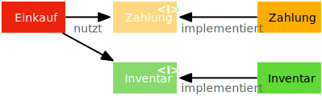
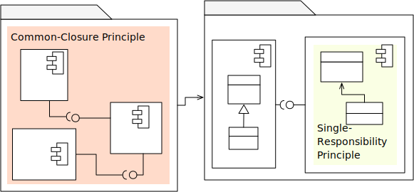
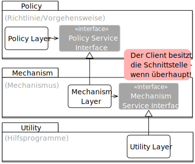
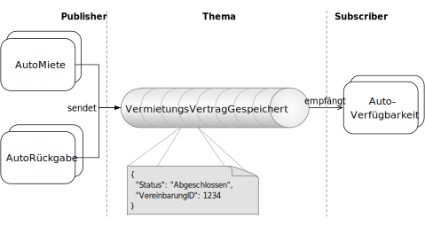
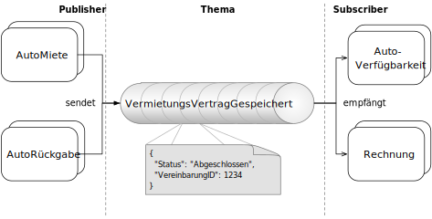
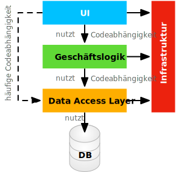

.. meta::
    :version: renaissance
    :author: Michael Eichberg
    :keywords: "Verteilte Anwendungen", "Entwurfsprinzipien", "Architekturstile"
    :description lang=de: Diskussion von Entwurfsprinzipien für moderne verteilte Anwendungen
    :id: lecture-ds-entwurfsprinzipien
    :first-slide: last-viewed

.. include:: ../docutils.defs

Entwurfsprinzipien für Moderne Verteilte Anwendungen
===============================================================================

(:eng:`Design Principles and Design Patterns for Distributed Applications`)

:Dozent: `Prof. Dr. Michael Eichberg <https://delors.github.io/cv/folien.de.rst.html>`__
:Kontakt: michael.eichberg@dhbw.de
:Version: 1.0.1

.. supplemental::

  :Folien: 

      |html-source|

      |pdf-source|

  :Fehler melden:

      https://github.com/Delors/delors.github.io/issues

.. class:: new-section

Entwurfsprinzipien
--------------------

Entwurfsziele
-------------------------------------------------------------------------------------------------

Die Entitäten (:light-gray:`Klassen`, :gray:`Module`, :gray:`Komponenten`, Services…) unseres Entwurfs können:

.. class:: incremental-list list-with-explanations 

- unabhängig von einander von einem “kleinen” Team iterativ entwickelt werden

  Dies setzt die - unabhängige Testbarkeit - voraus.

- unabhängig von einander bereitgestellt (:eng:`to deploy`) werden
- unabhängig von einander gewartet und weiterentwickelt werden

.. hint::
  :class: incremental

  Diese Kriterien erlauben es uns einen „fertigen“ Entwurf zu beurteilen ohne zu sagen, wie das Ziel erreicht werden kann.

.. supplemental::

  Die unabhängige Testbarkeit ersetzt aber nicht die Notwendigkeit von Integrationstests.

.. class:: center-content

Design needs Principles!
----------------------------

.. container:: gray

  Oder welche Entität ist von wem, wann, warum und in welcher Weise abhängig? 
  
  Welche Entität soll mit welcher zusammen definiert werden?

  [Martin2017]_

.. supplemental::

  Es muss Leitlinien geben, die uns helfen einen guten Entwurf zu erstellen, der die genannten Ziele erreicht. Weiterhin muss klar sein wie dieser beurteilt werden kann. d. h. Code darf nicht beliebig „platziert“ werden; Schnittstellen sollten nicht aus dem Bauch heraus entworfen werden.

  Die folgenden Prinzipien wurden (zumindest teilweise) im Kontext der objekt-orientierten Programmierung identifiziert und beschrieben; passen jedoch auf verschiedensten Abstraktionsgeraden, deswegen ist im Folgenden auch von Entitäten die Rede.

Kopplung (:eng:`coupling`)
------------------------------------------------------------------------------------------

.. container:: framed
    
  Kopplung beschreibt die Stärke der Abhängigkeit zwischen verschiedenen Entitäten\ [#]_.

.. container:: incremental

    Eine Entität :math-r:`E1` ist mit Entität :math-r:`E2` verbunden, wenn :math-r:`E1` direkt oder indirekt :math-r:`E2` benötigt.

    :incremental:`Jedoch ist Kopplung nicht gleich Kopplung:`

    .. class:: incremental-list

      - statische und dynamische Kopplung
      - Code-basierte und Daten-basierte
      - ...

.. [#] Eine Entität kann z. B. eine Methode, Klasse, Modul, Package, Komponente oder Service sein.

.. supplemental::

  *Dynamische Kopplung* entsteht zur Laufzeit durch den Austausch von Nachrichten, statische Kopplung zur Compilezeit.

  (*Temporale Kopplung* bezieht sich darauf, dass etwas gleichzeitig ausgeführt wird.)

Hohe statische Kopplung (:eng:`high (static) coupling`)
-------------------------------------------------------------------------------------------

Eine Entität mit hoher Kopplung ist nicht wünschenswert:

- Änderungen in verwendeten Entitäten erfordern (oft) lokale Anpassungen (mind. neues Testen)
- sie sind schwerer zu verstehen
- sie sind schwerer wiederzuverwenden, da die Verwendung auch aller weiteren Entitäten notwendig ist von denen die Entität abhängt

.. supplemental::

  Hohe Kopplung ist aber nicht per-se schlecht! Eine hohe Kopplung an Dinge, die extrem stabil sind, ist im Allgemeinen unkritisch.

Niedrige statische Kopplung (:eng:`low (static) coupling`)
-------------------------------------------------------------------------------------------

- Eine niedrige Kopplung unterstützt den Entwurf von vergleichsweise unabhängigen und deswegen besser wiederverwendbaren Entitäten.
- „generische“ Entitäten mit einer hohen Wiederverwendungswahrscheinlichkeit sollten eine geringe Kopplung aufweisen.

  
.. supplemental::

  Keine Kopplung ist (auch) nicht wünschenswert, da dies zu Entitäten führt, die alle Arbeit durchführen; weiterhin führt dies auch dazu, dass sich ggf. die Arbeit sehr viel schlechter aufteilen lässt und dann eine agile Entwicklung mit einem kleinen Team nicht mehr möglich ist. 

  Relevante Frage: Wer ist/sollte der Eigentümer der Schnittstellen sein? D. h. aus welcher Perspektive sollte die Schnittstelle entworfen werden?

Niedrige vs. hohe dynamische Kopplung
------------------------------------------------------------------------------------------

.. grid:: 

  .. cell:: width-70

    .. image:: images/coupling/message-based-coupling.svg
      :align: left

  .. cell:: width-30
    
    Anforderung-Antwort (Synchron)
    
    (:eng:`Request-response`)

.. grid:: incremental

  .. cell:: width-30

    PubSub (Asynchron)
    
    (:eng:`Publisher-subscriber`)

  .. cell:: width-70

    .. image:: images/coupling/pub-sub-coupling.svg
      :align: right

.. supplemental::

  .. rubric:: Beobachtungen

  Die Skalierbarkeit der ersten Lösung hängt direkt von der Performance von Zahlung und Inventarisierung ab. Für die Verfügbarkeit der Gesamtlösung gilt das Gleiche. 
  
  PubSub ist hier deutlich mächtiger; Nachteile von PubSub liegen im Bereich:

  - Indirektion
  - garantierter Nachrichtenverbleib bzw. garantierte Nachrichtenverarbeitung
  - verteilter Zustand bei Fehlern

  In diesem Fall führt lose Kopplung zu sehr viel höherer Komplexität bei der Fehlerbehandlung.

Zusammenhalt / Kohäsion (:eng:`Cohesion`)
-----------------------------------------------------------------------------------------

.. container:: framed

  Der Zusammenhalt ist ein Maß der Stärke zwischen den Elementen einer Entität.

Ausgewählte Typen von Zusammenhalt:

.. class:: list-with-explanations incremental-list

- :green:`Funktionale Kohäsion`
  
  Die Elemente realisieren eine logische Funktion.
- …
- :orange:`Logische bzw. technische Kohäsion`
  
  Die Elemente stehen aus technischer Sicht in enger Beziehung.
- :red:`Zufällig`
  
  Es gibt keine relevante Beziehung zwischen den Elementen.

.. supplemental::

  Eine wesentliche Frage ist: „Worin besteht der abgeschlossene Kontext, um etwas auf einer entsprechenden Abstraktionsebene kohäsiv erscheinen zu lassen?“

  Technische Kohäsion entsteht zum Beispiel an der Schnittstelle für den Zugriff auf die Datenbank.

Geringer Zusammenhalt (:eng:`Low Cohesion`) 
-----------------------------------------------------------------------

Entitäten mit geringem Zusammenhalt sind nicht wünschenswert! 

Sie sind:

- schwer zu verstehen
- schwer wiederzuverwenden 
- schwer zu warten und oft von Änderungen betroffen

.. supplemental::

  Services mit einer geringen Kohäsion repräsentieren häufig Dinge auf sehr grober, abstrakter Ebene und haben Verantwortlichkeiten übernommen für Dinge, die sie bessere delegieren sollten.

Hoher Zusammenhalt (:eng:`High Cohesion`)
----------------------------------------------------------------------

Alle Funktionalität und alle Daten sollten „natürlich“ zum Konzept gehören, das von der Entität realisiert wird.

.. class:: no-title center-content 

Konflikt: niedrige Kopplung ↔︎ hohe Kohäsion
-----------------------------------------------------

.. class:: columns font-size-200 

- :green:`niedrige Kopplung`
- ↔︎
- :green:`hohe Kohäsion`

.. supplemental::

  Eine sehr niedrige Kopplung führt zwangsweise dazu, das man zu viel Funktionalität in ein Modul/einen Service/eine Klasse/eine Funktion packt. Eine hohe Kohäsion führt zwangsweise dazu, dass man (sehr) viele Module/Services/Klassen/Funktionen benötigt, die häufig viele (starke) Kopplungen haben. Es gilt also die richtige Balance zu finden.

.. class:: no-title transition-fade center-content

Zusammenfassung 
--------------------------------------------- 

.. summary::

  Kopplung und Kohäsion erlauben es uns einen Entwurf auf allen (Abstraktions-)ebenen zu beurteilen.

Von Verantwortung und Zuständigkeit
-------------------------------------

.. question:: 
  :class: width-30 float-right
  
  Wie verteilt man die Zuständigkeiten auf verschiedene Entitäten?

- Der Verteilung von Zuständigkeiten ist die zentrale Tätigkeit während des Entwurfs. 
- Entwurfsmuster, Idiome und Prinzipien helfen dabei die Zuständigkeiten zu verteilen.
- Bei der Verteilung von Zuständigkeiten gibt es eine große Bandbreite:

  .. class:: incremental-list

  - Deswegen gibt es gute und schlechte Entwürfe, schöne und hässliche, effiziente und ineffiziente.
  - Eine schlechte Wahl führt zu fragilen Systemen, welche schwer zu warten, zu verstehen, wiederzuverwenden oder zu erweitern sind.

.. supplemental::

  Bei der Verteilung der Zuständigkeiten gibt es eine große Bandbreite in Hinblick darauf, wie die nicht-funktionalen - und die funktionalen Eigenschaften einer Software realisiert werden.

.. class:: center-content

Leitgedanke bzgl. funktionaler Kohäsion
--------------------------------------------

.. container:: font-size-200

  Code, der sich gemeinsam ändert, bleibt zusammen.

Fasse die Dinge zusammen, die sich aus dem gleichen Grund und zur selben Zeit ändern.
-------------------------------------------------------------------------------------------------

.. supplemental::

  :Single Responsibility Principle (SRP): Ein Modul sollte nur einem einzigen Akteur gegenüber verantwortlich sein. D. h. es sollte nur eine wohldefinierte Gruppe von Akteuren geben, die eine Veränderung veranlassen/verlangen können. Code, von dem verschiedene Akteure abhängen, sollte aufgeteilt werden.
  
  :Common Closure Principle (CCP): Fasse in Komponenten solche Klassen zusammen, die sich aus dem gleichen Grund und zur gleichen Zeit ändern. Z. B. weil sie die gleichen Stakeholder haben oder die gleichen rechtlichen Grundlagen haben.

  Die beiden Prinzipien sind eng miteinander verwandt. Das CCP ist ein Prinzip, das auf allen Abstraktionsgeraden angewendet werden kann. Das SRP ist - zumindest ursprünglich - ein Prinzip, das nur auf der Ebene von Klassen und Modulen angewendet wurde.

Dependency Inversion Principle (DIP)
-----------------------------------------

.. deck::

  .. card::
    
    .. epigraph::
      
      …all well-structured [object-oriented] architectures have clearly defined layers, with each layer providing some coherent set of services through a well-defined and controlled interface…

      -- Grady Booch

  .. card::

    .. epigraph::
      
      High-Level-Module sollten nicht von Low-Level-Modulen abhängen. Beide sollten von Abstraktionen abhängen.

      Abstraktionen sollten nicht von Details abhängen. Details sollten von Abstraktionen abhängen.

      -- Agile Software Development; Robert C. Martin; Prentice Hall, 2003

.. supplemental::

  **Mögliche Interpretation**

  Je höher das Modul in einer Schichtenarchitektur positioniert ist, desto allgemeiner ist die Funktion, die es implementiert.

  Je niedriger das Modul, desto detaillierter ist die Funktion, die es implementiert.

  **Ein Klassendesign, dass das DIP verletzt:**

  .. image:: images/dip-layers/traditionelle-schichtenabhaengigkeit.svg
    :align: center

  **Die Einhaltung des DIP sollte auf allen Ebenen der Architektur sichergestellt werden.**

Dependency Inversion Principle
-------------------------------------

.. supplemental::

  .. rubric:: Begründung

  Gute Softwarekonzepte sind in Module gegliedert.

  High-Level-Module enthalten die wichtigen politischen Entscheidungen und Geschäftsmodelle einer Anwendung. Sie definieren die Identität der Anwendung.

  Low-Level-Module enthalten detaillierte Implementierungen einzelner Mechanismen, die zur Umsetzung der Richtlinie benötigt werden.

Open-closed Principle (OCP)
-----------------------------------

.. epigraph::

  Ein Softwareartefakt sollte offen für Erweiterungen, aber abgeschlossen gegenüber Veränderungen sein.

  -- Bertrand Meyer 1988, Robert C. Martin 1996

.. supplemental::

  D. h. es sollte möglich sein neue Erweiterungen zu realisieren ohne dass man die Software verändern, rekompilieren, neu bereitstellen (:eng:`to deploy`) oder vergleichbares muss. Klassisches Beispiel ist ein Texteditor wie VS Code, welcher durch *Extensions*/*Plug-Ins* erweitert werden kann; d. h. es die Software is erweiterbar ohne das man diese neu kompilieren muss.

Open-closed Principle - Case Study\ [#]_
------------------------------------------

.. question::
  :class: incremental
  
  Ist dieses Design offen für Erweiterungen?

.. supplemental::

  In diesem Fall haben wir eine Architektur, die auf “Services” aufbaut welche lose gekoppelt sind und über Nachrichten kommunizieren. 

.. [#] `Beispiel nach David Llobrega, 2019 <https://dzone.com/articles/the-open-closed-principle-at-an-architectural-leve>`_

.. class:: transition-scale

Open-closed Principle - Case Study
-------------------------------------

.. question::
  :class: incremental

  Ist dieses Design *wirklich* offen für Erweiterungen?

.. supplemental::

  Das Problem ist, dass wir hier die Nachrichten - welche im Prinzip die Schnittstelle modellieren - relativ exakt an den Anforderungen des Services zur Bestimmung der Verfügbarkeit von Autos ausgerichtet haben. 
  
  Wie sähe in diesem Fall z. B. eine Erweiterung um einen Dienst für Kundenprämienberechnung aus?
  
  Über die ``VereinbarungID`` bekommen wir Zugriff auf die Daten des Kunden aber dies fordert dann mehr als einen *Lookup* in einer Datenbank und ggf. auch das Einbinden mehrerer Dienste, was es zu vermeiden gilt, da die Kopplung unnötig ansteigen würde.

.. class:: transition-scale

Open-closed Principle - Case Study
-------------------------------------

.. deck::

  .. card::
  
    .. image:: images/ocp-example/ocp-multiple-subscribers_de.svg
      :align: center

  .. card:: overlay center-content 

    .. question:: 
      :class: width-75 backdrop-blur
    
      Wie stellen wir fest welche Informationen in eine Nachricht gehören, um offen für *relevante* Erweiterungen zu sein?

.. supplemental::

  Eine Antwort darauf liefern ggf. *Bounded-Context* aus dem *Domain-driven Design*
  
  Ein *Bounded Context* ist ein Gültigkeitsbereich eines Domänenmodells, einer `Ubiquitous Language <https://leanpub.com/ddd-referenz/read#ubiquitous-language>`_ und die Basis für die Organisation des Projekts.[...] 
  
    :red:`Eine Modellierung nach den Daten führt nicht zu sinnvollen Bounded Contexts, sondern eher zu komplexen Modellen. Wichtig ist, die Daten als Folge der Funktionalitäten zu modellieren.`

  Domain-driven Design behandelt Beziehungen zwischen *Bounded Contexts* im sogenannten *Strategic Design*.
  
  https://www.heise.de/hintergrund/Domain-driven-Design-und-Bounded-Context-Eigentlich-ganz-einfach-oder-4634258.html?seite=all

Liskov Substitution Principle (LSP) 
-------------------------------------

.. deck::

  .. card::

    .. epigraph::

      Subtypes must be substitutable for their base types.

      -- Barbara Liskov, 1988

  .. card::

    **Moderne Interpretation** 

    Die Implementierungen von Schnittstellen müssen austauschbar sein.

.. supplemental::

  Im Original wird auf die Substituierbarkeit von Subtypen im Kontext der objekt-orientierten Programmierung eingegangen. Das Prinzip lässt sich aber auch auf andere Abstraktionsgeraden übertragen. Insbesondere auch auf die Ebene von Services deren Schnittstellen und Implementierungen.

Interface Segregation Principle & Common Reuse Principle
------------------------------------------------------------

.. deck:: 

  .. card::

    .. image:: images/segregation/no-segregation.svg
      :align: center

    (Ausgangszustand)

  .. card::

    .. image:: images/segregation/no-segregation-2nd-service.svg
      :align: center

    (Geplante Erweiterung)

  .. card::

    .. image:: images/segregation/effective-segregation.svg
      :align: center

    (Teilung der Schnittstelle)

.. attention::
  :class: incremental

  Hänge nicht von Dingen ab, die du nicht benötigst.

.. supplemental::

  Segregation (:ger:`Abtrennung`) bezeichnet hier die Aufspaltung eines bestehenden Interfaces bei dem die Teile abgespalten werden, die logisch zu einer anderen Funktionalität gehören. d. h. die von der Schnittstelle zur Verfügung gestellte Funktionalität ist nicht homogen und wird deswegen in verschiedene Teile aufgeteilt.

Command-Query Separation (CQS)
-------------------------------

.. epigraph::

    Methoden werden strikt aufgeteilt in:

    **Abfragen** (:eng:`Queries`), die keine Veränderung des Objektzustandes erlauben

    **Kommandos** (:eng:`Commands`), die den Zustand verändern, aber keine Werte zurückliefen

    -- Bertrand Meyer, 1988

.. remark:: 
  :class: incremental 

  Auf der Ebene von nachrichten- bzw. ereignisgetriebenen Systemen wird CQS zum CQRS erweitert (Command-Query Responsibility Segregation).

.. supplemental::

  Ein Java Iterator mit seiner „next“ Methode verletzt ganz klar dieses Prinzip!

Traditionelle Interaktion mit Informationssystemen (CRUD) 
-----------------------------------------------------------------------------

.. grid:: 

  .. cell:: width-60

    .. image:: images/cqs_and_cqrs/crud.svg

    Darstellung nach `Martin Fowler <https://martinfowler.com/bliki/CQRS.html>`_.
    
  .. cell:: width-40

    1. Modell liest von DB
    2. Service stellt Information für Präsentationsschicht bereit
    3. Nutzer hat Änderung vorgenommen
    4. Weiterleitung der Änderung
    5. Modell validiert
    6. Modell aktualisiert DB
 
.. supplemental::

  Darstellung einer Anwendung mit traditioneller Architektur.

Command-Query Responsibility Segregation Principle
-----------------------------------------------------------------------------

.. grid:: 

  .. cell:: width-60

    .. image:: images/cqs_and_cqrs/cqrs.svg

    Darstellung nach `Martin Fowler <https://martinfowler.com/bliki/CQRS.html>`_.
    
  .. cell:: width-40

    1. Abfrage-Modell liest von DB
    2. Abfrage-Service stellt Information für Präsentations- schicht bereit
    3. Nutzer hat Änderung vorgenommen
    4. Weiterleitung der Änderung
    5. Kommando-Modell validiert
    6. Kommando-Modell aktualisiert DB

.. supplemental::

  Command-Query-Responsibility-Segregation (CQRS) wendet das CQS-Prinzip an, indem es separate Abfrage- und Befehlsnachrichten zum Abrufen bzw. Ändern von Daten verwendet.

Command-Query Responsibility Segregation Principle (CQRS)
------------------------------------------------------------------------------------------

.. rubric:: Einsatzszenarien 

.. class:: incremental-list

- Die Anzahl an Schreibe- und Leseoperationen ist extrem unterschiedlich.
- Die Datenmodelle bzgl. Abfragen und „Kommandos“ unterscheiden sich deutlich und es kommen ggf. mehrere Datenbanken zum Einsatz.
- Die Validierung der Daten ist komplex.

.. container:: incremental

  .. rubric:: Vorteile/Möglichkeiten

  .. class:: incremental-list list-with-explanations

  -  Die Modelle können von unterschiedlichen Teams entwickelt werden (im Rahmen einzelner Services).
  - Unterschiedliche Skalierung bzgl. Abfragen und Kommandos ist möglich.
  - Passt sehr gut zu ereignisgetriebenen Programmiermodellen/Architekturen.
    
    Erlaubt sehr einfache Unterstützung von *Event Sourcing*.

.. class:: new-section

Moderne Architekturprinzipien für verteilte Anwendungen
--------------------------------------------------------------------------

Gute Anwendungsarchitekturen
-----------------------------

.. container:: foundations

  Die (technischen) Ziele einer guten Anwendungsarchitektur :incremental:`sollten der Minimierung des Aufwands dienen, der notwendig ist, um das System zu entwickeln und zu warten bzw. weiterzuentwickeln.`

Ein einfacher RESTful Web Service mit Spring\ [#]_
------------------------------------------------------------------------------------

.. code:: java
    :number-lines:
    :class: copy-to-clipboard

    import java.util.concurrent.atomic.AtomicLong;
    import org.springframework.web.bind.annotation.*;

    @RestController
    public class GreetingController {

      private static final String template = "Hello, %s!";
      private final AtomicLong counter = new AtomicLong();

      @GetMapping("/greeting")
      public Greeting greeting(
          @RequestParam(value = "name", defaultValue = "World") String name
      ) {
        return new Greeting(counter.incrementAndGet(), String.format(template, name));
      }
    }

.. [#] Beispiel von http://spring.io.

.. class:: center-child-elements

\ 
---

.. container:: foundations faded-to-white

  Die (technischen) Ziele einer guten Anwendungsarchitektur dienen der Minimierung des Aufwands, der notwendig ist, um das System zu entwickeln und zu warten bzw. weiterzuentwickeln.

.. container:: foundations incremental

  Eine gute Anwendungsarchitektur erlaubt es Entscheidungen, die sich *nicht* aus den Geschäftsanforderungen ergeben, zu verzögern bzw. „leicht“ anpassbar zu machen.

.. supplemental::

  Entscheidungen, die nicht am Anfang final getroffen werden sollten, da sie ggf. die Architektur dominieren:
  
  - Frameworks
  - Datenbanken
  - Webserver
  - Kommunikationsprotokolle
  - ...

  Im RESTful-Beispiel hatten wir einen technischen Service for Augen - er implementiert keine wesentliche Geschäftslogik!

Traditionelle n-Schichten Architektur (Wiederholung)
---------------------------------------------------------------------------------

.. supplemental::

  Codeabhängigkeiten ergeben sich zum Beispiel beim Verwenden eines Object-relational Mappers (ORM). 

  Solch eine Architektur war Ende der 90er/Anfang der 2000er Standard und ist für einfache Programme auch heute noch akzeptabel, da diese häufig sehr schnell zu entwickeln sind und viel Erfahrung mit dieser Architektur vorhanden ist. Besser ist es jedoch gleich eine der folgenden Architekturen anzuwenden, um ggf. vorbereitet zu sein, wenn das System wächst.

Hexagonal Architecture (Ports & Adapters) [#]_
-------------------------------------------------------------------------------

.. deck::

  .. card::
  
    .. image:: images/hexagonal-architecture/overview.svg
      :align: center

  .. card:: overlay

    .. image:: images/hexagonal-architecture/control-flow-overlay.svg
      :align: center

  .. card:: overlay 

    .. image:: images/hexagonal-architecture/code-dependency-overlay.svg
      :align: center

.. [#] `Alistair Cockburn, 2005 <https://alistair.cockburn.us/hexagonal-architecture/ und https://www.thoughtworks.com/insights/blog/architecture/demystify-software-architecture-patterns>`__

.. supplemental::

  Ziel der hexagonalen Architektur ist es die Anwendungslogik unabhängig von der UI und den Datenbanken etc. zu machen. Die Anwendungslogik/die Anwendungskomponenten sollen lose gekoppelt sein und einfach mit Ihrer Umgebung verbunden werden können durch die Nutzung von *Ports & Adapters*.

  Für die Implementierung von *Primary Ports* werden oft *Inversion of Control Frameworks* verwendet.
  Die Implementierung von *Secondary Ports* erfordert üblicherweise den Einsatz von *Dependency Inversion*.

  Im Allgemeinen ist es oft notwendig in den Adaptern Entity Klassen hin und zurück „zu Mappen“, um sicherzustellen, dass keine technischen Abhängigkeiten in den Kern einsickern.

  Die hexagonale Architektur wird von einigen als Ausgangsarchitektur für *Microservices* gesehen, da häufig einzelne Services nach diesem Architekturmuster implementiert werden.

  .. epigraph:: 

    Meine Heransgehensweise für die Planung einer komplexen Geschäftsanwendung ist in der Regel eine Kombination aus Domain Driven Design, Microservices und hexagonaler Architektur: Einsatz von Strategic Design zur Planung von Core Domain, Sub Domains und Bounded Contexts. Aufteilung eines Bounded Contexts in einen oder mehrere Microservices. Ein Microservice kann ein oder mehrere Aggregates enthalten, aber auch den kompletten Bounded Context, sofern dieser nicht zu groß ist (und statt des gewünschten Microservices wieder ein Monolith entsteht).

    -- https://www.happycoders.eu/de/software-craftsmanship/hexagonale-architektur/

  
*Onion Architecture* [#]_
---------------------------------------------------------------------------------------

.. deck:: 

  .. card:: 
  
    .. image:: images/onion-architecture/overview.svg
      :align: center

  .. card::  overlay

    .. image:: images/onion-architecture/code-dependencies-overlay.svg
      :align: center

.. supplemental::

  Schlüssellehren der *Onion Architecture* (Zwiebelarchitektur):

  - Die Anwendung ist rund um ein unabhängiges Objektmodel gebaut.
  - Innere Schichten definieren Schnittstellen. 
  - Äußere Schichten implementieren Schnittstellen.
  - Die Richtung der Kopplung ist immer in Richtung zum Zentrum!
  - Der Anwendungskern (*Application Core*) kann immer ohne die Infrastruktur kompiliert und davon unabhängig ausgeführt werden.

.. [#]  `Jeffrey Palermo, 2008 <https://jeffreypalermo.com/2008/07/the-onion-architecture-part-1/>`__

*Clean Architecture* [Martin2017]_
----------------------------------------------------------------

.. deck::

  .. card::
  
    .. image:: images/clean-architecture/entities-ring.svg
      
  .. card:: overlay

    .. image:: images/clean-architecture/use-cases-ring.svg
      
  .. card:: overlay

      .. image:: images/clean-architecture/controllers-ring.svg
      
  .. card:: overlay

      .. image:: images/clean-architecture/web-ring.svg
      
  .. card:: overlay

      .. image:: images/clean-architecture/code-abhaengigkeiten.svg
      
  .. card:: overlay

      .. image:: images/clean-architecture/legende.svg
      
.. supplemental::

  .. rubric:: Entities

  Entitäten (:eng:`Entities`) kapseln unternehmensweite kritische Geschäftsregeln.

  - Objekte mit Methoden
  - Datastrukturen
  - Funktionen
  - ... 

  Entitäten sind „Dinge“, die sich nicht aufgrund externer (technischer) Änderungen ändern sollten. Zum Beispiel aufgrund von geänderten Sicherheitsanforderungen oder der verwendeten Datenbank. 

  .. rubric:: Use Cases

  Anwendungsspezifische Geschäftsregeln orchestrieren den Fluss der Daten von und zu den Entitäten; Änderungen an den Anwendungsfällen (*Use Cases*) sollten auf die Entitäten keinen Einfluss haben.

  .. rubric:: Controllers, Gateways, Presenters

  Die Aufgabe des Rings der Schnittstellen und Adapter ist die Konvertierung der Daten der Anwendungsfällen/Use Cases bzw. Entitäten und dem Format, dass für die externen Funktionalitäten sinnvoll ist.

  In diesem Ring erfolgt zum Beispiel die Implementierung des MVC Patterns für eine GUI, oder das ORM Mapping.

  .. rubric:: DBs, Web, Devices 

  In diesem Ring befinden sich die externen Details, in der Regel gibt es hier keinen oder nur minimalen *Glue Code*.

  .. rubric:: Code Abhängigkeiten

  Wie bei den anderen Architekturen auch, gehen auch hier die Abhängigkeiten immer von außen nach innen. D. h. die Entitäten sind von nichts abhängig, die Anwendungsfälle von den Entitäten, die Schnittstellen von den Anwendungsfällen und die externen Details von den Schnittstellen.

*Clean Architecture* - Prototypische Implementierung
-------------------------------------------------------------------------------------

.. deck::

  .. card:: 

    .. image:: images/clean-architecture/uml-overview.svg
      :align: center

  .. card:: overlay
      
    .. image:: images/clean-architecture/uml-kontrollfluss.svg
      :align: center

.. supplemental::

    Mit einer solchen Implementierung sind auch echte initiale Kosten verbunden - mehrere Interfaces müssen implementiert und gewartet werden. Partielle Lösungen sind denkbar, müssen aber wohl überlegt sein, um ungewünschte Abhängigkeiten zu vermeiden, die häufig zu einer schlechten Wartbarkeit und langfristigen bzw. verzögerten Kosten führen.

Gemeinsamkeiten aktueller Architekturen
----------------------------------------

.. class:: incremental-list

  - Unabhängig von Frameworks
  - Testbar
  - Unabhängig von der Benutzerschnittstelle
  - Unabhängig von Datenbanken
  - Unabhängig von jeglichen externen Agenten/Systemen

.. class:: transition-scale

Literatur
-------------------------------------------------------------------------------------------------

.. [Martin2017] Clean Architecture: A Craftsman's Guide to Software Structure and Design; Robert C. Martin, Addison-Wesley, 2017
