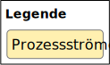

.. meta::
    :version: renaissance
    :lang: de
    :author: Michael Eichberg
    :keywords: "Programmierung", "Java", "IO"
    :description lang=de: Lesen und Schreiben von Dateien in Java - Grundlagen
    :id: lecture-prog-java-ea
    :first-slide: last-viewed
    :master-password: WirklichSchwierig!

.. include:: ../docutils.defs

Java - Dateien lesen und schreiben
===========================================================

----

:Dozent: `Prof. Dr. Michael Eichberg <https://delors.github.io/cv/folien.de.rst.html>`__
:Kontakt: michael.eichberg@dhbw.de, Raum 149B
:Version: 1.0

.. supplemental::

    :Folien:

        |html-source|

        |pdf-source|

    
    :Kontrollfragen:

        .. source:: kontrollfragen.de.rst
            :path: relative
            :prefix: https://delors.github.io/
            :suffix: .html

    :Fehler melden:
        https://github.com/Delors/delors.github.io/issues

.. class:: new-section

Einführung in E/A (:eng:`I/O`) in Java
------------------------------------------------

Architektur von Java I/O
--------------------------------

.. class:: incremental-list

- Verschiedene Quellen/Senken für die Daten
 
  - Tastatureingabe („Standard I/O“)
  - Datei(en) auf dem lokalen Rechner („File I/O“)
  - Datei(en)/Prozess(e) im Netzwerk („Network I/O“)
  - Hauptspeicher („Memory I/O“)
- Um einheitlich Daten auf unterschiedliche „Datenbehälter“ ein-/auszugeben, verwendet Java das Konzept der „Streams“ (Ströme): Eingabe- und Ausgabeströme (E/A, :eng:`I/O`)
- Datenströme als eine Abstraktion von I/O „Geräten“

  .. class:: incremental list-with-explanations

  - Verstecken Details über die Implementierung / Funktionsweise der einzelnen I/O-Geräte vor dem Java Programmierer
  
    (D. h. ob die Eingabe zum Beispiel eine Tastatur, Datei, anderes Programm, Netz, Hauptspeicher, … ist.)
  - Stellen Java-Programmen einheitliche Schnittstellen zum Lesen bzw. Schreiben von Daten zur Verfügung.
  

I/O-Ströme in Java
--------------------------------

.. compound::

    .. rubric:: Lesen von Daten

    Um Daten von einer externen Datenquelle zu lesen, öffnet ein Java-Programm einen Eingabestrom und liest die Daten *seriell* (nacheinander) ein:

.. compound::
    :class: incremental

    .. rubric:: Schreiben von Daten

    Um Daten in eine externe Senke zu schreiben, öffnet ein Java-Programm einen Ausgabestrom und schreibt die Daten *seriell*.

Klassifizierung von Datenströmen
--------------------------------

.. deck:: dd-margin-left-2em

    .. card::

        :Nach Datentyp:

            .. class:: incremental-list

            :Zeichenströme: lesen / schreiben :java:`char` (16-bit Unicode Zeichensatz).

                .. container:: incremental peripheral

                    :java:`java.io.Reader`/:java:`java.io.Writer` stellen die Schnittstelle und eine partielle Implementierung von Zeichenströmen zur Verfügung. 

                    Subklassen von :java:`Reader`/:java:`Writer` fügen neues Verhalten hinzu bzw. ändern dieses.

            :Byteströme: lesen / schreiben :java:`byte`\ s (8-bit).

                Werden zum Lesen bzw. Schreiben von Binärdaten, z.B. Bildern, benutzt.

                .. container:: incremental peripheral

                    :java:`java.io.InputStream`/:java:`java.io.OutputStream`: gemeinsame Schnittstelle und partielle Implementierung für alle Ströme zum Lesen bzw. Schreiben von Bytes.

                    Alle anderen Byteströme sind Unterklassen davon.

    .. card::

        :Nach Struktur der Ströme:

            .. class:: incremental-list

            :Datensenkeströme: Daten werden direkt von „physikalischer“ Datenquelle gelesen bzw. auf „physikalische“ Datensenke geschrieben
            
            
            :Prozessströme: Daten werden von anderen Strömen gelesen bzw. auf andere Ströme geschrieben

                Daten werden nach dem Lesen bzw. vor dem Schreiben gefiltert, gepuffert, bearbeitet, usw.

Hierarchie der Zeichenströme für I/O
------------------------------------------

.. deck::

    .. card::

        .. image:: images/readers_and_writers/readers.svg

    .. card::

        .. image:: images/readers_and_writers/writers.svg

    .. card::

        .. image:: images/input_and_output/input.svg

    .. card::

        .. image:: images/input_and_output/output.svg

Allgemeines Vorgehen beim Lesen/Schreiben von Dateien
------------------------------------------------------------

.. class:: incremental-list 

:Lesen:

    .. class:: incremental-list list-with-explanations

    1. Öffne einen Strom
       
       Ströme werden beim Erzeugen automatisch geöffnet
    2. Lese Daten, solange nötig und es noch Daten gibt 
    3. Schließe den Strom

       Beim Beenden des Lesens ist der Strom durch :java:`close()` zu schließen.

:Schreiben: 

    .. class:: incremental-list list-with-explanations  

    1. Öffne einen Strom
    2. Solange es noch Daten gibt, schreibe Daten
    3. Schließe den Strom 
    
       Beim Beenden des Schreibens ist der Strom durch :java:`close()` zu schließen.

.. remember::
    :class: incremental

    Lesen/Schreiben von/auf Strömen haben unabhängig von Datentyp und Quelle bzw. Senke die gleiche Form.

Schreiben und Lesen von Daten 
------------------------------------------------

.. deck::

    .. card::

        .. compound::

            .. code:: java
                :number-lines:
                :class: copy-to-clipboard

                public interface InputStream {
                    public int read()
                    public int read(byte[] bbuf)
                    public int read(byte[] bbuf, int offset, int len)
                }

        .. compound::
            :class: incremental

            .. code:: java
                :number-lines:
                :class: copy-to-clipboard

                public interface Reader {
                    public int read()
                    public int read(char[] cbuf)
                    public int read(char[] cbuf, int offset, int len)
                }

        .. attention::
            :class: incremental

            Es gilt immer zu überprüfen ob auch die erwartete Anzahl an Bytes/Zeichen gelesen wurde.

    .. card::

        .. compound::

            .. code:: java
                :number-lines:
                :class: copy-to-clipboard

                public interface OutputStream {
                    public int write(int b)
                    public int write(byte[] bbuf)
                    public int write(byte[] bbuf, int offset, int len)
                }

        .. compound::
            :class: incremental

            .. code:: java
                :number-lines:
                :class: copy-to-clipboard

                public interface Writer {
                    public int write(int c)
                    public int write(char[] cbuf)
                    public int write(char[] cbuf, int offset, int len)
                }

        .. attention::
            :class: incremental

            Es gilt immer zu überprüfen ob auch die erwartete Anzahl an Bytes/Zeichen geschrieben wurde.

Dateiströme in Java
--------------------------------

.. deck::

    .. card::

        .. class:: incremental-list list-with-sublists

        - Dateiströme sind Ein-/Ausgabe-Ströme, deren Quellen/Senken Dateien im Dateisystem sind:

        - :java:`FileReader` / :java:`FileWriter` für Lesen / Schreiben von Zeichen aus/in Dateien
        - :java:`FileInputStream` / :java:`FileOutputStream` für Lesen / Schreiben von Bytes von/in Dateien
        - Ein Dateistrom kann erzeugt werden, indem man die Quelle- bzw. Senke-Datei durch eines der folgenden Objekte als Parameter des Strom-Konstruktors übergibt:

          - Dateiname  (:java:`String`)
          - Datei-Objekt (:java:`java.io.File`)
          - Dateibeschreibung (:java:`java.io.FileDescriptor`)

        - Die Klasse :java:`java.nio.file.Files` bietet weitere Methoden (z. B. :java:`newInputStream(...)`, :java:`newBufferedWriter(...)`) zum Lesen und Schreiben von Dateien als Streams an.

    .. card::

        .. rubric:: Einfaches (ineffizientes) Beispiel

        .. code:: java
            :number-lines:
            :class: copy-to-clipboard

            void print(String fileName) throws IOException {
                try (FileReader in = new FileReader(fileName)) {
                    int b;
                    while ((b = in.read()) != -1) System.out.print(b); 
                }
            }

Prozessströme 
--------------------------------

.. deck::

    .. card::

        .. class:: list-with-explanations

        - Ein Prozess-Strom enthält einen anderen (Daten- oder Prozess-)Strom

          Dieser dient als Quelle bzw. Senke.

        .. class:: incremental-list list-with-sublists  

        - Prozess-Ströme ändern Daten oder bieten Funktionalität:

          .. class:: incremental-list  

          - Zwischenspeichern (Puffern) von Daten 
          - Zählen der gelesenen/geschriebenen Zeilen
          - Konvertierung zwischen Byte und Zeichen
          - Kompression, …

    .. card::

        .. rubric:: Pufferströme
        
        .. class:: incremental-list list-with-sublists

        - Ein Pufferstrom (z. B. :java:`BufferedInputStream` oder :java:`BufferedOutputStream`) kapselt einen anderen Datenstrom und einen internen Puffer
        - Beim ersten Lesen wird der Puffer vollständig gefüllt

          - Weitere Lese-Operationen liefern Bytes vom Puffer zurück, ohne vom unterliegenden Strom tatsächlich zu lesen.
          - Bei leerem Puffer wird erneut vom unterliegenden Strom gelesen
        - Beim Schreiben werden die Daten zuerst in dem internen Puffer gespeichert, bevor sie in den unterliegenden Strom geschrieben werden.

          - Nur wenn der Puffer voll ist, wird auf den unterliegenden Strom geschrieben
          - Sowie bei explizitem Aufruf der Methode :java:`flush()` oder :java:`close()`.

        .. important::
            :class: incremental

            Die richtige Puffergröße kann die Geschwindigkeit beim Lesen und Schreiben von Dateien **erheblich** beeinflussen (5-10x). Die richtige Puffergröße ist von vielen Faktoren abhängig liegt aber vermutlich zwischen 8KB und 64KB.

    .. card::

        .. rubric:: Einfaches Beispiel

        .. code:: java
            :number-lines:
            :class: copy-to-clipboard

            try(
                FileOutputStream fos = new FileOutputStream("Test.tmp");
                BufferedOutputStream bos = new BufferedOutputStream(fos);
                DataOutputStream out = new DataOutputStream(bos)
            ) {
                out.writeInt(9);
                out.writeDouble(Math.PI);
                out.writeBoolean(true);
            }
  
        .. code:: console
            :number-lines:
            :class: incremental

            $ hexdump Test.tmp
            0000000 0000 0900 0940 fb21 4454 182d 0001

Architektur der I/O API
--------------------------------

.. deck::

    .. card::

        Ströme können ineinander verschachtelt werden. 

        :peripheral:`Abstraktionsebenen, bei denen unterliegende „primitive“ Ströme von umschließenden („höheren“, komfortableren) Strömen benutzt werden („Prozessströme“).`

        .. code:: java
            :number-lines:
            :class: copy-to-clipboard

            // erzeugt gepufferten, komprimierenden Dateiausgabestrom 
            OutputStream out = new FileOutputStream(<filename>);
            var bout = new BufferedOutputStream(out);
            var zout = new ZipOutputStream(bout); 
            // … mehr Eigenschaften koennen dynamisch hinzugefuegt werden 
            // Die Stromeigenschaften sind unsichtbar fuer Klienten

    .. card::

        Die Technik, mit der erreicht wird, dass Ströme beliebig zur Laufzeit kombiniert werden können, ist nicht nur im Kontext von Strömen von Interesse. Es handelt sich um eine generelle Technik, um Objekte dynamisch mit Features zu erweiterten.

        .. container:: incremental

            In der Softwaretechnik werden solche Techniken in der Form so genannter *Design Patterns* (:ger:`Entwurfsmuster`) dokumentiert; d. h. wiederverwendbare, dokumentierte Designideen.

        .. container:: incremental
            
            Die oben genannte Technik bei Streams ist als „Decorator Pattern“ bekannt.

.. class:: exercises

Übung
---------

.. exercise:: Datei lesen und ausgeben

    Schreiben Sie ein Programm, dass eine Textdatei liest und die Zeilen in der Konsole ausgibt. Schreiben Sie vor jede Zeile die Zeilennummer. 

    .. example::

        Für folgende Datei (Autor: ChatGPT):

        :: 

            In Java springt der Code so leicht,
            Klammern tanzen, Ziel erreicht,
            Fehler? Nur ein Abenteuer vielleicht! 

        sollte folgende Ausgabe erzeugt werden:

        :: 

            1: In Java springt der Code so leicht,
            2: Klammern tanzen, Ziel erreicht,
            3: Fehler? Nur ein Abenteuer vielleicht!

    .. solution::
        :pwd: EinmalLesenUndAusgeben

        .. code:: java
            :number-lines:
            :class: copy-to-clipboard

            try(var fr = new FileReader("docutils.conf");
                var lnr = new LineNumberReader(fr)
            ) {
                String line;
                while ((line = lnr.readLine()) != null) {
                    System.out.println(lnr.getLineNumber() + ": " + line);
                }
            }

.. class:: new-section

Java :java:`Stream`\ s und I/O
------------------------------------------------

:java:`java.nio.file.Files`
----------------------------

Neben den traditionellen I/O-Klassen (seit Java 1.x) gibt es auch die Möglichkeit Dateien als Streams zu lesen und zu schreiben (:java:`java.nio.file.Files`).

.. code:: java
    :number-lines:

    package java.nio.file;

    public class Files {
        /** Read all lines from a file as a Stream. */
        static Stream<String> lines(Path path)

        /** Read all lines from a file as a Stream. */
        static Stream<String> lines(Path path, Charset cs)

        // ...
    }

.. attention::

    Diese Streams müssen explizit geschlossen werden (:java:`close()`), da sie Ressourcen verbrauchen.

.. class:: exercises

Übung
---------

.. exercise:: Streamverarbeitung von Dateien

    Schreiben Sie ein Programm, das eine Textdatei liest und die Zeilen in der Konsole ausgibt. Jeder Zeile soll weiterhin die Zeilennummer vorangestellt werden. Verwenden Sie dazu die Klasse `Files` und die Methode `lines`.

    .. example::

        Für folgende Datei (Autor: ChatGPT):

        :: 

            In Java springt der Code so leicht,
            Klammern tanzen, Ziel erreicht,
            Fehler? Nur ein Abenteuer vielleicht! 

        sollte folgende Ausgabe erzeugt werden:

        :: 

            1: In Java springt der Code so leicht,
            2: Klammern tanzen, Ziel erreicht,
            3: Fehler? Nur ein Abenteuer vielleicht!

    .. solution::
        :pwd: JavaIO-Streams

        .. rubric:: Lösung bei der Verwendung der JShell

        .. code:: java
            :number-lines:
            :class: copy-to-clipboard

            var c = 0; 
            Files.lines(path).map(l -> (++c) + ": " + l).forEach(System.out::println);

        .. rubric:: Allgemeine Lösung

        .. code:: java
            :number-lines:
            :class: copy-to-clipboard

            void printLinesWithLineNumber(Path path) throws IOException {
                final int[] c = {0}; 
                try (var s = Files.lines(path)) {
                    s.map(l -> (++c[0]) + ": " + l).forEach(System.out::println);
                }
            }

            printLinesWithLineNumber(new File("docutils.conf").toPath());

.. class:: exercises

Übung
---------

.. exercise:: Durchsuchen von Dateien

    Schreiben Sie ein Programm (Sie können die JShell benutzen), dass alle Textdateien (z. B. \*.rxt, \*.md oder \*.java) eines Verzeichnisses in Hinblick auf das Vorkommen eines bestimmten Wortes (z. B. Java) durchsucht. Geben Sie den Namen der Datei und eine Zeilennummer aus, in der das Wort vorkommt. Parallelisieren (:java:`parallel()`) Sie die Suche wenn möglich.

    Relevante API: :java:`Files.walk`, :java:`File.toPath()`, :java:`Files.isRegularFile`, :java:`Files.lines`, :java:`Stream.filter`, :java:`Stream.map`, :java:`Stream.findAny`, :java:`Optional.isPresent`, :java:`Optional.get`, :java:`Optional.empty`

    .. hint::

        Sie müssen ggf. :java:`IOException`\ s explizit behandeln und in solchen Fällen zum Beispiel :java:`Optional.empty()` zurückgeben.

    .. solution::
        :pwd: JavaIO--DasWars

        .. rubric:: Lösung bei der Verwendung der JShell (Java 24)

        .. code::
            :number-lines:
            :class: copy-to-clipboard

            Files
                .walk(new File(".").toPath())
                .parallel()
                .filter(p -> Files.isRegularFile(p) && p.toString().endsWith(".rst"))
                .map(p -> {
                        try {
                            int[] c = {0};
                            return Files.lines(p)// DON'T USE .parallel() HERE!
                                    .map(l -> (++c[0]) + ": " + l)
                                    .filter(x -> x.contains("Java"))
                                    .map(x -> p + ":" + x)
                                    .findAny();
                        }
                        catch(Exception e){ 
                            System.out.println("Ignoring: "+p);
                            return Optional.empty();
                        }
                    })
                .filter(x -> x.isPresent())
                .map(x -> x.get())
                .sequential() // required to avoid a convoluted output
                .forEach(System.out::println);