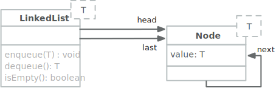

.. meta::
    :version: renaissance
    :lang: de
    :author: Michael Eichberg
    :keywords: "Programmierung", "Java", "Funktional Programmierung"
    :description lang=de: Java Funktionale Programmierung
    :id: lecture-prog-java-functional-programming
    :first-slide: last-viewed
    :master-password: WirklichSchwierig!
    :theme: colored

.. |html-source| source::
    :prefix: https://delors.github.io/
    :suffix: .html
.. |pdf-source| source::
    :prefix: https://delors.github.io/
    :suffix: .html.pdf
.. |at| unicode:: 0x40

.. role:: incremental
.. role:: eng
.. role:: ger
.. role:: red
.. role:: green
.. role:: obsolete
.. role:: peripheral
.. role:: monospaced
.. role:: java(code)
   :language: java
.. role:: console(code)
   :language: console

Java - Funktionale Programmierung
===========================================================

----

:Dozent: `Prof. Dr. Michael Eichberg <https://delors.github.io/cv/folien.de.rst.html>`__
:Kontakt: michael.eichberg@dhbw.de, Raum 149B
:Version: 1.0

.. class:: block-footer

    Teile der Folien basieren auf: `Th. Letschert - Funktionale Programmierung in Java. <https://homepages.thm.de/~hg51/Veranstaltungen/A_D/Folien/java-8-kurzeinfuehrung.pdf>`__

.. supplemental::

    :Folien:

        |html-source|

        |pdf-source|

    ..
        :Kontrollfragen:

            .. source:: kontrollfragen.de.rst
                :path: relative
                :prefix: https://delors.github.io/
                :suffix: .html

        :Klausurvorbereitung:

            .. source:: klausurvorbereitung.de.rst
                :path: relative
                :prefix: https://delors.github.io/
                :suffix: .html

    :Fehler melden:
        https://github.com/Delors/delors.github.io/issues

.. class:: new-section

Einführung in die Funktionale Programmierung
------------------------------------------------

Grundlagen funktionaler Programmierung
-----------------------------------------------------------------------

.. deck::

    .. card::

        .. class:: incremental-list

        - Programmierparadigma, bei dem Funktionen im Mittelpunkt stehen
        - Vermeidet veränderliche Zustände (:eng:`Mutable State`)
        - Fördert deklarativen Code statt imperativem Code

    .. card::

        .. question::
            :class: incremental

            Wie unterscheidet sich dieses Paradigma von der objektorientierten Programmierung?

        .. answer::
            :class: incremental margin-top-1em

            - Methoden ohne Seiteneffekte
            - Daten sind standardmäßig unveränderlich
            - Fokus auf Funktionsanwendungen und -komposition

    .. card::

        .. rubric:: Wichtige Konzepte

        .. class:: incremental-list

        - Funktionen Höherer Ordnung
        - Lambda-Ausdrücke
        - Funktionskomposition
        - Currying und Partielle Anwendung

.. class:: new-section

Funktionale Programmierung in Java
------------------------------------------------

Lambdas
------------------------------------------------

.. deck::

    .. card::

        :Lambda (auch Closure):

            Ein Ausdruck, dessen Wert eine Funktion ist.

            Solche Ausdrücke sind sehr nützlich, mussten in Java bisher aber mit anonymen inneren Klassen emuliert werden.

    .. card::

        .. rubric:: Ein einfache Personenklasse

        .. code:: java
            :number-lines:
            :class: copy-to-clipboard

            class Person {
                private String name;
                private int age;

                public Person(String name, int age) {
                    this.name = name;
                    this.age = age;
                }
                public String getName() { return name; }
                public int getAge() { return age; }
                public String toString() { return "Person[" + name + ", " + age + "]"; }
            }

    .. card::

        .. rubric:: Sortieren von Personen nach Alter

        Angenommen wir haben eine Klasse Person und eine Liste von Personen, die nach Alter sortiert werden soll. Dazu muss eine Vergleichsfunktion übergeben werden. In Java <8 kommt dazu nur ein Objekt in Frage.

        .. code:: java
            :number-lines:
            :class: copy-to-clipboard

            List<Person> persons = Arrays.asList(
                new Person("Hugo", 55),
                new Person("Amalie", 15),
                new Person("Anelise", 32) );

        .. deck::

            .. card::

                .. rubric:: Traditionelle Lösung

                .. code:: java
                    :number-lines:
                    :class: copy-to-clipboard

                    Collections.sort(persons, new Comparator<Person>() {
                        public int compare(Person p1, Person p2) {
                            return p1.getAge() - p2.getAge();
                        }
                    });

            .. card::

                .. rubric:: Lösung ab Java 8

                .. code:: java
                    :number-lines:
                    :class: copy-to-clipboard

                    Collections.sort(
                        persons,
                        (p1, p2) -> { return p1.getAge() - p2.getAge(); }
                    );

            .. card::

                .. rubric:: Lösung ab Java 8 (kürzer)

                .. code:: java
                    :number-lines:
                    :class: copy-to-clipboard

                    Collections.sort(persons, (p1, p2) -> p1.getAge() - p2.getAge());

    .. card::

        .. attention::

            Bis Java 7 ist :java:`java.lang.Object` der Basistyp aller Referenztypen.
            Der Typ eines Lambdas ist jedoch der Typ eines funktionalen Interfaces, das nur eine Methode hat und dieser Typ muss explizit angegeben werden.

        .. deck::

            .. card::

                **Instanzen von inneren Klassen können immer Object zugewiesen werden:**

                .. code:: java
                    :number-lines:
                    :class: copy-to-clipboard

                    Object actionListener = new ActionListener() {
                        @Override
                        public void actionPerformed(ActionEvent e) {
                            System.out.println(text);
                        }
                    };

            .. card::

                **Illegale Zuweisung:**

                .. code:: java
                    :number-lines:
                    :class: copy-to-clipboard

                    Object actionListener = (e) -> System.out.println(text);

                    // Error: The target type of this expression must be a functional interface

            .. card::

                **Zuweisung an ein funktionales Interface:**

                .. code:: java
                    :number-lines:
                    :class: copy-to-clipboard

                    ActionListener actionListener = (e) -> System.out.println(text);

    .. card::

        .. rubric:: Funktionale Interfaces

        :Functional Interface / SAM-Interface (Single Abstract Method Interface):
            Ein Functional Interface ist ein Interface das genau eine Methode enthält (die natürlich abstrakt ist) optional kann die Annotation :java:`@FunctionalInterface` hinzugefügt werden.

        .. example::
            :class: incremental

            .. code:: java
                :number-lines:
                :class: copy-to-clipboard

                @FunctionalInterface
                interface MyActionListener extends java.awt.event.ActionListener {
                    /*final static*/ int MAGIC_NUMBER = 42;
                }

                MyActionListener actionListener = 
                        (e) -> System.out.println(text + MyActionListener.MAGIC_NUMBER);

    .. card::

        .. rubric:: Vordefinierte Funktionsinterfaces

        :java:`java.util.function` enthält viele vordefinierte Funktionsinterfaces, die in der funktionalen Programmierung häufig verwendet werden.

        *Beispiele sind:*

        .. class:: incremental-list

        - :java:`Function<T,R>`: Eine Funktion, die ein Argument vom Typ :java:`T` entgegennimmt und ein Ergebnis vom Typ :java:`R` zurückgibt.
        - :java:`Predicate<T>`: Eine Funktion, die ein Argument vom Typ :java:`T` entgegennimmt und ein Ergebnis vom Typ :java:`boolean` zurückgibt.
        - :java:`Consumer<T>`: Eine Funktion, die ein Argument vom Typ :java:`T` entgegennimmt und kein Ergebnis zurückgibt.
        - :java:`Supplier<T>`: Eine Funktion, die kein Argument entgegennimmt und ein Ergebnis vom Typ :java:`T` zurückgibt.

    .. card::

        .. example::

            :java:`Predicate<T>`

            .. code:: java
                :number-lines:
                :class: copy-to-clipboard

                static <T> List<T> filterList(List<T> l, Predicate<T> pred) {
                    List<T> res = new LinkedList<>();
                    for (T x : l) {
                        if (pred.test(x)) { res.add(x); }
                    }
                    return res;
                }

                List<Integer> l = Arrays.asList(1, 2, 3, 4, 5, 6, 7, 8, 9);
                System.out.println(filterList(l, x -> x % 2 == 0));

            .. container:: incremental

                *Ausgabe:* :console:`[2, 4, 6, 8]`

    .. card::

        .. example::

            :java:`Consumer<T>`

            .. code:: java
                :number-lines:
                :class: copy-to-clipboard

                class WorkerOnList<T> implements Consumer<List<T>> {
                    private Consumer<T> action;
                    public WorkerOnList(Consumer<T> action) { this.action = action; }

                    @Override public void accept(List<T> l) {
                        for (T x : l) action.accept(x);
                }   }

                WorkerOnList<Integer> worker = 
                        new WorkerOnList<>( (i) -> System.out.println(i*10) );
                worker.accept(Arrays.asList(1,2,3,4));

            .. container:: incremental-list 
            
                *Ausgabe:* :console:`10 20 30 40`

Lambdas - Method References
------------------------------------------------

.. deck::

    .. card:: Referenzen auf Methoden

        Als Implementierung eines funktionalen Interfaces (als „Lambda“) können auch Methoden verwendet werden.

    .. card::

        .. deck::

            .. card::

                .. example::

                    .. rubric:: Referenz auf statische Methode

                    .. code:: java
                        :number-lines:
                        :class: copy-to-clipboard

                        class ListMethods {
                            static <T> List<T> filterList(List<T> l, Predicate<T> pred) {
                                List<T> res = new LinkedList<>();
                                for (T x : l) if (pred.test(x)) { res.add(x); }
                                return res;
                            }
                            static boolean isEven(int x) { return x % 2 == 0; }
                        }

                        List<Integer> l = Arrays.asList(1, 2, 3, 4, 5, 6, 7, 8, 9);
                        System.out.println(filterList(l, ListMethods::isEven));

                    .. container:: incremental

                        *Ausgabe:* :console:`[2, 4, 6, 8]`

            .. card::

                .. example::

                    .. rubric:: Referenz auf Instanzmethode

                    .. code:: java
                        :number-lines:
                        :class: copy-to-clipboard

                        class Tester {
                            private int magicNumber;
                            public Tester(int magicNumber) { this.magicNumber = magicNumber; }
                            boolean isMagic(int x) { return x == magicNumber; }
                        }
                        class ListMethods {
                            static <T> List<T> filterList(List<T> l, Predicate<T> pred) {
                                List<T> res = new LinkedList<>();
                                for (T x : l) if (pred.test(x)) res.add(x);
                                return res;
                        }   }

                        List<Integer> l = Arrays.asList(1, 2, 3, 4, 5, 6, 7, 8, 9);
                        System.out.println(filterList(l, new Tester(5)::isMagic));

            .. card::

                .. example::

                    .. rubric:: Referenz auf Constructor

                    .. code:: java
                        :number-lines:
                        :class: copy-to-clipboard

                        class Tester {
                            private int magicNumber;
                            public Tester(int magicNumber) { this.magicNumber = magicNumber; }
                            boolean isMagic(int x) { return x == magicNumber; }
                        }

                        Function<Integer,Tester> create = Tester::new;
                        create.apply(5).isMagic(5);

                    .. container:: incremental

                        *Ausgabe:* :console:`true`

Erweiterungen der Collection API
------------------------------------------------

.. deck::

    .. card::

        .. rubric:: Neue Methoden in der Collection API

        - :java:`forEach(Consumer<? super T> action)`
        - :java:`removeIf(Predicate<? super T> filter)`
        - :java:`replaceAll(UnaryOperator<T> operator)`
        - :java:`sort(Comparator<? super T> c)`

    .. card::

        .. example::

            .. code:: java
                :number-lines:
                :class: copy-to-clipboard

                List<Integer> l = Arrays.asList(1, 2, 3, 4, 5, 6, 7, 8, 9);
                l.replaceAll(x -> x * 10);
                l.forEach(System.out::println);

            .. container:: incremental
            
                *Ausgabe:* :console:`10 20 30 40 50 60 70 80 90`

.. class:: exercises

Übung
--------

.. exercise:: Erste Implementierung von Funktionen höherer Ordnung

    Schreiben Sie eine Klasse :java:`Tuple2<T>`; d. h. eine Variante von :java:`Pair` bei der beide Werte vom gleichen Typ :java:`T` sein müssen. Die Klasse soll Methoden haben, um die beiden Werte zu setzen und zu lesen und weiterhin um folgende Methoden ergänzt werden:

    - :java:`void forEach(Consumer<...> action)`: Führt die Aktion für jedes Element in der :java:`Queue` aus.
    - :java:`void replaceAll(UnaryOperator<...> operator)`: Ersetzt alle Elemente in der :java:`Queue` durch das Ergebnis der Anwendung des Operators auf das Element.

    Schreiben Sie Tests für die neuen Methoden; verwenden Sie dafür Closures bzw. Lambda-Funktionen. Stellen Sie 100% *Statementcoverage* sicher.
    
    .. supplemental::

        Die Java Dokumentation finden Sie hier:

        - Übersicht: https://docs.oracle.com/en/java/javase/24/docs/api/help-doc.html
        - API Dokumentation: https://docs.oracle.com/en/java/javase/24/docs/api/allclasses-index.html

          (Hier der Link auf die Dokumentation der Klasse :java:`UnaryOperator`: https://docs.oracle.com/en/java/javase/24/docs/api/java.base/java/util/function/UnaryOperator.html)

    .. hint:: 

        - Sorgen Sie ggf. vorher dafür, dass Sie eine angemessene Projektstruktur haben.
        - Passen Sie ggf. die ``pom.xml`` von ihren anderen Projekten an.

    .. solution::
        :pwd: Pair%Funktional

        .. rubric:: Tuple2.java

        .. include:: code/src/main/java/ds/generic/Tuple2.java
            :code: java
            :class: copy-to-clipboard
            :number-lines:

        .. rubric:: JUnit Tests

        .. include:: code/src/test/java/ds/generic/Tuple2Test.java
            :code: java
            :class: copy-to-clipboard
            :number-lines:

        .. rubric:: Maven Build File

        .. include:: code/pom.xml
            :code: xml
            :class: copy-to-clipboard
            :number-lines:

Warteschlangen
------------------------------------------------

Eine Warteschlange ist eine einfache Datenstruktur bei der die Elemente in der Reihenfolge entfernt werden in der diese hinzugefügt wurden (:eng:`First-in-First-out (FiFo)`).

Zentrale Methoden einer Warteschlange :java:`Queue<T>` sind:

- :java:`void enqueue(T item)` (auch :java:`boolean offer(T item)` bzw. :java:`void add(T item)`): Fügt ein Element hinzu.
- :java:`void dequeue(T item)` oder :java:`T poll()`: Entfernt das älteste Element und gibt es zurück.
- :java:`boolean isEmpty()`: Gibt an ob die Warteschlange leer ist.

Verkettete Listen
------------------------------------------------

.. remark::

    Bisher haben wir Arrays verwendet, um Listen zu speichern. Arrays haben jedoch den Nachteil, dass sie eine feste Größe haben und nicht effizient vergrößert werden können. 

Eine verkettete Liste ist eine alternative Implementierungstechnik, die flexibler ist als ein Array und dynamisch wachsen kann. Jedes Element in einer verketteten Liste enthält eine Referenz auf das nächste Element in der Liste.

.. class:: exercises

Übung
--------

.. exercise:: Implementierung einer Warteschlange mittels verketteter Liste

    Implementieren Sie eine Warteschlange (:java:`Queue<T>`) basierend auf einer verketteten Liste. Ihre Klasse :java:`LinkedQueue<T>` soll das folgende Interface :java:`Queue<T>` implementieren.

    .. code:: java
        :number-lines:
        :class: copy-to-clipboard
        
        public interface Queue<T> {
            void enqueue(T item);
            T dequeue();
            boolean isEmpty();
            int size();

            void replaceAll(UnaryOperator<T> operator);
            void forEach(Consumer<T> operator);
            <X> Queue<X> map(Function<T, X> mapper);
            static <T> Queue<T> empty() { TODO }
        }
        
    .. supplemental::

        **Erklärungen**

        :`map`:java:: Erzeugt eine neue :java:`Queue<X>` bei der die Elemente der neuen Queue 
                das Ergebnis der Anwendung der Funktion :java:`apply` des Objekts :java:`mappers` auf die Element der :java:`Queue` sind. 
        :`empty`:java:: Erzeugt eine leere Queue. 

    Schreiben Sie Testfälle, um die Implementierung zu überprüfen. Zielen Sie auf mind. 100% *Statementcoverage* ab.

    
    .. solution::
        :pwd: FuncF

        .. rubric:: Queue.java

        .. include:: code/src/main/java/ds/generic/Queue.java
            :code: java
            :class: copy-to-clipboard
            :number-lines:

        .. rubric:: QueueTest.java

        .. include:: code/src/test/java/ds/generic/QueueTest.java
            :code: java
            :class: copy-to-clipboard
            :number-lines:

        .. rubric:: Pom.xml

        .. include:: code/pom.xml
            :code: xml
            :class: copy-to-clipboard
            :number-lines:

.. class:: summary

Zusammenfassung
------------------------------------------------

.. rubric:: Funktionale Programmierung  

.. class:: incremental-list

- Lambdas sind Ausdrücke, die (anonyme) Funktionen repräsentieren.
- Es sind sowohl Referenzen auf statische Methoden als auch Instanzmethoden und sogar Konstruktoren möglich.
- Currying wird nicht direkt unterstützt, aber durch die Verwendung von Funktionskomposition und partieller Anwendung kann es simuliert werden.

.. compound::
    :class: incremental

    .. rubric:: Warteschlangen

    .. class:: incremental-list

    - Queues realisieren das Konzept einer Warteschlange bei der die Elemente, die zuerst hinzugefügt wurden, auch zuerst wieder entfernt werden (FiFo).
    - Eine Implementierungsstrategie für Queues ist die Verwendung einer verketteten Liste.

.. class:: new-section transition-fade

Java Streams
------------------------------------------------

Streams - Einführung
------------------------------------------------

Streams sind :incremental:`umgeformte Sammlungen`\ :incremental:`, die durch die Umformung für funktional-orientiere Massen-Operationen geeignet sind.`

.. example::
    :class: incremental

    .. code:: java
        :number-lines:
        :class: copy-to-clipboard

        import java.util.Arrays;
        import java.util.List;
        import java.util.stream.Collectors;

        List<Integer> l = Arrays.asList(1, 2, 3, 4, 5, 6, 7, 8, 9);
        List<Integer> ll = l
            .stream() // list -> stream
            .filter(x -> x % 2 == 0) // filter list with predicate
            .map(x -> 10 * x) // map each element to a new one
            .collect(Collectors.toList()); // back to a list
        ll.forEach(x -> System.out.println(x));

    .. container:: incremental
    
        *Ausgabe:* :console:`10 20 30 40 50 60 70 80 90`

Streams mit primitiven Daten und Objekten
------------------------------------------------

- :java:`Stream<T>` ist der Typ der Streams mit Objekten vom Typ :java:`T`
- Streams mit primitiven Daten:

  - :java:`IntStream`
  - :java:`LongStream`
  - :java:`DoubleStream`

  Dies Streams mit primitiven Daten arbeiten in vielen Fällen effizienter jedoch sind manche Operationen nur auf :java:`Object`\ -Streams erlaubt. „Primitive“ Streams können mit der Methode :java:`boxed` in :java:`Object`\ -Streams umgewandelt werden.

.. example::
    :class: incremental

    .. code:: java
        :number-lines:
        :class: copy-to-clipboard

        IntStream isPrim = IntStream.range(1, 10);
        Stream<Integer> isObj = isPrim.boxed();

Erzeugung von Streams
------------------------------------------------

.. deck::

    .. card::

        .. rubric:: Statische Methoden in :java:`Arrays`

        - Die Klasse :java:`java.util.Arrays` hat mehrere überladene statische stream-Methoden, mit denen Arrays in Ströme umgewandelt werden können.
        - Die Streams können Objekte oder primitive Daten enthalten.

        .. example::
            :class: incremental

            .. code:: java
                :number-lines:
                :class: copy-to-clipboard

                // Stream of primitive data:
                IntStream isP = Arrays.stream(new int[] { 1, 2, 3, 4, 5, 6, 7, 8, 9, 0 });
                // Stream of objects:
                Stream<Integer> isO = Arrays.stream(
                    new Integer[] { 1, 2, 3, 4, 5, 6, 7, 8, 9, 0 }
                ); 

    .. card::

        .. rubric:: Statische Methoden in :java:`Stream`

        - Das Interface :java:`java.util.stream.Stream` enthält mehrere statische Methoden mit denen Streams erzeugt werden können.
        - Für die Klassen der Streams mit primitiven Werten (z.B. :java:`java.util.stream.IntStream`) gibt es äquivalente Methoden.

        .. deck::

            .. card::

                - Mit :java:`of` werden die übergebenen Wert in einen Stream gepackt.
                - Mit :java:`iterate` und :java:`generate` hat man eine einfache Möglichkeit unendliche Ströme zu erzeugen.

            .. card::

                .. example::
                    :class: incremental

                    .. code:: java
                        :number-lines:
                        :class: copy-to-clipboard

                        // Object-Stream 1, 2 ... 9, 0:
                        Stream<Integer> is1a = Stream.of(1,2,3,4,5,6,7,8,9,0); 

                    .. code:: java
                        :number-lines: 2
                        :class: copy-to-clipboard incremental

                        // int-Stream 1, 2, ... 9, 0
                        IntStream is1b = IntStream.of(1,2,3,4,5,6,7,8,9,0); 

                    .. code:: java
                        :number-lines: 3
                        :class: copy-to-clipboard incremental

                        // (infinite) Stream 1, 2, ...
                        Stream<Integer> is2 = Stream.iterate(1, ((x) -> x+1)); 

                    .. code:: java
                        :number-lines: 4
                        :class: copy-to-clipboard incremental

                        int[] z = new int[]{1};
                        Stream<Integer> is3 = Stream.generate((() -> z[0]++)); // (infinite) Stream 1, 2, ...

    .. card::

        .. rubric:: Statische range-Methoden in :java:`IntStream` und :java:`LongStream`

        Die Interfaces :java:`java.util.stream.IntStream` und :java:`java.util.stream.LongStream` enthalten jeweils zwei statische :java:`range`-Methoden mit denen Streams erzeugt werden können.

        .. example::
            :class: incremental

            .. code:: java
                :number-lines:
                :class: copy-to-clipboard

                IntStream isPrimA = IntStream.range(1, 10); // 1,2, .. 9
                IntStream isPrimA = IntStream.rangeClosed(1, 10); // 1,2, .. 9, 10

    .. card::

        .. rubric:: Nicht-statische Methoden der Collection-API

        Das Interface :java:`java.util.Collection` enthält die Methode stream mit der die jeweilige Kollektion in einen Stream umgewandelt werden kann.

        .. example::
            :class: incremental

            .. code:: java
                :number-lines:
                :class: copy-to-clipboard

                Stream<Integer> is = Arrays.asList(1,2,3,4,5,6,7,8,9,0).stream();

Verwendung von Streams
------------------------------------------------

.. deck:: 

    .. card::

        Streams werden typischerweise in einer Pipeline-artigen Struktur genutzt:

        .. class:: incremental-list

        1. Erzeugung
        2. Folge von Verarbeitungs-/Transformationsschritten
        3. Abschluss mit einer terminalen Operation

    .. card::

        .. rubric:: Verarbeitungsoperationen

        Verarbeitungs-Operationen transformieren die Elemente eines Streams. Man unterscheidet:

        .. class:: incremental-list list-with-explanations

        - zustandslose Operationen
        
          Transformieren die Elemente jeweils völlig unabhängig von allen anderen.
        - zustandsbehaftete Operationen

          Transformieren die Elemente abhängig von anderen.

    .. card::

        .. rubric:: Zustandslose Verarbeitungsoperationen

        .. deck::

            .. card::
                        

                .. class:: incremental-list

                - :java:`map(Function<? super T,? extends R> mapper)`: Transformiert jedes Element in ein anderes.
                - :java:`filter(Predicate<? super T> predicate)`: Filtert Elemente heraus.
                - :java:`flatMap(Function<? super T,? extends Stream<? extends R>> mapper)`: Transformiert jedes Element in einen Stream und fügt die Streams zusammen.

            .. card::

                .. example::

                    .. code:: java
                        :number-lines:
                        :class: copy-to-clipboard      

                        import java.util.List;
                        import java.util.stream.Collectors;
                        import java.util.stream.IntStream;

                        List<Integer> is = IntStream.range(1, 10)
                            .filter(i -> i % 2 != 0)
                            .peek(i -> System.out.print(i+ " "))
                            .map(i -> 10 * i)
                            .boxed()
                            .collect(Collectors.toList());
                        System.out.println(is);
            
                    .. container:: incremental
    
                        *Ausgabe:* :console:`1 3 5 7 9 [10, 30, 50, 70, 90]`
            
            .. card::

                .. example::

                    .. code:: java
                        :number-lines:
                        :class: copy-to-clipboard      

                        import java.util.List;
                        import java.util.stream.Collectors;
                        import java.util.stream.IntStream;
                        import java.util.stream.Stream;

                        static Stream<Integer> range(int from, int to) {
                            return IntStream.range(from, to).boxed();
                        }

                        List<Integer> is = Stream.of(0, 1, 2)
                            .flatMap(i -> range(10 * i, 10 * i + 10))
                            .collect(Collectors.toList());

                    .. container:: incremental
    
                        *Ausgabe:* :console:`is ==> [0, 1, 2, 3, 4, 5, 6, 7, 8, 9, 10, 11, 12, 13, 14, 15, 16, 17, 18, 19, 20, 21, 22, 23, 24, 25, 26, 27, 28, 29]`

    .. card::

        .. rubric:: Zustandsbehaftete Verarbeitungsoperationen

        .. deck::

            .. card::
                        
                .. class:: incremental-list

                - :java:`distinct()`: Entfernt Duplikate.
                - :java:`sorted()`: Sortiert die Elemente.
                - :java:`sorted(Comparator<? super T> comparator)`: Sortiert die Elemente mit einem gegebenen Comparator.
                - :java:`limit(long maxSize)`: Begrenzt die Anzahl der Elemente.
                - :java:`skip(long n)`: Überspringt die ersten n Elemente.

            .. card::

                .. example::

                    .. code:: java
                        :number-lines:
                        :class: copy-to-clipboard      

                            import java.util.List;
                            import java.util.stream.Collectors;
                            import java.util.stream.Stream;

                            List<Integer> lst = Stream.of(9, 0, 3, 1, 7, 3, 4, 7, 2, 8, 5, 0, 6, 2)
                                .distinct()
                                .sorted((i, j) -> i - j)
                                .skip(1)
                                .limit(3)
                                .collect(Collectors.toList());
                            
                    .. container:: incremental
    
                        *Ausgabe:* :console:`is ==> [1, 2, 3]`

    .. card::

        .. rubric:: Verarbeitungsoperationen

        Eine terminale Operation hat im Gegensatz zu den Verarbeitungsoperationen keinen Stream als
        Ergebnis (:java:`void`).

        .. deck:: incremental

            .. card:: 

                .. rubric:: Terminale Operationen ohne Ergebnis
                
                .. class:: incremental-list list-with-explanations

                - :java:`forEach(Consumer<? super T> action)`
                
                  Wendet die übergebene Aktion auf alle Elemente des Streams an.

            .. card:: 

                .. rubric:: Terminale Operationen mit Ergebnis

                .. class:: incremental-list list-with-explanations

                - Operationen mit Array-Ergebnis: :java:`Stream => Array`
                
                  Operationen die den Stream in ein äquivalentes Array umwandeln.

                - Operationen mit Kollektions-Ergebnis: :java:`Stream => Kollektion`
                
                  Operationen die den Stream in eine äquivalente Kollektion umwandeln.

                - Operationen mit Einzel-Ergebnis: Aggregierende Operationen 
                
                  Operationen die den Stream zu einem einzigen Wert verarbeiten.

            .. card::

                .. example::

                    .. rubric:: :java:`forEach`

                    .. code:: java
                        :number-lines:
                        :class: copy-to-clipboard

                        Stream.of(9, 0, 3, 1, 7, 3, 4, 7, 2, 8, 5, 0, 6, 2)
                            .distinct()
                            .sorted( (i,j) -> i-j )
                            .limit(3)
                            .forEach( System.out::println );
            
            .. card::

                .. example::

                    .. rubric:: :java:`toArray`

                    .. code:: java
                        :number-lines:
                        :class: copy-to-clipboard

                        int[] a = IntStream.range(1, 3).toArray();

                        Object[] a = Stream.of("1", "2", "3").map( Integer::parseInt )
                                .toArray();

                        Integer[] a = (Integer[]) Stream.of(1, 2, 3)
                                .toArray();

                        String[] a = Stream.of(1, 2, 3).map( (i) -> i.toString() )
                                .toArray( String[]::new ); // using generator

            .. card::

                .. supplemental::

                    .. rubric:: Terminale Operationen mit Kollektions-Ergebnis

                    - Die Methode :java:`collect` erzeugt eine Kollektion aus den Elementen des Streams.
                    - :java:`IntStream` und andere Streams mit primitiven Daten haben keine entsprechende Operation.
                    - Das Argument von :java:`collect` ist ein :java:`java.util.stream.Collector`. Die Erzeugung einer Kollektion ist damit Sonderfall einer aggregierenden Operation.
                    - Für die Erzeugung einer Kollektion verwendet man typischerweise einen vordefinierten :java:`Collector` aus der Klasse :java:`java.util.stream.Collectors`.
                    - Einfache Kollektionserzeuger in Collectors sind:

                        - :java:`toList()`
                        - :java:`toSet()`
                        - :java:`toCollection(Supplier<C> collectionFactory)`

                .. example::

                    .. rubric:: :java:`collect`

                    .. deck::

                        .. card::

                            .. code:: java
                                :number-lines:
                                :class: copy-to-clipboard

                                List<Integer> l1 = Stream.of(1, 2, 3).collect( Collectors.toList() );

                                List<Integer> l2 = IntStream.range(1, 4).boxed()
                                        .collect( Collectors.toList() );
            
                                Set<String> s1 = (Set<String>) Stream.of("1", "2", "3")
                                        .collect( Collectors.toSet());

                                Set<String> s2 = (Set<String>) Stream.of("1", "2", "3")
                                        .collect( Collectors.toCollection( HashSet::new) );

                        .. card::

                            .. code:: java
                                :number-lines:
                                :class: copy-to-clipboard     

                                // Generating a map from a stream of strings

                                Map<String, Integer> m = Stream.of("1", "2", "3")
                                        .collect(
                                            Collectors.toMap(
                                                (s) -> s,
                                                Integer::parseInt
                                            )
                                        );

            .. card::

                In :java:`Collectors` finden sich **Kollektoren mit denen Maps erzeugt werden können**, die eine Gruppierung bzw. eine Partitionierung der Stream-Elemente darstellen:

                - :java:`static <T,K> Collector<T,?,Map<K,List<T>>> groupingBy(Function<? super T,? extends K> classifier)`

                  Gruppiert die Elemente entsprechend einer Klassifizierungsfunktion.
                
                - :java:`static <T> Collector<T,?,Map<Boolean,List<T>>> partitioningBy(Predicate<? super T> predicate)`

                  Partitioniert die Elemente entsprechend einem Prädikat.

            .. card::

                .. example::

                    .. rubric:: :java:`collect(groupingBy)`

                    .. supplemental::

                        .. rubric:: Hilfreiche Methoden

                        .. code:: java
                            :number-lines:
                            :class: copy-to-clipboard

                            import static java.util.stream.Collectors.groupingBy;
                            import static java.util.stream.Collectors.partitioningBy;
                            import static java.util.stream.Collectors.counting;

                    .. code:: java
                        :number-lines:
                        :class: copy-to-clipboard 

                        Map<Integer, List<Integer>> groupedByMod3 = Stream.of(1, 2, 3, 4, 5, 6 ,7 ,8, 9)
                                .collect( groupingBy( (x) -> x%3 ) );

                    .. container:: incremental
    
                        *Ausgabe:* :console:`groupedByMod3 = {0=[3, 6, 9], 1=[1, 4, 7], 2=[2, 5,8]}`                        

                    .. code:: java
                        :number-lines:
                        :class: copy-to-clipboard incremental

                        Map<Integer, List<String>> groupedByLength = Stream.of(
                                    "one", "two", "three", "four", "five", "six", "seven", "eight")
                                .collect( groupingBy( (s) -> s.length() ) );

                    .. container:: incremental
    
                        *Ausgabe:* :console:`groupedByLength ==> {3=[one, two, six], 4=[four, five], 5=[three, seven, eight]}`

            .. card::

                Das Interface :java:`Stream` bzw. die Interfaces für Ströme primitiver Daten (:java:`IntStream`, etc.) bieten einige **einfache aggregierende Funktionen für Standardoperationen** auf allen Elementen des Stroms.

                .. example::
                    :class: incremental        

                    .. code:: java
                        :number-lines:
                        :class: copy-to-clipboard

                        long count = Stream.of(1, 2, 3, 4, 5, 6, 7, 8, 9).count();

                        long sum = IntStream.of(1, 2, 3, 4, 5, 6, 7, 8, 9).sum();

                        OptionalDouble av = IntStream.of(1, 2, 3, 4, 5, 6, 7, 8, 9).average();

            .. card::

                Das Interface Stream bieten einige einfache **aggregierende Funktionen für den Test aller Elemente des Stroms** mit einem übergebenen Prädikat.

                .. example::        
                    :class: incremental

                    .. code:: java
                        :number-lines:
                        :class: copy-to-clipboard

                        boolean anyEven = Stream.of(1, 2, 3, 4, 5, 6, 7, 8, 9)
                                .anyMatch( (x) -> x%2 == 0 );

                        boolean allEven = Stream.of(1, 2, 3, 4, 5, 6, 7, 8, 9)
                                .allMatch( (x) -> x%2 == 0 );

                        boolean noneEven = Stream.of(1, 2, 3, 4, 5, 6, 7, 8, 9)
                                .noneMatch( (x) -> x%2 == 0 );

            .. card::

                Das Interface :java:`Stream` bietet die Funktionen :java:`findFirst` und :java:`findAny` für die „Suche“ nach dem ersten bzw. irgendeinem Element in einem Stream.

                .. attention::
                    :class: incremental
                    
                    Diese Methoden haben kein Prädikat als Parameter. Es empfiehlt sich darum den :java:`Stream` vorher mit dem entsprechenden Prädikat zu filtern.

                .. example::  
                    :class: incremental      

                    .. code:: java
                        :number-lines:
                        :class: copy-to-clipboard

                        Optional<Integer> firstEven = Stream.of(1, 2, 3, 4, 5, 6, 7, 8, 9)
                                .filter( (x) -> x%2 == 0 )
                                .findFirst();       

                    .. container:: incremental
    
                        *Ausgabe:* :console:`firstEven ==> Optional[2]`

            .. card::

                Das Interface Stream bietet die Funktion

                    :java:`Optional<T> reduce(BinaryOperator<T> accumulator)`

                mit der eine Funktion auf jedes Element und das bisherige Zwischenergebnis  angewendet werden kann.

                Falls der erste Wert nicht der Startwert sein soll, verwendet man:

                    :java:`Optional<T> reduce(T identity, BinaryOperator<T> accumulator)`

            .. card::

                .. example::    

                    .. rubric:: :java:`reduce`

                    .. code:: java
                        :number-lines:
                        :class: copy-to-clipboard                                        

                        Optional<Integer> sumOfAll = Stream.of(1, 2, 3, 4, 5).reduce( (a, x) -> a+x );

                    .. container:: incremental
    
                        *Ausgabe:* :console:`sumOfAll ==> Optional[15]`

                    .. code:: java
                        :number-lines:
                        :class: copy-to-clipboard incremental

                        Optional<Integer> subOfAll = Stream.of(1, 2, 3, 4, 5).reduce( (a, x) -> a-x );

                    .. container:: incremental
    
                        *Ausgabe:* :console:`subOfAll ==> Optional[-13]`

                    .. code:: java
                        :number-lines:
                        :class: copy-to-clipboard incremental

                        int sumOfAllPlus100 = Stream.of(1, 2, 3, 4, 5)
                                .reduce(100, (a, x) -> a+x );

                    .. container:: incremental
    
                        *Ausgabe:* :console:`sumOfAllPlus100 ==> 115`

            .. card::

                Es gibt einen Kollektor mit dem String-Elemente zu einem String konkateniert werden können:

                    :java:`static Collector<CharSequence,?,String> joining(CharSequence delimiter)`

                .. example::    
                    :class: incremental

                    .. rubric:: :java:`reduce`

                    .. code:: java
                        :number-lines:
                        :class: copy-to-clipboard               

                        String concat = Stream.of("one", "two", "three")
                                .collect( joining("+") );                         

                    .. container:: incremental
    
                        *Ausgabe:* :console:`concat = one+two+three`

Streams - fortgeschrittene Konzepte
------------------------------------------------

.. deck::

    .. card::

        .. rubric:: Ausgewählte Eigenschaften des *Basisinterface* aller Streams

        Parallele und sequentielle Streams.

        .. code:: java
            :number-lines:

            package java.util.stream;

            public interface BaseStream<T, S extends BaseStream<T,S>> {
                /** Closes the stream, releasing any resources associated with it. */
                void close();

                /** Returns an equivalent stream that is parallel. */
                S parallel();
                /** Returns an equivalent stream that is sequential. */
                S sequential();
            }

        .. code:: java
            :number-lines: 13
            :class: incremental

            public interface Stream<T> extends BaseStream<T, Stream<T>> {
                // ...
            }

        .. supplemental::

            Die Interfacedefintion (:java:`BaseStream<T, S extends BaseStream<T,S>>`) ist eine Anwendung des CRTP; d. h. des *Curiously Recurring Template Pattern*\s. Bei diesem Idiom haben wir eine Klasse :java:`X`, die von einer  generischen Klasse oder einem generischen Interface :java:`S` abgeleitet wird, wobei die ableitende Klasse :java:`X` sich selber als Typparameter verwendet. Dies erlaubt die Definition einer Fluent-API, bei der Methoden, die in der Basisklasse definiert sind, den abgeleiteten Typ zurückgeben.

    .. card::

        .. rubric:: Erzeugen von eigenen Streams mittels `StreamSupport <https://docs.oracle.com/en/java/javase/24/docs/api/java.base/java/util/stream/StreamSupport.html>`__

        Die Implementierung des Interfaces :java:`Stream<T>` ist ggf. sehr aufwändig. Alternativ kann die Klasse :java:`StreamSupport` verwendet werden, um auf einem :java:`Spliterator` basierende Streams zu erzeugen.

        .. code:: java
            :number-lines:

            package java.util.stream;

            public final class StreamSupport {

                /** Creates a new sequential or parallel Stream from a Spliterator. */
                static <T> Stream<T> stream(Spliterator<T> spliterator, boolean parallel);

                // ...
            }

            

Java :java:`Optional`\ s
------------------------------------------------

Instanzen der Klasse :java:`java.util.Optional<T>` (bzw. :java:`java.util.OptionalInt` etc.) **repräsentieren Werte die vorhanden sind oder
auch nicht**. 

Insbesondere :java:`java.util.Optional<T>` kann/sollte anstelle von :java:`null` verwendet werden, in Fällen in denen unter bestimmten Umständen kein sinnvoller Wert angegeben werden kann.

.. deck::

    .. card::

        .. remark::
            
            Es gibt moderne Programmiersprachen, die auf :java:`null` komplett verzichten und stattdessen immer auf ``Optionals`` oder ähnliche Konstrukte setzen.

    .. card::

        .. example::
            
            .. code:: java
                :number-lines:
                :class: copy-to-clipboard

                static Optional<Integer> min(int[] a ) {
                    if(a == null || a.length == 0) 
                        return Optional.empty();

                    int min = a[0];
                    for(int x: a) { if (x < min) { min = x; } }
                    return Optional.of(min);
                }

.. class:: exercises

Übung
--------

.. exercise:: Java Streams

    .. remark::
    
        Verwenden Sie ausschließlich Streams und Lambda-Ausdrücke.

    1. Schreiben Sie eine Methode :java:`int sumOfSquares(int[] a)` die die Elemente des Arrays quadriert und dann die Summe berechnet.

    2. Schreiben Sie eine Methode :java:`int sumOfSquaresEven(int[] a)` die die Elemente des Arrays quadriert, und dann die Summe berechnet für alle Elemente die gerade sind.

    3. Schreiben Sie eine Methode, die eine Liste von Strings (:java:`List<String>`) in eine flache Liste von Zeichen (:java:`List<Integer>`) umwandelt.

    4. Schreiben Sie eine Methode, die die Zahlen von :java:`1` bis :java:`Integer.MAX_VALUE` addiert. Nutzen Sie :java:`IntStream.range()` um die Zahlen zu iterieren. Messen Sie die Ausführungsdauer für die *sequentielle* und *parallele* Ausführung (siehe Anhang für eine entsprechende Methode zur Zeitmessung.)

    .. supplemental::

        Um die Ausführungsdauer Ihrer Methode zu messen, können Sie folgenden Methode verwenden:

        .. code:: java
            :number-lines:
            :class: copy-to-clipboard

            void time(Runnable r) {
                final var startTime = System.nanoTime();
                r.run();
                final var endTime = System.nanoTime();
                System.out.println("elapsed time: "+(endTime - startTime));
            }

        Ein Aufruf der Methode :java:`time` könnte dann so aussehen:

        .. code:: java
            :number-lines:
            :class: copy-to-clipboard

            time(() -> System.out.println(sumOfSquares(new int[]{1,2,3,4,5,6,7,8,9,0})));

    .. solution::
        :pwd: QuadrierteStreams

        .. rubric:: Lösung 1

        .. code:: java
            :number-lines:
            :class: copy-to-clipboard

            var s = Arrays.stream(new int[]{1,2,3})
            s.map(x -> x * x).reduce(0, (x,y) -> x + y)

        .. rubric:: Lösung 2

        .. code:: java
            :number-lines:
            :class: copy-to-clipboard

            var s = Arrays.stream(new int[]{1,2,3,4})
            s
                .map(x -> x * x)
                .filter(x -> x % 2 == 0 )
                .reduce(0, (x,y) -> x + y)        

        .. rubric:: Lösung 3

        .. code:: java

            :number-lines:
            :class: copy-to-clipboard

            //var s = Stream.of("Hello", "World")
            var s = List.of("Hello", "World").stream()
            //Stream<Integer> sc =  s.flatMap((String x) -> x.chars().boxed())    
            var l = s.flatMap((String x) -> x.chars().boxed()).collect(Collectors.toList())    

        .. rubric:: Lösung 4

        .. code:: java
            :number-lines:
            :class: copy-to-clipboard

            // sequential
            time (() -> IntStream.range(1,Integer.MAX_VALUE).map(x -> x -1).reduce(0, (x,y) -> x + y));
            
            // parallel
            time (() -> IntStream.range(1,Integer.MAX_VALUE).parallel().map(x -> x -1).reduce(0, (x,y) -> x + y));

        Depending on the number of cores in your machine, the parallel version should be faster than the sequential version.