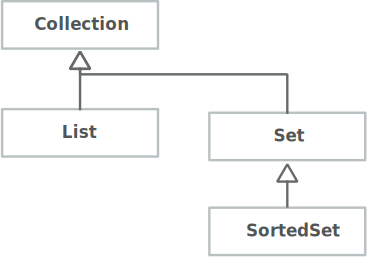
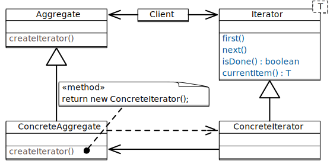

.. meta::
    :version: renaissance
    :lang: de
    :author: Michael Eichberg
    :keywords: "Programmierung", "Java", "Generics", "Software Development"
    :description lang=de: Java Generics 
    :id: lecture-prog-java-generics
    :first-slide: last-viewed
    :master-password: WirklichSchwierig!
    :theme: colored
    
.. |html-source| source::
    :prefix: https://delors.github.io/
    :suffix: .html
.. |pdf-source| source::
    :prefix: https://delors.github.io/
    :suffix: .html.pdf
.. |at| unicode:: 0x40

.. role:: incremental
.. role:: eng
.. role:: ger
.. role:: red
.. role:: green
.. role:: obsolete
.. role:: peripheral
.. role:: monospaced
.. role:: java(code)
   :language: java

Java Generics
===========================================================

----

:Dozent: `Prof. Dr. Michael Eichberg <https://delors.github.io/cv/folien.de.rst.html>`__
:Kontakt: michael.eichberg@dhbw.de, Raum 149B
:Version: 1.0.1

.. supplemental::

    :Folien: 
        
        |html-source| 

        |pdf-source|

    .. 
        :Kontrollfragen:

            .. source:: kontrollfragen.de.rst 
                :path: relative
                :prefix: https://delors.github.io/
                :suffix: .html

        :Klausurvorbereitung:

            .. source:: klausurvorbereitung.de.rst 
                :path: relative
                :prefix: https://delors.github.io/
                :suffix: .html

    :Fehler melden:
        https://github.com/Delors/delors.github.io/issues

.. class:: new-section

Einfache nicht-generische Datenstrukturen
------------------------------------------------

.. container:: section-subtitle

    Wiederholung von allg. Programmierkonzepten und Motivation für Generics.

.. class:: exercises 

Übung 
------------------------------------------------

.. scrollable::

    .. exercise:: Speichern von Wertepaaren

        1. Implementieren Sie die Datenstruktur :java:`Pair` die zwei Werte (vom Typ :java:`Object`) speichern kann. Die Klasse soll folgende Methoden bereitstellen:

        - :java:`Pair(..., ...)`: Konstruktor zum Erzeugen eines :java:`Pair`\ s.
        - :java:`getFirst()` und :java:`getSecond()`: Liefert den ersten/zweiten Wert zurück
        - :java:`void setFirst(...)` und :java:`void setSecond(...)`: Setzt den ersten/zweiten Wert
        - :java:`toString()`: Liefert eine String-Repräsentation des Paares

        2. Erzeugen Sie ein :java:`Pair`-Objekt mit zwei Integer-Werten (z. B. 1 und 2).
        3. Nutzen Sie die Methoden der Klasse, um die Werte abzufragen und zu addieren.
        4. Speichern Sie das Ergebnis an zweiter Stelle im :java:`Pair`-Objekt als :java:`String`.
        5. Geben Sie den zweiten Wert auf der Konsole aus.
        6. Was wäre bei der Addition passiert, wenn an zweiter Stelle ein :java:`String` gespeichert gewesen wäre? Wann wäre das Verhalten aufgefallen?
        7. Welchen statischen Typ hat der Wert, den die Methode :java:`getFirst()` zurückgibt?

        .. solution:: 
            :pwd: EinfachAberUnschoen

            .. include:: code/Pair.java
                :code: java
                :class: copy-to-clipboard
                :number-lines:

            Bzgl. 6. Es wäre eine :java:`ClassCastException` geworfen worden, da der Wert nicht in einen :java:`Integer` umgewandelt werden kann.

            Bzgl. 7. Der statische Typ ist :java:`java.lang.Object`, der dynamische Typ ist beim Speichern eines primitiven :java:`int` Wertes :java:`java.lang.Integer`. Der primitive Wert wurde automatisch in einen Wrapper-Typ umgewandelt (Autoboxing).

.. class:: exercises 

Übung 
------------------------------------------------

.. scrollable::

    .. exercise:: Datenstruktur zum Speichern von ganz vielen Werten

        1.  Implementieren Sie eine Datenstruktur :java:`List` zum Speichern beliebig vieler Werte im Package ``ds``. Die Klasse soll folgende Methoden bereitstellen: 

            - :java:`List()`: Konstruktor
            - :java:`List(int size)`: Konstruktor
            - :java:`void add(...)`: Fügt ein Element hinzu
            - eine *Varargs* Methode :java:`void addAll(...)`:, die alle übergebenen Werte hinzufügt.
            - :java:`int size()`: Liefert die Anzahl der Elemente zurück
            - :java:`Object get(int index)`: Liefert das Element an der Stelle :java:`index` zurück oder wirft eine :java:`IndexOutOfBoundsException`, wenn der Index ungültig ist
            - :java:`void set(int index, Object value)`: Setzt das Element an der Stelle :java:`index` auf den Wert :java:`value` oder wirft eine :java:`IndexOutOfBoundsException`, wenn der Index ungültig ist
            - :java:`String toString()`: Liefert eine String-Repräsentation der Liste
            - :java:`void remove(int index)`: Entfernt das Element an der Stelle :java:`index` oder wirft eine :java:`IndexOutOfBoundsException`, wenn der Index ungültig ist
            - :java:`void clear()`: Entfernt alle Elemente

            Nutzen Sie als zugrunde liegende Datenstruktur ein Array. D. h. speichern Sie die Elemente in einem Array und vergrößern Sie das Array, wenn es voll ist. Wenn das Array zu groß ist, verkleinern Sie es. Eine Vergrößerung soll das Array verdoppeln aber um nicht mehr als 1000 Elemente. Eine Verkleinerung soll das Array halbieren, wenn weniger als ein Viertel des Arrays belegt ist. Die Mindestgröße des Arrays soll 16 Elemente betragen.

            Nutzen Sie :java:`java.lang.System.arraycopy(...)` zum Vergrößern/Verkleinern des zugrunde liegenden Arrays.

        2.  Schreiben Sie eine Klasse :java:`ListTest`, die die Klasse :java:`List` testet. Die Klasse soll jede der Methoden der Klasse :java:`List` *testen*; d. h. mindestens einmal aufrufen.

            .. attention::

                Denken Sie an die Modellierung von Sichtbarkeiten.

                Modellieren Sie alle Ausnahmen. Stellen Sie sicher, dass alle Methoden die Bedingungen einhalten.
    
        .. solution:: 
            :pwd: WeiterGehtEs

            1. .. include:: code/ds/List.java
                :code: java
                :class: copy-to-clipboard margin-top-1em
                :number-lines:

            2. .. include:: code/ListTest.java
                :code: java
                :class: copy-to-clipboard margin-top-1em
                :number-lines:

.. class:: exercises 

Übung 
------------------------------------------------

.. scrollable::

    .. exercise:: Klasse List erweitern
        :formatted-title: :java:`List` erweitern

        1. Schreiben Sie eine Klasse :java:`Stack` im Package ``ds``, die Ihre Klasse :java:`List` erweitert; d. h. von :java:`List` erbt. Die Klasse soll folgende Methoden bereitstellen:

           - :java:`Stack()`: Konstruktor
           - :java:`void push(... value)`: Legt ein Element auf den Stack
           - :java:`... pop()`: Entfernt das oberste Element vom Stack und liefert es zurück oder wirft eine :java:`java.util.NoSuchElementException`, wenn der Stack leer ist
           - :java:`... peek()`: Liefert das oberste Element zurück, ohne es zu entfernen oder wirft eine :java:`NoSuchElementException`, wenn der Stack leer ist

        2. Schreiben Sie eine Klasse RPN (im *Default Package*), die einen String von der Kommandozeile übernimmt (als einzelne "args") und diesen als *umgekehrte polnische Notation* interpretiert (d. h. erst kommen die Operanden, dann ein Operator) und berechnet.

           Beispielinteraktion:
        
           .. code:: console
                :number-lines:

                $ java --enable-preview RPN 1 2 "+" 3 "*"
                9.0

           Nutzen Sie Ihre Klasse :java:`Stack` zum Zwischenspeichern der Operanden.

        3. Wenn Sie sich den Code des RPN ansehen - wo sehen Sie insbesondere Verbesserungspotential?

        .. solution:: 
            :pwd: WeiterGehtEs

            .. include:: code/RPN.java
                :code: java
                :class: copy-to-clipboard
                :number-lines:
        

.. class:: summary

Zusammenfassung
------------------------------------------------

.. class:: positive-list

- wir haben zwei grundlegende Datenstrukturen kennen gelernt sowie mögliche Implementierungen dafür:

  1. Listen basierend auf Arrays
  2. Stacks basierend auf Listen

.. class:: negative-list

- wir haben gesehen, dass die Verwendung von Datenstrukturen, die nichts über den Typ der gespeicherten Elemente wissen, zu Problemen führen kann (Fehler zur Laufzeit und nicht zur Compilezeit). Weiterhin sind viele explizite Typumwandlungen notwendig, die den Code unübersichtlich machen.

.. class:: new-section transition-scale

Generics - erste Einführung
------------------------------------------------

Generics - Motivation
------------------------------------------------

.. deck::

    .. card::

        .. observation::

            .. class:: incremental-list list-with-explanations

            - Eine Collection wie :java:`Pair` oder :java:`List` sollte zu mehr als einem Typ passen.
            
            - Eine Implementierung sollte für verschiedene Zwecke ausreichend sein.

            - Das allgemeine Verhalten der Collection hängt nicht vom Elementtyp ab.

            - Zusätzlich wollen wir einen spezifischen Elementtyp garantiert haben. 

              Angenommen, wir nutzen eine Collection nur für Person Instanzen, dann wollen wir auch Person Objekte verwenden können und nicht immer mit "Object" arbeiten müssen.

    .. card::

        Generics erlauben die Definition generischer und typsicherer Datentypen, die über die Typen der Elemente abstrahieren. 
        
        D. h. wir können zum Beispiel angeben, dass wir nur Elemente vom statischen Typ :java:`Person` speichern wollen. Dies hat folgende Vorteile:

        .. class:: positive-list incremental-list

        - Kompakterer / besser wartbarer Code 
        - Fehler, die sonst erst zur Laufzeit auftreten würden, können zur Compilezeit erkannt werden (z. B. das versehentliche Speichern eines :java:`String`\ s in einer Liste für :java:`Integer` Werte.)

Generics - Beispiel: RPN Calculator mit verschiedenen :java:`Stack`\ s
-----------------------------------------------------------------------

.. deck::

    .. card::
        
        .. rubric:: Verwendung eines einfachen :java:`Stack`\ s ohne Typparametrisierung

        .. include:: code/RPN.java
            :code: java
            :class: copy-to-clipboard
            :number-lines:
            :start-after: // Main logic
            :end-before: System.out.println(stack.pop())
    
        .. supplemental:: 

            In diesem Beispiel würden wir insbesondere gerne auf die Casts (2 Mal in Zeile 5 und 2 man in Zeile 8) verzichten wollen. Dies Casts sind nicht nur unschön, sondern können auch (in komplexeren Fällen) zu Laufzeitfehlern führen.

    .. card::
        
        .. rubric:: Verwendung eines :java:`Stack`\ s für Double Werte

        .. include:: code/RPN2.java
            :code: java
            :class: copy-to-clipboard
            :number-lines:
            :start-after: // Main logic
            :end-before: System.out.println(stack.pop())

Einfache generische Klassen aus Java
------------------------------------------------

.. code:: java
    :number-lines:

    public interface Collection<E> {
        void add(E x);
        Iterator<E> iterator();
    }

    public interface Comparable<T> {
        int compareTo(T o);
    }

Mittels :java:`<E>` oder :java:`<T>` in der Klassendefinition deklarieren wird einen formalen Typparameter :java:`E` bzw. :java:`T`.

Dieser kann dann in der Klasse als Typ genutzt werden. Wenn wir dann eine Instanz der Klasse erzeugen, müssen wir den konkreten Typ für den Typparameter :java:`E` bzw. :java:`T` angeben.

Generics: Instanziierung
------------------------------------------------

.. story::

    - Bei der Instanziierung von Generics muss für alle generischen Typen ein konkreter Datentyp (z.B. :java:`Integer`) definiert werden:

      .. example::
        :class: dhbw

        :java:`List<Integer> v1 = new List<Integer>();`

    .. class:: incremental-list

    - Der konkrete Datentyp muss eine Klasse sein, d. h. es darf kein primitiver Datentyp (z.B. :java:`int`) sein. 

    - Der konkrete Datentyp kann allerdings auch bei der Verwendung weggelassen werden (dann spricht man von Raw-Types).

      .. example::
        :class: dhbw

        :java:`List v1 = new ArrayList();`

      .. attention::

        **Raw-Types sollten vermieden werden**, Sie wurden kurz nach der Einführung von Generics verwendet, um bestehenden Code zu migrieren.

    - Wenn ein generischer Datentyp instanziiert wird, und direkt einer entsprechend getypten Variable zugewiesen wird, dann kann der konkrete Datentyp weggelassen werden (es muss aber der *Diamond Operator* :java:`<>` verwendet werden).

      .. example::
        :class: dhbw

        :java:`Stack<Double> stack = new Stack<>();`
        
        oder

        :java:`List<Integer> v1 = new ArrayList<>();`

        oder

        :java:`Pair<Integer,Integer> p1 = new Pair<>(36462828, 50);`

        :java:`Pair<String,Integer> p2 = new Pair<>("Michael", 2023);`

.. class:: exercises

Übung
------------------------------------------------

.. exercise:: Pair mit Typparametern

    Erweitern Sie Ihre Klasse Pair um zwei generische Typparameter :java:`U` und :java:`V` für die beiden Werte, die gespeichert werden sollen. 
    
    Nutzen Sie dann die entsprechenden Typen :java:`U` und :java:`V` für die entsprechenden Attribute der Klasse und ggf. auch für Methodenparameter/-rückgabewerte und lokale Variablen.

    Passen Sie auch die main Methode entsprechend an.

    .. solution::
        :pwd: UV-Pair-VU

        .. include:: code/ds/generic/Pair.java
            :code: java
            :class: copy-to-clipboard
            :number-lines:

.. class:: new-section transition-scale

Eine kurz Einführung in das Java Collections Framework
--------------------------------------------------------

Collections (d. h. Sammlungen von Objekten)
------------------------------------------------

.. class:: incremental-list

- Eine häufig benötigte Form von Datenstrukturen ist eine Collection (Sammlung), die unterschiedliche Datenelemente speichert.

  - entweder genau der gleiche Typ
  - oder der gleiche Typ; ggf. mit Subtypen
  - :peripheral:`oder gemischte Typen (eher selten)`

- Abhängig vom geplanten Gebrauch kann eine Collection…

  - schnellen Zugriff auf die einzelnen Elemente unterstützen.
  - die Sortierung der Elemente unterstützen.
  - die Möglichkeit zum Zugriff auf bestimmte Elemente geben.
  - bei Bedarf wachsen.
  - usw.

Wrapper-Klassen und Auto(un)boxing
------------------------------------------------

.. story::

    .. repetition::

        .. class:: list-with-explanations

        - wir unterscheiden Werte und Referenzen
        - primitive Datentypen sind keine Referenztypen

            Sie werden nicht von Object abgeleitet und besitzen keine Methoden.

    .. observation::
        :class: incremental margin-top-1-5em

        Wie wir gesehen haben ist es möglich primitive Datentypen in Datenstrukturen wie Listen zu speichern obwohl diese eigentlich nur Objekte speichern können.
        
    .. compound::
        :class: incremental

        Wenn primitive Werte an Stellen verwendet werden, die eigentlich Objekte verlangen (z. B. Collections), dann werden automatisch die jeweiligen passenden Wrapperklassen verwendet; d. h. die primitiven Datentypen werden in Objekte umgewandelt und entsprechend behandelt:

            ::

                int -> java.lang.Integer
                float -> java.lang.Float
                double -> java.lang.Double
                char -> java.lang.Character
                boolean -> java.lang.Boolean
                byte -> java.lang.Byte
                short -> java.lang.Short
                long -> java.lang.Long

        .. warning::
            :class: incremental margin-top-1em

            Dieses so genannten *Autoboxing* hat jedoch ggf. erhebliche Laufzeitkosten und sollte daher vermieden werden.
    

Grundlegende Klassen des Collections Frameworks
------------------------------------------------

.. class:: list-with-sublists

- Das Hauptinterface ist :java:`java.util.Collection`

  - es definiert grundlegende Methoden für Sammlungen von Objekten.
  - es definiert keine Restriktionen / Garantien bezüglich Duplikate / Ordnung / Sortierung, usw.

- :java:`List` (hat die Implementierungen :java:`ArrayList`, :java:`LinkedList`, …)

  - Objekte sind sortiert
  - kann Duplikate enthalten
  - direkter Zugriff auf Objekte über Index

- :java:`Set` (hat die Implementierung :java:`HashSet`)

  - keine Einschränkung bzgl. der Sortierung
  - Objekt kann nur einmal enthalten sein

- :java:`SortedSet` (hat die Implementierung :java:`TreeSet`)

  - Ein Set, aber geordnet bzgl. einer spezifischen Vergleichsstrategie.

.. class:: new-subsection 

Collections für einen Typ von Werten
------------------------------------------------

.. class:: no-title center-content

Collections vom Typ „E“
-------------------------------

Im Folgenden betrachten wir Collections die Element vom Typ „E“ verwalten; dieser Typ ist durch „passende“ Typen ersetzbar.

:java:`java.util.List`
------------------------------------------------

.. story::

    .. compound::

        **Das Interface bietet folgende Methoden**:

        .. class:: incremental-list

        - :java:`boolean add(E e)`: Anhängen des Elements :java:`e` an die Liste
        - :java:`void add(int pos, E e)`: Einfügen des Elements :java:`e` an Position :java:`pos`; verschiebt alle Elemente ab Position :java:`pos` um eine Position nach hinten
        - :java:`boolean addAll(Collection c)`: Anhängen aller Elemente der Collection :java:`c` an die Liste
        - :java:`boolean addAll(int pos, Collection c)`: Einfügen aller Elemente der Collection :java:`c` an Position :java:`pos` (s.o.)
        - :java:`void clear()`: Löscht alle Elemente der Liste
        -  :java:`boolean contains(Object o)`: Liefert true, wenn sich Objekt :java:`o` in der Liste befindet
        - :java:`boolean containsAll(Collection c)`: Liefert true, falls alle Objekte der Collection :java:`c` in der Liste sind
        - :java:`E get(int pos)`: Liefert das Element an Position :java:`pos` der Liste
        - :java:`int indexOf(Object o)`: Liefert die erste Position, an der sich :java:`o` in der Liste befindet, sonst -1. Gegenstück: :java:`int lastIndexOf(Object o)`
        - :java:`boolean isEmpty()`: Liefert true wenn die Liste leer ist
        - :java:`E remove(int pos)`: Entfernt das Objekt an Position :java:`pos` und liefert es zurück
        - :java:`boolean remove(Object O)`: Versucht Objekt :java:`o` aus der Liste zu entfernen; true bei Erfolg
        - :java:`int size()`: Liefert die Größe der Liste
        - :java:`Object[] toArray()`: Liefert ein Array, das alle Elemente der Liste umfasst
    
    .. compound::
        :class: incremental

        **Für Konstruktoren in den Erbenklassen gilt**:

        - es gibt immer Parameterlose Konstruktoren (Konvention)
        - Konstruktoren mit :java:`Collection` als Parameter kopieren alle Werte in die Liste
        - :peripheral:`Spezialfälle (siehe entsprechende Dokumentation)`

    .. compound::
        :class: incremental

        **Konkrete Implementierungen (Auswahl)**:

        :java:`java.util.LinkedList` fügt folgende Methoden hinzu (Auswahl):

        - :java:`void addFirst(E)`
        - :java:`void addLast(E)`
        - :java:`E getFirst()`
        - :java:`E getLast()`
            
        :java:`java.util.ArrayList` speichert die Elemente in einem Array und fügt folgende Methoden hinzu (Auswahl):

        - :java:`void ensureCapacity(int minCapacity)` - falls die Liste weniger Elemente als :java:`minCapacity` fassen kann, wird das Array vergrößert
        - :java:`void trimToSize()` - verkleinert das Array auf die Listengröße
        - :java:`ArrayList(int initialCapacity)` Neuer Konstruktor, für die Spezifikation der Größe

:java:`java.util.Set`
------------------------------------------------

.. story::

    .. class:: list-with-explanations

    - Ein Set repräsentiert eine mathematische Menge

      D. h. ein gegebenes Objekt ist nur maximal einmal vorhanden und das Einfügen scheitert, wenn das Objekt schon vorhanden ist.

    - Umfasst die meisten der schon bekannten Methoden

      .. code:: java

        boolean add(E e)
        boolean addAll(Collection c)
        void clear()
        boolean contains(Object O)
        boolean containsAll(Collection c)
        boolean isEmpty()
        boolean remove(Object O)
        boolean removeAll(Collection c)
        int size()
        Object[] toArray()

    .. compound::
        :class: incremental

        **Konkrete Implementierungen (Auswahl)**:

        - :java:`java.util.HashSet`: verwaltet die Daten in einer Hashtabelle (sehr effizienter Zugriff)
        - :java:`java.util.TreeSet`: verwaltet die Daten in einem Baum mit Zugriffszeiten in O(log n)\ [#]_.

        .. [#] Die Komplexität von Algorithmen diskutieren wir in einem späteren Abschnitt detailliert.

.. class:: new-subsection 

Collections für Paare von Werten (Schlüssel und Wert)
------------------------------------------------------  

.. class:: no-title center-content

Map mit Typparametern
-------------------------------

Im folgenden wird der Typ „K“ für den Typ des Schlüssels und der Typ "V" für den Typ des Wertes verwendet; diese Typen sind durch „passende“ Typen ersetzbar.

:java:`java.util.Map`
------------------------------------------------

.. story::

    .. image:: images/collections/maps.svg
        :alt: Collections Framework - Maps
        :align: right

    Wenn Objekte nicht über einen numerischen Index, sondern über einen Schlüssel (einzigartiger, aber sonst zufälliger Wert) auffindbar sein sollen, z.B. eine Telefonnummer mit „Nachname + Vorname“.

    .. compound:: 
        :class: incremental

        **Das Interface bietet folgende Methoden**:

        .. class:: incremental-list

        - :java:`Object put(K key, V value)`	speichert "value" zum Auffinden mit "key"
        - :java:`Object get(Object key)`	findet das Objekt gespeichert unter "key"
        - :java:`boolean containsKey(Object key)`	beantwortet, ob ein Objekt unter "key" liegt
        - :java:`boolean containsValue(Object value)` beantwortet, ob "value" in der HashMap ist
        - :java:`Object remove(Object key)`	löscht "key" und die assoziierten Objekte

        .. supplemental:: 

            Wir werden später klären warum nur die Parameter der Methode :java:`put` einen generischen Typ (:java:`K` für *Key* (:ger:`Schlüssel`) und :java:`V` für *Value* (:ger:`Wert`)) haben.
            

    .. compound::
        :class: incremental

        **Konkrete Implementierungen (Auswahl)**:

        :java:`java.util.HashMap`

        Erlaubt Zugriff auf Elemente durch einen berechneten Schlüssel, z.B. „Nachname + Vorname“ Schlüssel wird in numerischen Index (Hashwert\ [#]_) konvertiert und für effizienten Zugriff genutzt.
        
        .. [#] Hashing diskutieren wir später detailliert.

.. class:: new-subsection

Iterieren über Collections bzw. Laufen über die Elemente eine Collection
--------------------------------------------------------------------------

:java:`java.util.Iterator`
------------------------------------------------

.. story::

    .. class:: list-with-explanations

    - Java nutzt einen :java:`Iterator`, um über Elemente in einer Collection zu laufen („zu iterieren“).

      Normalerweise erhält man den Iterator durch den Aufruf von :java:`iterator()` auf der Collection.

      - Das gilt für alle Subklassen des Collection Interface
      - Für eine :java:`HashMap` nutzt man :java:`keys()` und darauf :java:`iterator()`
      - :java:`iterator()` liefert eine Instanz von :java:`java.util.Iterator`

    \ 

    .. class:: incremental-list

    - Ein Iterator bietet die Operationen:

      .. class:: list-with-explanations

      - :java:`boolean hasNext()` – gibt es noch weitere Elemente?

      - :java:`Object next()` – liefert das nächste Element, falls eines existiert;
            sonst wird eine NoSuchElementException geworfen.

        Prüfen Sie vorher die Existenz mit :java:`hasNext()`!

      - :java:`void remove()` – entfernt das zuletzt gelieferte Element; häufig nicht unterstützt. In diesem Fall wird eine :java:`UnsupportedOperationException` geworfen.

    .. compound:: 
        :class: incremental margin-top-1em

        .. example::
            :class: dhbw

            .. code:: java
                :number-lines:

                final List<Integer> l = Arrays.asList(1, 2, 3); // Liste anlegen
                int r = 0;
                final var it = l.iterator(); // Iterator holen
                while(it.hasNext()) // weiter, solange Elemente da
                    r += it.next(); // Element zur Summe addieren

            Sollte aufgrund von Domänenwissen bekannt sein, dass die Liste niemals leer ist, kann die Schleife auch so geschrieben werden:

            .. code:: java
                :number-lines:

                do { 
                    r += it.next(); // Element zur Summe addieren
                } while(it.hasNext()); // weiter, solange Elemente da

    .. compound:: 
        :class: incremental margin-top-1em

        Weiterhin gibt es eine besondere :java:`for`\ -Schleife (:eng:`foreach-loop`), die die Iteration über eine :java:`Collection`, die das Interface :java:`Iterable` implementiert vereinfacht:

        .. example::
            :class: dhbw

            .. code:: java
                :number-lines:

                for (Integer i : l) // für jedes Element in der Liste
                    r += i; // Element zur Summe addieren

        :java:`java.util.Iterable` definiert dabei lediglich das Protokoll zur Erzeugung eines :java:`java.util.Iterator`\ s. 

Das Iterator-Design Pattern
------------------------------------------------

Die Implementation von *Iterator*\ s ist ein Beispiel für die Umsetzung des *Design Pattern* (:ger:`Entwurfsmuster`) „Iterator“.

.. supplemental::

    Es ist hier festzustellen, dass in Java die Methode :java:`hasNext()` an die Stelle der Methode :java:`isDone()` rückt. die Methode :java:`next()` das Fortschalten des Iterators und die Rückgabe des nächsten Elements kombiniert. In anderen Sprachen bzw. im Textbuch sind diese beiden Operationen getrennt. Eine Design Pattern stellt auch immer nur eine Blaupause dar, die in der konkreten Umsetzung angepasst werden kann bzw. soll.

.. class:: exercises 

Übung
------------------------------------------------

.. exercise:: Iterables

    Implementieren Sie das Interface :java:`java.lang.Iterable` für Ihre Klasse :java:`Pair`. D. h. schreiben Sie eine Methode :java:`java.util.Iterator iterator()`, die einen Iterator für die Elemente des Paares zurückgibt.

    Dazu ist es erforderlich, dass Sie eine Klasse :java:`PairIterator` implementieren, die das Interface :java:`java.util.Iterator` implementiert. Diese Klasse führt dann die eigentliche Iteration durch. Die Erzeugung der Instanz von :java:`PairIterator` erfolgt in der Methode :java:`iterator()`.

    .. hint::
        :class: dhbw margin-top-1-5em

        Die Klasse :java:`PairIterator` benötigt einen Konstruktur, der eine Referenz auf das Pair bekommt, über das iteriert werden soll.

    .. solution::
        :pwd: It$It-Iterable

        .. include:: code/IterablePair.java
            :code: java
            :class: copy-to-clipboard
            :number-lines:

.. class:: new-section

Generics - Fortgeschrittene Konzepte
------------------------------------------------

Typkompatibilität
------------------------------------------------

.. code:: java
    :number-lines:
    :class: copy-to-clipboard

    List<String> ls = new LinkedList<String>(); 
    List<Object> lo = ls; 
    lo.add(new Object()); 
    String s = ls.get(0); 
    
.. question::
    :class: dhbw margin-top-1em incremental

    Wo können hier Probleme auftreten?

.. answer::
    :class: dhbw incremental margin-top-1em

    Die Zuweisung in Zeile 2 ist nicht erlaubt, da :java:`List<String>` und :java:`List<Object>` nicht kompatibel sind. Obwohl String ein Subtype von Object ist, ist :java:`List<String>` kein Subtyp von :java:`List<Object>`. Wäre dies erlaubt, dann könnte man in Zeile 3 ein Objekt vom Typ :java:`Object` einer Liste von Strings hinzufügen! 

.. summary::
    :class: dhbw incremental margin-top-1em

    Generics sind in Java *invariant*.

Wildcards
----------------------------------------------------    

.. story::
        

    .. deck::

        .. card::

            .. question::

                Wie können wir eine Methode schreiben, die auch mit Subtypen von generischen Typen arbeiten kann?

        .. card::

            Eine einfache Methode zum Ausgeben eines Stacks:

            .. code:: java
                :number-lines:
                :class: copy-to-clipboard

                static void printAll(Stack<Object> stack) {
                    for (int i = 0; i < stack.size(); i++) {
                        System.out.print(stack.get(i) + " ");
                    }
                    System.out.println();
                }

            .. deck::

                .. card::

                    Diese Methode definiert einen Parameter vom Typ :java:`Stack<Object>`. Das bedeutet, dass nur :java:`Stack<Object>`-Objekte übergeben werden können.

                    Die Implementierung funktioniert aber auch mit Listen von Subtypen von :java:`Object` wie :java:`String` oder :java:`Integer`.   

                .. card::

                    Ein Aufruf mit einem :java:`Stack<Integer>`-Objekt führt zu einem Compilerfehler:

                    .. code:: java

                        printAll(new Stack<Integer>())
                        |  Error:
                        |  incompatible types: 
                        |       Stack<java.lang.Integer> 
                        |       cannot be converted to 
                        |       Stack<java.lang.String>

                .. card::

                    Eine Lösung ist die Verwendung von Wildcards:

                    .. code:: java
                        :number-lines:
                        :class: copy-to-clipboard

                        static void printAll(Stack<?> stack) {
                            for (int i = 0; i < stack.size(); i++) {
                                System.out.print(stack.get(i) + " ");
                            }
                            System.out.println();
                        }

                    Durch die Verwendung von :java:`Stack<?>` kann die Methode mit allen Subtypen von :java:`Object` aufgerufen werden.

    .. attention::
        :class: incremental

        Durch die Verwendung eines Wildcards ist es nicht mehr möglich Elemente hinzuzufügen, da der konkrete Typ des Stacks nicht bekannt ist.

        .. code:: java
            :number-lines:

            Stack<?> stack = new Stack<Integer>();
            stack.add(1); // Compilerfehler

.. supplemental::

  .. example::

    .. include:: code/RPN3.java
        :code: java
        :class: copy-to-clipboard
        :number-lines:
        :start-after: // Main logic
        :end-before: System.out.println

Beschränkte Wildcards
------------------------------------------------

.. deck::

    .. card::
                

        .. grid::

            .. cell:: width-50

                .. code:: java
                    :number-lines:
                    :class: copy-to-clipboard

                    abstract class Shape {
                    abstract void draw(Canvas c);
                    }
                    class Circle extends Shape {
                    void draw(Canvas c) { /*...*/ }
                    }
                    class Rectangle extends Shape {
                    void draw(Canvas c) { /*...*/ }
                    }
                    class Canvas {
                    void draw(Shape s) {
                        s.draw(this);
                    } }
                
                **Aufgabe**: Definition einer Methode :java:`drawAll(<list of shapes>)` für :java:`Canvas`, die eine Liste von Formen zeichnet?

            .. cell:: width-50

                .. class:: incremental-list negative-list

                - :java:`drawAll(List<Shape> shapes)` würde nur mit Listen von :java:`Shape`-Objekten funktionieren.
                - :java:`drawAll(List<?> shapes)` würde alle Listen von :java:`Shape`-Objekten und allen Subtypen von :java:`Shape` funktionieren, aber auch Listen von anderen Typen.

                .. container:: incremental

                    Wir müssen den Type der Liste auf :java:`Shape` und Subtypen von :java:`Shape` beschränken. Dies erreichen wir mit einem *beschränkten Wildcard*:

                    :java:`drawAll(List<? extends Shape> shapes)` funktioniert mit Listen von :java:`Shape`-Objekten und allen Subtypen von :java:`Shape`.

        .. supplemental::

            :java:`? extends X` bedeutet:

            - Wir kennen den exakten Typ nicht („?“)
            - Aber wir wissen, dass der Typ zu :java:`X` konform sein muss
            - :java:`X` ist die „obere Schranke“ der Wildcard

    .. card::

        Wo ist das Problem bei folgender Methode?

        .. code:: java
            :number-lines:
            :class: copy-to-clipboard

            void addRectangle(List<? extends Shape> shapes) {
                shapes.add(0, new Rectangle());
            }

        .. container:: incremental

            Das Problem ist, dass wir nicht wissen, welcher konkrete Typ von :java:`List` übergeben wird. Es könnte auch eine :java:`List<Circle>` sein, die keine Rechtecke aufnehmen kann.

            Die Methode :java:`addRectangle` würde also nicht mit einer :java:`List<Circle>` funktionieren.

        .. container:: incremental

            Die Lösung ist die Spezifikation einer unteren Schranke. Dies ist mittels der  Verwendung von *super* möglich.

            .. code:: java
                :number-lines:
                :class: copy-to-clipboard

                void addRectangle(List<? super Rectangle> shapes) {
                    shapes.add(0, new Rectangle());
                }

        .. supplemental::        

            :java:`? super X` bedeutet:

            - Wir kennen den exakten Typ nicht („?“)
            - Aber wir wissen, dass :java:`X` von dem unbekannten Typ abgeleitet sein muss
            - :java:`X` ist die „untere Schranke“ der Wildcard

Generische Methoden
------------------------------------------------

.. deck::

    .. card:: 

        Zusätzlich zu generischen Klassen können auch generische Methoden definiert werden. Bei diesen Methoden wird der generische Typ vor dem Rückgabetyp spezifiziert.

    .. card::
                
        .. example::

            .. code:: java
                :number-lines:
                :class: copy-to-clipboard

                public class Tuple2<T> {
                    public final T first;
                    public final T second;
                    public Tuple2(T first, T second) {
                        this.first = first; this.second = second;
                    }
                    public String toString() { return "(" + first + ", " + second + ")"; }

                    public <X> Tuple2<X> map(Function<T,X> mapper) {
                        return new Tuple2<>(mapper.apply(first), mapper.apply(second));
                    }
                }

            .. rubric:: Verwendung

            .. code:: java
                :number-lines:
                :class: copy-to-clipboard
                
                /*Tuple2<String> ts =*/ new Tuple2<Integer>(1,2).map(e -> "value: " + e)

        

.. class:: summary

Statische Typisierung
------------------------------------------------

- Statische Typsysteme sind (noch immer) Gegenstand der Forschung
- Java-ähnliche Typsysteme sind begrenzt, aber im Allgemeinen können Typsysteme sehr mächtig und ausdrucksstark sein - aber auch sehr kompliziert
- Manche Programmierer sehen statische Typsysteme als eine Begrenzung ihrer Freiheit ("ich weiß, was ich tue")
- Andere Programmierer denken, dass statische Typsysteme nicht nur viele Fehler erkennen, sondern auch eine gute Struktur im Code erzwingen ("erst denken, dann schreiben")
- In der Praxis zeigt sich, dass fast alle großen Projekte auf statische Typsysteme setzen.

.. class:: exercises

Übung
------------------------------------------------

.. exercise:: Wildcards

    .. class:: list-with-details

    1.  Fügen Sie Ihrer generischen Klasse :java:`Pair` eine Methode :java:`addToMap(...)` hinzu, die die Elemente des Pairs in einer :java:`java.util.Map` speichert. D. h. der erste Wert eines Pairs wird als Schlüssel und der Zweite als Value verwendet. 

        Achten Sie darauf, dass die Methode auch Maps von Supertypen von :java:`U` und :java:`V` akzeptiert. D. h. es sollte folgendes Szenario unterstützt werden:

        .. code:: java
            :number-lines:
            :class: copy-to-clipboard

            Pair<Integer,Integer> p = new Pair<>(1, 2);
            java.util.Map<Object,Integer> map = new java.util.HashMap<>();
            p.addToMap(map); // D.h. dem Key "1" ist nur der Wert "2" zugewiesen.

    2.  Schreiben Sie eine Methode die die Werte eine :java:`Pair`\ s aktualisiert basierend auf den Werten eines anderen Paares. Achten Sie darauf, dass die Methode auch mit Subtypen von :java:`U` und :java:`V` arbeitet.

        .. code:: java
            :number-lines:
            :class: copy-to-clipboard

            Pair<Integer,Integer> pIntegers = new Pair<>(1, 2);
            Pair<Object,Object> pObjects = new Pair<>("a",new Object());
            pObjects.update(pIntegers);

    .. solution::
        :pwd: DasWarenGenerics

        .. rubric:: Lösung

        .. include:: code/ds/generic/PairComplete.java
            :code: java
            :class: copy-to-clipboard
            :number-lines:

