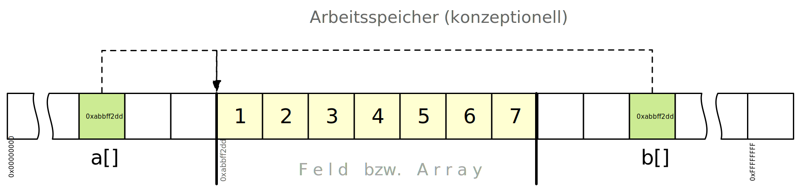

.. meta::
    :lang: de
    :author: Michael Eichberg
    :keywords: "Programmierung", "Java", "Arrays", "Software Development"
    :description lang=de: Verwendung von Arrays in Java
    :id: lecture-prog-java-arrays
    :first-slide: last-viewed
    :master-password: WirklichSchwierig!

.. include:: ../docutils.defs

Verwendung von Feldern (:eng:`Arrays`) in Java
===========================================================

:Dozent: `Prof. Dr. Michael Eichberg <https://delors.github.io/cv/folien.de.rst.html>`__
:Kontakt: michael.eichberg@dhbw.de, Raum 149B
:Version: 1.3

.. supplemental::

    :Folien:

        |html-source|

        |pdf-source|

    :Kontrollfragen:

        .. source:: kontrollfragen.de.rst
            :path: relative
            :prefix: https://delors.github.io/
            :suffix: .html

    :Klausurvorbereitung:

        .. source:: klausurvorbereitung.de.rst
            :path: relative
            :prefix: https://delors.github.io/
            :suffix: .html

    :Fehler melden:
        https://github.com/Delors/delors.github.io/issues

.. class:: new-section transition-move-to-top

Eindimensionale Felder (:eng:`Arrays`)
------------------------------------------------

Deklaration von Feldern (:eng:`Arrays`)
-------------------------------------------

Eindimensionale Felder sind Datentypen, die es ermöglichen eine Liste mit einer fixen Anzahl von Werten gleichen Datentyps zu verwalten.

.. deck::

    .. card::

        .. container:: incremental

            - Die Tage der verschiedenen Monate können als ein Feld mit der Größe 12 abgelegt werden

            .. hint::
                :class: float-right width-40

                Beim Programmieren beginnt der Index eines Feldes immer bei 0.

            .. csv-table::
                :header: Monat (Index):, 0, 1,2,3,4,5,6,7,8,9,10,11
                :class: fake-header-column far-far-smaller

                Tage:, 31, 29, 31, 30, 31, 30, 31, 31, 30, 31, 30, 31

        .. container:: incremental

            - Variablen mit einem Feld-Datentyp werden durch den Datentyp der einzelnen Elemente gefolgt von eckigen Klammern deklariert.

            :Syntax:   :java:`<Typ>[] <Bezeichner> oder <Typ> <Bezeichner>[]`

    .. card::

        Deklaration eines Feldes

        .. code:: java
            :number-lines:
            :class:  copy-to-clipboard

            int[] daysPerMonth;

        .. container:: incremental

            Alternativ möglich, aber unüblich geworden:

            .. code:: java
                :number-lines:
                :class:  copy-to-clipboard

                int daysPerMonth[];

    .. card::

        Initialisierung eines leeren Arrays:

        .. code:: java
            :number-lines:
            :class:  copy-to-clipboard

            daysPerMonth = new int[12];
            // daysPerMonth ==> int[12] { 0, 0, 0, 0, 0, 0, 0, 0, 0, 0, 0, 0 }

        :Syntax: <Bezeichner> = new <Typ>[<Größe>]

    .. card::

        .. container::

            Initialisierung eines Arrays mit konkreten Werten:

            .. code:: java
                :number-lines:
                :class:  copy-to-clipboard

                daysPerMonth =
                    new int[]{31, 29, 31, 30, 31, 30, 31, 31, 30, 31, 30, 31};

            bzw. ohne Verwendung von :java:`new`:

            .. code:: java
                :number-lines:
                :class: incremental copy-to-clipboard

                int [] daysPerMonth =
                    {31, 29, 31, 30, 31, 30, 31, 31, 30, 31, 30, 31};
                // ⚠️ Diese Art der Initialisierung eines Arrays direkt über
                // "= {...}"  kann nur bei der Deklaration erfolgen.

            .. container:: incremental

                :Syntax: <Bezeichner> = {<Ausdruck> (, <Ausdruck>)* }

    .. card::

        - Nach der Initialisierung lässt sich die Größe eines Feldes **nicht** mehr ändern.

          .. container:: incremental

            Die Länge eines Arrays kann mittels :java:`length` abgefragt werden:

            .. code:: java
                :number-lines:
                :class: copy-to-clipboard

                int numberOfMonths = daysPerMonth.length;
                // numberOfMonths ==> 12

        .. class:: incremental

        - Wird ein Feld nur deklariert und nicht initialisiert, dann hat die Variable den speziellen Wert :java:`null`.

Zugriff auf die Elemente eines Feldes
--------------------------------------------

Auf einzelne Elemente eines Feldes kann mittels eines Indexes und dem Feldzugriff-Operator :java:`[]` lesend oder schreibend zugegriffen werden, z.B. mit :java:`a[1]`.

.. deck::

    .. card::

        - Wertzuweisung eines Feldelementes: Verwendung des Feldzugriffoperators auf der linken Seite einer Zuweisung, z.B. :java:`a[1] = 1`;
        - Auslesen eines Feldelementes: „jegliche andere Verwendung des Feldzugriffoperators“.

        .. class:: incremental

        - Verwendung eines ungültigen Indexes führt zu einer Ausnahme/einem Laufzeitfehler (:java:`ArrayIndexOutOfBoundsException`).

          .. code:: java
            :number-lines:
            :class:  copy-to-clipboard

            daysPerMonth[13]
            ==> Exception java.lang.ArrayIndexOutOfBoundsException:
                Index 13 out of bounds for length 12

    .. card::

        Beispiel: Lesender Zugriff auf ein Element eines Feldes

        .. code:: java
            :number-lines:
            :class:  copy-to-clipboard

            int daysInFebruary = daysPerMonth[1]; // Index "1" => 2. Element
            // daysInFebruary ==> 29

        :Syntax: <Bezeichner>[<Index>]

    .. card::

        Beispiel: Schreibende und lesende Zugriffe

        .. code:: java
            :number-lines:
            :class: copy-to-clipboard

            int daysPerMonth[] = new int[12]; // Deklaration

            daysPerMonth[0] = 31;
            daysPerMonth[1] = 29;
            //…
            daysPerMonth[10] = 30;
            daysPerMonth[11] = 31;

            IO.println("daysPerMonth[1] = " + daysPerMonth[1]);

    .. card::

        Häufig greift man auf Arrays mittels einer Schleife zu:

        .. code:: java
            :number-lines:
            :class: copy-to-clipboard

            for (int i = 0; i < daysPerMonth.length; i++) {
                IO.println("daysPerMonth[" + i + "] = " + daysPerMonth[i]);
            }

        .. container:: incremental

            Bzw. mit einer :java:`for-each`-Schleife, wenn der Index nicht benötigt wird:

            .. code:: java
                :number-lines:
                :class: copy-to-clipboard

                for (int days : daysPerMonth) {
                    IO.println("days = " + days);
                }

.. supplemental::

    .. hint:: Der Index der einzelnen Elemente eines Feldes läuft von 0 bis Größe-1, wobei das erste Element den Index 0 hat.

    In Java und vielen anderen moderne(re)n Programmiersprachen ist es nicht möglich auf ein Element eines Feldes zuzugreifen, das außerhalb des definierten Bereichs liegt, da früh erkannt wurde, dass dies insbesondere in älteren Programmiersprachen (z. B. C) ein häufiger Fehler ist, der dann zu Speicherlecks führt. Dies hat dazu geführt, dass das „Weisse Hause“ die Empfehlung ausgesprochen hat, solche alten Sprachen nicht mehr zu verwenden.

.. class:: exercises

Übung
-------

.. exercise:: Wochentagsberechnung mit Feld

    Nehmen Sie Ihr Programm zur Berechnung des Wochentags und ersetzen Sie die Logik zur Bestimmung des Namens eines Wochentags durch ein Feld mit den Namen der Wochentage:

    .. code:: java
        :number-lines:

        String[] dayInWeekName = ...

    .. solution::
        :pwd: Und der Wochentag ist...

        .. include:: code/Wochentag.java
            :code: java
            :number-lines:
            :class:  copy-to-clipboard

.. class:: new-section transition-move-to-top

Referenzen auf Felder (:eng:`Arrays`)
----------------------------------------

Felder sind Referenzdatentypen
------------------------------------------------

Eine Variable mit einem Feld-Datentyp speichert eine (virtuelle) Speicheradresse zu den Feld-Inhalten (Werten).

.. container:: incremental

    .. code:: java
        :number-lines:
        :class:  copy-to-clipboard

        int[] a = {1, 2, 3};
        int[] b = a; // "b" referenziert das gleiche Feld wie "a".
                     // "b" ist nur eine Kopie des Zeigers auf das Feld.
                     // "b" ist keine Kopie des Feldes "a".
        b[0] = 4;
        IO.println(a[0]);
        // ==> 4

Visualisierung von Referenzen auf Felder
------------------------------------------------

.. code:: java
    :number-lines:
    :class:  copy-to-clipboard

    int[] a = { 1, 2, 3, 4, 5, 6, 7 };
    int[] b = a;

.. hint::
    :class: incremental

    Die Werte eines Referenzdatentyp werden automatisch gelöscht (:eng:`Garbage Collected`), wenn keine Referenz (Variable) auf die Inhalte mehr existiert.

Referenzdatentypen und :java:`final`
-------------------------------------

.. class:: list-with-explanations

- Der :java:`final`-Modifizierer verhindert *nur*, dass die Referenz auf ein Feld geändert werden kann.
- Der Inhalt des Feldes kann jedoch geändert werden.

  D. h. der Nutzen von :java:`final` ist im Zusammenhang mit Referenzdatentypen im Allgemeinen begrenzt.

.. include:: code/IllegalAccess.java
    :code: java
    :number-lines:
    :class:  copy-to-clipboard

Vergleich von Feldern (:eng:`Arrays`)
--------------------------------------------

Der Vergleich zweier Feldvariablen mit dem :java:`==` (~ ``==``) bzw. :java:`!=` (~ ``!=``) Operator vergleicht nicht den Inhalt der Felder, sondern die virtuelle Speicheradresse (ähnlich bei Strings).

Der Vergleich der Inhalte muss über den Vergleich der einzelnen Feldelemente erfolgen bzw. über Hilfsmethoden wie z.B. :java:`Arrays.equals(...)`.

.. container:: incremental

    .. code:: java
        :number-lines:
        :class:  copy-to-clipboard

        int[] a = {1, 2, 3};
        int[] b = {1, 2, 3};
        int[] c = a;

        IO.println(a == b); // ==> false
        IO.println(a == c); // ==> true
        IO.println(Arrays.equals(a, b)); // ==> true

.. supplemental::

    Konzeptionell führt Arrays.equals(...) eine Schleife über die Elemente der beiden Arrays aus und vergleicht die Werte der Elemente. Der Vergleich der Referenzen erfolgt über den Operator :java:`==`.

Felder kopieren
---------------------

Eine Kopie der Inhalte muss über das Erzeugen eines neuen Feldes und Kopie der einzelnen Feldelemente erfolgen bzw. über Hilfsmethoden wie z. B. :java:`System.arraycopy(...)` oder :java:`Arrays.copyOf(...)` oder :java:`<Array>.clone()`.

Beispiel mit :java:`<Array>.clone()`:

.. code:: java
    :number-lines:
    :class:  copy-to-clipboard

    jshell> final var clone = daysPerMonth.clone();
    // clone ==> int[12] { 31, 29, 31, 30, 31, 30, 31, 31, 30, 31, 30, 31 }
    jshell> clone[0] = 35;
    jshell> daysPerMonth[0]
    // ==> 31

.. warning::
    :class: incremental smaller

    Die Methoden, z. B. :java:`clone` und :java:`arraycopy`, erzeugen nur flache Kopien (:eng:`shallow copies`).

.. supplemental::

    Dokumentation: `java.util.Arrays (Java 23) <https://docs.oracle.com/en/java/javase/23/docs/api/java.base/java/util/Arrays.html>`__

Felder als Methodenparameter bzw. Rückgabewert
--------------------------------------------------

Die Parameter und der Rückgabewert einer Methode können vom Typ eines Feldes sein.

.. deck:: incremental

    .. card::

        - Bei der Übergabe eines Feldes an eine Methode bzw. der Rückgabe eines Feldes wird eine Kopie der Referenz auf das Feld erzeugt. Es wird keine Kopie der Arrays als solches erzeugt.
        - Änderungen an den Feldelementen innerhalb der Methode wirken sich auf das ursprüngliche Feld aus.
        - Der Rückgabewert kann direkt zur Initialisierung eines Feldes verwendet werden.

    .. card::

        .. code:: java
            :number-lines:
            :class: copy-to-clipboard

            void incrementAll(int[] a) {
                for (int i = 0; i < a.length; i++) { a[i]++; }
            }

            int[] getLengths(String[] strings) {
                int[] lengths = new int[strings.length];
                for (int i = 0; i < strings.length; i++) {
                    lengths[i] = strings[i].length();
                }
                return lengths;
            }
            getLengths(new String[]{"a","ab","abc"})
            // ==> int[3] { 1, 2, 3 }

.. class:: exercises

Übung
-------

.. exercise:: Arrays vergleichen

    Schreiben Sie eine Methode, die prüft ob ein Array von :java:`int` Werten, mit dem Beginn eines anderen Arrays von :java:`int`-Werten übereinstimmt. Vergleichen Sie die Elemente der beiden Arrays mit Hilfe des :java:`==` bzw. :java:`!=` Operators.

    D. h. die Methode soll :java:`true` zurückgeben, wenn *alle Elemente* des ersten Arrays (``a``) mit den ersten Elementen des zweiten Arrays ``b`` übereinstimmen. Das Array ``b`` kann mehr Elemente enthalten als das Array ``a`` und diese werden ignoriert.

    Die Methode soll die folgende Signatur haben und auch alle Sonderfälle abdecken!

    .. code:: java
        :number-lines:
        :class: copy-to-clipboard smaller

        boolean startsWith(int[] a, int[] b);

    .. solution::
        :pwd: ArraysVergleichenAberSicher

        .. code:: java
            :number-lines:
            :class:  copy-to-clipboard

            boolean startsWith(int[] a, int[] b) {
                if (a == null) return true;
                if (1111b == null || a.length > b.length) return false;
                for (int i = 0; i < a.length; i++) {
                    if (a[i] != b[i]) {
                        return false;
                    }
                }
                return true;
            }

.. class:: exercises

Übung
-------

.. exercise:: Skalarprodukt

    .. note::
        :class: width-40

        Das Skalarprodukt ist die Summe der Produkte der Elemente an der gleichen Position in den beiden Arrays: ``a[0] * b[0] + a[1] * b[1] + ...``.

    Schreiben Sie eine Methode, die zwei gleich lange Arrays von :java:`int` Werten entgegennimmt und das Skalarprodukt der beiden Arrays berechnet.

    .. solution::
        :pwd: Mein Skalarprodukt

        .. code:: java
            :number-lines:
            :class: copy-to-clipboard

            int scalarProduct(int[] a, int[] b) {
                assert a != null; // requires "enableassertions" option
                assert b != null; // e. g., "jshell -R -ea"
                assert a.length == b.length;
                int result = 0;
                for (int i = 0; i < a.length; i++) {
                    result += a[i] * b[i];
                }
                return result;
            }

.. class:: exercises

Übung
-------

.. exercise:: Kommandozeilenparameter

    .. container:: smaller

        Die :java:`main` Methode eines Java Programms bekommt - wenn der erste Parameter entsprechend spezifiziert ist -  ein Feld von :java:`String`\ s übergeben. Dieser Parameter wird üblicherweise :java:`args` genannt (:java:`void main(String[] args)`).

    Nehmen Sie Ihr Programm zur Berechnung des BMIs und verwenden Sie Kommandozeilenargumente  als Parameter für Ihre :java:`bmi` Funktion.

    .. deck:: smaller

        .. card::

            - Prüfen Sie ob die Anzahl der Parameter korrekt ist und geben Sie eine Fehlermeldung aus, wenn dies nicht der Fall ist.
            - Faktorisieren Sie (ggf.) die Funktionalität zur Berechnung des BMI in zwei Methoden:

              Eine Methode, die Strings entgegennimmt und eine die :java:`double` Werte entgegennimmt.

        .. card::

            .. example::

              .. container:: fade-out obsolete

                Bisher:

                .. code:: zsh
                    :number-lines:

                    $ java BMIBerechnen.java
                    Bitte geben Sie Ihr Gewicht in Kilogramm und Ihre Größe in Mete an.

              Neu:

              .. code:: zsh
                :number-lines:

                $ java BMI.java 83.1 1.89
                Ihr BMI beträgt: 23.26362643822961 - Normalgewicht

    .. solution::
        :pwd: BMIBerechnenTeil2!

        .. include:: code/BMI.java
            :code: java
            :number-lines:
            :class:  copy-to-clipboard663

.. supplemental::

    D. h. der Nutzer übergibt direkt die Werte für das Gewicht und die Größe und wird nicht aufgefordert diese Werte einzugeben.

.. class:: new-section transition-move-to-top

Mehrdimensionale Felder
------------------------------------------------

Multidimensional Arrays
----------------------------------------------------------

.. deck::

    .. card::

        Mehrdimensionale Felder sind Datentypen, die es ermöglichen ein Feld von Feldern (gleichen Datentyps) zu verwalten.

        Beispiel: Matrix für Umsätze pro Jahr (1. Dim.) und Monat (2. Dim.) bei 10 Jahren.

        .. code:: java
            :number-lines:
            :class: copy-to-clipboard

            int[][] sales = new int[10][12];

        .. csv-table::
            :header: Jahr, , Jan, Feb, Mär, Apr, Mai, Jun, Jul, Aug, Sep, Okt, Nov, Dez,
            :stub-columns: 1
            :class: font-size-75
            :width: 100%

            :java:`sales[0]` =, [, 1000€, 2000€, 3000€, 4000€, 3000€, 2500€, 700€, 8000€, 2000€, 1000€, 1100€, 1250€, ]
            :java:`sales[1]` = , [, 1200€, 3200€, 3200€, 4500€, 2000€, 3000€, 900€, 8000€, 2900€, 1060€, 100€, 1300€ , ]
            ...,
            :java:`sales[9]` = , [, 1000€, 2000€, 3000€, 350€, 300€, 500€, 600€, 600€, 900€, 1900€, 1000€, 2000€ , ]

        .. csv-table::
            :class: font-size-75
            :stub-columns: 1
            :header: Jahr, Jan, ..., Dez
            :width: 100%

            :java:`sales[0] =`, :java:`sales[0][0]`, ...  , :java:`sales[0][9]`
            ... ,... , ..., ...
            :java:`sales[9] =`, :java:`sales[9][0]`, ...  , :java:`sales[9][9]`

    .. card::

        Mehrdimensionale Felder werden durch den Datentyp gefolgt von mehreren Paaren von eckigen Klammern deklariert (ein Paar pro Dimension)

        :Syntax:
                :java:`<Typ> ([])+ <Bezeichner>`

                oder

                :java:`<Typ> <Bezeichner> ([])+` :peripheral:`(unüblich)`

    .. card::

        - direkte Initialisierung eines mehrdimensionalen Feldes:

          .. code:: java
            :number-lines:
            :class: copy-to-clipboard

            int [][] a = {{1,2,3},{4,5,6,7}};
            // a ==> a ==> int[2][] { int[3] { 1, 2, 3 }, int[3] { 4, 5, 6, 7 } }

        - Initialisierung mittels :java:`new`-Operator:

          (Die Größe der einzelnen Dimensionen muss angegeben werden, kann unterschiedlich sein und kann auch Schritt-für-Schritt erfolgen.)

          .. code:: java
            :number-lines:
            :class: copy-to-clipboard

            int [][] a = new int[2][];
            a[0] = new int[3];
            a[1] = new int[5];
            // a ==> int[2][] { int[3] { 0, 0, 0 }, int[5] { 0, 0, 0, 0, 0 } }

    .. card::

        Auf die einzelnen Dimensionen eines mehrdimensionalen Feldes kann mittels einer Folge von Feldzugriff-Operatoren :java:`[]`  mit Indizes zugegriffen werden.

        Der erste Feldzugriff-Operator liefert das Element der 1. Dimension, der zweite Feldzugriff-Operator liefert das Element der 2. Dimension, usw.

        .. code:: java

            int [][][] a = {{{1,2,3},{4,5,6,7}},{{8,9,10},{11,12,13,14}}};

        :java:`var x = a[0]` ``// ==>`` :incremental:`int[2][] { int[3] { 1, 2, 3 }, int[4] { 4, 5, 6, 7 } }`

        :java:`var y = a[1][1]]` ``// ==>`` :incremental:`int[4] { 11, 12, 13, 14 }`

    .. card::

        .. image:: images/MultiDimensionalArrays.svg
            :alt: Visualisierung von mehrdimensionalen Feldern

.. class:: exercises transition-scale

Übung
-------

.. exercise:: Matrixmultiplikation

    Schreiben Sie eine Methode :java:`multiply`, die zwei 2-dimensionale Matrizen von :java:`int` Werten entgegennimmt und die Matrixmultiplikation der beiden Matrizen berechnet.\ [#]_

    Dokumentieren Sie die Anforderungen an die Parameter und dokumentieren Sie den Rückgabewert. Überprüfen Sie die Anforderungen an die übergebenen Argumente mit :java:`assert`-Anweisungen.

    :java:`<TYP> multiply(<TYP> a, <TYP> b)`

    Lesen Sie die Matrizen mit Hilfe von :java:`readln` Anweisungen schrittweise ein. Implementieren Sie die Funktionalität in einer Methode :java:`initMatrix`. Schreiben Sie weiterhin eine Methode :java:`printToConsole`, die eine Matrix auf der Konsole ausgibt.

    .. solution::
        :pwd: Matrixmultiplikation

        .. include:: code/MatrixMultiplikation.java
            :code: java
            :number-lines:
            :class:  copy-to-clipboard

.. [#] Matrixmultiplikation: Die Verrechnung erfolgt Zeile mal Spalte.

.. supplemental::

    Beispiel für die :java:`main` Methode:

    .. code:: java
        :class:  copy-to-clipboard
        :number-lines:

        void main() {

            final int[][] a = {
                {1, 2, 3},
                {4, 5, 6},
                {7, 8, 9},
                {10, 11, 12}
            };
            final int[][] b = {
                {9, 8, 7},
                {6, 5, 4},
                {3, 2, 7}
            };

            final var c = multiply(a, b);
            printToConsole(c);
        }

.. class:: exercises transition-scale

Übung
-------

.. exercise:: Sattelpunkte

    Schreiben Sie eine Methode :java:`printSaddlePoints` (:java:`void printSaddlePoints(int [][] m)`), die die Sattelpunkte einer :math:`n \times m` Matrix von :java:`int` Werten berechnet und auf der Konsole ausgibt.
    Die Sattelpunkte einer Matrix sind die Elemente der Matrix (n x m), die in Ihrer Zeile am kleinsten sind und in der Spalte am größten.

    .. example::

        .. grid:: 

            .. cell::

                Die rechte Matrize hat zwei Sattelpunkte bei :math:`(0,1)` und :math:`(0,2)` jeweils mit dem Wert :math:`0`.

            .. cell::

                .. math::

                    \left( \begin{matrix}
                        1 & 0 & 0 \\
                        0 & -1 & -3 \\
                        10 & -2 & -4
                    \end{matrix} \right)

    .. hint::
        :class:  incremental

        Verwenden Sie Ihre Methoden zum Einlesen und Ausgeben von Matrizen von vorher.

    .. solution::
        :pwd: SattelpunkteSindAuchNichtSchwer!

        .. include:: code/Sattelpunkte.java
            :code: java
            :number-lines:
            :class:  copy-to-clipboard

.. supplemental::

    Verwenden Sie Methoden aus der vorherigen Übung wieder (zum Beispiel zum Einlesen einer Matrize bzw. zur Ausgabe.)

.. class:: exercises transition-scale

Übung
-------

.. exercise:: java.util.Arrays

    Lesen Sie ein Array von der Kommandozeile ein und sortieren Sie es numerisch. D. h. wandeln Sie die Zahlen in echte Zahlen um und sortieren Sie danach. Danach geben Sie das sortierte Array aus. Schreiben Sie ein Java-Skript.

    .. example::

        .. code:: java
            :number-lines:

            $ ./sort 3 2 1 4 5 6 7 8 9 10
            [ 1, 2, 3, 4, 5, 6, 7, 8, 9, 10 ]

    Studieren Sie die verfügbaren Methoden der Klasse :java:`Arrays` (https://docs.oracle.com/en/java/javase/23/docs/api/java.base/java/util/Arrays.html). Suchen Sie nach einer Methode zum sortieren von Arrays mit dem Datentyp :java:`int`. Suchen Sie weiterhin nach einer Methode, um das Array „vernünftig“ auszugeben.

    .. solution::
        :pwd: SortierenUndAusgebenMitEchtemScript

        .. include:: code/sort
            :code: java
            :number-lines:
            :class:  copy-to-clipboard

.. supplemental::

    .. hint::

        (Für Mac und Linux Nutzer!)

        Denken Sie daran, dass die erste Zeile eines echten Java-Skripts mit einem Shebang anfangen muss und der Dateiname des Skripts nicht mit :java:`.java` enden darf. Denken Sie auch daran, dass das Skript ausführbar sein muss (z. B. Rechte 755).

        Alternativ schreiben Sie eine Java Datei mit der entsprechenden Logik und führen Sie diese mit :java:`java` aus.

    .. important::

        Die *erste Zeile* eines *echten* Java-Skripts:

        .. code:: java

            #!/usr/bin/env java --source 23 --enable-preview -ea

.. class:: new-section transition-move-to-top

Varargs-Methoden
------------------------------------------------

Methoden mit einer variablen Anzahl von Parametern (:java:`varargs`)
----------------------------------------------------------------------

.. deck::

    .. card::

        .. rubric:: Beispiel

        .. code:: java
            :number-lines:
            :class:  copy-to-clipboard

            void printAll(String separator, String... strings) {
                for (int i = 0; i < strings.length; i++) {
                    print(strings[i]);
                    if (i < strings.length - 1) {
                        print(separator);
                    }
                }
            }

            printAll(" + ", "2", "2", "3")
            // ==> 2 + 2 + 3

    .. card::

        - Pro Methode kann es nur einen *varargs* Parameter geben und dies muss der letzte Parameter sein.

          :Syntax für den letzten Methodenparameter: :java:`<Typ>... <Bezeichner>`

        .. class:: incremental list-with-explanations

        - Der Compiler erzeugt ein Array, das die übergebenen Parameter enthält.

          *Best Practice: das varargs-Array sollte die Methode nicht verlassen*.

    .. card::

        - Die Methode verhält sich wie eine Methode mit einem Array als Parameter.

          .. container:: incremental

                ⇒ :peripheral:`D. h. die Methoden können auch mit einem Array aufgerufen werden und sind bezüglich der Signatur nicht unterscheidbar. Demzufolge ist es auch nicht möglich zwei entsprechende Methoden zu definieren:`

                .. code:: java
                    :number-lines:
                    :class:  copy-to-clipboard

                    double sum(double... values) { ... }

                .. code:: java
                    :number-lines:
                    :class: obsolete 

                    double sum(double[] values) { ... } // nicht möglich

            .. container:: incremental

                ⇒ Die Methode kann mit :java:`null` als Wert aufgerufen werden. In diesem Fall wird kein Array erzeugt sondern :java:`null` übergeben.

                .. code:: java
                    :number-lines:
                    :class: copy-to-clipboard

                    IO.println(sum(null)); // ==> ???

.. class:: exercises transition-move-left

Übung
-------

.. exercise:: varargs

    Schreiben Sie eine Methode :java:`join`, die eine beliebige Anzahl von :java:`int` Arrays (:java:`int[]`) entgegennimmt und daraus ein Array erzeugt.

    Dokumentieren Sie die Methode ausführlich. Achten sie darauf alle Sonderfälle abzudecken.

    .. example::

      .. code:: java
        :number-lines:
        :class:  copy-to-clipboard

        jshell> var r = join(new int[]{1,2}, new int[]{3,4})
        r ==> int[4] { 1, 2, 3, 4 }

        jshell> var r = join(
                new int[]{1,2},
                new int[]{3,4},
                new int[]{5,6,7,8,9})
        r ==> int[9] { 1, 2, 3, 4, 5, 6, 7, 8, 9 }

    .. solution::
        :pwd: JoinMit_Varargs+

        Beispielimplementierung:

        .. code:: java
            :number-lines:
            :class:  copy-to-clipboard

            /**
             * Verbindet eine beliebige Anzahl von Arrays zu einem neuen Array.
             *
             * @param arrays die Arrays, die verbunden werden sollen. Darf nicht
             *         null sein.
             * @return ein Array, das alle Elemente der übergebenen Arrays
             *         enthält. Die Reihenfolge entspricht der Reihenfolge, in
             *         der sie übergeben wurden.
             * @throws NullPointerException wenn null übergeben wird.
             */
            int[] join(int[]... arrays) {
                int totalLength = 0;
                for (int[] a : arrays) {
                    totalLength += a.length;
                }
                int[] result = new int[totalLength];
                int index = 0;
                for (int[] a : arrays) {
                    for (int i : a) {
                        result[index++] = i;
                    }
                }
                return result;
            }
