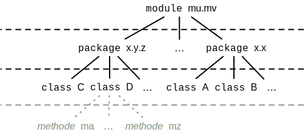

.. meta::
    :version: renaissance
    :lang: de
    :author: Michael Eichberg
    :keywords: "Programmierung", "Java", "Modularisierung", "Software Development"
    :description lang=de: Aufteilen von Java Code auf mehrere Dateien und Klassen
    :id: lecture-prog-java-modularisierung-101
    :first-slide: last-viewed
    :master-password: WirklichSchwierig!
    
.. include:: ../docutils.defs

Grundlegende Modularisierung von einfachen Java Programmen
===========================================================

:Dozent: `Prof. Dr. Michael Eichberg <https://delors.github.io/cv/folien.de.rst.html>`__
:Kontakt: michael.eichberg@dhbw.de, Raum 149B
:Version: 1.0.1

.. supplemental::

    :Folien: 
        
        |html-source| 

        |pdf-source|

    :Kontrollfragen:

        .. source:: kontrollfragen.de.rst 
            :path: relative
            :prefix: https://delors.github.io/
            :suffix: .html

    :Fehler melden:
        https://github.com/Delors/delors.github.io/issues

Modularisierung\ [#]_
-----------------------

.. definition:: 

    .. rubric:: Modul 

    .. epigraph::

        Ein Modul ist im Software Engineering ein Baustein eines Softwaresystems, der bei der Modularisierung entsteht, eine funktional geschlossene Einheit darstellt und einen bestimmten Dienst bereitstellt.

        -- wikipedia.org `Modul (Software) <https://de.wikipedia.org/wiki/Modul_(Software)>`__

.. [#] Java unterstützt neben Klassen und Packages seit Java 9 auch Module als primäres Sprachkonstrukt. In dieser Vorlesung werden wir uns jedoch auf die grundlegende Modularisierung mit Hilfe von Klassen und Packages von Java Programmen beschränken.

Ziele bei der Modularisierung von Code
----------------------------------------

.. class:: incremental-list 

:Wiederverwendbarkeit: Durch Modularisierung kann Code einfacher wiederverwendet werden.

:Wartbarkeit: Modularer Code, bei dem einzelne Module eine kohärente Funktionalität anbieten, sind einfacher zu verstehen und zu warten. Fehler lassen sich leichter finden und beheben.

:Erweiterbarkeit: Die Modularisierung von Code ermöglicht es, neue Funktionalitäten hinzuzufügen, ohne bestehenden Code zu verändern.

:Kollaborative Entwicklung: Durch eine Modularisierung ist es möglich effektiv mit mehreren Personen an einem Projekt zu arbeiten. Jede Person kann an einem Modul arbeiten, ohne die anderen Module zu beeinflussen.

.. supplemental::

    Im Prinzip haben wir bisher nur Methoden zur Strukturierung bzw. Modularisierung kennen gelernt.

Modularisierungsebenen in Java
-------------------------------

.. supplemental::

    Einzelnen Methoden erlauben zwar bereits eine Modularisierung des Codes, da diese aber für sich nicht wiederverwendbar sind (es ist nicht möglich eine Methode alleine in einer Datei zu speichern und in einem anderen Kontext zu nutzen), ist es notwendig, diese in Klassen zu organisieren. Klassen, welche in einzelnen Dateien gespeichert werden, erlauben dann eine Wiederverwendung des Codes. 

.. class:: new-subsection

Einführung in Java: Imports, Packages und Sichtbarkeiten
---------------------------------------------------------

Grundlegende Konzepte und Mechanismen zur Modularisierung von Java Programmen
--------------------------------------------------------------------------------

.. class:: incremental-list

:Klassen:
  
  Klassen sind die Bausteine von Java Programmen und alles - bis auf einfachste Programme - ist in Klassen organisiert.

:Packages:
  
  Packages sind Sammlungen von verwandten Klassen und Schnittstellen.

:`import`:java:\ s:

  Imports ermöglichen den Zugriff auf Klassen aus anderen Packages, ohne deren vollständigen Namen zu schreiben.

:Sichtbarkeiten:

  Sichtbarkeiten steuern den (erlaubten) Zugriff auf Klassen, Methoden und Variablen und helfen somit beim Verbergen von Implementierungsdetails.

.. supplemental::

    Im Folgenden werden wir nur ein kohärentes Subset der Modularisierungsmöglichkeiten von Java Programmen betrachten. Insbesondere werden wir uns auf die wesentlichen Eigenschaften der genannten Konzepte und Mechanismen beschränken:

Klassen in Java
----------------

.. deck:: 

    .. card:: 

        .. class:: incremental-list

        #. Klassen sind die grundlegenden Bausteine von Java Programmen.
        #. Eine Klasse wird mit dem Schlüsselwort `class` deklariert.
        #. Eine Klasse kann Felder (Variablen) und Methoden enthalten.
        #. Eine Klasse wird in einer Datei mit dem Namen der Klasse (+\ *.java*) gespeichert.

    .. card::

        .. warning::

            Die Hauptfunktion einer Klasse in Java ist es als Schablone für Objekte, die eine gemeinsame Struktur und Verhalten haben, zu dienen. Dies werden wir aber erst später in der Vorlesung besprechen. Für den Moment nutzen wir Klassen zur Strukturierung bzw. Modularisierung des Codes.

    .. card::

        Im einfachsten Fall sind die Klassen eines Java Programms alle im selben Verzeichnis gespeichert. 
        
        Dies erlaubt eine *direkte* Verwendung der Methoden der anderen Klassen durch Angabe des Klassennamens und des Methodennamens.  (Vergleichbar mit der Verwendung von :java:`Double.parseDouble` etc.)

    .. card::

        .. rubric:: Datei: *MyMath.java*

        .. code:: java
            :number-lines:
            :class: copy-to-clipboard

            class MyMath {
                static final int ANSWER_TO_EVERYTHING = 42; 
                static double fibonacci(int n) { ... }
                static double isPrim(int n) { ... }
            }

        .. rubric:: Datei: *Main.java*

        .. code:: java
            :number-lines:
            :class: copy-to-clipboard

            void main() {
                    println(MyMath.fibonacci(10));
            }

    .. card::

        :Syntax:
            
            .. code:: java
                :number-lines:
                
                class <KlassenName> { 
                    <Attribute (gel. auch Felder genannt)>* 
                    <Methoden>* 
                }

        - Der ``Klassenname`` muss ein gültiger Bezeichner sein und mit dem Dateinamen (+ .java) übereinstimmen. 
        
        - Klassennamen beginnen in Java - per Konvention - immer mit einem Großbuchstaben (:eng:`UpperCamelCase`).

Interfaces in Java
------------------- 

- Seit Java 8 (in Verbindung mit weiteren Ergänzungen in Java 9) können auch :java:`interface`\ s zum Organisieren von Code verwendet werden. 

- \

  .. container:: smaller

        Beispiel:      

        .. rubric:: Datei: *MyMath.java*

        .. code:: java
            :number-lines:
            :class: copy-to-clipboard

            interface MyMath {
                static final int ANSWER_TO_EVERYTHING = 42; 
                static double fibonacci(int n) { ... }
                static double isPrim(int n) { ... }
            }

        .. rubric:: Datei: *Main.java*

        .. code:: java
            :number-lines:
            :class: copy-to-clipboard

            void main() {
                println(MyMath.fibonacci(10));
            }

.. supplemental::

    Die Verwendung von Interfaces zu *reinen Strukturierungszwecken* ist jedoch unüblich. 
  
    Wir werden uns Interfaces in einer späteren Vorlesung genauer ansehen, wenn wir objekt-orientierte Programmierung in Java detaillierter besprechen.

Statische Methoden und statische Attribute von Klassen und Interfaces
-----------------------------------------------------------------------

- **Statische Methoden**  gehören zur Klasse/Interface als solches.
- **Statische Attribute** gehören zur Klasse/Interface als solches.

.. class:: incremental-list

:Syntax: 

    :java:`static <returnType> <methodName>(<parameters>) { <body> }`

    :java:`static final <type> <name> = <value>;`

.. container:: incremental

    Das Java Development Kit (JDK) enthält viele Klassen – z. B. :java:`java.lang.Math`, :java:`java.lang.System`, :java:`java.io.File`, :java:`java.io.IO`, :java:`java.util.Arrays` etc. – mit statischen Methoden - z. B. :java:`parseDouble(...)` – und Attributen.

.. hint::
    :class: incremental

    Wenn Sie das :java:`static` Schlüsselwort vergessen, dann haben Sie Instanzmethoden und Instanzattribute. Diese können Sie nur nutzen, nachdem Sie basierend auf der Klasse ein Objekt instantiiert haben.

.. class:: exercises

Übung
------

.. exercise:: Erste Refaktorisierung des Codes

    .. container::

        Nehmen Sie Ihren Code (Berechnung der Fibonacci-Zahlen, Fakultät und Kubikwurzel sowie den Primzahltest) und ordnen Sie diesen einer Klasse zu. Überlegen Sie sich diesbezüglich einen geeigneten Namen für die Klasse und speichern Sie die Klasse in einer entsprechenden Datei. In einer zweiten Datei (``Main.java``) schreiben Sie eine :java:`main`\ -Methode, die - basierenden auf Kommandozeilenparametern - die passenden Methoden der Klasse aufruft und die Ergebnisse auf der Konsole ausgibt. Die :java:`main` Methode soll dabei die grundlegende Fehlerbehandlung übernehmen, falls die Kommandozeilenargumente nicht passen. 

    .. example:: 

        .. code:: bash
            :number-lines:

            $ java --enable-preview Main.java cbrt 1000 isPrim 97 fibonacci 30 ack 1
            1000.0^⅓ = 10.0
            isPrim(97) = true
            fiboncci(30) = 832040
            [error] Ungültige Funktion: ack

    .. solution::
        :pwd: code/Mathe.java    

        Hier: Functions.java

        .. include:: code/classes/Functions.java
            :code: java
            :number-lines: 
            

        Main.java

        .. include:: code/classes/Main.java
            :code: java
            :number-lines: 
            

Java Packages
--------------

- **Packages** sind Sammlungen von **verwandten Klassen** und **Schnittstellen**.
- Sie helfen, Code in **logische Gruppen** zu organisieren und **Namenskonflikte** zu vermeiden.
- Vergleichbar mit **Ordnern** für Dateien in einem Dateisystem.

:Syntax & Semantik: 

    :java:`package <packageName>;`

    - Die Packagedeklaration steht am Anfang einer Java-Datei. 
    
    - Per Konvention erfolgt die Benennung in umgekehrter Domain-Reihenfolge.

    - Der Packagename muss die Verzeichnisstruktur widerspiegeln.
    
.. container:: 

    .. example::

        .. code:: java
            :number-lines:

            package de.dhbw.mannheim.vl.programmierung;

        .. code:: java
            :class: fade-out
            :number-lines: 2

            class Klasse { ... }
        

Imports in Java
----------------

.. deck::

    .. card:: 

        :`import`:java:\ s: 
            ermöglichen den Zugriff auf Klassen aus anderen Packages, ohne deren vollständigen Namen zu schreiben.

            :Syntax: :java:`import <packageName>.<className>;`

            - Erleichtert das Lesen und Schreiben des Codes, da der vollständige Klassenname nicht jedes Mal geschrieben werden muss.

            - Das Package :java:`java.lang` wird immer automatisch importiert (enthält u. a. die Klassen :java:`String`, :java:`Math`, etc.)

            Java unterstützt auch ein Wildcard-Import, z. B. :java:`import java.util.*;`. Dies sollte jedoch in nicht-trivialem Code vermieden werden, da es zu Konflikten führen kann.

    .. card::

        :`import static`:java:: ermöglicht den Import von statischen Methoden und Attributen. Danach kann ohne Angabe des Klassennamens auf die Methode bzw. das Attribut zugegriffen werden.

        :Syntax: 
            :java:`import static <packageName>.<className>.<methodName>;`

            :java:`import static <packageName>.<className>.<attribute>;`

    .. card::

        :`import module`:java:: (Seit Java 23) ermöglicht den Import aller Klassen eine Moduls.

        :Syntax: 
            :java:`import modul <moduleName>;`

Beispiele für Imports
----------------------

.. deck:: 

    .. card:: 

        Spezifischer Import einer Klasse:

        .. code:: java
            :number-lines: 

            import java.math.BigDecimal;

        .. code:: java
            :number-lines: 2
            :class: fade-out

            ... {
                var one = BigDecimal.ONE;
            }

    .. card::

        Import aller Klassen (und Interfaces) des Packages:

        .. code:: java
            :number-lines:

            import java.math.*;

        .. code:: java
            :class: fade-out
            :number-lines: 2

            ... {
                var one = BigDecimal.ONE;
            }

    .. card::
                
        Import einer Klassenmethode (statisch):

        .. code:: java
            :number-lines:

            import static java.lang.Math.sqrt;

        .. code:: java
            :number-lines: 2
            :class: fade-out

            ... {
                var x = sqrt(2);
            }

    .. card::

        Import eines Klassenattributs (statisch): 
        
        .. code:: java
            :number-lines:
        
            import static java.lang.System.out;

        .. code:: java
            :class: fade-out
            :number-lines: 2

            ... {
                out.println("Hello World!");    
            }

    .. card::

        Import eines Java Modules (ab Java 23):

        .. code:: java
            :number-lines:  

            import module java.base;

        .. code:: java
            :class: fade-out
            :number-lines: 2

            ... {
                IO.println(BigDecimal.ONE);    
            }

    .. card::

        .. rubric:: Hinweis
    
        Ein Java-Skript importiert immer implizit:

        .. code:: java
            :number-lines:

            import module java.base;
            import static java.io.IO.*;

        Wenn Sie in der JShell also auch :java:`println` und :java:`readln` direkt verwenden wollen, dann müssen Sie lediglich :java:`import static java.io.IO.*;` hinzufügen.

Sichtbarkeiten (Access Modifiers)
----------------------------------

Um festzulegen, wer auf Klassen, Methoden und Variablen zugreifen kann, verwendet Java **Sichtbarkeiten** (Access Modifiers). Dies ist ein Konzept aus dem Bereich *Programming-in-the-Large*. Für kleinere Projekte, bei denen alle Klassen im selben Package sind, ist dies nicht relevant.

Die vier Sichtbarkeiten in Java sind:

.. class:: incremental-list

1. :java:`public`: Zugriff von überall
2. :java:`protected`: Zugriff innerhalb des gleichen Packages und von Subklassen
3. *<default> (package-private)*: Zugriff nur innerhalb des gleichen Packages
4. :java:`private`: Zugriff nur innerhalb der gleichen Klasse

Sichtbarkeiten und deren Verwendung
------------------------------------

.. deck::

    .. card::
        
        .. rubric:: Abstraktes Beispiel:

        .. code:: java
            :number-lines:
                
            public class PublicClass {
                public int publicVar;        // Zugriff von überall
                protected int protectedVar;  // Zugriff innerhalb des Packages und Subklassen
                int defaultVar;              // Zugriff nur im selben Package
                private int privateVar;      // Zugriff nur innerhalb dieser Klasse
            }

    .. card::
        
        .. rubric:: Konkretes Beispiel:

        .. code:: java
            :number-lines:
                
            public class MyMath {
                public static int THE_ANSWER = 42;        
                private static double cbrt(double x,double guess, int steps) { ... }
                public static double cbrt(double x) { cbrt(x,1.0,1); }
            }

        .. code:: java
            :class: incremental
            :number-lines:

            public interface MyMath {
                static int THE_ANSWER = 42;        
                private static double cbrt(double x,double guess, int steps) { ... }
                static double cbrt(double x) { cbrt(x,1.0,1); }
            }

        .. container:: incremental smaller margin-top-1em padding-0_5em box-shadow rounded-corners

            Java interfaces kennen nur die Sichtbarkeiten :java:`public` und :java:`private`. Wenn keine Sichtbarkeit angegeben wird, ist die Methode bzw. das Attribut implizit :java:`public`.

    .. card::
      
        .. rubric:: Anwendung in der Praxis

        - :java:`public`: Offene API, z. B. für Libraries.
        - :java:`private`: dient der Kapselung z. B. interne Hilfsmethoden und interner Zustand.
        - :java:`protected`: Ermöglicht Vererbung und Zugriff für verwandte Klassen.
        - ``<default bzw. keine explizite Angabe>``: Für interne Logik innerhalb eines Packages.

Beispiel für die konkrete Anwendung
-------------------------------------

.. rubric::  Verzeichnis mit der fachlichen Logik für mathematische Funktionen:

.. code:: java

    package de.dhbw.mannheim.calculator.math;

    public class Functions {
        public static double cbrt(double x) { ... }
    }

.. rubric:: Code mit der Logik für die Interaktion mit dem Benutzer:

.. code:: java

    package de.dhbw.mannheim.calculator;

    import de.dhbw.mannheim.calculator.math.Functions;

    public class Main {
        public static void main(String[] args) {
            Functions.cbrt(Double.parseDouble(args[0]));
        }
    }

Best Practices für Packages und Sichtbarkeiten
-------------------------------------------------

- Organisiere Klassen logisch in Packages.
- Die beiden bei weitem häufigsten Sichtbarkeiten sind `public` und `private`.
- Nutze `public` nur bei notwendigen Klassen und Methoden.
- Halte Klassenvariablen **privat**, um Daten zu kapseln.
- Methoden, die nur innerhalb einer Klasse verwendet werden, sollten **private** sein.
- Vermeide übermäßige Imports (`import java.util.*;` kann zu Konflikten führen).

Zusammenfassung
----------------

- **Packages** gruppieren verwandte Klassen und vermeiden Namenskonflikte.
- **Imports** erlauben das Verwenden von Klassen aus anderen Packages.
- **Sichtbarkeiten** steuern den Zugriff und helfen beim Schutz der Daten.

.. class:: exercises

Übung
------

.. exercise:: Modularisierung der Codebasis

    Verschieben Sie Ihre Klasse mit den mathematischen Funktionen in das package ``math``. Die Datei mit der :java:`main` Methode bleibt an ihrem Platz. Fügen Sie ggf. ein import Statement hinzu.

    Wie müssen Sie Ihren Code ändern, wenn Sie innerhalb der Datei ``Main.java`` direkt auf die Methoden zugreifen wollen ohne jedes mal den Klassennamen voranstellen zu müssen?

    .. solution:: 
        :pwd: math/Funktion.java

        .. rubric:: math/Functions.java

        .. include:: code/imports/math/Functions.java
            :code: java
            :number-lines: 

        .. rubric:: Main.java

        .. include:: code/imports/Main.java
            :code: java
            :number-lines: 

        .. rubric:: MainMitStaticImports.java

        .. include:: code/imports/MainMitStaticImports.java
            :code: java
            :number-lines: 