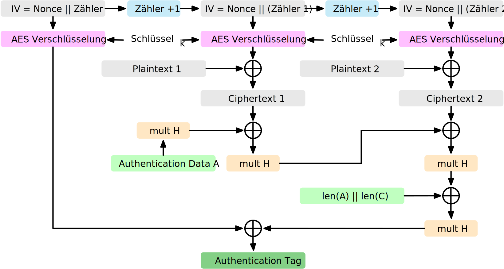

.. meta::
    :author: Michael Eichberg
    :keywords: "Authentifizierte Verschlüsselung", AES-GCM
    :description lang=en: Authenticated Encryption
    :description lang=de: Authentifizierte Verschlüsselung
    :id: lecture-security-authentifizierte-verschlüsselung
    :first-slide: last-viewed
    :master-password: WirklichSchwierig!

.. include:: ../docutils.defs

Authentifizierte Verschlüsselung
===============================================

:Dozent: `Prof. Dr. Michael Eichberg <https://delors.github.io/cv/folien.de.rst.html>`__
:Kontakt: michael.eichberg@dhbw.de
:Version: 0.1.5

.. class:: sources

:Quelle: *Cryptography and Network Security - Principles and Practice, 8th Edition, William Stallings*

.. supplemental::

  :Folien:
      :HTML: |html-source|

      :PDF: |pdf-source|
  :Fehler melden:
      https://github.com/Delors/delors.github.io/issues

.. class:: s-vertical-title

Drei Ansätze in Hinblick auf *Authenticated Encryption*
--------------------------------------------------------

.. grid:: width-100

    .. cell:: width-50

        .. compound::

            **Encrypt-then-MAC**

            .. image:: drawings/authentifizierte-verschluesselung/encrypt_then_mac.svg

        .. compound::
            :class: incremental

            **Encrypt-and-MAC**

            .. image:: drawings/authentifizierte-verschluesselung/encrypt_and_mac.svg

    .. cell:: width-50 incremental fade-out

        :obsolete:`MAC-then-Encrypt`

        .. image:: drawings/authentifizierte-verschluesselung/mac_then_encrypt.svg

.. supplemental::

    .. rubric:: Modi

    - **Encrypt-then-MAC**: Der Klartext wird verschlüsselt und dann wird ein MAC über den Chiffretext berechnet. Dieser Ansatz wird von IPSec und TLS 1.3 verwendet.
    - **Encrypt-and-MAC**: Der Klartext wird verschlüsselt und ein MAC über den Klartext berechnet. Beides wird versendet. Dieser Ansatz wird von SSH verwendet. Es wurde gezeigt, dass kleinere Änderungen die Sicherheit weiter verbessern können.
    - **MAC-then-Encrypt**: Ein MAC wird über den Klartext berechnet und dann wird der Klartext und der MAC verschlüsselt. Dies war bis TLS 1.2 der Standard. Aufgrund von erfolgreichen Angriffen - insbesondere gegen das Padding bei Verwendung des CBC Modus (siehe `Padding-Oracle Attacks <https://en.wikipedia.org/wiki/Padding_oracle_attack>`__) - wird dieser Ansatz nicht mehr verwendet.

    Das grundlegende Problem entsteht dann, wenn der Angreifer bei einer Manipulation der Nachricht (am Ende) nicht nur eine generische Fehlermeldung erhält (Decryption failed) sondern ggf. die Information, dass ein Padding-Fehler vorliegt. Er kann diese Information nutzen, um  schrittweise eine Entschlüsselung vorzunehmen. Alternativ können ggf. Timing-Unterschiede im Verhalten verwendet werden.

    .. rubric:: Integrität und Authentizität

    Es ist möglich Integrität ohne Authentizität zu gewährleisten. Durch einen einfachen Hash kann gewährleistet werden, dass die Daten während der Übertragung nicht verändert wurden (insbesondere durch einen Fehler). Wenn ich jedoch Authentizität gewährleisten möchte, dann muss ich einen MAC verwenden, der auf einem Schlüssel basiert, der nur dem Sender und dem Empfänger bekannt ist. Dies verhindert, dass ein Angreifer einfach die Daten verändert und den MAC neu berechnet.

    Authentizität ohne Integrität ist nicht sinnvoll. Der Nutzen zu wissen, dass eine Nachricht von einer bestimmten Person kam, aber nicht zu wissen, ob die Nachricht verändert wurde, ist sehr gering.

.. class:: s-vertical-title

AES-GCM Modus (Galois/Counter Mode)
-----------------------------------------

    Authenticated Encryption with Additional Data (AEAD)

.. supplemental::

    - Standardisiert durch NIST in SP 800-38D.

    - Es handelt sich um eine Verknüpfung des CTR-Modus und des Galois-Modus. Ziel ist eine hohe Parallelisierung und Effizienz.
    - Der Algorithmus ist in der Lage, Authentizität (+ Integrität) und Vertraulichkeit zu gewährleisten.
    - Die Eingabe in den Algorithmus ist der Klartext (:eng:`Plaintext`), der Schlüssel, ein Initialisierungsvektor (IV) und zusätzliche (optionale) authentifizierte Daten A.
    - Das Authentication Tag wird mittels Arithmetik über dem Körper :math:`GF(2^{128})` berechnet und wird am Ende des Chiffretextes angehängt. Es wird das bekannte Polynom: :math:`x^{128} + x^7 + x^2 + x + 1` verwendet.
    - Die Blockgröße ist 128Bit (d. h. die AES-Blockgröße).
    - :math-i:`H` ist der Hash Key:  :math:`H = E(K,0^{128})` (wobei :math-i:`E` die AES-Verschlüsselung ist).
    - :math-i:`mult` ist Multiplikation im Körper :math:`GF(2^{128})`.
    - Die optionalen authentifizierten Daten A werden zum Beispiel benötigt, um den Kontext einer Nachricht zu erfassen (und zum Beispiel Replay-Attacken vorzubeugen). Ein konkretes Beispiel könnte die Ziel-IP-Adresse sein, wenn die Nachricht über das Internet übertragen wird.

    .. hint::

        Die Visualisierung stellt nur zwei Schritte dar; eine Erweiterung auf n-Blöcke ist jedoch offensichtlich.

.. class:: exercises transition-scale

Übung
---------------------

.. exercise:: AES-GCM

    Warum ist es wichtig, dass der IV bei AES-GCM nur einmal verwendet wird?

    .. solution::
        :pwd: ASE-GCM->StreamCipher

        Bei AES-GCM handelt es sich effektiv um eine Stromchiffre. Als solche ist es wichtig, dass der IV nur einmal verwendet wird, da sonst die Sicherheit des Verfahrens beeinträchtigt wird.
