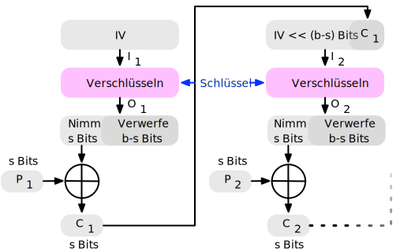
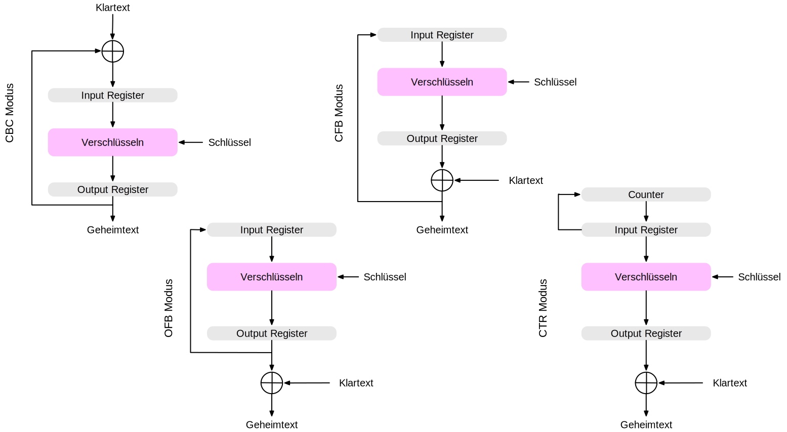
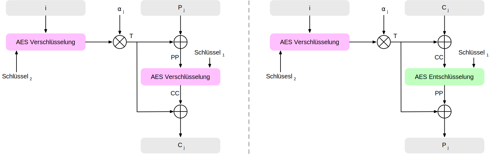

.. meta::
    :author: Michael Eichberg
    :keywords: Blockchiffren, Operationsmodi, ECB, CBC, CFB, OFB, CTR, XTS-AES
    :description lang=en: Block Cipher Operations
    :description lang=de: Betriebsmodi bei Blockchiffren
    :id: vorlesung-it-security-blockchiffre-operationsmodi
    :first-slide: last-viewed
    :master-password: WirklichSchwierig!

.. include:: ../docutils.defs

.. |Kontrollfragen| source:: kontrollfragen.de.rst
    :path: relative
    :prefix: https://delors.github.io/
    :suffix: .html

Betriebsmodi bei Blockchiffren
===============================================

:Dozent: `Prof. Dr. Michael Eichberg <https://delors.github.io/cv/folien.de.rst.html>`__
:Kontakt: michael.eichberg@dhbw.de
:Version: 1.3.2
:Basierend auf: *Cryptography and Network Security - Principles and Practice, 8th Edition, William Stallings*

.. supplemental::

    :Folien:

        .. class:: dd-margin-left-3em

        :HTML: |html-source|

        :PDF: |pdf-source|

    :Kontrollfragen:

        |Kontrollfragen|

    :Fehler melden:
        https://github.com/Delors/delors.github.io/issues

Betriebsmodi
--------------------

- Eine Technik zur Verbesserung der Wirkung eines kryptografischen Algorithmus oder zur Anpassung des Algorithmus an ein Anwendungsszenario. Insbesondere in Abhängigkeit von der Länge des Klartexts.

.. class:: incremental

- Um eine Blockchiffre in einer Vielzahl von Anwendungen einsetzen zu können, hat das NIST fünf Betriebsmodi definiert.

  - Die fünf Modi decken eine breite Palette von Verschlüsselungsanwendungen ab, für die eine Blockchiffre verwendet werden kann.
  - Diese Modi sind für die Verwendung mit jeder symmetrischen Blockchiffre vorgesehen, einschließlich 3DES und AES.

Betriebsmodi - Übersicht
------------------------------

.. story::

    .. csv-table::
        :class: highlight-row-on-hover incremental-table-rows sticky-header
        :width: 100%
        :widths: 20 40 40
        :header: Modus, Beschreibung, Typische Anwendung

        **Electronic Codebook (ECB)**, Jeder Block von Klartextbits wird unabhängig voneinander mit demselben Schlüssel verschlüsselt., "
        • Sichere Übertragung einzelner Werte (z. B. eines Verschlüsselungsschlüssels)
        "
        **Cipher Block Chaining (CBC)**, Die Eingabe für den Verschlüsselungsalgorithmus ist die XOR-Verknüpfung des nächsten Klartextblocks mit dem vorangegangenen Chiffretextblock., "
        - Universelle blockorientierte Übertragung
        - Authentifizierung
        "
        **Cipher Feedback (CFB)**, "Die Eingabe wird *Bit für Bit* verarbeitet.
        Der vorhergehende Chiffretext wird als Eingabe für den Verschlüsselungsalgorithmus verwendet, um eine pseudozufällige Ausgabe zu erzeugen, die mit dem Klartext XOR-verknüpft wird, um die nächste Einheit des Chiffretextes zu erzeugen.", "
        - Allgemeine stromorientierte Übertragung
        - Authentifizierung
        "
        **Output Feedback (OFB)**, "Ähnlich wie CFB, mit dem Unterschied, dass die Eingabe für den Verschlüsselungsalgorithmus die vorangegangene Verschlüsselungsausgabe ist, und volle Blöcke verwendet werden.", "
        • Stromorientierte Übertragung über verrauschte Kanäle (z. B. Satellitenkommunikation)
        "
        "**Counter (CTR**)", "Jeder Klartextblock wird mit einem verschlüsselten Zähler XOR-verknüpft. Der Zähler wird für jeden nachfolgenden Block erhöht.", "
        - Blockorientierte Übertragung für allgemeine Zwecke
        - Nützlich für Hochgeschwindigkeitsanforderungen
        "

.. class:: new-section transition-fade

Grundlegende Blockchiffren
--------------------------------

Electronic Codebook\ [#]_
--------------------------

.. [#] Bilder von: `White Timberwolf <https://commons.wikimedia.org/wiki/User:WhiteTimberwolf>`__

Padding-Modi in Blockchiffren
-------------------------------------

.. story::

    .. remark::

        Bei Blockchiffren (z. B. AES mit 128 Bit = 16 Byte Blockgröße) muss die zu verschlüsselnde Nachricht eine exakte Vielfache der Blockgröße sein. Ist das nicht der Fall, wird Padding verwendet, um die Nachricht auf ein vielfaches der Blockgröße zu bringen.

    .. rubric:: Ausgewählte Modi

    .. class:: incremental-list

    - PKCS#7

      Füllt den restlichen Block mit Bytes, deren Wert gleich der Anzahl hinzugefügter Bytes ist.

      .. example::

        - Nachricht mit 13 Byte → 3 Bytes Padding → ``03 03 03``
        - Nachricht mit Blocklänge (z. B. 16 Byte) → ein kompletter zusätzlicher Block mit 16 × ``0x10``

    - ANSI X.923

      Auffüllen mit ``0x00``, außer dem letzten Byte, das die Anzahl Padding-Bytes angibt.

    - ISO/IEC 7816-4

      Beginnt mit ``0x80``, gefolgt von Nullen.

    - Zero Padding

      .. attention::

        Füllt mit Nullen (``0x00``). Funktioniert **nur**, wenn die Nachricht nie mit `0x00` endet, sonst ist Entschlüsselung mehrdeutig!

    .. compound::
        :class: incremental

        .. rubric:: Verhalten bei voller Blockgröße - Zusammenfassung

        Angenommen, die Nachricht ist exakt 16 Byte lang (z. B. `"1234567890ABCDEF"`), so ergibt sich:

        =================  ======================================================
        **Padding-Modus**   **Erweiterte Nachricht (hex)**
        PKCS#7              `... 10 10 10 10 10 10 10 10 10 10 10 10 10 10 10 10`
        ANSI X.923          `... 00 00 00 00 00 00 00 00 00 00 00 00 00 00 00 10`
        ISO/IEC 7816-4      `... 80 00 00 00 00 00 00 00 00 00 00 00 00 00 00 00`
        Zero Padding        `... 00 00 00 00 00 00 00 00 00 00 00 00 00 00 00 00`
        =================  ======================================================

        Hinweis: Bei allen Modi wird bei Nachrichten mit dem x-fachen der Blocklänge ein **zusätzlicher** Padding-Block hinzugefügt, um bei der Entschlüsselung korrekt erkennen zu können, ob Padding entfernt werden muss.

Probleme bei der Verwendung der Verschlüsselung im ECB-Modus
----------------------------------------------------------------

.. deck::

    .. card::

        .. grid::

            .. cell:: width-30

                *ECB-Tux* - der Linux-Pinguin verschlüsselt im ECB-Modus:

                Quelle: https://github.com/robertdavidgraham/ecb-penguin

            .. cell:: width-70

                .. image:: opensource-drawings/tux.ecb.from_robert_david_graham.webp
                    :height: 800
                    :align: center

    .. card::

        Kriterien und Eigenschaften für die Bewertung und Konstruktion von Blockchiffre-Betriebsarten, die ECB überlegen sind.

        - Overhead
        - Fehlerbehebung
        - Fehlerfortpflanzung
        - Streuung
        - Sicherheit

Cipher Block Chaining\ [#]_
-----------------------------

.. [#] Bilder von: `White Timberwolf <https://commons.wikimedia.org/wiki/User:WhiteTimberwolf>`__

.. class:: new-section transition-fade

Blockchiffren, die als Stromchiffren verwendet werden können.
---------------------------------------------------------------

Konvertierung von Blockchiffren in Stromchiffre
------------------------------------------------

.. hint::
    :class: float-right width-40 incremental

    Es gibt drei Modi, die es ermöglichen, eine Blockchiffre in eine zeichenorientierte Stromchiffre umzuwandeln:

    - Cipher Feedback Mode (CFB)
    - Output Feedback Mode (OFB)
    - Counter Mode (CTR)

    D. h., es ist kein Auffüllen (:eng:`Padding`) erforderlich, wenn die Nachricht nicht ein Vielfaches der Blockgröße ist.

Bei AES, DES oder jeder anderen Blockchiffre erfolgt die Verschlüsselung immer Block-für-Block mit Blockgrößen von b Bits:

- Im Fall von (3)DES: :math:`b=64`
- Im Fall von AES: :math:`b=128`

*Cipher Feedback Mode*\ [#]_
------------------------------

.. [#] Bilder von: `White Timberwolf <https://commons.wikimedia.org/wiki/User:WhiteTimberwolf>`__

*Cipher Feedback Mode* als Stromchiffre
--------------------------------------------

*Output Feedback Mode*
------------------------

.. [#] Bilder von: `White Timberwolf <https://commons.wikimedia.org/wiki/User:WhiteTimberwolf>`__

.. When used as a Stream Cipher we can simply discard the last bytes of the encrypted block cipher.

*Counter Mode*
-----------------

.. image:: opensource-drawings/ctr_decryption.svg
    :align: center
    :class: incremental

.. [#] Bilder von: `White Timberwolf <https://commons.wikimedia.org/wiki/User:WhiteTimberwolf>`__

*Counter Mode* - Vorteile
-------------------------

.. class:: incremental-list

:Hardware-Effizienz: kann von der Parallelisierung der Hardware profitieren
:Software-Effizienz: leicht parallelisierbar in Software
:Vorverarbeitung: die Verschlüsselung der Zähler
:Zufälliger Zugriff: der i-te Block des Klartextes/des Chiffretextes kann im Zufallszugriff verarbeitet werden
:Nachweisbare Sicherheit: genauso sicher wie die anderen Verfahren
:Einfachheit: es wird nur der Verschlüsselungsalgorithmus benötigt

Rückkopplungseigenschaften\ [#]_  der Betriebsmodi
-------------------------------------------------------------------------------

.. [#] (:eng:`Feedback Characteristics`)

.. class:: new-section transition-fade

Spezielle Betriebsmodi
--------------------------------

XTS-AES Modus für block-orientierte Speichergeräte
---------------------------------------------------

2010 vom NIST als zusätzlicher Blockchiffre-Betriebsmodus genehmigt.

Modus ist auch ein IEEE-Standard, IEEE Std 1619-2007

.. admonition:: Frage
    :class: note

    Welche potenziellen Bedrohungen sind relevant?

    .. many similar blocks
    .. data is freely accessible

- Die Norm beschreibt eine Verschlüsselungsmethode für Daten, die in sektor-basierten Geräten gespeichert sind, wobei das Bedrohungsmodell einen möglichen Zugriff des Gegners auf die gespeicherten Daten beinhaltet.

- Hat breite Unterstützung der Industrie erhalten.

*Tweakable* Blockchiffren - Bestandteile
-----------------------------------------------

- Der XTS-AES-Modus basiert auf dem Konzept einer veränderbaren (:eng:`tweakable`) Blockchiffre.
- Um den Chiffriertext zu berechnen, wird benötigt:

  - **Klartext**
  - **Symmetrischer Schlüssel**
  - **Tweak**

- Der *Tweak* muss nicht geheim gehalten werden; der Zweck ist, Variabilität zu bieten.

.. supplemental::

    Ein Tweak ist insbesondere bei der Verschlüsselung von Daten auf Speichergeräten wichtig, da der gleiche Klartext an verschiedenen Stellen in verschiedene Chiffretexte verschlüsselt wird, aber immer in denselben Chiffretext, wenn er wieder an dieselbe Stelle geschrieben wird. Ein Tweak ist ein Modifikator, der für die unterschiedliche Verarbeitung gleicher Daten sorgt.

*Tweakable* Blockchiffren - grundlegende Struktur
-----------------------------------------------------

.. deck::

    .. card::

        .. image:: drawings/operationsmodi/tweakable_block_cipher-encryption.svg
            :align: center

    .. card:: overlay

        .. image:: drawings/operationsmodi/tweakable_block_cipher-decryption.svg
            :align: center

Anforderungen an die Speicherverschlüsselung
-----------------------------------------------

Die Anforderungen an die Verschlüsselung gespeicherter Daten, die auch als *data at rest* bezeichnet werden, unterscheiden sich von denen für übertragene Daten.

Die IEEE Norm P1619 wurde in Hinblick auf folgende Eigenschaften entwickelt:

.. class:: incremental-list

- Der Chiffretext ist für einen Angreifer frei verfügbar.
- Das Datenlayout wird auf dem Speichermedium und beim Transport nicht verändert.
- Der Zugriff auf die Daten erfolgt in Blöcken fester Größe und unabhängig voneinander.
- Die Verschlüsselung erfolgt in 16-Byte-Blöcken, die unabhängig voneinander sind.
- Es werden keine weiteren Metadaten verwendet, außer der Position der Datenblöcke innerhalb des gesamten Datensatzes.
- Derselbe Klartext wird an verschiedenen Stellen in verschiedene Chiffretexte verschlüsselt, aber immer in denselben Chiffretext, wenn er wieder an dieselbe Stelle geschrieben wird.
- Ein standardkonformes Gerät kann für die Entschlüsselung von Daten konstruiert werden, die von einem anderen standardkonformen Gerät verschlüsselt wurden.

XTS-AES Operation auf einem Block
------------------------------------

.. supplemental::

    .. hint::

        Dargestellt ist der Fall, dass alle zu verschlüsselnden (Klartext-)Blöcke eine Größe von 128 Bit haben. Sollt der letzte Block nicht eine Größe von 128 Bit haben, dann kommt "Cipher Text Stealing" zum Einsatz.

    - Schlüssel: es gilt: :math:`Schlüssel = Schlüssel_1\, ||\, Schlüssel_2`
    - P\ :sub:`j`: Der j-te Block des Klartexts. Alle Blöcke haben eine Länge von 128 bits. Eine (Klartext)dateneinheit – in der Regel ein Festplattensektor – besteht aus einer Folge von Klartextblöcken.
    - C\ :sub:`j`: Der j-te Block des Chiffretextes.
    - j: Die fortlaufende Nummer des 128-Bit-Blocks innerhalb der Dateneinheit.
    - i: Der Wert des 128-Bit-Tweaks.
    - ⍺: Ein primitives Element des GF(2¹²⁸) welches dem Polynom :math:`x` (d. h. 0000...0010\ :sub:`b`) entspricht.
    - ⍺\ :sup:`j`: ⍺ j mal mit sich selbst multipliziert im Körper GF(2¹²⁸)
    - :math:`\oplus` Bitwise XOR
    - :math:`\otimes` Modulare Multiplikation mit Binärkoeffizienten modulo :math:`x^{128}+x^7+x^2+x+1`.

.. class:: exercises transition-scale

Übung
---------------------

.. exercise:: Der Initialisierungsvektor (IV) bei CBC

    Warum ist es bei CBC wichtig, den Initialisierungsvektor (IV) zu schützen?

    .. solution::
        :pwd: IV und CBC

        Wenn der IV im Klartext gesendet wird, können wir in bestimmten Szenarien einige Bits des Klartextes (des ersten Blocks) im Rahmen einer MITM Attacke umdrehen, wenn wir den IV ändern (`Bit Flipping Attack <https://en.wikipedia.org/wiki/Bit-flipping_attack>`__). D. h. wir fangen die Nachricht ab, ändern den IV und senden die Nachricht weiter. Wenn der Empfänger die Nachricht entschlüsselt, dann ist der erste Block des Klartextes gezielt verändert. Wenn man Kenntnisse über den Aufbau/Inhalt des ersten Blocks hat, dann kann dies dazu führen, dass man die Daten gezielt verändert. An dieser Stelle ist es deswegen notwendig den IV Integritätsgeschützt zu übertragen.

.. exercise:: Padding

    In welchen Betriebsarten ist eine Auffüllung (:eng:`Padding`) notwendig?

    .. solution::
        :pwd: ECBC

        ECB und CBC (die Eingabe für die Verschlüsselung ist ein vollständiger Klartextblock).

.. exercise:: Auswirkungen eines Bitflips

     Was geschieht im Falle eines Übertragungsfehlers (einzelner Bitflip im Chiffretext) bei ECB, CBC, CFB, OFB, CTR?

     .. solution::
        :pwd: bitFlip

        :ECB: ein Block ist betroffen (im Falle von DES und AES ca. 50% der Bits).
        :CBC: im nächsten Block haben wir ein gespiegeltes Bit im Klartext und ca. 50% im aktuellen Block.
        :CFB: Das umgedrehte Bit beeinflusst das entsprechende Klartextbit und alle nachfolgenden Bits mit einer Wahrscheinlichkeit von ca. 50%, solange das umgedrehte Bit als Eingabe für die Verschlüsselung verwendet wird.
        :OFB, CTR: Im Klartext wird ein Bit umgedreht.

.. exercise:: Nonce bei OFB

     Warum muss der IV bei OFB eine Nonce sein?

     .. solution::
        :pwd: nOnce

        Die Werte, die zum Verschlüsseln der Plaintexte verwendete werden, hängen nur vom Schlüssel und dem Initialisierungsvektor ab. Wenn der IV/die Nonce mit demselben Schlüssel wiederverwendet wird und wir zufällig einen bestimmten Klartext kennen, können wir möglicherweise einen entsprechenden Chiffretext in einer anderen Nachricht entschlüsseln.

.. supplemental::

    Eine Nonce (:eng:`Number used ONCE`) ist eine Zahl, die nur einmal für die Ausführung des Verschlüsselungsalgorithmus verwendet wird.

.. class:: exercises transition-scale

Übung
---------------------

.. exercise:: CTR Mode - Anforderungen and den IV?

    Wenn beim Counter Mode garantiert ist, dass der Schlüssel niemals wiederverwendet wird (zum Beispiel, weil er ein Session Key ist), kann dann für die Nonce *in diesem speziellen Fall* auch eine Konstante verwendet werden?

    .. solution::
        :pwd: Ja-SoIst$es#

        Ja - das ist möglich; aber nicht empfehlenswert, da dies zusätzliche Sicherheit bringt, wenn doch mal ein Schlüssel wiederverwendet werden sollte.

        **Generell gilt, dass eine konstante Nonce auf keinen Fall zu verwenden ist, da dann zukünftige Nachrichten mit derselben Bitreihenfolge verschlüsselt werden würden und dies würde eine Reihe von Attacken ermöglichen!**

        Beispielweise könnte der Angreifer folgende Berechnung durchführen:

        :math-i:`P2 = (C1 ⊕ C2) ⊕ P1`

        und somit den anderen Plaintext berechnen. Dies ist immer dann gefährlich, wenn man einen Plaintext haben sollte oder zumindest vorhersehen kann, wie dies zum Beispiel bei Protokollen der Fall ist!

        Sollte der Angreifer in der Lage sein eine Choosen-Plaintext Attacke durchzuführen, dann kann er ggf. eine Nachricht so erstellen, dass der Schlüsselstrom abgeleitet werden kann. Dies würde dann die Entschlüsselung aller Nachrichten erlauben, die das selbe Paar bestehend aus Schlüssel und Nonce verwenden habent.

.. exercise:: ECB identifizieren

     Sie möchten feststellen, ob ein Programm zur Verschlüsselung von Dateien den ECB-Modus verwendet. Was müssen Sie tun?

     .. solution::
        :pwd: ecb_Erkennung

        Verwenden Sie ein Dokument, das aus mehreren Blöcken besteht, wobei jeder Block die Größe der zugrunde liegenden Chiffre hat und jeder Block den gleichen Inhalt hat. Bei Verwendung des ECB-Modus werden alle Blöcke auf die gleiche Weise verschlüsselt.

.. exercise:: XTS-AES

    Wie viele Blöcke hat eine Dateneinheit, wenn ein Festplattensektor 4 KiB groß ist?

    Welchen praktischen Vorteil hat es, das der Hash T vor und nach der Verschlüsselung des Klartextes mit dem aktuellen Wert XOR-verknüpft wird?

    .. solution::
        :pwd: XTS#AES

        Wenn ein Festplattensektor 4 KiB groß ist und ein Block eine Größe von 128 Bit (16 Byte) hat, dann gilt, dass ein Sektor 4096/16 = 256 Blöcke hat.

        Dadurch kann derselbe Algorithmus für die Verschlüsselung und die Entschlüsselung verwendet werden.

.. class:: exercises

Übung
---------------------

.. story::

    .. exercise:: OFB-Modus

        Verwenden Sie den OFB-Modus in Kombination mit einer Caesar-Chiffre, bei der die *Blockgröße* ein Zeichen sei.

        Der Schlüssel ist die Anzahl der Zeichen, um die Sie ein Zeichen verschieben wollen - wie zuvor. Der IV ist ein Zeichen. Damit Sie ein XOR durchführen können, ordnen wir jedem Zeichen einen Wert zu und erweitern das Alphabet um die Ziffern 1 bis 3, "!", "?" und das "_". Auf diese Weise ist es immer möglich, ein sinnvolles Zeichen auszugeben.

        .. compound::
            :class: incremental

            Daraus ergibt sich die folgende Kodierung:

            .. grid::

                .. cell:: width-30

                    .. csv-table::
                        :header: Idx., Zeichen, Binär

                        0, A, 00000
                        1, B, 00001
                        2, C, 00010
                        3, D, 00011
                        4, E, 00100
                        5, F, 00101
                        6, G, 00110
                        7, H, 00111
                        8, I, 01000
                        9, J, 01001
                        10, K, 01010

                .. cell:: width-30

                    .. csv-table::
                        :header: Idx., Zeichen, Binär

                        11, L, 01011
                        12, M, 01100
                        13, N, 01101
                        14, O, 01110
                        15, P, 01111
                        16, Q, 10000
                        17, R, 10001
                        18, S, 10010
                        19, T, 10011
                        20, U, 10100
                        21, V, 10101

                .. cell:: width-30

                    .. csv-table::
                        :header: Idx., Zeichen, Binär

                        22, W, 10110
                        23, X, 10111
                        24, Y, 11000
                        25, Z, 11001
                        26, 1, 11010
                        27, 2, 11011
                        28, 3, 11100
                        29, !, 11101
                        30, ?, 11110
                        31, "_", 11111

            - Verschlüsseln Sie nun die Nachricht "hello" (k = 3 und IV = !) mit dieser Chiffre.
            - Entschlüsseln Sie nun die Nachricht "OCEBL_RLI1MELOA". Der IV ist A und der Schlüssel ist 3.

            Welchen Effekt hat die Anwendung des OFB-Modus auf die Nachrichten?

        .. solution::
            :pwd: Caesar_ofb

            Das gleiche Klartextzeichen wird nicht mehr (notwendigerweise) dem gleichen Chiffretextzeichen zugeordnet, wenn es in der ursprünglichen Nachricht wieder auftaucht, d. h. es liegt eine gewisse Diffusion vor.

            .. example::

                .. rubric::  Verschlüsselung

                .. math::

                    IV = A, k = 3, M = AA

                    1. I_1 = IV = A; E(I_1) = D; C_1 = A \oplus D = D

                    2. I_2 = D; E(I_2) = G, C_2 = A \oplus G = G

                .. rubric:: Entschlüsselung

                .. math::

                    IV = Z, k = 3, C = T

                    E(IV) = 3, M = T \oplus 3 = P\qquad (10011_b \oplus 11100_b = 01111_b = P)

            .. rubric:: Verschlüsselung von "hello" mit K=3 und IV=I

            Berechnung des OFB-Keystreams (mit k=3)

            Start: S₀ = IV = "!" (Idx. 29)
            Jeder nächste Keystream-Block: Sᵢ = Eₖ(Sᵢ₋₁) = (Sᵢ₋₁ + 3) mod 32

            .. csv-table::
                :class: booktabs
                :header: Schritt, Sᵢ (Zeichen), Sᵢ (Index), Eₖ(Sᵢ) = (Idx. + 3) mod 32, Keystream (Index), Keystream (Zeichen)

                S₀, !, 29, (29 + 3) mod 32 = 0, 0, A
                S₁, A, 0, (0 + 3) mod 32 = 3, 3, D
                S₂, D, 3, (3 + 3) mod 32 = 6, 6, G
                S₃, G, 6, (6 + 3) mod 32 = 9, 9, J
                S₄, J, 9, (9 + 3) mod 32 = 12, 12, M

            .. csv-table::
                :class: booktabs
                :header: Position, Klartext (Zeichen), Klartext (Index), Keystream (Index), XOR (Index), XOR (Zeichen)

                1, H, 7, 0 (A), 7 ⊕ 0 = 7, H
                2, E, 4, 3 (D), 4 ⊕ 3 = 7, H
                3, L, 11, 6 (G), 11 ⊕ 6 = 13, N
                4, L, 11, 9 (J), 11 ⊕ 9 = 2, C
                5, O, 14, 12 (M), 14 ⊕ 12 = 2, C

            Somit ist der Geheimtext: **HHNCC**

            .. rubric:: Entschlüsselung von **OCEBL_RLI1MELOA**

            .. csv-table::
                :class: booktabs
                :header: Position, Klartext (Index), Keystream (Index), XOR (⊕), Ciphertext (Zeichen/Index)

                1, 13 (N), 3 (D), 13 = 3 ⊕ 14, O (14)
                2, 4 (E), 6 (G), 4 = 6 ⊕ 2, C (2)
                3, 13 (N), 9 (J), 13 = 9 ⊕ 4, E (4)
                4, 13 (N), 12 (M), 13 = 12 ⊕ 1, B (1)
                5, 4 (E), 15 (P), 4 = 15 ⊕ 11, L (11)
                6, (Leerzeichen), (nicht kodiert), –, –
                7, 13 (N), 18 (S), 13 = 18 ⊕ 31, _ (31)
                8, 4 (E), 21 (V), 4 = 21 ⊕ 17, R (17)
                9, 19 (T), 24 (Y), 19 = 24 ⊕ 11, L (11)
                10, 19 (T), 27 (2), 19 = 27 ⊕ 8, I (8)
                11, 4 (E), 30 (?), 4 = 30 ⊕ 26, 1 (26)
                12, (Leerzeichen), (nicht kodiert), –, –
                13, 13 (N), 1 (B), 13 = 1 ⊕ 12, M (12)
                14, 0 (A), 4 (E), 0 = 4 ⊕ 4, E (4)
                15, 12 (M), 7 (H), 12 = 7 ⊕ 11, L (11)
                16, 4 (E), 10 (K), 4 = 10 ⊕ 14, O (14)
                17, 13 (N), 13 (N), 13 = 13 ⊕ 0, A (0)

            Die Entschlüsselung ist somit: **NENNE NETTE NAMEN**
