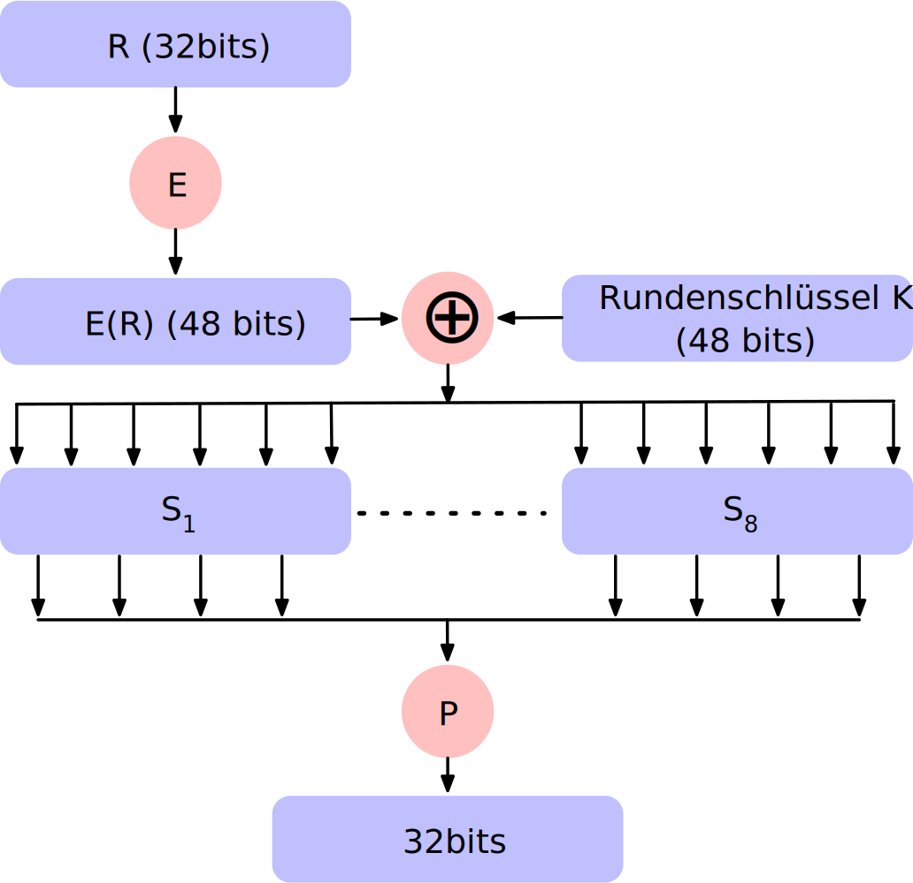
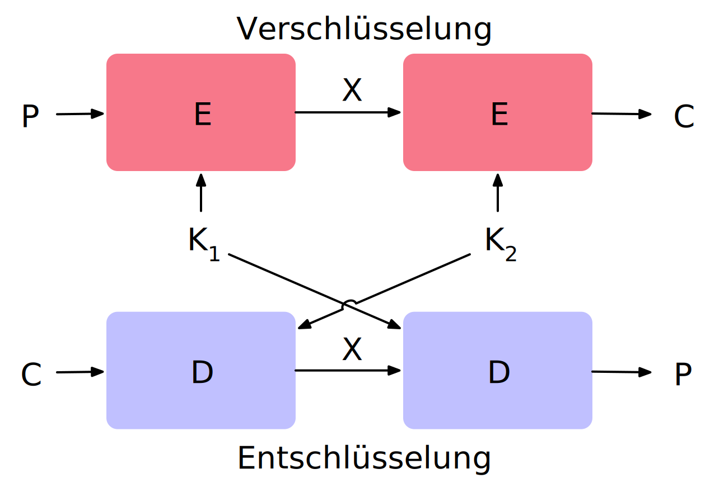
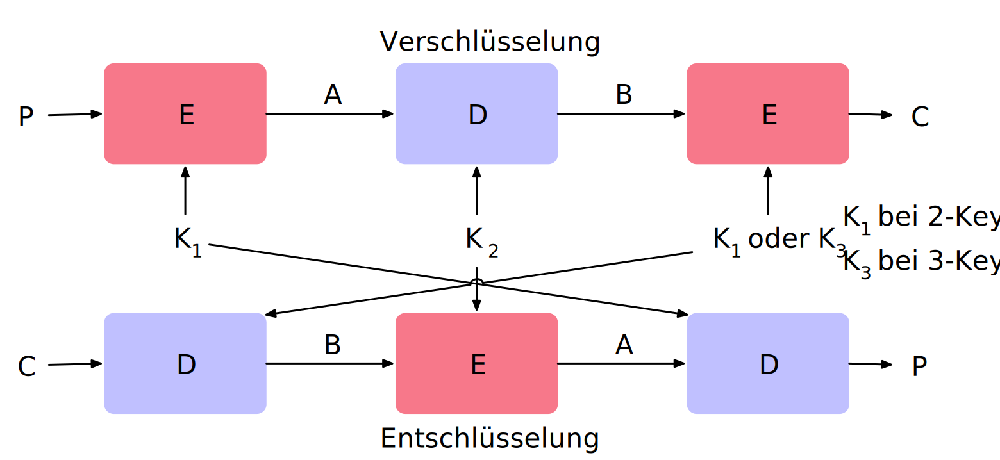

.. meta::
    :version: renaissance
    :author: Michael Eichberg
    :keywords: Blockverschlüsselung, Blockchiffren, DES, Feistel
    :description lang=en: Block Ciphers
    :description lang=de: Blockverschlüsselung
    :id: vorlesung-blockchiffre
    :first-slide: last-viewed
    :master-password: WirklichSchwierig!

.. include:: ../docutils.defs

.. |Kontrollfragen| source:: kontrollfragen.de.rst
                    :path: relative
                    :prefix: https://delors.github.io/
                    :suffix: .html

Block Chiffre und der *Data Encryption Standard (DES)*
========================================================

:Dozent: `Prof. Dr. Michael Eichberg <https://delors.github.io/cv/folien.de.rst.html>`__
:Kontakt: michael.eichberg@dhbw.de
:Version: 1.1.4
:Basierend auf: *Cryptography and Network Security - Principles and Practice, 8th Edition, William Stallings*

.. supplemental::

    :HTML [normativ]: |html-source|

    :PDF: |pdf-source|

    :Kontrollfragen: |Kontrollfragen|

  :Fehler melden:
      https://github.com/Delors/delors.github.io/issues

.. class:: repetition

Stromchiffre
--------------

- Verschlüsselt einen digitalen Datenstrom ein Bit oder ein Byte nach dem anderen.

  Beispiele: Autokeyed Vigenère-Chiffre und Vernam-Chiffre.

.. story::

    .. class:: incremental-list

    - Im Idealfall wird (würde) ein One-Time-Pad verwendet werden. Der Schlüsselstrom wäre genauso lang wie der Bitstrom des Klartextes.

      .. container:: incremental

            - Wenn der kryptografische Schlüsselstrom zufällig ist, kann diese Chiffre auf keine andere Weise als durch die Beschaffung des Schlüsselstroms geknackt werden.
            - Der Schlüsselstrom muss beiden Nutzern im Voraus über einen unabhängigen und sicheren Kanal zur Verfügung gestellt werden.
            - Dies führt zu unüberwindbaren logistischen Problemen, wenn der vorgesehene Datenverkehr sehr groß ist.

      .. container:: incremental

            .. rubric:: Beispielimplementierung in Python

            .. code:: python
                :class: copy-to-clipboard

                def vernam(plaintext: bytes, key: bytes) -> bytes:
                    return bytes([p ^ k for p, k in zip(plaintext, key)])

    - Aus praktischen Gründen muss der Bitstromgenerator als algorithmisches Verfahren implementiert werden, damit der kryptografische Bitstrom von beiden Benutzern erzeugt werden kann.
    - Es muss rechnerisch praktisch unmöglich sein, zukünftige Teile des Bitstroms auf der Grundlage früherer Teile des Bitstroms vorherzusagen.
    - Die beiden Benutzer müssen nur den erzeugenden Schlüssel sicher miteinander teilen, damit jeder den Schlüsselstrom erzeugen kann.

Blockchiffre
-------------

.. class:: incremental-list

- Ein Klartextblock wird als Ganzes behandelt und verwendet, um einen gleich langen Chiffretextblock zu erzeugen.
- In der Regel wird eine Blockgröße von 64 (8 Byte) oder 128 Bit (16 Byte) verwendet.
- Wie bei einer Stromchiffre *teilen sich die beiden Benutzer einen symmetrischen Chiffrierschlüssel*.
- Viele netzbasierte Anwendungen, die auf symmetrische Verschlüsselung setzen, verwenden Blockchiffren.

Stromchiffre vs. Blockchiffre
------------------------------

.. image:: drawings/chiffren/stromchiffre.svg
    :align: left

.. image:: drawings/chiffren/blockchiffre.svg
    :align: right
    :class: incremental

Allgemeine n-Bit-n-Bit-Blocksubstitution (n = 4)
---------------------------------------------------

.. image:: drawings/chiffren/4-bit_block_substitution.svg
    :align: center

.. supplemental::

    Mittels 4 Bit können :math:`16` verschiedene Werte dargestellt werden (:math:`[0,15]`). Je nach Wert der Eingabe wird ein anderer Wert ausgegeben. Die Zuordnung ist der Grafik zu entnehmen.

Verschlüsselungs- und Entschlüsselungstabelle für eine Substitutions-Chiffre
----------------------------------------------------------------------------

**Verschlüsselungstabelle**

.. list-table::
    :align: center
    :class: font-size-65 highlight-identical-cells-on-hover

    * - Klartext
      - 0000
      - 0001
      - 0010
      - 0011
      - 0100
      - 0101
      - 0110
      - 0111
      - 1000
      - 1001
      - 1010
      - 1011
      - 1100
      - 1101
      - 1110
      - 1111
    * - Geheimtext
      - 1110
      - 0100
      - 1101
      - 0001
      - 0010
      - 1111
      - 1011
      - 1000
      - 0011
      - 1010
      - 0110
      - 1100
      - 0101
      - 1001
      - 0000
      - 0111

**Entschlüsselungstabelle**

.. list-table::
    :align: center
    :class: incremental font-size-65 highlight-identical-cells-on-hover

    * - Geheimtext
      - 0000
      - 0001
      - 0010
      - 0011
      - 0100
      - 0101
      - 0110
      - 0111
      - 1000
      - 1001
      - 1010
      - 1011
      - 1100
      - 1101
      - 1110
      - 1111
    * - Klartext
      - 1110
      - 0011
      - 0100
      - 1000
      - 0001
      - 1100
      - 1010
      - 1111
      - 0111
      - 1101
      - 1001
      - 0110
      - 1011
      - 0010
      - 0000
      - 0101

Feistel-Chiffre
------------------

Feistel schlug die Verwendung einer Chiffre vor, bei der sich Substitutionen und Permutationen abwechseln.

.. definition::
    :class: incremental

    .. rubric:: Substitutionen

    Jedes Klartextelement oder jede Gruppe von Elementen wird eindeutig durch ein entsprechendes Chiffretextelement oder eine entsprechende Gruppe von Elementen ersetzt.

.. definition::
    :class: incremental

    .. rubric:: Permutation

    Bei einer Permutation werden keine Elemente hinzugefügt, gelöscht oder ersetzt, sondern die Reihenfolge, in der die Elemente in einer Folge erscheinen, wird geändert.

Feistel-Chiffre - Hintergrund
-------------------------------

- Hierbei handelt es sich um eine praktische Anwendung eines Vorschlags von Claude Shannon zur Entwicklung einer Chiffre, bei der sich *Konfusions- und Diffusionsfunktionen* abwechseln.

- Dieser Aufbau wird von vielen bedeutenden (Twofish, Blowfish, Serpent, Mars) - im Einsatz befindlichen - symmetrischen Blockchiffren verwendet.

.. container:: incremental

    **Diffusion und Konfusion**

    - Begriffe, die von Claude Shannon eingeführt wurden, um die beiden grundlegenden Bausteine für jedes kryptografische System zu erfassen.
    - Shannons Anliegen war es, die auf statistischer Analyse beruhende Kryptoanalyse zu vereiteln.

.. supplemental::

    Blowfish ist zum Beispiel die Basis für das Hashingverfahren ``bcrypt``, welches für Passworthashing verwendet wird.

Diffusion
---------------------------

- Die statistische Struktur des Klartextes wird in weitreichende Statistiken des Chiffretextes überführt, d. h. die **statistische Beziehung zwischen Klartext und Chiffretext wird so komplex wie möglich**.

.. class:: incremental list-with-explanations

- Dies wird dadurch erreicht, dass jede Klartextziffer(bzw. -zeichen) den Wert vieler Chiffretextziffern (bzw. -zeichen) beeinflusst.

  („Lawineneffekt“)
- Die Diffusion kann z. B. durch *Permutationen* erreicht werden.

Konfusion
---------------------------

- Versucht, **die Beziehung zwischen den Statistiken des Chiffriertextes und dem Wert des Chiffrierschlüssels so komplex wie möglich zu gestalten**, d. h. eine einzige Änderung des Chiffrierschlüssels sollte viele Bits des Chiffriertextes beeinflussen.

.. class:: incremental

- Selbst wenn der Angreifer die Statistik des Chiffretextes einigermaßen in den Griff bekommt, ist die Art und Weise, wie der Schlüssel verwendet wurde, um diesen Chiffretext zu erzeugen, so komplex, dass es schwierig ist, den Schlüssel abzuleiten.
- Die Verwirrung kann z. B. durch *Substitutionen* realisiert werden.

.. class:: no-title

Feistel-Chiffre - Verschlüsselung und Entschlüsselung
------------------------------------------------------------------

.. grid::

    .. cell:: width-40

        .. rubric:: Feistel-Chiffre

        Verschlüsselung und Entschlüsselung

        .. legend::
            :class: width-100

            :math:`K_x` - Schlüssel der :math:`x`-ten Runde

            :math:`L_{x-1}` - linke Hälfte des Eingabeblocks der :math:`x`-ten Runde

            :math:`R_{x-1}` - rechte Hälfte des Eingabeblocks der :math:`x`-ten Runde

            :math:`F` - Rundenfunktion

            :math:`\oplus` - XOR-Operation

    .. cell:: width-60

        .. image:: drawings/feistel/design.svg
            :align: center

.. supplemental::

    .. rubric:: Notwendigkeit der *Swap* Operation

    Die Verwendung des *Swap*\ s am Ende ist notwendig, damit die Verschlüsselung und Entschlüsselung identisch sind; d. h. derselbe Algorithmus verwendet werden kann.

    Zum besseren Verständnis gehen wir im Folgenden davon aus, dass wir nur eine Runde hätten:

    .. image:: drawings/feistel/one_round_and_swap.svg
        :align: center

    Wird der Swap am Ende nicht durchgeführt, würde die Entschlüsselung nicht funktionieren, wie am folgenden Beispiel mit nur einer Runde zu sehen ist:

    .. image:: drawings/feistel/one_round_no_swap.svg
        :align: center

    Ein alternatives Design wäre es beim Verschlüsseln auf den finalen Tausch zu verzichten und stattdessen beim Entschlüsseln initial einen Tausch durchzuführen — zusätzlich zum finalen Tausch. Dieses Design wird jedoch nicht verwendet, da es die Implementierung komplizierter macht.

Feistel Chiffre - Beispiel
---------------------------

.. image:: drawings/feistel/example.svg
    :align: center

.. container:: far-smaller

    .. rubric:: Zur Erinnerung

    ::

        [F(03A6,12DE52) ⊕ DE7F] ⊕ F(03A6,12DE52) =
         F(03A6,12DE52) ⊕ F(03A6,12DE52) ⊕ DE7F  = DE7F

Feistel Chiffre - Eigenschaften
--------------------------------

.. story::

    .. class:: incremental-list dd-margin-left-2em

    :**Rundenfunktion F**:
        Größere Komplexität bedeutet in der Regel größere Resistenz gegen Kryptoanalyse.

    :**Schnelle Ver-/Entschlüsselung in Software**:
        Wenn die Verschlüsselung so in Anwendungen oder Dienstprogramme eingebettet ist, dass eine Hardwareimplementierung nicht möglich ist, dann ist die Geschwindigkeit des Algorithmus relevant.

    :**Einfachheit der Analyse**:
        Wenn der Algorithmus kurz und klar erklärt werden kann, ist es einfacher den Algorithmus auf kryptoanalytische Schwachstellen hin zu analysieren und somit ein höheres Maß an Sicherheit in Bezug auf seine Stärke zu entwickeln.

    :**Algorithmus für die Ableitung der (Unter-)Schlüssel**:
        Eine höhere Komplexität dieses Algorithmus sollte zu einer größeren Schwierigkeit der Kryptoanalyse führen.

    :**Blockgröße**:
        Größere Blockgrößen bedeuten mehr Sicherheit, aber eine geringere Verschlüsselungs-/Entschlüsselungsgeschwindigkeit für einen bestimmten Algorithmus.

    :**Schlüsselgröße**:
        Ein größerer Schlüssel bedeutet mehr Sicherheit, kann aber die Verschlüsselungs-/Entschlüsselungsgeschwindigkeit verringern.

    :**Anzahl der Runden**:
        Das Wesen der Feistel-Chiffre besteht darin, dass eine einzige Runde unzureichende Sicherheit bietet, während mehrere Runden zunehmende Sicherheit bieten.

Data Encryption Standard (DES)
-------------------------------

- Wurde 1977 vom National Bureau of Standards (heute NIST) als Federal Information Processing Standard 46 herausgegeben.
- War das am häufigsten verwendete Verschlüsselungsverfahren bis zur Einführung des Advanced Encryption Standard (AES) im Jahr 2001.
- Der Algorithmus selbst wird als Data Encryption Algorithm (DEA) bezeichnet.

.. admonition:: Eigenschaften
    :class: incremental

    - Die Daten werden in 64-Bit-Blöcken mit einem 56-Bit-Schlüssel verschlüsselt.
    - Der Algorithmus wandelt die 64-Bit-Eingabe in einer Reihe von Schritten in eine 64-Bit-Ausgabe um.
    - Dieselben Schritte werden mit demselben Schlüssel verwendet, um die Verschlüsselung rückgängig zu machen.

.. supplemental::

    Bei DES enthält ein 64 Bit langer Schlüssel 8 Paritätsbits, die zur Überprüfung der Schlüsselübertragung verwendet werden.

    Die 8 Paritätsbits werden dann aus dem 64-Bit-Schlüssel entfernt. Somit ist die effektive Schlüssellänge 56 Bit. Diese Operation wurde oft als explizite Schwächung des Algorithmus kritisiert, da die Sinnhaftigkeit der Paritätsbits in Frage gestellt wurde.

    Diese Verkürzung hat dazu geführt, dass bereits im Jahre 1998 die `EFF <https://de.wikipedia.org/wiki/Electronic_Frontier_Foundation>`__ einen DES-Schlüssel in weniger als 3 Tagen durch einfachen *Brute Force* ermitteln konnte. D. h. der Algorithmus an sich wurde nicht gebrochen!

DES: Design
-------------------

.. image:: drawings/des/design.svg
    :align: center

.. supplemental::

    .. class:: dd-margin-left-4em

    :Permuted Choice\ [#]_ 1: Permutation und Selektion (d. h. Entfernung der Paritätsbits) der 56 (Schlüssel-)bits

              .. csv-table::
                :class: monospaced highlight-cell-on-hover table-data-align-right

                57, 49,  41, 33,  25,  17,  9
                1, 58,  50, 42,  34,  26, 18
                10,  2,  59, 51,  43,  35, 27
                19, 11,  3, 60,  52,  44, 36
                63, 55,  47, 39,  31,  23, 15
                7, 62,  54, 46,  38,  30, 22
                14,  6,  61, 53,  45,  37, 29
                21, 13,  5, 28,  20,  12,  4

    :\<\<\<: Rotation der Schlüsselbits

              .. csv-table::
                :class: monospaced highlight-cell-on-hover
                :header: Iteration, Anzahl der Linksverschiebungen

                          1,  1
                          2,          1
                          3,          2
                          4 ,         2
                          5  ,        2
                          6   ,       2
                          7    ,      2
                          8     ,     2
                          9      ,    1
                         10      ,    2
                         11      ,    2
                         12      ,    2
                         13      ,    2
                         14     ,     2
                         15     ,     2
                         16     ,     1

    :Permuted Choice 2: Auswahl der 48 zur Verschlüsselung zu verwendenden Bits aus den 56 Eingabebits

              .. csv-table::
                :class: monospaced highlight-cell-on-hover  table-data-align-right

                14,  17, 11,  24,   1,  5
                3,  28, 15,   6,  21, 10
                23,  19, 12,   4,  26,  8
                16,   7, 27,  20,  13,  2
                41,  52, 31,  37,  47, 55
                30,  40, 51,  45,  33, 48
                44,  49, 39,  56,  34, 53
                46,  42, 50,  36,  29, 32

    .. [#] Permuted Choice ≘ :ger:`permutierte Auswahl`

DES: Rundenfunktion („F“)
--------------------------------------

.. legend::
    :class: width-40 float-right

    R - rechte Hälfte der Nachricht

    E - Expansionsfunktion

    S - Substitutionsboxen

    P - Permutation

.. supplemental::

    **Expansionsfunktion 32 → 48 Bit**

    .. csv-table::
        :class: monospaced highlight-cell-on-hover highlight-identical-cells-on-hover text-align-right

        32, 1, 2, 3, 4, 5
        4, 5, 6, 7, 8, 9
        8, 9, 10, 11, 12, 13
        12, 13, 14, 15, 16, 17
        16, 17, 18, 19, 20, 21
        20, 21, 22, 23, 24, 25
        24, 25, 26, 27, 28, 29
        28, 29, 30, 31, 32, 1

    **Substitution Boxes**

    Die acht Boxen sind auf https://en.wikipedia.org/wiki/DES_supplementary_material zu finden. Dabei ist zu beachten, dass die 6 Eingabebits jeweils auf vier Ausgabebits abgebildet werden.

.. class:: vertical-title

DES: Beispiel
-------------

.. csv-table::
    :class: monospaced highlight-row-on-hover highlight-identical-cells-on-hover font-size-85
    :align: center
    :header: Round, :math:`Ki`, :math:`Li`, :math:`Ri`
    :stub-columns: 1

    IP, , 5a005a00, 3cf03c0f
    1, 1e030f03080d2930, 3cf03c0f, bad22845
    2, 0a31293432242318, bad22845, 99e9b723
    3, 23072318201d0c1d, 99e9b723, Obae3b9e
    4, 05261d3824311a20, Obae3b9e, 42415649
    5, 3325340136002025, 42415649, 18b3fa41
    6, 123a2d0d04262a1c, 18b3fa41, 9616fe23
    7, 021f120b1c130611, 9616fe23, 67117cf2
    8, 1c10372a2832002b, 67117cf2, c11bfc09
    9, 04292a380c341103, c11bfc09, 887fbc6c
    10, 2703212607280403, 887fbc6c, 60017e8b
    11, 2826390c31261504, 60017e8b, f596506e
    12, 12071c241a0a0108, f596506e, 738538b8
    13, 300935393c0d100b, 738538b8, c6a62c4e
    14, 311e09231321182a, c6a62c4e, 56b0bd75
    15, 283d3e0227072528, 56b0bd75, 75e8fd8f
    16, 2921080b13143025, 75e8fd8f, 25896490
    IP-1, , da02ce3a, 89ecac3b

.. supplemental::

    DES-Unterschlüssel werden als acht 6-Bit-Werte im Hexadezimalformat angezeigt.

    Der Höchstwert für einen Wert von :math:`k_i` ist somit :math:`2^6-1=63=0x3F`.

    .. rubric:: Beispiel - :math:`k_1`

    .. csv-table::
        :class: far-smaller monospaced highlight-cell-on-hover
        :align: center
        :header: Index, 1,2,3,4,5,6,7,8

        Wert, 1e, 03, 0f, 03, 08, 0d, 29, 30

Lawineneffekt in DES
---------------------------------------------------

Kleine Änderung im Klartext (erster Wert +1)

.. csv-table::
    :class: font-size-80 monospaced highlight-row-on-hover
    :width: 100%
    :header: Round, , δ, , Round, , δ

    , "02468aceeca86420
    12468aceeca86420", 1, , 9, "c11bfc09887fbc6c
    996911532eed7d94", 32
    1, "3cf03c0fbad22845
    3cf03c0fbad32845", 1, , 10, "887fbc6c60017e8b
    2eed7d94d0f23094", 34
    2, "bad2284599e9b723
    bad3284539a9b7a3", 5, , 11, "600f7e8bf596506e
    d0f23094455da9c4", 37
    3, "99e9b7230bae3b9e
    39a9b7a3171cb8b3", 18, , 12, "1596506e738538b8
    455da9c47f6e3cf3", 31
    4, "Obae3b9e42415649
    171cb8b3ccaca55e", 34, , 13, "738538b8c6a62c4e
    7f6e3cf34bc1a8d9", 29
    5, "4241564918b3fa41
    ccaca55ed16c3653", 37, , 14, "c6a62c4e56b0bd75
    4bc1a8d91e07d409", 33
    6, "18b3fa419616fe23
    d16c3653cf402c68", 33, , 15, "56b0bd7575e8fd81
    1e07d4091ce2e6dc", 31
    7, "9616fe2367117cf2
    cf402c682b2cefbc", 32, , 16, "75e8fd8625896490
    1ce2e6dc365e5f59", 32
    8, "67117cf2c11bfc09
    2b2cefbc99191153", 33, , IP-1, "da02ce3a89ecac3b
    057cde97d7683f2a", 32

Lawineneffekt in DES
-----------------------------------

Kleine Änderung des Schlüssels: :monospaced:`0f1571c947d9e859` ➟ :monospaced:`1f1571c947d9e859`

.. csv-table::
    :class: font-size-80 monospaced highlight-row-on-hover
    :width: 100%
    :header: Round, , "δ", , Round, , δ

    , "02468aceeca86420
    02468aceeca86420", 0, , 9, "c11bfe09887fbe6c
    548f1de471f64dfd", 34
    1, "3cf03c0fbad22845
    3cf03c0f9ad628c5", 3, , 10, "8876be6c60067e8b
    71664dfd4279876c", 36
    2, "bad2284599e9b723
    9ad628c59939136b", 11, , 11, "60017e8bf596506e
    4279876c399fdc0d", 32
    3, "99e9b7230bae3b9e
    9939136676806767", 25, , 12, "f596506e738538b8
    399fde0d6d208dbb", 28
    4, "Obae3b9e42415649
    768067b75a8807c5", 29, , 13, "738538b8c6a62c4e
    6d208dbbb9bdeeaa", 33
    5, "4241564918b3fa41
    5a8807c5488bde94", 26, , 14, "c6a62c4e56b0bd75
    b9bdeeaad2c3a56f", 30
    6, "18b3fa419616fe23
    488dbe94aba7fe53", 26, , 15, "56b0bd7575e8fd8f
    d2c3a5612765c1fb", 33
    7, "9616fe2367117cf2
    aba7fe53177d21e4", 27, , 16, "75e8fd8f25896490
    2765c1fb01263dc4", 30
    8, "67117cf2c11bfc09
    177d21e4548f1de4", 32, , IP-1, "da02ce3a89ecac3b
    ee92b50606b6260b", 30

Erschöpfende Schlüsselsuche
---------------------------------------------------------

.. compound::

    **Durchschnittliche Zeiten**

    .. presenter-note::

        10⁹ = eine Milliarde; 10¹³ = 10 Billionen; 10⁶⁰ = 1 Dezillion

.. csv-table::
    :class: highlight-row-on-hover font-size-80 incremental-table-rows
    :align: center
    :widths: 10 10 10 20 20
    :header-rows: 1
    :width: 100%

    "Schlüsselgröße (bits)", Chiffre, "Anzahl der alternativen
    Schlüssel", "Zeit benötigt bei 10⁹ Entschlüsselungen/s", "Zeit benötigt bei 10¹³ Entschlüsselungen/s"
    56, DES, "2⁵⁶ ≈ 7.2 ⨉⨉ 10¹⁶", 1.125 Jahre, 1 Stunde
    128, AES, "2¹²⁸ ≈ 3.4 ⨉ 10³⁸", "5.3 ⨉ 10²¹ Jahre", "5.3 ⨉ 10¹⁷ Jahre"
    168, Triple DES, "2¹⁶⁸ ≈ 3.7 ⨉ 10⁵⁰", "5.8 ⨉ 10³³ Jahre", 5.8 × 10²⁹ Jahre
    192, AES, "2¹⁹² ≈ 6.3 ⨉ 10⁵⁷", "2¹⁹¹ ns = 9.8 ⨉ 10⁴⁰ Jahre", "9.8 ⨉ 10³⁶ Jahre"
    256, AES, "2²⁵⁶ ≈ 1.2 ⨉ 10⁷⁷", "2²⁵⁵ ns = 1.8 ⨉ 10⁶⁰ Jahre", "1.8 ⨉ 10⁵⁶ Jahre"
    26 Zeichen (Permutation), Mono-alphabetisch, 26! = 4 ⨉ 10²⁶, "6.3 ⨉ 10⁹ Jahre", 6.3 × 10⁶ Jahre

Stärke von DES - Timing-Angriffe
---------------------------------

.. class:: incremental-list

- Ein Verfahren, bei dem Informationen über den Schlüssel oder den Klartext gewonnen werden, indem beobachtet wird, wie lange eine bestimmte Implementierung für die Entschlüsselung verschiedener Chiffretexte benötigt.
- Dabei wird die Tatsache ausgenutzt, dass ein Verschlüsselungs- oder Entschlüsselungsalgorithmus für verschiedene Eingaben oft leicht unterschiedliche Zeit benötigt.
- Bislang scheint es unwahrscheinlich, dass diese Technik jemals gegen DES oder leistungsfähigere symmetrische Chiffren wie Triple DES und AES erfolgreich sein wird.

Entwurfsprinzipien für Blockchiffren - Anzahl der Runden
---------------------------------------------------------

.. class:: incremental-list

- Je größer die Anzahl der Runden ist, desto schwieriger ist es, eine Kryptoanalyse durchzuführen.
- Im Allgemeinen sollte das Kriterium sein, dass die Anzahl der Runden so gewählt wird, dass bekannte kryptoanalytische Bemühungen mehr Aufwand erfordern als ein einfacher Brute-Force-Schlüsselsuchangriff.
- Hätte DES 15 oder weniger Runden, würde die differentielle Kryptoanalyse weniger Aufwand erfordern als eine Brute-Force-Schlüsselsuche.

Entwurfsprinzipien für Blockchiffren - Funktion F
-----------------------------------------------------

.. class:: incremental-list

- Das Herzstück einer Feistel-Blockchiffre ist die Funktion F.
- Je nichtlinearer F ist, desto schwieriger wird jede Art von Kryptoanalyse sein.
- Der Algorithmus sollte einen großen Lawineneffekt (:eng:`Avalanche-Property`) haben.

.. admonition:: Strict Avalanche Criterion (SAC)
    :class: incremental

    Besagt, dass sich jedes Ausgangsbit j einer S-Box mit der Wahrscheinlichkeit 1/2 ändern sollte, wenn ein einzelnes Eingangsbit i invertiert wird und dies für alle Paare i,j gelten muss.

.. admonition:: Bit Independence Criterion (BIC)
    :class: incremental

    Besagt, dass sich die Ausgangsbits j und k unabhängig voneinander ändern sollten, wenn ein einzelnes Eingangsbit i invertiert wird und dies für alle i, j und k gelten muss.

.. class:: incremental

    - Das Einhalten der SAC- und BIC-Kriterien scheint die Wirksamkeit der Verwirrungsfunktion zu stärken.

Entwurfsprinzipien für Blockchiffre - Schlüsselableitung
-------------------------------------------------------------

.. class:: incremental-list

- Bei jeder Feistel-Blockchiffre wird der Hauptschlüssel verwendet, um einen Unterschlüssel für jede Runde zu erzeugen.
- Im Allgemeinen möchten wir die Unterschlüssel so wählen, dass die Schwierigkeit, einzelne Unterschlüssel abzuleiten, und die Schwierigkeit, den Hauptschlüssel wieder zurückzuerhalten, maximiert werden.
- Es wird vorgeschlagen, dass die Schlüsselableitungsfunktion für die Unterschlüssel (:eng:`Key Schedule`) zumindest das **Strenge Lawinenkriterium** und das **Bit-Unabhängigkeitskriterium** für Schlüssel/Ciphertext garantieren sollte.

.. class:: new-section transition-fade

Mehrfachverschlüsselung
-----------------------------------

Doppelte Verschlüsselung
-------------------------------

*Meet-in-the-Middle*-Angriff
-----------------------------

.. deck::

    .. card::

        .. observation::

            :math:`E(K_2,E(K_1,P)) = E(K_3,P)` ist nicht gültig.

            D. h. die zweifache Anwendung von DES führt zu einer Abbildung, die nicht äquivalent zu einer einfachen DES-Verschlüsselung ist.

            .. supplemental::

                Es gilt, dass es keinen Schlüssel :math:`DES_{K^{1-2}} = DES_{K^1} \circ DES_{K^2}` gibt. Weiterhin gilt, dass die Teilmenge der durch DES erzeugbaren Permutationen extrem klein ist und nicht abgeschlossen unter Komposition.

    .. card::

        Der Meet-in-the-Middle-Algorithmus greift dieses Verfahren an. Er hängt nicht von einer bestimmten Eigenschaft von DES ab, sondern funktioniert gegen jede Blockchiffre.

        .. class:: incremental

        - Möglicher Known-Plaintext-Angriff:

          .. class:: incremental-list

          1. Man berechnet *für alle Schlüssel* :math:`K_1` die Chiffretexte :math:`E(K_1,P)` und speichert diese.
          2. Man berechnet *für alle Schlüssel* :math:`K_2` die Klartexte :math:`D(K_2,C)` .
          3. Man vergleicht die beiden Ergebnisse und prüft, ob es Übereinstimmungen gibt.

          .. container:: incremental

            Dieser Aufwand ist lediglich doppelt so hoch wie der Aufwand bei einer einfachen Verschlüsselung.

    .. card::

        .. warning::

            Die zweifache Anwendung einer Blockchiffre ist nicht sinnvoll!

            Das Ergebnis ist, dass ein bekannter Klartextangriff gegen Doppel-DES mit einem Aufwand in der Größenordnung von :math:`2^{56}` *im Durchschnitt* erfolgreich ist, verglichen mit *durchschnittlich* :math:`2^{55}` für einen einfachen DES.

Dreifache Verschlüsselung
-----------------------------------------------------------------------

**(Z. B. Triple-DES (3DES) mit drei Schlüsseln)**

Triple-DES mit zwei Schlüsseln
---------------------------------

Die offensichtliche Antwort auf den *Meet-in-the-middle*-Angriff ist die dreifache Verschlüsselung mit drei verschiedenen Schlüsseln.

- Dies erhöht die Kosten des *Meet-in-the-Middle*-Angriffs auf 2¹¹², was jenseits dessen liegt, was praktikabel ist.
- Das hat den Nachteil, dass eine Schlüssellänge von 56 bits ⨉ 3 = 168 bits erforderlich ist, was etwas unhandlich sein kann.
- Als Alternative schlug Tuchman eine dreifache Verschlüsselungsmethode vor, die nur zwei Schlüssel verwendet.
- 3DES mit zwei Schlüsseln war eine Alternative zu DES und wurde in die Schlüsselverwaltungsstandards ANSI X9.17 und ISO 8732 aufgenommen.

Triple-DES mit drei Schlüsseln
--------------------------------

- Es wurden mehrere Angriffe gegen 3DES mit 2 Schlüsseln entwickelt, die jedoch (noch) nicht praktikabel sind.
- Viele Forscher sind inzwischen der Meinung, dass 3DES mit drei Schlüsseln die bevorzugte Alternative ist.
- 3DES mit drei Schlüsseln hat eine effektive Schlüssellänge von 168 Bit und ist definiert als:

  .. math:: C=E(K_3,D(K_2,E(K_1, P)))
- Rückwärtskompatibilität mit DES ist gegeben, wenn man :math:`K_3 = K_2` oder :math:`K_1 = K_2` einsetzt.

.. class:: exercises transition-scale

Übung
---------------------------------------

.. exercise:: Feistelchiffre Implementieren

    Implementieren Sie eine Feistel Chiffre in einer Programmiersprache Ihrer Wahl (z. B. Java, Scala, Python, C, JavaScript ...), die es Ihnen ermöglicht:

    - Nachrichten zu ver- und entschlüsseln
    - Blöcke von 128 Bit zu verschlüsseln
    - die Funktion :math:`f` einfach auszutauschen, um die Wirkung von :math:`f` zu testen
    - Für die Ableitung der Rundenschlüssel können Sie eine Funktion verwenden, die eine Rotation des Schlüssels durchführt (z. B. `Integer.rotateLeft <https://docs.oracle.com/javase%2F7%2Fdocs%2Fapi%2F%2F/java/lang/Integer.html#rotateLeft(int,%20int))>`_).

    .. solution::
        :pwd: Feistel in Python

        `Feistel Chiffre in Python <https://github.com/Delors/delors.github.io/blob/main/sec-blockchiffre/resources/feistel.ipynb>`__

.. supplemental::

    **Hinweise**

    Kümmern Sie sich nicht um Nachrichten, die größer oder kleiner als die Blockgröße sind. Dies ist nicht notwendig, um die Auswirkungen von :math:`f` oder der Verwendung eines Rundenschlüssels zu verstehen. Kümmern Sie sich nicht um einen Schlüssel, der nicht die richtige Größe hat. D. h. verwenden Sie eine Nachricht und einen Schlüssel mit der entsprechenden Größe.

    Um die Austauschbarkeit der Funktion f zu erreichen, können Sie je nach Sprache z. B. native Funktionen höherer Ordnung, einen Funktionszeiger oder ein Interface verwenden.

.. class:: exercises

Übung
---------------------------------------

.. exercise:: Feistelchiffre Evaluieren

  1. Was passiert, wenn f nur 0x00-Werte zurückgibt (unabhängig vom Rundenschlüssel)?
  2. Was passiert, wenn f nur 0x01-Werte zurückgibt (unabhängig vom Rundenschlüssel)?
  3. Was passiert, wenn f einfach ein *xor* der entsprechende Hälfte mit dem Ergebnis der Verschiebung des Schlüssels durchführt?
  4. Was passiert, wenn man eine Nachricht ändert? Testen Sie insbesondere, was passiert wenn die Nachricht nur aus 0x00 besteht (und Sie eine „vernünftigere“ f-Funktion verwenden.)
  5. Was passiert, wenn man den Schlüssel ändert? Was passiert in extremen Fällen (z. B. wenn das Passwort nur aus "0" besteht)?

  .. solution::
    :pwd: OhFeistel

    Eine naive Python-Implementierung des Algorithmus ist hier zu finden:

    `Jupyter Notebook <https://github.com/Delors/delors.github.io/blob/main/sec-blockchiffre/resources/feistel.ipynb>`__

    Wenn man die obige Implementierung anpasst und testet, wird sofort deutlich, dass die Verwendung einer ungeeigneten f-Funktion zu keinerlei Sicherheit führt und dass der Entwurf einer solchen Funktion nicht trivial ist. Außerdem ist es notwendig, alle möglichen Extremfälle zu berücksichtigen.

    Eine Java Implementierung (d. h. ein Java Script) (ohne Keyschedule) ist hier zu finden: `Feistel.java <https://github.com/Delors/delors.github.io/blob/main/sec-blockchiffre/resources/Feistel.java>`__

    Folgender Prompt kann ggf. genutzt werden, um eine passende Implementierung in einer anderen Sprache (z. B. Java, Scala, Python, C, JavaScript ...) zu erhalten:

    ::

        Implementiere mir in Java 21 oder neuer eine Klasse mit einer Methode, die eine Feistelchiffre realisiert. Die Methode soll über der Rundenfunktion F parametrisierbar sein. Implementiere mir auch ein paar Beispiele für Rundenfunktionen. Insbesondere eine Funktion, die einfach alle Werte auf einen Konstanten Wert abbildet. Weiterhin benötige ich eine Rundenfunktion, die in Abhängigkeit von einer Rundenschlüsselfunktion die Verschlüsselung durchführt. Die Verschlüsselungsmethode soll nach jeder Runde alle Werte ausgeben, um das Verständnis zu ermöglichen. Bitte lege mir auch direkt ein Build-Skript an und generiere entsprechende Tests.
