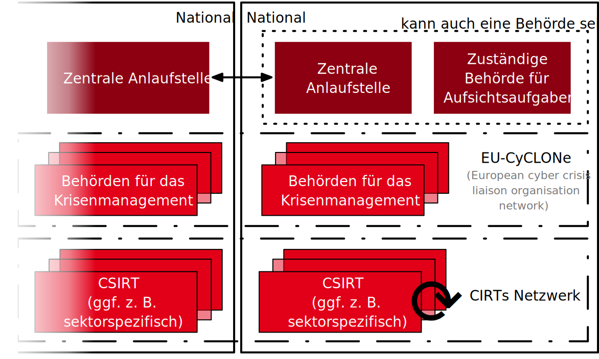

.. meta::
    :author: Michael Eichberg
    :keywords: "IT Sicherheit", "Reverse Engineering"
    :description lang=de: Fortgeschrittene Angewandte IT Sicherheit
    :id: lecture-security-java_reverse_engineering
    :first-slide: last-viewed
    :master-password: WirklichSchwierig!

.. include:: ../docutils.defs

Cybersecurity
=====================================================

:Dozent: `Prof. Dr. Michael Eichberg <https://delors.github.io/cv/folien.de.rst.html>`__
:Kontakt: michael.eichberg@dhbw.de
:Version: 2.12.3

.. supplemental::

    :Folien:
      |html-source|

      |pdf-source|

    :Kontrollfragen:

        .. source:: kontrollfragen.de.rst
            :path: relative
            :prefix: https://delors.github.io/
            :suffix: .html

    :Fehler melden:
      https://github.com/Delors/delors.github.io/issues

Was ist Cybersecurity?
-----------------------

.. deck::

    .. card::

        .. epigraph::

            **Cybersecurity is the practice of protecting systems, networks, and programs from digital attacks**. These cyberattacks are usually aimed at accessing, changing, or destroying sensitive information; extorting money from users via ransomware; or interrupting normal business processes.

            -- `Cisco <https://www.cisco.com/c/en/us/products/security/what-is-cybersecurity.html>`__ [Last accessed: July 4th, 2024]

    .. card::

        .. epigraph::

            [...] The security precautions related to computer information and access address four major threats: **(1) theft of data**, such as that of military secrets from government computers; **(2) vandalism**, including the destruction of data by a computer virus; **(3) fraud**, such as employees at a bank channeling funds into their own accounts; and **(4) invasion of privacy**, such as the illegal accessing of protected personal financial or medical data from a large database. [...]

            -- `Britannica <https://www.britannica.com/technology/computer-security>`__ [Last accessed: July 4th, 2024]

    .. card::

        .. epigraph::

            **VERORDNUNG (EU) 2019/881 DES EUROPÄISCHEN PARLAMENTS UND DES RATES vom 17. April 2019 über die ENISA (Agentur der Europäischen Union für Cybersicherheit**

            *Artikel 2 Nummer 1*

            „Cybersicherheit“ bezeichnet alle Tätigkeiten, die notwendig sind, um Netz- und Informationssysteme, die Nutzer solcher Systeme und andere von Cyberbedrohungen betroffene Personen zu schützen [...]

            -- `Verordnung (EU) 2019/881 <https://eur-lex.europa.eu/legal-content/DE/TXT/PDF/?uri=CELEX:32019R0881>`__

    .. card::

        Das Ziel der IT-Sicherheit ist der Schutz von Systemen vor:

        - Ausfall
        - Missbrauch
        - Sabotage
        - Spionage
        - Manipulation
        - Diebstahl

        .. supplemental::

            Ein einfacher Überlastungsangriff (Denial of Service) hat normalerweise das Ziel für einen **Ausfall** zu sorgen.

            Ein Beispiel für **Missbrauch** ist ein Bankangestellter, der Kundendaten verwendet, um sich selbst zu bereichern.

            Bei **Sabotage** kann man zum Beispiel an Stuxnet denken, das iranische Atomanlagen angegriffen hat, um diese physisch zu beschädigen.

            **Spionage** umfasst das unbefugte Auslesen von Informationen. Dies kann durch die Ausnutzung von Kameras oder Mikrofonen erfolgen, aber auch durch die Ausspähung von Daten in Datenbanken oder das Mitschneiden unverschlüsselter Netzwerkverbindungen.

            **Manipulation** umfasst zum Beispiel das Verändern von Daten in Datenbanken oder auf Speichermedien oder das Abfangen und Verändern von Netzwerkverkehr. Zum Beispiel wenn ein Student in ein Prüfungsverwaltungssystem eingreift, um seine Noten zu ändern.

            Im Rahmen von Wirtschaftsspionage werden häufig **Diebstähle** von geistigem Eigentum (z. B. Quellcode, Designs, Patente) durchgeführt.

.. class:: new-section

Neuigkeiten aus der Welt der IT-Security
-----------------------------------------------------------------------------------------

.. class:: section-subtitle

Vorfälle, Forschung und Kampf gegen Cyberkriminalität

IT-Security Vorfälle
-------------------------------------------------------------

.. deck::

    .. card::

        .. epigraph::

            **Indonesia won’t pay an $8 million ransom after a cyberattack compromised its national data center**

            [...] The attackers have held data hostage and offered a key for access in return for the $8 million ransom, said PT Telkom Indonesia’s director of network & IT solutions, Herlan Wijanarko, without giving further details. Wijanarko said the company, in collaboration with authorities at home and abroad, is investigating and trying to break the encryption that made data inaccessible. [...]

            -- `June 25th, 2024; AP News <https://apnews.com/article/indonesia-ransomware-attack-national-data-center-213c14c6cc69d7b66815e58478f64cee>`__

    .. card::

        .. exercise:: Ransomware Angriffe und Backups

            Was ist bei der Erstellung von Backups zu beachten, um sich gegen Ransomware Angriffe zu schützen? Warum ist dies wichtig?

            .. remark::
                :class: incremental

                - Ransomware kann ggf. auch Backup-Systeme angreifen.
                - Ransomware kann erst mit Zeitverzögerung aktiv werden.

            .. solution::
                :pwd: air-gapped-backups

                Bei der Erstellung zu beachten;

                .. class:: list-with-explanations

                - 3-2-1(+1)-Regel einhalten: mind. drei Kopien, zwei unterschiedliche Medien, eine Offsite‑Kopie, eine zusätzliche Offline-/immutable Kopie.
                - Offline-/Air‑Gapped-/Immutable‑Backups verwenden (z. B. Band, Objektspeicher mit WORM/Object Lock).

                  Ransomware darf Backups nicht erreichen können.
                - Backup-Infrastruktur vom normalen Netz trennen (separates Admin‑Netz/‑Domain, restriktive Firewalls, kein direkter User‑Zugriff).
                - Getrennte, gehärtete Backup‑Konten mit Least Privilege und MFA verwenden; keine Wiederverwendung von Domain‑Admin‑Konten.
                - Produktivsysteme dürfen Backends nicht als normales, beschreibbares Dateisystem mounten, sondern nur Daten *in* das Backup schreiben.
                - Backup-Server und -Software regelmäßig patchen und absichern; Management-Interfaces nicht direkt aus dem Internet erreichbar machen.
                - RPO/RTO definieren und Backup‑/Snapshot‑Frequenz sowie Aufbewahrungszeiten daran ausrichten.

                  **RPO** (*Recovery Point Objective*) beschreibt den maximal tolerierten Datenverlust in Zeit. Bei einer RPO von 4 Stunden wird ein maximaler Verlust von 4 Stunden akzeptiert.

                  **RTO** (*Recovery Time Objective*) beschreibt die maximal tolerierte Ausfallzeit eines Systems/Services. Bei einer RTO von 2 Stunden muss spätestens 2 Stunden nach einem Ausfall das System wieder produktiv laufen.
                - Backups verschlüsseln, Schlüssel getrennt und sicher (ggf. offline) verwalten.

                  (Wenn die Schlüssel kompromittiert/verschlüsselt sind, nützt das beste Backup nichts.)
                - Regelmäßig Wiederherstellungstests durchführen (inkl. kompletter System- und Datenbank‑Restores).
                - Einen Wiederanlaufplan/Playbook für Ransomware-Fälle definieren (Reihenfolge der Restores, saubere Netze, erneute Infektion verhindern).

    .. card::

        .. epigraph::

            **UK government to ban public bodies from paying ransoms to hackers**

            The UK government is planning to ban public bodies from paying ransoms to computer hackers, and private companies will be required to inform authorities if they plan to cave into cash demands.

            […] The government could then provide those businesses with advice and support, including notifying them if any such payment would risk breaking the law by sending money to sanctioned cybercriminal groups, many of whom are based in Russia. […]

            -- `July 22nd, 2025; The Guardian <https://www.theguardian.com/technology/2025/jul/22/uk-government-to-ban-public-bodies-from-paying-ransoms-to-hackers>`__

    .. card::

        .. epigraph::

            **Crypto-Hackers Steal $2.2bn as North Koreans Dominate**

            Threat actors stole $2.2bn from cryptocurrency platforms in 2024, with the majority (61%) of illicit funds attributed to North Korean hackers, according to Chainalysis. [...]

            Notably, attacks between $50 and $100m, and those above $100m, occurred far more frequently in 2024 than they did in 2023, suggesting that the DPRK is getting better and faster at massive exploits[...].

            This increase is unfortunately also being matched by “a growing density” of hacks which yielded lower amounts of around $10,000 in value.[...]

            Some of these events appear to be linked to North Korean IT workers, who have been increasingly infiltrating crypto and Web3 companies, and compromising their networks, operations, and integrity.

            -- `Dec. 19th, 2024; Infosecurity Magazine <https://www.infosecurity-magazine.com/news/cryptohackers-steal-22bn-north/>`__

    .. card::

        .. epigraph::

            **Hackers shut down heating in Ukrainian city with malware**

            For two days in mid-January, some Ukrainians in the city of Lviv had to live without central heating and suffer freezing temperatures because of a cyberattack against a municipal energy company [...]

            [...], the cybersecurity company Dragos published a report with details about a new malware dubbed FrostyGoop, which the company says is designed to target industrial control systems [...]

            -- `July 23rd, 2024; Techcrunch <https://techcrunch.com/2024/07/23/hackers-shut-down-heating-in-ukrainian-city-with-malware-researchers-say/?guccounter=1>`__

    .. card::

        .. deck::

            .. card::
                .. epigraph::

                    **US government tells officials, politicians to ditch regular calls and texts**

                    The U.S. government [CISA] is urging senior government officials and politicians to ditch phone calls and text messages following intrusions at major American telecommunications companies blamed on Chinese hackers. [...]

                    The first recommendation: "Use only end-to-end encrypted communications." [...]

                    -- `Dec. 18th, 2024; Reuters <https://www.reuters.com/world/us/us-cyber-watchdog-tells-senior-officials-immediately-adopt-end-to-end-encryption-2024-12-18/>`__

            .. card:: s-only overlay center-content s-font-size-1200 opacity-10
                :not-incremental:

                    📱

            .. card:: s-only overlay center-content s-font-size-1200 opacity-10
                :not-incremental:

                    🚫

    .. card::

        .. epigraph::

            **Hijacked satellites and orbiting space weapons: In the 21st century, space is the new battlefield**

            [...] hackers backing the Kremlin hijacked an orbiting satellite that provides television service to Ukraine.

            Instead of normal programing, Ukrainian viewers saw parade footage beamed in from Moscow: waves of tanks, soldiers and weaponry. The message was meant to intimidate and was an illustration that 21st-century war is waged not just on land, sea and air but also in cyberspace and the reaches of outer space. [...]

            More than 12,000 operating satellites now orbit the planet, playing a critical role not just in broadcast communications but also in military operations, navigation systems like GPS, intelligence gathering and economic supply chains.[...]

            .. supplemental::

                .. rubric:: GenAI Browserextensions verhalten sich unterschiedlich:

                “Perplexity always prevents any collection of sensitive information. It was the most private assistant we found in our study.”

            -- `April 24th, 2025; AP News <https://apnews.com/article/space-weapons-trump-satellites-russia-0fdd31a1e3d350a54823e8a3d228fc17>`__

    .. card::

        .. epigraph::

            **Hackers Compromise Intelligence Website Used by CIA and Other Agencies**

            Unidentified hackers have successfully breached a critical intelligence website used by the CIA and other U.S. agencies to manage sensitive government contracts [...]

            Sources familiar with the investigation confirmed that data from Digital Hammer, one of the CIA’s most sensitive technology development programs, was among the  information accessed by the hackers. Digital Hammer compiles cutting-edge technologies for human intelligence gathering, surveillance, and counterintelligence operations, with a particular focus on countering Chinese intelligence and information operations.[...]

            [...] The NNSA breach, exploited zero-day vulnerabilities in Microsoft SharePoint servers. Three Chinese threat groups Linen Typhoon, Violet Typhoon, and Storm-2603 were identified as the primary actors [...].

            -- `July 28th, 2025; Cyber Security News <https://cybersecuritynews.com/cia-intelligence-website-compromised/>`__

    .. card::

        .. epigraph::

            **Trump administration to spend $1 billion on offensive hacking operations**

            [...] Offensive cyber operations can describe a wide range of targeted hacks against U.S. adversaries, which include the use of zero-day exploits [...] — or the deployment of spyware, which can be used to steal data from a person. [...]

            -- `July 14th, 2025; TechCrunch <https://techcrunch.com/2025/07/14/trump-administration-to-spend-1-billion-on-offensive-hacking-operations/>`__

    .. card::

        .. epigraph::

            **Hacker sneaks infostealer malware into early access Steam game**

            A threat actor called EncryptHub has compromised a game on Steam to distribute info-stealing malware to unsuspecting users downloading the title.

            A few days ago, the hacker (also tracked as Larva-208), injected malicious binaries into the Chemia game files hosted on Steam.

            [...] According to threat intelligence company Prodaft, the initial compromise occurred on July 22, when EncryptHub added to the game files the HijackLoader malware (CVKRUTNP.exe), which establishes persistence on the victim device and downloads the Vidar infostealer (v9d9d.exe). [...] It is unclear how EncryptHub managed to add the malicious files to the game project but one explanation could be an insider helping out.

            :red:`[...] This is the third case of malware slipping into Steam this year. [...]`

            -- `July 24th, 2025; BleepingComputer <https://www.bleepingcomputer.com/news/security/hacker-sneaks-infostealer-malware-into-early-access-steam-game/>`__

    .. card::

        .. epigraph::

            **Google says attackers used 100,000+ prompts to try to clone AI chatbot Gemini**

            Google says [...] Gemini has been inundated by “commercially motivated” actors who are trying to clone it by repeatedly prompting it [...] — including one campaign that prompted Gemini more than 100,000 times. [These] “distillation attacks,” [should] get a chatbot to reveal its inner workings. Google described the activity as “model extraction,” in which would-be copycats probe the system for the patterns and logic that make it work. [...]

            -- `Feb. 12,2026 - NBC News <https://www.nbcnews.com/tech/security/google-gemini-hit-100000-prompts-cloning-attempt-rcna258657>`__

    .. card::

        .. epigraph::

            **GlassWorm: First Self-Propagating Worm Using Invisible Code Hits OpenVSX Marketplace**

            A month after Shai Hulud became the first self-propagating worm in the npm ecosystem, we just discovered the world's first worm targeting VS Code extensions on OpenVSX marketplace [*and also VS Code Marketplace later on*].

            But GlassWorm isn't just another supply chain attack. It's using :gray:`stealth techniques` we've never seen before in the wild - invisible Unicode characters that make malicious code literally disappear from code editors. [...]

            -- `October 18th, 2025; Koi Research <https://www.koi.ai/blog/glassworm-first-self-propagating-worm-using-invisible-code-hits-openvsx-marketplace>`__

        .. remark::

            Glassworm ist - Stand Dez. 2025 - bereits in mind. `3 Wellen <https://www.techzine.eu/news/security/136912/glassworm-malware-reappears-within-vs-code-ecosystem/>`__ aufgetaucht.

        .. supplemental::

            Bei GlassWorm handelt es sich um einen klassischen         **Supply-Chain-Angriff**.

Wie versteckt Glassworm seinen Code?
-----------------------------------------------------------------

.. deck::

    .. card::

        **Idee**

        .. class:: incremental-list

        - GlassWorm nutzt Besonderheiten von Unicode, um bösartigen Code in VS Code Extensions in dem Sinne zu verstecken, dass der Code für Menschen unsichtbar ist.
        - Dieser Code wird durch einen kleinen Lader in echten Code umgewandelt und ausgeführt.

    .. card::

        **Hintergrund**

        .. class:: incremental-list

        - Im `Unicode Standard <https://www.unicode.org/charts/PDF/UFE00.pdf>`__ sind im Bereich ``FE00–FE0F`` die Variation Selectors definiert.
        - Diese Zeichen verändern die Darstellung des vorhergehenden Zeichens.
        - In den meisten Schriftarten haben diese Zeichen keine sichtbare Auswirkung.
        - In den meisten Code-Editoren (Stand 2025) werden diese Zeichen ignoriert; insbesondere auch dann, wenn keine gültige Verwendung vorliegt.

        .. supplemental::

            Es gibt in Unicode auch explizit definierte `unsichtbare Zeichen <https://invisible-characters.com/>`__, z. B. ZERO WIDTH NON-JOINER (U+200C), die sich ggf. auch für Angriffe eignen.

    .. card::

        **Beispiel**

        .. deck::

            .. card::

                Generierung einer Textdatei „mit unsichtbarem Text“ (>Java 25):

                .. include:: code/Gen.java
                    :code: java
                    :number-lines:
                    :class: copy-to-clipboard

                Ausführung von ``Gen.java`` (Voraussetzung: die Konsole verwendet UTF-8 oder ein anderes Unicode-kompatibles Encoding):

                .. code:: console
                    :number-lines:

                    $ java Gen.java > invisible.txt

            .. card::

                Hexansicht der generierten Datei (z. B. mit :console:`xxd invisible.txt`):

                ::

                    00000000: e280 8c2e 0a20 efb8 802e 0a20 efb8 812e  ..... ..... ....
                    00000010: 0aef b881 efb8 822e 0aef b881 efb8 82ef  ................
                    00000020: b883 efb8 84ef b885 efb8 86ef b887 efb8  ................
                    00000030: 882e 0a6c efb8 8128 efb8 8222 efb8 8321  ...l...(..."...!
                    00000040: efb8 8422 efb8 8529 efb8 863b efb8 872e  ..."...)...;....
                    00000050: 0a

                .. attention::

                    Wir verwenden hier UTF-8 Encoding.

                    Zum Beispiel ist das Unicode-Zeichen ``ZERO WIDTH NON-JOINER (U+200C)`` in UTF-8 Kodierung :code:`e2 80 8c`. (Siehe auch: `UTF-8 Wikipedia <https://en.wikipedia.org/wiki/UTF-8#Description>`__)

                    (Der Punkt im Text(.) hat den Wert ``2e`` und der Zeilenumbruch hat den Wert ``0a``.)

            .. card::

                .. figure:: code/2025-12-Gen.txt.MacOS_Terminal.webp
                    :alt: Generierter Text auf der Konsole
                    :class: screenshot
                    :align: center

                    Anzeige im MacOS 26.1 Terminal

            .. card::

                .. figure:: code/2025-12-Gen.txt.CotEditor.webp
                    :class: screenshot
                    :align: center

                    Anzeige im CotEditor 6.1.2

            .. card::

                .. figure:: code/2025-12-Gen.txt.VSCode.webp
                    :class: screenshot
                    :align: center

                    Anzeige in VS Code 1.107.0

            .. card::

                .. figure:: code/2025-12-Gen.txt.Zen.webp
                    :class: screenshot
                    :align: center

                    Anzeige in Zen 0.216.1

IT-Security Forschung
----------------------------------------------------

.. deck::

    .. card::

        .. epigraph::

            **Internet-wide Vulnerability Enables Giant DDoS Attacks**

            Researchers have uncovered a distributed denial-of-service (DDoS) vulnerability in the HTTP/2 protocol that is more serious than anything seen in two years.

            .. background::
                :class: s-font-size-90

                In August 2023, unknown threat actors carried out the largest DDoS attack [...]. It worked thanks to a then-novel technique called "Rapid Reset," which took advantage of a fundamental flaw in implementations of HTTP/2.

            Now, researchers from Tel Aviv University have identified a way around the Rapid Reset fix. They named the technique "MadeYouReset," and it's once again raising the possibility that attackers could enact colossal cyberattacks [...].

            [...] but a large number of the vendors that were potentially exposed to this were informed about it, and they did whatever they believed they should do. [...]

            -- `August 18th, 2025; Dark Reading <https://www.darkreading.com/vulnerabilities-threats/internet-wide-vulnerability-giant-ddos-attacks>`__

    .. card::

        .. epigraph::

            **Want to Win a Bike Race? Hack Your Rival’s Wireless Shifters**

            Relatively inexpensive hardware can be used to hack the Shimano Di2 wireless gear-shifting systems used by cyclists [...]. They tested the eavesdrop-and-replay attack with a $1,500 USRP software-defined radio, an antenna, and a laptop but said the setup could be miniaturized. Attackers could spoof signals from up to 30 feet away, causing the target bike to shift gears unexpectedly or lock into the wrong gear.

            -- `August 16th, 2024; summary provided by ACM <https://technews.acm.org/archives.cfm?fo=2024-08-aug/aug-16-2024.html>`__; `August 14th, 2024; full article: Wired <https://www.wired.com/story/shimano-wireless-bicycle-shifter-jamming-replay-attacks/>`__

    .. card::

        .. epigraph::

            **New RAMBO attack steals data using RAM in air-gapped computers**

            [...] A novel side-channel attack dubbed  "RAMBO" (Radiation of Air-gapped Memory Bus for Offense) generates electromagnetic radiation from a device's RAM to send data from air-gapped computers.

            .. container:: incremental

                [...] To conduct the Rambo attack, an attacker plants malware on the air-gapped computer to collect sensitive data and prepare it for transmission. It transmits the data by manipulating memory access patterns to generate controlled electromagnetic emissions from the device's RAM.

            .. container:: incremental

                [...] The RAMBO attack achieves data transfer rates of up to 1,000 bits per second (bps) [at a distance of up to 7 meters], equating to 128 bytes per second, or 0.125 KB/s.

            -- `September 7th, 2024; Bleepingcomputer <https://www.bleepingcomputer.com/news/security/new-rambo-attack-steals-data-using-ram-in-air-gapped-computers/>`__

        .. supplemental::

            .. rubric:: Rambo Attack - weitere Details

            .. epigraph::

                The emitted data is encoded into "1" and "0", represented in the radio signals as "on" and "off." The researchers opted for using Manchester code to enhance error detection and ensure signal synchronization, reducing the chances for incorrect interpretations at the receiver's end.

                The attacker may use a relatively inexpensive Software-Defined Radio (SDR) with an antenna to intercept the modulated electromagnetic emissions and convert them back into binary information.

    .. card::

        .. epigraph::

            **SnailLoad: Exploiting Remote Network Latency Measurements without JavaScript**

            [Side-Channel Attack to circumvent privacy.]

            [...] The attack setup for SnailLoad. A victim downloads data from an attacker's HTTP server while it watches a video on a video-sharing platform, e.g., YouTube. Due to the network bottleneck on the victim's side, the attacker can infer the transmitted amount of data by measuring the packet round trip time. The round trip time traces are unique per video and can be used to classify the video watched by the victim. [...]

            -- June 28th 6, 2024; Snailload `Paper <https://www.snailload.com/snailload.pdf>`__, `Web <https://www.snailload.com>`__

    .. card::

        .. epigraph::

            **New PIXHELL Attack Exploits LCD Screen Noise to Exfiltrate Data from Air-Gapped Computers**

            A new side-channel attack dubbed PIXHELL could be abused to target air-gapped computers by breaching the "audio gap" and exfiltrating sensitive information by taking advantage of the noise generated by pixels on an LCD screen.

            Malware in the air-gap and audio-gap computers generates crafted pixel patterns that produce noise in the frequency range of 0 - 22 kHz," Dr. Mordechai Guri, the head of the Offensive Cyber Research Lab in the Department of Software and Information Systems Engineering at the Ben Gurion University of the Negev in Israel, said in a newly published paper. [...]

            -- `Sept. 10th, 2024; The Hacker News <https://thehackernews.com/2024/09/new-pixhell-attack-exploits-screen.html>`__

    .. card::

        .. epigraph::

            **Nvidia warns its GPUs – even Blackwells [Released in 2024] – need protection against Rowhammer attacks**

            Nvidia last week advised customers to ensure they employ mitigations against Rowhammer attacks, after researchers found one of its workstation-grade GPUs is susceptible to the exploit.

            Rowhammer is a method of attempting to corrupt memory by repeatedly "hammering" rows of memory cells with a burst of read or write operations. The repeat operations can create electrical interference between rows of memory cells, potentially disrupting operations.[...]

            -- `July 13th, 2025; The Register <https://www.theregister.com/2025/07/13/infosec_in_brief/>`__

Missbrauch von Vertrauen in IT-Systeme
-------------------------------------------------------------

.. deck::

    .. card::

        .. epigraph::

            **Big Help or Big Brother? UC Davis Study Reveals Alarming Browser Tracking**

            [...] GenAI browser assistants use large language models to make browsing easier and more personalized, and act as your ride-along as you surf the web. [...] these assistants can pose a significant threat to user privacy. [They] often collect personal and sensitive information and share that information with both first-party servers and third-party trackers [...] one GenAI browser extension,  collected form inputs as well. While filling out a form on the IRS website, [the extension] exfiltrated the social security number that was provided in the form field.

            -- `August 13th, 2025; UC Davis <https://engineering.ucdavis.edu/news/big-help-or-big-brother-uc-davis-study-reveals-alarming-browser-tracking>`__

    .. card::

        .. epigraph::

            **Chameleon Channels: Measuring YouTube Accounts Repurposed for Deception and Profit**

            [...] We explore this problem of repurposed channels, whereby a channel changes its identity and contents. [...] By observing YouTube channels (re)sold over these 6 months, we find that a substantial number (37%) are used to disseminate potentially harmful content, often without facing any penalty. Even more surprisingly, these channels seem to gain rather than lose subscribers. [...]

            We confirm that these repurposed channels share several characteristics with sold channels -- mainly, the fact that they had a significantly high presence of potentially problematic content. Across repurposed channels, we find channels that became disinformation channels, as well as channels that link to web pages with financial scams.

            -- `July 21st, 2025; arXiv <https://arxiv.org/abs/2507.16045>`__

Kampf gegen Cyberkriminalität
------------------------------------
.. deck::

    .. card::

        .. epigraph::

            **FAST 4.000 VERHAFTUNGEN: Interpol gelingt großer Schlag gegen Onlinebetrug**

            Die Einsatzkräfte haben nicht nur weltweit Tausende von Verdächtigen verhaftet, sondern auch Vermögenswerte im Umfang von 257 Millionen US-Dollar beschlagnahmt.

            [...] Mit einem Gesamtwert von 135 Millionen US-Dollar besteht laut Interpol mehr als die Hälfte davon aus beschlagnahmten Fiat-Währungen wie US-Dollar, Euro oder Yen. Weitere zwei Millionen Dollar liegen in Form von Kryptowährungen vor. Hinzu kommen andere Vermögenswerte wie etwa Immobilien, Luxusfahrzeuge, teurer Schmuck und andere hochwertige Gegenstände und Sammlungen im Gesamtwert von 120 Millionen US-Dollar. [...]

            -- `3.12.2024; Golem.de <https://www.golem.de/news/fast-4-000-verhaftungen-interpol-gelingt-grosser-schlag-gegen-onlinebetrug-2406-186568.html>`__

    .. card::

        .. epigraph::

            Der Hersteller soll insgesamt 240.000 Geräte mit der DDoS-Funktion ausgestattet haben – teils ab Werk, teils erst nachträglich per Firmwareupdate.

            [...] In Südkorea sind fünf Mitarbeiter sowie der CEO eines Unternehmens verhaftet worden. Dieses soll Satellitenreceiver hergestellt und Hunderttausende davon auf Wunsch eines Kunden mit einer DDoS-Funktion ausgestattet haben. Wie [...] unter Verweis auf Angaben der südkoreanischen Polizei berichtet, lieferte der Hersteller 98.000 Geräte ab Werk mit dieser Funktion aus. [...]

            Dass Geräte ab Werk mit Schadsoftware ausgeliefert werden, ist gerade im unteren Preissegment keine Seltenheit. Sicherheitsforscher deckten erst im vergangenen Jahr eine Malware-Kampagne auf, bei der vor allem billige Android-Geräte wie Smartphones, Tablets und TV-Boxen aus China vor ihrer Auslieferung an Endkunden mit einer Schadsoftware ausgestattet worden waren.

            -- `3.12.2024; Golem.de: CEO verhaftet <https://www.golem.de/news/ceo-verhaftet-satellitenreceiver-jahrelang-mit-ddos-funktion-ausgeliefert-2412-191354.html>`__

    .. card::

        .. epigraph::

            **U.S. charges 14 North Koreans in $88 million identity theft and extortion case**

            The Department of Justice accused 14 North Koreans of conspiring to use false identities to get IT jobs with U.S. companies and siphon money back to their home country.

            The indictment in Missouri federal court alleged that the conspiracy generated at least $88 million.

            The State Department said Thursday it is offering an up to $5 million reward for information about the conspirators and others associated with the two “North Korean front companies.”

            -- `Dec. 12th, 2024; CNBC <https://www.cnbc.com/2024/12/12/north-koreans-charged-identity-theft-extortion-conspiracy-doj.html>`__

    .. card::

        .. epigraph::

            **VMware Hacked As $150,000 Zero-Day Exploit Dropped**

            [...] Nguyen Hoang Thach of STARLabs SG used a single integer overflow to exploit #VMware ESXi - a first in Pwn2Own history. He earns $150,000 [...]

            -- `May 17th, 2025; Davey Winder <https://www.forbes.com/sites/daveywinder/2025/05/17/vmware-hacked-as-150000-zero-day-exploit-dropped/>`__

    .. card::

        .. epigraph::

            **CISA open-sources Thorium platform for malware, forensic analysis**

            The U.S. Cybersecurity and Infrastructure Security Agency (CISA) today announced the public availability of Thorium. Thorium was developed [...] as a scalable cybersecurity suite that automates many tasks involved in cyberattack investigations [...]

            [...] teams can use Thorium for automating [...] various file analysis workflows [such as]:

            - Easily import and export tools to facilitate sharing across cyber defense teams,
            - Integrate command-line tools as Docker images, [...]
            - Filter results using tags and full-text search,
            - Control access to submissions, tools, and results with strict group-based permissions,
            - Scale with Kubernetes and ScyllaDB to meet workload demands.

            [...]

            -- `August 24th, 2025; BleepingComputer <https://www.bleepingcomputer.com/news/security/cisa-open-sources-thorium-platform-for-malware-forensic-analysis/>`__

    .. card::

        .. epigraph::

            **Global crackdown hits pro-Russian cybercrime, 100+ systems taken down worldwide**

            In a major blow to pro-Russian cybercrime, authorities across Europe and the United States launched a sweeping international crackdown on the hacking group NoName057(16) between 14 and 17 July. The coordinated operation, led by Europol and Eurojust, targeted the group’s members and infrastructure.

            Law enforcement and judicial authorities from Czechia, France, Finland, Germany, Italy, Lithuania, Poland, Spain, Sweden, Switzerland, the Netherlands, and the United States took part in the simultaneous actions. The investigation was further supported by ENISA and authorities from Belgium, Canada, Estonia, Denmark, Latvia, Romania, and Ukraine.

            The operation disrupted a global attack infrastructure [...].

            -- `July 16th, 2025; HelpNet Security <https://www.helpnetsecurity.com/2025/07/16/pro-russian-cybercrime-crackdown-noname05716/>`__

.. class:: new-section

Cybersicherheitsvorfälle
-------------------------

Cybersicherheit ist das Geschäftsrisiko Nr. 1
-------------------------------------------------------------

.. deck::

    .. card::

        .. epigraph::

            **Cybervorfälle wie Ransomware-Angriffe, Datenschutzverletzungen und IT-Unterbrechungen sind laut dem Allianz Risk Barometer im Jahr 2024 die größte Sorge für Unternehmen weltweit.** An zweiter Stelle steht die eng miteinander verknüpfte Gefahr der Betriebsunterbrechung. [...]

            Cybervorfälle (36% der Gesamteinsätze) sind zum dritten Mal in Folge das weltweit gefürchtetste Risiko [...]. Eine Datenschutzverletzung wird von den Befragten des Allianz Risk Barometers (59%) als die besorgniserregendste Cyberbedrohung angesehen, gefolgt von Angriffen auf kritische Infrastrukturen und physische Vermögenswerte (53%). [...]

            Cyberkriminelle suchen vermehrt nach Möglichkeiten, neue Technologien wie generative künstliche Intelligenz (KI) zu nutzen, um Angriffe zu automatisieren und zu beschleunigen und so effektivere Malware und Phishing zu schaffen. [...]

            -- `24.01.2024; Allianz Risk Barometer 2024 <https://www.allianz-trade.de/wissen/wirtschafts-news/allianz-risk-barometer-2024-geschaeftsrisiken.html?utm_source=google&utm_medium=cpc&utm_campaign=[generic][mm][de][de][leadgen][trade_credit_insurance][e][p][b][p-max]-eh_wkv_p-max&_bt=&_bk=&_bm=&_bn=x&_bg=&gad_source=1&gbraid=0AAAAAC_uaZo7sk9ZvZrwUYEuUPFQbJoY1&gclid=Cj0KCQiAvP-6BhDyARIsAJ3uv7aL2d0IlFz61--XDPzi50sJUl5JjeneJlk3ehYu3pTYgkyDz0C0_cMaAtzKEALw_wcB>`__

    .. card::

        .. epigraph::

            More Than 25% of U.K. Businesses Hit by Cyberattack in Last Year

            A survey by the U.K.’s Royal Institution of Chartered Surveyors found an increase in the share of U.K. businesses experiencing a cyberattack in the last year from 16% in 2024 to around 27%. Nearly three-quarters (73%) of respondents to the survey expect a cybersecurity incident to impact their operations in the next one to two years. Risk areas identified by the survey include building management systems, CCTV networks, Internet of Things devices, access control systems, and other operational technologies.

            -- `July 2nd, 2025; Summary provided by ACM; Full article: Guardian <https://www.theguardian.com/business/2025/jun/30/uk-businesses-hit-by-cyber-attack-last-year-report>`__

    .. card::

        .. epigraph::

            **Experten: Cyberangriff auf Jaguar ist teuerster in britischer Geschichte**

            Wochenlang stand die Produktion von Jaguar Land Rover still. Das hatte nicht nur auf den britischen Autobauer erhebliche Auswirkungen.

            Die Einbußen durch den wochenlangen erzwungenen Produktionsstopp belaufen sich demnach auf geschätzte 1,9 Milliarden Pfund (knapp 2,2 Milliarden Euro). Die Schätzung schließe den Schaden für Zulieferer und Händler mit ein, hieß es in einer Mitteilung des Cyber Monitoring Centre, einer unabhängigen Expertengruppe. Demnach waren mehr als 5000 Organisationen von dem Cyberangriff betroffen.

            -- `23.10.2025 - Heise Security <https://www.heise.de/news/Experten-Cyberangriff-auf-Jaguar-ist-teuerster-in-britischer-Geschichte-10811032.html>`__

Wichtige Kennzahlen bzgl. Cybersecurity-Vorfällen\ [#]_
-------------------------------------------------------------

.. supplemental::

    .. [#] Die Begriffe (MTTI, etc.) sind nicht einheitlich definiert und ggf. ist es sinnvoll zu klären welcher Zeitraum genau gemeint ist.

.. story::

    .. class:: incremental-list

    :Mean Time to Detection (MTTD):
        Die mittlere Zeit, die benötigt wird, um einen Cyberangriff zu entdecken.

    :Mean Time to Identify (MTTI):
        Die mittlere Zeit, die benötigt wird, um einen Cyberangriff zu identifizieren in der Hinsicht, dass die Schwachstelle erkannt wird bzw. die Art des Vorfalls erkannt wird und eine erste Idee entwickelt wird, wie gegen den Angriff vorgegangen werden kann.

    :Mean Time to Respond (MTTR):
        Die mittlere Zeit, die benötigt wird, um auf einen Cyberangriff so zu reagieren, dass kein weiterer Schaden entsteht und der Weg zur Wiederherstellung der normalen Operationen eingeleitet werden kann.

    :Mean Time to Contain (MTTC):
        Die mittlere Zeit, die benötigt wird, um einen Cyberangriff einzudämmen. D. h. die Zeit, die benötigt wird, um zu verhindern, dass sich der Angriff weiter ausbreitet.

        MTTC = MTTD + MTTI + MTTR

    :Mean Time to Normal (MTTN) bzw. Mean Time to Recover/Restore/Resolve (MTTR):
        Die mittlere Zeit, die benötigt wird, um die normalen Operationen wiederherzustellen.

        Dies kann zum Beispiel auch die Zeit umfassen, die benötigt wird um etwaige Backups einzuspielen oder ggf. Firmware Patches einzuspielen.

.. supplemental::

    Die MTTD kann häufig nur im Nachgang genau ermittelt werden, sollte aber natürlich nachgefasst werden, um die eigenen Prozesse zu kontrollieren und ggf. zu verbessern. Insbesondere im Zusammenhang mit APTs können vergleichsweise lange Zeiträume bis zur Entdeckung vergehen. Zum Beispiel kann es sein, dass man als erstes feststellt, dass es unerwartete Verbindungen zu einem externen Server gibt. Zu diesem Zeitpunkt ist aber noch unklar wie der Angreifer vorgegangen ist, welche Daten ggf. schon abgeflossen sind und was genau zu tun ist, um den Angreifer zu stoppen. Es ist insbesondere auch noch nicht klar auf welche Systeme er bereits Zugriff hat.

    Die Zeit bis zum Beispiel erkannt wurde, dass ein bestimmter Account ausgenutzt wurde und dieser dann gesperrt wurde, oder zum Beispiel bestimmte Netzwerkverbindungen effektiv blockiert werden und begonnen werden kann mit der Wiederherstellung der Systeme, wird als MTTR bezeichnet.

    Die MTTC misst somit nicht wie lange es dauert bis alle Auswirkungen des Angriffs beseitigt sind/die normale Operation wiederhergestellt ist, sondern „nur“ wie lange es dauert die weitere Verbreitung zu stoppen.

    .. admonition:: Beispielszenario
        :class: dd-margin-left-2em

        :MTTD: Es kommt zu einer starken Häufung von gesperrten (z.B. Exchange-) Accounts aufgrund von zu vielen fehlschlagenden Anmeldeversuchen durch die vermeintlichen Nutzer. Aufgrund der hohen Zahl muss jedoch von einem Cyberangriff ausgegangen werden. *Durch eine Analyse der Log-Dateien kann festgestellt werden wann der Angriff begonnen hat und die MTTD ermittelt werden.*

        :MTTI: Nach einer Analyse des Netzwerkverkehrs wird festgestellt, dass alle Anfragen von externen Rechnern aus einem definierten IP-Addressbereich erfolgen. (Eine Alternative wäre, dass die Anfragen von einem oder mehreren  internen Rechner ausgehen.) Dies ist die MTTI.

        :MTTR: Durch eine Rekonfiguration der Firewallregeln können die Anfragen blockiert werden und somit der Angriff eingedämmt werden. Dies ist die MTTR.

        :MTTN: Als letzter Schritt muss untersucht werden welche Credentials ggf. erfolgreich gestohlen wurden und ob diese bereits genutzt wurden/werden. Nach dem Abschluss dieser Schritte kann ggf. die MTTN ermittelt werden.

.. class:: new-section transition-fade

Angriffe auf die Schutzziele der IT-Sicherheit
-------------------------------------------------------------

Ausgewählte Angriffe, Angriffsmethoden und Bedrohungsszenarien
----------------------------------------------------------------

.. grid::

    .. cell:: width-50

        .. class:: incremental-list list-with-explanations

        - Backdoors (:ger:`Hintertüren`)
        - (Distributed-)Denial-of-service Angriffe
        - Direct-access Angriffe

          Physischer Angriff auf das System.
        - Eavesdropping (:ger:`Abhören`)
        - `Malware`_
        - Person-in-the-middle Angriffe
        - `Social-Engineering Angriffe`_

    .. cell:: width-50

        .. class:: incremental-list list-with-explanations

        - Privilege escalation

          Unterschieden wird: horizontal bzw. vertikal.
        - Side-channel attacks (:ger:`Seitenkanalangriffe`)
        - Spoofing (z. B. IP-Spoofing) (:ger:`Vortäuschen`)
        - Advanced Persistent Threats (APT)
        - Store-now, Decrypt-later (:ger:`Speichere jetzt, Entschlüssele später`)

.. supplemental::

    :Vertikale Privilege Escalation: Der Angreifer erhält Zugriff auf höhere Rechte, die er vorher nicht hatte.
    :Horizontale Privilege Escalation: Der Angreifer erhält Zugriff auf die Rechte einer anderen Person, die er vorher nicht hatte.
    :APT: Der Begriff *Advanced Persistent Threat* (≘ „fortgeschrittene, andauernde Bedrohung“) bezeichnet gezielte Cyberangriffe durch professionelle Gruppen (häufig *state sponsored*). Es werden in der Regel langfristige Ziele verfolgt. Diese dienen zum Beispiel der Spionage oder der Vorbereitung auf einen Cyberkrieg. Häufige Ziele sind Regierungen und Unternehmen sowie Organisationen, die über kritische Daten verfügen. Insbesondere in der Anfangsphase gehen die Angreifer sehr vorsichtig vor, um nicht entdeckt zu werden. Danach unterscheidet sich das Vorgehen je nach Zielsetzung. Häufig wird versucht den Zugriff auf das Zielsystem langfristig zu erhalten, um so an weitere Informationen zu gelangen.

Schutzziele der IT-Sicherheit: CIA-Triade
--------------------------------------------

.. raw:: html
    :class: center-content

    

    

        

        

        
Availability

        

Confidentiality

        

Integrity

    

.. supplemental::

    Confidentiality ≘ :ger:`Vertraulichkeit`

    Integrity ≘ :ger:`Integrität`

    Availability ≘ :ger:`Verfügbarkeit`

Erweiterte Schutzziele
--------------------------------------------

Neben den primären Schutzzielen, gibt es eine Reihe weiterer kontextabhängiger Schutzziele:

.. class:: incremental-list

:Verbindlichkeit/Nichtabstreitbarkeit (`Accountability/Non-repudiation`:eng:):
    Ein Akteur kann seine Handlungen nicht abstreiten.
:Pseudo-/Anonymisierung: Eine Person kann nicht (mehr) identifiziert werden.
:Authentizität (`Authenticity`:eng:): Ist eine Information echt bzw. vertrauenswürdig?

Malware
-----------------------------

Malware (:eng:`Malicious Software`) wird nach Verbreitungsweise und Verhalten klassifiziert:

.. class:: incremental-list s-only

- Viren (:eng:`Viruses`
- Würmer (:eng:`Worms`)
- Trojaner (:eng:`Trojan Horses`)
- Rootkits
- Spyware
- `Ransomware`_
- Wipers
- :gray:`Adware`

.. supplemental::

  .. class:: list-with-explanations

  - **Viren** (:eng:`Viruses`)

    Schadcode, der sich an bestehende Dateien anhängt und sich durch Benutzeraktionen verbreitet. Benötigt ein Wirtsprogramm und wird beim Ausführen der infizierten Datei aktiv.

  - **Würmer** (:eng:`Worms`)

    Eigenständige Programme, die sich selbstständig über Netzwerke verbreiten, ohne Benutzerinteraktion. Nutzen Sicherheitslücken zur automatischen Replikation.

  - **Trojaner** (:eng:`Trojan Horses`)

    Schadsoftware, die als nützliches oder harmloses Programm getarnt ist und vom Nutzer installiert wird. Öffnet oft Hintertüren (:eng:`Backdoors`) für weitere Angriffe.

  - **Rootkits**

    Malware, die sich tief im System versteckt (oft auf Kernel-Ebene), mit dem Ziel nicht erkannt zu werden und dauerhaften, versteckten Zugriff zu ermöglichen.

  - **Spyware**

    Malware, die heimlich Informationen sammelt und an Angreifer sendet (z. B. Tastatureingaben, Browserdaten, Anmeldeinformationen, persönliche Daten).

  - **Wipers**

    Destruktive Malware, die Daten unwiederbringlich löscht oder zerstört - manchmal getarnt als Ransomware, aber ohne Wiederherstellungsmöglichkeit.

  .. remark::

    - *Adware* - keine Malware im engeren Sinne obwohl in der Regel (auch) nicht erwünscht. Da Adware in der Regel keine (zu) schädlichen Funktionen ausführt und bewusst installiert wird, ist diese nicht illegal und wird nicht als Malware klassifiziert.

Ransomware
-----------------------------

Es können verschiedene Arten bzw. Angriffstypen unterschieden werden:

.. class:: incremental-list s-only

- Locker/Screen Locker
- Krypto
- Scareware
- Doxware/Leakware
- Doppelte Erpressung (:eng:`Double Extortion Ransomware`)
- Dreifache Erpressung (:eng:`Triple Extortion Ransomware`)
- *Ransomware as a Service (RaaS)*

.. supplemental::

    .. class:: list-with-explanations

    - Locker/Screen Locker

      Die Nutzer werden aus dem System ausgesperrt.
    - Krypto

      Verschlüsselung der Daten auf dem System.
    - Scareware

      Fake Software - zeigt zum Beispiel Warnungen vor einem Virus - die den Nutzer dazu bringen sollen Geld zu zahlen.

    - Doxware/Leakware

      Drohung zur Veröffentlichung sensibler Daten, wenn kein Lösegeld gezahlt wird.
    - Doppelte Erpressung (:eng:`Double Extortion Ransomware`)

      Es werden nicht nur Daten verschlüsselt, sondern auch gestohlen und mit Veröffentlichung gedroht. (Kombination aus Krypto- und Doxware.)
    - Dreifache Erpressung (:eng:`Triple Extortion Ransomware`)

      Zusätzlich zur doppelten Erpressung werden weitere Systeme des Opfers angegriffen (z. B. mittels DDoS), oder auch den Angestellten gedroht oder gedroht Geschäftspartner anzugreifen/zu informieren.)
    - *Ransomware as a Service (RaaS)*

      Kriminelle können Ransomware mieten ohne eigene technische Expertise.

.. class:: new-section transition-fade

Social-Engineering Angriffe
-------------------------------------------------------------

Weitergehende Informationen
---------------------------------------------

.. presenter-note::

    Das Ziel ist es die Studierenden zu überzeugen den folgenden Text zu markieren und in die Konsole zu kopieren. Das Ziel ist es, dass die Studierenden sehen wie schnell man einen Angriff starten kann.

    Getestet unter Mac OS 15.2, mit dem eingebauten Terminal und einer Bash Shell (ZSH funktioniert nicht).

Falls Sie als Shell Bash nutzen und Linux oder Mac OS x verwenden, dann kopieren Sie bitte den folgenden Befehl in die Konsole, für weitergehende Informationen:

.. container:: monospaced

    .. raw:: html

        curl -f "does.not.exist" -s ; echo -e "You are doomed - don't copy code you don't trust\!\n" ;   curl https://github.com/Delors/delors.github.io/issues

Eigenschaften von Social-Engineering Angriffe
-------------------------------------------------------------

.. class:: incremental-list list-with-explanations

- **sind häufig die Ursache für erfolgreiche Angriffe**

  (Der Hacker Kevin Mitnick war praktisch immer aufgrund von Social-Engineering erfolgreich.)
- stellen die größte Bedrohung für die Sicherheit von IT-Systemen dar
- es wird angenommen, dass die betroffenen Personen es in vielen Fällen nicht merken

  :incremental:`(Beispiel: Fake Bewerbungsgespräch)`
- mittels OSINT kann die Vorbereitung von Social-Engineering Angriffen vereinfacht werden
- neue technische Möglichkeiten (z. B. KI generierte Stimmen) erweitern die Angriffsmöglichkeiten

.. supplemental::

    .. rubric:: Beispiel eines fortgeschrittenen Social-Engineering Angriffs

    Ein vom Angreifer bewusst eingefädeltes Bewerbungsgespräch für eine Position als Administrator könnte zum Beispiel dazu genutzt werden, um Informationen über das Zielsystem zu erhalten, die für einen Angriff nützlich sind (z. B. welche Software wird eingesetzt, wie sieht die Architektur aus, ...). In diesem Fall ist davon auszugehen, dass ein Bewerber zum Beispiel durch ein Headhunter eine gutes Angebot gemacht wird und er dann im Rahmen des Gesprächs gebeten wird eine Sicherheitsarchitektur darzustellen, die er einführen würde. Es ist dann davon auszugehen, dass er auf seine bisherige Erfahrung zurückgreift und diese darstellt und er somit die Architektur des Zielsystems offenlegt.

    .. epigraph::

        **Fake job recruiters hide malware in developer coding challenges**

        [Summary provided by `ACM TechNews Feb. 18, 2026 <https://technews.acm.org/archives.cfm?fo=2026-02-feb/feb-18-2026.html>`__:] Researchers at software supply-chain security firm ReversingLabs said North Korean hacking group *Lazarus* has rolled out a new version of its fake recruiter campaign, developing fake blockchain and crypto-trading companies and posting job offers on LinkedIn, Facebook, Reddit, and other platforms. The job offers target Python and JavaScript developers, who are asked to run, debug, and improve a given project to showcase their skills. The goal is to make them run the code, which installs and executes a remote access trojan on their computers.

        -- `Feb. 13, 2026 - Bleepingcomuter <https://www.bleepingcomputer.com/news/security/fake-job-recruiters-hide-malware-in-developer-coding-challenges/>`__

    .. rubric:: Neue Gefahren

    Durch KI generierte Stimmen kann es Angreifern gelingen, z. B. durch das Vortäuschen einer Notlage einer nahestehenden Person, an Informationen zu gelangen.

**One Question Saved Ferrari from a Deepfake Scam**
-------------------------------------------------------------

.. epigraph::

    With one question, an executive at Ferrari stopped an effort to use deepfake technology to scam the company. CEO Benedetto Vigna (pictured) was impersonated on a call by deepfake software that, using a convincing imitation of Vigna's southern Italian accent, said he needed to discuss something confidential that required an unspecified currency-hedge transaction to be carried out. The executive started to have suspicions and asked, for identification purposes, the title of the book Vigna had recently recommended to him. With that, the call ended.

    -- `July 29th, 2024; Summary provided by ACM <https://technews.acm.org/archives.cfm?fo=2024-07-jul/jul-29-2024.html>`__\ ; `July 26th, 2024; Original: ‘I Need to Identify You': How One Question Saved Ferrari From a Deepfake Scam - Bloomberg <https://www.bloomberg.com/news/articles/2024-07-26/ferrari-narrowly-dodges-deepfake-scam-simulating-deal-hungry-ceo>`__

`CVE-2024-3094 <https://nvd.nist.gov/vuln/detail/CVE-2024-3094>`__ - ``liblzma`` Backdoor in OpenSSH\ [#]_\ [#]_
-------------------------------------------------------------------------------------------------------------------------------------------------

.. class:: incremental-list column-list dhbw list-with-details

- Ziel

  Das Verhalten von SSH bei der Authentifikation so zu verändern, dass es dem Angreifer Zugang zum System erlaubt.

  Zur Absicherung der Backdoor ist diese über ein Zertifikat abgesichert.

- Wie verbreitet?

  Die Bibliothek ``liblzma`` wurde so angepasst, dass diese eine Backdoor in SSH einbaut.

  Der Schadcode ist nur in den Tarballs zu finden - nicht im SourceCode im GIT. Der eigentliche Schadcode wurde versteckt in *Testfixtures*.

  Der Code wurde so entworfen, dass bekannte Werkzeuge (*Valgrind*) keine Probleme erkennen.

  Die Bibliothek wurde nur in bestimmten Situationen von OpenSSH verwendet.
- Bewertung

  *CVSS Base Score*: 10.0 (kritisch)

  *Entstandener Schaden*: vermutlich gering, da (gerade noch) keine offiziellen Releases (von Debian, Ubuntu, etc.) betroffen waren.

  **Dem Angriff ging ein sehr langer Social-Engineering Angriff voraus**, weswegen mit höherer Wahrscheinlichkeit ein „State-sponsored Actor“ dahintersteckt.

.. [#] `InnoQ  Podcast <https://www.innoq.com/de/podcast/030-xz-open-ssh-backdoor/transcript/>`__
.. [#] `SSH Blob <https://www.ssh.com/blog/a-recap-of-the-openssh-and-xz-liblzma-incident#:~:text=The%20harsh%20fact%20is%20that,by%20one%20of%20its%20maintainers>`__

Social-Engineering Angriffe mit direktem IT-Security Bezug
-------------------------------------------------------------

.. story::

    .. class:: incremental-list

    :Phishing and Spear Phishing:

        *Phishing* nutzt elektr. Kommunikationswege um an Informationen zu gelangen (z. B. E-Mail oder SMS).

        *Spear phishing* ist Phishing, bei der der Angreifer auf eine bestimmte Zielgruppe oder sogar eine einzelne Person abzielt.

        .. supplemental::

            .. image:: images/phishing-mail-fake-fedex.webp
                :width: 900px
                :alt: Typische „FedEx“ Phishing Email
                :align: center

    :Smishing:

        Phishing mit Hilfe von SMS.

    :Vishing:

        Phishing mit Hilfe von Telefonanrufen.

        (`August 2025; heise.de - Vishing: So gelingt der Angriff per Telefon selbst auf Großunternehmen <https://www.heise.de/hintergrund/Vishing-So-gelingt-der-Angriff-per-Telefon-selbst-auf-Grossunternehmen-10625451.html>`__)

        (Z. B. `Anrufe von Europol <https://www.europol.europa.eu/publications-events/publications/vishing-calls>`__)

    :Quishing/QR phishing:

        Phishing mit Hilfe von QR Codes.

        .. supplemental::

            Beim Quishing/QR Phishing erstellt der Angreifer einen QR Code, der auf eine gefälschte Webseite führt. Der QR Code wird dann z. B. auf einem Plakat angebracht oder zum Beispiel an einer Säule zum Kaufen von Fahrkarten, um möglichst viele Personen glaubhaft zu erreichen.

    :Whaling:

        Spezialisierte Variante des *Spear-Phishing*, dass sich gegen hochrangige und sehr ausgewählte Personen richtet (z. B. den CEO eines Unternehmens).

    :Pharming:

        Manipulation des DNS-Servers, um den Nutzer auf eine gefälschte Webseite zu leiten, um dann sensitive Informationen zu erlangen.

    :Spam / Spam over Internet messaging (SPIM):

        Unerwünschte und nicht angeforderte E-Mail-Nachrichten oder Nachrichten in sozialen Medien bzw. Instant Messaging-Diensten.

    :Dumpster Diving:

        Durchsuchen von „Müllcontainern“ nach Informationen, die für einen Angriff nützlich sein könnten.

    :Shoulder Surfing:

        Beobachten von Personen, die sich an einem Computer anmelden, um das Passwort zu erfahren oder die sensitive Informationen auf dem Schreibtisch liegen haben.

    :Identity Fraud:

        Identitätsdiebstahl. Der Angreifer gibt sich als jemand anderes aus, um an Informationen zu gelangen oder um eine Straftat zu begehen.

    :Invoice Scams:

        Versenden von Rechnungen, für Dienstleistungen und Produkte die man nicht gekauft hat (z. B. Rechnungen für Postzustellung.)

    :Credential Harvesting:

        Sammlung von Zugangsdaten, die durch Sicherheitslücken in Systemen oder durch Phishing erlangt wurden.

        .. supplemental::

            Credential Harvesting war insbesondere in der Anfangszeit von Github und Bitbucket verbreitet. Es wurden häufig Zugangsdaten und Zertifikate in öffentlichen Repositories gefunden, da die Nutzer diese im Quellcode hinterlegt hatten oder sogar als Ressourcen direkt eingebunden hatten.

    :Baiting (`Ködern`:ger:):
        Der Angreifer bietet etwas an, um an Informationen zu gelangen (z. B. ein USB-Stick mit einem Virus, der sich beim Einstecken des USB-Sticks auf dem Rechner installiert.)

    :Watering Hole Attack:
        Der Angreifer infiziert eine Webseite, die von der Zielgruppe häufig besucht wird, um dann die Besucher der Webseite anzugreifen.

    :Typo Squatting:
        Ausnutzen von Tippfehlern durch das Registrieren einer Domain, die der Domain eines Zielunternehmens ähnelt, um dann Besucher der Webseite auf eine gefälschte Webseite zu leiten. (z. B. `www.gooogle.com`)

    :Juice Jacking/Choice Jacking:
        Angriffe auf Smartphones über manipulierte Ladegeräte. Beim Laden wird gleichzeitig Malware auf die Handys gespielt.

        .. supplemental::

            Klassisches Juice Jacking spielt (Stand 2025) auf aktuellen Smartphones von Apple und Google keine relevante Rolle mehr.

            Choice Jacking war zum Beispiel bis iOS 18.4 möglich. Hierbei wird auf Fehler in den USB Implementierungen gesetzt. Insbesondere darauf, dass manche Geräte gleichzeitig USB Host und USB Device sein können - wider der Spezifikation. Dies wird dann ausgenutzt um zum Beispiel gleichzeitig eine Tastatur ein Ladegerät und eine Tastatur zu simulieren. Alternativ ist es ggf. möglich eine Bluetooth Tastatur zu simulieren. Beides wird dazu benötigt um die Dialoge, die vom Betriebssystem bei Geräteverbindungen aufgehen und als Schutz dienen sollen, unmittelbar abzunicken.

            .. admonition:: Links

                https://www.derstandard.at/story/3000000266075/choice-jacking-grazer-forscher-zeigen-wie-man-daten-vom-handy-abzapft

                bzw.

                https://www.blackhat.com/asia-25/briefings/schedule/index.html#watch-your-phone-novel-usb-based-file-access-attacks-against-mobile-devices-43262

    :Dangling DNS/Subdomain Takeover:
        Angreifer registrieren alte Domains, die von Firmen (temporär genutzt) wurden, in der Hoffnung, dass es noch (relevanten) Datenverkehr mit diesen Domains gibt, da möglicherweise nicht aller Code/alle Konfigurationen entsprechend umgestellt wurden. Zum Beispiel auch im Zusammenhang mit Subdomains bei Diensten wie AWS oder GitHub.

    :Slopsquatting:
        Implementation von Sofwarepaketen/-bibliotheken, die es (bisher) *nicht* gibt, die jedoch von bestimmten LLMs häufig systematisch halluziniert werden und im generierten Code eingebunden werden. Die Pakete werden dann implementiert inkl. von den Nutzern ungewünschter Funktionalität.

        .. supplemental::

            Slopsquatting ist (Stand Anfang 2025) deswegen möglich, da LLMs beim Generieren von Code häufiger auf nicht-existierende Pakete verweisen und diese im generierten Code importieren. Welche Paket importiert werden ist pro LLM relativ stabil aber über LLM-Grenzen hinweg sehr unterschiedlich.

Allgemeine Social-Engineering Angriffe
-------------------------------------------------------------

.. story::

    .. class:: incremental-list

    :Tailgating:

        Ein Angreifer nutzt die Zugangsberechtigung einer Person, um sich Zugang zu einem Gebäude zu verschaffen ohne dass die Person dies bemerkt oder gar zustimmt.

        Dies kann z. B. durch Zugangsschleusen verhindert werden, die immer nur einer Person den Zugang gewähren.

    :Doxing:

        Sammeln und veröffentlichen von privaten Informationen über eine Person, um diese zu belästigen oder zu erpressen.

    :Hoax:
        Eine bewusste Falschmeldung, die Menschen dazu veranlasst etwas falsches zu glauben.

        .. supplemental::

            Ein Beispiel eines nicht-harmlosen Streichs (Hoax) ist die Falschmeldung vom 1. April 2003, dass Bill Gates gestorben sei. Diese Falschmeldung wurde von vielen Menschen geglaubt und hatte relevanten Einfluss auf den Aktienmarkt.

    :Impersonation oder Pretexting:
        Vorgabe einer falschen Identität (z. B. als Mitarbeiter des IT-Supports); d. h. der Angreifer gibt sich persönlich als jemand anderes aus, um an Informationen zu gelangen und nutzt dafür keine elektronischen Hilfsmittel.

        .. class:: subtext

            (Impersonation ≘ :ger:`Identitätsbetrug`, Pretexting ≘ :ger:`vortäuschen`)

    :Eavesdropping:
        Abhören von Gesprächen, um an relevante Informationen zu gelangen.

    :Eliciting Information:
        Der Angreifer versucht durch geschicktes Fragen an Informationen zu gelangen, die für einen Angriff nützlich sein könnten.

Social-Engineering Angriffe - Quo Vadis
-------------------------------------------------------------

:*Noch zu benennen*:

    *Die Liste der Social-Engineering Angriffe darf nicht als abschließend betrachtet werden!*

    Neue Technologien (insbesondere KI) haben bereits zu neuen Angriffen geführt und werden vermutlich weitere Angriffe ermöglichen.

„Motivationstechniken“ von Angreifern
-------------------------------------------------------------

.. class:: incremental-list

- Autorität: Der Angreifer gibt sich z. B. als Mitarbeiter des IT-Supports aus.
- Einschüchterung (:eng:`Intimidation`)
- Dringlichkeit (*„In 10 Minuten verschlüssele ich den Rechner.“*)
- Konsens (*„Alle machen das so.“*)
- Knappheit (*„Es sind nur noch drei Rechner nicht infiziert.“*)
- Vertrautheit
- Vertrauen

.. class:: new-section transition-fade

Cybersicherheit stärken
-------------------------------------------------------------

Bug-Bounty-Programme
-------------------------------------------------------------

.. deck::

    .. card::

        .. epigraph::

            **Microsoft to offer hackers millions in Zero Day Quest event**

            Microsoft on Tuesday unveiled Zero Day Quest, a bug bounty event offering up to $4 million in rewards to security researchers.

            "At the end of the day, we recognize that when it comes to security, it's fundamentally a team sport," Microsoft CEO Satya Nadella said during his Tuesday keynote. "And that's why we want to partner, and we're partnering broadly with the security community."

            [...] Zero Day Quest is the "largest of its kind" and will offer a potential $4 million in awards for research into cloud and AI, which he described as "high-impact areas."

            -- `Nov. 19th, 2024; Techtarget <https://www.techtarget.com/searchsecurity/news/366616078/Microsoft-to-offer-hackers-millions-in-Zero-Day-Quest-event>`__

    .. card::

        .. epigraph::

            **Apple Security Bounty**

            Rewards reaching $2 million for exploit chains similar to those used in sophisticated, real-world attacks. And with bonuses, potential maximum rewards of over $5M.

            -- `Apple Security Research <https://security.apple.com/bounty/>`__ [Last Visited Dec. 5th, 2025]

.. supplemental::

    Bug-Bounty-Programme sind Initiativen, die Einzelpersonen oder Forschergruppen für das Finden und Melden von Softwarefehlern belohnen. Diese Programme werden häufig von Softwareanbietern initiiert, um die Sicherheit ihrer Produkte zu verbessern.

Post-Quantum Cryptography (PQC) Einführen
-------------------------------------------------------------

.. epigraph::

    **A joint statement from partners from 18 EU member states[...]**

    This threat to cryptography [i. e. established public-key cryptography is no longer secure] is posed by the development of a [...] quantum computer, which can break traditional public-key cryptographic schemes, [...] due to Shor’s algorithm. While there are currently no such cryptographically relevant quantum computers (CRQC) available, their development is progressing rapidly [...] :incremental:`preparing for the quantum threat should be considered an integral aspect of cyber security risk management.`

    :incremental:`[...] we currently strongly recommend to deploy PQC in hybrid solutions for most use-cases, i.e. combining a deployed cryptographic scheme with PQC in such a way that the combination remains secure even if one of its components is broken.`

    :incremental:`[...] The transition should also consider cryptoagility, allowing to ensure a more resilient transition to PQC[...]`

    -- `Nov. 27,2024; Securing Tomorrow, Today: Transitioning to PQC <https://www.bsi.bund.de/SharedDocs/Downloads/EN/BSI/Crypto/PQC-joint-statement.pdf?__blob=publicationFile&v=3>`__

Quantencomputer - Bedrohungsbewertung
-------------------------------------------------------------

.. rubric:: [Bewertung der Bedrohung durch Quantencomputer]

.. epigraph::

    [...] preparing for the quantum threat should be considered an integral aspect of cybersecurity risk management. In an attempt to quantify the risk, the 2023 issue of the Quantum Threat Timeline conducted a survey among 37 international leading experts from academia and industry. Out of these, 17 estimated the risk that a CRQC appears within a 10-year timeframe higher than 5%. Moreover, 10 of these respondents even indicated a likelihood of about 50% or more.

    :incremental:`[...] To ensure an acceptable level of readiness, we recommend that these should be protected against "store now, decrypt later" attacks as soon as possible, latest by the end of 2030.`

    -- `Nov. 27, 2024; Securing Tomorrow, Today: Transitioning to PQC <https://www.bsi.bund.de/SharedDocs/Downloads/EN/BSI/Crypto/PQC-joint-statement.pdf?__blob=publicationFile&v=3>`__

Ergänzende Quellen
----------------------

.. rubric:: Podcasts

.. class:: incremental-list list-with-explanations

- `Passwort - Der Podcast von heise security <https://www.heise.de/thema/Passwort_Podcast>`__

- `Nachgehackt - Der IT-Security Podcast <https://nachgehacktpodcast.podigee.io>`__

- `Spiegel Vulkan Files <https://www.spiegel.de/thema/vulkanfiles/>`__

  (Es gibt sowohl einen Podcast als auch Artikel (frei/zu bezahlen))

.. class:: new-subsection transition-scale

Die NIS 2 Richtlinie
-------------------------------------------------------------

.. container::  peripheral

    `Directive (EU) 2022/2555 of the European Parliament and of the Council of 14 December 2022 on measures for a high common level of cybersecurity across the Union, amending Regulation (EU) No 910/2014 and Directive (EU) 2018/1972, and repealing Directive (EU) 2016/1148 (NIS 2 Directive) <https://eur-lex.europa.eu/legal-content/DE/TXT/HTML/?uri=CELEX:32022L2555#d1e40-80-1>`__

NIS 2 Richtlinie (:eng:`NIS 2 Directive`)
-------------------------------------------------------------

.. story::

    .. class:: incremental-list list-with-explanations

    - Die NIS2-Richtlinie ist die zweite EU-Richtlinie zur Netz- und Informationssicherheit (NIS) in der EU.
    - *seit 17. Oktober 2024 hätten alle nationalstaaten entsprechende Regelungen in nationales Recht umgesetzt haben sollen und ab 18. Oktober 2024 anwenden sollen*; Deutschland hat dies im Nov. 2025 getan.
    - Das Hauptziel ist die Verbesserung der Widerstandsfähigkeit gegen Cyberkriminalität und die Verbesserung des europäischen und nationalen Cybersecurity-Managements.

      Die neue NIS-2-Richtlinie zielt darauf ab, die Widerstandsfähigkeit und Reaktionsfähigkeit des öffentlichen und privaten Sektors zu verbessern. Der Schwerpunkt der Richtlinie liegt auf der Bekämpfung der Cyberkriminalität.

    -  Die NIS-2-Richtlinie gilt für Organisationen, inkl. Unternehmen und Zulieferer, die durch Erbringung wesentlicher oder wichtiger Dienstleistungen eine entscheidende Rolle für die Aufrechterhaltung der europäischen Wirtschaft und Gesellschaft spielen.

    - Die Führungskräfte von betroffenen Einrichtungen sind für die Überwachung der Umsetzung der NIS-2-Richtlinie verantwortlich und können für Verstöße gegen die NIS-2-Richtlinie haftbar gemacht werden (Artikel 20).

.. supplemental::

    .. epigraph::

        **Artikel 20, Governance**

        (1) Die Mitgliedstaaten stellen sicher, dass die Leitungsorgane wesentlicher und wichtiger Einrichtungen die von diesen Einrichtungen zur Einhaltung von Artikel 21 ergriffenen Risikomanagementmaßnahmen im Bereich der Cybersicherheit billigen, ihre Umsetzung überwachen und für Verstöße gegen diesen Artikel durch die betreffenden Einrichtungen verantwortlich gemacht werden können. [...]

        (2) Die Mitgliedstaaten stellen sicher, dass die Mitglieder der Leitungsorgane wesentlicher und wichtiger Einrichtungen an Schulungen teilnehmen müssen, und fordern wesentliche und wichtige Einrichtungen auf, allen Mitarbeitern regelmäßig entsprechende Schulungen anzubieten, um ausreichende Kenntnisse und Fähigkeiten zur Erkennung und Bewertung von Risiken sowie Managementpraktiken im Bereich der Cybersicherheit und deren Auswirkungen auf die von der Einrichtung erbrachten Dienste zu erwerben.

        -- NIS 2 - KAPITEL IV `RISIKOMANAGEMENTMAẞNAHMEN UND BERICHTSPFLICHTEN IM BEREICH DER CYBERSICHERHEIT <https://eur-lex.europa.eu/legal-content/DE/TXT/HTML/?uri=CELEX:32022L2555#d1e3310-80-1>`__

NIS 2 - Berichtspflichten
----------------------------

- Wesentliche und wichtige Einrichtungen müssen unverzüglich (*in jeden Fall aber innerhalb von 24 Stunden*) über jeden Sicherheitsvorfall unterrichten, der erhebliche Auswirkungen auf die Erbringung ihrer Dienste hat
- Ein Sicherheitsvorfall gilt als erheblich, wenn

    .. class:: incremental

    a) er schwerwiegende Betriebsstörungen der Dienste oder finanzielle Verluste für die betreffende Einrichtung verursacht hat oder verursachen kann;

    b) er andere natürliche oder juristische Personen durch erhebliche materielle oder immaterielle Schäden beeinträchtigt hat oder beeinträchtigen kann.

Von NIS2 betroffene öff. und priv. Einrichtungen\ [#]_
--------------------------------------------------------------

    Folgende Organisation mit mehr als 50 Mitarbeitern und einem Umsatz von mehr als 10 Millionen Euro müssen die NIS-2-Richtlinie einhalten (obligatorisch).

.. class:: columns incremental-list

- \
    - Post- und Kurierdienste
    - Abfallwirtschaft
    - Chemie
    - Lebensmittel
    - Herstellung medizinischer Geräten
    - Computer und Elektronik
    - Maschinen
    - Kraftfahrzeuge
    - Energie

- \
    - Verkehrswesen
    - Bankwesen
    - Finanzmarkt-Infrastrukturen
    - Gesundheitswesen
    - Trinkwasserversorgung und -verteilung
    - Digitale Infrastrukturen
    - Online-Marktplätze
    - Online-Suchmaschinen
    - Cloud Computing-Dienste

.. supplemental::

    Bis zum 17. April 2025 erstellen die Mitgliedstaaten eine Liste von wesentlichen und wichtigen Einrichtungen und von Einrichtungen, die Domänennamen-Registrierungsdienste erbringen und aktualisieren sie gegebenenfalls regelmäßig — spätestens alle 2 Jahre.

.. [#] `Details siehe Anhang I und II der NIS 2 Richtlinie <https://eur-lex.europa.eu/legal-content/DE/TXT/HTML/?uri=CELEX:32022L2555#d1e32-143-1>`__

.. class:: no-title center-content

NIS 2 - Nationale Cybersicherheitsstrategie
-------------------------------------------------------------

.. attention::

    Jeder Mitgliedstaat erlässt eine *nationale Cybersicherheitsstrategie*, die die strategischen Ziele, die zur Erreichung dieser Ziele erforderlichen Ressourcen sowie angemessene politische und regulatorische Maßnahmen zur Erreichung und Aufrechterhaltung eines hohen Cybersicherheitsniveaus enthält.

NIS 2 - zentrale Einrichtungen
-------------------------------------------------------------

.. supplemental::

    Ein zentraler Gedanke ist die Vernetzung der zuständigen Behörden sowohl auf nationaler als auch auf europäischer Ebene sicherzustellen.

    .. legend::
        :class: dd-margin-left-2em

        :CSIRT: Computer Security Incident Response Team
        :Behörden für das Krisenmanagement: Sollte es mehr als eine geben, so wird eine explizit benannt, die für die Koordination und das  Management von *Cybersicherheitsvorfällen großen Ausmaßes und Krisen* zuständig ist

.. TODO Add discussion about the EU Cyber Resilience Act (e.g. https://www.bsi.bund.de/EN/Themen/Unternehmen-und-Organisationen/Informationen-und-Empfehlungen/Cyber_Resilience_Act/cyber_resilience_act_node.html#:~:text=The%20Cyber%20Resilience%20Act%20is,and%20will%20be%20implemented%20gradually.)
