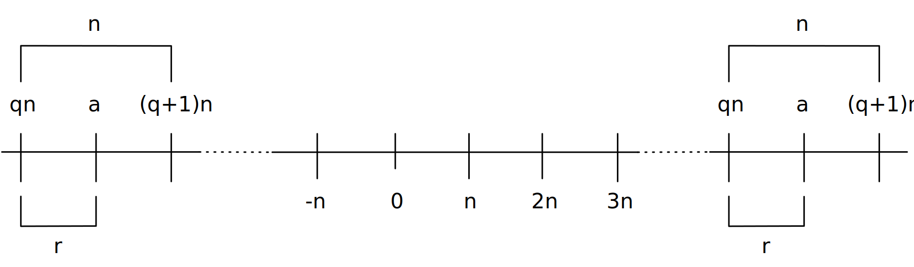
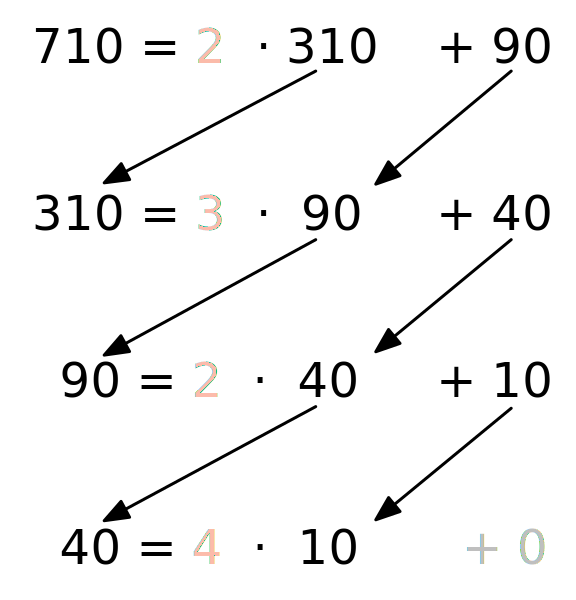

.. meta::
    :version: renaissance
    :author: Michael Eichberg
    :keywords: Zahlentheorie, Primzahlen, Teilbarkeit, Totientenfunktion, Euklidischer Algorithmus
    :description lang=en: Introduction to Number Theory
    :description lang=de: Einführung in die Zahlentheorie
    :id: sec-einfuehrung-in-die-zahlentheorie
    :first-slide: last-viewed
    :master-password: WirklichSchwierig!

.. include:: ../docutils.defs

Einführung in die Zahlentheorie
================================

:Dozent: `Prof. Dr. Michael Eichberg <https://delors.github.io/cv/folien.de.rst.html>`__
:Kontakt: michael.eichberg@dhbw.de
:Version: 1.1
:Quelle: Im Wesentlichen *Cryptography and Network Security - Principles and Practice, 8th Edition, William Stallings*

.. supplemental::

   :Folien:

          |html-source|

          |pdf-source|
   :Fehler melden:

          https://github.com/Delors/delors.github.io/issues

.. class:: new-section transition-scale

Teilbarkeit
-------------

Teilbarkeit
------------

.. class:: incremental-list

- Ein :math:`b` ungleich Null teilt :math:`a` wenn :math:`a = mb` für ein beliebiges :math:`m` und :math:`a`, :math:`b` und :math:`m` ganze Zahlen sind.

- :math:`b` teilt :math:`a` wenn es keinen Rest bei der Division gibt.

- Die Notation :math:`b|a` bedeutet, dass :math:`b`  :math:`a` teilt.

- Wenn :math:`b|a` gilt, dann sagen wir auch, dass :math:`b` ein Teiler von :math:`a` ist.

.. example::
    :class: incremental

    Die positiven Teiler von :math:`24` sind: :math:`1`, :math:`2`, :math:`3`, :math:`4`, :math:`6`, :math:`8`, :math:`12` und :math:`24`.

    Weitere Beispiele: :math:`13 | 182`; :math:`-5 | 30`; :math:`17 | 289`; :math:`-3 | 33`; :math:`17 | 0`.

Eigenschaften der Teilbarkeit
-------------------------------

.. class:: incremental-list

- Wenn :math:`a|1`, dann gilt :math:`a = \pm 1`.

- Wenn :math:`a | b` und :math:`b|a`, dann gilt :math:`a = \pm b`.

- Jedes :math:`b \neq 0` teilt :math:`0`.

- Wenn :math:`a | b` und :math:`b|c`, dann :math:`a|c`.

.. example::
    :class: incremental

    :math:`11|66, 66|198 \Rightarrow 11|198`

Eigenschaften der Teilbarkeit
-------------------------------

Wenn :math:`b | g` und :math:`b|h`, dann :math:`b|(mg+nh)` für beliebige ganze Zahlen :math:`m` und :math:`n`.

.. example::
    :class: incremental:

    :math:`3 | 27` und :math:`3|33 \Rightarrow 3|(m \times 27 + n \times 33)`

.. proof::
    :class: incremental

    Wenn :math:`b | g`, dann gilt für :math:`g`, dass :math:`g = b \times g_1` ist für eine beliebige ganze Zahl :math:`g_1`.

    Wenn :math:`b | h`, dann gilt für :math:`h`, dass :math:`h = b \times h_1` ist für eine beliebige ganze Zahl :math:`h_1`.

    Somit gilt: :math:`mg+nh = mb g_1 + n b h_1 = b \times (mg_1+nh_1)` und deshalb wird :math:`mg+mh` von teilt :math:`b` geteilt.

Teilungsalgorithmus
---------------------

Sei eine beliebige positive ganze Zahl :math:`n` gegeben und eine beliebige ganze Zahl :math:`a \geq 0`, so erhält man bei der Division von :math:`a` durch :math:`n`:

- einen ganzzahligen Quotienten :math:`q \in \mathbb{Z}` und
- einen nicht negativen, ganzzahligen Rest :math:`r \in \mathbb{N_0}`,

die der folgenden Beziehung gehorchen: :math:`a = qn + r; \quad 0 \leq r < n,\quad q = \left \lfloor{a/n} \right \rfloor`

.. image:: drawings/division_algorithm/division_algorithm.svg
    :alt: Die Beziehung a=qn+r
    :class: incremental
    :align: center

Teilungsalgorithmus für negative :math:`a`
-------------------------------------------

.. example::
    :class: incremental

    .. math::
        a = -11; n = 7; -11 = (-2)\times 7 + 3; \quad r = 3 \quad q = -2

Euklidischer Algorithmus
------------------------

Eine der grundlegenden Techniken der Zahlentheorie.

Verfahren zur Bestimmung des größten gemeinsamen Teilers (GGT) von zwei positiven ganzen Zahlen.

.. definition::

    Zwei ganze Zahlen sind **relativ prim** (:eng:`relatively prime`), wenn ihr einziger gemeinsamer positiver ganzzahliger Faktor 1 ist (z. B. 7 und 9, aber auch 3 und 8).

Größter Gemeinsamer Teiler (:ab:`GGT`)
------------------------------------------------------------------------------

(:eng:`Greatest Common Divisor (GCD)`)

.. class:: incremental-list

- Der größte gemeinsame Teiler von zwei ganzen Zahlen :math:`a` und :math:`b` ist die größte ganze Zahl, die sowohl :math:`a` als auch :math:`b` teilt.

- Wir verwenden die Schreibweise :math:`ggt(a,b)` für den GGT von :math:`a` und :math:`b`.

- Wir definieren :math:`ggt(0,0) = 0`.

- Die **positive** ganze Zahl :math:`c` wird als GGT von :math:`a` und :math:`b` bezeichnet, wenn:

    - :math:`c` ein Teiler von :math:`a` und :math:`b` ist
    - jeder Teiler von :math:`a` und :math:`b` ein Teiler von :math:`c` ist

Alternative Definition des :ab:`GGT`
---------------------------------------

.. math::

    ggt(a,b) = max[k, \text{so dass}\; k|a \text{ und } k|b]

.. example::
    :class: incremental

    :math:`ggt(60,24) =`

    .. class:: incremental

        :math:`ggt(60, -24) =`

    .. class:: incremental

        :math:`12`

:ab:`GGT` und „relativ prim“
-----------------------------------------

.. observation::

    Zwei ganze Zahlen :math:`a` und :math:`b` sind relativ prim, wenn ihr einziger gemeinsamer positiver ganzzahliger Faktor 1 ist.

    .. container:: text-align-center

        :math:`\Leftrightarrow`

    :math:`a` und :math:`b` sind relativ prim wenn :math:`ggt(a,b)=1`

Berechnung des GGT (:math:`ggt(a,b)`) mit Hilfe des euklidischen Algorithmus
-------------------------------------------------------------------------------

.. image:: drawings/euclidean_algorithm/algorithm.svg
    :align: center

Beispiel für die Berechnung des GGT (:math:`ggt(710,310)`) mit Hilfe des euklidischen Algorithmus
--------------------------------------------------------------------------------------------------------

Euklidischer Algorithmus
------------------------------------------------------------------------

:math:`ggt(1.160.718.174, 316.258.250)`

.. csv-table::
    :header: "Schritt", "Dividend", "Divisor", "Quotient", "Rest"
    :width: 100%
    :class: highlight-identical-cells-on-hover table-data-align-right incremental-table-rows

    1, 1.160.718.174, 316.258.250, 3, 211.943.424
    2, 316.258.250, 211.943.424, 1, 104.314.826
    3, 211.943.424, 104.314.826, 2, 3.313.772
    4, 104.314.826, 3.313.772, 31, 1.587.894
    5, 3.313.772, 1.587.894, 2, 137.984
    6, 1.587.894, 137.984, 11, 70.070
    7, 137.984, 70.070, 1, 67.914
    8, 70.070, 67.914, 1, 2.156
    9, 67.914, 2.156, 31, 1.078
    10, 2.156, **1.078**, 2, 0

.. class:: new-section transition-fade

Modulare Arithmetik
--------------------

Der Modulus
-----------

Wenn :math:`a` eine ganze Zahl und :math:`n` eine positive ganze Zahl ist, dann definieren wir :math:`a \bmod n` als  Rest der Division von :math:`a` durch :math:`n`. Die ganze Zahl :math:`n` wird als Modulus bezeichnet.

Somit gilt für jede ganze Zahl :math:`a`:

.. math::

    a = qn + r \quad 0 \leq r < n;\qquad q = \left\lfloor a / n \right\rfloor

    a =  \left\lfloor a / n \right\rfloor \times n + (a \bmod  n)

.. example::
    :class: incremental

    .. math::

        11 \bmod 7 = 4; \qquad -11 \bmod 7 = 3

Modulare Arithmetik (*kongruent modulo* :math:`n`)
----------------------------------------------------

- Zwei ganze Zahlen :math:`a` und :math:`b` werden als *kongruent modulo* :math:`n` bezeichnet, wenn :math:`(a \bmod n) = (b \bmod n)`

- Wir verwenden die Schreibweise :math:`a \equiv b\pmod{n}`.

- Beachten Sie, dass, wenn :math:`a \equiv 0 \pmod{n}` ist, dann gilt :math:`n|a`.

.. example::
    :class: incremental

    :math:`73 \equiv 4 \pmod{23}; \qquad 21 \equiv -9 \pmod{10}; \qquad 81 \equiv 0 \pmod{27}`

.. hint::
    :class: incremental

    Der Operator :math:`\text{mod}` wird ...

    (a) als binärer Operator verwendet, der einen Rest erzeugt, und
    (b) als Kongruenzrelation, die die Gleichwertigkeit zweier ganzer Zahlen anzeigt.

.. supplemental::

    Hinweis:

    :math:`21 \equiv -9 \pmod{10} \Leftrightarrow 21 \bmod 10 = -9 \bmod 10 = 1`

    :math:`-9 \mod 10 \Leftrightarrow -9 = n * 10 + 1`

Eigenschaften der Kongruenz
----------------------------

.. class:: incremental-list

1. :math:`a \equiv b \pmod{n}` wenn :math:`n|(a-b)` :peripheral:`(Siehe nächste Folie.)`
2. :math:`a \equiv b \pmod{n} \Rightarrow b \equiv a \pmod{n}`
3. :math:`a \equiv b \pmod{n}` und :math:`b \equiv c \pmod{n} \Rightarrow a \equiv c \pmod{n}`

:math:`a \equiv b \pmod{n}` wenn :math:`n|(a-b)` — Erklärt
----------------------------------------------------------------------

Wenn :math:`n|(a - b)`, dann gilt :math:`(a - b) = kn` für ein :math:`k`

- Wir können also schreiben :math:`a=b+kn`.

- Deshalb gilt :math:`(a \bmod n) = ((b + kn)\bmod n) =`

  Rest wenn :math:`b + kn` geteilt wird durch :math:`n` :math:`=`

  .. presenter-note::

    :math:`kn` ist notwendigerweise ein vielfaches von :math:`n`, da :math:`k` ganzzahlig ist und somit gilt, dass :math:`kn \bmod n = 0`. Mit anderen Worten :math:`(b+kn)\bmod n = b \bmod n` oder :math:`b+kn \equiv b \pmod{n}`.

  Rest wenn :math:`b` geteilt wird durch :math:`n` :math:`=`

  :math:`(b \bmod n)`

.. example::
  :class: incremental

  :math:`23 \equiv 8(\mod 5)`, da :math:`23 - 8 = 15 = 5 \times 3`

  .. class:: incremental

  :math:`-11 \equiv 5(\mod 8)`, da :math:`-11 - 5 = -16 = 8 \times -2`

  .. \qquad 5 \equiv -11\pmod{8}, 5 - (-11) = 8 \times 2

  .. class:: incremental

  :math:`81 \equiv 0(\mod 27)`, da :math:`81 - 0 = 81 = 27 \times 3`

.. supplemental::

    Im zweiten Schritt haben wir :math:`\bmod n` angewendet.

Eigenschaften der modularen Arithmetik
----------------------------------------

.. class:: incremental

1. :math:`[(a \bmod n) + (b \bmod n)] \bmod n = (a + b) \bmod n`
2. :math:`[(a \bmod n) - (b \bmod n)] \bmod n = (a - b) \bmod n`
3. :math:`[(a \bmod n) \times (b \bmod n)] \bmod n = (a \times b) \bmod n`

:math:`[(a \bmod n) + (b \bmod n)] \bmod n = (a + b) \bmod n` — Erklärt
--------------------------------------------------------------------------------

Definiere :math:`(a \bmod n) = r_a` und :math:`(b \bmod n) = r_b`.

Dann können wir:

- :math:`a = r_a + jn` für eine ganze Zahl :math:`j` und

- :math:`b = r_b + kn` für eine ganze Zahl :math:`k` schreiben.

Dann gilt:

.. math::

    \begin{array}{rcl}
    (a + b) \bmod n & = & (r_a + jn + r_b + kn) \bmod n \\
                    & = & (r_a + r_b + (k + j)n) \bmod n \\
                    & = & (r_a + r_b) \bmod n \\
                    & = & [(a \bmod n) + (b \bmod n)] \bmod n
    \end{array}

.. supplemental::

    Im vorletzten Schritt setzen wir die Definition vom Anfang ein und erhalten das Ergebnis.

Modulare Arithmetik (Beispiele für Eigenschaften)
-------------------------------------------------

.. example::

    .. math::

        11 \bmod 8 = 3;\qquad 15 \bmod 8 = 7

    .. class:: incremental-list

    - .. math::

        [(11 \bmod 8) + (15 \bmod 8)] \bmod 8 = [3 + 7] \bmod 8 = 10 \bmod 8 = 2

        (11 + 15) \bmod 8 = 26 \bmod 8 = 2

    - .. math::

        [(11 \bmod 8) - (15 \bmod 8)] \bmod 8 = [3-7] \bmod 8 = - 4 \bmod 8 = 4

        (11 - 15) \bmod 8 = -4 \bmod 8 = 4

    - .. math::

        [(11 \bmod 8) \times (15 \bmod 8)] \bmod 8= [3 \times 7] \bmod 8 =  21 \bmod 8 = 5

        (11 \times 15) \bmod 8 = 165 \bmod 8 = 5

Rechnung Modulo 8
------------------------------------------

.. grid::

    .. cell:: width-50

        .. definition::

            .. math::

                Z_n = \{0,1,...,(n-1)\}

    .. cell:: width-50 incremental

        .. example::

            .. math::

                Z_8 = \{0,1,2,3,4,5,6,7\}

.. deck:: incremental

    .. card::

        .. rubric:: Addition

        .. csv-table::
            :class: highlight-on-hover
            :align: center
            :stub-columns: 1
            :header: :math:`+`,"0","1","2","3","4","5","6","7"

            0,*0*,1,2,3,4,5,6,7
            1,1,2,3,4,5,6,7,*0*
            2,2,3,4,5,6,7,*0*,1
            3,3,4,5,6,7,*0*,1,2
            4,4,5,6,7,*0*,1,2,3
            5,5,6,7,*0*,1,2,3,4
            6,6,7,*0*,1,2,3,4,5
            7,7,*0*,1,2,3,4,5,6

    .. card::

        .. rubric:: Multiplikation

        .. csv-table::
            :class: highlight-on-hover
            :align: center
            :stub-columns: 1
            :header: :math:`\times`, "0","1","2","3","4","5","6","7"

            0, 0,0,0,0,0,0,0,0
            1, 0,*1*,2,3,4,5,6,7
            2, 0,2,4,6,0,2,4,6
            3, 0,3,6,*1*,4,7,2,5
            4, 0,4,0,4,0,4,0,4
            5, 0,5,2,7,4,*1*,6,3
            6, 0,6,4,2,0,6,4,2
            7, 0,7,6,5,4,3,2,*1*

        .. supplemental::

            Generator in Python:

            .. code:: Python
                :number-lines:
                :class: copy-to-clipboard

                for i in range(0,8):
                    print(str(i)+", ",end="")
                for j in range(0,8):
                    v = (i*j) % 8
                    if v == 1:
                        v = "*"+str(v)+"*"
                    else:
                        v = str(v)
                    print(v+",",end="")
                print()

Additive und Multiplikative Inverse Modulo 8
--------------------------------------------------------------------

.. grid::

    .. cell:: width-60

        .. definition::

            .. container::

                Die **negative/additive Inverse** einer ganzen Zahl :math:`x` ist die ganze Zahl :math:`y`, für die gilt: :math:`(x + y) \bmod 8 = 0`.

            .. container:: incremental

                Die **muliplikative Inverse** einer ganzen Zahl :math:`x` ist die ganze Zahl :math:`y`, für die gilt: :math:`(x \times y) \bmod 8 = 1`.

    .. cell:: width-40 incremental

        .. csv-table::
            :class: highlight-row-on-hover incremental-table-columns
            :header: :math:`w`, :math:`-w`, :math:`w^{-1}`
            :align: center
            :stub-columns: 1

            0, 0, :math:`-`
            1, 7, 1
            2, 6, :math:`-`
            3, 5, 3
            4, 4, :math:`-`
            5, 3, 5
            6, 2, :math:`-`
            7, 1, 7

Eigenschaften der modularen Arithmetik für ganze Zahlen in :math:`Z_n`
-----------------------------------------------------------------------

.. class:: dd-margin-left-12em incremental-list

:Kommutativgesetz:

    :math:`(w + x) \bmod n = (x + w) \bmod n`

    :math:`(w \times x) \bmod n = (x \times w) \bmod n`

:Assoziativgesetz:

    :math:`[(w + x) + y] \bmod n = [w + (x + y)] \bmod n`

    :math:`[(w \times x) \times y] \bmod n = [w \times (x \times y)] \bmod n`

:Distributivgesetz:

    :math:`[w \times (x + y)] \bmod n = [(w \times x) + (w \times y)] \bmod n`

:Identitäten:

    :math:`(0 + w) \bmod n = w \bmod n`

    :math:`(1 \times w) \bmod n = w \bmod n`

:Additive Inverse (-w):
    Für jedes :math:`w \in Z_n` gibt es ein :math:`z`, so dass :math:`w + z \equiv 0\; \pmod{n}`

Euklidischer Algorithmus - neu betrachtet
---------------------------------------------

.. theorem::

    Für beliebige ganze Zahlen :math:`a` und :math:`b` mit :math:`a \geq b \geq 0`,

    .. math::
        ggt(a,b) = ggt(b, a \bmod b)

.. grid::

    .. cell:: width-50

        **Algorithmus**

        .. code:: pseudocode
            :class: incremental-code
            :number-lines:

            def Euclid(a,b):
                if (b = 0) then
                    return a;
                else
                    return Euclid(b, a mod b);

    .. cell:: width-50

        .. example::
            :class: incremental

            .. code:: pseudocode

                ggt(10,6)
                    ↳ ggt(6,4)
                        ↳ ggt(4,2)
                            ↳ ggt(2,0)
                2              ↩︎

.. question::
    :class: incremental

    Um welche Art von rekursivem Algorithmus handelt es sich hierbei?

.. supplemental::

    In der gegebenen Formulierung ist der Algorithmus endrekursiv (:eng:`tail recursive`).

Erweiterter Euklidischer Algorithmus
--------------------------------------

- Erforderlich für Berechnungen im Bereich der endlichen Körper und Verschlüsselungsalgorithmen wie RSA.
- Für zwei ganze Zahlen :math:`a` und :math:`b` berechnet der erweiterte euklidische Algorithmus den GGT :math:`d`, aber auch zwei zusätzliche ganze Zahlen :math:`x` und :math:`y`, die die folgende Gleichung erfüllen:

.. math::
    x \times a + y \times b = d = ggt(a,b)

.. supplemental::

    Notwendigerweise haben :math:`x` und :math:`y` gegensätzliche Vorzeichen, da sonst :math:`(x \times a + y \times b) > a\; ( > b )` gelten würde und somit nicht den GGT darstellen könnte.

    Der erweiterte euklidische Algorithmus kann auf jeden Ring angewandt werden, in welchem eine Division mit kleinstem Rest durchgeführt werden kann. Ein Beispiel ist der Polynomring in einer Variablen mit rationalen oder reellen Koeffizienten wie sie bei der Verschlüsselung angewandt werden. Wir werden dies später wieder aufgreifen.

    Der erweiterte Algo. dient insbesondere der Berechnung der inversen Elemente in ganzzahligen Restklassenringen. :peripheral:`(Beides werden wir später in der Vorlesung betrachten).`

:math:`ggt(a=42,b=30)` mit erweitertem Euklidischen Algorithmus
------------------------------------------------------------------------------

Werfen wir einen Blick auf :math:`x \times a + y \times b` für einige :math:`x` und :math:`y`:

.. csv-table::
    :width: 100%
    :class: monospaced highlight-on-hover text-align-right
    :align: center
    :header: :math:`_у \\ ^x`, -3, -2, -1, 0, 1, 2, 3
    :stub-columns: 1
    :widths: 2 5 5 5 5 5 5 5

    -3, -216, -174, -132, -90, -48, -6, 36
    -2, -186, -144, -102, -60, -18, 24, 66
    -1, -156, -114, -72, -30, 12, 54, 96
    0, -126, -84, -42, 0, 42, 84, 126
    1, -96, -54, -12, 30, 72, 114, 156
    2, -66, -24, 18, 60, 102, 144, 186
    3, -36, 6, 48, 90, 132, 174, 216

.. hint::
    :class: incremental

    Der GGT von :math:`42` und :math:`30`: :math:`6` erscheint in der Tabelle (:math:`x = -2` und :math:`y = 3`).

Erweiterter Euklidischer Algorithmus :raw-html:` ` Systematische Berechnung für ggt(710,310)
------------------------------------------------------------------------------------------------------------------

.. grid::

    .. cell:: width-50

        .. image:: drawings/euclidean_algorithm/example.svg

    .. cell:: width-50 incremental

        Umgestellt:

        .. image:: drawings/euclidean_algorithm/example-umgestellt.svg

.. supplemental::

    Aufgrund der Umstellung z. B. von :math:`710 = 2 \times 310 + 90` nach :math:`90 = 710 - 2 \times 310` können wir dann im nächsten Schritt/der nächsten Formel die :math:`90` durch :math:`710 - 2 \times 310` ersetzen und werden dann :math:`310 - 3 \times(710 - 2 \times 310) = 40` erhalten.

    D. h. betrachten wir :math:`710` als :math:`a` und :math:`310` als :math:`b`, erhalten wir durch die Umstellung eine Formel, die nur aus :math:`a`\ s und :math:`b`\ s zuzüglich zweiter Koeffizienten und dem Rest r besteht.

Erweiterter Euklidischer Algorithmus - systematische Berechnung
-------------------------------------------------------------------

.. image:: drawings/euclidean_algorithm/example-ausgerechnet.svg
    :align: center

:math:`x = 7` und :math:`y = -16`

Erweiterter Euklidischer Algorithmus - Formeln
----------------------------------------------------

Wir nehmen an, dass wir bei jedem Schritt :math:`i` die ganzen Zahlen :math:`x_i` und :math:`y_i` finden können, die folgende Bedingung erfüllen: :math:`r_i = ax_i + by_i`.

.. math::

    \begin{matrix}
    Original & Erweiterung \\
    a = q_1b + r_1 & r_1 = ax_1 + by_1 \\
    b = q_2r_1 + r_2 & r_2 = ax_2 + by_2 \\
    r_1 = q_3r_2 + r_3 & r_3 = ax_3 + by_3 \\
    \vdots & \vdots \\
    \\
    r_{n-2} = q_nr_{n-1}+r_n & r_n=ax_n + by_n \\
    r_{n-1} = q_{n+1}r_n +0 & \\
    d = ggt(a,b) = r_n &
    \end{matrix}

Erweiterter Euklidischer Algorithmus
------------------------------------

.. csv-table::
    :width: 100%
    :class: highlight-line-on-hover font-size-70
    :header: Berechne, Was erfüllt, Berechne, Was erfüllt

    :math:`r_{-1} = a`, , :math:`x_{-1}=1;\; y_{-1}=0`, :math:`a = ax_{-1} + by_{-1}`
    :math:`r_{0} = b`, , :math:`x_0=0;\; y_{0}=1`, :math:`b = ax_{0} + by_{0}`
    ":math:`r_{1} = a \bmod b;\; q_1= \lfloor a/b \rfloor`", :math:`a=q_1b+r_1` , :math:`x_1=x_{-1} -q_1x_0 = 1`; :math:`y_1=y_{-1} -q_1y_0 = -q_1`, :math:`r_1 = ax_{1} + by_{1}`
    :math:`r_{2} = b \bmod r_1;\; q_2= \lfloor b/r_1 \rfloor`, :math:`b=q_2r_1+r_2` , :math:`x_2=x_{0} -q_2x_1;\; y_2=y_{0} -q_2y_1`, :math:`r_2 = ax_{2} + by_{2}`
    :math:`r_{3} = r_1 \bmod r_2;\; q_3= \lfloor r_1/r_2 \rfloor`, :math:`r_1=q_3r_2+r_3` , :math:`x_3=x_{1} -q_3x_2;\; y_3=y_{1} -q_3y_2`, :math:`r_3 = ax_{3} + by_{3}`
    :math:`\vdots`, :math:`\vdots`, :math:`\vdots`, :math:`\vdots`
    :math:`r_{n} = r_{n-2} \bmod r_{n-1}`; :math:`q_n= \lfloor r_{n-2}/r_{n-1} \rfloor`, :math:`r_{n-2}=q_nr_{n-1}+r_n` , :math:`x_n=x_{n-2} -q_nx_{n-1}`; :math:`y_n=y_{n-2} -q_ny_{n-1}`, :math:`r_n = ax_{n} + by_{n}`
    :math:`r_{n+1} = r_{n-1} \bmod r_{n} = 0`; :math:`q_{n+1}= \lfloor r_{n-1}/r_{n} \rfloor`, :math:`r_{n-1}=q_{n+1}r_{n}+0` , ,

.. container:: incremental

    **Lösung**

    :math:`d = ggt(a,b) = r_n; x = x_n; y = y_n`

Erweiterter Euklidischer Algorithmus - Beispiel :math:`ggt(1759,550)`
----------------------------------------------------------------------

.. csv-table::
    :header: :math:`i`, :math:`r_i`, :math:`q_i`, :math:`x_i`, :math:`y_i`
    :width: 100%
    :class: monospaced highlight-line-on-hover
    :align: center

    -1, 1759, , 1, 0
    0, 550, , 0, 1
    1, 109, 3, 1, -3
    2, 5, 5, -5, 16
    3, 4, 21, 106, -339
    4, 1, 1, -111, 355
    5, 0, 4, ,

Resultat: :math:`d=1; x= -111; y = 355`

.. class:: new-section transition-move-left

Primzahlen und Primzahlenbestimmung
-----------------------------------

Primzahlen
-------------

.. class:: incremental

   - Primzahlen haben als Teiler nur 1 und sich selbst.
   - Sie können nicht als Produkt von anderen Zahlen geschrieben werden.
   - Jede ganze Zahl :math:`a > 1` kann auf eindeutige Weise faktorisiert werden als: :math:`a=p_1^{a_1} \times p_2^{a_2} \times \ldots \times p_t^{a_t}` wobei :math:`p_1 < p_2 < \ldots < p_t` Primzahlen sind und wobei jedes :math:`a_i` eine positive ganze Zahl ist.

     :math:`a = \displaystyle \prod_{p \in P} p^{a_p}\quad \text{wenn } a_p \geq 0`
   - Dies ist als Fundamentalsatz der Arithmetik bekannt.

.. example::
    :class: incremental

    .. container::

        .. container:: inline-block

            :math:`15 =`

        .. container:: incremental inline-block

            :math:`2^0 \times 3^1 \times 5^1`

    .. container:: incremental

        .. container:: inline-block

            :math:`50 =`

        .. container:: incremental inline-block

            :math:`2^1 \times 3^0 \times 5^2`

    .. container:: incremental

        .. container:: inline-block

            :math:`60 =`

        .. container:: incremental inline-block

            :math:`2^2 \times 3^1 \times 5^1`

.. supplemental::

   Primzahlen spielen in der Zahlentheorie eine zentrale Rolle. Wir betrachten sie hier aber nur insoweit es für das Verständnis der Kryptographie notwendig ist.

Fermats (kleines) Theorem
-------------------------

.. note::
    :class: width-30

    Wichtig in der Public-Key-Kryptographie.

Besagt folgendes:

- Wenn :math:`p` eine Primzahl und :math:`a` eine positive ganze Zahl ist, die nicht durch :math:`p` teilbar ist (d.h. :math:`p\nmid a`), dann gilt :math:`a^{p-1} \equiv 1 (mod\;p)`

.. class:: incremental

    Alternative form:

    - Wenn :math:`p` eine Primzahl und :math:`a` eine positive ganze Zahl ist, dann ist :math:`a^p \equiv a\pmod{p}`

.. example::
    :class: incremental

    .. math::

        Sei\; p=7\; und\; a=2:

        (2^6 = 64) \equiv 1 \pmod{7},\qquad da\; 64/7 = 9\; Rest\; 1

.. supplemental::

    Mit anderen Worten: :math:`a` ist kein vielfaches von :math:`p`.

    Herleitung der alternativen Form:

    .. math::

        \begin{array}{rll}
            a^{p-1} \bmod p & = & 1 \bmod p \qquad & | \times a \bmod p \\
            a^{p-1} \bmod p \times a  \bmod p & = & a \bmod p & |  \bmod p \\
            (a^{p-1} \bmod p \times a  \bmod p) \bmod p & = & (a \bmod p)  \bmod p \\
            (a^{p-1} \times a) \bmod p & = & a \bmod p \\
            a^p \bmod p & = & a \bmod p
        \end{array}

Die Eulersche Totientenfunktion :math:`\phi(n)`
----------------------------------------------------------------

.. definition::

    :math:`\phi(n)` gibt die Anzahl der positiven ganzen Zahlen, die kleiner als :math:`n` und relativ prim zu :math:`n` sind an.

    .. supplemental::

        Per Konvention ist :math:`\phi(1) = 1`.

.. deck::
    :class: incremental

    .. card::

        Einige Werte von :math:`\phi(n)`:

        .. csv-table::
            :class: highlight-on-hover text-align-right
            :stub-columns: 1
            :header: 𝜑(n), +0, +1, +2, +3, +4, +5, +6, +7, +8, +9

            0+, / , 1, 1, 2, 2, 4, 2, 6, 4, 6
            10+, 4, 10, 4, 12, 6, 8, 8, 16, 6, 18
            20+, 8, 12, 10, 22, 8, 20, 12, 18, 12, 28
            30+, 8, 30, 16, 20, 16, 24, 12, 36, 18, 24
            40+, 16, 40, 12, 42, 20, 24, 22, 46, 16, 42
            50+, 20, 32, 24, 52, 18, 40, 24, 36, 28, 58
            60+, 16, 60, 30, 36, 32, 48, 20, 66, 32, 44
            70+, 24, 70, 24, 72, 36, 40, 36, 60, 24, 78
            80+, 32, 54, 40, 82, 24, 64, 42, 56, 40, 88
            90+, 24, 72, 44, 60, 46, 72, 32, 96, 42, 60

    .. card::

        .. example::

            :math:`\phi(6) = 2 = |\{1,5\}|`

            Test:

            :math:`ggt(1,6) = 1 \checkmark`

            :math:`ggt(2,6) = 2 ❌`

            :math:`ggt(3,6) = 3 ❌`

            :math:`ggt(4,6) = 2 ❌`

            :math:`ggt(5,6) = 1 \checkmark`

.. supplemental::

    Vgl. https://de.wikipedia.org/wiki/Eulersche_Phi-Funktion

Eulers Theorem
----------------

besagt, dass für jedes :math:`a` und :math:`n`, die relativ prim sind:

.. math::
        a^{\phi(n)} \equiv 1\pmod{n}

Eine alternative Form ist:

.. math::
        a^{\phi(n)+1} \equiv a \pmod{n}

Miller-Rabin-Primzahltest
-------------------------

- Viele kryptografische Algorithmen erfordern eine oder mehrere sehr große Primzahlen nach dem Zufallsprinzip.
- Der Miller-Rabin-Primzahltest ist ein probabilistischer Primzahltest, der schnell und einfach ist.

- Hintergrund: Jede positive ungerade ganze Zahl :math:`n \geq 3` kann ausgedrückt werden als:

  :math:`n-1 = 2^kq \qquad mit\; k > 0, q\; ungerade`

Miller-Rabin Algorithmus
-------------------------

.. code:: pseudocode
    :number-lines:
    :class: copy-to-clipboard

    TEST(n, k) # n > 2, eine ungerade ganze Zahl,
               #        die auf Primalität geprüft wird
               # k,     die Anzahl der Testrunden

    let s > 0 and d odd > 0 such that n−1 = pow(2,s)*d
    repeat k times:
        a ← random(2, n−2)
        x ← pow(a,d) mod n
        repeat s times:
            y ← sqr(x) mod n
            if y = 1 and x ≠ 1 and x ≠ n−1 then return “composite”
            x ← y
        if y ≠ 1 then return “composite”
    return “probably prime”

Deterministische Primzahltests
---------------------------------

.. class:: incremental

  - Vor 2002 gab es keine bekannte Methode, um für sehr große Zahlen effizient zu beweisen, dass diese Primzahlen sind.
  - Alle verwendeten Algorithmen lieferten ein probabilistisches Ergebnis.
  - Im Jahr 2002 entwickelten Agrawal, Kayal und Saxena einen Algorithmus, der „effizient“ bestimmt, ob eine gegebene große Zahl eine Primzahl ist:

    - Auch bekannt als AKS-Algorithmus.
    - Er scheint nicht so effizient zu sein wie der Miller-Rabin-Algorithmus.

Chinesischer Restsatz
---------------------------------------------------------------

(:eng:`Chinese Remainder Theorem (CRT)`)

.. note::
    :class: width-40

    Bietet eine Möglichkeit, (potenziell sehr große) Zahlen :math:`\bmod M` in Form von Tupeln kleinerer Zahlen zu manipulieren.

    - Dies kann nützlich sein, wenn :math:`M` 150 Ziffern oder mehr hat.
    - Es ist jedoch notwendig, die Faktorisierung von :math:`M` im Voraus zu kennen.

- Wurde vermutlich von dem chinesischen Mathematiker Sun-Tsu um 100 n. Chr. entdeckt [#]_.
- Eines der nützlichsten Ergebnisse der Zahlentheorie.
- Es besagt, dass es möglich ist, ganze Zahlen in einem bestimmten Bereich aus ihren Residuen modulo einer Menge von paarweise relativ primen Moduli zu rekonstruieren.
- Kann auf verschiedene Weise formuliert werden.

.. [#] Die Quellenlage bgzl. des genauen Datums ist unsicher und variiert teilweise um bis zu ca. 200 Jahre.

.. supplemental::

    Bei RSA rechnen wir mit Zahlen mit weit über 300 Ziffern.

    Von der Menge der paarweise relativ primen Moduli interessieren wir uns aber „nur“ für ein paar im Folgenden.

Chinesischer Restsatz - Beispiel in :math:`Z_{10}`
-------------------------------------------------------------

Nehmen wir an, dass die (*relativ prim/koprimalen*) Faktoren einer Zahl :math:`x`:

:math:`m_1 = 2` und :math:`m_2 = 5` sind.

.. container:: incremental

    Weiterhin seien die bekannten Reste der Division von :math:`x` durch :math:`m_1` bzw. :math:`m_2`: :math:`a_1 = r_{m_1} = 0` und :math:`a_2 = r_{m_2} = 3` sind.

    D. h. :math:`x\bmod 2 = 0` und :math:`x \bmod 5 = 3`; bzw. :math:`x \equiv 0 \pmod{2}` und :math:`x \equiv 3 \pmod{5}`.

.. class:: incremental

Da :math:`x\bmod 2 = 0` ist muss :math:`x` eine gerade Zahl sein; außerdem ist :math:`x \bmod 5 = 3`.

.. class:: incremental

Die eindeutige Lösung in :math:`Z_{10}` ist: :math:`8`.

.. container:: incremental

    Berechnung einer Lösung in :math:`Z`:

    .. grid::

        .. cell:: incremental width-30

            :math:`5 \times x_1 \equiv 1 \pmod{2}`

            :math:`2 \times x_2 \equiv 1 \pmod{5}`

        .. cell:: incremental width-20

            :math:`x_1 = 1`

            :math:`x_2 = 3`

        .. cell:: incremental width-50

            :math:`x = a_1 \times m_2 \times x_1 + a_2 \times m_1 \times x_2`

            :math:`x = 0 \times 5 \times 1 + 3 \times 2 \times 3 = 18`

.. supplemental::

    Man könnte auch folgendes Problem versuchen zu lösen: Wir haben :math:`x` Schokoladentafeln. Wenn wir diese fair auf zwei Personen verteilen, dann haben wir keinen Rest. Wenn wir diese jedoch auf 5 Personen aufteilen, dann haben wir 3 Tafeln übrig.  Wieviele Schokoladentafeln haben wir?

    (Zur Erinnerung: zwei Zahlen :math:`x` und :math:`y` sind relativ prim, wenn ihr größter gemeinsamer Teiler 1 ist.)

.. class:: center-content

Chinesische Restsatz - Zusammenfassung
-----------------------------------------

Der chinesische Restsatz wird häufig für Berechnungen mit großen ganzen Zahlen verwendet, da er es ermöglicht, eine Berechnung, für die man eine Grenze für die Größe des Ergebnisses kennt, durch mehrere ähnliche Berechnungen mit kleinen ganzen Zahlen zu ersetzen.

Das CRT findet in der Public-Key-Kryptographie Einsatz.

.. class:: exercises

Übung
---------------------------------

1. \

   .. exercise::

    Berechne :math:`5^9\, mod\, 7` ohne die Zuhilfenahme eines Taschenrechners.

    .. solution::
        :pwd: KeinTaschenrechner

        :math:`(5^9)\, mod\, 7 = (5^2 \times 5^2 \times 5^2 \times 5^2 \times 5) \, mod\, 7`

        :math:`= (5^2 \times 5^2 \times 5^2 \times 5^2 \times 5) \, mod\, 7 = (((5^2) \, mod\, 7)^4 \times (5\, mod\, 7))\, mod\, 7`

        :math:`= ((25 \, mod\, 7)^4 \times (5))\, mod \, 7`

        :math:`= (4^4 \times 5)\, mod \, 7`

        :math:`= (4^2 \times 4^2 \times 5)\, mod \, 7`

        :math:`= (2 \times 2 \times 5)\, mod \, 7`

        :math:`= (20)\, mod \, 7`

        :math:`= 6`

2. \

   .. exercise::

      Welche Zahlen sind relativ prim zu :math:`21`?

      .. solution::
        :pwd: ganz viele

        :math:`|\lbrace 1,2,4,5,8,10,11,13,16,17,19,20 \rbrace| = 12`

        (Zum Beispiel ist die :math:`6` nicht relativ prim zu :math:`21`, da :math:`ggt(6,21) = 3` gilt. Somit sind :math:`6` und :math:`21` nicht relativ prim.)

3. \

   .. exercise::

      Berechne :math:`ggt(1037,768)` mit Hilfe des Euklidischen Algorithmus.

      .. solution::
        :pwd: der ggt ist

        .. csv-table::
            :header: step, a,b,q,r

            1, 1037, 768, 1, 269
            2, 768, 269, 2, 230
            3, 269, 230, 1, 39
            4, 230, 39, 5, 35
            5, 39, 35, 1, 4
            6, 35, 4, 8, 3
            7, 4, 3, 1, 1
            8, 3, 1, 3, 0

        *Ergebnis ist: 1*

4. \

   .. exercise::

    Bestimme das Ergebnis von Euler's Totient Funktion :math:`\phi` für den Wert :math:`37` ohne das Ergebnis nachzuschlagen.

    .. solution::
        :pwd: 36-ist-das-Ergebnis

        Das Ergebnis ist 36, da 37 eine Primzahl ist und deswegen alle Zahlen von 1 bis 36 relativ prim zu 37 sind.

5. \

   .. exercise::

     Überzeugen Sie sich davon, dass der (kleine) Satz von Fermat gilt. Zum Beispiel für die Zahlen: :math:`a = 9` und :math:`p = 7`.

     .. solution::
        :pwd: _1_

        :math:`9^6\, mod\, 7 = 531441\, mod\, 7 = 1`

6. \

   .. exercise::

       Überzeugen Sie sich davon, dass der Satz von Euler gilt. Zum Beispiel für die Werte :math:`a=7` und :math:`n=9`.

       .. solution::
            :pwd: Satz von Euler

            :math:`\phi(9) = 6 = |\lbrace 1,2,4,5,7,8 \rbrace|`

            :math:`7^6\, mod\, 9 = 1`

7. \

   .. exercise::

      Führen Sie den Miller-Rabin Algorithmus für :math:`n = 37` aus.

      .. solution::
        :pwd: Wahrscheinlich prim

        ::

            Primzahltest für 37:

            k      s      a      x      y
            Runde 0:
            0      0     27     36      1
            0      1     27      1      1
            Runde 1:
            1      0     19      6     36
            1      1     19     36      1
            Runde 2:
            2      0     18     31     36
            2      1     18     36      1
            _____________________________
            Wahrscheinlich prim

        `Jupyter Notebook mit Miller-Rabin Algorithm. <https://github.com/Delors/Course_W3M20014/blob/main/1-miller-rabin-algorithm.ipynb>`__

8. \

   .. exercise::

    In einer Tüte sind :math:`x` Gummibärchen. Wenn Sie diese auf 4 Personen verteilen, dann haben Sie einen Rest von 2, verteilen Sie diese auf 7 Personen, dann haben Sie einen Rest von 3. Wie viele Gummibärchen sind in der Tüte? Wenden Sie den chinesischen Restsatz an.

    .. solution::
        :pwd: CRT!

        1. [Modellierung des Problems]

           :math:`x \equiv 2 \pmod{4}` und :math:`x \equiv 3 \pmod{7}`
        2. [Bestimme :math:`x_1` und :math:`x_2`]

           Sei :math:`a_1 = 2`, :math:`m_1 = 4`, :math:`a_2 = 3`, :math:`m_2 = 7`

           (Zur Erinnerung: :math:`m_2 \times x_1 \equiv 1 \pmod{m_1}` und :math:`m_1 \times x_2 \equiv 1 \pmod{m_2}`)

           Somit:

           :math:`(m_1 = 4) \times x_2 \equiv 1 \pmod{(m_2 = 7})` bzw.

           :math:`(m_2 = 7) \times x_1 \equiv 1 \pmod{(m_1 = 4})`

           d. h.:

           :math:`x_1 = 3` und :math:`x_2 = 2`

        3. [Berechne]

           :math:`x = 2 \times 7 \times 3 + 3 \times 4 \times 2 = 66`
