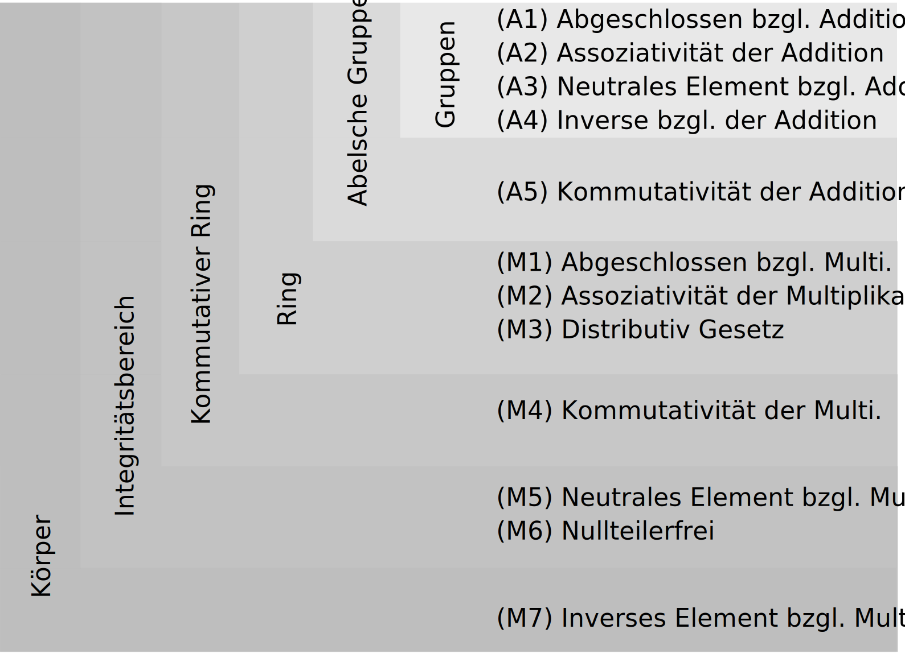
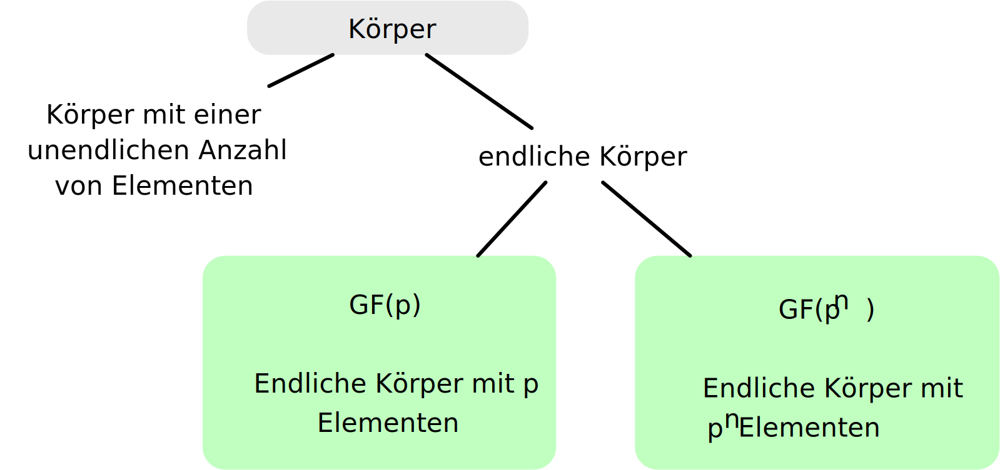
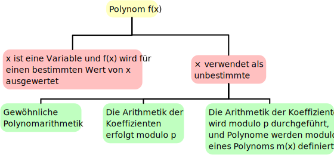

.. meta::
    :version: renaissance
    :author: Michael Eichberg
    :keywords: Gruppen, Ringe, Körper, Polynomarithmetik, endliche Körper
    :description lang=en: (Finite) Fields
    :description lang=de: (Endliche) Körper
    :id: sec-endliche_koerper
    :first-slide: last-viewed
    :master-password: WirklichSchwierig!

.. include:: ../docutils.defs

Endliche Körper
===============================================

:Dozent: `Prof. Dr. Michael Eichberg <https://delors.github.io/cv/folien.de.rst.html>`__
:Kontakt: michael.eichberg@dhbw.de
:Basierend auf: *Cryptography and Network Security - Principles and Practice, 8th Edition, William Stallings*
:Version: 1.1

.. supplemental::

  :Folien:
      [HTML] |html-source|

      [PDF] |pdf-source|
  :Fehler melden:
      https://github.com/Delors/delors.github.io/issues

Gruppen, Ringe und Körper
----------------------------

::

  ((((((
      endliche Körper
          in Körper)
              in Integritätsring)
                  in kommutative Ringe)
                      in Ringe)
                          in Abel'schen Gruppen)
                              in Gruppen)

.. supplemental::

    :Integritätsring: :eng:`Integral Domains`
    :Körper: :eng:`Fields`
    :neutrales Element: :eng:`Identity element`

    Übersetzungen mathematischer Fachbegriffe ins Deutsche:
    https://www.henked.de/woerterbuch.htm

Gruppen
-----------

Eine Menge von Elementen mit einer binären Operation :math:`\cdot`, die jedem geordneten Paar :math:`(a,b)` von Elementen in :math:`G` ein Element :math:`(a \cdot b ) \in G` zuordnet, so dass die folgenden Axiome befolgt werden:

.. presenter-note::

    Wir bezeichnen den Operator :math:`\cdot` als Punkt.

.. class:: incremental-list

:(A1) Abgeschlossenheit:
    Wenn :math:`a` und :math:`b` zu :math:`G` gehören, dann ist :math:`a \cdot b` auch in :math:`G`.

:(A2) Assoziativität:
    :math:`a \cdot ( b \cdot c ) = ( a \cdot b ) \cdot c` für alle :math:`a, b, c \in G`.

:(A3) Existenz eines neutralen Elements:
    Es gibt ein Element :math:`e \in G`, so dass :math:`a \cdot e = e \cdot a = a` für alle :math:`a \in G`

:(A4) Existenz eines inversen Elements:
    Für jedes :math:`a \in G` gibt es ein Element :math:`a'` \in G, so dass :math:`a \cdot a' = a' \cdot a = e`

Abel'sche Gruppen
------------------

(A1 bis A4) und:

:(A5) Kommutativität:
    :math:`a \cdot b = b \cdot a` für alle :math:`a, b \in G`

.. class:: excursion

Zyklische Gruppen
------------------------------

.. class:: incremental-list

- Die Potenzierung ist innerhalb einer Gruppe als eine wiederholte Anwendung des Gruppenoperators definiert, so dass :math:`a^3 = a \cdot a \cdot a`.
- Wir definieren:

  - :math:`a^0 = e` als das neutrale Element
  - :math:`a^{-n} = (a')^n` , wobei :math:`a'` das inverse Element von :math:`a` innerhalb der Gruppe ist.
- Eine Gruppe :math:`G` ist zyklisch, wenn jedes Element von :math:`G` eine Potenz :math:`a^k` (:math:`k` ist eine ganze Zahl) eines festen Elements :math:`a \in G` ist.
- Das Element :math:`a` erzeugt somit die Gruppe :math:`G`. :math:`a` ist somit der Generator von :math:`G`.
- Eine zyklische Gruppe ist immer abelsch und kann endlich oder unendlich sein.

.. supplemental::

    .. example::

        Eine Gruppe bestehend aus den natürlichen Zahlen :math:`{0,1,2,3,4,5,6}` mit der Addition :math:`\bmod 7` als Verknüpfung. In diesem Fall ist 3 das erzeugende Element.

        .. math::

            3^1 = 3\; mod\; 7 = 3

            3^2 = 3+3\; mod\; 7 = 6

            3^3 = 3+3+3\; mod\; 7 = 2

            3^4 = 3+3+3+3\; mod\; 7 = 5

            3^5 = 3+3+3+3+3\; mod\; 7 = 1

            3^6 = 3+3+3+3+3+3\; mod\; 7 = 4

            3^7 = 3+3+3+3+3+3+3\; mod\; 7 = 0

Ringe
------

.. story::

    .. class:: incremental-list

    - Ein Ring :math:`R`, manchmal auch als :math:`\lbrace R , + , \times \rbrace` bezeichnet, ist eine Menge von Elementen mit zwei binären Operationen, genannt Addition und Multiplikation, so dass für alle :math:`a , b , c \in R` die Axiome (A1-A5) erfüllt sind.

    - :math:`R` ist eine abelsche Gruppe in Bezug auf die Addition; das heißt, :math:`R` erfüllt die Axiome A1 bis A5. Für den Fall einer additiven Gruppe bezeichnen wir das neutrale Element als :math:`0` und den Kehrwert von :math:`a` als :math:`-a`.

    .. class:: incremental-list

    :(M1) Abgeschlossenheit der Multiplikation:
        Wenn :math:`a` und :math:`b` teil von :math:`R` sind, dann ist :math:`ab` auch in :math:`R`

    :(M2) Assoziativität der Multiplikation:
        :math:`a(bc) = (ab)c` für alle :math:`a,b,c \in R`

    :(M3) Distributivgesetz:
        :math:`a(b+c) = ab+ac` für alle :math:`a,b,c \in R`

        :math:`(a+b)c = ac+bc` für alle :math:`a,b,c \in R`

    .. summary::
        :class: incremental

        Im Wesentlichen ist ein Ring eine Menge, in der wir Addition, Subtraktion :math:`[a - b = a + (-b )]` und Multiplikation durchführen können, ohne die Menge zu verlassen.

    .. class:: incremental

    - Ein Ring wird als kommutativ bezeichnet, wenn er die folgende zusätzliche Bedingung erfüllt:

      :(M4) Kommutativität der Multiplikation:
        :math:`ab = ba` für alle :math:`a, b \in R`

Integritätsring
---------------------------------------

Ein kommutativer Ring, der den folgenden Axiomen gehorcht:

:(M5) Existenz eines neutralen Elements bzgl. der Multiplikation:
    Es gibt ein Element :math:`1` in :math:`R`, so dass :math:`a1 = 1a = a` für alle :math:`a \in R`

:(M6) Keine Nullteiler:
    Wenn :math:`a,b \in R` und :math:`ab = 0`, dann ist entweder :math:`a = 0` oder :math:`b = 0`

Körper
--------------------

.. story::

    .. class:: incremental

    - Ein Körper :math:`F`, manchmal auch bezeichnet als :math:`\lbrace F, +, \times \rbrace`, ist eine Menge von Elementen mit zwei binären Operationen, genannt Addition und Multiplikation, so dass für alle :math:`a, b, c \in F` die Axiome (A1-M6) gelten.

    .. class:: incremental

    :(M7) Existenz der multiplikativen Inversen:
        Für jedes :math:`a` in :math:`F`, außer :math:`0`, gibt es ein Element :math:`a^{-1} \in F`, so dass :math:`aa^{-1} = (a^{-1})a = 1`

    .. class:: incremental

    - Im Wesentlichen ist ein Körper eine Menge, in der wir Addition, Subtraktion, Multiplikation und Division durchführen können, ohne die Menge zu verlassen. Die Division ist mit der folgenden Regel definiert: :math:`a/b = a (b^{-1})`

    .. example::
        :class: incremental

        Bekannte Beispiele für Körper sind die rationalen Zahlen, die reellen Zahlen und die komplexen Zahlen.

    .. hint::
        :class: incremental

        Die Menge aller ganzen Zahlen mit den üblichen Operationen bildet keinen Körper, da nicht jedes Element der Menge ein multiplikatives Inverses hat.

.. supplemental::

    :math:`F` ist ein Integritätsbereich, d. h. :math:`F` erfüllt die Axiome A1 bis A5 und M1 bis M6

    Körper ≘ :eng:`Field`

.. class:: s-vertical-title

Eigenschaften von Gruppen, Ringen und Körpern
------------------------------------------------------------------------------------------------------------------

Unterteilung von Körpern
-----------------------------

Endliche Körper der Form :math:`GF(p)`
----------------------------------------

- Endliche Körper bilden die Grundlage von Fehlererkennungs- / Fehlerkorrekturcodes und insbesondere von bedeutenden kryptografischen Algorithmen.

.. container:: incremental

    .. note::
        :class: width-40

        Die Ordnung eines endlichen Körpers ist die Anzahl der Elemente des Körpers.

    - Es kann gezeigt werden, dass die Ordnung eines endlichen Körpers eine Potenz einer Primzahl :math:`p^n` sein muss, wobei :math:`n` eine positive ganze Zahl ist.
    - Der endliche Körper der Ordnung :math:`p^n` wird allgemein als :math:`GF(p^n)` bezeichnet.
    - GF steht für :eng:`Galois Field` (:ger:`Galoiskörper`), zu Ehren des Mathematikers, der als erster endliche Körper untersucht hat.

klassische Rechnung mit ganzen Zahlen modulo 8\ [#]_
------------------------------------------------------

.. grid::

    .. cell:: width-50

        .. rubric:: Addition Modulo 8

        .. csv-table::
            :class: highlight-on-hover highlight-identical-cells-on-hover
            :stub-columns: 1
            :header: ":math:`+`", 0, 1, 2, 3, 4, 5, 6, 7

            0, :red:`0`, 1, 2, 3, 4, 5, 6, 7
            1, 1, 2, 3, 4, 5, 6, 7, :red:`0`
            2, 2, 3, 4, 5, 6, 7, :red:`0`, 1
            3, 3, 4, 5, 6, 7, :red:`0`, 1, 2
            4, 4, 5, 6, 7, :red:`0`, 1, 2, 3
            5, 5, 6, 7, :red:`0`, 1, 2, 3, 4
            6, 6, 7, :red:`0`, 1, 2, 3, 4, 5
            7, 7, :red:`0`, 1, 2, 3, 4, 5, 6

    .. cell:: width-50 incremental

        .. rubric:: Multiplikation Modulo 8

        .. csv-table::
            :class: highlight-on-hover highlight-identical-cells-on-hover
            :stub-columns: 1
            :header: ":math:`\times`", 0, 1, 2, 3, 4, 5, 6, 7

            0, 0, 0, 0, 0, 0, 0, 0, 0
            1, 0, :red:`1`, 2, 3, 4, 5, 6, 7
            2, 0, 2, 4, 6, 0, 2, 4, 6
            3, 0, 3, 6, :red:`1`, 4, 7, 2, 5
            4, 0, 4, 0, 4, 0, 4, 0, 4
            5, 0, 5, 2, 7, 4, :red:`1`, 6, 3
            6, 0, 6, 4, 2, 0, 6, 4, 2
            7, 0, 7, 6, 5, 4, 3, 2, :red:`1`

.. [#] Hervorgehoben ist jeweils das inverse Element.

Additive and Muliplikative Inverse Modulo 8
--------------------------------------------

.. csv-table::
    :align: center
    :class: highlight-on-hover
    :stub-columns: 1
    :header: :math:`w`, :math:`-w`, :math:`w^{-1}`

    0,0,:math:`-`
    1,7,1
    2,6,:math:`-`
    3,5,3
    4,4,:math:`-`
    5,3,5
    6,2,:math:`-`
    7,1,7

klassische Rechnung mit ganzen Zahlen modulo 7\ [#]_
------------------------------------------------------

.. grid::

    .. cell:: width-50

        .. rubric:: Addition Modulo 7

        .. csv-table::
            :class: highlight-on-hover highlight-identical-cells-on-hover
            :stub-columns: 1
            :header: ":math:`+`", 0, 1, 2, 3, 4, 5, 6

            0, :red:`0`, 1, 2, 3, 4, 5, 6
            1, 1, 2, 3, 4, 5, 6, :red:`0`
            2, 2, 3, 4, 5, 6, :red:`0`, 1
            3, 3, 4, 5, 6, :red:`0`, 1, 2
            4, 4, 5, 6, :red:`0`, 1, 2, 3
            5, 5, 6, :red:`0`, 1, 2, 3, 4
            6, 6, :red:`0`, 1, 2, 3, 4, 5

    .. cell:: width-50 incremental

        .. rubric:: Multiplikation Modulo 7

        .. csv-table::
            :class: highlight-on-hover highlight-identical-cells-on-hover
            :stub-columns: 1
            :header: ":math:`\times`", 0, 1, 2, 3, 4, 5, 6

            0, 0, 0, 0, 0, 0, 0, 0
            1, 0, :red:`1`, 2, 3, 4, 5, 6
            2, 0, 2, 4, 6, :red:`1`, 3, 5
            3, 0, 3, 6, 2, 5, :red:`1`, 4
            4, 0, 4, :red:`1`, 5, 2, 6, 3
            5, 0, 5, 3, :red:`1`, 6, 4, 2
            6, 0, 6, 5, 4, 3, 2, :red:`1`

.. [#] Hervorgehoben ist jeweils das inverse Element.

Additive und Muliplikative Inverse Modulo 7
--------------------------------------------

.. csv-table::
    :align: center
    :class: highlight-on-hover
    :stub-columns: 1
    :header: :math:`w`, :math:`-w`, :math:`w^{-1}`

    0,0,:math:`-`
    1,6,1
    2,5,4
    3,4,5
    4,3,2
    5,2,3
    6,1,6

Der Körper GF(2)
------------------

.. grid::

    .. cell:: width-50

        .. rubric:: Addition

        .. csv-table::
            :class: highlight-on-hover
            :stub-columns: 1
            :header: ":math:`+`", 0, 1

            0, 0, 1
            1, 1, 0

    .. cell:: width-50 incremental

        .. rubric:: Multiplikation

        .. csv-table::
            :class: highlight-on-hover
            :stub-columns: 1
            :header: ":math:`\times`",0,1

            0, 0, 0
            1, 0, 1

.. container:: incremental

    .. rubric:: Inverse

    .. csv-table::
        :stub-columns: 1
        :header: ":math:`w`", ":math:`-w`", ":math:`w^{-1}`"

        0, 0, 0
        1, 0, 1

.. supplemental::

    Die Addition ist die XOR-Operation und die Multiplikation ist die AND-Operation.

Endliche Körper - Konstruktion
-----------------------------------

In diesem Abschnitt haben wir gezeigt, wie man endliche Körper der Ordnung :math:`p` konstruiert, wobei :math:`p` prim ist.

:math:`GF(p)` ist mit den folgenden Eigenschaften definiert:

1. :math:`GF(p)` besteht aus  :math:`p` Elementen.
2. Die binären Operationen :math:`+` und :math:`\times` sind über der Menge definiert. Die Operationen der Addition, Subtraktion, Multiplikation und Division können durchgeführt werden, ohne die Menge zu verlassen. Jedes Element der Menge, das nicht 0 ist, hat eine multiplikative Inverse.

.. summary::
    :class: incremental

    Wir haben gezeigt, dass die Elemente von :math:`GF(p)` die ganzen Zahlen :math:`\lbrace 0, 1, \ldots , p - 1 \rbrace` sind und dass die arithmetischen Operationen Addition und Multiplikation modulo :math:`p` sind.

.. supplemental::

    .. attention::

        Die modulare Arithmetik Modulo 8 ist *kein* Körper.

.. class:: transition-scale center-content no-title

Körper der Form :math:`GF(2^n)`
---------------------------------------------------------------

.. container:: accentuate

    Für eine effiziente Nutzung klassischer Computer benötigen wir einen endlichen Körper der Form :math:`GF(2^n)`.

.. class:: transition-fade

Die Behandlung von Polynomen
-------------------------------

.. supplemental::

    indeterminate ≘ :ger:`unbestimmte`

Beispiel für gewöhnliche Polynomarithmetik
------------------------------------------

.. story::

    .. class:: incremental-list

    :Addition:

        .. math::

            (x^3 + x^2 + 2) + (x^2 - x + 1)

        .. math::

            = x^3 + 2x^2 - x + 3

    :Subtraktion:

        .. math::

            (x^3 + x^2 + 2) - (x^2 - x + 1)

        .. math::

            = x^3 + x + 1

    :Multiplikation:

        .. math::
            (x^3 + x^2 + 2) \times (x^2 - x + 1) =

        .. math::

            \begin{array}{ c c c c c c c c c c c c c}
                                & & & & x^3 & + & x^2 & &  & + & 2 \\
                                & - & x^4 & - & x^3 & & & - & 2x & & & \\
                                x^5 & + & x^4 & & & + & 2x^2 & & & & &  = \\
                                \hline
                                x^{5} & & & & & + & 3x^2 & -& 2x & + & 2 &
            \end{array}

    :Division:

        .. math::

            (x^3 + x^2 + 2) : (x^2 - x + 1) = x + 2 + \left ( \frac{x}{x^2 - x + 1} \right )

Polynomarithmetik mit Koeffizienten in :math:`Z_p`
-------------------------------------------------------

.. class:: incremental-list

- Wenn jedes eindeutige Polynom als Element der Menge betrachtet wird, dann ist diese Menge ein Ring.
- Wenn die Polynomarithmetik auf Polynomen über einem Körper durchgeführt wird, dann ist die Division möglich.
- Wenn wir versuchen, eine Polynomdivision über eine Koeffizientenmenge durchzuführen, die kein Körper ist, dann ist die Division nicht immer definiert.

- Auch wenn die Koeffizientenmenge ein Körper ist, ist die Polynomdivision nicht unbedingt exakt; d. h. es gibt ggf. einen Rest.

  .. note::
        :class: width-40

        Das bedeutet nicht, dass eine exakte Teilung möglich ist.

- Unter der Voraussetzung, dass Reste erlaubt sind, dann ist die Polynomdivision möglich, wenn die Koeffizientenmenge ein Körper bildet.

Polynomiale Division
--------------------

.. story::

    .. class:: incremental-list

    • Wir können jedes Polynom in der Form schreiben: :math:`f(x) = q(x) g(x) + r(x)`

      • :math:`r(x)` kann als Rest interpretiert werden
      • Es gilt :math:`r(x) = f(x)\; mod\; g(x)`

    • Wenn es keinen Rest gibt, dann teilt :math:`g(x)` das Polynom :math:`f(x)`

      • Notation: :math:`g(x) | f(x)`
      • Wir können sagen, dass :math:`g(x)` ein Faktor von :math:`f(x)` ist oder
      • :math:`g(x)` ist ein Teiler von :math:`f(x)`

    • Ein Polynom :math:`f(x)` über einem Körper :math:`F` ist irreduzibel, genau dann wenn :math:`f(x)` nicht als Produkt zweier Polynome ausgedrückt werden kann, die beide Element von :math:`F` sind und beide einen niedrigeren Grad als :math:`f(x)` haben.

      Ein irreduzibles Polynom wird auch als Primpolynom bezeichnet.

    • Die Polynomdivision kann über die Multiplikation definiert werden. Sei :math:`a,b \in F` dann ist :math:`a/b = a \times b^{-1}`, wobei :math:`b^{-1}` das einzige Element des Körpers ist, für das :math:`bb^{-1} = 1` gilt.

      .. TODO: check if the above statement is only true if the field is defined over a prime!

Beispiel für Polynomarithmetik über GF(2)
-------------------------------------------

.. remember::

    .. math::

        \begin{matrix}
        1 + 1 & = & 1 - 1 & = 0 \\
        1 + 0 & = & 1 - 0 & = 1 \\
        0 + 1 & = & 0 - 1 & = 1
        \end{matrix}

.. deck:: incremental

    .. card::

        .. rubric:: Addition

        .. math::
            :class: font-size-80

            (x^7 + x^5 + x^4 + x^3 + x + 1) + (x^3 + x + 1) = x^7 + x^5 + x^4

    .. card::

        .. rubric:: Subtraktion

        .. math::
            :class: font-size-80

            (x^7 + x^5 + x^4 + x^3 + x + 1) - (x^3 + x + 1) = x^7 + x^5 + x^4

    .. card::

        .. rubric:: Multiplikation

        .. math::
            :class: font-size-80

            (x^7 + x^5 + x^4 + x^3 + x + 1) \times (x^3 + x + 1) =

        .. math::
            :class: font-size-80

            \begin{array}{cccccccccccccccccccc}
                & & & & x^7 & + & & & x^5 & +&  x^4 & + & x^3 & + & & & x & + & 1 \\
                & & x^8 & + & & & x^6 & + & x^5 & + & x^4 &+ & & & x^2 & + & x &  & & \\
                x^{10} & +  & x^8 & + & x^7 & + & x^6 & + & & & x^4 & + &
                x^3 & & & & & & &  = \\
                \hline
                x^{10} & & & & & & & & & + & x^4 & & & + & x^2 & & & + & 1
            \end{array}

    .. card::

        .. rubric:: Division

        .. math::
            :class: font-size-80

            \begin{array}{rccclcrccclcl}
                ( x^7 & + &  x^5 & + & x^4 & + & x^3 & + & x & + &  1 ) : (  x^3  + x  +  1 ) & = & x^4  +  1 \\
                - ( x^7 & + & x^5 & + & x^4)  & & & & & & & \color{lightgray} \hat{=} & \color{lightgray} -1 \times (x^3 + x + 1) \times x^4  \\
                & & & & & - ( & x^3 & + & x & + & 1) & \color{lightgray} \hat{=} & \color{lightgray} -1 \times (x^3 + x + 1)\times 1
            \end{array}

Bestimmung des GGTs zweier Polynome
----------------------------------------

.. class:: incremental-list

- Das Polynom :math:`c(x)` ist der größte gemeinsame Teiler von :math:`a(x)` und :math:`b(x)`, wenn die folgenden Bedingungen erfüllt sind:

  • :math:`c(x)` teilt sowohl :math:`a(x)` als auch :math:`b(x)`
  • Jeder Teiler von :math:`a(x)` und :math:`b(x)` ist auch ein Teiler von :math:`c(x)`

- Eine äquivalente Definition ist:

  :math:`ggt[a(x), b(x)]` ist das *Polynom maximalen Grades*, das sowohl :math:`a(x)` als auch  :math:`b(x)` teilt.

- Der euklidische Algorithmus kann erweitert werden, um den größten gemeinsamen Teiler von zwei Polynomen zu finden, deren Koeffizienten Elemente eines Körpers sind.

Arithmetik in :math:`GF(2^3)`\ [#]_
----------------------------------------------------------

.. [#] Die Definition der Addition/Multiplikation des endlichen Körpers :math:`GF(2^3)` wird in Kürze behandelt.

.. deck::

    .. card::

        .. rubric:: Addition

        .. csv-table::
            :align: center
            :class:  highlight-on-hover  highlight-identical-cells-on-hover
            :stub-columns: 2
            :header-rows: 2

            " ", " ", *000*, *001*, *010*, *011*, *100*, *101*, *110*, *111*
            " ", ":math:`+`", *0*, *1*, *2*, *3*, *4*, *5*, *6*, *7*
            *000*,  *0*, :red:`0`, 1, 2, 3, 4, 5, 6, 7
            *001*,  *1*, 1, :red:`0`, 3, 2, 5, 4, 7, 6
            *010*,  *2*, 2, 3, :red:`0`, 1, 6, 7, 4, 5
            *011*,  *3*, 3, 2, 1, :red:`0`, 7, 6, 5, 4
            *100*,  *4*, 4, 5, 6, 7, :red:`0`, 1, 2, 3
            *101*,  *5*, 5, 4, 7, 6, 1, :red:`0`, 3, 2
            *110*,  *6*, 6, 7, 4, 5, 2, 3, :red:`0`, 1
            *111*,  *7*, 7, 6, 5, 4, 3, 2, 1, :red:`0`

        .. supplemental::

            .. rubric:: Wiederholung

            Die Subtraktion zweier Elemente des Körpers kann über die Addition definiert werden. Seien :math:`a, b \in F` dann ist :math:`a - b = a + (-b)` , wobei :math:`-b` das einzige Element in :math:`F` ist, für das :math:`b + (-b) = 0` gilt (:math:`-b` wird als das Negativ von :math:`b` bezeichnet).

    .. card::

        .. rubric:: Multiplikation

        .. csv-table::
            :align: center
            :class:  highlight-on-hover  highlight-identical-cells-on-hover
            :stub-columns: 2
            :header-rows: 2

            " ", " ", *000*, *001*, *010*, *011*, *100*, *101*, *110*, *111*
            " ", ":math:`\times`", *0*, *1*, *2*, *3*, *4*, *5*, *6*, *7*
            *000*,  *0*, 0, 0, 0, 0, 0, 0, 0, 0
            *001*,  *1*, 0, :red:`1`, 2, 3, 4, 5, 6, 7
            *010*,  *2*, 0, 2, 4, 6, 3, :red:`1`, 7, 5
            *011*,  *3*, 0, 3, 6, 5, 7, 4, :red:`1`, 2
            *100*,  *4*, 0, 4, 3, 7, 6, 2, 5, :red:`1`
            *101*,  *5*, 0, 5, :red:`1`, 4, 2, 7, 3, 6
            *110*,  *6*, 0, 6, 7, :red:`1`, 5, 3, 2, 4
            *111*,  *7*, 0, 7, 5, 2, :red:`1`, 6, 4, 3

        .. remark::
            :class: incremental

            Die Anzahl der Vorkommen der ganzen Zahlen ungleich Null ist bei der Multiplikation einheitlich (Vor allem im Vergleich zu :math:`Z_8`); dies ist für kryptographische Zwecke förderlich.

    .. card::

        .. rubric:: Aditive (:math:`-w`) und Multiplikative Inverse (:math:`w^{-1}`)

        .. csv-table::
            :class: highlight-on-hover
            :align: center
            :stub-columns: 1
            :header: :math:`w`, :math:`-w`, :math:`w^{-1}`

            0,0,:math:`-`
            1,1,1
            2,2,5
            3,3,6
            4,4,7
            5,5,2
            6,6,3
            7,7,4

        :peripheral:`(Die Werte wurden aus den vorherigen Tabellen abgelesen.)`

Polynomarithmetik über :math:`GF(2^3)`
-----------------------------------------

Um den endlichen Körper :math:`GF(2^3)` zu konstruieren, müssen wir ein irreduzibles Polynom vom Grad 3 wählen, d. h. entweder :math:`(x^3+x^2+1)` oder :math:`(x^3+x+1)`.

.. container:: incremental

    Mit Multiplikationen modulo :math:`x^3 + x + 1` haben wir nur die folgenden acht Polynome in der Menge der Polynome über :math:`GF(2)`:

    .. math::

        0, 1, x, x^2, x+1, x^2 + 1, x^2 + x, x^2 + x + 1

.. hint::
    :class: incremental

    Der Verschlüsselungsalgorithmus **AES** führt die Arithmetik im endlichen Körper :math:`GF(2^8)` mit dem folgenden irreduziblen Polynom aus:

    .. math::

        m(x) = x^8 + x^4 + x^3 + x +1

.. supplemental::

    Die 8 Polynome sind die möglichen "Reste" bei der Division von Polynomen über :math:`GF(2^3)` mit :math:`x^3 + x + 1`.

Polynomarithmetik im :math:`GF(2^3)` Modulo :math:`(x^3 + x + 1)`
---------------------------------------------------------------------

.. deck::

    .. card::

        .. rubric:: Addition

        .. csv-table::
            :class: highlight-on-hover table-data-align-right highlight-identical-cells-on-hover font-size-80 compact
            :stub-columns: 2
            :header-rows: 2
            :width: 100%
            :widths: 4 10 10 10 10 10 10 10 10 10

            " ", " ", *000*, *001*, *010*, *011*, *100*, *101*, *110*, *111*
            " ", ":math:`+`", :math:`0`, :math:`1`, :math:`x`, :math:`x+1`, :math:`x^2`, :math:`x^2+1`, :math:`x^2+x`, :math:`x^2+x+1`
            *000*,  :math:`0`, :red:`0`, :math:`1`, :math:`x`, :math:`x+1`, :math:`x^2`, :math:`x^2 + 1`, :math:`x^2 + x`, :math:`x^2 + x + 1`
            *001*,  :math:`1`, :math:`1`, :red:`0`, :math:`x+1`, :math:`x`, :math:`x^2 + 1`, :math:`x^2`, :math:`x^2 + x + 1`, :math:`x^2 + x`
            *010*,  :math:`x`, :math:`x`, :math:`x+1`, :red:`0`, :math:`1`, :math:`x^2 + x`, :math:`x^2 + x + 1`, :math:`x^2`, :math:`x^2 + 1`
            *011*,  :math:`x+1`, :math:`x+1`, :math:`x`, :math:`1`, :red:`0`, :math:`x^2 + x + 1`, :math:`x^2 + x`, :math:`x^2 + 1`, :math:`x^2`
            *100*,  :math:`x^2`, :math:`x^2`, :math:`x^2 + 1`, :math:`x^2 + x`, :math:`x^2 + x + 1`, :red:`0`, :math:`1`, :math:`x`, :math:`x+1`
            *101*,  :math:`x^2+1`, :math:`x^2 + 1`, :math:`x^2`, :math:`x^2 + x + 1`, :math:`x^2 + x`, 1, :red:`0`, :math:`x+1`, :math:`x`
            *110*,  :math:`x^2+x`, :math:`x^2 + x`, :math:`x^2 + x + 1`, :math:`x^2`, :math:`x^2 + 1`, x, :math:`x+1`, :red:`0`, :math:`1`
            *111*,  :math:`x^2+x+1`, :math:`x^2 + x + 1`, :math:`x^2 + x`, :math:`x^2 + 1`, :math:`x^2`, :math:`x+1`, :math:`x`, :math:`1`, :red:`0`

    .. card::

        .. rubric:: Multiplikation

        .. csv-table::
            :class: highlight-on-hover highlight-identical-cells-on-hover table-data-align-right font-size-80 compact
            :stub-columns: 2
            :header-rows: 2
            :width: 100%
            :widths: 4 10 10 10 10 10 10 10 10 10

            " ", " ", *000*, *001*, *010*, *011*, *100*, *101*, *110*, *111*
            " ", ":math:`\times`", :math:`0`, :math:`1`, :math:`x`, :math:`x+1`, :math:`x^2`, :math:`x^2+1`, :math:`x^2+x`, :math:`x^2+x+1`
            *000*,  :math:`0`, 0, 0, 0, 0, 0, 0, 0, 0
            *001*,  :math:`1`, 0, :red:`1`, :math:`x`, :math:`x+1`, :math:`x^2`, :math:`x^2 + 1`, :math:`x^2 + x`, :math:`x^2 + x + 1`
            *010*,  :math:`x`, 0, :math:`x`, :math:`x^2`, :math:`x^2 + x`, :math:`x+1`, :red:`1`, :math:`x^2 + x + 1`, :math:`x^2 + 1`
            *011*,  :math:`x+1`, 0, :math:`x+1`, :math:`x^2 + x`, :math:`x^2 + 1`, :math:`x^2 + x + 1`, :math:`x^2`, :red:`1`, :math:`x`
            *100*,  :math:`x^2`, 0, :math:`x^2`, :math:`x+1`, :math:`x^2 + x + 1`, :math:`x^2 + x`, :math:`x`, :math:`x^2 + 1`, :red:`1`
            *101*,  :math:`x^2+1`, 0, :math:`x^2 + 1`, :red:`1`, :math:`x^2`, :math:`x`, :math:`x^2 + x + 1`, :math:`x+1`, :math:`x^2 + x`
            *110*,  :math:`x^2+x`, 0, :math:`x^2 + x`, :math:`x^2 + x + 1`, :red:`1`, :math:`x^2 + 1`, :math:`x+1`, :math:`x`, :math:`x^2`
            *111*,  :math:`x^2+x+1`, 0, :math:`x^2 + x + 1`, :math:`x^2 + 1`, :math:`x`, :red:`1`, :math:`x^2 + x`, :math:`x^2`, :math:`x+1`

.. replacements, e.g., 5 == x^2+1

.. example::
    :class: incremental

    .. math::

        \begin{array}{rllll}
            ((x^2 \times (x^2 + 1)) = & x^4 + x^2 ) & \bmod (x^3 + x + 1) = & x & \text{(D. h. } x \text{ ist der Rest!)} \\
            ((x^2 \times x^2) = & x^4) & \bmod (x^3 + x + 1) = &  x^2 + x &
        \end{array}

Multiplikation in :math:`GF(2^n)`
----------------------------------

- Mit keiner einfachen Operation lässt sich die Multiplikation in :math:`GF(2^n)` erreichen.
- Es gibt jedoch eine vernünftige, unkomplizierte Technik.

.. admonition:: "Beispiel: Multiplikation in :math:`GF(2^8)` wie von AES verwendet"

    Beobachtung: :math:`x^8\;mod\; m(x) = [m(x)-x^8] = x^4 +x^3 +x +1`

    Es folgt, dass die Multiplikation mit :math:`x` (d. h., :math:`0000\,0010`) als 1-Bit-Linksverschiebung gefolgt von einer bedingten bitweisen XOR-Operation mit :math:`0001\,1011` implementiert werden kann:

    .. math::
        x \times f(x) =
        \begin{cases}
            (b_6b_5b_4b_3b_2b_1b_00) & wenn\; b_7 = 0\\
            (b_6b_5b_4b_3b_2b_1b_00) \oplus 0001 1011 & wenn\; b_7 = 1\\
        \end{cases}

    Multiplikation mit einer höheren Potenz von :math:`x` kann durch wiederholte Anwendung der vorherigen Gleichung erreicht werden. Durch Hinzufügen von Zwischenergebnissen kann die Multiplikation mit einer beliebigen Konstanten in :math:`GF(2^n)` erreicht werden.

.. supplemental::

    Das von **AES** verwendete Polynom ist:

    .. math::

        m(x) = x^8 + x^4 + x^3 + x +1

    Bzgl. der  Beobachtung: Wenn wir zum Beispiel das Polynom :math:`x^7` multiplizieren mit :math:`x` gilt:

    .. math::

        (x^7 \times x = x^8)\; mod\; m(x) = x^4 + x^3 + x + 1

    da

    .. math::

        { x^8 \over { x^8 + x^4 + x^3 + x + 1 } } = 1\; Rest\; x^4 + x^3 + x + 1.

    1. Beispiel:

    .. math::

        (x^7 + x^6 + 1) \times x = (x^8 + x^7 + x)\; mod\; m(x)

    Hilfsrechnung:

    .. math::
        \begin{matrix}
        x^8 + & x^7 + & & &  & & & x & & / ( x^8 + x^4 + x^3 + x + 1 )= 1\; Rest\; x^7 +x^4 + x^3 +1 \\
        - (x^8 + & & & & x^4 + & x^3 +& & x + & 1 ) \\
          & x^7 + & & & x^4 + &x ^3 + & & & 1 &
        \end{matrix}

    2. Beispiel:

    .. math::

        x^7 \times x^2 = (x^9)\; mod\; m(x)

    Hilfsrechnung:

    .. math::
        \begin{matrix}
        x^9 & & & & & & & & & / ( x^8 + x^4 + x^3 + x + 1 ) = x\; Rest\; x^5 + x^4 + x^2 + x \\
        -( x^9 + & & & & x^5 + & x^4 + & & x^2 + & x )
        \end{matrix}

    .. container:: minor

        Die Multiplikation mit :math:`x^2` kann durch die zweifache Multiplikation mit :math:`x` unter Anwendung der obigen Gleichung erreicht werden kann. D. h. :math:`x^7 \times x^2 = (x^7 \times x) \times x`

Überlegungen zur Berechnung
-----------------------------

- Da die Koeffizienten 0 oder 1 sind, kann ein solches Polynom als Bitfolge dargestellt werden

  .. class:: list-with-explanations

  - Addition ist ein XOR dieser Bitstrings
  - Multiplikation ist eine Linksverschiebung gefolgt von einem XOR

    (vgl. klassische Multiplikation per Hand.)

- Die Modulo-Reduktion erfolgt durch wiederholtes Ersetzen der höchsten Potenz durch den Rest des irreduziblen Polynoms (auch Shift und XOR)

.. class:: exercises transition-fade

Übung
------

.. exercise:: Repräsentation von Polynomen

    Füllen Sie die fehlenden Werte aus (:math:`GF(2^m)`)

    .. csv-table::
        :header: Polynomial, Binary, Decimal

        :math:`x^7 +x^6 +x^4 +x+1`, ,
        , 11001001,
        , , 133
        :math:`x^4 +x^2 +x`, ,
        , 00011001
        , , 10

    .. solution::
        :pwd: Fehlende Werte

        .. csv-table::
            :header: Polynomial, Binary, Decimal

            :math:`x^7 +x^6 +x^4 +x+1`, 11010011, 211
            :math:`x^7 +x^6 +x^3 +1`, 11001001, 201
            :math:`x^7 +x^2 +1` , 10000101, 133
            :math:`x^4 +x^2 +x`, 00010110 , 22
            :math:`x^4 +x^3 +1`, 00011001, 25
            :math:`x^3 +x`, 00001010, 10

.. class:: exercises transition-fade

Übung
------

.. exercise:: Polynomarithmetik im GF(2^5)

   Gegeben sei :math:`GF(2^5)` mit dem irreduziblen Polynom :math:`p(x) = x^5 + x^2 + 1`

   .. class:: list-with-explanations

    1. Berechne: :math:`(x^3 + x^2 + x + 1) - (x+1)`
    2. Berechne: :math:`(x^4 + x) \times (x^3 + x^2)`
    3. Berechne: :math:`(x^3) \times (x^2 + x^1 + 1)`
    4. Berechne: :math:`(x^4+x)/(x^3+x^2)` geben :math:`(x^3+x^2)^{-1} =(x^2+x+1)`

        Zur Erinnerung: Division kann als Multiplikation definiert werden. Seien :math:`a, b \in F`, dann ist :math:`a/b = a \times (b^{-1})`, wobei :math:`b^{-1}` die Umkehrung von :math:`b` ist.
    5. Verifiziere: :math:`(x^3+x^2)^{-1}=(x^2+x+1)`

    .. solution::
        :pwd: 5 Loesungen

        1. :math:`x^3 + x^2`
        2. :math:`f(x)=(x^4+x)·(x^3+x^2)\; mod\; p(x)= (x^7+x^6+x^4+x^3)\; mod\; p(x)=x^2+x`
        3. :math:`x^4 +x^3 +x^2 +1`
        4. :math:`x^4 + 1`
        5. Verifikation:

           1. Multiplikation von :math:`(x^3+x^2) \times (x^2+x+1) = x^5 + x^2`
           2. Modulo :math:`p(x) = x^5 + x^2 + 1`
           3. Das Resultat ist Rest 1. (D. h. die multiplikative Inverse von :math:`(x^3+x^2)^{-1}` ist :math:`(x^2+x+1)`)

.. class:: exercises transition-fade

Übung
----------------------------

.. exercise:: Einfache Polynomarithmetik im GF(2^8)

    Nehmen wir an, dass 7 und 3 stellvertretend für die Bitmuster der Koeffizienten des Polynoms stehen.

    - Berechne: :math:`7d - 3d`
    - Berechne: :math:`7d + 3d`

    .. solution::
        :pwd: 0x04

        ::

            7 = 0000 0111
            3 = 0000 0011
            xor =>.. 0100

        Die Lösung ist in beiden Fällen: 4 (d. h. Addition und Subtraktion sind gleich; jeder Wert ist sein additiver Kehrwert).

.. exercise:: Polynommultiplikation im GF(2^8)

    .. class:: list-with-explanations

    - Berechne: :math:`(0x03\; \times\; 0x46) \qquad`

      (0x3 und 0x46 sind die Hexadezimaldarstellungen der Koeffizienten des Polynoms und diese repräsentieren (auch nur) die Bitmuster der Koeffizienten des Polynoms.)

    .. solution::
        :pwd: 0xCA

        ::

            0x03 = 0000 0011
            0x46 = 0100 0110

            0x03 * 0x46 =      0x46 ⊕ (0x02 * 0x46) =
                          0100 0110 ⊕   1000 1100   = 1100 1010
                                                    = 202
                                                    = 0xCA

        .. math::

            0x03 \times 0x46 = 0x46 \oplus (0x02 \times 0x46)

            = 0100\, 0110_b \oplus 1000\, 1100_b = 1100\,1010_b = 202_d = 0xCA
