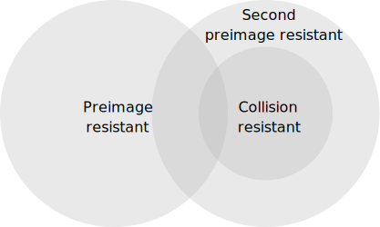
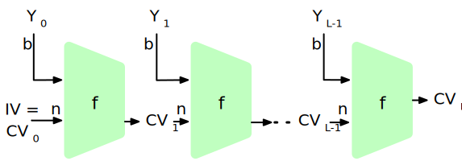
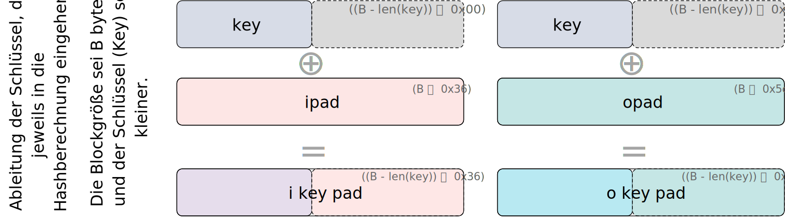

.. meta::
    :author: Michael Eichberg
    :keywords: Kryptografische Hash Funktionen, SHA
    :description lang=en: Cryptographic Hash Functions
    :description lang=de: Kryptografische Hashfunktionen
    :id: lecture-security-hash_functions
    :first-slide: last-viewed
    :master-password: WirklichSchwierig!

.. include:: ../docutils.defs

Kryptografische Hash Funktionen
===============================================

:Dozent: `Prof. Dr. Michael Eichberg <https://delors.github.io/cv/folien.de.rst.html>`__
:Kontakt: michael.eichberg@dhbw.de
:Version: 2.3.2

.. class:: sources

:Quelle: *Cryptography and Network Security - Principles and Practice, 8th Edition, William Stallings*

.. supplemental::

    :Folien:
        [HTML] |html-source|

        [PDF] |pdf-source|
    :Fehler melden:
        https://github.com/Delors/delors.github.io/issues

    :Kontrollaufgaben:

        .. source:: kontrollaufgaben.de.rst
            :path: relative
            :prefix: https://delors.github.io/
            :suffix: .html

.. class:: new-section

Hashfunktionen - Grundlagen
------------------------------------------------

Hashfunktionen
-------------------------------

.. class:: incremental-list

- Eine Hashfunktion :math-i:`H` akzeptiert eine beliebig lange Nachricht :math-i:`M` als Eingabe und gibt einen Wert fixer Größe zurück: :math-i:`h = H(M)`.
- Wird oft zur Gewährleistung der Datenintegrität verwendet. Eine Änderung eines beliebigen Bits in :math-i:`M` sollte mit hoher Wahrscheinlichkeit zu einer Änderung des Hashwerts :math-i:`h` führen.
- Kryptographische Hashfunktionen werden für Sicherheitsanwendungen benötigt. Mögliche Anwendungen:

  - Authentifizierung von Nachrichten
  - Digitale Signaturen
  - Speicherung von Passwörtern

Beispiel: Berechnung von Hashwerten mittels MD5
-------------------------------------------------------

::

    md5("Hello") = 8b1a9953c4611296a827abf8c47804d7
    md5("hello") = 5d41402abc4b2a76b9719d911017c592
    md5("Dieses Passwort ist wirklich total sicher
         und falls Du es mir nicht glaubst, dann
         tippe es zweimal hintereinander blind
         fehlerfrei ein.")
                 = 8fcf22b1f8327e3a005f0cba48dd44c8

.. warning::
    :class: incremental

    Die Verwendung von MD5 dient hier lediglich der Illustration. In realen Anwendung sollte MD5 nicht mehr verwendet werden, da es nachgewiesene Schwachstellen aufweist.

Sicherheitsanforderungen an kryptografische Hashfunktion
----------------------------------------------------------

.. story::

    .. class:: incremental-list

    :Variable Eingabegröße: :math-i:`H` kann auf einen Block beliebiger Größe angewendet werden.

    :Pseudozufälligkeit: Die Ausgabe von :math-i:`H` erfüllt die Standardtests für Pseudozufälligkeit.

    :Einweg Eigenschaft:

        Es ist rechnerisch/praktisch nicht machbar für einen gegeben Hashwert :math-i:`h` ein :math-i:`N` zu finden so dass gilt: :math-i:`H(N) = h`

        (:eng:`Preimage resistant; one-way property`)

        .. presenter-note::

            Es ist also *praktisch* unmöglich die ursprüngliche Nachricht zu finden die auf den Hashwert abbildet. (Zum Beispiel bei Passwörtern notwendig!)

    :Schwache Kollisionsresistenz:

        Es ist rechnerisch nicht machbar für eine gegebene Nachricht :math-i:`M` eine Nachricht :math-i:`N` zu finden so dass gilt: :math:`M \neq N` mit :math:`H(M) = H(N)`

        (:eng:`Second preimage resistant; weak collision resistant`)

        .. presenter-note::

            Sehr relevant, wenn wir ein Dokument signieren wollen und sicherstellen müssen, dass das Dokument nicht nachträglich gefälscht werden kann.

    :Starke Kollisionsresistenz:

        Es ist rechnerisch unmöglich ein paar :math:`(N,M)` zu finden so dass gilt: :math:`H(M) = H(N)`.

        (:eng:`Collision resistant; strong collision resistant`)

        .. presenter-note::

            D. h. der Angreifer darf *zwei Nachrichten frei wählen* und somit ist es so, dass dies eine stärkere Anforderung an den Hashalgorithmus ist, da er mehr Angriffsmöglichkeiten hat. Bei der schwachen reicht es aus, wenn der Hashalgorithmus so gut ist, dass es nicht möglich ist *zu einer gegegebenen Nachricht eine Zweite zu finden*.

.. supplemental::

    **Hintergrund**

    Im Deutschen wird auch von Urbild-Angriffen gesprochen. In dem Fall ist *preimage resistance* (d. h. die Einweg Eigenschaft) gleichbedeutend damit, dass man nicht effektiv einen „Erstes-Urbild-Angriff“ durchführen kann. Hierbei ist das Urbild die ursprüngliche Nachricht :math:`M`, die *gehasht* wurde.

    *Second preimage resistance* ist dann gleichbedeutend damit, dass man nicht effektiv einen „Zweites-Urbild-Angriff“ durchführen kann. Es ist nicht möglich zu einer Nachricht M eine zweite Nachricht N (d. h. ein zweites Urbild) zu finden, die für eine gegebene Hashfunktion den gleichen Hash aufweist.

Beziehung zwischen den Sicherheitsanforderungen an Hashfunktionen
------------------------------------------------------------------

.. supplemental::

    Dass die *collision resistance* (:ger:`starke Kollisionsresistenz`) eine stärkere Anforderung ist als die *second preimage resistance*, lässt sich wie folgt erklären: Bei *second preimage resistance* geht es darum, dass zu einer gegebenen, fixen Nachricht ein Angreifer ggf. eine zweite Nachricht finden soll.

    Bei *collision resistance* geht es darum, dass ein Angreifer „irgendwelche“ zwei beliebigen Nachrichten finden kann, die den gleichen Hashwert haben. Ein solcher Angriff hat nur einen Aufwand von :math:`O(\sqrt{2^{n}})`, was durch das Geburtstagsparadoxon erklärt werden kann.

Nachrichtenauthentifizierung - vereinfacht
-------------------------------------------------------
.. deck::

    .. card::

        Nachrichten können auf verschiedene Weisen authentifiziert werden, so dass *Person-in-the-Middle-Angriffe*\ [#]_ verhindert werden können.

    .. card::

        .. figure:: drawings/digests/all_encrypted.svg
            :align: center

            Garantiert Authentizität und Vertraulichkeit.

    .. card::

        .. figure:: drawings/digests/hash_encrypted.svg
            :align: center

            Garantiert Authentizität, benötigt aber sowohl Hashing als auch Verschlüsselung.

    .. card::

        .. figure:: drawings/digests/secret_appended.svg
            :align: center

            Garantiert Authentizität und es wird nur ein Hashalgorithmus benötigt; anfällig für bestimmte Angriffe - insbesondere gegen Angriffe mit Längenerweiterung bei Hashverfahren basierend auf Merkle-Damgard Konstruktionen.

    .. card::

        .. figure:: drawings/digests/secret_encrypted.svg
            :align: center

            Garantiert Authentizität und Vertraulichkeit.

.. [#] *Person-in-the-Middle* (in Standards auch *on-path attack*) ist die gender-neutrale Version von *man-in-the-Middle*.

.. supplemental::

    **Szenarien**

    Im ersten Szenario wird der Hash an die Nachricht angehängt und als Ganzes verschlüsselt. Wir erhalten Vertraulichkeit und Authentizität.

    Im zweiten Szenario wird der Hash der Nachricht berechnet und dann verschlüsselt. Der Empfänger kann den Hash berechnen und mit dem entschlüsselten Hash vergleichen. Wir erhalten Authentizität, aber keine Vertraulichkeit.

    Im dritten Szenario wird an die Nachricht ein geteiltes Secret angehängt und  alles zusammen gehasht. Die Nachricht wird dann mit dem Ergebnis der vorhergehenden Operation zusammen verschickt.

    Im letzten Szenario werden alle Ansätze kombiniert.

    .. legend::

        :M: die Nachricht
        :H: die Hashfunktion
        :E: der Verschlüsselungsalgorithmus
        :D: der Entschlüsselungsalgorithmus
        :K: ein geheimer Schlüssel
        :S: eine geheime Zeichenkette
        :||: die Konkatenation von zwei Werten (d. h. das Aneinanderhängen von zwei Werten)

    .. hint::

        Bei *Person-in-the-Middle-Angriffen* handelt es sich um einen Fachbegriff und häufig wird zum Beispiel Eve oder Mallory verwendet, um die Person zu bezeichnen, die den Angriff durchführt. Gelegentlich wird auch *Adversary-in-the-Middle* oder früher *Man-in-the-Middle* verwendet.

    .. rubric:: Hashes und Message-Digests

    Im allgemeinen Sprachgebrauch wird auch von :eng:`Message Digests` gesprochen.

Digitale Signaturen - vereinfacht
-------------------------------------------------------

.. deck::

    .. card::

        Digitale Signaturen dienen (auch) dem Nachweis der :emph:`Authentizität` und :emph:`Integrität` einer Nachricht. Darüber hinaus garantieren sie die :emph:`Nichtabstreitbarkeit`: Der Absender kann nicht bestreiten, der Urheber der Nachricht zu sein.

        Jede Person, die den öffentlichen Schlüssel besitzt, kann die Signatur überprüfen. Nur der Inhaber des zugehörigen privaten Schlüssels ist jedoch in der Lage, die Signatur zu erzeugen.

    .. card::

        .. figure:: drawings/signatures/just_authentication.svg
            :align: center

            Authentizität und Nichtabstreitbarkeit

    .. card::

        .. figure:: drawings/signatures/authentication_and_encryption.svg
            :align: center

            Authentizität, Vertraulichkeit und Nichtabstreitbarkeit

.. supplemental::

    **Legende**

    :M: die Nachricht
    :H: die Hashfunktion
    :E: der Verschlüsselungsalgorithmus
    :D: der Entschlüsselungsalgorithmus
    :PR\ `a`:sub:: der private Schlüssel von a
    :PU\ `a`:sub:: der öffentliche Schlüssel von a
    :||: die Konkatenation von zwei Werten (d. h. das Aneinanderhängen von zwei Werten)

Anforderungen an die Resistenz von Hashfunktionen
---------------------------------------------------

.. csv-table::
    :header: "", Preimage Resistant, Second Preimage Resistant, Collision Resistant
    :class: incremental-table-rows highlight-row-on-hover booktabs table-data-align-center table-body-header-align-left
    :stub-columns: 1
    :widths: 28, 10, 10, 10

    Hash + Digitale Signaturen, ✓, ✓, ✓
    Einbruchserkennung und Viruserkennung, , ✓ ,
    Hash + Symmetrische Verschlüsselung, , ,
    Passwortspeicherung, ✓, ,
    MAC, ✓, ✓, ✓

.. supplemental::

    .. rubric:: Einbruchserkennung und Viruserkennung - Hintergrund

    Bei der Einbruchserkennung und Viruserkennung ist *second preimage* Resistenz erforderlich. Andernfalls könnte ein Angreifer seine Malware so schreiben, dass diese einen Hash wie eine vorhandene gutartige Software hat und so verhindern, dass die Malware auf eine schwarze Liste gesetzt werden kann, ohne den Kollateralschaden, dass auch die gutartige Software fälschlicherweise als Malware erkannt wird.

    .. rubric:: Aufwand eines Kollisionsangriffs

    Ein Kollisionsangriff erfordert weniger Aufwand als ein *preimage* oder ein *second preimage* Angriff.

    Dies wird durch das Geburtstagsparadoxon erklärt. Wählt man Zufallsvariablen aus einer Gleichverteilung im Bereich von :math-r:`0` bis :math:`N-1`, so übersteigt die Wahrscheinlichkeit, dass ein sich wiederholendes Element gefunden wird, nach :math:`\sqrt{N}` (für große :math-i:`N`) Auswahlen :math-r:`0,5`. Wenn wir also für einen m-Bit-Hashwert Datenblöcke zufällig auswählen, können wir erwarten, zwei Datenblöcke innerhalb von :math:`\sqrt{2^m} = 2^{m/2}` Versuchen zu finden.

    .. example::

        Es ist relativ einfach, ähnliche Meldungen zu erstellen. Wenn ein Text 8 Stellen hat, an denen ein Wort mit einem anderen ausgetauscht werden kann, dann hat man bereits 2⁸ verschiedene Texte.

        Es ist relativ trivial(1), vergleichbare(2) Nachrichten(3) zu schreiben(4). Wenn ein Text 8 Stellen hat, an denen ein Ausdruck(5) mit einem vergleichbaren (6) ausgetauscht werden kann, dann erhält(7) man bereits 2⁸ verschiedene Dokumente(8).

Effizienzanforderungen an kryptografische Hashfunktionen
------------------------------------------------------------------------

:Effizienz bei der Verwendung für Signaturen und zur Authentifizierung:

  Bei der Verwendung zur Nachrichtenauthentifizierung und für digitale Signaturen ist :math-i:`H(N)` für jedes beliebige :math-i:`N` relativ einfach zu berechnen. Dies soll sowohl Hardware- als auch Softwareimplementierungen ermöglichen.

.. container:: incremental

    .. container:: text-align-center bold huge

        vs.

    :Brute-Force-Angriffe auf Passwörter erschweren:

        Bei der Verwendung für das Hashing von Passwörtern soll es schwierig sein den Hash effizient zu berechnen, selbst auf spezialisierter Hardware (GPUs, ASICs).

.. class:: exercises

Übung
-------

.. exercise:: XOR als Hashfunktion

    Warum ist eine einfache „Hash-Funktion“, die einen 256-Bit-Hash-Wert berechnet, indem sie ein XOR über alle 256-Bit Blöcke einer Nachricht durchführt, im Allgemeinen ungeeignet?

    .. container:: peripheral

        Wir nehmen hier an, dass die Nachricht ein Vielfaches von 256 Bit lang ist. Falls nicht, dann wenden wir Padding an. Weiterhin gibt es eine 256 Bit lange Konstante, die für das Hashen des ersten Blocks verwendet wird.

    .. solution::
        :pwd: alles nichts

        Erste Beobachtung: die Funktion ist linear. D. h., Hash(M₁ ⨁ M₂) = Hash(M₁) ⨁ Hash(M₂).

        Sei: M = B₁ || B₂ || ... || Bₙ

        Dann ist: Hash(M) = B₁ ⨁ B₂ ⨁ ... ⨁ Bₙ

        Es ist somit jederzeit möglich zum Beispiel ein Paar B' anzuhängen, da B' ⨁ B' = 0. Somit ist diese Funktion nicht kollisionsresistent.

        Die Funktion weisst auch keinen Lawineneffekt auf!

        Eine Permutation der Daten führt aufgrund der kommutativität und assoziativität von XOR dazu, dass das Ergebnis sich nicht ändert.

        Je nach Beschaffenheit der zugrunde liegenden Daten können wir die ursprüngliche Nachricht ggf. wiederherstellen bzw. diese liegt direkt vor. Stellen Sie sich z. B. vor, dass nur ein Block sinnvolle Daten enthält und alle anderen Blöcke einfach "0" sind.

        Darüber hinaus wäre es ggf. sehr einfach eine Nachricht zu finden, die denselben Hashwert hat wie die ursprüngliche Nachricht. Somit wäre die Kollisionsresistenz nicht gegeben und eine Integritätssicherung wäre nicht möglich.

        ::

            Nachricht     A:                 B:
            1. Block      10101010101010     01010101010101
            2. Block      10101111101011     01010000010100

            "Hash" (XOR): 00000101000001  =  00000101000001

.. class:: exercises

Übung
---------

.. exercise:: Bewertung der Sicherheit

    .. class:: list-with-explanations

    - Eine Nachricht :math-i:`M` bestehe aus :math-i:`N` 64-bit Blöcken: :math:`X_1, \ldots, X_n`.
    - Der Hashcode :math-i:`H(M)` ist ein simpler XOR über alle Blöcke: :math:`H(M) = h = X_1 \oplus X_2 \oplus \ldots \oplus X_n`.
    - :math:`h` wird als der :math:`X_{N+1}` Block an die Nachricht angehängt und danach wird unter Verwendung des CBC Modus die Nachricht inkl. des Hashcodes verschlüsselt (:math:`C = Y_1, \ldots, Y_{N+1}`).
    - Gegen welche Art von Manipulation ist diese Konstruktion *nicht* sicher?

      Studieren Sie ggf. noch einmal den CBC Modus.

    .. solution::
        :pwd: umsortiert

        Die Konstruktion ist nicht sicher gegenüber Vertauschungen der Blöcke!

        Da :math:`X_1 = IV \oplus D(K,Y_1)`, ... ,\ :math:`X_{N+1} = Y_N \oplus D(K,Y_{N+1})` ist und :math:`X_{N+1} = X_1 \oplus X_2 \oplus \ldots \oplus X_n`. Gilt:

        .. math::

            X_1 \oplus X_2 \oplus \ldots \oplus X_n = [IV \oplus D(K,Y_{1})] \oplus \ldots \oplus [ Y_{N-1} \oplus D(K,Y_{N})]

        Somit kann ein Angreifer die Blöcke vertauschen (:math:`\oplus` ist kommutativ), ohne dass dies erkannt werden könnte.

.. class:: exercises

Übung
-------

.. exercise:: Irrelevanz von Second-Preimage-Resistenz und Kollisionssicherheit

    Warum sind *Second-Preimage-Resistenz* und Kollisionssicherheit von nachgeordneter Relevanz, wenn der Hash-Algorithmus zum Hashing von Passwörtern verwendet wird?

    .. solution::
        :pwd: kein Startpunkt

        Wir haben keinen Block der Nachricht, mit dem wir arbeiten können, und wir haben keinen Vorteil davon, zwei beliebige aber verschiedene Nachrichten zu finden, die denselben Hash haben; eine reicht. Bei der Passwortwiederherstellung liegt uns immer ein Hashwert vor, und wir versuchen, *eine* Nachricht zu finden, die diesen Hashwert erzeugt hat.

.. class:: new-section

Hashverfahren
---------------------

Struktur eines sicheren Hash-Codes
------------------------------------------------------------------------

(Vorgeschlagen von Merkle.)

.. class:: columns left-aligned dd-margin-left-3em

-       :IV: Initialer Wert (Algorithmus-abhängig)

        :CV\ `i`:sub:: Verkettungsvariable

        :Y\ `i`:sub:: i-er Eingabeblock

        :f: Kompressionsfunktion

-       :n: Länge des Blocks

        :L: Anzahl der Eingabeblöcke

        :b: Länge des Eingabeblocks

.. supplemental::

    Diese Struktur liegt insbesondere den Hashfunktionen der SHA-2 Familie zugrunde.

Die SHA-Familie (Secure Hash Algorithms)
------------------------------------------

.. story::

    .. class:: incremental-list

    - eine Gruppe kryptographischer Hashfunktionen, die von der US-amerikanischen NIST standardisiert wurden.
    - Anwendungsziele:

      - Prüfsummenbildung (Integrität)
      - Digitale Signaturen
      - Basis für weitere kryptographische Konstrukte (z. B. HMAC)

    - Mitglieder:

      - SHA-1 hat 160 Bit und wird seit 2004 nicht mehr als sicher betrachtet; praktikable Angriffe gibt es seit 2009
      - SHA-2 entwickelt im Jahr 2000 und umfasst 224, 256, 384 und 512 Bit Varianten
      - SHA-3 2015 spezifiziert und basiert auf Keccak

    .. example::
        :class: incremental

        ::

            SHA-256("Hallo") →
                753692ec36adb4c794c973945eb2a99c1649703ea6f76bf259abb4fb838e013e

        .. supplemental::

            **Berechnung des SHA-256**

            *Python*

            .. code:: python
                :class: copy-to-clipboard
                :number-lines:

                from hashlib import sha256
                from binascii import hexlify
                hexlify(sha256(bytes("Hallo","UTF-8")).digest())

            *Shell/Console*

            .. code:: console
                :class: copy-to-clipboard
                :number-lines:

                echo -n "Hallo" |sha256sum

    .. attention::
        :class: incremental

        Passwort-Hashing ist kein direktes Anwendungsziel!

.. supplemental::

    SHA-2 ist momentan weit verbreitet und gilt als sicher, aber SHA-3 bietet ein alternatives Sicherheitsdesign mit dem Keccak-Ansatz.

.. class:: s-vertical-title

`SHA 512 - Übersicht <https://nvlpubs.nist.gov/nistpubs/FIPS/NIST.FIPS.180-4.pdf>`__
--------------------------------------------------------------------------------------

.. deck::

    .. card::

        .. image:: drawings/sha512/sha512-main.svg
            :alt: Nachricht
            :align: center

    .. card:: overlay

        .. image:: drawings/sha512/sha512-blocks.svg
            :alt: Nachricht
            :align: center

    .. card:: overlay

        .. image:: drawings/sha512/sha512-nth-block.svg
            :alt: Nachricht
            :align: center

    .. card:: overlay

        .. image:: drawings/sha512/sha512-padding.svg
            :alt: Nachricht
            :align: center

.. supplemental::

    - SHA-512 nimmt eine Nachricht beliebiger Größe und gibt einen 512-Bit-Hashwert zurück.
    - Der IV von SHA-512 besteht aus den folgenden acht 64-Bit-Zahlen mit Wortgröße:

      ::

        6a09e667f3bcc908
        bb67ae8584caa73b
        3c6ef372fe94f82b
        a54ff53a5f1d36f1
        510e527fade682d1
        9b05688c2b3e6c1f
        1f83d9abfb41bd6b
        5be0cd19137e2179

    - Die Addition erfolgt wortweise modulo 2⁶⁴.

    - Die Nachricht wird in 1024-Bit-Blöcke unterteilt. Die Nachricht wird - unabhängig von der tatsächlichen Länge - *immer* aufgefüllt (:eng:`padded`) und auf eine Länge l ≡ 896 (mod 1024) Bits gebracht.
    - Das Padding besteht aus einem Bit mit Wert 1, gefolgt von der notwendigen Anzahl Nullen.
    - Am Ende wird die Länge der Nachricht als 128-Bit-Wert angehängt, um ein Vielfaches von 1024 zu erhalten.

SHA-512 Verarbeitung eines 1024-Bit-Blocks
------------------------------------------------------------

.. deck::

    .. card::

        .. image:: drawings/sha512-processing_a_block/main.svg
            :align: center

    .. card:: overlay

        .. image:: drawings/sha512-processing_a_block/main-pass-through.svg
            :align: center

    .. card:: overlay

        .. image:: drawings/sha512-processing_a_block/block.svg
            :align: center

    .. card:: overlay

        .. image:: drawings/sha512-processing_a_block/wi.svg
            :align: center

    .. card:: overlay

        .. image:: drawings/sha512-processing_a_block/constants.svg
            :align: center

.. supplemental::

    Die Additionen erfolgen Modulo 2⁶⁴.

    .. rubric:: Berechnung der W\ :sub:`i`

    :math:`W_0` bis :math:`W_{15}` sind die ersten 16 Wörter des 1024-Bit-Blocks. Die restlichen 64 Wörter werden wie folgt berechnet.

    :math:`w_t = \sigma_1(w_{t-2}) + w_{t-7} + \sigma_0(w_{t-15}) + w_{t-16}`

    Mit:

    :math:`\sigma_0(x) = (x \ggg 1) \oplus (x \ggg 8) \oplus (x \gg 7)`

    :math:`\sigma_1(x) = (x \ggg 19) \oplus (x \ggg 61) \oplus (x \gg 6)`

    .. legend::

        :math:`\gg` ist die Rechtsverschiebung bei der die linke Seite mit Nullen aufgefüllt wird.

        :math:`\ggg` ist die zyklische Rechtsverschiebung.

        :math:`\oplus` steht für die bitweise XOR-Operation.

    .. rubric:: Rundenfunktion

    .. math::

        \begin{array}{rcl}
            T_1 & = & h + Ch(e,f,g) + ( \sum\nolimits_{1}^{512} e ) + K_t + W_t \\
            T_2 & = & (\sum\nolimits_{0}^{512} a ) + Maj(a,b,c) \\
        \end{array}

    .. math::

        \begin{array}{rcl}
            h & = & g \\
            g & = & f \\
            f & = & e \\
            e & = & d + T_1 \\
            d & = & c \\
            c & = & b \\
            b & = & a \\
            a & = & T_1 + T_2 \\
        \end{array}

    Weiterhin gilt:

    :math:`t` ist die Schrittnummer

    :math:`Ch(e,f,g) = (e \land f) \oplus (\neg e \land g)`

    :math:`Maj(a,b,c) = (a \land b) \oplus (a \land c) \oplus (b \land c)`

    :math:`\sum\nolimits_{0}^{512} a = a \ggg 28 \oplus a \ggg 34 \oplus a \ggg 39`

    :math:`\sum\nolimits_{1}^{512} e = e \ggg 14 \oplus e \ggg 18 \oplus e \ggg 41`

    .. rubric:: Berechnung der Konstanten

    Die Konstanten :math:`K` sind die ersten 64 Bits der Bruchteile der Kubikwurzeln der ersten 80 Primzahlen.

    Konzeptionell: :math:`((\sqrt[3]{n_{te}\, Primzahl} - \lfloor \sqrt[3]{n_{te}\, Primzahl} \rfloor) << 64)`\ :code:`.toInt().toString(16)`

    **Die SHA-512 Konstanten**

    ::

        428a2f98d728ae22 7137449123ef65cd b5c0fbcfec4d3b2f e9b5dba58189dbbc
        3956c25bf348b538 59f111f1b605d019 923f82a4af194f9b ab1c5ed5da6d8118
        d807aa98a3030242 12835b0145706fbe 243185be4ee4b28c 550c7dc3d5ffb4e2
        72be5d74f27b896f 80deb1fe3b1696b1 9bdc06a725c71235 c19bf174cf692694
        e49b69c19ef14ad2 efbe4786384f25e3 0fc19dc68b8cd5b5 240ca1cc77ac9c65
        2de92c6f592b0275 4a7484aa6ea6e483 5cb0a9dcbd41fbd4 76f988da831153b5
        983e5152ee66dfab a831c66d2db43210 b00327c898fb213f bf597fc7beef0ee4
        c6e00bf33da88fc2 d5a79147930aa725 06ca6351e003826f 142929670a0e6e70
        27b70a8546d22ffc 2e1b21385c26c926 4d2c6dfc5ac42aed 53380d139d95b3df
        650a73548baf63de 766a0abb3c77b2a8 81c2c92e47edaee6 92722c851482353b
        a2bfe8a14cf10364 a81a664bbc423001 c24b8b70d0f89791 c76c51a30654be30
        d192e819d6ef5218 d69906245565a910 f40e35855771202a 106aa07032bbd1b8
        19a4c116b8d2d0c8 1e376c085141ab53 2748774cdf8eeb99 34b0bcb5e19b48a8
        391c0cb3c5c95a63 4ed8aa4ae3418acb 5b9cca4f7763e373 682e6ff3d6b2b8a3
        748f82ee5defb2fc 78a5636f43172f60 84c87814a1f0ab72 8cc702081a6439ec
        90befffa23631e28 a4506cebde82bde9 bef9a3f7b2c67915 c67178f2e372532b
        ca273eceea26619c d186b8c721c0c207 eada7dd6cde0eb1e f57d4f7fee6ed178
        06f067aa72176fba 0a637dc5a2c898a6 113f9804bef90dae 1b710b35131c471b
        28db77f523047d84 32caab7b40c72493 3c9ebe0a15c9bebc 431d67c49c100d4c
        4cc5d4becb3e42b6 597f299cfc657e2a 5fcb6fab3ad6faec 6c44198c4a475817

    **Exemplarischer Code zur Berechnung der Konstanten**

    Der folgende JavaScript Code demonstriert, wie die Konstanten für SHA-512 berechnet werden bzw. wurden. Die Präzision von Standard JavaScript Gleitkommazahlen (64-Bit Double) ist jedoch nicht ganz ausreichend, um die Konstanten vollständig zu berechnen.

    .. code:: javascript
        :class: copy-to-clipboard
        :number-lines:

        const primes = [
            2, 3, 5, 7, 11, 13, 17, 19, 23, 29, 31, 37, 41, 43, 47, 53, 59,
            61, 67, 71, 73, 79, 83, 89, 97, 101, 103, 107, 109, 113, 127,
            131, 137, 139, 149, 151, 157, 163, 167, 173, 179, 181, 191, 193,
            197, 199, 211, 223, 227, 229, 233, 239, 241, 251, 257, 263, 269,
            271, 277, 281, 283, 293, 307, 311, 313, 317, 331, 337, 347, 349,
            353, 359, 367, 373, 379, 383, 389, 397, 401, 409 ];

        function* genSHA512Constants() {
            let i = 0;
            while(i < 80) {
                const p = primes[i];
                const cubeRootP = Math.cbrt(p); // == p ** (1/3);
                yield (cubeRootP - Math.floor(cubeRootP));
                ++i;
            }
        }
        for(const c of genSHA512Constants()) {
            console.log(c.toString(16));
        }

    Der folgende Java Code demonstriert, wie die Konstanten für SHA-512 berechnet werden können. Wir verwenden hier die Klasse `BigDecimal`, um die Konstanten zu berechnen, da Java keinen ``long double`` Typ (mit 128 Bit) kennt.

    .. code:: java
        :class: copy-to-clipboard
        :number-lines:

        /**
         * Compute the cube root using BigDecimals and the Newton-Raphson
         * algorithm.
         *
         * @param n the number for which the cube root should be computed.
         * @param guess the current/initial guess. Can be BigDecimal.ONE.
         * @param the number of steps to be executed. The algorithm is
         *        iterative and the number of steps determines the
         *        precision of the result.
         */
        BigDecimal cbrt(BigDecimal n, BigDecimal guess,  int steps) {
            if (steps == 0) return guess;
            final var newGuess =
                guess.add(
                    guess.pow(3).add(n.negate()).divide(
                        guess.pow(2).multiply(new BigDecimal(3)),
                        MathContext.DECIMAL128
                    ).negate()
                );
            return cbrt(n,newGuess,steps -1);
        }
        /**
         * Given a prime number get the first 64 bits of the fractional
         * part of the cube root.
         */
        String shaConstant(int prime) {
            final var cubeRoot = cbrt(new BigDecimal(prime),BigDecimal.ONE,16);
            // "extract" the fractional by computing modulo 1
            final var fractionalPart = cubeRoot.remainder(BigDecimal.ONE);
            // To extract the first 64 bits we effectively do a shift-left
            // by 64 which we simulate by multiplying with 2^64
            final var bits = fractionalPart.multiply(BigDecimal.TWO.pow(64));
            // to get the HEX representation we use BigInteger's toString
            // method as a convenience method
            return bits.toBigInteger().toString(16);
        }

.. class:: new-section transition-move-left

*Message Authentication Codes* (MACs)
----------------------------------------------

.. supplemental::

    .. hint::

        *Message Authentication Codes* könnte ins Deutsche mit
        Nachrichtenauthentifizierungscodes übersetzt werden, dies ist aber nicht üblich.

        Im allgemeinen (IT-)Sprachgebrauch wird von *MAC*\ s gesprochen.

HMAC (Hash-based Message Authentication Code)
----------------------------------------------

.. class:: incremental-list

- Auch als *keyed-hash message authentication code* bezeichnet.
- Konstruktion:

  .. container:: framed

    .. math::

        \begin{array}{rcl}
        HMAC(K,m) & = & H( (K' \oplus opad) || H( ( K' \oplus ipad) || m) ) \\
        K' & = &\begin{cases}
                H(K) & \text{falls K größer als die Blockgröße ist}\\
                K & \text{andernfalls}
                \end{cases}
        \end{array}

- Standardisiert - sicher gegen Längenerweiterungsangriffe.

.. supplemental::

    .. legend::

        :math-i:`H` is eine kryptografische Hashfunktion.

        :math-i:`m` ist die Nachricht.

        :math-i:`K` ist der geheime Schlüssel (*Secret Key*).

        :math-i:`K'` ist vom Schlüssel K abgeleiteter Schlüssel mit Blockgröße (ggf. *padded* oder *gehasht*).

        :math:`||` ist die Konkatenation.

        :math:`\oplus` ist die XOR Operation.

        :math-i:`opad` ist das äußere Padding bestehend aus Wiederholungen von 0x5c in Blockgröße.

        :math-i:`ipad` ist das innere Padding bestehend aus Wiederholungen von 0x36 in Blockgröße.

.. class:: no-title

HMAC Berechnung visualisiert
----------------------------------------------

.. image:: drawings/hmac/hmac_message_hashing.svg
        :alt: Schlüsselableitung für den inneren und äußeren Schlüssel K'
        :align: right
        :class: incremental

.. supplemental::

    **Padding und Hashing**

    Im Rahmen der Speicherung von Passwörtern und *Secret Keys* ist die Verwendung von Padding Operationen bzw. das Hashing von Passwörtern, um Eingaben in einer wohl-definierten Länge zu bekommen, üblich. Neben dem hier gesehenen Padding, bei dem 0x00 Werte angefügt werden, ist zum Beispiel auch das einfache Wiederholen des ursprünglichen Wertes, bis man auf die notwendige Länge kommt, ein Ansatz.

    Diese Art Padding darf jedoch nicht verwechselt werden mit dem Padding, dass ggf. im Rahmen der Verschlüsselung von Nachrichten notwendig ist, um diese ggf. auf eine bestimmte Blockgröße zu bringen (zum Beispiel bei ECB bzw. CBC Block Mode Operations.)

HMAC Berechnung in Python
---------------------------

**Implementierung**

.. code:: python
    :class: copy-to-clipboard
    :number-lines:

    import hashlib
    pwd = b"MyPassword"
    stretched_pwd = pwd + (64-len(pwd)) * b"\x00"

    ikeypad = bytes(map(lambda x : x ^ 0x36 , stretched_pwd)) # xor with ipad
    okeypad = bytes(map(lambda x : x ^ 0x5c , stretched_pwd)) # xor with opad

    hash1 = hashlib.sha256(ikeypad+b"JustAMessage").digest()
    hmac  = hashlib.sha256(okeypad+hash1).digest()

    # hmac =
    #        b'\xab\xa0\xd9\xe2\x8ar\xc8\x081\x8e\x1b\x1d,
    #        \x8f\xa6\xd6L\x94\xab\x89\x9a\x89*\xc7\x0f_no\xc1\xdc6\xfc'

.. supplemental::

    HMAC ist auch direkt als Bibliotheksfunktion verfügbar.

    .. code:: python
        :class: copy-to-clipboard
        :number-lines:

        import hashlib
        import hmac

        hash_hmac = hmac.new(
            b"MyPassword",
            b"JustAMessage",
            hashlib.sha256).digest()

        hash_hmac =
            b'\xab\xa0\xd9\xe2\x8ar\xc8\x081\x8e\x1b\x1d,
            \x8f\xa6\xd6L\x94\xab\x89\x9a\x89*\xc7\x0f_no\xc1\xdc6\xfc'

MAC: `Poly 1305 <https://datatracker.ietf.org/doc/html/rfc8439#section-2.5>`__
--------------------------------------------------------------------------------

.. deck::

    .. card::

        - Ein MAC Algorithmus für die Einmalauthentifizierung von Nachrichten.
        - Entwickelt von Daniel J. Bernstein.
        - Basierend auf einem 256-Bit-Schlüssel und einer Nachricht wird ein 128-Bit-Tag berechnet.
        - (Insbesondere) In Verbindung mit *ChaCha20* in einer Reihe von Protokollen verwendet.

    .. card::

        .. image:: drawings/poly1305.svg
           :alt: Poly 1305 - Verwendung des Schlüssels
           :align: center

        .. container:: align-center

            .. rubric:: Aufteilung des Schlüssels

        .. supplemental::

            .. rubric:: "Clamping"

            .. code:: python
                :class: copy-to-clipboard
                :number-lines:

                clamped_r = r & 0x0ffffffc0ffffffc0ffffffc0fffffff # Zahlen

        .. presenter-note::

            .. rubric:: 🔐 Why clamping is important (security & math reasons) FROM CHATGPT - Verification Required!

            Due to clamping only 108 bits of r are actually “free”.

            This is crucial for both security and performance:
            •	Reduces the risk of certain attacks (e.g., small subgroup attacks).
            •	Improves performance by simplifying the math involved in the MAC computation.

            1. Prevents overflow beyond the modulus
                •	The computation happens modulo 2^{130} - 5.
                •	By ensuring certain high bits of r are zero, we guarantee that intermediate multiplications never overflow too far beyond the modulus.
                •	That makes modular reduction simpler and constant-time (no data-dependent timing behavior).

            2. Eliminates small-subgroup attacks
                •	Without clamping, some values of r could make the polynomial function non-injective modulo 2^{130} - 5, leading to collisions.
                •	Clamping ensures r is in a “safe” range where the polynomial behaves like a good pseudorandom function.

            3. Avoids bias in the modulo reduction
                •	If r were allowed to use all 128 bits, certain multiplications could produce biased reductions (some values more likely than others).
                •	Clamping constrains r to a range that ensures uniform randomness after modular reduction.

            4. Simplifies constant-time arithmetic
                •	By constraining r, modular operations become simple mask-based arithmetic, with no conditional reductions.

            .. rubric:: ✅ Intuitive summary

            “Trimming r to a safe range where math stays simple, fast, and secure.” It ensures:

                •	No dangerous overflow
                •	No weak r values
                •	Constant-time modular arithmetic
                •	Full 128-bit security of the MAC

    .. card::

        .. rubric:: Verarbeitung der Nachricht

        .. class:: incremental-list list-with-explanations

        - initialisiere den Akkumulator :math:`a` mit 0
        - die Nachricht wird in Blöcke von 16 Byte aufgeteilt und als *little-endian* Zahl verarbeitet; d. h. ein Block hat 16 Oktette (:math:`16 \times 8` Bit)
        - Füge dem Block :math-i:`n` ein Bit jenseits der Anzahl der Oktette des aktuellen Blocks hinzu :math-i:`→ n'`

          (D. h. im Falle eines 16-Byte-Blocks wird die Zahl :math-r:`2¹²⁸` addiert und danach haben wir somit eine 17-Byte-Zahl.)
        - Addiere :math-i:`n'` aus dem letzten Schritt zum Akkumulator :math-i:`a` und multipliziere mit :math:`\text{clamped r}`
        - Aktualisiere den Akkumulator mit dem Ergebnis :math-i:`modulo P` mit :math:`P = 2^{130} - 5`:
          :math:`a = ((a + n') \times \text{clamped r})\bmod P`

    .. card::

        .. example::

            .. code:: text

                0000  43 72 79 70 74 6f 67 72 61 70 68 69 63 20 46 6f  Cryptographic Fo
                0016  72 75 6d 20 52 65 73 65 61 72 63 68 20 47 72 6f  rum Research Gro
                0032  75 70                                            up

            Schlüssel

            ::

                r = 85 d6 be 78 57 55 6d 33 7f 44 52 fe 42 d5 06 a8
                s = 01 03 80 8a fb 0d b2 fd 4a bf f6 af 41 49 f5 1b

            .. container:: font-size-65

                .. rubric:: ⚠️ Verwendung der (*normalen*) Zahlendarstellung

                .. math::

                    \begin{array}{rr}
                        \text{clamped } r = & 806d5400e52447c036d555408bed685 \\
                        s = & 1bf54941aff6bf4afdb20dfb8a800301
                    \end{array}

            .. deck:: incremental

                .. card:: font-size-65

                    .. rubric:: Verarbeitung des ersten Blocks

                    .. math::

                        \begin{array}{rr}
                            a       = &                                 00 \\
                            n       = &   6f4620636968706172676f7470797243 \\
                            n'      = & 016f4620636968706172676f7470797243 \\
                            a + n'  = & 016f4620636968706172676f7470797243 \\
                            (a + n') \times \text{clamped r}  = &
                                        b83fe991ca66800489155dcd69e8426ba2779453994ac90ed284034da565ecf \\
                            a = ((a + n') \times \text{clamped r})\bmod P = &
                                        2c88c77849d64ae9147ddeb88e69c83fc \\
                        \end{array}

                    .. supplemental::

                        .. remark::

                            Berechnung für den ersten Block in Python

                            .. code:: python
                                :number-lines:
                                :class: copy-to-clipboard

                                a = 0x00 # initial
                                a = a + n'
                                a = 0x016f4620636968706172676f7470797243 # 0x00 + n' = n'
                                a *= 0x806d5400e52447c036d555408bed685
                                print("((a+n') ⨉ clamped r)=",hex(a))
                                print("((a+n') ⨉ clamped r) mod P=",hex(a % 0x3fffffffffffffffffffffffffffffffb))

                .. card:: font-size-65

                    .. rubric:: Verarbeitung des letzten Blocks mit 2 Bytes

                    .. math::

                        \begin{array}{rr}
                            a      = & 2d8adaf23b0337fa7cccfb4ea344b30de \\
                            n      = &   7075 \\
                            n'     = & 017075 \\
                            a + n' = & 2d8adaf23b0337fa7cccfb4ea344ca153 \\
                            (a + n') \times \text{clamped r} = &
                                    16d8e08a0f3fe1de4fe4a15486aca7a270a29f1e6c849221e4a6798b8e45321f \\
                            a = ((a + n') \times \text{clamped r})\bmod P = &
                                    28d31b7caff946c77c8844335369d03a7 \\
                        \end{array}

                .. card:: font-size-65

                    .. rubric:: Abschluss

                    Addiere auf den Wert des Akkumulators :math-i:`a` den Wert :math-i:`s`.

                    Somit ist der Tag :math:`t = a + s = 2a927010caf8b2bc2c6365130c11d06a8` (als Zahl).

                    Davon werden die *least-significant 128 Bit* serialisiert und verwendet.

                    ::

                        a8 06 1d c1 30 51 36 c6 c2 2b 8b af 0c 01 27 a9

                    .. supplemental::

                        .. rubric:: Serialisierung in Python

                        .. code:: python
                            :number-lines:
                            :class: copy-to-clipboard

                            from binascii import hexlify

                            t = 0x2a927010caf8b2bc2c6365130c11d06a8
                            hexlify(t.to_bytes(17,byteorder="little")[0:16])

.. supplemental::

    .. rubric:: Hinweise

    - In dieser Diskussion betrachten wir jeden Block der Nachricht als „große Zahl“.

    - :math:`P = 2^{130} - 5 = 3fffffffffffffffffffffffffffffffb`

    - Dadurch, dass wir den Block als Zahl in *little-endian* Reihenfolge interpretieren, ist das Hinzufügen des Bits jenseits der Anzahl der Oktette gleichbedeutend damit, dass wir den Wert 0x01 am Ende des Blocks hinzufügen.

.. class:: exercises

Übung
---------

.. exercise:: SHA 512

   1. Wie ist die Blockgröße von SHA-512?
   2. Warum ist SHA-512 resistenter gegen Kollisionsangriffe als SHA-256?
   3. Wofür eignet sich SHA-512 weniger als SHA-256, trotz höherer Sicherheit?
   4. Wie viele Bytes werden mindestens verarbeitet, wenn eine 3-Byte-Nachricht mit SHA-512 gehasht wird?

   .. solution::
        :pwd: ShaShaSha

        .. rubric:: Lösungen

        1. 128 Byte (128 Byte ⨉ 8 Bit = 1024 Bit)
        2. SHA-512 gibt 512 Bit aus statt 256 Bit und bietet somit mehr Sicherheit gegen Kollisionsangriffe.
        3. SHA-512 ist langsamer als SHA-256 und benötigt mehr Speicher.
        4. 128 Byte (Blockgröße inkl. Padding)

.. class:: exercises

Übung
--------

.. exercise:: Poly 1305

    Berechnen Sie das Tag für folgende Daten welche als Octet String gegeben sind:

    ::

        0000: 4c 6f 63 6b 20 79 6f 75 72 20 67 61 74 65 2c 0a  Lock your gate,.
        0010: 45 6e 63 72 79 70 74 20 74 68 65 20 66 61 74 65  Encrypt the fate
        0020: 2e 0a                                            ..

    Die Daten in *little-endian* Darstellung (z. B. mit :console:`xxd -e -g 16`):

    ::

        0000: 0a2c657461672072756f79206b636f4c   Lock your gate,.
        0010: 65746166206568742074707972636e45   Encrypt the fate
        0020:                             0a2e   ..

    Der Schlüssel sei als Octet String:

    ::

        0000: c0 30 14 6f 7f 93 9d 0d e4 36 21 9a d2 4f 89 d3
        0010: 7a 65 80 93 c3 d1 a0 f9 36 a6 26 f1 53 18 43 e7

    Sie können/sollten zur Berechnung auf die Python Shell zurückgreifen (siehe ergänzende Hinweise bei Bedarf.)

    .. solution::
        :pwd: Poly13Poly05

        .. rubric:: Schrittweise Berechnung

        .. code:: python
            :number-lines:
            :class: copy-to-clipboard

            def octet_string_to_int(octet_string):
                return hex(int.from_bytes(bytes.fromhex(octet_string.replace(" ","")),"little"))

            raw_r = "c0 30 14 6f 7f 93 9d 0d e4 36 21 9a d2 4f 89 d3"
            r = octet_string_to_int(raw_r)
            clamped_r = r & 0x0ffffffc0ffffffc0ffffffc0fffffff
            raw_s = "7a 65 80 93 c3 d1 a0 f9 36 a6 26 f1 53 18 43 e7"
            s = octet_string_to_int(raw_s)
            P = 2**130 - 5

        .. csv-table:: Berechnung Schritt-für-Schritt
            :header: Variable, Wert, Wert (Hex)
            :class: table-data-align-right highlight-table-row-on-hover font-size-80
            :width: 100%

            a, 0,  0x00
            r, 281180070776210182324449603775708278976, 0xd3894fd29a2136e40d9d937f6f1430c0
            r = clamp(r), 4700647449925514317655370139444719808, 0x3894fd00a2136e40d9d937c0f1430c0
            s, 307400044344237987890958630539369670010, 0xe7431853f126a636f9a0d1c39380657a
            i=1, "n₁ = b'Lock your gate,\\n'"
            n₁', 353805165684544693620653169504369733452, 0x10a2c657461672072756f79206b636f4c
            a += n₁', 353805165684544693620653169504369733452, 0x10a2c657461672072756f79206b636f4c
            a = (r * a) % p, 1089264044342714995172028223103456928030,  0x333789fc0b7e34a09c9beb74c1112611e
            i=2, "n₂ = b'Encrypt the fate'"
            n₂', 475138676415835252388901484031803354693, 0x165746166206568742074707972636e45
            a += n₂', 1564402720758550247560929707135260282723, 0x498ed0126d848b27dea3327c58375cf63
            a = (r * a) % p, 160922463706615097368433003229876855225, 0x79108a063d6c3d99ca635de208c821b9
            i=3, "n₃ = b'.\\n'"
            n₃', 68142, 0x10a2e
            a += n₃', 160922463706615097368433003229876923367, 0x79108a063d6c3d99ca635de208c92be7
            a = (r * a) % p, 379175503693830260547054247424415914338, 0x11d428bb14e05529dbd8457ad49765962
            a + s, 686575548038068248438012877963785584348 ,0x20485a4053f2bf8d4b7252970dcf6bedc

        Das Tag ist somit: :code:`dc be f6 dc 70 29 25 b7 d4 f8 2b 3f 05 a4 85 04`.

        .. rubric:: Implementierung des Algorithmus

        .. code:: python
            :number-lines:
            :class: copy-to-clipboard

            from math import ceil
            from binascii import hexlify

            """ Converts a hexadecimal string to an integer (e.g. "af fe" => 65199). The hexadecimal string is interpreted as a little-endian byte array.
            """
            def octet_string_to_int(octet_string):
                return int.from_bytes(bytes.fromhex(octet_string.replace(" ","")),"little")

            def octets_to_int(octects):
                return int.from_bytes(octects, "little");

            def clamp(r):
                return r & 0x0ffffffc0ffffffc0ffffffc0fffffff

            # msg is a "normal" string
            # raw_s und raw_r sind octect strings.

            def poly1305_mac(msg, raw_r, raw_s):
                print("len(msg)", len(msg))
                r = octet_string_to_int(raw_r)
                print("r",r, hex(r))
                r = clamp(r)
                print("clamped_r", r, hex(r))
                s = octet_string_to_int(raw_s)
                print("s",s, hex(s))
                a = 0  # a is the accumulator
                p = (1<<130)-5
                for i in range(1,1+ceil(len(msg) / 16)):
                    block = bytes(msg[((i-1)*16):(i*16)], "utf-8")
                    print("i", i, "block:" , block)
                    n = int.from_bytes(block + b"\x01","little")
                    print("n", n, hex(n))
                    a += n
                    print("a += n" ,a, hex(a))
                    a = (r * a) % p
                    print("(r * a) % p" ,a, hex(a))
                t = a + s
                print("raw t", t, hex(t))
                return t.to_bytes(17,byteorder="little")[0:16]

            string = "Lock your gate,\nEncrypt the fate.\n"
            print("\n\n",string)
            print(hexlify(poly1305_mac(
                string,
                "c0 30 14 6f 7f 93 9d 0d e4 36 21 9a d2 4f 89 d3",
                "7a 65 80 93 c3 d1 a0 f9 36 a6 26 f1 53 18 43 e7")))

            string = "Cryptographic Forum Research Group"
            print("\n\n",string)
            print(hexlify(poly1305_mac(
                string,
                "85 d6 be 78 57 55 6d 33 7f 44 52 fe 42 d5 06 a8",
                "01 03 80 8a fb 0d b2 fd 4a bf f6 af 41 49 f5 1b")))

.. supplemental::

    .. rubric:: Python 101

    Die Verwendung von Python bietet sich hier an, da Pyhton "Mathematik mit beliebiger Genauigkeit für Ganzzahlen" hat.

    In Python können Variablen (zum Beispiel :python:`a`) einfach initialisiert und dann direkt genutzt werden. Pyhton unterstützt die gewohnten mathematischen und logischen bzw. binären Operationen. Weiterhin dient der :python:`**` Operator zur Potenzierung (z. B. :python:`2 ** 128` = 2¹²⁸)

    Um einen Octect String in eine Zahl umzuwandeln, kann folgender Code verwendet werden:

    .. code:: python
        :number-lines:
        :class: copy-to-clipboard

        octet_string = "21 9a d2 4f 89 d3"
        r = hex(int.from_bytes(bytes.fromhex(octet_string.replace(" ","")),"little"))

    Um eine Zahl (z. B. :python:`t`) in Little-endian Hexdarstellung umzuwandeln, kann folgender Code verwendet werden:

    .. code:: python
        :number-lines:
        :class: copy-to-clipboard

        from binascii import hexlify

        t = 0x2a927010caf8b2bc2c6365130c11d06a8
        hexlify(t.to_bytes(17,byteorder="little")[0:16])

Zusammenfassung
-------------------

.. class:: incremental-list

- Ein Hashwert dient der Integritätssicherung von Nachrichten.
- Ein Mac dient der Authentifizierung von Nachrichten.
- Ein Mac sichert auch immer die Integrität der Nachricht.

  :peripheral:`Es ist somit möglich die Integrität einer Nachricht zu sichern ohne Authentizität zu gewährleisten, aber nicht umgekehrt.`
- Ein Mac erlaubt es dem Empfänger eine gefälschte Nachricht zu erkennen aber ggf. auch zu erstellen (:eng:`to forge a message`).
- Eine Signatur basiert auf einem Hashwert und einem *privaten* Schlüssel.

  - Der Empfänger kann bei einer signierten Nachricht, diese nicht verändern und als eine Nachricht des Senders ausgeben.
  - Nur für Nachrichten, die signiert sind, gilt somit die Nichtabstreitbarkeit (:eng:`non-repudation`).
