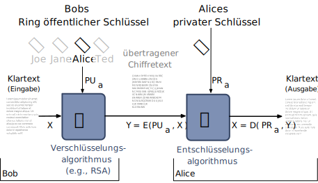
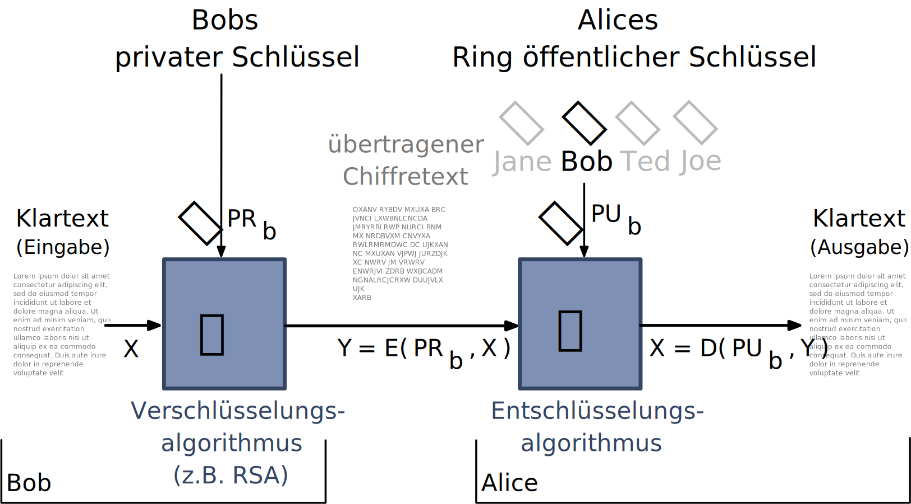
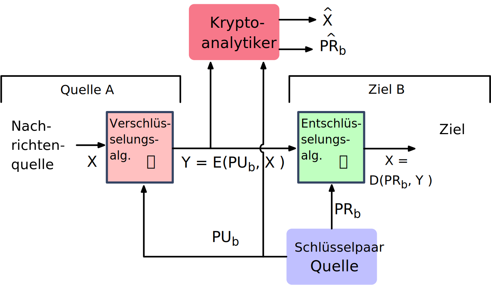
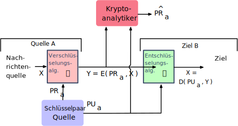
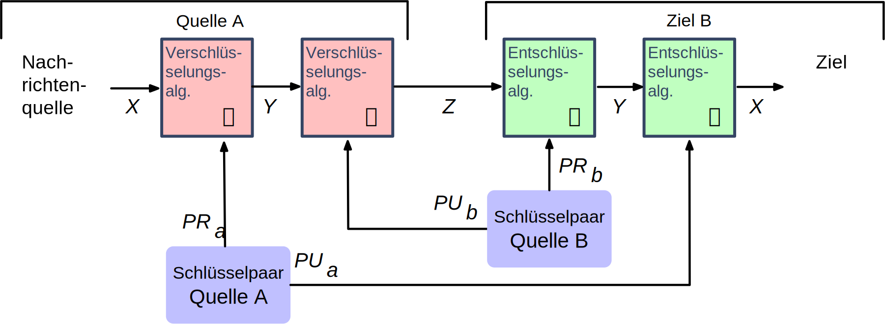

.. meta::
    :version: renaissance
    :author: Michael Eichberg
    :keywords: Public-key Cryptography
    :description lang=en: Public-Key Cryptography and RSA
    :description lang=de: Public-Key Kryptografie and RSA
    :id: lecture-security-public_key_cryptography
    :first-slide: last-viewed
    :master-password: WirklichSchwierig!

.. include:: ../docutils.defs

Public-Key-Kryptographie und RSA
===============================================

:Dozent: `Prof. Dr. Michael Eichberg <https://delors.github.io/cv/folien.de.rst.html>`__
:Kontakt: michael.eichberg@dhbw.de
:Version: 1.2.1
:Basierend auf: *Cryptography and Network Security - Principles and Practice, 8th Edition, William Stallings*

.. supplemental::

  :Folien:
      [HTML] |html-source|

      [PDF] |pdf-source|
  :Fehler melden:
      https://github.com/Delors/delors.github.io/issues

.. class:: new-section

Grundlagen
-------------

Terminologie bzgl. asymmetrischer Verschlüsselung
-----------------------------------------------------------------

.. class:: incremental-list

- Asymmetrische Schlüssel
- Public-Key-Zertifikat
- Public-Key (asymmetrischer) kryptografischer Algorithmus
- Public-Key-Infrastruktur (PKI)

.. supplemental::

    :Asymmetrische Schlüssel:
            Zwei zusammengehörige Schlüssel, ein öffentlicher und ein privater Schlüssel, die zur Durchführung komplementärer Operationen verwendet werden, z. B. Ver- und Entschlüsselung oder Signaturerstellung und Signaturprüfung.

    :Public-Key-Zertifikat:
            Ein digitales Dokument, das mit dem privaten Schlüssel einer Zertifizierungsstelle (:eng:`Certification Authority`) ausgestellt und digital signiert wird und den Namen eines Teilnehmers an einen öffentlichen Schlüssel bindet. Das Zertifikat gibt an, dass der im Zertifikat genannte Teilnehmer die alleinige Kontrolle und den Zugriff auf den entsprechenden privaten Schlüssel hat.

    :Public-Key (asymmetrischer) kryptografischer Algorithmus:
            Ein kryptographischer Algorithmus, der zwei zusammengehörige Schlüssel verwendet, einen öffentlichen und einen privaten Schlüssel. Die beiden Schlüssel haben die Eigenschaft, dass die Ableitung des privaten Schlüssels aus dem öffentlichen Schlüssel rechnerisch nicht machbar ist bzw. sein sollte (vgl. Quantenkryptografie).

    :Public-Key-Infrastruktur (PKI):
            Eine Reihe von Richtlinien, Prozessen, Serverplattformen, Software und Workstations, die für die Verwaltung von Zertifikaten und öffentlich-privaten Schlüsselpaaren verwendet werden, einschließlich der Möglichkeit, Public-Key-Zertifikate auszustellen, zu pflegen und zu widerrufen.

Prinzipien von Public-Key-Kryptosystemen
-------------------------------------------

- Das Konzept der *Public-Key-Kryptographie* (d. h. der Kryptografie mit öffentlichen Schlüsseln) entstand aus dem Versuch, zwei der schwierigsten Probleme im Zusammenhang mit der symmetrischen Verschlüsselung zu lösen:

  .. admonition:: Schlüsselverteilung

        Wie kann man generell sicher kommunizieren, ohne einem "Key Distribution Center" (KDC) seinen Schlüssel anvertrauen zu müssen?

  .. admonition:: Digitale Signaturen

        Wie kann man überprüfen, ob eine Nachricht unversehrt vom angegebenen Absender stammt?

.. supplemental::

    KDC = Key Distribution Center

.. class:: transition-fade center-child-elements

Prinzipien von Public-Key-Kryptosystemen
-----------------------------------------

.. container:: exclamation-mark

    **Whitfield Diffie** und **Martin Hellman** von der Stanford University erzielten 1976 einen Durchbruch, indem sie eine Methode entwickelten, die beide Probleme löste und sich radikal von allen bisherigen Ansätzen der Kryptografie unterschied.

Bestandteile von Public-Key-Kryptosystemen
-------------------------------------------

.. class:: incremental-list

:*Klartext* (`Plaintext`:eng:): Die lesbare Nachricht oder Daten, die dem Algorithmus als Eingabe dienen.
:*Verschlüsselungsalgorithmus*: Führt verschiedene Umwandlungen des Klartextes durch.
:*Öffentlicher Schlüssel*: Wird für *Verschlüsselung* oder *Entschlüsselung* verwendet.
:*Privater Schlüssel*: Verwendet für *Verschlüsselung* oder *Entschlüsselung*.
:*Chiffretext* (`Ciphertext`:eng:): Die verschlüsselte Nachricht, die als Ausgabe produziert wird.
:*Entschlüsselungsalgorithmus*: Nimmt den Geheimtext und den passenden Schlüssel entgegen und erzeugt den ursprünglichen Klartext.

Verschlüsselung mit öffentlichem Schlüssel
-----------------------------------------------

Verschlüsselung mit privatem Schlüssel
------------------------------------------

.. class:: smaller-slide-title

Konventionelle und Public-Key-Verschlüsselung
----------------------------------------------

.. story::

    .. grid::

        .. cell::

            .. rubric:: Konventionelle Verschlüsselung

            **Benötigt zur Anwendung**

            1.	Es wird derselbe Algorithmus mit demselben Schlüssel für die Ver- und Entschlüsselung verwendet.

            2.	Der Sender und der Empfänger müssen den Algorithmus und den Schlüssel kennen bzw. besitzen.

            .. compound::
                :class: incremental[1]

                **Notwendig für die Sicherheit**

                1.	Der Schlüssel muss geheim gehalten werden.

                2.	Es muss „\ *unmöglich*\ “ sein, eine Nachricht zu entschlüsseln, wenn der Schlüssel geheim gehalten wird.

                3.	Die Kenntnis des Algorithmus und von (ggf. vielen) Geheimtexten ist nicht ausreichend, um den Schlüssel zu ermitteln.

        .. cell::

            .. rubric:: Public-Key Verschlüsselung

            **Benötigt zur Anwendung**

            1.	Zwei Algorithmen: je einer für die Ver-/Entschlüsselung. Weiterhin ein Paar von Schlüsseln; je einer für die Ver-/Entschlüsselung.

            2.	Der Absender und der Empfänger müssen jeweils einen der passenden Schlüssel besitzen (nicht den gleichen).

            .. compound::
                :class: incremental[1]

                **Notwendig für die Sicherheit**

                1.	Einer der  Schlüssel muss geheim bleiben.

                2.	Es muss „\ *unmöglich*\ “ sein, eine Nachricht zu entschlüsseln, wenn ein Schlüssel geheim gehalten wird.

                3.	Die Kenntnis des Algorithmus und eines Schlüssels sowie von  Geheimtexten ist nicht ausreichend, um den anderen Schlüssel zu ermitteln.

Public-Key-Kryptosystem: Vertraulichkeit
-----------------------------------------

Public-Key-Kryptosystem: Authentifizierung
---------------------------------------------

Public-Key-Kryptosystem: Authentifizierung und Geheimhaltung
---------------------------------------------------------------

Anwendungen für Public-Key-Kryptosysteme
------------------------------------------

.. deck::

    .. card::

      Kryptosysteme mit öffentlichen Schlüsseln lassen sich in drei Kategorien einteilen:

      .. class:: incremental-list

      1. *Ver-/Entschlüsselung*: Der Absender verschlüsselt eine Nachricht mit dem öffentlichen Schlüssel des Empfängers.
      2. *Digitale Unterschriften*: Der Absender „unterschreibt“ eine Nachricht mit seinem privaten Schlüssel.
      3. *Schlüsselaustausch*: Zwei Seiten arbeiten zusammen, um einen Sitzungsschlüssel (d. h. einen symmetrischen Schlüssel) auszutauschen.

    .. card::

        Einige Algorithmen eignen sich für alle drei Anwendungen, während andere nur für eine oder zwei verwendet werden können:

        .. csv-table::
            :header: Algorithmus, Ver-/ Entschlüsselung, Digitale Signaturen, Schlüssel-austausch
            :class: incremental-table-rows
            :widths: 13, 10, 10, 10

            RSA,:shiny-green:`✓`,:shiny-green:`✓`,:shiny-green:`✓`
            Elliptic Curve,:shiny-green:`✓`,:shiny-green:`✓`,:shiny-green:`✓`
            Diffie-Hellman,:shiny-red:`✗`,:shiny-red:`✗`,:shiny-green:`✓`
            DSS\ [#]_,:shiny-red:`✗`,:shiny-green:`✓`,:shiny-red:`✗`

        .. [#] DSS = Digital Signature Standard*, entwickelt von der NSA (National Security Agency)

Anforderungen an Public-Key-Algorithmen
--------------------------------------------

.. class:: incremental-list positive-list

- Für eine Partei :math:`B` ist es *rechnerisch einfach*, ein Schlüsselpaar (bestehend aus öffentlicher Schlüssel :math:`PU_b` und privater Schlüssel :math:`PR_b`) zu erzeugen.
- Für einen Absender :math:`A` ist es *rechnerisch einfach*, bei Kenntnis des öffentlichen Schlüssels von :math:`B` und der zu verschlüsselnden Nachricht den entsprechenden Chiffretext zu erzeugen.
- Für den Empfänger :math:`B` ist es *rechnerisch einfach*, den resultierenden Chiffretext mit Hilfe des privaten Schlüssels zu entschlüsseln, um die ursprüngliche Nachricht wiederherzustellen.
- Die beiden Schlüssel können in beliebiger Reihenfolge verwendet werden.

.. class:: incremental-list negative-list

- Für einen Angreifer, der den öffentlichen Schlüssel kennt, ist es *rechnerisch unmöglich*, den privaten Schlüssel zu ermitteln.
- Für einen Angreifer, der den öffentlichen Schlüssel und einen Chiffretext kennt, ist es *rechnerisch unmöglich*, die ursprüngliche Nachricht wiederherzustellen.

Anforderungen an Public-Key-Algorithmen
--------------------------------------------

.. repetition::

    Eine Einwegfunktion ist im Allgemeinen eine Funktion, bei der jeder Funktionswert :math-i:`Y` eine eindeutige Umkehrung hat, wobei die *Berechnung der Funktion einfach* ist, während die *Bestimmung der Umkehrfunktion praktisch undurchführbar ist*.

    - :math:`Y = f(X)` einfach
    - :math:`X = f^{–1}(Y)` „unmöglich“

.. story::

    .. class:: incremental-list

    - Benötigt wird jedoch eine Falltürfunktion (:eng:`Trapdoor one-way function`); d. h. eine Einwegfunktion die effizient umkehrbar ist, **wenn ein Geheimnis bekannt ist**.
    - Eine Einwegfunktion mit Falltür ist eine Familie invertierbarer Funktionen :math:`f_k`, für die gilt:

        - :math:`Y = f_k(X)` einfach, wenn :math-i:`k` und :math-i:`X` bekannt sind.
        - :math:`X = f_k^{–1}(Y)` einfach,  wenn :math-i:`k` und :math-i:`Y` bekannt sind.
        - :math:`X = f_k^{–1}(Y)` unmöglich, wenn :math-i:`Y` bekannt ist, aber :math-i:`k` nicht.

    - Ein praktisches Public-Key-Verfahren hängt von einer geeigneten Trapdoor-Einwegfunktion ab.

.. supplemental::

    Ein Falltürfunktion lässt sich nicht trivial umkehren; bzw. die Umkehrung erfordert spezielle (weitergehende) Informationen; d. h. die Falltür.

Public-Key-Kryptoanalyse
--------------------------

.. deck::

    .. card::

        Ein Verschlüsselungsverfahren mit öffentlichem Schlüssel ist anfällig für einen Brute-Force-Angriff.

        .. class:: incremental-list

        - Gegenmaßnahme: große Schlüssel verwenden!
        - Die Schlüsselgröße muss klein genug sein, um eine praktische Ver- und Entschlüsselung zu ermöglichen.
        - Vorgeschlagene Schlüsselgrößen führen zu Verschlüsselungs-/Entschlüsselungsgeschwindigkeiten, die für den allgemeinen Gebrauch zu langsam sind.
        - Die Verschlüsselung mit öffentlichen Schlüsseln ist derzeit auf die Schlüsselverwaltung und Signaturanwendungen beschränkt.

    .. card::

        Eine andere Form des Angriffs besteht darin, einen Weg zu finden, den privaten Schlüssel anhand des öffentlichen Schlüssels zu berechnen.

        *Bislang konnte nicht mathematisch bewiesen werden, dass diese Form des Angriffs für einen bestimmten Public-Key-Algorithmus nicht durchführbar ist.*

    .. card::

        Schließlich gibt es noch einen Angriff mit wahrscheinlicher Nachricht.

        *Dieser Angriff kann vereitelt werden, indem einige zufällige Bits an einfache Nachrichten angehängt werden.*

.. supplemental::

    Bei einem Angriff mit „wahrscheinlicher Nachricht“, verschlüsselt der Angreifer eine Reihe von Nachrichten (z. B. alle DES Schlüssel mit dem öffentlichen Schlüssel des Adressaten) und analysiert die resultierenden Chiffretexte, um den privaten Schlüssel zu ermitteln.

Missverständnisse bei der Verwendung von Public-Key-Kryptosystemen
------------------------------------------------------------------------

.. class:: incremental-list

- Public-Key-Verschlüsselung ist sicherer vor Kryptoanalyse als die symmetrische Verschlüsselung.
- Public-Key-Kryptografie (d. h. die Verschlüsselung mit öffentlichen Schlüsseln) ist eine Allzwecktechnik, die die symmetrische Verschlüsselung überflüssig gemacht hat.
- Man hat das Gefühl, dass die Schlüsselverteilung bei der Verschlüsselung mit öffentlichen Schlüsseln trivial ist, verglichen mit dem mühsamen Handshaking, das bei der symmetrischen Verschlüsselung mit Schlüsselverteilungszentren verbunden ist.

.. class:: new-section transition-scale

Public-Key Algorithmen
------------------------

Idee bzgl. Schlüsseltauschverfahren
--------------------------------------------

.. rubric:: Schlüssel wird gemeinsam konstruiert

.. story::

    .. class:: incremental-list

    - es gibt eine öffentliche Zahl :math-i:`s` und eine öffentlich bekannte Funktion :math-i:`F`, die kommutativ ist.
    - A und B überlegen sich je eine geheime Zahl :math-i:`a` und :math-i:`b`
    - A berechnet :math:`F(a, s)` und sendet das Ergebnis an B
    - B berechnet :math:`F(b, s)` und sendet das Ergebnis an A
    - Aus den geheimen und bekanntgegebenen Werten wird der Schlüssel berechnet:

      A berechnet :math:`K = F(a, F(b,s))`

      B berechnet :math:`K = F(b, F(a,s))`

    .. class:: incremental-list negative-list

    - Angreifer M kennt :math-i:`F` und :math-i:`s`.

      Der Angreifer kann/könnte ggf. berechnen :math:`K = F(F(a,s),F^{-1}(F(b,s),s))`

    - Die Sicherheit beruht auf der Annahme, dass die Umkehrung der Funktion :math-i:`F(x, s)` nach :math-i:`x` nicht effizient möglich ist – selbst wenn :math-i:`s` bekannt ist.

      .. supplemental::

         .. example::

            .. rubric:: Falls :math:`F` invertierbar ist

            Sei :math:`a = 3`, :math:`b = 5` und :math:`s = 4`.

            Sei unsere Funktion :math:`F`: :math:`F(x,y) = x + y`

            Dann ist :math:`F(a, F(b,s)) = F(a, b + s) = a + b + s = 3 + 5 + 4 = 12` und :math:`F(b, F(a,s)) = F(b, a + s) = b + a + s = 5 + 3 + 4 = 12`.

            Der Angreifer kann nun folgende Rechnung durchführen, da :math-i:`s` bekannt ist:

            :math:`F(F(a,s),F_s^{-1}(F(b,s))) =`

            :math:`F(7,F_s^{-1}(9)) =`

            :math:`F(7,5) = 12`

            Da :math:`s = 4` bekannt ist, kann ein Angreifer die Umkehrfunktion leicht bestimmen und es gilt: :math:`F_{s=4}^{-1}(x) = x - 4`

Diffie-Hellmann(-Merkle)-Schlüsseltausch
-----------------------------------------

.. story::

    .. class:: incremental-list

    - ermöglich es zwei Kommunikationspartnern, über eine öffentliche (abhörbare) Leitung einen gemeinsamen (Sitzungs-)Schlüssel zu vereinbaren
    - der Sitzungsschlüssel wird dann für ein symmetrisches Verschlüsselungsverfahren verwendet
    - veröffentlicht im Jahr 1976

    - Ablauf:

      #. Gegeben sein eine Primzahl :math-i:`p` und ein Erzeuger (Generator) :math:`s \in \mathbb{Z}_p^*`
      #. Beide Kommunikationspartner wählen eine Zahl :math-i:`a` bzw. :math-i:`b` für die gilt  :math:`a,b \in \mathbb{Z}_{p-1}`
      #. A berechnet :math:`\alpha = s^a \bmod p` und B berechnet :math:`\beta = s^b \bmod p`
      #. A und B senden sich gegenseitig ihre Ergebnisse zu

      #. Der Schlüssel wird dann wie folgt berechnet: :math:`K = \alpha^b \bmod p = \beta^a \bmod p`

    - Die Sicherheit des Diffie-Hellman-Protokolls beruht auf der Schwierigkeit des diskreten Logarithmusproblems. Das Problem aus :math:`g^x \equiv y \mod p` den Exponenten :math-i:`x` zu finden, ist in großen Gruppen praktisch schwer lösbar.

    .. warning::
        :class: incremental

        Klassisches Diffie-Hellmann kann von zukünftigen leistungsstarken Quantenrechnern unter Einsatz des Shor Algorithmus potentiell gebrochen werden.

        „Nachfolger“ ist zum Beispiel CRYSTALS-Kyber.

.. supplemental::

    :math:`\mathbb{Z}_p^*` ist die multiplikative Gruppe modulo :math:`p`; ist :math:`p` eine Primzahl, dann ist die Gruppe zyklisch. Damit der gemeinsam berechnete Schlüssel den gesamten Wertebereich von :math:`\mathbb{Z}_p^*` abdecken kann, muss :math:`s` ein Erzeuger dieser Gruppe sein; d. h. :math:`s^x \bmod p` mit :math:`x \in \mathbb{Z}_{p-1}` erzeugt alle Element der Gruppe. Ist :math:`s` kein Erzeuger, so ist der Schlüsselraum auf eine echte Untergruppe eingeschränkt, was die kryptografische Sicherheit verringert. Die Anzahl der Erzeuger einer Gruppe :math:`\mathbb{Z}_p^*` (auch primitive Wurzeln genannt)  ist gegeben durch: :math:`\varphi(p - 1)` wobei :math:`\varphi` die Eulersche Totientenfunktion ist.

Rivest-Shamir-Adleman (RSA) Algorithm
--------------------------------------

.. class:: incremental-list list-with-explanations

- Entwickelt 1977 am MIT von Ron Rivest, Adi Shamir und Len Adleman.
- Universeller Ansatz zur Verschlüsselung mit öffentlichen Schlüsseln.
- Ist eine Chiffre, bei der Klartext und Chiffretext ganze Zahlen zwischen :math:`0` und :math:`n - 1` für ein bestimmtes :math:`n` sind.

- Eine typische Größe für :math:`n` waren 1024 Bits oder 309 Dezimalziffern.

  Solch kleine Zahlen werden heute als äußerst unsicher angesehen, insbesondere angesichts der bevorstehenden Quantencomputer und der Entwicklung von Quantenalgorithmen (vgl. `Shors Algorithmus (1994) <https://en.wikipedia.org/wiki/Shor%27s_algorithm>`_), die Zahlen effizient faktorisieren können, wenn genügend QBits in hinreichender Qualität\ [#]_ zur Verfügung stehen.

.. [#] Aktuell sind Quantencomputer nicht in der Lage, die für RSA verwendeten Schlüssel zu brechen und es ist auch (noch) nicht geklärt, ob die aktuellen Technologien entsprechend skaliert werden können. Es besteht aber die Möglichkeit!

RSA Algorithmus
-----------------

.. class:: incremental-list

- RSA verwendet einen Ausdruck mit Exponentialen
- Der Klartext wird in Blöcken verschlüsselt, wobei jeder Block einen Binärwert hat, der kleiner als eine bestimmte Zahl :math:`n` ist\ [#]_.
- Die Ver- und Entschlüsselung erfolgt für einen Klartextblock :math:`M` und einen Chiffretextblock :math:`C` in der folgenden Form:

	:math:`C = M^e\; mod\; n \qquad M = C^d\; mod\; n  \qquad (M^e)^d\; mod\; n = M^{ed}\; mod\; n`

- Sowohl der Sender als auch der Empfänger müssen den Wert von :math:`n` kennen.
- Der Absender kennt den Wert von :math:`e`, und nur der Empfänger kennt den Wert von :math:`d`
- Dies ist ein Public-Key-Verschlüsselungsalgorithmus mit dem öffentlichen Schlüssel :math:`PU=\lbrace e,n \rbrace` und dem privaten Schlüssel :math:`PR=\lbrace d,n \rbrace`.

.. [#] Basierend auf der Zahl n ergibt sich die maximale Größe des Blocks in Bit. Sei, hypothetisch, :math:`n = 4.294.967.296+1`, dann kann der Block maximal 32 Bit groß sein (:math:`2^{32} = 4.294.967.296`).

.. supplemental::

    :math:`M = C^d\; mod\; n  \Rightarrow M = (M^e\; mod\; n)^d\; mod\; n = (M^e)^d\; mod\; n`

Anforderungen an den RSA Algorithmus
----------------------------------------

Damit dieser Algorithmus für die Verschlüsselung mit öffentlichen Schlüsseln geeignet ist, müssen die folgenden Anforderungen erfüllt sein:

.. class:: incremental-list

1.  Es ist möglich, Werte für :math:`e`, :math:`d`, :math:`n` so zu finden, dass :math:`M^{ed}\,mod\, n = M` für alle :math:`M < n`.
2.  Es ist relativ einfach, :math:`M^e\;mod\; n` und :math:`C^d\, mod\, n` für alle Werte von :math:`M < n` zu berechnen.
3.  Es ist nicht möglich, :math:`d` zu bestimmen, wenn :math:`e` und :math:`n` gegeben sind.

The RSA Algorithm
-------------------

**Schlüsselgenerierung von Alice**

.. csv-table::
    :class: booktabs incremental-table-rows
    :width: 100%
    :align: left

    "Wähle :math:`p, q`", ":math:`p` und :math:`q` beide prim, :math:`p \neq q` "
    "Berechne :math:`n`", ":math:`n = p \times q` "
    "Berechne :math:`𝜙(n)` ", ":math:`\phi(n) = (p - 1)(q - 1)` "
    "Wähle :math:`e`", ":math:`GGT(\phi(n),e) = 1; \quad 1 < e < \phi(n)` "
    Berechne :math:`d`, :math:`d \equiv e^{-1}\; (mod\; \phi(n)) \Leftrightarrow ed\; mod\; \phi(n)= 1`
    Public-Key, ":math:`PU = \lbrace e,n \rbrace` "
    Private-Key, ":math:`PR = \lbrace d,n \rbrace` "

.. compound::
    :class: incremental

    **Verschlüsselung von Bob mit Alices öffentlichen Schlüssel**

    .. csv-table::
        :stub-columns: 1
        :class: borderless table-header-align-right

        Klartext, :math:`M<n`
        Chiffretext, :math:`C=M^e\; mod\; n`

.. compound::
    :class: incremental

    **Entschlüsselung von Alice mit ihrem privaten Schlüssel**

    .. csv-table::
        :stub-columns: 1
        :class: borderless table-header-align-right

        Chiffretext, :math:`C`
        Klartext, :math:`M = C^d\; mod\; n`

Berechnung von :math:`d`
-------------------------

Der Wert von :math:`d` wird mit Hilfe des erweiterten Euklidischen Algorithmus\ [#]_ berechnet.

Wir wissen dass :math:`GGT(\phi(n),e) = 1` gilt; d. h. :math-i:`e` und :math:`\phi(n)` sind teilerfremd/*coprime*.

.. math::

    \begin{matrix}
    ex + \phi(n)y & = & GGT(e,\phi(n)) \\
                    & = & 1 \\
    \text{Umgestellt:} \\
    ex & = & - \phi(n)y +1 \\
    \Rightarrow  \\
    ex\; mod\; \phi(n) & = & 1
    \end{matrix}

.. container:: incremental

    .. math::

        \text{somit }  x \hat{=} d

.. ex & \equiv & 1\; (mod\; \phi(n))

.. [#] Zur Erinnerung: der erweiterte Euklidische Algorithmus berechnet den größten gemeinsamen Teiler von zwei Zahlen (:math:`a`, :math:`b`) und zusätzlich zwei Koeffizienten (:math:`x`, :math:`y`), so dass gilt:  :math:`ax + by = ggt(a,b)`.

.. supplemental::

    `Jupyter Notebook zur Berechnung <https://github.com/Delors/delors.github.io/blob/main/sec-public-key-kryptographie/resources/extended_gcd.ipynb>`__

Beispiel für den RSA-Algorithmus
---------------------------------

.. class:: incremental-list

:p und q:

    :math:`p = 11;\quad q = 17;\quad n = 187\qquad (\phi(n) = 10 \times 16 = 160)`

:Klartext:
    :math:`88`

:Verschlüsselung:
    :math:`PU =\lbrace e= 7, n= 187 \rbrace`:

    :math:`88^7\;mod\; 187 = 11 = C`

:Entschlüsselung:
    :math:`PR =\lbrace d= 23, n = 187 \rbrace`:

    :math:`11^{23}\; mod\; 187 = 88 = P`

:Alternativer Exponent:

    :math:`e = 137 \Rightarrow d = 153`

    :math:`\qquad 88^{137}\; mod\; 187 = 99 = C\qquad 99^{153}\; mod\; 187 = 88`

.. class:: repetition

Potenzierung in der Modularen Arithmetik
-------------------------------------------

.. class:: list-with-explanations

- Sowohl bei der Verschlüsselung als auch bei der Entschlüsselung in RSA wird eine ganze Zahl potenziert mit einer weiteren ganzen Zahl :math:`mod\; n`.

  Weiterhin haben wir es mit potenziell großen Exponenten zu tun, so dass die Effizienz der Potenzierung eine wichtige Rolle spielt.

.. class:: incremental

- Eine Eigenschaft der modularen Arithmetik kann genutzt werden:

  :math:`[(a\; mod\; n) \times (b\; mod\; n)]\; mod\; n =(a \times b)\; mod\; n`

  .. example::

    :math:`[11 = 1011_b]\qquad 2^{11} = 2^1 \times 2^2 \times 2^8 = 2 \times 4 \times  256`

    :math:`[09 = 1001_b] \qquad 2^9\; mod\; 13 = [(2^1\; mod\; 13) \times (2^8 \; mod\; 13)]\; mod\; 13`

.. supplemental::

    .. math::

        \begin{matrix}
           & 2^3 =8 & 2^2 = 4 & 2^1 = 2 & 2^0 = 1 \\
           11 = & 1_b & 0_b & 1_b & 1_b \\
        \end{matrix}

Algorithmus zur Berechnung von :math:`a^b\; mod\; n`
----------------------------------------------------

.. rubric:: Quadrieren und Multiplizieren (:eng:`Square and Multiply`)

Die Ganzzahl :math:`b` wird als Binärzahl ``b[k]b[k-1]...b[0]`` ausgedrückt:

.. hint::
    :class: width-40 float-right

    ``c`` stellt lediglich die Komponente dar.

.. code:: pascal
    :number-lines:

    c := 0; f := 1
    for i := k downto 0
        do c := 2 * c
           f := (f * f) mod n
        if b[i] = 1
            then c := c + 1
                 f := (f * a) mod n
    return f

.. supplemental::

    `Jupyter Notebook mit Implementierung <https://github.com/Delors/delors.github.io/blob/main/sec-public-key-kryptographie/resources/extended_gcd.ipynb>`__

Ergebnis des schnellen modularen Exponierungsalgorithmus für :math:`a^b\;mod\;n`
--------------------------------------------------------------------------------

:math:`a=7; b = 560 = 10\,0011\,0000_b`, und :math:`n=561`

.. csv-table::
    :header: i, 9,8,7,6,5,4,3,2,1,0
    :widths: 6, 10,10,10,10,10,10,10,10,10,10
    :width: 100%
    :header-rows: 1
    :stub-columns: 1

    ":math:`b_i`", 1,0,0,0,1,1,0,0,0,0
    c, 1,2,4,8,17,35,70,140,280,560
    f, 7,49,157,526,160,241,298,166,67,1

Effiziente Verschlüsselung mit dem öffentlichen Schlüssel
---------------------------------------------------------------------

Um den RSA-Algorithmus bei Verwendung des öffentlichen Schlüssels zu beschleunigen, wird in der Regel eine bestimmte Wahl von :math:`e` getroffen:

- Die häufigste Wahl ist 65537 (:math:`2^{16} + 1`).
- Zwei weitere beliebte Wahlmöglichkeiten sind :math:`e=3` und :math:`e=17`.
- Jede dieser Möglichkeiten hat nur zwei 1-Bits, so dass die Anzahl der Multiplikationen, die für die Potenzierung erforderlich sind, minimiert wird.
- Mit einem sehr kleinen öffentlichen Schlüssel, wie :math:`e = 3`, wird RSA jedoch anfällig für einen einfachen Angriff.

Effiziente Entschlüsselung mit dem privaten Schlüssel
-----------------------------------------------------------

- Die Entschlüsselung verwendet die Potenzierung mit :math:`d`.

.. class:: incremental-list list-with-explanations

- Ein kleiner Wert von :math:`d` ist jedoch anfällig für einen Brute-Force-Angriff und für andere Formen der Kryptoanalyse.
- Der Chinesischen Restsatz (CRT) kann verwendet werden, um Berechnungen zu beschleunigen:

  Die Größen :math:`d\; mod\; (p - 1)` und :math:`d\; mod\; (q - 1)` können vorberechnet werden.

  Das Ergebnis ist, dass die Berechnung etwa viermal so schnell ist wie die direkte Berechnung von :math:`M = C^d\; mod\; n`.

Schlüsselgenerierung
----------------------

.. grid::

    .. cell:: width-50

        Vor der Anwendung des Public-Key-Kryptosystems muss jeder Teilnehmer ein Schlüsselpaar erzeugen:

        - Bestimmung der Primzahlen :math:`p` und :math:`q`.
        - Wahl von :math:`e` oder :math:`d` und Berechnung der anderen.

    .. cell:: width-50

        - Da der Wert von :math:`n = pq` jedem potenziellen Gegner bekannt sein wird, müssen die Primzahlen aus einer ausreichend großen Menge ausgewählt werden.
        - Die Methode, die zum Finden großer Primzahlen verwendet wird, muss einigermaßen effizient sein.

          Es kann z. B. der Miller-Rabin-Algorithmus verwendet werden.

Die Sicherheit von RSA - Fünf mögliche Ansätze für einen Angriff
----------------------------------------------------------------------

.. container:: dd-margin-left-10em

    .. class::  incremental-list

    :Brute-Force: Dabei werden alle möglichen privaten Schlüssel ausprobiert.

    :Mathematische Angriffe: Es gibt mehrere Ansätze, die vom Aufwand her alle dem Faktorisieren des Produkts aus zwei Primzahlen entsprechen.

    :Zeitliche Angriffe: Diese hängen von der Laufzeit des Entschlüsselungsalgorithmus ab.

    :Hardware-Fehler-basierter Angriff: Hier geht es darum, Hardware-Fehler in den Prozessor zu induzieren, der digitale Signaturen erzeugt.

    :Gewählte Chiffretext-Angriffe: Ziel ist es Eigenschaften des RSA-Algorithmus auszunutzen.

Faktorisierungsproblem
-----------------------

Es gibt drei Ansätze für einen mathematischen Angriff auf RSA:

.. class:: incremental-list

1. Faktorisierung von :math:`n` in seine beiden Primfaktoren. Dies ermöglicht die Berechnung von :math:`\phi(n) = (p - 1) \times (q - 1)`, was wiederum die Bestimmung von :math:`d = e^{-1} (mod\; ø(n))` ermöglicht.
2. Direkte Bestimmung von :math:`\phi(n)`, ohne vorher :math:`p` und :math:`q` zu bestimmen. Dies ermöglicht wiederum die Bestimmung von :math:`d = e^{-1} (mod\; \phi(n))`.
3. Direkte Bestimmung von :math:`d`, ohne vorher :math:`\phi(n)` zu bestimmen.

Timing-Angriffe
---------------

- Paul Kocher, ein IT-Sicherheits-Berater, demonstrierte, dass ein Schnüffler einen privaten Schlüssel ermitteln kann, indem er verfolgt, wie lange ein Computer braucht, um Nachrichten zu entschlüsseln.
- Diese Angriffe sind nicht nur auf RSA, sondern auch auf andere Verschlüsselungssysteme mit öffentlichen Schlüsseln anwendbar.
- Solche Angriffe sind aus zwei Gründen alarmierend:

  - Es kommt aus einer völlig unerwarteten Richtung.
  - Es handelt sich um einen reinen Chiffretext-Angriff.

Gegenmaßnahmen gegen Timing-Angriffe
----------------------------------------

.. class:: incremental-list

:Konstante Potenzierungszeit:
    Es gilt sicherzustellen, dass alle Potenzierungen die gleiche Zeit benötigen, bevor ein Ergebnis zurückgegeben wird; dies ist eine einfache Lösung, die jedoch die Leistung beeinträchtigt.

:Zufällige Verzögerung:
    Eine bessere Leistung könnte erreicht werden, indem man dem Potenzierungsalgorithmus eine zufällige Verzögerung hinzufügt, um den Zeitangriff zu verwirren.

:Verschleierung:
    Multiplikation des Chiffriertextes mit einer Zufallszahl vor der Potenzierung; dieser Vorgang verhindert, dass der Angreifer erfährt, welche Bits des Chiffriertextes im Computer verarbeitet werden, und verhindert somit die für den Timing-Angriff erforderliche Bit-für-Bit-Analyse.

Fehlerbasierter Angriff
------------------------

- Ein Angriff auf einen Prozessor, der digitale RSA-Signaturen erzeugt.

  - Verursacht Fehler in der Signaturberechnung, indem er die Leistung des Prozessors reduziert.
  - Diese Fehler führen dazu, dass die Software ungültige Signaturen erzeugt, die dann vom Angreifer analysiert werden können, um den privaten Schlüssel wiederherzustellen.

- Der Angriffsalgorithmus besteht darin, Ein-Bit-Fehler zu erzeugen und die Ergebnisse zu beobachten.
- Obwohl dieser Angriff eine Überlegung wert ist, scheint er in vielen Anwendungen keine ernsthafte Bedrohung für RSA darzustellen.

  - Er setzt voraus, dass der Angreifer physischen Zugriff auf den Zielcomputer hat und in der Lage ist, die Eingangsleistung des Prozessors direkt zu kontrollieren.

.. supplemental::

    (:eng:`Fault-based attack`)

Gewählter Chiffretext-Angriff
------------------------------------

(:eng:`Chosen Ciphertext Attack (CCA)`)

- Der Angreifer wählt eine Reihe von Chiffretexten aus und erhält dann die entsprechenden Klartexte, die mit dem privaten Schlüssel des Ziels entschlüsselt wurden.

  - Der Angreifer könnte also einen Klartext auswählen, ihn mit dem öffentlichen Schlüssel des Ziels verschlüsseln und dann den Klartext zurückerhalten, indem er ihn mit dem privaten Schlüssel entschlüsselt.
  - Der Angreifer macht sich die Eigenschaften von RSA zunutze und wählt Datenblöcke aus, die, wenn sie mit dem privaten Schlüssel des Ziels verarbeitet werden, die für die Kryptoanalyse benötigten Informationen liefern.

- Um solche Angriffe abzuwehren, empfiehlt RSA Security Inc., den Klartext mit einem Verfahren zu modifizieren, das als optimales asymmetrisches Verschlüsselungs-Padding (OAEP) bekannt ist.

.. supplemental::

    Die Idee bei OAEP ist, dass der Klartext vor der Verschlüsselung mit dem öffentlichen Schlüssel des Empfängers mit einem *zufälligen* Padding versehen wird, um ein Element des Zufalls in den sonst deterministischen Verschlüsselungsvorgang einzuführen.

.. class:: transition-scale

Zusammenfassung - Hashes, Macs und digitale Signaturen
--------------------------------------------------------

- Hashes dienen der Gewährleistung der Integrität von Daten.
- Macs dienen der Authentifizierung von Daten. Da jedoch ein gemeinsamer Schlüssel vom Sender und Empfänger verwendet wird, können beide Seiten Nachrichten fälschen. Sie bieten keine Nichtabstreitbarkeit.
- Digitale Signaturen bieten Integrität, Authentizität und Nichtabstreitbarkeit. Sie basieren auf asymmetrischen Verschlüsselungsalgorithmen und sind daher langsamer als Macs.

.. class:: exercises transition-fade

Übung
----------

.. exercise:: Diffie-Hellmann(-Merkle)

    Führen Sie das DH-Verfahren von Hand durch. Die gemeinsame Primzahl :math:`p` sei :math:`17`, :math:`s` sei :math:`7`. Alice wählt :math:`a = 5`, Bob wählt :math:`b = 6`.

    Welche Werte werden ausgetauscht, wie lautet der Schlüssel?

    .. solution::
        :pwd: GruppenTheorie!

        Alice: :math:`\alpha = 7^5 \equiv 11 \pmod{17}`

        Bob: :math:`\beta = 7^6 \equiv 9 \pmod{17}`

        Schlüssel: :math:`\alpha^b \equiv 11^6 \equiv 8 \pmod{17} = \beta^a \equiv 9^5 \equiv 8 \pmod{17}`

.. class:: exercises transition-fade

Übung
----------

.. exercise:: Square-and-Multiply

    Führen Sie den Square-and-Multiply Algorithmus Schritt-für-Schritt für :math:`3^{17}\, mod\, 23` aus.

    .. solution::
        :pwd: hochzwei

        ::

            k = ___1 0001b

            i = 4; f =   3 =>
            i = 3; f =   9 =>
            i = 2; f =  81 mod 23 = 12 =>
            i = 1; f = 144 mod 23 = 6 =>
            i = 0; f = (((6 * 6) mod 23) * 3) mod 23 = 16

.. exercise::  Nachrichtenentschlüsselung

    Entschlüsseln sie die folgende mit RSA verschlüsselte Nachricht

    .. math::

        C = 70789294130501\qquad \text{(Verschlüsselte Nachricht)}

        n = 2000557908870247 \qquad \phi(n) = 2000557818857736

        e = 65537

    Berechnen Sie :math:`d` und wandeln Sie die (Klartext)zahl in Text (ASCII 7-Bit pro Zeichen) um. (Nutzen Sie ggf. das `Jupyter Notebook <https://github.com/Delors/delors.github.io/blob/main/sec-public-key-kryptographie/resources/extended_gcd.ipynb>`__ als Hilfestellung.)

    .. solution::
        :pwd: s#u+c+c+e+s#s

        In Python (siehe Jupyter Notebook):

        .. code:: python

            m = 509822222563827 # Klartext
            # Parameter für den RSA Algorithmus
            p = 40005739
            q = 50006773
            n = p * q
            phi_n = (p - 1) * (q - 1)
            e = 65537
            d = inverse(e, phi_n)
            print("d=", d)
            # c = square_and_multiply(m,e, n)
            c = 70789294130501
            print("C=", c)
            print("M=", square_and_multiply(c, d, n))
            # M=509822222563827
            # Umwandlung des int Wertes in Array of Chars:
            bstr = bin(m)
            chars = [bstr[i : i + 7] for i in range(2, len(bstr) - 1, 7)]
            "".join(list(map(lambda x: chr(int(x, 2)), chars)))

        Das Ergebnis ist: "success"

.. supplemental::

    Um einen Integer-Wert (``m``) in einen String umzuwandeln, können Sie den folgenden Pyhton-Code verwenden:

    .. code:: python
        :class: copy-to-clipboard far-smaller

        bstr = bin(m) # the string will start with '0b'
        chars = [bstr[i:i+7] for i in range(2, len(bstr)-1, 7)] # Segmentierung in 7-Bit-Blöcke
        "".join(list(map(lambda x : chr(int(x,2)), chars))) # Umwandlung in ASCII-Zeichen und Konkatenation

.. class:: exercises transition-fade

Übung
----------

.. exercise:: Verschlüsselung mit RSA

    Verschlüsseln Sie eine Nachricht mit RSA mit selber gewählten Parametern.

    D. h., wählen Sie 2 kleine Primzahlen, berechnen Sie dann :math:`e`, :math:`d`, :math:`n`. Verschlüsseln Sie dann die Nachricht (d. h. einen (eher) kleinen Wert) mit dem öffentlichen Schlüssel einer anderen Person und senden Sie der Person die verschlüsselte Nachricht. Die Zielperson soll Ihre Nachricht entschlüsseln.

    .. solution::
        :pwd: Nachrichtenaustausch

        Wir nehmen an, dass :math:`p = 7` und :math:`q = 11` ist.

        .. math::

            n = p \times q = 77

            \phi(n) = (p-1)(q-1) = 6 \times 10 = 60;

        Daher muss die Nachricht ein ganzzahliger Wert kleiner als 60 sein.

        Berechne :math:`e` so, dass :math:`GGT(\phi(n),e) = 1`.

        In diesem Fall sind die Zahlen 2 bis 6 nicht möglich, da sie alle 60 teilen. Wir wählen :math:`e = 7`.

        Berechne :math:`d`; d. h., :math:`ed\; mod\; \phi(n) = 1 \rightarrow d=43 \qquad\qquad (43 \times 7) \; mod\; \phi(77) = (43 \times 7) \; mod\; 60 = 1`

        Es folgt: :math:`PU = \lbrace7,77\rbrace`, :math:`PR = \lbrace 43,77 \rbrace`.

        Sei die Nachricht :math:`M` "13": :math:`C = 13^7\; mod\; 77 = 62`.

        Der Klartext berechnet sich wie folgt: :math:`P = 62^{43}\; mod\; 77 = 13`.
