.. meta::
    :version: renaissance
    :author: Michael Eichberg
    :keywords: IT Sicherheit, Verschlüsselung, Authentifizierung, Signaturen
    :description lang=de: Vertiefung IT Security - IT Schulung (1 Tag)
    :id: schulung-it-security-vertiefung
    :first-slide: last-viewed
    :master-password: WirklichSchwierig!
    :svg-defs:
        <marker
            id="arrow"
            viewBox="0 0 10 10"
            refX="10"
            refY="5"
            markerWidth="8"
            markerHeight="8"
            orient="auto-start-reverse">
                <path d="M 0 0 L 10 5 L 0 10 z" />
        </marker>

.. include:: ../docutils.defs

.. class:: animated-symbol

IT Sicherheit - Vertiefung
=====================================================

:Dozent: `Prof. Dr. Michael Eichberg <https://delors.github.io/cv/folien.de.rst.html>`__
:Kontakt: michael.eichberg@dhbw.de
:Version: 1.0.2

.. supplemental::

  :Folien:
      |html-source|

      |pdf-source|
  :Fehler melden:
      https://github.com/Delors/delors.github.io/issues

.. class:: new-section

Rückblick
---------------

Themen  der Grundlagenschulung
---------------------------------

.. class:: incremental-list

- Cybersecurity
- Schutzziele der IT Sicherheit
- Social Engineering Angriffe
- NIS 2 (ganz kurz)
- CVSS/CVE/KVE
- Schwachstellenmanagement
- ein grober, aller erster Überblick über Verschlüsselungsverfahren
  - Brute-Force
  - Hashing
- Passwortsicherheit

.. class:: new-section transition-scale

Ausblick
---------------

Themenblöcke
-------------------

- Verschlüsselungsalgorithmen
- Public-Key Verschlüssung
- `Netzwerksicherheit`_

.. class:: new-section transition-move-to-left

Verschlüsselungsalgorithmen
-------------------------------------

.. class:: new-subsection transition-move-to-left

Klassische Verschlüsselungsmethoden
-------------------------------------

Definitionen
-------------

.. class:: incremental-list

:Klartext:
    :eng:`Plaintext`

    Die Originalnachricht, die verschlüsselt werden soll.

:Geheimtext oder Chiffretext oder `Kryptogramm`:peripheral::
    :eng:`Ciphertext`

    Die kodierte/verschlüsselte Nachricht.

:Verschlüsselung:
    :eng:`Encryption`

    Der Prozess der Umwandlung von Klartext in Geheimtext.

:Entschlüsselung:
    :eng:`Decryption`

    Der Prozess der Wiederherstellung des Klartextes aus dem Geheimtext.

Definitionen
--------------

.. class:: incremental-list

:Kryptographie:
    :eng:`Cryptography`

    Das Studiengebiet der Verschlüsselungsschemata.

:Kryptoanalyse:
    :eng:`Cryptanalysis`

    Methoden und Techniken, die zur Gewinnung von Informationen aus einer verschlüsselten Nachricht dienen.

    Analyse von kryptographischen Verfahren.

:Kryptologie:
    :eng:`Cryptology`

    Die Bereiche Kryptographie und Kryptoanalyse.

Vereinfachtes Modell der symmetrischen Verschlüsselung
--------------------------------------------------------

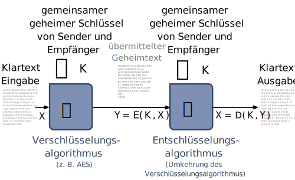

Symmetrisches Verschlüsselungsmodell
---------------------------------------

Es gibt zwei Voraussetzungen für die sichere Verwendung der herkömmlichen Verschlüsselung:

.. class:: incremental-list

1. Ein starker Verschlüsselungsalgorithmus.
2. Effektive Schlüsselverwaltung:

   .. class:: incremental-list

   (a) Sender und Empfänger müssen Kopien des geheimen Schlüssels auf sichere Weise erhalten haben und

   (b) den Schlüssel sicher aufbewahren.

Modell eines symmetrischen Kryptosystems
-------------------------------------------

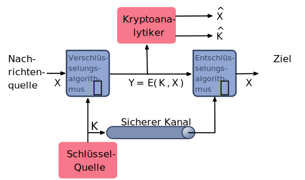

Kryptografische Systeme können entlang dreier unabhängiger Dimensionen charakterisiert werden
----------------------------------------------------------------------------------------------------------

.. note::
    :class: width-30

    Eine Permutation ist eine Folge von Vertauschungen (:eng:`Transposition`).

.. class:: incremental-list

1. Die Art der Operationen, die zur Umwandlung von Klartext in Chiffretext verwendet werden.

   .. class:: incremental-list

   - Substitution
   - Transposition (Vertauschungen)

2. Die Anzahl der verwendeten Schlüssel.

   .. class:: incremental-list

   Symmetrisch: Ein-Schlüssel-, **Secret-Key**-, konventionelle Verschlüsselung
   Asymmetrisch: Zwei-Schlüssel- oder **Public-Key**-Verschlüsselung

3. Die Art und Weise, in der der Klartext verarbeitet wird:

   .. class:: incremental-list

   - Blockchiffre
   - Stromchiffre

Kryptoanalyse und Brute-Force-Angriff
--------------------------------------

.. container::

    **Kryptoanalyse**

    - Der Angriff beruht auf der Art des Algorithmus und einer gewissen Kenntnis der allgemeinen Merkmale des Klartextes.
    - Der Angriff nutzt die Eigenschaften des Algorithmus aus, um zu versuchen, einen bestimmten Klartext zu entschlüsseln oder den verwendeten Schlüssel zu ermitteln.

.. container:: incremental

    **Brute-force Angriff** (:ger:`brachiale Gewalt`)

    - Der Angreifer probiert jeden möglichen Schlüssel an einem Stück Chiffretext aus, bis er eine verständliche Übersetzung in Klartext erhält.
    - Im Durchschnitt muss die Hälfte aller möglichen Schlüssel ausprobiert werden, um Erfolg zu haben.

Klassifizierung von Angriffen
-------------------------------

.. story::

    .. csv-table::
        :header: Art des Angriffs, dem Kryptoanalytiker bekannt
        :class: incremental-table-rows sticky-header
        :stub-columns: 1

        Ciphertext Only, "- Verschlüsselungsalgorithmus und Chiffretext"
        Known Plaintext, "- Verschlüsselungsalgorithmus und Chiffretext
        - ein oder mehrere Klartext-Chiffretext-Paare, die mit dem geheimen Schlüssel verschlüsselt wurden"
        Chosen Plaintext, "- Verschlüsselungsalgorithmus und Chiffretext
        - Klartextnachricht, die vom Kryptoanalytiker gewählt wurde, zusammen mit dem zugehörigen Chiffretext, der mit dem geheimen Schlüssel verschlüsselt wurde."
        Chosen Ciphertext, "- Verschlüsselungsalgorithmus und Chiffretext
        - Chiffretext, der vom Kryptoanalytiker gewählt wurde, zusammen mit dem zugehörigen entschlüsselten Klartext, der mit dem geheimen Schlüssel entschlüsselt wurde."
        Chosen Text, "- Verschlüsselungsalgorithmus und Chiffretext
        - vom Kryptoanalytiker gewählte Klartextnachricht, zusammen mit dem zugehörigen Chiffretext, der mit dem geheimen Schlüssel verschlüsselt wurde.
        - vom Kryptoanalytiker gewählter Chiffretext zusammen mit dem entsprechenden entschlüsselten Klartext, der mit dem geheimen Schlüssel erzeugt wurde."

.. supplemental::

    Das Ziel ist es immer den Schlüssel zu ermitteln, damit man weitere Kommunikation effektiv entschlüsseln kann.

Sicherheit von Verschlüsselungsschemata
------------------------------------------

.. container::

   *Bedingungslos Sicher* (:eng:`Unconditionally Secure`)

   - Unabhängig davon wie viel Zeit ein Gegner hat, ist es ihm unmöglich, den Geheimtext zu entschlüsseln, weil die erforderlichen Informationen nicht vorhanden sind.

.. container:: incremental

    *Rechnerisch Sicher* (:eng:`Computationally Secure`)

    - Die Kosten für das Brechen der Chiffre übersteigen den Wert der verschlüsselten Informationen.
    - Die zum Knacken der Chiffre benötigte Zeit übersteigt die Lebensdauer der Informationen.

.. question::
    :class: incremental

    Wie lange könnte der Nutzen einer bestimmten Information andauern?

Brute-Force Angriff
--------------------

.. class:: incremental-list

- Es werden alle möglichen Schlüssel ausprobiert, bis eine verständliche Übersetzung des Chiffriertextes in Klartext erreicht wird.

- Im Durchschnitt muss die Hälfte aller möglichen Schlüssel ausprobiert werden, um Erfolg zu haben.

- Zur Durchführung des Brute-Force-Ansatzes ist ein gewisses Maß an Wissen über den zu erwartenden Klartext erforderlich. Es werden Mittel zur automatischen Unterscheidung von Klartext und „Müll“ benötigt.

  .. question::

      Was bedeuted somit *bis eine verständliche Übersetzung des Chiffriertextes in Klartext erreicht wird*? Wenn der Klartext zum Beispiel ein Bild, ein Video oder ein Computerprogramm ist?

.. class:: new-subsection transition-fade

Substitutions-Chiffren
-------------------------

Substitutionsverfahren
----------------------

- Bei der Substitution werden die Buchstaben des Klartextes durch andere Buchstaben oder durch Zahlen oder Symbole ersetzt.

- Wenn der Klartext als eine Folge von Bits betrachtet wird, beinhaltet die Substitution das Ersetzen von Bitmustern des Klartextes durch Bitmuster des Geheimtextes.

Cäsar Chiffre
-------------

- Einfachste und früheste bekannte Verwendung einer Substitutions-Chiffre; verwendet von Julius Cäsar.
- Dabei wird jeder Buchstabe des Alphabets durch einen Buchstaben ersetzt, der drei Stellen weiter hinten im Alphabet steht.
- Am Ende des Alphabets wird wieder am Anfang begonnen. Somit folgt auf den Buchstabe Z der Buchstabe A.

    ::

        unverschlüsselt:    meet me after the toga party

    .. class:: incremental

    ::

        verschlüsselt:      PHHW PH DIWHU WKH WRJD SDUWB

Cäsar-Chiffre - historische Verwendung
----------------------------------------------------

Die Transformation kann wie folgt ausgedrückt werden:

.. csv-table::
    :delim: space
    :width: 100%
    :class: compact table-data-monospaced text-align-center highlight-cell-on-hover
    :header: a b c d e f g h i j k l m n o p q r s t u v w x y z

    D E F G H I J K L M N O P Q R S T U V W X Y Z A B C

Mathematisch, wenn wir jedem Buchstaben einen Wert zuweisen:

.. csv-table::
    :delim: space
    :width: 100%
    :class: compact table-data-monospaced text-align-center highlight-cell-on-hover
    :header: a b c d e f g h i j k l m n o p q r s t u v w x y z

    0 1 2 3 4 5 6 7 8 9 10 11 12 13 14 15 16 17 18 19 20 21 22 23 24 25

Der Algorithmus zur Verschlüsselung ist dann (:math:`p` ist der Wert des zu verschlüsselnden Buchstabens):

.. math::
    Y = E(3, p) = (p + 3)\bmod 26

Verallgemeinerter Cäsar-Chiffre-Algorithmus
------------------------------------------------

Eine Verschiebung kann beliebig groß sein (:math:`k`), so dass der allgemeine Caesar-Algorithmus lautet:

.. math::

    Y = E(k, p)= (p + k)\; mod\; 26

Wobei :math:`k` einen Wert im Bereich von 1 bis 25 annimmt; der Entschlüsselungsalgorithmus ist einfach:

.. math::

    p = D(k,C) = (Y - k)\; mod\; 26

Brute-Force-Kryptoanalyse der Caesar-Chiffre
------------------------------------------------------

.. csv-table::
    :delim: space
    :class: highlight-row-on-hover
    :align: center
    :header: Key PHHW PH DIWHU WKH WRJD SDUWB
    :stub-columns: 1

    1 OGGV OG CHVGT VJG VQIC RCTVA
    2 NFFU NF BGUFS UIF UPHB QBSUZ
    3 MEET ME AFTER THE TOGA PARTY
    4 LDDS LD ZESDQ SGD SNFZ OZQSX
    5 KCCR KC YDRCP RFC RMEY NYPRW
    6 JBBQ JB XCQBO QEB QLDX MXOQV
    7 IAAP IA WBPAN PDA PKCW LWNPU
    8 HZZO HZ VAOZM OCZ OJBV KVMOT
    9 GYYN GY UZNYL NBY NIAU JULNS
    10 FXXM FX TYMXK MAX MHZT ITKMR
    11 EWWL EW SXLWJ LZW LGYS HSJLQ
    12 DVVK DV RWKVI KYV KFXR GRIKP
    13 CUUJ CU QVJUH JXU JEWQ FQHJO
    ... ... ... ... ... ... ...
    25 QIIX QI EJXIV XLI XSKE TEVXC

Brute-Force-Kryptoanalyse (z. B. der Caesar-Chiffre)
-----------------------------------------------------

.. story::

    Die Entschlüsselung ist komplizierter, wenn der Klartext bereits eine sehr hohe Entropie aufweist, wie z. B. im Falle einer komprimierten ZIP Datei:

    .. csv-table::
        :delim: space
        :class: compact table-data-monospaced highlight-row-on-hover booktabs font-size-75
        :width: 100%

        00000000: 504b 0304 1400 0000 0800 afb1 4257 1da9  PK..........BW..
        00000010: b0b9 4b00 0000 4f04 0000 0800 1c00 6465  ..K...O.......de
        00000020: 6d6f 2e74 7874 5554 0900 036a 241b 65a4  mo.txtUT...j$.e.
        00000030: a9c0 6575 780b 0001 04f8 0100 0004 1400  ..eux...........
        00000040: 0000 edcc db09 8030 0c05 d07f a7c8 049d  .......0........
        00000050: a28b c4f6 6203 e983 18d0 6e2f ee91 ffc3  ....b.....n/....
        00000060: c928 b697 cb1c 2437 f569 a032 fb52 29ec  .(....$7.i.2.R).
        00000070: a8f4 340c f206 5aca 321c afff 8cd5 c075  ..4...Z.2......u
        00000080: d3c5 762a d291 2389 2492 48d2 0750 4b01  ..v*..#.$.H..PK.
        00000090: 021e 0314 0000 0008 00af b142 571d a9b0  ...........BW...
        000000a0: b94b 0000 004f 0400 0008 0018 0000 0000  .K...O..........
        000000b0: 0001 0000 00ff 8100 0000 0064 656d 6f2e  ...........demo.
        000000c0: 7478 7455 5405 0003 6a24 1b65 7578 0b00  txtUT...j$.eux..
        000000d0: 0104 f801 0000 0414 0000 0050 4b05 0600  ...........PK...
        000000e0: 0000 0001 0001 004e 0000 008d 0000 0000  .......N........
        000000f0: 00

    .. question::
        :class: incremental

        Wie kann man - wenn man weiss, dass es sich um eine ZIP Datei handelt - die Caesar-Chiffre knacken?

Monoalphabetische Chiffren
--------------------------

- Eine Permutation einer endlichen Menge von Elementen :math:`S` ist eine geordnete Folge aller Elemente von :math:`S`, wobei jedes Element genau einmal vorkommt.

.. class:: incremental

- Wenn die „Chiffre“-Zeile (siehe Cäsar-Chiffre) eine beliebige Permutation der 26 alphabetischen Zeichen sein kann, dann gibt es :math:`26!` oder mehr als :math:`4 \times 10^{26}` mögliche Schlüssel.

  - Dies ist um 10 Größenordnungen größer als der Schlüsselraum für DES!
  - Der Ansatz wird als monoalphabetische Substitutions-Chiffre bezeichnet, da pro Nachricht ein einziges Chiffre-Alphabet verwendet wird.

Häufigkeit der englischen Buchstaben [#]_
-------------------------------------------

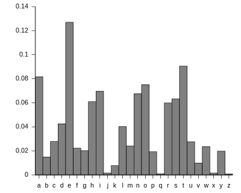

.. [#] Analyse des Concise Oxford Dictionary (9th edition, 1995) ⸺ `https://www.nd.edu <https://www3.nd.edu/~busiforc/handouts/cryptography/letterfrequencies.html>`__

Angriffe auf Monoalphabetische Chiffren
-----------------------------------------

Sie sind leicht zu knacken, da sie die Häufigkeitsdaten des ursprünglichen Alphabets wiederspiegeln.

.. container:: incremental

    Die Gegenmaßnahme besteht darin, mehrere Substitute (Homophone) für einen einzigen Buchstaben anzubieten.

Polyalphabetische Chiffren
---------------------------

.. note::
    :class: width-40

    **Alle diese Techniken haben die folgenden Merkmale gemeinsam:**

    - Es wird ein Satz verwandter monoalphabetischer Substitutionsregeln verwendet.
    - Ein Schlüssel bestimmt, welche bestimmte Regel für eine bestimmte Umwandlung gewählt wird.

Polyalphabetische Substitutions-Chiffren verbessern einfache monoalphabetische Chiffren, indem sie verschiedene monoalphabetische Substitutionen verwenden, während man die Klartextnachricht verschlüsselt.

Vigenère Chiffre
------------------

- Die bekannteste und eine der einfachsten polyalphabetischen Substitutions-Chiffren.
- In diesem Schema besteht die Menge der verwandten monoalphabetischen Substitutionsregeln aus den 26 Caesar-Chiffren mit Verschiebungen von 0 bis 25.
- Jede Chiffre wird durch einen Schlüsselbuchstaben identifiziert, der den Klartextbuchstaben durch den Chiffretextbuchstaben ersetzt.

.. class:: no-title

Vigenère-Tableau
----------------

.. grid::

    .. cell:: width-30

        .. rubric:: Aufbau des Vigenère-Tableaus

        - Kopfzeile: Klartextbuchstabe
        - 1\ . Spalte: Schlüsselbuchstabe
        - Tableau: Verschlüsselter Buchstabe

        .. container:: incremental

            **Beispiel**

            Nehmen wir an, der Schlüssel ist "D" und der Klartextbuchstabe sei "b". Dann ist der Chiffretextbuchstabe "E".

    .. cell:: width-70

        .. csv-table::
            :delim: space
            :align: right
            :class: font-size-70 ultra-compact highlight-on-hover monospaced text-align-center

            / **a** **b** **c** **d** **e** **f** **g** **h** **i** **j** **k** **l** **m** **n** **o** **p** **q** **r** **s** **t** **u** **v** **w** **x** **y** **z**
            **A** A B C D E F G H I J K L M N O P Q R S T U V W X Y Z
            **B** B C D E F G H I J K L M N O P Q R S T U V W X Y Z A
            **C** C D E F G H I J K L M N O P Q R S T U V W X Y Z A B
            **D** D E F G H I J K L M N O P Q R S T U V W X Y Z A B C
            **E** E F G H I J K L M N O P Q R S T U V W X Y Z A B C D
            **F** F G H I J K L M N O P Q R S T U V W X Y Z A B C D E
            **G** G H I J K L M N O P Q R S T U V W X Y Z A B C D E F
            **H** H I J K L M N O P Q R S T U V W X Y Z A B C D E F G
            **I** I J K L M N O P Q R S T U V W X Y Z A B C D E F G H
            **J** J K L M N O P Q R S T U V W X Y Z A B C D E F G H I
            **K** K L M N O P Q R S T U V W X Y Z A B C D E F G H I J
            **L** L M N O P Q R S T U V W X Y Z A B C D E F G H I J K
            **M** M N O P Q R S T U V W X Y Z A B C D E F G H I J K L
            **N** N O P Q R S T U V W X Y Z A B C D E F G H I J K L M
            **O** O P Q R S T U V W X Y Z A B C D E F G H I J K L M N
            **P** P Q R S T U V W X Y Z A B C D E F G H I J K L M N O
            **Q** Q R S T U V W X Y Z A B C D E F G H I J K L M N O P
            **R** R S T U V W X Y Z A B C D E F G H I J K L M N O P Q
            **S** S T U V W X Y Z A B C D E F G H I J K L M N O P Q R
            **T** T U V W X Y Z A B C D E F G H I J K L M N O P Q R S
            **U** U V W X Y Z A B C D E F G H I J K L M N O P Q R S T
            **V** V W X Y Z A B C D E F G H I J K L M N O P Q R S T U
            **W** W X Y Z A B C D E F G H I J K L M N O P Q R S T U V
            **X** X Y Z A B C D E F G H I J K L M N O P Q R S T U V W
            **Y** Y Z A B C D E F G H I J K L M N O P Q R S T U V W X
            **Z** Z A B C D E F G H I J K L M N O P Q R S T U V W X Y

Beispiel einer Vigenère-Verschüsselung
----------------------------------------

- Um eine Nachricht zu verschlüsseln, wird ein Schlüssel benötigt, der so lang ist wie die Nachricht.
- In der Regel ist der Schlüssel ein sich wiederholendes Schlüsselwort.

.. example::
    :class: incremental

    Wenn das Schlüsselwort ``deceptive`` ist, wird die Nachricht „We are discovered save yourself“ wie folgt verschlüsselt:

    ::

        Schlüssel:  DECEPTIVEDECEPTIVEDECEPTIVE
        Klartext:   wearediscoveredsaveyourself
        Geheimtext: ZICVTWQNGRZGVTWAVZHCQYGLMGJ

Vigenère *Autokey System*
--------------------------

Ein Schlüsselwort wird mit dem Klartext selbst verkettet, um einen laufenden Schlüssel zu erhalten.

.. example::
    :class: incremental

    .. csv-table::
        :stub-columns: 1
        :align: center

        Schlüssel, "

        .. container:: monospaced

            DECEPTIVE\ *wearediscoveredsav*
        "
        Klartext, ":monospaced:`wearediscoveredsaveyourself`"
        Geheimtext, ":monospaced:`ZICVTWQNGKZEIIGASXSTSLVVWLA`"

.. class:: incremental

    Auch dieses Verfahren ist anfällig für eine Kryptoanalyse, da der Schlüssel und der Klartext die gleiche Häufigkeitsverteilung der Buchstaben aufweisen und eine statistische Technik angewendet werden kann.

Vernam Chiffre
----------------

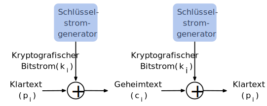

One-Time Pad
------------

.. class:: incremental-list

- Verbesserung der Vernam-Chiffre, vorgeschlagen von dem Offizier Joseph Mauborgne des Army Signal Corp.
- Verwendung eines Zufallsschlüssels, der so lang wie die Nachricht ist, so dass der Schlüssel nicht wiederholt werden muss.
- Der Schlüssel wird zum Ver- und Entschlüsseln einer einzigen Nachricht verwendet und dann verworfen.
- Jede neue Nachricht erfordert einen neuen Schlüssel mit der gleichen Länge wie die neue Nachricht.
- Das Schema ist nachweislich nicht zu knacken.

    .. class:: incremental-list

    - Erzeugt eine zufällige Ausgabe, die in keinem statistischen Zusammenhang mit dem Klartext steht.
    - Da der Chiffriertext keinerlei Informationen über den Klartext enthält, gibt es keine Möglichkeit, den Code zu knacken.

Schwierigkeiten von One-Time-Pads
---------------------------------------------------------

.. class:: incremental-list

- Das One-Time-Pad bietet vollständige Sicherheit, hat aber in der Praxis zwei grundlegende Schwierigkeiten:

    .. class:: incremental-list list-with-explanations

    1. Es gibt das praktische Problem der Herstellung großer Mengen von Zufallsschlüsseln.

        Jedes stark genutzte System könnte regelmäßig Millionen von zufälligen Zeichen benötigen.

    2. Ein „gigantisches“ Schlüsselverteilungsproblem

        Für jede zu übermittelnde Nachricht benötigen Sender und Empfänger einen gleich langen Schlüssel.

- Aufgrund dieser Schwierigkeiten ist das One-Time-Pad nur von begrenztem Nutzen; es eignet sich vor allem für Kanäle mit geringer Bandbreite, die eine sehr hohe Sicherheit erfordern.

- Das One-Time-Pad ist das einzige Kryptosystem, das eine perfekte Geheimhaltung bietet.

.. class:: new-subsection transition-fade

Transpositions-Chiffren
-------------------------

Skytale
--------

- Ältestes bekanntes (militärisches) Verschlüsselungsverfahren.
- Vor mehr als 2500 Jahren (vermutlich) von den Spartanern entwickelt.
- Die Verschlüsselung erfolgte mit einen (Holz-)Stab mit einem bestimmten Durchmesser („Schlüssel“) (Skytale).

.. image:: images/skytale.svg
    :alt: Skytale
    :align: right

.. class:: new-subsection transition-fade

Moderne-Chiffren
-------------------------

.. class:: center-content

Blockchiffre
----------------------------------------------

Blockchiffre
-------------

.. class:: incremental-list

- Ein Klartextblock wird als Ganzes behandelt und verwendet, um einen gleich langen Chiffretextblock zu erzeugen.
- In der Regel wird eine Blockgröße von 64 (8 Byte) oder 128 Bit (16 Byte) verwendet.
- beide Benutzer teilen sich einen symmetrischen Chiffrierschlüssel
- Viele netzbasierte Anwendungen, die auf symmetrische Verschlüsselung setzen, verwenden Blockchiffren.

Feistel-Chiffre
------------------

Feistel schlug die Verwendung einer Chiffre vor, bei der sich Substitutionen und Permutationen abwechseln.

.. definition::
    :class: incremental

    .. rubric:: Substitutionen

    Jedes Klartextelement oder jede Gruppe von Elementen wird eindeutig durch ein entsprechendes Chiffretextelement oder eine entsprechende Gruppe von Elementen ersetzt.

.. definition::
    :class: incremental

    .. rubric:: Permutation

    Bei einer Permutation werden keine Elemente hinzugefügt, gelöscht oder ersetzt, sondern die Reihenfolge, in der die Elemente in einer Folge erscheinen, wird geändert.

Feistel-Chiffre - Hintergrund
-------------------------------

- Hierbei handelt es sich um eine praktische Anwendung eines Vorschlags von Claude Shannon zur Entwicklung einer Chiffre, bei der sich *Konfusions- und Diffusionsfunktionen* abwechseln.

- Dieser Aufbau wird von vielen (Twofish, Blowfish, Serpent, Mars) - teilweise im Einsatz befindlichen - symmetrischen Blockchiffren verwendet.

.. container:: incremental

    **Diffusion und Konfusion**

    - Begriffe, die von Claude Shannon eingeführt wurden, um die beiden grundlegenden Bausteine für jedes kryptografische System zu erfassen.
    - Shannons Anliegen war es, die auf statistischer Analyse beruhende Kryptoanalyse zu vereiteln.

.. supplemental::

    Blowfish ist zum Beispiel die Basis für das Hashingverfahren ``bcrypt``, welches für Passworthashing verwendet wird.

Diffusion
---------------------------

- Die statistische Struktur des Klartextes wird in weitreichende Statistiken des Chiffretextes überführt, d. h. die **statistische Beziehung zwischen Klartext und Chiffretext wird so komplex wie möglich**.

.. class:: incremental list-with-explanations

- Dies wird dadurch erreicht, dass jede Klartextziffer(bzw. -zeichen) den Wert vieler Chiffretextziffern (bzw. -zeichen) beeinflusst.

  („Lawineneffekt“)
- Die Diffusion kann z. B. durch *Permutationen* erreicht werden.

Konfusion
---------------------------

- Versucht, **die Beziehung zwischen den Statistiken des Chiffriertextes und dem Wert des Chiffrierschlüssels so komplex wie möglich zu gestalten**, d. h. eine einzige Änderung des Chiffrierschlüssels sollte viele Bits des Chiffriertextes beeinflussen.

.. class:: incremental

- Selbst wenn der Angreifer die Statistik des Chiffretextes einigermaßen in den Griff bekommt, ist die Art und Weise, wie der Schlüssel verwendet wurde, um diesen Chiffretext zu erzeugen, so komplex, dass es schwierig ist, den Schlüssel abzuleiten.
- Die Verwirrung kann z. B. durch *Substitutionen* realisiert werden.

.. class:: no-title

Feistel-Chiffre - Verschlüsselung und Entschlüsselung
------------------------------------------------------------------

.. grid::

    .. cell:: width-40

        .. rubric:: Feistel-Chiffre

        Verschlüsselung und Entschlüsselung

        .. legend::
            :class: width-100

            :math:`K_x` - Schlüssel der :math:`x`-ten Runde

            :math:`L_{x-1}` - linke Hälfte des Eingabeblocks der :math:`x`-ten Runde

            :math:`R_{x-1}` - rechte Hälfte des Eingabeblocks der :math:`x`-ten Runde

            :math:`F` - Rundenfunktion

            :math:`\oplus` - XOR-Operation

    .. cell:: width-60

        .. image:: images/feistel/design.svg
            :align: center

.. supplemental::

    .. rubric:: Notwendigkeit der *Swap* Operation

    Die Verwendung des *Swap*\ s am Ende ist notwendig, damit die Verschlüsselung und Entschlüsselung identisch sind; d. h. derselbe Algorithmus verwendet werden kann.

    Zum besseren Verständnis gehen wir im Folgenden davon aus, dass wir nur eine Runde hätten:

    .. image:: images/feistel/one_round_and_swap.svg
        :align: center

    Wird der Swap am Ende nicht durchgeführt, würde die Entschlüsselung nicht funktionieren, wie am folgenden Beispiel mit nur einer Runde zu sehen ist:

    .. image:: images/feistel/one_round_no_swap.svg
        :align: center

    Ein alternatives Design wäre es beim Verschlüsseln auf den finalen Tausch zu verzichten und stattdessen beim Entschlüsseln initial einen Tausch durchzuführen — zusätzlich zum finalen Tausch. Dieses Design wird jedoch nicht verwendet, da es die Implementierung komplizierter macht.

Feistel Chiffre - Beispiel
---------------------------

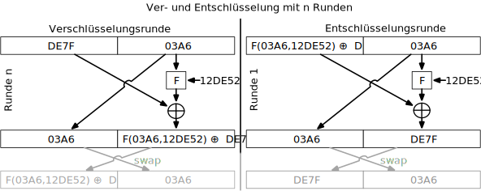

.. container:: far-smaller

    .. rubric:: Zur Erinnerung

    ::

        [F(03A6,12DE52) ⊕ DE7F] ⊕ F(03A6,12DE52) =
         F(03A6,12DE52) ⊕ F(03A6,12DE52) ⊕ DE7F  = DE7F

Entwurfsprinzipien für Blockchiffren - Anzahl der Runden
---------------------------------------------------------

.. class:: incremental-list

- Je größer die Anzahl der Runden ist, desto schwieriger ist es, eine Kryptoanalyse durchzuführen.
- Im Allgemeinen sollte das Kriterium sein, dass die Anzahl der Runden so gewählt wird, dass bekannte kryptoanalytische Bemühungen mehr Aufwand erfordern als ein einfacher Brute-Force-Schlüsselsuchangriff.
- Hätte DES 15 oder weniger Runden, würde die differentielle Kryptoanalyse weniger Aufwand erfordern als eine Brute-Force-Schlüsselsuche.

Entwurfsprinzipien für Blockchiffre - Schlüsselableitung
-------------------------------------------------------------

.. class:: incremental-list

- Bei jeder Feistel-Blockchiffre wird der Hauptschlüssel verwendet, um einen Unterschlüssel für jede Runde zu erzeugen.
- Im Allgemeinen möchten wir die Unterschlüssel so wählen, dass die Schwierigkeit, einzelne Unterschlüssel abzuleiten, und die Schwierigkeit, den Hauptschlüssel wieder zurückzuerhalten, maximiert werden.
- Es wird vorgeschlagen, dass die Schlüsselableitungsfunktion für die Unterschlüssel (:eng:`Key Schedule`) zumindest das **Strenge Lawinenkriterium** und das **Bit-Unabhängigkeitskriterium** für Schlüssel/Ciphertext garantieren sollte.

Doppelte Verschlüsselung
-------------------------------

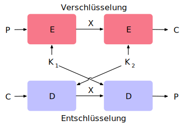

*Meet-in-the-Middle*-Angriff
-----------------------------

.. deck::

    .. card::

        .. observation::

            :math:`E(K_2,E(K_1,P)) = E(K_3,P)` ist nicht gültig.

            D. h. die zweifache Anwendung von DES führt zu einer Abbildung, die nicht äquivalent zu einer einfachen DES-Verschlüsselung ist.

            .. supplemental::

                Es gilt, dass es keinen Schlüssel :math:`DES_{K^{1-2}} = DES_{K^1} \circ DES_{K^2}` gibt. Weiterhin gilt, dass die Teilmenge der durch DES erzeugbaren Permutationen extrem klein ist und nicht abgeschlossen unter Komposition.

    .. card::

        Der Meet-in-the-Middle-Algorithmus greift dieses Verfahren an. Er hängt nicht von einer bestimmten Eigenschaft von DES ab, sondern funktioniert gegen jede Blockchiffre.

        .. class:: incremental

        - Möglicher Known-Plaintext-Angriff:

          .. class:: incremental-list

          1. Man berechnet *für alle Schlüssel* :math:`K_1` die Chiffretexte :math:`E(K_1,P)` und speichert diese.
          2. Man berechnet *für alle Schlüssel* :math:`K_2` die Klartexte :math:`D(K_2,C)` .
          3. Man vergleicht die beiden Ergebnisse und prüft, ob es Übereinstimmungen gibt.

          .. container:: incremental

            Dieser Aufwand ist lediglich doppelt so hoch wie der Aufwand bei einer einfachen Verschlüsselung.

    .. card::

        .. warning::

            Die zweifache Anwendung einer Blockchiffre ist nicht sinnvoll!

            Das Ergebnis ist, dass ein bekannter Klartextangriff gegen Doppel-DES mit einem Aufwand in der Größenordnung von :math:`2^{56}` *im Durchschnitt* erfolgreich ist, verglichen mit *durchschnittlich* :math:`2^{55}` für einen einfachen DES.

Advanced Encryption Standard (AES)\ [#]_
----------------------------------------------------

.. [#] `NIST FIPS PUB 197, "Advanced Encryption Standard (AES)" <https://nvlpubs.nist.gov/nistpubs/FIPS/NIST.FIPS.197.pdf>`_

.. csv-table:: Parameter
    :width: 100%
    :class: booktabs highlight-row-on-hover table-header-align-left incremental-table-rows
    :stub-columns: 1

    Schlüsselgröße (words/bytes/bits), 4/16/128, 6/24/192, 8/32/256
    Blockgröße (*Block Size*) (words/bytes/bits), 4/16/128, 4/16/128, 4/16/128
    Anzahl der Runden, 10, 12, 14
    Größe des Rundenschlüssels (*RoundKeys*) (words/bytes/bits), 4/16/128, 4/16/128, 4/16/128
    Expandierte Schlüsselgröße (words/bytes), 44/176, 52/208, 60/240

AES Verschlüsselungsprozess
-----------------------------

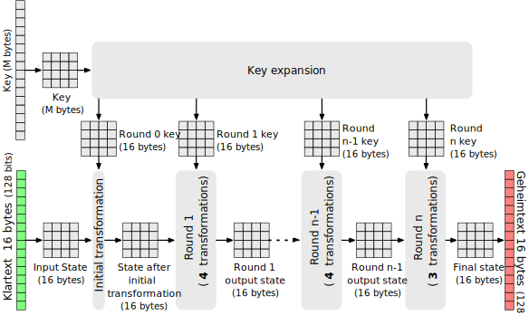

Betriebsmodi von Blockchiffren
-------------------------------

- Eine Technik zur Verbesserung der Wirkung eines kryptografischen Algorithmus oder zur Anpassung des Algorithmus an ein Anwendungsszenario. Insbesondere in Abhängigkeit von der Länge des Klartexts.
- Um eine Blockchiffre in einer Vielzahl von Anwendungen einsetzen zu können, hat das NIST Betriebsmodi definiert.
- Diese Modi sind für die Verwendung mit jeder symmetrischen Blockchiffre vorgesehen, einschließlich AES.

Betriebsmodi - Übersicht
------------------------------

.. story::

    .. csv-table::
        :class: highlight-row-on-hover incremental-table-rows sticky-header
        :width: 100%
        :widths: 20 40 40
        :header: Modus, Beschreibung, Typische Anwendung

        **Electronic Codebook (ECB)**, Jeder Block von Klartextbits wird unabhängig voneinander mit demselben Schlüssel verschlüsselt., "
        • Sichere Übertragung einzelner Werte (z. B. eines Verschlüsselungsschlüssels)
        "
        **Cipher Block Chaining (CBC)**, Die Eingabe für den Verschlüsselungsalgorithmus ist die XOR-Verknüpfung des nächsten Klartextblocks mit dem vorangegangenen Chiffretextblock., "
        - Universelle blockorientierte Übertragung
        - Authentifizierung
        "
        ... , ... , ...
        "**Counter (CTR**)", "Jeder Klartextblock wird mit einem verschlüsselten Zähler XOR-verknüpft. Der Zähler wird für jeden nachfolgenden Block erhöht.", "
        - Blockorientierte Übertragung für allgemeine Zwecke
        - Nützlich für Hochgeschwindigkeitsanforderungen
        "

Electronic Codebook\ [#]_
--------------------------

.. image:: images/ecb_encryption.svg
    :align: center

.. [#] Bilder von: `White Timberwolf <https://commons.wikimedia.org/wiki/User:WhiteTimberwolf>`__

Padding-Modi in Blockchiffren
-------------------------------------

.. story::

    .. remark::

        Bei Blockchiffren (z. B. AES mit 128 Bit = 16 Byte Blockgröße) muss die zu verschlüsselnde Nachricht eine exakte Vielfache der Blockgröße sein. Ist das nicht der Fall, wird Padding verwendet, um die Nachricht auf ein vielfaches der Blockgröße zu bringen.

    .. rubric:: Ausgewählte Modi

    .. class:: incremental-list

    - PKCS#7

      Füllt den restlichen Block mit Bytes, deren Wert gleich der Anzahl hinzugefügter Bytes ist.

      .. example::

        - Nachricht mit 13 Byte → 3 Bytes Padding → ``03 03 03``
        - Nachricht mit Blocklänge (z. B. 16 Byte) → ein kompletter zusätzlicher Block mit 16 × ``0x10``

    - ANSI X.923

      Auffüllen mit ``0x00``, außer dem letzten Byte, das die Anzahl Padding-Bytes angibt.

    - ISO/IEC 7816-4

      Beginnt mit ``0x80``, gefolgt von Nullen.

    - Zero Padding

      .. attention::

        Füllt mit Nullen (``0x00``). Funktioniert **nur**, wenn die Nachricht nie mit `0x00` endet, sonst ist Entschlüsselung mehrdeutig!

    .. compound::
        :class: incremental

        .. rubric:: Verhalten bei voller Blockgröße - Zusammenfassung

        Angenommen, die Nachricht ist exakt 16 Byte lang (z. B. `"1234567890ABCDEF"`), so ergibt sich:

        =================  ======================================================
        **Padding-Modus**   **Erweiterte Nachricht (hex)**
        PKCS#7              `... 10 10 10 10 10 10 10 10 10 10 10 10 10 10 10 10`
        ANSI X.923          `... 00 00 00 00 00 00 00 00 00 00 00 00 00 00 00 10`
        ISO/IEC 7816-4      `... 80 00 00 00 00 00 00 00 00 00 00 00 00 00 00 00`
        Zero Padding        `... 00 00 00 00 00 00 00 00 00 00 00 00 00 00 00 00`
        =================  ======================================================

        Hinweis: Bei allen Modi wird bei Nachrichten mit dem x-fachen der Blocklänge ein **zusätzlicher** Padding-Block hinzugefügt, um bei der Entschlüsselung korrekt erkennen zu können, ob Padding entfernt werden muss.

Probleme bei der Verwendung der Verschlüsselung im ECB-Modus
----------------------------------------------------------------

.. deck::

    .. card::

        .. grid::

            .. cell:: width-30

                *ECB-Tux* - der Linux-Pinguin verschlüsselt im ECB-Modus:

                Quelle: https://github.com/robertdavidgraham/ecb-penguin

            .. cell:: width-70

                .. image:: images/tux.ecb.from_robert_david_graham.webp
                    :align: center

    .. card::

        Kriterien und Eigenschaften für die Bewertung und Konstruktion von Blockchiffre-Betriebsarten, die ECB überlegen sind.

        - Overhead
        - Fehlerbehebung
        - Fehlerfortpflanzung
        - Streuung
        - Sicherheit

*Counter Mode*
-----------------

.. [#] Bilder von: `White Timberwolf <https://commons.wikimedia.org/wiki/User:WhiteTimberwolf>`__

*Counter Mode* - Vorteile
-------------------------

.. class:: incremental-list

:Hardware-Effizienz: kann von der Parallelisierung der Hardware profitieren
:Software-Effizienz: leicht parallelisierbar in Software
:Vorverarbeitung: die Verschlüsselung der Zähler
:Zufälliger Zugriff: der i-te Block des Klartextes/des Chiffretextes kann im Zufallszugriff verarbeitet werden
:Nachweisbare Sicherheit: genauso sicher wie die anderen Verfahren
:Einfachheit: es wird nur der Verschlüsselungsalgorithmus benötigt
:Verwendbarkeit: Verwandelt eine Blockchiffre in eine Stromchiffre

.. class:: center-content

Stromchiffre
----------------------------------------------

Erzeugung und Zufälligkeit von Zufallszahlen
-----------------------------------------------

- Eine Reihe von Sicherheitsalgorithmen und -protokollen, die auf Kryptographie basieren, verwenden binäre Zufallszahlen:

  - Schlüsselverteilung und reziproke (:ger:`wechselseitige`) Authentifizierungsverfahren
  - Erzeugung von Sitzungsschlüsseln
  - Generierung von Schlüsseln für den RSA Public-Key-Verschlüsselungsalgorithmus
  - Generierung eines Bitstroms für die symmetrische Stromverschlüsselung

.. container:: incremental

   Es gibt zwei unterschiedliche Anforderungen an eine Folge von Zufallszahlen:

   .. class:: incremental-list

   - Zufälligkeit
   - Unvorhersehbarkeit

Zufälligkeit
--------------

- Die Erzeugung einer Folge von angeblich zufälligen Zahlen, die in einem genau definierten statistischen Sinne zufällig sind, war ein Problem.

.. class:: incremental

- Zwei Kriterien werden verwendet, um zu prüfen, ob eine Zahlenfolge zufällig ist:

  :Gleichmäßige Verteilung: Die Häufigkeit des Auftretens von Einsen und Nullen sollte ungefähr gleich sein.
  :Unabhängigkeit: Keine Teilsequenz der Folge kann von den anderen abgeleitet werden.

Unvorhersehbarkeit
--------------------

.. deck::

    .. card::

        Ein Strom von Pseudozufallszahlen sollte zwei Formen der Unvorhersehbarkeit aufweisen:

        .. class:: incremental-list dhbw

        1. **Vorwärtsgerichtete Unvorhersehbarkeit**

           Wenn der Seed unbekannt ist, sollte das nächste erzeugte Bit in der Sequenz trotz Kenntnis der vorherigen Bits in der Sequenz unvorhersehbar sein.

        2. **Rückwärtsgerichtete Unvorhersehbarkeit**

           - Es sollte nicht möglich sein, den Seed aus der Kenntnis der erzeugten Werte zu bestimmen.
           - Es sollte keine Korrelation zwischen einem Seed und einem aus diesem Seed generierten Wert erkennbar sein.
           - Jedes Element der Sequenz sollte wie das Ergebnis eines unabhängigen Zufallsereignisses erscheinen, dessen Wahrscheinlichkeit 1/2 ist.

    .. card:: center-child-elements

        .. hint::

            Dieselbe Reihe von Tests für die Zufälligkeit liefert auch einen Test für die Unvorhersehbarkeit: Eine Zufallsfolge hat keine Korrelation mit einem festen Wert (dem Seed).

Pseudozufallszahlen
---------------------

Bei kryptografischen Anwendungen werden in der Regel algorithmische Verfahren zur Erzeugung von Zufallszahlen verwendet.

.. class:: incremental-list

- Diese Algorithmen sind deterministisch und erzeugen daher Zahlenfolgen, die nicht statistisch zufällig sind.
- Wenn der Algorithmus gut ist, bestehen die resultierenden Sequenzen viele Tests auf Zufälligkeit und werden als Pseudozufallszahlen bezeichnet.

Visualisierung von (schlechten) Zufallszahlengeneratoren\ [#]_
----------------------------------------------------------------

.. [#] Zufallszahlengenerator ≘ :eng:`Random Number Generator (RNG)`

.. grid::

    .. cell:: width-50

        Erwartete Verteilung von Zufallswerten im 3D-Raum.

        .. image:: images/distribution_3d_expected.svg
            :alt: Erwartete Verteilung der Werte im 3D-Raum
            :align: center

    .. cell:: width-50 incremental

        Verteilung von „zufälligen“ Werten eines schlechten RNGs im 3D-Raum.

        .. image:: images/distribution_3d_bad_lcg.svg
            :alt: Schlechte Verteilung der Werte im 3D-Raum
            :align: center

.. supplemental::

    Bei diesem Experiment werden immer drei nacheinander auftretende Werte als Koordinate im 3D-Raum interpretiert. Die erwartete Verteilung ist eine gleichmäßige Verteilung im Raum. Die Verteilung der Werte eines schlechten RNGs ist nicht gleichmäßig und zeigt eine klare Struktur.

Echter Zufallszahlengenerator (TRNG)
------------------------------------

.. class:: incremental-list

- Nimmt als Eingabe eine Quelle, die effektiv zufällig ist.
- Die Quelle wird als Entropiequelle bezeichnet und stammt aus der physischen Umgebung des Computers:

  - Dazu gehören z. B. Zeitpunkte von Tastenanschlägen, elektrische Aktivität auf der Festplatte, Mausbewegungen und Momentanwerte der Systemuhr.
  - Die Quelle oder eine Kombination von Quellen dient als Eingabe für einen Algorithmus, der eine binäre Zufallsausgabe erzeugt.

- Der TRNG kann einfach die Umwandlung einer analogen Quelle in eine binäre Ausgabe beinhalten.
- Der TRNG kann zusätzliche Verarbeitungsschritte durchführen, um etwaige Verzerrungen in der Quelle auszugleichen.
- Moderne Prozessoren enthalten Instruktionen die echte Zufallszahlen generieren können (sollen).

.. class:: exercises

Übung
-------

.. exercise:: Test auf Zufälligkeit

    Test auf Zufälligkeit: Gegeben sei eine Bitfolge, die von einem RNG erzeugt wurde. Was ist das erwartete Ergebnis, wenn man gängige Komprimierungsprogramme (z. B. 7zip, gzip, rar, ...) verwendet, um die Datei zu komprimieren; d. h. welchen Kompressionsgrad erwarten Sie?

    .. solution::
        :pwd: NixKompression

        Es sollte keine relevante Kompression möglich sein! Wenn dem so ist, ist die Zufälligkeit höchst fragwürdig. Eine hohe Zufälligkeit impliziert eine hohe Entropie und damit nichts, was man komprimieren könnte. Im Endeffekt müsste die „komprimierte“ Datei aufgrund der erforderlichen Metadaten sogar größer sein.

Allgemeine Struktur einer typischen Stromchiffre
-------------------------------------------------

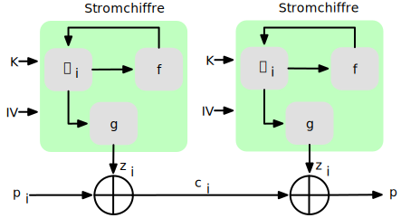

.. grid::

    .. cell:: width-20

        Klartext: p\ :sub:`i`

        Chiffretext: c\ :sub:`i`

        Schlüsselstrom: z\ :sub:`i`

    .. cell:: width-20

        Schlüssel: K

        Initialisierungswert: IV

    .. cell:: width-50

        Zustand: σ\ :sub:`i`

        Funktion zur Berechnung des nächsten Zustands: f

        Schlüsselstromfunktion: g

.. supplemental::

    Die Schlüsselstromfunktion g projeziert den internen Zustand (welcher sehr groß sein kann) auf den nächsten Block/das nächste Byte, das zur Verschlüsselung verwendet wird.

Überlegungen zum Entwurf von Stromchiffren
-------------------------------------------

.. story::

    .. class:: incremental-list dd-margin-left-4em

    :Die Verschlüsselungssequenz sollte eine große Periode haben:
        Ein Pseudozufallszahlengenerator verwendet eine Funktion, die einen deterministischen Strom von Bits erzeugt, der sich schließlich wiederholt; je länger die Wiederholungsperiode, desto schwieriger wird die Kryptoanalyse.

    :Der Schlüsselstrom sollte die Eigenschaften eines echten Zufallszahlenstroms so gut wie möglich nachbilden:
        Es sollte eine ungefähr gleiche Anzahl von 1en und 0en geben.

        Wenn der Schlüsselstrom als ein Strom von Bytes behandelt wird, sollten alle 256 möglichen Byte-Werte ungefähr gleich oft vorkommen.

    :Eine Schlüssellänge von mindestens 128 Bit ist wünschenswert:
        Die Ausgabe des Pseudo-Zufallszahlengenerators ist vom Wert des Eingabeschlüssels abhängig.

        Es gelten die gleichen Überlegungen wie für Blockchiffren.

    :Mit einem richtig konzipierten Pseudozufallszahlengenerator kann eine Stromchiffre genauso sicher sein wie eine Blockchiffre mit vergleichbarer Schlüssellänge:

        Ein potenzieller Vorteil ist, dass Stromchiffren, die keine Blockchiffren als Baustein verwenden, in der Regel schneller sind und weit weniger Code benötigen als Blockchiffren.

Historische Stromchiffre: RC 4
---------------------------------

- 1987 von Ron Rivest für RSA Security entwickelt.
- Stromchiffre mit variabler Schlüsselgröße und byteorientierten Operationen, die in Software sehr schnell ausgeführt werden können.
- Basiert auf der Verwendung einer zufälligen Permutation.

.. warning::
    :class: incremental

    In der RC 4-Schlüsselableitungsfunktion wurde eine grundlegende Schwachstelle aufgedeckt, die den Aufwand für die Ermittlung des Schlüssels verringert.

    Es wurde gezeigt, dass es möglich ist *wiederholt* verschlüsselte Klartexte wiederherzustellen.

    Aufgrund der Schwachstellen hat die IETF RFC 7465 herausgegeben, der die Verwendung von RC4 in TLS verbietet. In seinen TLS-Richtlinien verbietet das NIST ebenfalls die Verwendung von RC4 für Regierungszwecke.

ChaCha20
----------

.. class:: incremental-list list-with-explanations

- ChaCha20 ist eine Stromchiffre, die von Daniel J. Bernstein entwickelt wurde.
- ChaCha20 ist ein schneller Verschlüsselungsalgorithmus (ohne besondere Hardwareanforderungen).

  Reine Softwareimplementierungen von ChaCha20 sind reinen Softwareimplementierungen von AES in Bezug auf die Geschwindigkeit überlegen.
- ChaCha20 ist im `RFC 8439 <https://datatracker.ietf.org/doc/html/rfc8439>`__ spezifiziert.

.. class:: new-subsection transition-fade

Steganografie
-------------------------

Text-basierte Steganografie
-----------------------------

.. exercise:: Entschlüsseln

    .. code:: Text
        :class: copy-to-clipboard

        Dear Friend ; We know you are interested in receiving cutting-edge
        announcement . If you are not interested in our publications and wish to be
        removed from our lists, simply do NOT respond and ignore this mail . This mail
        is being sent in compliance with Senate bill 1626 ; Title 4 , Section 305 .
        This is a ligitimate business proposal ! Why work for somebody else when you
        can become rich in 96 months . Have you ever noticed nobody is getting any
        younger & nobody is getting any younger . Well, now is your chance to
        capitalize on  this ! We will help you decrease perceived waiting time by 170%
        and use credit cards on your website ! You are guaranteed to succeed because
        we take all the risk ! But don't believe us . Mrs Anderson of Indiana tried us
        and says "I was skeptical but it worked for me" . We assure you that we
        operate within all applicable laws . You will blame yourself forever if you
        don't order now . Sign up a friend and you'll get a discount of 10% !
        Thank-you for your serious consideration of our offer !

    Mit Spammimic https://www.spammimic.com/, kann die Nachricht extrahiert werden.

    .. solution:: Steganografie
        :pwd: Success!

        Die Nachricht ist: "Success!"

Auswahl anderer Steganographie-Techniken
------------------------------------------

.. class:: incremental-list list-with-explanations

- **Zeichenmarkierung**

  Ausgewählte Buchstaben eines gedruckten oder maschinengeschriebenen Textes werden mit Bleistift überstrichen. Die Markierungen sind nur sichtbar, wenn das Papier schräg in helles Licht gehalten wird.

- **Unsichtbare Tinte**

  Es gibt eine Reihe von Substanzen, die zum Schreiben verwendet werden können, aber keine sichtbaren Spuren hinterlassen, solange das Papier nicht erhitzt oder mit einer chemischen Substanz behandelt wird.

- **Nadelstiche**

  Kleine Nadelstiche auf ausgewählten Buchstaben sind normalerweise nicht sichtbar, es sei denn, das Papier wird vor ein Licht gehalten.

- **Sehr helle Tinte**

  Druckerhersteller drucken winzige Punktmuster in sehr hellen Farben auf die Seiten. Dies erlaubt es Dokumente zu dem Drucker zurückzuverfolgen, auf dem sie gedruckt wurden.

Steganographie vs. Verschlüsselung
-----------------------------------

- Steganografie hat eine Reihe von *Nachteilen* im Vergleich zur Verschlüsselung:

  .. class:: incremental-list negative-list

  - Es erfordert einen hohen Overhead, um relativ wenige Bits an Informationen zu verbergen.
  - Sobald das System entdeckt wird, wird es praktisch wertlos.

.. class:: incremental

- Der *Vorteil* der Steganografie:

  .. class:: incremental-list positive-list

  - Sie kann von Parteien eingesetzt werden, die etwas zu verlieren haben, wenn die Tatsache ihrer geheimen Kommunikation (nicht unbedingt der Inhalt) entdeckt wird.
  - Verschlüsselung kennzeichnet den Verkehr als wichtig oder geheim oder kann den Sender oder Empfänger als jemanden identifizieren, der etwas zu verbergen hat.

.. class:: new-section transition-fade

Hashverfahren bzw. Hashfunktionen
-----------------------------------

Hashfunktionen
-------------------------------

.. class:: incremental-list

- Eine Hashfunktion :math-i:`H` akzeptiert eine beliebig lange Nachricht :math-i:`M` als Eingabe und gibt einen Wert fixer Größe zurück: :math-i:`h = H(M)`.
- Wird oft zur Gewährleistung der Datenintegrität verwendet. Eine Änderung eines beliebigen Bits in :math-i:`M` sollte mit hoher Wahrscheinlichkeit zu einer Änderung des Hashwerts :math-i:`h` führen.
- Kryptographische Hashfunktionen werden für Sicherheitsanwendungen benötigt. Mögliche Anwendungen:

  - Authentifizierung von Nachrichten
  - Digitale Signaturen
  - Speicherung von Passwörtern

Beispiel: Berechnung von Hashwerten mittels MD5
-------------------------------------------------------

::

    md5("Hello") = 8b1a9953c4611296a827abf8c47804d7
    md5("hello") = 5d41402abc4b2a76b9719d911017c592
    md5("Dieses Passwort ist wirklich total sicher
         und falls Du es mir nicht glaubst, dann
         tippe es zweimal hintereinander blind
         fehlerfrei ein.")
                 = 8fcf22b1f8327e3a005f0cba48dd44c8

.. warning::
    :class: incremental

    Die Verwendung von MD5 dient hier lediglich der Illustration. In realen Anwendung sollte MD5 nicht mehr verwendet werden, da es nachgewiesene Schwachstellen aufweist.

Sicherheitsanforderungen an kryptografische Hashfunktion
----------------------------------------------------------

.. story::

    .. class:: incremental-list

    :Variable Eingabegröße: :math-i:`H` kann auf einen Block beliebiger Größe angewendet werden.

    :Pseudozufälligkeit: Die Ausgabe von :math-i:`H` erfüllt die Standardtests für Pseudozufälligkeit.

    :Einweg Eigenschaft:

        Es ist rechnerisch/praktisch nicht machbar für einen gegeben Hashwert :math-i:`h` ein :math-i:`N` zu finden so dass gilt: :math-i:`H(N) = h`

        (:eng:`Preimage resistant; one-way property`)

        .. presenter-note::

            Es ist also *praktisch* unmöglich die ursprüngliche Nachricht zu finden die auf den Hashwert abbildet. (Zum Beispiel bei Passwörtern notwendig!)

    :Schwache Kollisionsresistenz:

        Es ist rechnerisch nicht machbar für eine gegebene Nachricht :math-i:`M` eine Nachricht :math-i:`N` zu finden so dass gilt: :math:`M \neq N` mit :math:`H(M) = H(N)`

        (:eng:`Second preimage resistant; weak collision resistant`)

        .. presenter-note::

            Sehr relevant, wenn wir ein Dokument signieren wollen und sicherstellen müssen, dass das Dokument nicht nachträglich gefälscht werden kann.

    :Starke Kollisionsresistenz:

        Es ist rechnerisch unmöglich ein paar :math:`(N,M)` zu finden so dass gilt: :math:`H(M) = H(N)`.

        (:eng:`Collision resistant; strong collision resistant`)

        .. presenter-note::

            D. h. der Angreifer darf *zwei Nachrichten frei wählen* und somit ist es so, dass dies eine stärkere Anforderung an den Hashalgorithmus ist, da er mehr Angriffsmöglichkeiten hat. Bei der schwachen reicht es aus, wenn der Hashalgorithmus so gut ist, dass es nicht möglich ist *zu einer gegegebenen Nachricht eine Zweite zu finden*.

.. supplemental::

    **Hintergrund**

    Im Deutschen wird auch von Urbild-Angriffen gesprochen. In dem Fall ist *preimage resistance* (d. h. die Einweg Eigenschaft) gleichbedeutend damit, dass man nicht effektiv einen „Erstes-Urbild-Angriff“ durchführen kann. Hierbei ist das Urbild die ursprüngliche Nachricht :math:`M`, die *gehasht* wurde.

    *Second preimage resistance* ist dann gleichbedeutend damit, dass man nicht effektiv einen „Zweites-Urbild-Angriff“ durchführen kann. Es ist nicht möglich zu einer Nachricht M eine zweite Nachricht N (d. h. ein zweites Urbild) zu finden, die für eine gegebene Hashfunktion den gleichen Hash aufweist.

Nachrichtenauthentifizierung - vereinfacht
-------------------------------------------------------
.. deck::

    .. card::

        Nachrichten können auf verschiedene Weisen authentifiziert werden, so dass *Person-in-the-Middle-Angriffe*\ [#]_ verhindert werden können.

    .. card::

        .. figure:: images/digests/all_encrypted.svg
            :align: center

            Garantiert Authentizität und Vertraulichkeit.

    .. card::

        .. figure:: images/digests/hash_encrypted.svg
            :align: center

            Garantiert Authentizität, benötigt aber sowohl Hashing als auch Verschlüsselung.

    .. card::

        .. figure:: images/digests/secret_appended.svg
            :align: center

            Garantiert Authentizität und es wird nur ein Hashalgorithmus benötigt; anfällig für bestimmte Angriffe - insbesondere gegen Angriffe mit Längenerweiterung bei Hashverfahren basierend auf Merkle-Damgard Konstruktionen.

    .. card::

        .. figure:: images/digests/secret_encrypted.svg
            :align: center

            Garantiert Authentizität und Vertraulichkeit.

.. [#] *Person-in-the-Middle* (in Standards auch *on-path attack*) ist die gender-neutrale Version von *man-in-the-Middle*.

.. supplemental::

    **Szenarien**

    Im ersten Szenario wird der Hash an die Nachricht angehängt und als Ganzes verschlüsselt. Wir erhalten Vertraulichkeit und Authentizität.

    Im zweiten Szenario wird der Hash der Nachricht berechnet und dann verschlüsselt. Der Empfänger kann den Hash berechnen und mit dem entschlüsselten Hash vergleichen. Wir erhalten Authentizität, aber keine Vertraulichkeit.

    Im dritten Szenario wird an die Nachricht ein geteiltes Secret angehängt und  alles zusammen gehasht. Die Nachricht wird dann mit dem Ergebnis der vorhergehenden Operation zusammen verschickt.

    Im letzten Szenario werden alle Ansätze kombiniert.

    .. legend::

        :M: die Nachricht
        :H: die Hashfunktion
        :E: der Verschlüsselungsalgorithmus
        :D: der Entschlüsselungsalgorithmus
        :K: ein geheimer Schlüssel
        :S: eine geheime Zeichenkette
        :||: die Konkatenation von zwei Werten (d. h. das Aneinanderhängen von zwei Werten)

    .. hint::

        Bei *Person-in-the-Middle-Angriffen* handelt es sich um einen Fachbegriff und häufig wird zum Beispiel Eve oder Mallory verwendet, um die Person zu bezeichnen, die den Angriff durchführt. Gelegentlich wird auch *Adversary-in-the-Middle* oder früher *Man-in-the-Middle* verwendet.

    .. rubric:: Hashes und Message-Digests

    Im allgemeinen Sprachgebrauch wird auch von :eng:`Message Digests` gesprochen.

Digitale Signaturen - vereinfacht
-------------------------------------------------------

.. deck::

    .. card::

        Digitale Signaturen dienen (auch) dem Nachweis der :emph:`Authentizität` und :emph:`Integrität` einer Nachricht. Darüber hinaus garantieren sie die :emph:`Nichtabstreitbarkeit`: Der Absender kann nicht bestreiten, der Urheber der Nachricht zu sein.

        Jede Person, die den öffentlichen Schlüssel besitzt, kann die Signatur überprüfen. Nur der Inhaber des zugehörigen privaten Schlüssels ist jedoch in der Lage, die Signatur zu erzeugen.

    .. card::

        .. figure:: images/signatures/just_authentication.svg
            :align: center

            Authentizität und Nichtabstreitbarkeit

    .. card::

        .. figure:: images/signatures/authentication_and_encryption.svg
            :align: center

            Authentizität, Vertraulichkeit und Nichtabstreitbarkeit

.. supplemental::

    **Legende**

    :M: die Nachricht
    :H: die Hashfunktion
    :E: der Verschlüsselungsalgorithmus
    :D: der Entschlüsselungsalgorithmus
    :PR\ `a`:sub:: der private Schlüssel von a
    :PU\ `a`:sub:: der öffentliche Schlüssel von a
    :||: die Konkatenation von zwei Werten (d. h. das Aneinanderhängen von zwei Werten)

Anforderungen an die Resistenz von Hashfunktionen
---------------------------------------------------

.. csv-table::
    :header: "", Preimage Resistant, Second Preimage Resistant, Collision Resistant
    :class: incremental-table-rows highlight-row-on-hover booktabs table-data-align-center table-body-header-align-left
    :stub-columns: 1
    :widths: 28, 10, 10, 10

    Hash + Digitale Signaturen, ✓, ✓, ✓
    Einbruchserkennung und Viruserkennung, , ✓ ,
    Hash + Symmetrische Verschlüsselung, , ,
    Passwortspeicherung, ✓, ,
    MAC, ✓, ✓, ✓

.. supplemental::

    .. rubric:: Einbruchserkennung und Viruserkennung - Hintergrund

    Bei der Einbruchserkennung und Viruserkennung ist *second preimage* Resistenz erforderlich. Andernfalls könnte ein Angreifer seine Malware so schreiben, dass diese einen Hash wie eine vorhandene gutartige Software hat und so verhindern, dass die Malware auf eine schwarze Liste gesetzt werden kann, ohne den Kollateralschaden, dass auch die gutartige Software fälschlicherweise als Malware erkannt wird.

    .. rubric:: Aufwand eines Kollisionsangriffs

    Ein Kollisionsangriff erfordert weniger Aufwand als ein *preimage* oder ein *second preimage* Angriff.

    Dies wird durch das Geburtstagsparadoxon erklärt. Wählt man Zufallsvariablen aus einer Gleichverteilung im Bereich von :math-r:`0` bis :math:`N-1`, so übersteigt die Wahrscheinlichkeit, dass ein sich wiederholendes Element gefunden wird, nach :math:`\sqrt{N}` (für große :math-i:`N`) Auswahlen :math-r:`0,5`. Wenn wir also für einen m-Bit-Hashwert Datenblöcke zufällig auswählen, können wir erwarten, zwei Datenblöcke innerhalb von :math:`\sqrt{2^m} = 2^{m/2}` Versuchen zu finden.

    .. example::

        Es ist relativ einfach, ähnliche Meldungen zu erstellen. Wenn ein Text 8 Stellen hat, an denen ein Wort mit einem anderen ausgetauscht werden kann, dann hat man bereits 2⁸ verschiedene Texte.

        Es ist relativ trivial(1), vergleichbare(2) Nachrichten(3) zu schreiben(4). Wenn ein Text 8 Stellen hat, an denen ein Ausdruck(5) mit einem vergleichbaren (6) ausgetauscht werden kann, dann erhält(7) man bereits 2⁸ verschiedene Dokumente(8).

Effizienzanforderungen an kryptografische Hashfunktionen
------------------------------------------------------------------------

:Effizienz bei der Verwendung für Signaturen und zur Authentifizierung:

  Bei der Verwendung zur Nachrichtenauthentifizierung und für digitale Signaturen ist :math-i:`H(N)` für jedes beliebige :math-i:`N` relativ einfach zu berechnen. Dies soll sowohl Hardware- als auch Softwareimplementierungen ermöglichen.

.. container:: incremental

    .. container:: text-align-center bold huge

        vs.

    :Brute-Force-Angriffe auf Passwörter erschweren:

        Bei der Verwendung für das Hashing von Passwörtern soll es schwierig sein den Hash effizient zu berechnen, selbst auf spezialisierter Hardware (GPUs, ASICs).

Struktur eines sicheren Hash-Codes
------------------------------------------------------------------------

(Vorgeschlagen von Merkle.)

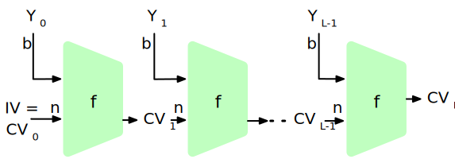

.. class:: columns left-aligned dd-margin-left-3em

-       :IV: Initialer Wert (Algorithmus-abhängig)

        :CV\ `i`:sub:: Verkettungsvariable

        :Y\ `i`:sub:: i-er Eingabeblock

        :f: Kompressionsfunktion

-       :n: Länge des Blocks

        :L: Anzahl der Eingabeblöcke

        :b: Länge des Eingabeblocks

.. supplemental::

    Diese Struktur liegt insbesondere den Hashfunktionen der SHA-2 Familie zugrunde.

.. class:: exercises

Übung
-------

.. exercise:: Irrelevanz von Second-Preimage-Resistenz und Kollisionssicherheit

    Warum sind *Second-Preimage-Resistenz* und Kollisionssicherheit von nachgeordneter Relevanz, wenn der Hash-Algorithmus zum Hashing von Passwörtern verwendet wird?

    .. solution::
        :pwd: kein Startpunkt

        Wir haben keinen Block der Nachricht, mit dem wir arbeiten können, und wir haben keinen Vorteil davon, zwei beliebige aber verschiedene Nachrichten zu finden, die denselben Hash haben; eine reicht. Bei der Passwortwiederherstellung liegt uns immer ein Hashwert vor, und wir versuchen, *eine* Nachricht zu finden, die diesen Hashwert erzeugt hat.

Hashverfahren: Die SHA-Familie (Secure Hash Algorithms)
---------------------------------------------------------

.. story::

    .. class:: incremental-list

    - eine Gruppe kryptographischer Hashfunktionen, die von der US-amerikanischen NIST standardisiert wurden.
    - Anwendungsziele:

      - Prüfsummenbildung (Integrität)
      - Digitale Signaturen
      - Basis für weitere kryptographische Konstrukte (z. B. HMAC)

    - Mitglieder:

      - SHA-1 hat 160 Bit und wird seit 2004 nicht mehr als sicher betrachtet; praktikable Angriffe gibt es seit 2009
      - SHA-2 entwickelt im Jahr 2000 und umfasst 224, 256, 384 und 512 Bit Varianten
      - SHA-3 2015 spezifiziert und basiert auf Keccak

Zero-Knowledge Protokolle
---------------------------

.. deck::

    .. card::

        .. container:: accentuate

            Die Idee ist, dass man jemanden davon überzeugen möchte, dass man eine bestimmte Information hat, ohne diese Information zu offenbaren.

    .. card::

        .. example::

            .. rubric:: Der geheimnisvolle Geheimgang

            Peggy möchte Victor überzeugen, dass Sie den Code zur Tür kennt, ohne ihn zu offenbaren.

            .. grid::

                .. cell:: width-60

                    .. class:: incremental-list

                    - Peggy wählt einen der Wege zur Tür, während Victor an der Stelle A steht und darauf wartet, dass Sie bei der Tür ist.
                    - Sobald Peggy Bescheid gibt, dass Sie an der Tür angekommen ist, geht Victor zu Punkt B und sagt Peggy auf welchem Weg sie zurückkommen soll.
                    - Kommt sie auf dem falschen Weg zurück, dann kennt sie den Code der Tür (offensichtlich) nicht. Kommt sie auf dem richtigen Weg zurück, könnte es noch immer Zufall gewesen sein mit Wahrscheinlichkeit :math:`\frac{1}{2}`.

                .. cell:: width-40

                    .. image:: images/zkp-geheimgang.svg
                        :align: center

                    .. container:: incremental

                        Wird das Spiel jedoch :math-i:`n` mal gespielt und Peggy kommt immer auf dem richtigen Weg zurück, dann ist die Wahrscheinlichkeit, dass Peggy immer zufällig den richtigen Weg genommen hat :math:`\frac{1}{2^n}`.

    .. card::

        Viele Zero-Knowledge Protokolle basieren darauf, dass man im Prinzip ein Spiel spielt, das man auch zufällig gewinnen kann. Durch die Wiederholung des Spiels wird die Wahrscheinlichkeit jedoch für permanentes zufälliges Gewinnen sehr schnell sehr klein (exponentiell). Somit kann man für praktische Zwecke hinreichend sicher sein, dass der Beweisführende (im Beispiel Peggy) über das Wissen verfügt, das er vorgibt zu besitzen, wenn er immer gewinnt.

        Nach :math-r:`20` Runden ist die Wahreinschlichkeit nur noch :math:`1/2^{20} = 1/1 048 576`.

        Mit :math-r:`128` Runden erreicht man ein Sicherheitsniveau, das vergleichbar ist mit anderen kryptographischen Verfahren (AES-128, SHA-256, ...).

.. class:: center-content

*Message Authentication Codes* (MACs)
----------------------------------------------

.. supplemental::

    .. hint::

        *Message Authentication Codes* könnte ins Deutsche mit
        Nachrichtenauthentifizierungscodes übersetzt werden, dies ist aber nicht üblich.

        Im allgemeinen (IT-)Sprachgebrauch wird von *MAC*\ s gesprochen.

HMAC (Hash-based Message Authentication Code)
----------------------------------------------

.. class:: incremental-list

- Auch als *keyed-hash message authentication code* bezeichnet.
- Konstruktion:

  .. container:: framed

    .. math::

        \begin{array}{rcl}
        HMAC(K,m) & = & H( (K' \oplus opad) || H( ( K' \oplus ipad) || m) ) \\
        K' & = &\begin{cases}
                H(K) & \text{falls K größer als die Blockgröße ist}\\
                K & \text{andernfalls}
                \end{cases}
        \end{array}

- Standardisiert - sicher gegen Längenerweiterungsangriffe.

.. supplemental::

    .. legend::

        :math-i:`H` is eine kryptografische Hashfunktion.

        :math-i:`m` ist die Nachricht.

        :math-i:`K` ist der geheime Schlüssel (*Secret Key*).

        :math-i:`K'` ist vom Schlüssel K abgeleiteter Schlüssel mit Blockgröße (ggf. *padded* oder *gehasht*).

        :math:`||` ist die Konkatenation.

        :math:`\oplus` ist die XOR Operation.

        :math-i:`opad` ist das äußere Padding bestehend aus Wiederholungen von 0x5c in Blockgröße.

        :math-i:`ipad` ist das innere Padding bestehend aus Wiederholungen von 0x36 in Blockgröße.

.. class:: no-title

HMAC Berechnung visualisiert
----------------------------------------------

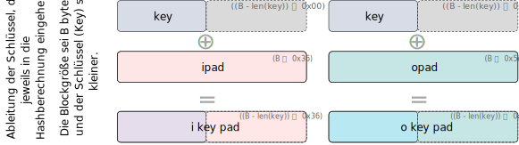

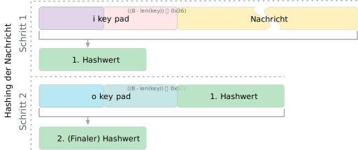

.. supplemental::

    **Padding und Hashing**

    Im Rahmen der Speicherung von Passwörtern und *Secret Keys* ist die Verwendung von Padding Operationen bzw. das Hashing von Passwörtern, um Eingaben in einer wohl-definierten Länge zu bekommen, üblich. Neben dem hier gesehenen Padding, bei dem 0x00 Werte angefügt werden, ist zum Beispiel auch das einfache Wiederholen des ursprünglichen Wertes, bis man auf die notwendige Länge kommt, ein Ansatz.

    Diese Art Padding darf jedoch nicht verwechselt werden mit dem Padding, dass ggf. im Rahmen der Verschlüsselung von Nachrichten notwendig ist, um diese ggf. auf eine bestimmte Blockgröße zu bringen (zum Beispiel bei ECB bzw. CBC Block Mode Operations.)

MAC: `Poly 1305 <https://datatracker.ietf.org/doc/html/rfc8439#section-2.5>`__
--------------------------------------------------------------------------------

.. deck::

    .. card::

        - Ein MAC Algorithmus für die Einmalauthentifizierung von Nachrichten.
        - Entwickelt von Daniel J. Bernstein.
        - Basierend auf einem 256-Bit-Schlüssel und einer Nachricht wird ein 128-Bit-Tag berechnet.
        - (Insbesondere) In Verbindung mit *ChaCha20* in einer Reihe von Protokollen verwendet.

    .. card::

        .. image:: images/poly1305.svg
           :alt: Poly 1305 - Verwendung des Schlüssels
           :align: center

        .. container:: align-center

            .. rubric:: Aufteilung des Schlüssels

        .. supplemental::

            .. rubric:: "Clamping"

            .. code:: python
                :class: copy-to-clipboard
                :number-lines:

                clamped_r = r & 0x0ffffffc0ffffffc0ffffffc0fffffff # Zahlen

    .. card::

        .. rubric:: Verarbeitung der Nachricht

        .. class:: incremental-list list-with-explanations

        - initialisiere den Akkumulator :math:`a` mit 0
        - die Nachricht wird in Blöcke von 16 Byte aufgeteilt und als *little-endian* Zahl verarbeitet; d. h. ein Block hat 16 Oktette (:math:`16 \times 8` Bit)
        - Füge dem Block :math-i:`n` ein Bit jenseits der Anzahl der Oktette des aktuellen Blocks hinzu :math-i:`→ n'`

          (D. h. im Falle eines 16-Byte-Blocks wird die Zahl :math-r:`2¹²⁸` addiert und danach haben wir somit eine 17-Byte-Zahl.)
        - Addiere :math-i:`n'` aus dem letzten Schritt zum Akkumulator :math-i:`a` und multipliziere mit :math:`\text{clamped r}`
        - Aktualisiere den Akkumulator mit dem Ergebnis :math-i:`modulo P` mit :math:`P = 2^{130} - 5`:
          :math:`a = ((a + n') \times \text{clamped r})\bmod P`

    .. card::

        .. example::

            .. code:: text

                0000  43 72 79 70 74 6f 67 72 61 70 68 69 63 20 46 6f  Cryptographic Fo
                0016  72 75 6d 20 52 65 73 65 61 72 63 68 20 47 72 6f  rum Research Gro
                0032  75 70                                            up

            Schlüssel

            ::

                r = 85 d6 be 78 57 55 6d 33 7f 44 52 fe 42 d5 06 a8
                s = 01 03 80 8a fb 0d b2 fd 4a bf f6 af 41 49 f5 1b

            .. container:: font-size-65

                .. rubric:: ⚠️ Verwendung der (*normalen*) Zahlendarstellung

                .. math::

                    \begin{array}{rr}
                        \text{clamped } r = & 806d5400e52447c036d555408bed685 \\
                        s = & 1bf54941aff6bf4afdb20dfb8a800301
                    \end{array}

            .. deck:: incremental

                .. card:: font-size-65

                    .. rubric:: Verarbeitung des ersten Blocks

                    .. math::

                        \begin{array}{rr}
                            a       = &                                 00 \\
                            n       = &   6f4620636968706172676f7470797243 \\
                            n'      = & 016f4620636968706172676f7470797243 \\
                            a + n'  = & 016f4620636968706172676f7470797243 \\
                            (a + n') \times \text{clamped r}  = &
                                        b83fe991ca66800489155dcd69e8426ba2779453994ac90ed284034da565ecf \\
                            a = ((a + n') \times \text{clamped r})\bmod P = &
                                        2c88c77849d64ae9147ddeb88e69c83fc \\
                        \end{array}

                    .. supplemental::

                        .. remark::

                            Berechnung für den ersten Block in Python

                            .. code:: python
                                :number-lines:
                                :class: copy-to-clipboard

                                a = 0x00 # initial
                                a = a + n'
                                a = 0x016f4620636968706172676f7470797243 # 0x00 + n' = n'
                                a *= 0x806d5400e52447c036d555408bed685
                                print("((a+n') ⨉ clamped r)=",hex(a))
                                print("((a+n') ⨉ clamped r) mod P=",hex(a % 0x3fffffffffffffffffffffffffffffffb))

                .. card:: font-size-65

                    .. rubric:: Verarbeitung des letzten Blocks mit 2 Bytes

                    .. math::

                        \begin{array}{rr}
                            a      = & 2d8adaf23b0337fa7cccfb4ea344b30de \\
                            n      = &   7075 \\
                            n'     = & 017075 \\
                            a + n' = & 2d8adaf23b0337fa7cccfb4ea344ca153 \\
                            (a + n') \times \text{clamped r} = &
                                    16d8e08a0f3fe1de4fe4a15486aca7a270a29f1e6c849221e4a6798b8e45321f \\
                            a = ((a + n') \times \text{clamped r})\bmod P = &
                                    28d31b7caff946c77c8844335369d03a7 \\
                        \end{array}

                .. card:: font-size-65

                    .. rubric:: Abschluss

                    Addiere auf den Wert des Akkumulators :math-i:`a` den Wert :math-i:`s`.

                    Somit ist der Tag :math:`t = a + s = 2a927010caf8b2bc2c6365130c11d06a8` (als Zahl).

                    Davon werden die *least-significant 128 Bit* serialisiert und verwendet.

                    ::

                        a8 06 1d c1 30 51 36 c6 c2 2b 8b af 0c 01 27 a9

                    .. supplemental::

                        .. rubric:: Serialisierung in Python

                        .. code:: python
                            :number-lines:
                            :class: copy-to-clipboard

                            from binascii import hexlify

                            t = 0x2a927010caf8b2bc2c6365130c11d06a8
                            hexlify(t.to_bytes(17,byteorder="little")[0:16])

.. supplemental::

    .. rubric:: Hinweise

    - In dieser Diskussion betrachten wir jeden Block der Nachricht als „große Zahl“.

    - :math:`P = 2^{130} - 5 = 3fffffffffffffffffffffffffffffffb`

    - Dadurch, dass wir den Block als Zahl in *little-endian* Reihenfolge interpretieren, ist das Hinzufügen des Bits jenseits der Anzahl der Oktette gleichbedeutend damit, dass wir den Wert 0x01 am Ende des Blocks hinzufügen.

.. class:: new-section transition-scale

Public-Key-Kryptographie
-----------------------------

Terminologie bzgl. asymmetrischer Verschlüsselung
-----------------------------------------------------------------

.. class:: incremental-list

- Asymmetrische Schlüssel
- Public-Key-Zertifikat
- Public-Key (asymmetrischer) kryptografischer Algorithmus
- Public-Key-Infrastruktur (PKI)

.. supplemental::

    :Asymmetrische Schlüssel:
            Zwei zusammengehörige Schlüssel, ein öffentlicher und ein privater Schlüssel, die zur Durchführung komplementärer Operationen verwendet werden, z. B. Ver- und Entschlüsselung oder Signaturerstellung und Signaturprüfung.

    :Public-Key-Zertifikat:
            Ein digitales Dokument, das mit dem privaten Schlüssel einer Zertifizierungsstelle (:eng:`Certification Authority`) ausgestellt und digital signiert wird und den Namen eines Teilnehmers an einen öffentlichen Schlüssel bindet. Das Zertifikat gibt an, dass der im Zertifikat genannte Teilnehmer die alleinige Kontrolle und den Zugriff auf den entsprechenden privaten Schlüssel hat.

    :Public-Key (asymmetrischer) kryptografischer Algorithmus:
            Ein kryptographischer Algorithmus, der zwei zusammengehörige Schlüssel verwendet, einen öffentlichen und einen privaten Schlüssel. Die beiden Schlüssel haben die Eigenschaft, dass die Ableitung des privaten Schlüssels aus dem öffentlichen Schlüssel rechnerisch nicht machbar ist bzw. sein sollte (vgl. Quantenkryptografie).

    :Public-Key-Infrastruktur (PKI):
            Eine Reihe von Richtlinien, Prozessen, Serverplattformen, Software und Workstations, die für die Verwaltung von Zertifikaten und öffentlich-privaten Schlüsselpaaren verwendet werden, einschließlich der Möglichkeit, Public-Key-Zertifikate auszustellen, zu pflegen und zu widerrufen.

Prinzipien von Public-Key-Kryptosystemen
-------------------------------------------

- Das Konzept der *Public-Key-Kryptographie* (d. h. der Kryptografie mit öffentlichen Schlüsseln) entstand aus dem Versuch, zwei der schwierigsten Probleme im Zusammenhang mit der symmetrischen Verschlüsselung zu lösen:

  .. admonition:: Schlüsselverteilung

        Wie kann man generell sicher kommunizieren, ohne einem "Key Distribution Center" (KDC) seinen Schlüssel anvertrauen zu müssen?

  .. admonition:: Digitale Signaturen

        Wie kann man überprüfen, ob eine Nachricht unversehrt vom angegebenen Absender stammt?

.. supplemental::

    KDC = Key Distribution Center

.. class:: transition-fade center-child-elements

Prinzipien von Public-Key-Kryptosystemen
-----------------------------------------

.. container:: exclamation-mark

    **Whitfield Diffie** und **Martin Hellman** von der Stanford University erzielten 1976 einen Durchbruch, indem sie eine Methode entwickelten, die beide Probleme löste und sich radikal von allen bisherigen Ansätzen der Kryptografie unterschied.

Bestandteile von Public-Key-Kryptosystemen
-------------------------------------------

.. class:: incremental-list

:*Klartext* (`Plaintext`:eng:): Die lesbare Nachricht oder Daten, die dem Algorithmus als Eingabe dienen.
:*Verschlüsselungsalgorithmus*: Führt verschiedene Umwandlungen des Klartextes durch.
:*Öffentlicher Schlüssel*: Wird für *Verschlüsselung* oder *Entschlüsselung* verwendet.
:*Privater Schlüssel*: Verwendet für *Verschlüsselung* oder *Entschlüsselung*.
:*Chiffretext* (`Ciphertext`:eng:): Die verschlüsselte Nachricht, die als Ausgabe produziert wird.
:*Entschlüsselungsalgorithmus*: Nimmt den Geheimtext und den passenden Schlüssel entgegen und erzeugt den ursprünglichen Klartext.

Verschlüsselung mit öffentlichem Schlüssel
-----------------------------------------------

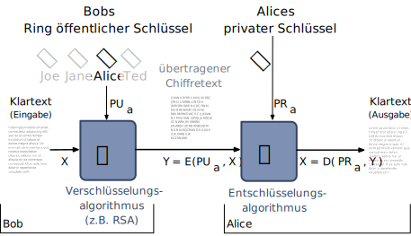

Verschlüsselung mit privatem Schlüssel
------------------------------------------

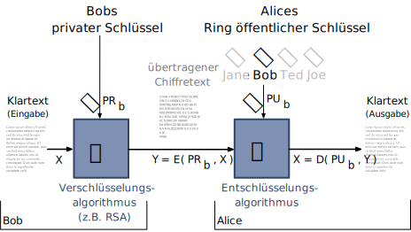

.. class:: smaller-slide-title

Konventionelle und Public-Key-Verschlüsselung
----------------------------------------------

.. story::

    .. grid::

        .. cell::

            .. rubric:: Konventionelle Verschlüsselung

            **Benötigt zur Anwendung**

            1.	Es wird derselbe Algorithmus mit demselben Schlüssel für die Ver- und Entschlüsselung verwendet.

            2.	Der Sender und der Empfänger müssen den Algorithmus und den Schlüssel kennen bzw. besitzen.

            .. compound::
                :class: incremental[1]

                **Notwendig für die Sicherheit**

                1.	Der Schlüssel muss geheim gehalten werden.

                2.	Es muss unmöglich oder zumindest unpraktisch sein, eine Nachricht zu entschlüsseln, wenn der Schlüssel geheim gehalten wird.

                3.	Die Kenntnis des Algorithmus und von (ggf. vielen) Geheimtexten ist nicht ausreichend, um den Schlüssel zu ermitteln.

        .. cell::

            .. rubric:: Public-Key Verschlüsselung

            **Benötigt zur Anwendung**

            1.	Zwei Algorithmen: je einer für die Ver-/Entschlüsselung. Weiterhin ein Paar von Schlüsseln; je einer für die Ver-/Entschlüsselung.

            2.	Der Absender und der Empfänger müssen jeweils einen der passenden Schlüssel besitzen (nicht den gleichen).

            .. compound::
                :class: incremental[1]

                **Notwendig für die Sicherheit**

                1.	Einer der  Schlüssel muss geheim bleiben.

                2.	Es muss unmöglich sein, eine Nachricht zu entschlüsseln, wenn ein Schlüssel geheim gehalten wird.

                3.	Die Kenntnis des Algorithmus und eines Schlüssels sowie von  Geheimtexten ist nicht ausreichend, um den anderen Schlüssel zu ermitteln.

Public-Key-Kryptosystem: Vertraulichkeit
-----------------------------------------

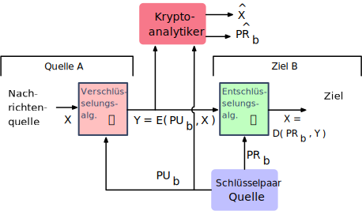

Public-Key-Kryptosystem: Authentifizierung
---------------------------------------------

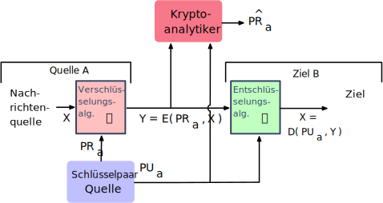

Public-Key-Kryptosystem: Authentifizierung und Geheimhaltung
---------------------------------------------------------------

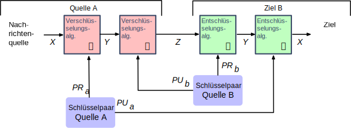

Anwendungen für Public-Key-Kryptosysteme
------------------------------------------

.. deck::

    .. card::

      Kryptosysteme mit öffentlichen Schlüsseln lassen sich in drei Kategorien einteilen:

      .. class:: incremental-list

      1. *Ver-/Entschlüsselung*: Der Absender verschlüsselt eine Nachricht mit dem öffentlichen Schlüssel des Empfängers.
      2. *Digitale Unterschriften*: Der Absender „unterschreibt“ eine Nachricht mit seinem privaten Schlüssel.
      3. *Schlüsselaustausch*: Zwei Seiten arbeiten zusammen, um einen Sitzungsschlüssel (d. h. einen symmetrischen Schlüssel) auszutauschen.

    .. card::

        Einige Algorithmen eignen sich für alle drei Anwendungen, während andere nur für eine oder zwei verwendet werden können:

        .. csv-table::
            :header: Algorithmus, Ver-/ Entschlüsselung, Digitale Signaturen, Schlüssel-austausch
            :class: incremental-table-rows
            :widths: 13, 10, 10, 10

            RSA,:shiny-green:`✓`,:shiny-green:`✓`,:shiny-green:`✓`
            Elliptic Curve,:shiny-green:`✓`,:shiny-green:`✓`,:shiny-green:`✓`
            Diffie-Hellman,:shiny-red:`✗`,:shiny-red:`✗`,:shiny-green:`✓`
            DSS\ [#]_,:shiny-red:`✗`,:shiny-green:`✓`,:shiny-red:`✗`

        .. [#] DSS = Digital Signature Standard*, entwickelt von der NSA (National Security Agency)

Anforderungen an Public-Key-Algorithmen
--------------------------------------------

.. class:: incremental-list

- Für eine Partei :math:`B` ist es rechnerisch einfach, ein Schlüsselpaar (bestehend aus öffentlicher Schlüssel :math:`PU_b` und privater Schlüssel :math:`PR_b`) zu erzeugen.
- Für einen Absender :math:`A` ist es rechnerisch einfach, bei Kenntnis des öffentlichen Schlüssels von :math:`B` und der zu verschlüsselnden Nachricht den entsprechenden Chiffretext zu erzeugen.
- Für den Empfänger :math:`B` ist es rechnerisch einfach, den resultierenden Chiffretext mit Hilfe des privaten Schlüssels zu entschlüsseln, um die ursprüngliche Nachricht wiederherzustellen.
- Für einen Angreifer, der den öffentlichen Schlüssel kennt, ist es *rechnerisch unmöglich*, den privaten Schlüssel zu ermitteln.
- Für einen Angreifer, der den öffentlichen Schlüssel und einen Chiffretext kennt, ist es *rechnerisch unmöglich*, die ursprüngliche Nachricht wiederherzustellen.
- Die beiden Schlüssel können in beliebiger Reihenfolge verwendet werden.

Anforderungen an Public-Key-Algorithmen
--------------------------------------------

.. class:: incremental-list

- Benötigt wird eine Falltürfunktion (:eng:`Trapdoor one-way function`)

  .. container:: s-font-size-90

    Eine Einwegfunktion ist im Allgemeinen eine Funktion, bei der jeder Funktionswert eine eindeutige Umkehrung hat, wobei die *Berechnung der Funktion einfach* ist, während die *Bestimmung der Umkehrfunktion praktisch undurchführbar ist*.

    - :math:`Y = f(X)` einfach
    - :math:`X = f^{–1}(Y)` „unmöglich“

- Eine Einwegfunktion mit Falltür ist eine Familie invertierbarer Funktionen :math:`f_k`, für die gilt:

  .. container:: s-font-size-90

    - :math:`Y = f_k(X)` einfach, wenn :math-i:`k` und :math-i:`X` bekannt sind.
    - :math:`X = f_k^{–1}(Y)` einfach,  wenn :math-i:`k` und :math-i:`Y` bekannt sind.
    - :math:`X = f_k^{–1}(Y)` unmöglich, wenn :math-i:`Y` bekannt ist, aber :math-i:`k` nicht.

- Ein praktisches Public-Key-Verfahren hängt von einer geeigneten Trapdoor-Einwegfunktion ab.

.. supplemental::

    Ein Falltürfunktion lässt sich nicht trivial umkehren; bzw. die Umkehrung erfordert spezielle (weitergehende) Informationen; d. h. die Falltür.

Rivest-Shamir-Adleman (RSA) Algorithm
--------------------------------------

.. class:: incremental-list list-with-explanations

- Entwickelt 1977 am MIT von Ron Rivest, Adi Shamir und Len Adleman.
- Universeller Ansatz zur Verschlüsselung mit öffentlichen Schlüsseln.
- Ist eine Chiffre, bei der Klartext und Chiffretext ganze Zahlen zwischen :math:`0` und :math:`n - 1` für ein bestimmtes :math:`n` sind.

- Eine typische Größe für :math:`n` waren 1024 Bits oder 309 Dezimalziffern.

  Solch kleine Zahlen werden heute als äußerst unsicher angesehen, insbesondere angesichts der bevorstehenden Quantencomputer und der Entwicklung von Quantenalgorithmen (vgl. `Shors Algorithmus (1994) <https://en.wikipedia.org/wiki/Shor%27s_algorithm>`_), die Zahlen effizient faktorisieren können, wenn genügend QBits in hinreichender Qualität\ [#]_ zur Verfügung stehen.

.. [#] Aktuell sind Quantencomputer nicht in der Lage, die für RSA verwendeten Schlüssel zu brechen und es ist auch (noch) nicht geklärt ob die aktuellen Technologien entsprechend skaliert werden können. Es besteht aber die durchaus ernst zu nehmende Möglichkeit!

RSA Algorithmus
-----------------

.. class:: incremental-list

- RSA verwendet einen Ausdruck mit Exponentialen
- Der Klartext wird in Blöcken verschlüsselt, wobei jeder Block einen Binärwert hat, der kleiner als eine bestimmte Zahl :math:`n` ist\ [#]_.
- Die Ver- und Entschlüsselung erfolgt für einen Klartextblock :math:`M` und einen Chiffretextblock :math:`C` in der folgenden Form:

	:math:`C = M^e\; mod\; n \qquad M = C^d\; mod\; n  \qquad (M^e)^d\; mod\; n = M^{ed}\; mod\; n`

- Sowohl der Sender als auch der Empfänger müssen den Wert von :math:`n` kennen.
- Der Absender kennt den Wert von :math:`e`, und nur der Empfänger kennt den Wert von :math:`d`
- Dies ist ein Public-Key-Verschlüsselungsalgorithmus mit dem öffentlichen Schlüssel :math:`PU=\lbrace e,n \rbrace` und dem privaten Schlüssel :math:`PR=\lbrace d,n \rbrace`.

.. [#] Basierend auf der Zahl n ergibt sich die maximale Größe des Blocks in Bit. Sei, hypothetisch, :math:`n = 4.294.967.296+1`, dann kann der Block maximal 32 Bit groß sein (:math:`2^{32} = 4.294.967.296`).

.. supplemental::

    :math:`M = C^d\; mod\; n  \Rightarrow M = (M^e\; mod\; n)^d\; mod\; n = (M^e)^d\; mod\; n`

The RSA Algorithm
-------------------

**Schlüsselgenerierung von Alice**

.. csv-table::
    :class: booktabs incremental-table-rows
    :width: 100%
    :align: left

    "Wähle :math:`p, q`", ":math:`p` und :math:`b` beide prim, :math:`p \neq q` "
    "Berechne :math:`n`", ":math:`n = p \times q` "
    "Berechne :math:`𝜙(n)` ", ":math:`\phi(n) = (p - 1)(q - 1)` "
    "Wähle :math:`e`", ":math:`GGT(\phi(n),e) = 1; \quad 1 < e < \phi(n)` "
    Berechne :math:`d`, :math:`d \equiv e^{-1}\; (mod\; \phi(n)) \Leftrightarrow ed\; mod\; \phi(n)= 1`
    Public-Key, ":math:`PU = \lbrace e,n \rbrace` "
    Private-Key, ":math:`PR = \lbrace d,n \rbrace` "

.. compound::
    :class: incremental

    **Verschlüsselung von Bob mit Alices öffentlichen Schlüssel**

    .. csv-table::
        :stub-columns: 1
        :class: borderless table-header-align-right

        Klartext, :math:`M<n`
        Chiffretext, :math:`C=M^e\; mod\; n`

.. compound::
    :class: incremental

    **Entschlüsselung von Alice mit ihrem privaten Schlüssel**

    .. csv-table::
        :stub-columns: 1
        :class: borderless table-header-align-right

        Chiffretext, :math:`C`
        Klartext, :math:`M = C^d\; mod\; n`

Beispiel für den RSA-Algorithmus
---------------------------------

.. class:: incremental-list

:p und q:

    :math:`p = 11;\quad q = 17;\quad n = 187\qquad (\phi(n) = 10 \times 16 = 160)`

:Klartext:
    :math:`88`

:Verschlüsselung:
    :math:`PU =\lbrace e= 7, n= 187 \rbrace`:

    :math:`88^7\;mod\; 187 = 11 = C`

:Entschlüsselung:
    :math:`PR =\lbrace d= 23, n = 187 \rbrace`:

    :math:`11^{23}\; mod\; 187 = 88 = P`

:Alternativer Exponent:

    :math:`e = 137 \Rightarrow d = 153`

    :math:`\qquad 88^{137}\; mod\; 187 = 99 = C\qquad 99^{153}\; mod\; 187 = 88`

Die Sicherheit von RSA - Fünf mögliche Ansätze für einen Angriff
----------------------------------------------------------------------

.. story::

    .. class::  incremental-list dd-margin-left-10em

    :Brute-Force: Dabei werden alle möglichen privaten Schlüssel ausprobiert.

    :Mathematische Angriffe: Es gibt mehrere Ansätze, die vom Aufwand her alle dem Faktorisieren des Produkts aus zwei Primzahlen entsprechen.

    :Zeitliche Angriffe: Diese hängen von der Laufzeit des Entschlüsselungsalgorithmus ab.

    :Hardware-Fehler-basierter Angriff: Hier geht es darum, Hardware-Fehler in den Prozessor zu induzieren, der digitale Signaturen erzeugt.

    :Gewählte Chiffretext-Angriffe: Ziel ist es Eigenschaften des RSA-Algorithmus auszunutzen.

    :Quantum-Computing: Shor's Algorithmus ist ein Algorithmus, der in polynomieller Zeit die Faktorisierung von Zahlen mit einer bestimmten Anzahl von Bits erreicht. Dies bedeutet, dass Quantum-Computing die Sicherheit von RSA-Systemen bedroht, da sie die Faktorisierung von großen Zahlen effizienter lösen kann als klassische Computer.

.. class:: new-section transition-scale

Netzwerksicherheit
---------------------------

.. class:: new-subsection transition-fade

Transmission Control Protocol (TCP)
-------------------------------------

TCP Grundlagen
-------------------

.. class:: incremental-list

- Protokoll basierend auf IP
- verbindungsorientierte Kommunikation zweier Rechner im Internet zuverlässig und geordnet:

  .. class:: incremental-list

  - Verwerfen von Duplikaten und fehlerhaft übertragener Pakete
  - automatisches Wiederversenden fehlender Pakete
  - Nachrichtenpuffer: Daten werden in korrekter Reihenfolge an Applikation zugestellt

- Verbindungsaufbau immer zwischen zwei Sockets (Socket-Adresse: IP Adresse und 16 Bit-Port-Nummer)

Aufbau einer TCP Verbindung
-----------------------------

Dreifacher Handshake:

.. supplemental::

    **Terminologie**:

    :SYN: :eng:`synchronize (session establishment)`
    :ACK: :eng:`acknowledge`
    :RST: :eng:`reset`

    **Verbindungsaufbau - Ablauf**:

    1. Client sendet SYN Paket mit initialer Sequenznummer (hier) 1000 an den Server.
    2. Server sendet ein SYN-ACK Paket mit seiner initialen Sequenznummer (hier) 2000 und ein ACK mit der Sequenznummer 1001 (initiale Sequenznummer des Clients +1) an den Client
    3. Client sendet ein ACK Paket mit Sequenznummer 2001 (initiale Sequenznummer des Servers +1) an den Server; danach ist die Verbindung aufgebaut.

    Das Betriebssystem sollte die initialen Sequenznummern zufällig wählen, so dass ein Angreifer diese nicht leicht vorhersagen kann. Beide Seiten haben eigene Sequenznummern, die unabhängig voneinander sind.

    Bei einer laufenden Verbindung werden die Sequenznummern inkrementiert und es ist nicht (mehr) erkennbar wer die Verbindung aufgebaut hat.

.. raw:: html
    :class: center-child-elements

    

    <svg viewBox="100 0 1140 600" font-size="36" version="1.1" xmlns="http://www.w3.org/2000/svg">
        <text x="125" y="75" style="font-weight: bolder">Client</text>
        <line x1="200" y1="100" x2="200" y2="400" style="stroke:rgb(0,0,0);stroke-width:3" />
        <text x="925" y="75" style="font-weight: bolder">Server</text>
        <line x1="1000" y1="100" x2="1000" y2="400" style="stroke:rgb(0,0,0);stroke-width:3" />
        <line x1="200" y1="400" x2="200" y2="550" stroke-dasharray="5,5" style="stroke:rgb(0,0,0);stroke-width:3" />
        <line x1="1000" y1="400" x2="1000" y2="550" stroke-dasharray="5,5" style="stroke:rgb(0,0,0);stroke-width:3" />

        <text x="500" y="65" transform="rotate(6.6)">SYN(1000)</text>
        <line x1="200" y1="110" x2="1000" y2="190" style="stroke:rgb(0,0,0);stroke-width:3" marker-end="url(#arrow)"/>

        <g class="incremental">
        <text x="270" y="300" transform="rotate(-6.6)">SYN(2000), ACK(1001)</text>
        <line x1="1000" y1="200" x2="200" y2="290" style="stroke:rgb(0,0,0);stroke-width:3" marker-end="url(#arrow)"/>
        </g>

        <g class="incremental">
        <text x="555" y="315" transform="rotate(6.6)">ACK(2001)</text>
        <line x1="200" y1="300" x2="1000" y2="390" style="stroke:rgb(0,0,0);stroke-width:3" marker-end="url(#arrow)"/>
        </g>
    </svg>
    

Ports bei TCP
----------------

.. class:: incremental-list

- Port-Nummern werden für die Kommunikation zwischen zwei Diensten/Prozessen verwendet
- Ports sind 16 Bit Zahlen (0-65535)
- (Unix) Ports < 1024 sind privilegiert (nur root kann diese öffnen)
- einige Port-Nummern sind Standarddiensten zugeordnet

Port-Nummern einiger Standarddienste [#]_
------------------------------------------

**Ungeschützte Dienste** (Kommunikation findet ohne Verschlüsselung statt.)

.. csv-table::
    :header: Protokoll, Dienst, Portnummer
    :class: highlight-row-on-hover
    :widths: 100, 600, 50

    ftp, Dateitransfer, 21
    smtp, Simple Mail Transfer Protocol, 25
    dns, Domain Name System, 53
    http, Hypertext Transfer Protocol, 80
    login, Login auf entfernte Rechner, 513

**Geschützte Dienste** (Die Kommunikation ist verschlüsselt.)

.. csv-table::
    :header: Protokoll, Dienst, Portnummer
    :class: highlight-row-on-hover incremental
    :widths: 100, 600, 50

    ssh, Secure Shell, 22
    https, HTTP über Secure Socket Layer, 443
    smtps, SMTP über Secure Socket Layer, 465
    imaps, IMAP über Secure Socket Layer, 993
    pop3s, POP3 über Secure Socket Layer, 995

.. [#] `Port numbers assigned by IANA <https://www.iana.org/assignments/service-names-port-numbers>`__

Angriffe auf TCP - Motivation
--------------------------------

.. class:: incremental-list list-with-explanations

- Netzwerkprogrammierung mit TCP ist relativ komfortabel.
- Viele Dienste sind mit TCP implementiert.
- Das Auffinden von angreifbaren Diensten kann mit Hilfe von Port Scans systematisch erfolgen.

  Server haben heutzutage im Allgemeinen alle nicht verwendeten Dienste geschlossen.

Port Scans: TCP Connect Scan
-------------------------------

.. grid::

    .. cell:: width-50 incremental

          .. rubric:: Vorgehen

          Aufbau vollständiger Verbindungen zu allen bzw. zu ausgewählten Ports.

    .. cell:: width-50

        .. raw:: html

            

            <svg viewBox="0 0 1200 600" font-size="48" version="1.1" xmlns="http://www.w3.org/2000/svg">
                <text x="125" y="75" style="font-weight: bolder">Scanner</text>
                <line x1="200" y1="100" x2="200" y2="400" style="stroke:rgb(0,0,0);stroke-width:3" />
                <text x="925" y="75" style="font-weight: bolder">Server</text>
                <line x1="1000" y1="100" x2="1000" y2="400" style="stroke:rgb(0,0,0);stroke-width:3" />
                <line x1="200" y1="400" x2="200" y2="550" stroke-dasharray="5,5" style="stroke:rgb(0,0,0);stroke-width:3" />
                <line x1="1000" y1="400" x2="1000" y2="550" stroke-dasharray="5,5" style="stroke:rgb(0,0,0);stroke-width:3" />

                <text x="500" y="65" transform="rotate(6.6)">SYN</text>
                <line x1="200" y1="110" x2="1000" y2="190" style="stroke:rgb(0,0,0);stroke-width:3" marker-end="url(#arrow)"/>

                <text x="390" y="300" transform="rotate(-6.6)">SYN / ACK</text>
                <line x1="1000" y1="200" x2="200" y2="290" style="stroke:rgb(0,0,0);stroke-width:3" marker-end="url(#arrow)"/>

                <text x="555" y="315" transform="rotate(6.6)">ACK</text>
                <line x1="200" y1="300" x2="1000" y2="390" style="stroke:rgb(0,0,0);stroke-width:3" marker-end="url(#arrow)"/>
            </svg>
            

.. assessment::
    :class: incremental

    - simpelster Port Scan
    - große Entdeckungsgefahr (Scan selbst ist kein Angriff)

Port Scans: Idle Scan [#]_
-----------------------------

Unter Verwendung eines sog. Zombies kann ein Port Scan durchgeführt werden, bei dem der Scanner nicht identifiziert werden kann:

.. grid::

    .. cell:: width-50

        Sondiere IP ID des Zombies:

        .. image:: images/idle-scan/idle-scan-step1.svg
            :alt: Idle Scan - Schritte 1-2

    .. cell:: width-50 fade-out

        Starte Scan:

        .. image:: images/idle-scan/idle-scan-step2.svg
            :alt: Idle Scan - Schritte 3-5

.. supplemental::

    :Zombie: ein Rechner (Computer, Drucker oder anderes IoT Gerät) im Internet *möglichst ohne eigenen Netzverkehr* und mit *altem* Betriebssystem, bei dem die IP ID in vorhersehbarer Weise inkrementiert wird. (Bei modernen Betriebssystemen ist die IP ID zufällig, **konstant** oder sogar ``null``.)

    :Grundlegende Idee: Der Zombie sendet ein RST Paket zurück, da er kein SYN gesendet hat und kein SYN/ACK erwarte. Dadurch erfährt der Angreifer die aktuelle IP ID des Zombies. Über diesen Seitenkanal - d. h. die Veränderung der IP ID des Zombies - kann der Angreifer nun den Zustand des Ports auf dem Zielrechner ermitteln.

    .. hint::

        Sollte ein Intrusion Detection System vorhanden sein, so wird dieses den Zombie als Angreifer identifizieren.

    .. rubric:: Hintergrund - IP ID

    Das Feld *IP Identifikation (IP ID)* dient der Identifizierung einer Gruppe von Fragmenten eines einzelnen IP-Datagramms.

    .. image:: images-external/IPv4_Packet-en.svg
            :alt: IPv4 Packet
            :align: left

    .. container:: peripheral

        By Michel Bakni - Postel, J. (September 1981) RFC 791, IP Protocol, DARPA Internet Program Protocol Specification, p. 1 DOI: 10.17487/RFC0791., CC BY-SA 4.0, https://commons.wikimedia.org/w/index.php?curid=79949694

.. [#] `NMap Book <https://nmap.org/book/idlescan.html>`__

Port Scans: Idle Scan
-----------------------------

.. grid::

    .. cell:: width-50

        Starte Scan:

        .. image:: images/idle-scan/idle-scan-step2.svg
            :alt: Idle Scan - Schritte 3-5

    .. cell:: width-50

        Sondiere IP ID des Zombies:

        .. image:: images/idle-scan/idle-scan-step3.svg
            :alt: Idle Scan - Schritt 6

.. supplemental::

    - Angreifer sendet SYN/ACK Paket an Zombie
    - der Zombie antwortet mit RST und enthüllt seine IP ID (:eng:`IP Fragment Identification Number`).
    - Angreifer sendet SYN („mit IP vom Zombie“) an Port des Servers:

    [**Port offen**] Der Zielrechner antwortet mit SYN/ACK an den Zombie, wenn der Port offen ist. Der Zombie antwortet darauf mit RST an den Server, da er kein SYN gesendet hat und kein SYN/ACK erwartet und *erhöht seine IP ID*.

    [**Port geschlossen**] Der Zielrechner antwortet mit RST an den Zombie, wenn der Port geschlossen ist. Dies wird vom Zombie ignoriert.
    - Der Angreifer sendet wieder ein SYN/ACK an den Zombie, um die IP ID zu erfahren.

    Mit einem IDLE Scan kann nicht unterschieden werden, ob der Port geschlossen oder gefiltert ist.

Port Scans mit nmap
-----------------------

.. class:: incremental-list

- alle Arten von Port-Scans möglich
- auch OS fingerprinting
- u. U. sogar Ermittlung der Versionsnummern von Diensten

.. code:: bash
    :class: incremental

    $ nmap 192.168.178.121 -Pn
    Starting Nmap 7.94 ( https://nmap.org ) at 2023-12-14 13:16 PST
    Nmap scan report for Michaels-MacBook-Pro (192.168.178.121)
    Host is up (0.0056s latency).
    Not shown: 995 filtered tcp ports (no-response)
    PORT     STATE SERVICE
    53/tcp   open  domain
    88/tcp   open  kerberos-sec
    445/tcp  open  microsoft-ds
    5000/tcp open  upnp
    7000/tcp open  afs3-fileserver

.. supplemental::

    **OS-Fingerprinting**

    Beim OS-Fingerprinting werden Datenpakete analysiert, die aus einem Netzwerk stammen, um Informationen für spätere Angriffe zu gewinnen. Durch die Erkennung des Betriebssystems, mit dem ein Netzwerk arbeitet, haben Hacker es leichter, Schwachstellen zu finden und auszunutzen. OS-Fingerprinting kann auch Konfigurationsattribute von entfernten Geräten sammeln. Diese Art von Aufklärungsangriff ist in der Regel (einer) der erste(n) Schritt(e).

    Es gibt zwei Arten von OS-Fingerprinting: (1) Aktiv und (2) passiv.

        (1) Bei einem aktiven OS-Fingerprinting-Versuch senden die Angreifer ein Paket an das Zielsystem und warten auf eine Antwort, um den Inhalt des TCP-Pakets zu analysieren.

        (2) Bei einem passiven Versuch agieren die Angreifer eher als "Schnüffler", der keine absichtlichen Änderungen oder Aktionen im Netzwerk vornimmt. Passives OS-Fingerprinting ist ein unauffälligerer, aber wesentlich langsamerer Prozess.

Denial-of-Service (DoS) Angriffe
------------------------------------

Ziel des Angreifers: Lahmlegen eines Dienstes oder des ganzen Systems ...

- durch Ausnutzen von Schwachstellen (:eng:`vulnerabilities`) wie z. B. Buffer Overflows
- durch Generierung von Überlast (Ausschöpfen von RAM, CPU, Netzwerkbandbreite, ...)

.. example::
    :class: incremental

    .. rubric:: Ping-of-Death

    (Historisch: aus dem Jahr 1997)

    Ein ``ping`` (vgl. Internet Control Message Protocol (ICMP)) verwendet üblicherweise kleine Nachrichten, aber die verwendete Länge ist einstellbar.

    Falls die Länge zu groß ist ⇒ Buffer Overflow ⇒ Systemabsturz!

    Variante: mittels Fragmentierung ließen sich generell übergroße IP-Pakete (>65,536 Byte) erstellen.

Denial-of-Service: SYN-flooding Angriff
-----------------------------------------

.. class:: incremental-list

- Angriff auf Design
- Angreifer sendet eine Verbindungsaufbauanforderung (gesetztes SYN-Flag) an Zielmaschine
- Server generiert eine halboffene TCP-Verbindung
- Angreifer wiederholt in schneller Folge dieses erste Paket zum Verbindungsaufbau

  ⇒ vollständiges Füllen der internen Systemtabelle

  ⇒ Anfragen normaler Benutzer werden zurückgewiesen

- Angreifer verwendet i. Allg. IP-Spoofing weswegen Firewalls wirkungslos sind.
- Abwehr: SYN-Cookies

Distributed Denial-of-Service (DDoS) Angriff
------------------------------------------------

Opfer wird von sehr vielen Angreifern mit Nachrichten überflutet.

.. container:: incremental

    Ein Beispiel: Smurf-Angriff:

    .. image:: images/smurf-angriff.svg
        :alt: Smurf Angriff
        :align: center

Distributed Denial-of-Service (DDoS) Angriff
------------------------------------------------

.. class:: incremental-list

- Bot-Netze (Botnetze) werden verwendet, um DDoS-Angriffe durchzuführen.
- Bot-Netze können viele 10.000 Rechner umfassen.
- IoT Geräte sind besonders beliebt (z. B. IP-Kameras, Smart-TVs, Smart-Home Geräte, ...), da diese oft nicht ausreichend geschützt sind und trotzdem permanent mit dem Internet verbunden sind.
- Beliebte Ziele:

  - Onlinespieleserver
  - Banking-Portale
  - politische Webseiten
- Firewalls und Intrusion Detection Systeme sind meist wirkungslos, da die Angriffe von vielen verschiedenen IP-Adressen kommen.

Distributed-Reflected-Denial-of-Service Angriff
------------------------------------------------------------

.. deck::

    .. card::

        .. grid::

            .. cell:: width-50

                Idee eines (DRDoS) Angriffs

                .. class:: incremental-list list-with-explanations

                - Es wird eine Anfrage an einen Server gesendet, die eine große Antwort auslöst.

                  .. supplemental::

                    Z. B. hat(te) der NTP Monlist Befehl eine Antwort, die ca. 200 Fach größer ist als die Anfrage!

                - Mittels IP-Spoofing wird die IP-Adresse des Opfers als Absenderadresse verwendet.

                - Es werden insbesondere Dienste basierend auf UDP verwendet, da hier keine Verbindung aufgebaut werden muss.

            .. cell:: width-50

                .. image:: images/drdos.svg
                    :alt: DRDoS Angriff
                    :align: center

    .. card::

        - Nehmen einen signifikanten Teil aller DDoS-Angriffe ein.
        - Die Tatsache, dass die Sender legitime Server sind, erschwert die Abwehr.
        - :eng:`Egress Filtering` kann helfen, die Verwendung von IP-Spoofing zu verhindern.

.. supplemental::

    Bereits im Jahr 2018 wurde ein Angriff mit einer Bandbreite von 1,7 TBit/s beobachtet.

    :Egress Filtering: Der Router verwirft alle Pakete, die eine Absenderadresse verwenden, die nicht aus dem eigenen Netzwerk stammt.

Distributed Denial-of-Service (DDoS) Angriffe
--------------------------------------------------------------------------------

.. deck::

    .. card::

        .. epigraph::

            [...] Google's DDoS Response Team has observed the trend that distributed denial-of-service (DDoS) attacks are **increasing exponentially in size**. Last year, we blocked the largest DDoS attack recorded at the time. This August [2023], we stopped an even larger DDoS attack — 7½ times larger — that also used new techniques to try to disrupt websites and Internet services.

            This new series of DDoS attacks reached **a peak of 398 million requests per second (rps)**, and relied on a novel HTTP/2 “Rapid Reset” technique based on stream multiplexing that has affected multiple Internet infrastructure companies. By contrast, last year's largest-recorded DDoS attack peaked at 46 million rps.

            -- `Okt. 2023 - DDoS Attack with 398 Million RPS  <https://cloud.google.com/blog/products/identity-security/google-cloud-mitigated-largest-ddos-attack-peaking-above-398-million-rps>`__

    .. card::

        .. epigraph::

            Cloudflare hat Mitte Mai den "größten jemals registrierten" Denial-of-Service-Angriff (DDoS) mit [...] 7,3 Terabit pro Sekunde (TBit/s) blockiert. [...] Diese Attacke war demnach rund 12 Prozent größer als der vorherige Rekord und lieferte ein massives Datenvolumen von 37,4 Terabyte in nur 45 Sekunden. [...]

            Stellen Sie sich vor, Sie könnten mit Ihrem Smartphone 12,5 Millionen hochauflösende Fotos schießen und hätten nie einen vollen Speicherplatz." Und das alles in 45 Sekunden.

            [...] Mitgewirkt hätten über 122.145 Quell-IP-Adressen, die sich über 5433 autonome Netzwerksysteme in 161 Ländern erstreckten.

            -- `22.06.2025 Heise.de - Rekord DDoS Angriff  <https://www.heise.de/news/Junk-Traffic-Flut-Rekord-DDoS-Angriff-auf-Provider-mit-7-3-TBit-s-10455216.html>`__

Distributed Denial-of-Service Angriffe - Beispiele
---------------------------------------------------

- **TCP Stack Attacks** SYN, FIN, RST, ACK, SYN-ACK, URG-PSH, other combinations of TCP Flags, slow TCP attacks
- **Application Attacks**:HTTP GET/POST Floods, slow HTTP Attacks, SIP Invite Floods, DNS Attacks, HTTPS Protocol Attacks
- **SSL/TLS Attacks**: Malformed SSL Floods, SSL Renegotiation, SSL Session Floods
- **DNS Cache Poisoning**
- **Reflection Amplification Flood Attacks**: TCP, UDP, ICMP, DNS, mDNS, SSDP, NTP, NetBIOS, RIPv1, rpcbind, SNMP, SQL RS, Chargen, L2TP, Microsoft SQL Resolution Service
- **Fragmentation Attacks**: Teardrop, Targa3, Jolt2, Nestea
- **Vulnerability Attacks**
- **Resource Exhaustion Attacks**: Slowloris, Pyloris, LOIC, etc.
- **Flash Crowd Protection**
- **Attacks on Gaming Protocols**

Schutz vor DDoS-Angriffen: On-Site Maßnahmen
--------------------------------------------------------

.. class:: incremental-list list-with-sublists

- Aufrüsten der Ressourcen (z. B. Bandbreite, CPU, RAM, ...)
- Exemplarische Sofortmaßnahmen bei aktivem Angriff:

  .. class:: incremental-list

  - Whitelisting von IP-Adressen von besonders wichtigen Clients
  - Blacklisting von IP-Adressen aus bestimmten Bereichen
  - Captchas
  - Überprüfung der Browser-Echtheit

- Anti-DDos Appliances

.. attention::
    :class: incremental

    Diese Maßnahmen sind häufig teuer und ggf. begrenzt effektiv; wenn der Angriff die verfügbare Bandbreite übersteigt, sind diese Maßnahmen darüber hinaus wirkungslos.

Schutz vor DDoS-Angriffen: Off-Site Maßnahmen
------------------------------------------------------------

.. class:: incremental-list list-with-explanations

- Einbinden des ISP
- Einbinden spezialisierter Dienstleister

  (Im Angriffsfall wird mittels BGP-Rerouting der Traffic an den Dienstleister umgeleitet, der dann die DDos Attacke filtert.)
- Content-Delivery-Networks (CDNs) für statische Inhalte (z. B. Cloudflare, Akamai, ...)
- Distributed Clouds

Password Sniffing
---------------------

.. class:: incremental-list

:In der Anfangszeit: unverschlüsselte Übertragung von Passwörtern (telnet, ftp, ...)
:In der Übergangszeit: Verwendung von Einmal-Passwörtern (S/Key, ...)
:Heute: Passwörter werden verschlüsselt übertragen (ssh, https, ...)

    Zusätzliche Absicherung durch Zwei-Faktor-Authentifizierung (basierend auf Einmalpassworten: TOTP, ...)

.. supplemental::

    Unverschlüsselte Passworte können leicht mittels eines Sniffers, der den Netzwerkverkehr mitschneidet (z. B. Wireshark), abgefangen werden.

Einmal-Passwörter
----------------------

Die Idee ist, dass Passwörter nur genau einmal gültig sind und nicht wiederverwendbar sind.

- Tokens (z. B. RSA SecurID)
- Codebuch: Liste von Einmal-Passwörtern, die das gemeinsame Geheimnis sind.
- S/Key: Passwort „wird mit einem Zähler kombiniert“ und dann gehasht.

Das S/Key Verfahren
------------------------------

Einmal-Passwort-System nach Codebuch-Verfahren.

.. deck::

    .. card::

        **Initialisierung**

        .. class:: incremental-list list-with-explanations

        1) Der Nutzer gibt sein Passwort :math:`W` ein; dies ist der geheime Schlüssel.

           (Sollte :math:`W` bekannt werden, dann ist die Sicherheit des Verfahrens nicht mehr gewährleistet.)
        2) Eine kryptografische Hash-Funktion :math:`H` wird n-mal auf :math:`W` angewandt, wodurch eine Hash-Kette von n einmaligen Passwörtern entsteht. :math:`H(W), H(H(W)), \dots, H^{n}(W)`
        3) Das initiale Passwort wird verworfen.
        4) Der Benutzer erhält die :math:`n` Passwörter, die in umgekehrter Reihenfolge ausgedruckt werden: :math:`H^n(W), H^{n-1}(W), ..., H(H(W)), H(W)`.
        5) Nur das Passwort :math:`H^n(W)`, das an erster Stelle der Liste des Benutzers steht, der Wert von :math:`n` und ggf. ein Salt, wird auf dem Server gespeichert.

    .. card::

        **Anmeldung**

        Identifiziere das letzte verwendete Passwort :math:`n`.

        .. class:: incremental-list

        - Der Server fragt den Nutzer nach dem Passwort :math:`n-1` (d. h. :math:`H^{n-1}(W)`) und übermittelt ggf. auch den Salt.
        - Der Server hasht das Passwort und vergleicht es dann mit dem gespeicherten Passwort :math:`H^n(W)`.
        - Ist das Passwort korrekt, dann wird der Nutzer angemeldet und der Server speichert das Passwort :math:`H^{n-1}(W)` als neues Passwort :math:`H^n(W)` und dekrementiert n.

.. supplemental::

    Im Original basiert S/Key auf der kryptographischen Hashfunktion MD4. Ein Austausch wäre aber selbstverständlich möglich!

    Intern verwendet S/KEY 64-bit Zahlen. Für die Benutzbarkeit werden diese Zahlen auf sechs kurze Wörter, von ein bis vier Zeichen, aus einem öffentlich zugänglichen 2048-Wörter-Wörterbuch (:math:`2048 = 2^{11}`) abgebildet. Zum Beispiel wird eine 64-Bit-Zahl auf "ROY HURT SKI FAIL GRIM KNEE" abgebildet.

HMAC-based one-time password (HOTP)\ [#]_
--------------------------------------------

- ermöglicht die Erzeugung von Einmal-Passwörtern auf Basis eines geheimen Schlüssels und eines Zählers; Parameter:

  .. class:: incremental-list

  - Ein kryptografisches Hash-Verfahren :math:`H` (Standard ist SHA-1)
  - einen geheimen Schlüssel :math:`K`, der eine beliebige Bytefolge ist
  - Ein Zähler :math:`C`, der die Anzahl der Iterationen zählt
  - Länge des Passworts: :math:`d` (6-10, Standardwert ist 6, empfohlen werden 6-8)

.. class:: incremental

- Zur Authentifizierung berechnen beide das Einmalpasswort (HOTP) und dann vergleicht der Server den Wert mit dem vom Client übermittelten Wert:

  Berechnung aus dem Schlüssel :math:`K` und dem Zähler :math:`C`:

  .. container:: incremental

    :math:`HOTP(K, C) = truncate(HMAC_H(K, C))`

    .. container:: incremental

        :math:`truncate(MAC) = extract31(MAC, MAC[(19 × 8 + 4):(19 × 8 + 7)])`

    .. container:: incremental

        :math:`HOTP\; value = HOTP(K, C)\; mod\; 10^d\qquad` (führende Nullen werden nicht abgeschnitten)

.. [#] https://www.rfc-editor.org/rfc/rfc4226

.. supplemental::

    :math:`truncate` verwendet die 4 niederwertigsten Bits des MAC als Byte-Offset :math:`i` in den MAC.
    Der Wert :math:`19` kommt daher, dass ein SHA-1 :math:`160` Bit hat und :math:`160/8 = 20` Byte.

    :math:`extract31` extrahiert 31 Bit aus dem MAC. Das höchstwertig Bit wird (wenn es nicht 0 ist) entsprechend maskiert.
    Eine Schwäche des Algorithmus ist, dass beide Seiten den Zähler erhöhen müssen und, falls die Zähler aus dem Tritt geraten, ggf. eine Resynchronisation notwendig ist.

Time-based one-time password (TOTP)\ [#]_
--------------------------------------------

- Erzeugung von zeitlich limitierten Einmal-Passwörtern (z. B. 30 Sekunden)

.. class:: incremental-list list-with-explanations

- Basierend auf einem vorher ausgetauschten geheimen Schlüssel und der aktuellen Zeit

  Z. B. Unix-Zeit in Sekunden (ganzzahlig) und danach gerundet auf 30 Sekunden.

- Es wird das HOTP Verfahren mit der Zeit als Zähler verwendet und entweder SHA-256 oder SHA-512 als Hashverfahren, d. h. TOTP :math:`value(K)` = HOTP :math:`value(K, C_T)`, wobei :math:`T` die „aktuelle Zeit“ ist.

  :math:`C_T = \lfloor { T - T_0 \over T_X } \rfloor`

  - :math:`T_X` ist die Länge eines Zeitintervalls (z. B. 30 Sekunden)
  - :math:`T` ist die aktuelle Zeit in Sekunden seit einer bestimmten Epoche
  - :math:`T_0` ist bei Verwendung der Unix-Zeit :math:`0`
  - :math:`C_T` ist somit die Anzahl der Dauern :math:`T_X` zwischen :math:`T_0` und :math:`T`

.. [#] https://www.rfc-editor.org/rfc/rfc6238

.. supplemental::

   Das Verfahren verlangt somit, dass die Uhren von Server und Client (hinreichend) synchronisiert sind.

`Secure Shell (SSH) <https://datatracker.ietf.org/doc/html/rfc4254>`__
----------------------------------------------------------------------------

**Verschlüsselte Verbindung**

SSH ermöglicht die sichere Fernanmeldung von einem Computer bei einem anderen (typischerweise über TCP über Port 22). Es bietet mehrere Optionen für eine starke Authentifizierung und schützt die Sicherheit und Integrität der Kommunikation durch starke Verschlüsselung

.. compound::
    :class: incremental

    **Ablauf**

    (1) Authentisierung des Server-Rechners
    (2) Authentisierung des Benutzers (bzw. des Clients) mittels

        a. Passwort
        b. :obsolete:`.rhosts-Eintrag`
        c. privatem :peripheral:`(RSA-)`\ Key (hauptsächlich verwendete Methode)

    (3) Kommunikation über symmetrisch verschlüsselte Verbindung

.. supplemental::

    Die Authentifizierung mittels eines Schlüsselpaars dient primär der Automatisierung (dann wird auch keine „Schlüsselphrase“ zum Schutz des Passworts verwendet). Auf jeden Fall ist effektives Schlüsselmanagement erforderlich:

    .. epigraph::

        [...] In einigen Fällen haben wir mehrere Millionen SSH-Schlüssel gefunden, die den Zugang zu Produktionsservern in Kundenumgebungen autorisieren, wobei 90 % der Schlüssel tatsächlich ungenutzt sind und für einen Zugang stehen, der zwar bereitgestellt, aber nie gekündigt wurde.

        -- `SSH.com (Dez. 2023) <https://www.ssh.com/academy/ssh/protocol>`__

Secure Shell (SSH) - Protokoll
--------------------------------------

.. story::

    .. image:: images/ssh/initiation.svg
        :alt: SSH Protokoll
        :align: center

    Beide Seiten haben einen Public-private Key Schlüsselpaar zur gegenseitigen Authentifizierung

    .. class:: incremental-list dd-margin-left-8em

    :User Keys:
     - ``Authorized keys`` - Serverseitige Datei mit den öffentlichen Schlüsseln der Nutzer
     - ``Identity keys`` - private Schlüssel der Nutzer

    :Host keys: dienen der Authentifizierung von Servern (verhindern Person-in-the-Middle-Angriffe)

    :Session Keys: werden für die symmetrische Verschlüsselung der Daten in einer Verbindung verwendet. Session Keys (:ger:`Sitzungsschlüssel`) werden während des Verbindungsaufbaus ausgehandelt.

.. supplemental::

    Im Falle von SSH gibt es kein initiales Vertrauen zwischen Server und Client.

Secure Shell (SSH) - Verbindungsaufbau - Beispiel
------------------------------------------------------------

.. scrollable::

    .. code:: text

        debug1: Reading configuration data /etc/ssh/ssh_config
        debug1: Applying options for *
        debug1: Connecting to example.org [1.2.3.4] port 22.
        debug1: Connection established.
        debug1: identity file /home/user/.ssh/id_rsa type -1
        debug1: identity file /home/user/.ssh/id_rsa-cert type -1
        debug1: identity file /home/user/.ssh/id_dsa type -1
        debug1: identity file /home/user/.ssh/id_dsa-cert type -1
        debug1: Remote protocol version 1.99, remote software version OpenSSH_5.8
        debug1: match: OpenSSH_5.8 pat OpenSSH*
        debug1: Enabling compatibility mode for protocol 2.0
        debug1: Local version string SSH-2.0-OpenSSH_5.5p1 Debian-6
        debug1: SSH2_MSG_KEXINIT sent
        debug1: SSH2_MSG_KEXINIT received
        debug1: kex: server->client aes128-ctr hmac-md5 none
        debug1: kex: client->server aes128-ctr hmac-md5 none
        debug1: SSH2_MSG_KEX_DH_GEX_REQUEST(1024<1024<8192) sent
        debug1: expecting SSH2_MSG_KEX_DH_GEX_GROUP
        debug1: SSH2_MSG_KEX_DH_GEX_INIT sent
        debug1: expecting SSH2_MSG_KEX_DH_GEX_REPLY
        debug1: Host 'example.org' is known and matches the RSA host key.
        debug1: Found key in /home/user/.ssh/known_hosts:1
        debug1: ssh_rsa_verify: signature correct
        debug1: SSH2_MSG_NEWKEYS sent
        debug1: expecting SSH2_MSG_NEWKEYS
        debug1: SSH2_MSG_NEWKEYS received
        debug1: Roaming not allowed by server
        debug1: SSH2_MSG_SERVICE_REQUEST sent
        debug1: SSH2_MSG_SERVICE_ACCEPT received
        debug1: Authentications that can continue: publickey,password,keyboard-interactive,hostbased
        debug1: Next authentication method: publickey
        debug1: Trying private key: /home/user/.ssh/id_rsa
        debug1: Trying private key: /home/user/.ssh/id_dsa
        debug1: Next authentication method: keyboard-interactive
        debug1: Authentications that can continue: publickey,password,keyboard-interactive,hostbased
        debug1: Next authentication method: password
        user@example.org's password:
        debug1: Authentication succeeded (password).
        debug1: channel 0: new [client-session]
        debug1: Requesting no-more-sessions@openssh.com
        debug1: Entering interactive session.
        debug1: Sending environment.
        debug1: Sending env LANG = en_US.UTF-8

Secure Shell (SSH) - Risiken durch mangelnde Schlüsselverwaltung
------------------------------------------------------------------

.. class:: incremental-list

- Schlüssel werden nicht regelmäßig ausgetauscht
- Schlüssel werden nicht gelöscht, wenn sie nicht mehr benötigt werden
- viele (die meisten) Schlüssel werden nicht verwendet
- Es ist oft nicht bekannt, wer Zugriff auf welche Schlüssel hat(te)
- Es ist nicht bekannt, welche Schlüssel auf welche Systeme Zugriff haben
- Malware kann SSH-Schlüssel stehlen
- SSH Keys können ggf. privilegierten Zugriff gewähren
- SSH Keys können benutzt werden, wenn um Backdoors zu verstecken
- Server keys erlauben ggf. Person-in-the-Middle-Angriffe

Schwachstellen in SSH
--------------------------

.. epigraph::

    **Nearly 11 million SSH servers vulnerable to new Terrapin attacks**

    [...]
    It [The Terrapin attack] manipulates sequence numbers during the handshake process to compromise the integrity of the SSH channel, particularly when specific encryption modes like ChaCha20-Poly1305 or CBC with Encrypt-then-MAC are used.
    [...]

    By Bill Toulas

    -- `January 3, 2024 10:06 AM <https://www.bleepingcomputer.com/news/security/nearly-11-million-ssh-servers-vulnerable-to-new-terrapin-attacks/>`__

.. class:: exercises transition-move-left

Übung
------------------------------

.. exercise:: Port Scans - IDLE Scan

  - Warum kann bei einem IDLE Scan nicht festgestellt werden weshalb ein Port geschlossen oder gefiltert ist?
  - Welchen Wert hat die IP ID des Zombies, der einem IDLE Scan durchführt, wenn der Zielport offen bzw. geschlossen ist, wenn der Scanner diesen wieder abfragt?

  .. solution::
     :pwd: IDLEPort

     - Wenn der Port geschlossen ist, dann sendet der Zielrechner ein RST Paket an den Zombie. Dieses wird vom Zombie ignoriert. Daher erhöht sich die IP ID des Zombies nicht.
     - Wenn der Port offen ist, dann sendet der Zielrechner ein SYN/ACK Paket an den Zombie. Dieser antwortet mit einem RST Paket und erhöht seine IP ID um 1. D. h. der Wert der IP ID des Zombies ist um 2 höher, wenn der Port offen ist und „nur“ eins höher sonst.

.. class:: exercises transition-move-left

Übung
--------------

.. exercise:: S/Key

    1. Welche Vorteile bieten Einmalpasswortsysteme gegenüber Systemen mit mehrfach zu verwendenden Passworten?
    2. Welchen Angriffen sind Einmalpasswortsysteme weiterhin ausgesetzt?
    3. Wenn ein Passwort :math:`H^L(W), 1 < L < N` bekannt ist, welche Auswirkungen hat dies auf die Sicherheit des Verfahrens?

    .. solution::
        :pwd: sKey.!

        1. Schutz gegen Lauscher
        2. Person-in-the-middle
        3. Keine

.. class:: exercises transition-move-left

Übung
--------------

.. exercise:: TOTP

  Identifizieren Sie die Vor- und Nachteile von TOTP gegenüber S/Key und fragen Sie sich an welcher Stelle es (aus Sicherheitsperspektive) mögliche Schwächen gibt?

  Die Standardzeitspanne ist 30 Sekunden. Welcher Konsequenzen hätte eine deutliche Verlängerung bzg. Verkürzung der Zeitspanne?

  .. solution::
    :pwd: TOTPandSKey

    - Bei TOTP gibt es keine beschränkte Liste von Passwörtern. Die Passwörter werden dynamisch generiert und es stehen „unendlich“ viele zur Verfügung. Es kann auch keine Verwirrung über das nächste bzw. bereits verbrauchte Passwort geben. Die Synchronisation ist ggf. einfacher.
    - Bei TOTP gibt es ein Shared Secret, das auf dem Server gespeichert wird. Bei S/Key werden keine entsprechenden Informationen auf dem Server gespeichert. D. h. selbst wenn der Server kompromittiert wird, kann nicht auf das ursprüngliche Secret geschlossen werden.
    - SKey verwendet ursprünglich MD4, was heute als unsicher gilt. TOTP verwendet (z. B.) HMAC-SHA-256, was als sicher gilt. Dies ist jedoch kein konzeptioneller Unterschied und eine Einsatz sicherer Hashverfahren ist/wäre auch bei SKey möglich.

    - Kürzer: mehr Sicherheit, aber ggf. auch schlechtere Bedienbarkeit.
    - Länger: ggf. bessere Bedienbarkeit (man muss sich nicht beeilen.)
    - Sehr lange (z. B. >> 10 min): ggf. auch schlechtere Bedienbarkeit, da man sich nach ein Logout nicht direkt wieder anmelden kann.

.. class:: exercises transition-move-left

Übung
--------------

.. exercise:: DDoS

  1.  Welches Problem entsteht wenn zum Schutze vor Angriffen auf die Verfügbarkeit die Ressourcen von IT-Systemen und deren Internet-Anbindung erhöht werden?
  2. Recherchieren Sie was ein „Low and Slow Angriff“ ist.

  .. solution::
    :pwd: DDoSVerstehen

    1. Ressourcenverschwendung wenn gerade kein Angriff stattfindet. Wenn der Angriff stattfindet, dann ist es immer noch möglich bzw. sogar wahrscheinlich, dass die Ressourcen nicht ausreichen.
    2. (vgl. https://www.cloudflare.com/de-de/learning/ddos/ddos-low-and-slow-attack/)

       Ein Low-and-Slow-Angriff ist eine Art von DoS- oder DDoS-Angriff, der sich auf einen kleinen Strom sehr langsamen Traffics stützt, der auf Anwendungs- oder Serverressourcen abzielt. Im Gegensatz zu herkömmlichen Brute-Force-Angriffen benötigen Low-and-Slow-Angriffe nur sehr wenig Bandbreite und können schwer bekämpft werden, da sie Traffic erzeugen, der nur sehr schwer von normalem Traffic zu unterscheiden ist. Während groß angelegte DDoS-Angriffe wahrscheinlich schnell bemerkt werden, können Low-and-Slow-Attacken über lange Zeiträume unentdeckt bleiben, während der Dienst für echte Nutzer verweigert oder verlangsamt wird.

       Da sie nicht viele Ressourcen benötigen, können Low-and-Slow-Angriffe von einem einzigen Computer aus erfolgreich durchgeführt werden, im Gegensatz zu verteilten Angriffen, für die ein Botnet erforderlich sein kann. Zwei der beliebtesten Tools für Low-and-Slow-Angriffe heißen Slowloris und R.U.D.Y.

       .. rubric:: R.U.D.Y.

       „R U Dead Yet?“ oder R.U.D.Y. ist ein Denial-of-Service-Angriffstool, das zum Ziel hat, einen Webserver durch Senden von Formulardaten bei unsinnig niedriger Geschwindigkeit zu blockieren. Ein R.U.D.Y.-Exploit wird als Low-and-Slow-Angriff kategorisiert, weil er darauf abzielt, einige wenige langwierige Anfragen zu erzeugen, anstatt einen Server mit einem hohen Volumen schneller Anfragen zu überfluten. Ein erfolgreicher R.U.D.Y.-Angriff bewirkt, dass der Ursprungsserver des Opfers für legitimen Traffic unzugänglich wird.

       .. rubric:: Slowloris

       Slowloris ist ein *low and slow* DDoS-Angriffsvektor. Die Idee des Slowloris-Angriffs besteht darin, den gesamten TCP-Stack für den HTTP/S-Daemon zu sättigen. Dies geschieht, indem langsam Verbindungen geöffnet und dann eine unvollständige Anfrage gesendet wird, um die Verbindung so lange wie möglich am Leben zu erhalten. Das Tool geht dabei langsam vor, so dass es in einigen Fällen möglich ist, dass ein einziger Angreifer einen Webserver zum Absturz bringen kann. Wenn das Limit der gleichzeitigen Verbindungen auf dem angegriffenen Server erreicht ist, kann der Server nicht mehr auf legitime Anfragen von anderen Benutzern reagieren, was zu einer Dienstverweigerung führt.

       Der Slowloris-Angriff zielt darauf ab, die Verbindungstabelle zu füllen, so dass der Server nicht mehr in der Lage ist, neue legitime Anfragen von legitimen Benutzern zu bedienen. Dies wird durch den Einsatz von zwei Hauptfunktionen erreicht: 1. Instabile Öffnungsrate für neue Verbindungen - neue TCP-Verbindungen werden stoßweise angefordert, wobei zwischen jedem Stoß eine gewisse Zeit gewartet wird, was es schwierig macht, von ratenbasierten (:eng:`rate limiting`) Abhilfemaßnahmen entdeckt zu werden. 2. Aufrechterhaltung neu eingerichteter TCP-Verbindungen - neu eingerichtete TCP-Verbindungen werden aufrechterhalten, indem Teildaten über mehrere HTTP-Anforderungen unter Verwendung derselben TCP-Verbindung gesendet werden. Dadurch wird das Ziel gezwungen, die Verbindungen offen zu halten, während gleichzeitig Platz in der Verbindungstabelle und Speicherplatz verbraucht werden.

.. class:: new-subsection transition-fade

Firewalls
------------

Unabhängiges Netz - „Ideale Situation“
---------------------------------------------------

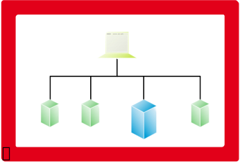

.. class:: incremental-list

:Vorteile:

    - keinerlei Angriffsmöglichkeiten von außen

:Nachteile:

    - kein Schutz gegen Insider
    - kein Zugang zum Internet

.. supplemental::

    Wie bereits diskutiert gibt es auch Angriffsmuster gegen Air-Gapped-Systeme. Ein Beispiel ist der Stuxnet-Wurm, der sich initial über USB-Sticks verbreitet.

    Wenn man kein Zugang zum Internet hat, dann hat man zum Beispiel kein Zugriff auf externe Dienste wie NTP und das Einspielen von Updates ist nur über Umwege möglich.

Von der Notwendigkeit des Schutzes von Rechnern
--------------------------------------------------------

.. epigraph::

    [...] Züger und sein Team hätten [...] erst kürzlich ein Experiment durchgeführt, [...]. Sie hätten einen Computer "ohne jeglichen Schutz" mit dem Internet verbunden, um zu sehen, wie lange es dauere, bis er befallen sei. Konkrete Details zur Konfiguration dieses Systems werden zwar nicht genannt, angeblich war der Rechner aber schon nach 20 Minuten infiltriert.

    -- `Golem.de 6.2.2024 <https://www.golem.de/news/iot-hacker-missbrauchen-zahnbuersten-fuer-ddos-angriffe-2402-181921.html>`__

Schutzschicht zwischen internem und externem Netz
------------------------------------------------------

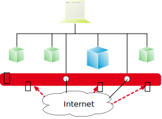

- Kontrolle des Nachrichtenverkehrs durch Filterung
- begrenzte Isolation mit begrenztem Schutz

.. supplemental::

    Eine Firewall schafft zwischen verbundenen Netzen Sicherheitsdomänen mit unterschiedlichem Schutzbedarf. Eine wichtige Teilaufgabe ist das Ausarbeiten von Sicherheitsrichtlinien.

Realisierung von Virtual Private Networks (VPN)
------------------------------------------------------

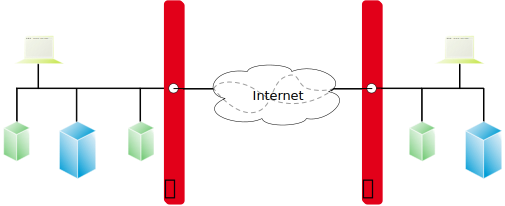

- Aufbau einer scheinbar privaten Verbindung von Firmenteilnetzen über das (öffentliche) Internet.
- Zusätzliche Verbindungsverschlüsselung zwischen den Firewalls.

.. supplemental::

    Ziel ist es aktive und passive Angriffe zu unterbinden.
    Selbst bei verschlüsselten Verbindungen kann die Verkehrsflussanalyse noch Informationen liefern über die Verbindungen liefern.

Kommerzielle VPNs für Endnutzer
---------------------------------

.. supplemental::

    **Motivation**

    - Schutz der Privatsphäre; der ISP kennt nicht mehr die Webseiten, die man aufruft.
    - Die IP-Adresse des Nutzers ist den aufgerufenen Webseiten nicht mehr bekannt und kann deswegen der Umgehung von Geo-Blocking dienen.

    **Nachteile?**

    - Vertrauen in den VPN-Anbieter muss vorhanden sein. Insbesondere, beim Einsatz zum Stärken der Privatsphäre, muss der VPN-Anbieter vertrauenswürdig sein und sollte ein so genannter „no-log“ Anbieter sein.
    - Es gibt auch (scheinbar kostenlose) VPN-Anbieter, die die Daten der Nutzer dann aber verkaufen (ehemals: `Facebook Onavo <https://techcrunch.com/2019/02/21/facebook-removes-onavo/?guccounter=1&guce_referrer=aHR0cHM6Ly93d3cuZ29vZ2xlLmNvbS8&guce_referrer_sig=AQAAAGVIppEgEOd9Z0FoMbmk2TCleRmD9wCMWDmIzGYEjIo1c7Cmz8NpiSoibthFG5IZQzmZ-kiJq-5Wj1bj21byh7YUrC_aSJJk1Bapwz80GSgzLFS-LHCF2OOetUYLSKwEG7W75znuqJJBJcNTTbtJ1UGB95Yu90saK9aIIkEywcRq>`__).

Schutz auf den Schichten des TCP/IP Stacks
-----------------------------------------------------------

Zentraler Schutz des gesamten internen Netzwerks durch:

.. class:: incremental-list

- Paket Filter (:eng:`Packet Filtering`)

  .. class:: list-with-explanations

  - Blockieren bestimmter IP-Empfänger-Adressen (extern / intern)
  - Blockieren bestimmter IP-Absender-Adressen (extern / intern)

    (z. B. aus dem Internet mit internen IP-Absender-Adressen)

  - Blockieren bestimmter Dienste; ggf. nur für bestimmte IP-Adressen

- Filter auf Anwendungsebene (:eng:`Application-level Filtering`)

  .. class:: list-with-explanations

  - inhaltsbezogene Filterung der Verkehrsdaten eines Dienstes

    (z. B. Virenfilter oder Spamfilter)
  - wirkungslos bei verschlüsselten Verkehrsdaten

- Protokollierungsmöglichkeit der Kommunikation von / nach extern

.. supplemental::

    Firewalls (alleine) können die Struktur des Netzwerks nicht verbergen.

DoS Attacke auf Anwendungsebene
------------------------------------------------

.. epigraph::

    [...] Angriff auf die Kleinen

    Waren bei früheren Spamangriffen massenhaft Accounts auf der größten Mastodon-Instanz ``mastodon.social`` angelegt worden, die dann von dort ihre Inhalte verbreiteten, trifft es nun nicht die größte, sondern die kleinsten. Automatisiert werden dabei Instanzen ausgesucht, auf denen eine Registrierung ohne Überprüfung und sogar ohne ein Captcha möglich ist. Das können etwa solche mit wenigen Accounts sein, die von Enthusiasten etwa für eine Gemeinde betrieben werden. Waren die Verantwortlichen in den vergangenen Tagen nicht aufmerksam, wurden diese Instanzen dann regelrecht überrannt. Die Spam-Accounts verschickten massenhaft Nachrichten mit einem Bild des namensgebenden Frühstücksfleischs und Links zu Discord-Servern, die wohl lahmgelegt werden sollten.

    -- `Mastodon: Spamwelle zeigt Schwächen auf [...] <https://www.heise.de/news/Mastodon-Spamwelle-zeigt-Schwaechen-auf-und-weckt-Sorge-vor-schlimmerer-Methode-9632055.html>`__

Realisierungsmöglichkeiten von Firewalls
------------------------------------------------

.. class:: incremental-list

- Hardware-Firewall

  - Screening Router
  - Application Gateway (auch Bastion Host)

    - Proxy-Server für bestimmte Dienste
    - Server-Software
    - Client-Software (HTTP-Browser, telnet, ftp, ...) kommuniziert nur mit dem Application Gateway; erscheint gegenüber Client Software als Endpunkt.

- Software-Firewall (*Personal Firewall*)

.. supplemental::

    Im Falle eines :eng:`Bastion Host`, ist dies der einzige unmittelbar aus dem Internet erreichbare Rechner.

.. class:: s-vertical-title

Dual-Homed Host
----------------

.. compound::
    :class: encapsulate-floats

    .. image:: images/firewalls/dual-homed-host.svg
        :alt: Dual-Homed Host
        :align: right

    **Aufbau**

    - zwei Netzwerkkarten: ggf. private interne Adressen
    - Screening Router & Gate: Packet Filter und Application-Level Filter
    - Proxy-Dienste installieren
    - Benutzer-Logins von extern

.. important::
    :class: incremental

    Bei der Konfiguration der Netzwerkkarten gilt:

    *IP-Pakete nicht automat. weiterleiten*

Screening Router
----------------------------------------------------

.. grid::

    .. cell:: width-60

        **Aufbau**

        Programmierbarer Hardwarerouter mit simplen Filterfunktionen:

        - nur Paket-Header prüfen
        -  schnelle Auswertung ermöglicht hohen Durchsatz

        - Realisierung eines Packet Filters

        .. assessment::
            :class: incremental

            .. class:: columns

            - .. class:: positive-list incremental

                    - einfach und billig
                    - flexibel

            - .. class:: negative-list incremental

                    - schwer zu testen
                    - Protokollierung
                    - Fernwartung
                    - keine Inhaltsfilterung

    .. cell:: width-40

        .. image:: images/firewalls/screening-router.svg
            :alt: Screening Router
            :align: center

Screened Host
-----------------

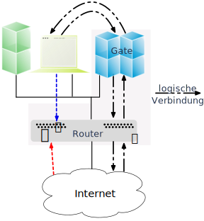

**Aufbau**

- Screening Router blockiert:

  - Pakete von / an interne Rechner (nicht Gate)
  - Source-Routed Pakete

- von extern nur Gate sichtbar
- Pakete von intern nur via Gate
- Gate bietet Proxy-Server (z. B. für E-Mail)

.. supplemental::

    *Source-Routed Pakete* sind Pakete, die den Weg durch das Netzwerk explizit angeben. (*Source-routing* wird auch als *Path Addressing* bezeichnet und wird im Allgemeinen als Sicherheitsproblem angesehen.)

    Gibt es für eine bestimmte Anwendung kein Application-level Proxy, dann kann auf einen für TCP/UDP generischen Proxy zurückgegriffen werden. Dieser arbeitet auf dem Session Layer und kann nur die Header-Informationen auswerten. Es handelt sich dann um ein :eng:`Circuit-level Proxy/Gateway`. Im Vergleich zu einem Application-level Proxy ist die Sicherheit geringer, da der Circuit-level Proxy nicht in der Lage ist, die Daten zu interpretieren.

    Ein allgemeines Problem ist, dass viele Anwendungen auf generische Protokolle wie HTTP aufsetzen. Weiterhin betreiben einige Anwendungen „Port Hopping“, d. h. sie wechseln den Port wenn der Standardport nicht offen ist.

    Eine Anforderung an „Next-generation Firewalls“ ist, dass diese die Analyse von den Daten einer Anwendung unabhängig vom Port und Protokoll ermöglichen.

Konfiguration eines Gateways
---------------------------------

Das Ziel der Konfiguration muss eine minimale angreifbare Oberfläche sein.

.. class:: incremental-list

- Abschalten aller nicht-benötigten Netzdienste
- Löschen aller nicht benötigter Programme
- Rechte von ``/bin/sh`` auf 500 setzen
- Rechte aller Systemverzeichnisse auf 711 setzen
- keine regulären Benutzerkennungen
- root-Login mit Einmal-Passwortsystem bzw. 2-Faktor Authentifizierung
- setzen von Platten- und Prozess-Quotas
- volle Protokollierung, möglichst auf Hardcopy-Gerät
- möglichst sichere, stabile und regelmäßig aktualisierte Betriebssystemversion einsetzen

.. supplemental::

    Die Rechte von ``/bin/sh`` auf 500 setzen bedeutet, dass nur der Eigentümer (root) es ausführen kann.

    Default:

    .. code:: sh

        $ ls -al /bin/sh
        -rwxr-xr-x  1 root  wheel  101232 Oct  1 06:10 /bin/sh

Screened Subnet
----------------

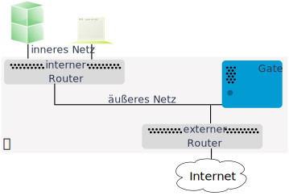

**Aufbau**

.. class:: incremental-list

- interner Screening Router als weiterer Schutzwall

  - blockiert Dienste, die nicht einmal bis zum Gate gelangen sollen
  - lässt nur Pakete zum / vom Gate durch

- äußeres Netz realisiert Demilitarisierte Zone (DMZ) für HTTP-Server, Mail-Server, ...

Intrusion Detection Systeme (IDS)
--------------------------------------

.. definition::

    Ein IDS ist ein Gerät (meist ein speziell konfigurierter Rechner), das vielfältige Techniken zur Erkennung von Angriffen anwendet und Angriffe meldet und ggf. abwehrt, in dem (z. B.) die Firewall automatisch umkonfiguriert wird.

.. compound::
    :class: incremental

    **Motivation**

    .. class:: incremental-list

    - Firewalls alleine sind zu statisch und deswegen häufig nicht ausreichend
    - bessere Aufzeichnung und flexiblere Erkennung notwendig
    - angepasste Reaktion notwendig

.. compound::
    :class: incremental

    **Umsetzung**

    An verschiedenen, neuralgischen Stellen werden spezielle Sensoren platziert, die (hier) den Netzwerkverkehr überwachen und verdächtige Aktivitäten melden.

.. supplemental::

    Miteinander verwandt bzw. typischerweise in einem Produkt zu finden:

    - Intrusion Detection (IDS)
    - Intrusion Response (IRS)
    - Intrusion Prevention (IPS)

IDS-Erkennungstechniken
----------------------------

.. class:: incremental-list

- Signaturerkennung
- statistische Analyse
- Anomalieerkennung

.. admonition:: Probleme
    :class: incremental

    - Fälschlicherweise gemeldete Angriffe (false positives)
    - nicht gemeldete Angriffe (false negatives) (insbesondere bei neuartigen Angriffen)
    - Echtzeitanforderung, insbesondere bei Hochgeschwindigkeitsnetzen
    - Aufzeichnung bei Netzwerken mit Switches ( ⇒ spez. SPAN Port)
    - Sensoren sollen unbeobachtbar sein (*stealth*)

.. supplemental::

    SPAN (:eng:`Switched Port Analyzer`) Ports sind spezielle Ports auf Switches, die bestimmten Verkehr (z. B. bestimmte Pakete) die über ein Switch gehen, an einen definierten Port weiterleiten können. An diesem Port kann dann eine Analyse des Verkehrs durchgeführt werden / ein Sensor angeschlossen werden.

.. class:: exercises transition-move-left

Übung
------------------

.. exercise:: Firewalls

    1. Was sind Vorteile eines Dual Homed Host gegenüber einem Paketfilter? Was sind die Nachteile?

    2. Benennen Sie zwei konzeptionelle Grenzen von Firewalls. D. h. zwei Szenarien gegen die Firewalls nicht schützen können.

    3. Für welche der folgenden Cybersicherheitsstrategien können Firewalls eingesetzt werden:

       1. Angriffe vermeiden
       2. Angriffe erkennen
       3. Angriffe abwehren/Angriffen entgegenwirken
       4. Reaktion auf Angriffe

    4. Sie werden beauftragt die Firewall so einzurichten, dass Mails mit Schadsoftware nicht durchgelassen werden. Wie reagieren Sie?

    .. solution::
        :pwd: fIREwall

        1. Ein Dual Homed Host ist ein Computer mit zwei Netzwerkschnittstellen. Zur Verwendung als Firewall wird das Routing, also die Weiterleitung von IP-Paketen zwischen den Schnittstellen, abgeschaltet. Damit können keine Pakete direkt zwischen den Netzen ausgetauscht werden und alle Verbindungen enden am Dual Homed Host. Um Daten weiterzuleiten, muss auf dem Dual Homed Host ein Proxy laufen, der eine Verbindung annimmt und eine neue Verbindung in das andere Netz aufbaut (gesteuert über Regel- und Berechtigungstabellen). Man kann über diese Application Level Gateways eine gute inhaltliche Kontrolle der übertragenen Daten durchführen, bei E-Mail beispielsweise eine Längenbegrenzung oder eine Erkennung von mitgeschickten ausführbaren Programmen, die dann automatisch geprüft oder entfernt werden könnten. Für jeden freigeschalteten Dienst benötigt man einen speziellen Proxy.

           Ein Risiko bei Dual Homed Hosts ist die Übernahme des Hosts durch einen Angreifer. Dieser hat dann über die entsprechende Netzwerkschnittstelle des Dual Homed Hosts vollständigen Zugriff auf das interne Netz.

        2. \

           - Hintertüren - sollte es Kommunikationsübergänge an der Firewall vorbei geben,  so können diese von Angreifern genutzt werden.
           - Interne Angriffe - diesbezüglich gibt es keine Unterschiede zu einem Netzwerk ohne Firewall.
           - Vertrauenswürdigkeit der Kommunikationspartner.

        3. Die Hauptaufgabe von Firewalls ist es Angriffen entgegenzuwirken (3.). Eine Reaktion auf Angriffe ist für klassische Firewalls nicht möglich. Eine Reaktion auf Angriffe ist Aufgabe von Intrusion Detection Systemen. Moderne Firewalls integrieren jedoch häufig auch Funktionen von *Intrusion Detection Systemen*. (Angriffe können nicht vermieden werden, da dies nicht in der Macht der Firewall liegt. Klassische/Einfache Firewalls können keine Angriffe erkennen.)
        4. ... die Mails sollen ja den Mailserver erreichen; eine inhaltsbasierte Beurteilung des Inhalts einer Mail ist nicht Aufgabe einer Firewall.
