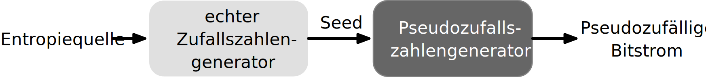

.. meta::
    :version: renaissance
    :author: Michael Eichberg
    :keywords: Zufälligkeit, Stromchiffre
    :description lang=en: Random Bit Generation and Stream Ciphers
    :description lang=de: Zufallszahlengenerierung und Stromchiffren
    :id: lecture-security-stromchiffren
    :first-slide: last-viewed
    :master-password: WirklichSchwierig!

.. include:: ../docutils.defs

Erzeugung von Zufallsbits und Stromchiffren
===============================================

:Dozent: `Prof. Dr. Michael Eichberg <https://delors.github.io/cv/folien.de.rst.html>`__
:Basierend auf: *Cryptography and Network Security - Principles and Practice, 8th Edition, William Stallings*
:Version: 2.2

.. supplemental::

  :Folien:
      [HTML] |html-source|

      [PDF] |pdf-source|
  :Fehler melden:
      https://github.com/Delors/delors.github.io/issues

.. class:: new-section

Erzeugung und Zufälligkeit von Zufallszahlen
----------------------------------------------

Zufallszahlen
-------------------------------

- Eine Reihe von Sicherheitsalgorithmen und -protokollen, die auf Kryptographie basieren, verwenden binäre Zufallszahlen:

  - Schlüsselverteilung und reziproke (:ger:`wechselseitige`) Authentifizierungsverfahren
  - Erzeugung von Sitzungsschlüsseln
  - Generierung von Schlüsseln für den RSA Public-Key-Verschlüsselungsalgorithmus
  - Generierung eines Bitstroms für die symmetrische Stromverschlüsselung

.. container:: incremental

   Es gibt zwei unterschiedliche Anforderungen an eine Folge von Zufallszahlen:

   .. class:: incremental-list

   - Zufälligkeit
   - Unvorhersehbarkeit

Zufälligkeit
--------------

- Die Erzeugung einer Folge von angeblich zufälligen Zahlen, die in einem genau definierten statistischen Sinne zufällig sind, war ein Problem.

.. class:: incremental

- Zwei Kriterien werden verwendet, um zu prüfen, ob eine Zahlenfolge zufällig ist:

  :Gleichmäßige Verteilung: Die Häufigkeit des Auftretens von Einsen und Nullen sollte ungefähr gleich sein.
  :Unabhängigkeit: Keine Teilsequenz der Folge kann von den anderen abgeleitet werden.

Visualisierung von Zufallszahlengeneratoren\ [#]_
----------------------------------------------------------------

.. [#] Zufallszahlengenerator ≘ :eng:`Random Number Generator (RNG)`

.. grid::

    .. cell:: width-50

        Erwartete Verteilung von Zufallswerten im 3D-Raum.

        .. image:: drawings/stream_ciphers/distribution_3d_expected.svg
            :alt: Erwartete Verteilung der Werte im 3D-Raum
            :align: center

    .. cell:: width-50 incremental

        Verteilung von „zufälligen“ Werten eines schlechten RNGs im 3D-Raum.

        .. image:: drawings/stream_ciphers/distribution_3d_bad_lcg.svg
            :alt: Schlechte Verteilung der Werte im 3D-Raum
            :align: center

.. supplemental::

    Bei diesem Experiment werden immer drei nacheinander auftretende Werte als Koordinate im 3D-Raum interpretiert. Die erwartete Verteilung ist eine gleichmäßige Verteilung im Raum. Die Verteilung der Werte eines schlechten RNGs ist nicht gleichmäßig und zeigt eine klare Struktur.

Unvorhersehbarkeit
--------------------

- Die Anforderung ist nicht nur, dass die Zahlenfolge statistisch zufällig ist, sondern auch, dass die *aufeinanderfolgenden Glieder der Folge unvorhersehbar* sind.

.. class:: incremental

- Bei ``echten`` Zufallsfolgen ist jede Zahl statistisch unabhängig von den anderen Zahlen in der Folge und daher unvorhersehbar.

  - Echte Zufallszahlen(-generatoren) haben Grenzen, insbesondere die Ineffizienz, so dass es häufiger vorkommt, dass Algorithmen implementiert werden, die scheinbar zufällige Zahlenfolgen erzeugen.
  - Es muss darauf geachtet werden, dass ein Gegner nicht in der Lage ist, zukünftige Elemente der Folge auf der Grundlage früherer Elemente vorherzusagen.

Pseudozufallszahlen
---------------------

Bei kryptografischen Anwendungen werden in der Regel algorithmische Verfahren zur Erzeugung von Zufallszahlen verwendet.

.. class:: incremental-list

- Diese Algorithmen sind deterministisch und erzeugen daher Zahlenfolgen, die nicht statistisch zufällig sind.
- Wenn der Algorithmus gut ist, bestehen die resultierenden Sequenzen viele Tests auf Zufälligkeit und werden als Pseudozufallszahlen bezeichnet.

Zufalls- und Pseudozufallszahlengeneratoren
-------------------------------------------------

.. image:: drawings/stream_ciphers/rng_and_prng.svg
    :alt: RNGs
    :align: center

:TRNG: Echter Zufallszahlengenerator (:eng:`True Random Number Generator`)
:PRNG: Pseudozufallszahlengenerator (:eng:`Pseudorandom Number Generator`)
:PRF: Pseudozufällige Funktion (:eng:`Pseudorandom Function`)

Echter Zufallszahlengenerator (TRNG)
------------------------------------

- Nimmt als Eingabe eine Quelle, die effektiv zufällig ist.
- Die Quelle wird als Entropiequelle bezeichnet und stammt aus der physischen Umgebung des Computers:

  - Dazu gehören z. B. Zeitpunkte von Tastenanschlägen, elektrische Aktivität auf der Festplatte, Mausbewegungen und Momentanwerte der Systemuhr.
  - Die Quelle oder eine Kombination von Quellen dient als Eingabe für einen Algorithmus, der eine binäre Zufallsausgabe erzeugt.

- Der TRNG kann einfach die Umwandlung einer analogen Quelle in eine binäre Ausgabe beinhalten.
- Der TRNG kann zusätzliche Verarbeitungsschritte durchführen, um etwaige Verzerrungen in der Quelle auszugleichen.

Pseudozufallszahlengenerator (PRNG) und Pseudozufallsfunktion (PRF)
--------------------------------------------------------------------

.. deck::

    .. card::

      .. grid::

        .. cell:: width-50

            *Pseudozufallszahlengenerator*

            - Ein Algorithmus, der zur Erzeugung einer nicht in der Länge beschränkten Bitfolge verwendet wird.
            - Die Verwendung eines solchen Bitstroms als Eingabe für eine symmetrische Stromchiffre ist eine häufige Anwendung.

        .. cell:: width-50 incremental

            *Pseudorandom function (PRF)*

            - Wird verwendet, um eine pseudozufällige Bitfolge *mit einer bestimmten Länge* zu erzeugen.
            - Beispiele sind symmetrische Verschlüsselungsschlüssel und Nonces.

    .. card::

        .. class:: incremental-list list-with-explanations

        - Nimmt als Eingabe einen festen Wert, den so genannten *Seed*, und erzeugt mithilfe eines deterministischen Algorithmus eine Folge von Ausgabebits.

          Häufig wird der Seed von einem TRNG erzeugt.

        - Der Ausgangsbitstrom wird ausschließlich durch den oder die Eingabewerte bestimmt, so dass ein Angreifer, der den Algorithmus und den Seed kennt, den gesamten Bitstrom reproduzieren kann.

        - Abgesehen von der Anzahl der erzeugten Bits gibt es keinen Unterschied zwischen einem PRNG und einer PRF.

.. supplemental::

    *Nonce* (*Number used Once*) ist ein Wert, der nur einmal verwendet wird. In der Kryptographie werden Nonces häufig verwendet, um die Sicherheit von Verschlüsselungsalgorithmen zu erhöhen bzw. überhaupt erst zu erhalten.

PRNG-Anforderungen
-------------------

.. class:: incremental-list

- Die grundlegende Anforderung bei der Verwendung eines PRNG oder PRF für eine kryptografische Anwendung ist, dass **ein Gegner, der den Seed nicht kennt, nicht in der Lage ist, die pseudozufällige Zeichenfolge zu bestimmen**.
- Die Forderung nach Geheimhaltung der Ausgabe eines PRNG oder PRF führt zu spezifischen Anforderungen in den Bereichen:

  - Zufälligkeit
  - Unvorhersehbarkeit
  - Merkmale des Seeds

Zufälligkeit
--------------

- Der erzeugte Bitstrom muss zufällig erscheinen, obwohl er deterministisch ist:

  .. class:: incremental-list

  - Es gibt keinen einzigen Test, mit dem festgestellt werden kann, ob ein PRNG Zahlen erzeugt, die die Eigenschaft der Zufälligkeit aufweisen
  - Wenn der PRNG auf der Grundlage mehrerer Tests Zufälligkeit aufweist, kann davon ausgegangen werden, dass er die Anforderung der Zufälligkeit erfüllt.

    .. container:: accentuate

        NIST SP 800-22 legt fest, dass die Tests auf drei Merkmale ausgerichtet sein sollten:

        (1) gleichmäßige Verteilung,
        (2) Skalierbarkeit,
        (3) Konsistenz

Tests auf Zufälligkeit
------------------------

SP 800-22 listet 15 verschiedene Zufallstests auf (Auszug):

.. story::

    .. class:: incremental-list

    :Häufigkeitstest:

        - Der grundlegendste Test, der in jeder Testreihe enthalten sein muss.
        - Es soll festgestellt werden, ob die Anzahl der Einsen und Nullen in einer Sequenz annähernd derjenigen entspricht, die bei einer echten Zufallssequenz zu erwarten wäre.

    :Lauflängentest:

         - Schwerpunkt dieses Tests ist die Zahl der Läufe (:eng:`runs`) in der Folge, wobei ein Lauf (:eng:`run`) eine ununterbrochene Folge identischer Bits ist, die vorher und nachher durch ein Bit des entgegengesetzten Werts begrenzt wird.
         - Es soll festgestellt werden, ob die Anzahl der Läufe von Einsen und Nullen verschiedener Länge den Erwartungen für eine Zufallsfolge entspricht.

    :Maurers universeller statistischer Test:

        - Fokus ist die Anzahl der Bits zwischen übereinstimmenden Mustern.
        - Ziel ist es, festzustellen, ob die Sequenz ohne Informationsverlust erheblich komprimiert werden kann oder nicht. Eine signifikant komprimierbare Sequenz wird als nicht zufällig betrachtet.

Unvorhersehbarkeit
--------------------

.. deck::

    .. card::

        Ein Strom von Pseudozufallszahlen sollte zwei Formen der Unvorhersehbarkeit aufweisen:

        .. class:: incremental-list dhbw

        1. **Vorwärtsgerichtete Unvorhersehbarkeit**

           Wenn der Seed unbekannt ist, sollte das nächste erzeugte Bit in der Sequenz trotz Kenntnis der vorherigen Bits in der Sequenz unvorhersehbar sein.

        2. **Rückwärtsgerichtete Unvorhersehbarkeit**

           - Es sollte nicht möglich sein, den Seed aus der Kenntnis der erzeugten Werte zu bestimmen.
           - Es sollte keine Korrelation zwischen einem Seed und einem aus diesem Seed generierten Wert erkennbar sein.
           - Jedes Element der Sequenz sollte wie das Ergebnis eines unabhängigen Zufallsereignisses erscheinen, dessen Wahrscheinlichkeit 1/2 ist.

    .. card:: center-child-elements

        .. hint::

            Dieselbe Reihe von Tests für die Zufälligkeit liefert auch einen Test für die Unvorhersehbarkeit: Eine Zufallsfolge hat keine Korrelation mit einem festen Wert (dem Seed).

Anforderungen an den Seed
------------------------------

- Der Seed, der als Eingabe für den PRNG dient, muss sicher und unvorhersehbar sein
- Der Seed selbst muss eine Zufalls- oder Pseudozufallszahl sein.
- Normalerweise wird der Seed von einem TRNG erzeugt.

Algorithmus-Entwurf
----------------------

Algorithmen lassen sich in zwei Kategorien einteilen:

.. class:: incremental

1. **Speziell entwickelte Verfahren**.

   Algorithmen, die speziell und ausschließlich für die Erzeugung pseudozufälliger Bitströme entwickelt wurden.

2. **Algorithmen, die auf bestehenden kryptographischen Algorithmen basieren**.

   Sie bewirken eine Zufallsverteilung der Eingabedaten.

   .. container:: incremental

     Kryptografische Algorithmen aus den folgenden drei Kategorien werden üblicherweise zur Erstellung von PRNGs verwendet:

     - Symmetrische Blockchiffren
     - Asymmetrische Verschlüsselungsalgorithmen
     - Hash-Funktionen und Nachrichtenauthentifizierungscodes

Lineare Kongruenzgeneratoren
-----------------------------

Ein erstmals von Lehmer vorgeschlagener Algorithmus, der mit vier Zahlen parametrisiert ist:

.. csv-table::
    :class: booktabs
    :align: center

    :math-i:`m`, der Modul, :math:`m > 0`
    :math-i:`a`, der Multiplikator, :math:`0 < a< m`
    :math-i:`c`, das Inkrement , :math:`0≤ c < m`
    :math:`X_0`, "der Startwert, oder *Seed*", :math:`0 ≤ X_0 < m`

Die Folge von Zufallszahlen :math:`\lbrace{X_n}\rbrace` erhält man durch die folgende iterative Gleichung: :math:`X_{n+1} = (aX_n + c)\bmod m`

.. container:: incremental

    Wenn :math:`m` , :math:`a` , :math:`c` und :math:`X_0` ganze Zahlen sind, dann erzeugt diese Technik eine Folge von ganzen Zahlen, wobei jede ganze Zahl im Bereich :math:`0 \leq X_n < m` liegt.

    Die Auswahl der Werte für :math:`a` , :math:`c` und :math:`m` ist entscheidend für die Entwicklung eines brauchbaren Zufallszahlengenerators.

.. supplemental::

    .. warning::

        Lineare Kongruenzgeneratoren sind einfach zu implementieren und erfordern nur wenig Speicherplatz. Sie sind jedoch nicht für kryptografische Anwendungen geeignet, da sie eine viel zu kurze Periode haben und leicht zu brechen sind.

    Im Bereich der Simulation können sie jedoch nützlich sein.

Blum Blum Shub (BBS) Generator
------------------------------

.. class:: incremental-list

- Hat vermutlich den stärksten öffentlichen Beweis für seine kryptografische Stärke von allen speziell entwickelten Algorithmen.

- Er wird als *kryptographisch sicherer Pseudozufallsbitgenerator (CSPRBG)* bezeichnet.

  Ein CSPRBG ist definiert als ein Algorithmus, der den Next-Bit-Test besteht, wenn es keinen Polynomialzeit-Algorithmus gibt, der bei Eingabe der ersten :math-i:`k` Bits einer Ausgabesequenz das :math:`(k + 1)`-te Bit mit einer Wahrscheinlichkeit deutlich größer als :math-r:`1/2` vorhersagen kann.

- Die Sicherheit von BBS beruht auf der Schwierigkeit der Faktorisierung von :math-i:`n`.

Blum Blum Shub Block Diagram
------------------------------

.. image::  drawings/stream_ciphers/blum_blum_shub.svg
    :alt: Blum Blum Shub Block Diagram
    :align: center

:math-i:`n` ist das Produkt von zwei (sehr großen) Primzahlen :math:`p` und :math:`q`: :math:`n = p \times q`. Weiterhin muss gelten: :math:`p \equiv q \equiv 3 \; (mod \; 4)`.

Der Seed :math:`s` sollte eine ganze Zahl sein, die zu :math:`n` *coprime* ist (d. h. :math:`p` und :math:`q` sind keine Faktoren von :math:`s`) und nicht 1 oder 0.

Beispiel - Blum Blum Shub (BBS) Generator
------------------------------------------

Sei :math:`p = 383` und :math:`q = 503`, dann ist :math:`n = 192649`. Weiterhin sei der Seed :math:`s = 101355`.

.. csv-table::
    :align: center
    :class: booktabs compact table-data-align-right
    :header: :math-i:`i`, :math:`x_i`, :math:`B_i`

    :peripheral:`0`, :math:`101355 ^ 2 \bmod 192649 = 20749`,
    1, :math-r:`143135`,1
    2,:math-r:`177671`,1
    3,:math-r:`97048`,0
    4,:math-r:`89992`,0
    5,:math-r:`174051`,1
    6,:math-r:`80649`,1
    7,:math-r:`45663`,1
    8,:math-r:`69442`,0
    9,:math-r:`186894`,0

..    10,:math-r:`177046`,0

PRNG mit Hilfe der Betriebsmodi für Blockchiffren
---------------------------------------------------

Zwei Ansätze, die eine Blockchiffre zum Aufbau eines PNRG verwenden, haben weitgehend Akzeptanz erhalten:

.. class:: incremental-list

- CTR Modus: Empfohlen in NIST SP 800-90, ANSI standard X.82, und RFC 4086
- OFB Modus: Empfohlen in X9.82 und RFC 4086

.. grid::

    .. cell:: width-50

        .. container:: incremental-1

            .. image:: drawings/stream_ciphers/prng-ctr-mode.svg
                :alt: PRNG CTR Mode
                :align: center
                :class: incremental-1

    .. cell:: width-50

        .. container:: incremental#2

            .. image:: drawings/stream_ciphers/prng-ofb-mode.svg
                :alt: PRNG OFB Mode
                :align: center

.. supplemental::

    Die initialen Werte für V und K basieren auf dem Seed, der von einem TRNG erzeugt wird/erzeugt werden sollte. Zum Beispiel kann von einem 256-Bit-Zufallswert die ersten 128 Bit für V und die nächsten 128 Bit für K verwendet werden.

    Die Blockchiffre wird verwendet, um den Seed zu verschlüsseln und den Schlüsselstrom zu erzeugen. Im CTR Mode wird der initiale Wert für V inkrementiert.

    Gründe für die Verwendung von Blockchiffren ist die Einfachheit der Implementierung und die Tatsache, dass Blockchiffren bereits in vielen Anwendungen vorhanden sind und die kryptografischen Eigenschaften von Blockchiffren gut verstanden sind.

.. class:: exercises

Übung
-------

.. exercise:: Test auf Zufälligkeit

    Test auf Zufälligkeit: Gegeben sei eine Bitfolge, die von einem RNG erzeugt wurde. Was ist das erwartete Ergebnis, wenn man gängige Komprimierungsprogramme (z. B. 7zip, gzip, rar, ...) verwendet, um die Datei zu komprimieren; d. h. welchen Kompressionsgrad erwarten Sie?

    .. solution::
        :pwd: NixKompression

        Es sollte keine relevante Kompression möglich sein! Wenn dem so ist, ist die Zufälligkeit höchst fragwürdig. Eine hohe Zufälligkeit impliziert eine hohe Entropie und damit nichts, was man komprimieren könnte. Im Endeffekt müsste die „komprimierte“ Datei aufgrund der erforderlichen Metadaten sogar größer sein.

.. class:: exercises

Übung
-------

.. exercise:: Lineare Kongruenzgeneratoren

    Implementiere einen linearen Kongruenzgenerator, um zu untersuchen, wie er sich verhält, wenn sich die Zahlenwerte von :math:`a`, :math:`c` und :math:`m` ändern. Versuchen Sie Werte zu finden, die eine vermeintlich zufällige Folge ergeben.

    Testen Sie Ihren Zufallszahlengenerator unter anderem mit den folgenden Werten:

    .. code:: java
        :number-lines:

        lcg(seed,a,c,m,number_of_random_values_to_generate)
        lcg(1234,8,8,4096,100)
        lcg(1234,4,8,4096,100)
        lcg(1234,8,4,1111111111111111111l,100)

    .. solution::
        :pwd: Jupyter...!

        Vgl. `Jupyter Notebook <https://github.com/Delors/delors.github.io/blob/main/sec-stromchiffre/code/stream_ciphers.ipynb>`__.

        .. code:: java
            :number-lines:
            :class: copy-to-clipboard

            void lcg(long s, long a, long c, long m, int valuesToGenerate) {
                var x = (s * a + c ) % m;
                while (valuesToGenerate > 0) {
                    valuesToGenerate --;
                    System.out.println(x);
                    x = (x * a + c) % m;
                }
            }

            lcg(98346444l, 2323, 665458, 1111111111111111111l, 100000);

.. class:: exercises

Übung
-------

.. exercise:: Blum Blum Shub

    Sei :math:`p = 83` und :math:`q = 47`.

    Berechnen Sie die ersten 8 Bits der Folge, die von einem Blum Blum Shub Generator erzeugt wird, wenn der Seed :math:`s = 253` ist. Nutzen Sie einen Taschenrechner oder schreiben Sie einfach ein Script in einer Sprache Ihrer Wahl.

    .. solution::
        :pwd: BBS_rules

        :math:`n = 83 \times 47 = 3901`

        Die Berechnung der ersten 8 Bits der Folge, die von einem Blum Blum Shub Generator erzeugt wird, wenn der Seed :math:`s = 253` ist, ergibt:

        .. csv-table::
            :header: i, Wert, Bit
            :align: right

            :peripheral:`0`, :math:`253^2\; mod\; n` :peripheral:`= 1.593`,
            1, 1999, 1
            2, 1377, 1
            3, 243, 1
            4, 534, 0
            5, 383, 1
            6, 2352, 0
            7, 286, 0
            8, 3776, 0
            9, 21, 1
            10, 441, 1

        Java Code (für JShell):

        .. code:: java
            :number-lines:
            :class: copy-to-clipboard

            long n = 83 * 47;
            var x = 253 * 253 % n;
            for(int i = 0 ; i < 10; i ++) {
                x = x * x % n;
                System.out.println(x + " " + x % 2);
            }

        JavaScript Code:

        .. code:: javascript
            :number-lines:
            :class: copy-to-clipboard

                let n = 83 * 47;
                let x = 253**2 % n;
                function* bitGen() {
                    x = x ** 2 % n;
                    yield x % 2;
                }
                const g = bitGen()
                g.next().value;

.. class:: new-section transition-scale

Entropie
------------

Quellen der Entropie
---------------------

- Ein echter Zufallszahlengenerator (TRNG) verwendet eine nicht-deterministische Quelle zur Erzeugung von Zufälligkeit.

.. class:: incremental-list

- Die meisten funktionieren durch Messung unvorhersehbarer natürlicher Prozesse, wie z. B. Impulsdetektoren für ionisierende Strahlung, Gasentladungsröhren und undichte Kondensatoren.
- Intel CPUs (seit Ivy Bridge) verwenden seit 2012 thermisches Rauschen als Quelle. Dies geschieht durch Verstärkung der an nicht angesteuerten Widerständen gemessenen Spannung.

  Auslesen ist mit dem RDRAND Befehl möglich bzw. (neuer) mit dem RDSEED Befehl.

- AMD und ARM CPUs bieten vergleichbare Funktionen. Auf aktuellen AMD CPUs dauert es ca. 2500 Clock Cycles für die Generierung eines 64 Bit Wertes.

.. supplemental::

    Die Befehle RDRAND und RDSEED erfüllen die Anforderungen von NIST SP 800-90A, FIPS 140-2, und ANSI X9.82.

.. attention::
    :class: incremental

    Es gibt *Vermutungen*, dass diese Funktionen absichtlich kompromitiert wurden. `FreeBSD <https://www.theregister.com/2013/12/09/freebsd_abandoning_hardware_randomness/>`_ hat 2013 die Verwendung wieder eingestellt. Linux nutzt diese nur ergänzend.

Vergleich von PRNGs und TRNGs
-----------------------------

.. csv-table::
    :class: booktabs table-header-align-left
    :header: , Pseudozufallszahlengeneratoren, echte Zufallszahlengeneratoren
    :stub-columns: 1

    Effizienz, sehr effizient, im Allgemeinen ineffizient
    Determinismus, deterministisch, nicht deterministisch
    Periodizität, periodisch, aperiodisch

Konditionierung
----------------

Ein TRNG kann eine Ausgabe erzeugen, die in irgendeiner Weise verzerrt ist (z. B. gibt es mehr Einsen als Nullen oder umgekehrt)

.. deck::  incremental

    .. card::

        :Verzerrt: NIST SP 800-90B definiert einen Zufallsprozess als verzerrt in Bezug auf einen angenommenen diskreten Satz möglicher Ergebnisse, wenn einige dieser Ergebnisse eine größere Wahrscheinlichkeit des Auftretens haben als andere.

        .. class:: incremental

        :Entropierate: NIST 800-90B definiert die Entropierate als die Rate, mit der eine digitalisierte Rauschquelle Entropie liefert.

          - Ist ein Maß für die Zufälligkeit oder Unvorhersehbarkeit einer Bitfolge.
          - Ein Wert zwischen 0 (keine Entropie) und 1 (volle Entropie).

    .. card::

        *Konditionierungsalgorithmen/Entzerrungsalgorithmen*\ :

        Verfahren zur Modifizierung eines Bitstroms zur weiteren Randomisierung der Bits.

        - Die Konditionierung erfolgt in der Regel durch die Verwendung eines kryptografischen Algorithmus zur Verschlüsselung der Zufallsbits, um Verzerrungen zu vermeiden und die Entropie zu erhöhen.

        - Die beiden gängigsten Ansätze sind die Verwendung einer Hash-Funktion oder einer symmetrischen Blockchiffre.

.. class:: new-section transition-fade

Stromchiffren
----------------

Allgemeine Struktur einer typischen Stromchiffre
-------------------------------------------------

.. image:: drawings/stream_ciphers/typical_stream_cipher.svg
    :alt:  Typical Stream Cipher
    :align: center

.. grid::

    .. cell:: width-20

        Klartext: p\ :sub:`i`

        Chiffretext: c\ :sub:`i`

        Schlüsselstrom: z\ :sub:`i`

    .. cell:: width-20

        Schlüssel: K

        Initialisierungswert: IV

    .. cell:: width-50

        Zustand: σ\ :sub:`i`

        Funktion zur Berechnung des nächsten Zustands: f

        Schlüsselstromfunktion: g

.. supplemental::

    Die Schlüsselstromfunktion g projeziert den internen Zustand (welcher sehr groß sein kann) auf den nächsten Block/das nächste Byte, das zur Verschlüsselung verwendet wird.

Überlegungen zum Entwurf von Stromchiffren
-------------------------------------------

.. story::

    .. class:: incremental-list dd-margin-left-4em

    :Die Verschlüsselungssequenz sollte eine große Periode haben:
        Ein Pseudozufallszahlengenerator verwendet eine Funktion, die einen deterministischen Strom von Bits erzeugt, der sich schließlich wiederholt; je länger die Wiederholungsperiode, desto schwieriger wird die Kryptoanalyse.

    :Der Schlüsselstrom sollte die Eigenschaften eines echten Zufallszahlenstroms so gut wie möglich nachbilden:
        Es sollte eine ungefähr gleiche Anzahl von 1en und 0en geben.

        Wenn der Schlüsselstrom als ein Strom von Bytes behandelt wird, sollten alle 256 möglichen Byte-Werte ungefähr gleich oft vorkommen.

    :Eine Schlüssellänge von mindestens 128 Bit ist wünschenswert:
        Die Ausgabe des Pseudo-Zufallszahlengenerators ist vom Wert des Eingabeschlüssels abhängig.

        Es gelten die gleichen Überlegungen wie für Blockchiffren.

    :Mit einem richtig konzipierten Pseudozufallszahlengenerator kann eine Stromchiffre genauso sicher sein wie eine Blockchiffre mit vergleichbarer Schlüssellänge:

        Ein potenzieller Vorteil ist, dass Stromchiffren, die keine Blockchiffren als Baustein verwenden, in der Regel schneller sind und weit weniger Code benötigen als Blockchiffren.

Historische Stromchiffre: RC 4
---------------------------------

- 1987 von Ron Rivest für RSA Security entwickelt.
- Stromchiffre mit variabler Schlüsselgröße und byteorientierten Operationen, die in Software sehr schnell ausgeführt werden können.
- Basiert auf der Verwendung einer zufälligen Permutation.

.. warning::
    :class: incremental

    In der RC 4-Schlüsselableitungsfunktion wurde eine grundlegende Schwachstelle aufgedeckt, die den Aufwand für die Ermittlung des Schlüssels verringert.

    Es wurde gezeigt, dass es möglich ist *wiederholt* verschlüsselte Klartexte wiederherzustellen.

    Aufgrund der Schwachstellen hat die IETF RFC 7465 herausgegeben, der die Verwendung von RC4 in TLS verbietet. In seinen TLS-Richtlinien verbietet das NIST ebenfalls die Verwendung von RC4 für Regierungszwecke.

ChaCha20
----------

.. class:: incremental-list list-with-explanations

- ChaCha20 ist eine Stromchiffre, die von Daniel J. Bernstein entwickelt wurde.
- ChaCha20 ist ein schneller Verschlüsselungsalgorithmus (ohne besondere Hardwareanforderungen).

  Reine Softwareimplementierungen von ChaCha20 sind reinen Softwareimplementierungen von AES in Bezug auf die Geschwindigkeit überlegen.
- ChaCha20 ist im `RFC 8439 <https://datatracker.ietf.org/doc/html/rfc8439>`__ spezifiziert.
- ChaCha20 ist eine spezielle Form von ChaCha, die 20 Runden (oder *80 Quarter Rounds*) durchläuft.

ChaCha20 Zustand - Matrix - Indizierung
-----------------------------------------

.. csv-table::
    :class: borderless table-data-align-right monospaced
    :align: center

    0, 1, 2, 3
    4, 5, 6 ,7
    8, 9, 10, 11
    12, 13, 14, 15

Die 16 Werte der Matrix sind vorzeichenlose 32-Bit Ganzzahlen (:eng:`Integers`); d.h. der Zustand hat somit 16 * 4 Byte = 64 Byte = 512 Bit.

ChaCha Quarter Round
----------------------

.. grid::

    .. cell:: width-50

        Grundlegende Operationen in ChaCha20.

        1. :code:`a += b; d ^= a; d <<<= 16;`
        2. :code:`c += d; b ^= c; b <<<= 12;`
        3. :code:`a += b; d ^= a; d <<<=  8;`
        4. :code:`c += d; b ^= c; b <<<=  7;`

    .. cell:: width-50 dd-margin-left-3em

        .. legend::

            :``+``: ist die Addition modulo 2³².
            :``^``: ist die XOR-Operation.
            :``<<<``: ist die zyklische Linksverschiebung um die angegebene Anzahl von Stellen.

.. grid:: incremental

    .. cell:: width-50

        Gegeben seien die folgenden Werte:

        .. code:: java

            a = 0x11111111
            b = 0x01020304
            c = 0x77777777
            d = 0x01234567

    .. cell:: width-50

        Anwendung der vierten Formel:

        .. code:: java

            c = c + d   = 0x77777777 + 0x01234567
                        = 0x789abcde

            b = b ^ c   = 0x01020304 ^ 0x789abcde
                        = 0x7998bfda

            b = b <<< 7 = 0x7998bfda <<< 7
                        = 0xcc5fed3c

.. supplemental::

    Linksverschiebung um 7 Stellen:

    .. code:: python

        0x7998bfda = 0b01111001100110001011111111011010
        0b0111100_1100110001011111111011010 <<< 7 =  0b1100110001011111111011010_0111100
        0b1100110001011111111011010_0111100 = 0xcc5fed3c

    ChaCha20-Poly1305 - d. h. ChaCha20 mit zusätzlicher Authentifizierung (Poly 1305) - wird unter anderem von IPsec, SSH, TLS 1.2, DTLS 1.2, TLS 1.3, WireGuard, S/MIME 4.0, und OTRv4[22].

Anwendung der *Quarter Round Operation*
----------------------------------------------------------------------------

.. deck::

    .. card::

        - Die *Quarter Round Operation* operiert immer auf **vier der sechszehn Werte** des Zustands.
        - :code:`QUARTERROUND(x, y, z, w)` operiert auf den vier Werten identifiziert durch die Indizes: ``x``, ``y``, ``z`` und ``w``.

    .. card::

        Beispiel - *Column Round*:

        Die QUARTERROUND(1, 5, 9, 13) operiert somit auf den Werten ``a``, ``b``, ``c``, ``d`` der Matrix.

        .. csv-table::
            :class: borderless monospaced table-data-align-right
            :align: center

             0, :red:`a`\ = 1,  2,  3
             4, :red:`b`\ = 5,  6,  7
             8, :red:`c`\ = 9, 10, 11
            12, :red:`d`\ =13, 14, 15

    .. card::

        Beispiel - *Diagonal Round*:

        Gegeben seien die Werte:

        .. csv-table::
            :class: monospaced highlight-cell-on-hover borderless
            :align: center

            879531e0,  c5ecf37d,  516461b1,  c9a62f8a
            44c20ef3,  3390af7f,  d9fc690b,  2a5f714c
            53372767,  b00a5631,  974c541a,  359e9963
            5c971061,  3d631689,  2098d9d6,  91dbd320

        Ergebnis der ``QUARTERROUND(2, 7, 8, 13)``:

        .. csv-table::
            :class: monospaced highlight-cell-on-hover borderless
            :align: center

            879531e0,  c5ecf37d, :red:`bdb886dc`,  c9a62f8a
            44c20ef3,  3390af7f,  d9fc690b, :red:`cfacafd2`
            :red:`e46bea80`,  b00a5631,  974c541a,  359e9963
            5c971061, :red:`ccc07c79`,  2098d9d6,  91dbd320

.. supplemental::

    Quarter-Round Function ≈ :ger:`Viertel-Runden-Operation`

Die ChaCha20 Blockfunktion
----------------------------

.. deck::

    .. card::

        Eingaben:

        - Ein 256-Bit-Schlüssel (8 × 32-Bit-Werte (little-endian))
        - Ein 32-Bit-Blockzähler
        - Eine 96-Bit-Nonce (3 × 32-Bit-Werte (little-endian))

        ∑ 384 Bit.

        Ausgabe:

        - 64 Byte (512 Bit) des Schlüsselstroms

    .. card::

        Initialer Zustand:

        :Werte 0-3:  ``0x61707865``, ``0x3320646e``, ``0x79622d32``, ``0x6b206574``
        :Werte 4-11:  der 256-Bit Schlüssel (8 × 32Bit)
        :Wert 12: der Blockzähler

            .. container:: peripheral

                Da ein Block 64 Byte lang ist, können max 256GiB Daten verschlüsselt werden.
        :Wert 13-15: die 96-Bit Nonce

    .. card::

        Struktur des initialen Zustands:

        .. csv-table::
            :class: monospaced highlight-cell-on-hover no-inner-borders no-table-borders
            :align: center

            cccccccc  cccccccc  cccccccc  cccccccc
            kkkkkkkk  kkkkkkkk  kkkkkkkk  kkkkkkkk
            kkkkkkkk  kkkkkkkk  kkkkkkkk  kkkkkkkk
            bbbbbbbb  nnnnnnnn  nnnnnnnn  nnnnnnnn

        .. container:: smaller

            :``c``: Konstante
            :``k``: Schlüssel
            :``b``: Blockzähler
            :``n``: Nonce

    .. card::

        Es werden 20 Runden durchlaufen, wobei in jeder Runde vier *Quarter Rounds* ausgeführt werden.

        .. code::
            :class: far-smaller

            // Column rounds: 1, 3, 5, 7, 9, 11, 13, 15, 17, 19 Runde
            {
                QUARTERROUND(0, 4, 8, 12)
                QUARTERROUND(1, 5, 9, 13)
                QUARTERROUND(2, 6, 10, 14)
                QUARTERROUND(3, 7, 11, 15)
            }
            // Diagonal rounds: 2, 4, 6, 8, 10, 12, 14, 16, 18, 20 Runde
            {
                QUARTERROUND(0, 5, 10, 15)
                QUARTERROUND(1, 6, 11, 12)
                QUARTERROUND(2, 7, 8, 13)
                QUARTERROUND(3, 4, 9, 14)
            }

    .. card::

        Nach den 20 Runden wird der Zustand mit dem initialen Zustand addiert (modulo 2³², wortweise). Auf diese Weise erhält man den Schlüsselstrom.

        Diese Verrechnung mit dem initialen Zustand dient der Vereitelung bestimmter Angriffstechniken (z. B. differenzielle Analyse).

        Dieser wird dann zum Verschlüsseln des Klartexts mittels XOR verwendet. Somit muss der Klartext kein vielfaches der Blockgröße sein.

    .. card::

        .. grid::

            .. cell:: width-30

                Ablauf für die Verschlüsselung *eines* Blocks:

            .. cell:: width-70

                .. raw:: html
                    :class: center-content

                    

                    <svg viewBox="190 50 420 400" xmlns="http://www.w3.org/2000/svg" font-size="16">
                    <!-- Eingabeblock -->
                    <rect x="200" y="60" width="400" height="80" fill="#f0f8ff" stroke="#000" />
                    <text x="220" y="90" font-weight="bold">Initialer Zustand (State) (512 Bit):</text>
                    <text x="220" y="115">[Const | Key | Block Counter = i | Nonce]</text>

                    <!-- Pfeil zu 20 Runden -->
                    <line x1="400" y1="140" x2="400" y2="176" stroke="#000" marker-end="url(#arrow)" />
                    <text x="410" y="165" font-style="italic">20 Runden (Mix)</text>

                    <!-- Rundenblock -->
                    <rect x="200" y="180" width="400" height="80" fill="#e6ffe6" stroke="#000" />
                    <text x="220" y="210">W = ChaCha20_Rounds(State)</text>
                    <text x="220" y="235">(Wird intern verwürfelt)</text>

                    <!-- Pfeil zu Addition -->
                    <line x1="400" y1="260" x2="400" y2="296" stroke="#000" marker-end="url(#arrow)" />
                    <text x="410" y="285" font-style="italic">+ initialer Zustand Block i</text>

                    <!-- Addition -->
                    <rect x="200" y="300" width="400" height="60" fill="#fffbe6" stroke="#000" />
                    <text x="220" y="335">Keystream Block</text>

                    <!-- Klartext XOR -->
                    <line x1="400" y1="360" x2="400" y2="396" stroke="#000" marker-end="url(#arrow)" />
                    <text x="410" y="385" font-style="italic">⊕ Klartext</text>

                    <rect x="200" y="400" width="400" height="40" fill="#ffe6e6" stroke="#000" />
                    <text x="250" y="425">Chiffretext = Klartext ⊕ Keystream</text>

                    <!-- Definitions -->
                    <defs>
                        <marker id="arrow" markerWidth="10" markerHeight="10" refX="5" refY="3" orient="auto" markerUnits="strokeWidth">
                        <path d="M0,0 L0,6 L9,3 z" fill="#000" />
                        </marker>
                    </defs>
                    </svg>
                    

.. supplemental::

    Es gibt auch eine Variante von ChaCha20, die einen 64-Bit-Blockzähler und eine 64-Bit Nonce verwendet. Hier wird jedoch die IETF Variante diskutiert.

    .. rubric:: Little-endian

    Bei der Verwendung von *little-endian* (wörtlich etwa: „kleinendigen“) Format wird das niedrigstwertige Byte an der Anfangsadresse gespeichert.

    D. h. die 32-Bit-Zahl ``1`` wird als:

    .. csv-table::
        :class: monospaced highlight-cell-on-hover no-table-borders far-far-smaller
        :align: center

        (kleinste Adresse) 0xXX, 0xXX+1, 0xXX+2, (größte Adresse) 0xXX+3
        01, 00, 00, 00

    gespeichert. Intel und AMD CPUs verwenden traditionell Little-endian. ARM CPUs können beides, verwenden jedoch typischerweise auch Little-endian; insbesondere im Falle von MACs oder Smartphones (Android and iOS).

.. class:: exercises

Übung
---------

.. exercise:: CHA CHA verstehen

    - Welchem Zweck dient die Nonce? Bzw. warum reicht ein Schlüssel alleine nicht?

    - Muss die Nonce geheim gehalten werden?

    - Wenn die Nonce wiederverwendet wird, welche Information kann der Angreifer in welchen Situationen ableiten?

    - Wie viele Nachrichten kann man mit einem Schlüssel verschlüsseln?

    - Welche Vor-/Nachteil hat es, wenn man den Blockzähler auf 64 Bit erhöht und die Nonce auf 64 Bit verringert?

      Wie ist der Zusammenhang zum Geburtstagsparadoxon?

      .. supplemental::

        .. rubric:: Geburtstagsparadoxon

        Wie groß ist die Wahrscheinlichkeit, dass bei zufälliger Auswahl von k Werten aus einer Menge mit N möglichen Werten mindestens zwei identisch sind.

        Bei großen N kann die Abschätzung wie folgt erfolgen: Bei k ≈ √N besteht ≈ 50 % Kollisionswahrscheinlichkeit.

        .. example::

            In einer Gruppe von nur 23 Personen liegt die Wahrscheinlichkeit, dass mindestens zwei am gleichen Tag Geburtstag haben, bei über 50 % (präzise berechnet; nicht überschlägig).

    - Welche Operationen dienen (a) der Konfusion und (b) der Diffusion? Wie wird der Lawineneffekt erreicht?

      .. supplemental::

        .. repetition::

            :Konfusion: Erschwert die Beziehung zwischen Schlüssel und Chiffretext (→ „Schlüsselversteckung“)

            :Diffusion: Verteilt den Einfluss eines einzelnen Eingabebits über viele Ausgabebits (→ „Durchmischung”)

    - Kann CHACHA20 parallelisiert werden?

    .. solution::
        :pwd: zum????

        .. rubric:: Lösung

        Die Nonce dient dazu, mehrere Nachrichten mit demselben Schlüssel sicher zu verschlüsseln, ohne dabei denselben Schlüsselstrom zu erzeugen.

        Die Nonce muss nicht geheim gehalten werden.

        Würden wir mehrere Nachrichten mit der selben Nonce verschlüsseln, dann könnten wir direkt P1 ⊕ P2 berechnen und Rückschlüsse auf die Nachricht erhalten:

        ::

            C1 = P1 ⊕ Z
            C2 = P2 ⊕ Z
            ⇒ C1 ⊕ C2 = P1 ⊕ P2

        Beispiele:

        - Sei P1 ⊕ P2 = 0, dann wurde zweimal die selbe Nachricht versendet.
        - Sind Teile von P1 bekannt (zum Beispiel aufgrund der Verwendung eines bekannten Protokolls), dann kann man daraus direkt die entsprechenden Abschnitte von P2 rekonstruieren.

        Da die Nonce 2⁹⁶ Bit hat, kann man entsprechend viele Nachrichten mit dem selben Schlüssel verschlüsseln.

        **64-64-Bit Design**

        :Vorteile: Praktisch unbegrenzte Nachrichtenlänge; ggf. relevante wenn man sehr große Datenströme über längere Zeiträume kontinuierlich verschlüsseln will.

        :Nachteile: Anzahl der Nonces ist kleiner, wodurch die Wahrscheinlichkeit der Wiederverwendung steigt; d.h. ab der Verwendung von 2³² Nonces ist die Wahrscheinlichkeit ≥ 50% (cf. Geburtstagsparadoxon)

        **Konfusion und Diffusion**

        Die grundlegenden Operationen der CHACHA Chiffre sind die Quater-Round Operationen, die alle gleich aufgebaut sind und aus einer Addition modulo 2³², einem XOR und einer Bit-Rotation bestehen. Zum Beispiel: :code:`a += b; d ^= a; d <<<= 16;`.

        Die Addition modulo 2³² ist nicht linear (mod 2³²) und deswegen schwer rückrechenbar (Beispiel mit mod 2⁴: 1010 + 0110 = 0000 aber auch 1000 + 1000 = 0000 etc. und somit nicht-linear) . Sie dient der Konfusion.

        XOR ist im Prinzip eine lineare Operation, die in Kombination mit der modularen Addition (Schritt davor) auch zur Diffusion beiträgt. Die Kombination mit der vorhergehenden Operation ist hier entscheidend und somit trägt das XOR sowohl zur Konfusion als auch Diffusion bei.

        Die Bit-Rotation dient der Diffusion. Dadurch haben Änderungen an einem Eingabebit Auswirkungen auf viele Ausgabebits. Dies sorgt für den Lawineneffekt.

        .. important::

            Die Kombination aus Addition und XOR ist eine gängige Methode in kryptographischen Algorithmen, um Diffusion und Konfusion zu erzielen.

        **Parallelisierung**

        Die Parallelisierung von CHACHA(20) ist inhärent möglich. Der Keystream wird in Blöcken berechnet, die jeweils von 2 Konstanten: Nonce und Schlüssel sowie dem Blockzähler abhängen. Der (End-)Zustand des vorherigen Blocks hat keine direkte Auswirkung auf den nachfolgendne Block.
