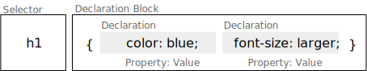

.. meta::
    :version: renaissance
    :lang: de
    :author: Michael Eichberg
    :keywords: Web Programmierung, CSS
    :description lang=de: CSS
    :id: vorlesung-web-programmierung-css
    :first-slide: last-viewed
    :master-password: WirklichSchwierig!

.. include:: ../docutils.defs

Cascading Style Sheets (CSS)
=============================================

:Dozent: `Prof. Dr. Michael Eichberg <https://delors.github.io/cv/folien.de.rst.html>`__
:Kontakt: michael.eichberg@dhbw.de, Raum 149B
:Version: 1.5.1

.. supplemental::

    :Folien:

        |html-source|

        |pdf-source|

    :Fehler melden:
        https://github.com/Delors/delors.github.io/issues

.. class:: new-section transition-fade

Einführung
------------------------------------------------

CSS - Cascading Style Sheets
------------------------------------------------

CSS (Cascading Style Sheets) ist eine Stylesheet-Sprache, die verwendet wird, um das Aussehen von Dokumenten zu gestalten.

.. grid::

    .. cell:: width-50

        .. rubric:: HTML

        .. code:: html
            :class: copy-to-clipboard
            :number-lines:

            <section>
                
1. Absatz

                
2. Absatz

                
3. Absatz

            </section>

    .. cell:: width-50

        .. rubric:: CSS und Resultat

        .. module:: embedded-iframe

            <iframe
                    width="100%"
                    srcdoc='
                <html>
                    <head>
                        {{ld-embedded-iframe.head.frag.html}}
                        {{ld-embedded-iframe.editable-styles.frag.html}}
                        
                    </head>
                    <body>
                        
                        

                        <section>
                            
1. Absatz

                            
2. Absatz

                            
3. Absatz

                        </section>
                    </body>
                </html>' >
                iframes are not supported
            </iframe>

CSS - Historie
----------------

.. class:: incremental-list

- Entwicklung begann 1994; CSS 1 wurde 1996 veröffentlicht und war erst einmal ein Fehlschlag
- CSS 2 wurde 1998 veröffentlicht
- CSS 3 wurde modularisiert, um die Entwicklung zu beschleunigen

  .. class:: incremental just-a-bit-smaller

  - CSS Color Level 3 (2012)
  - CSS Namespaces Level 3 (2012)
  - CSS Selectors Level 3 (2012)
  - ...
  - CSS Flexbox Level 1 (2018) (`nach 9 Jahren Entwicklungszeit <https://www.w3.org/standards/history/css-flexbox-1/>`_)
  - CSS Selectors Level 4 (`2024 noch Draft Status <https://www.w3.org/TR/selectors-4/>`__; insbesondere  :css:`:has()`  hat `breite Unterstützung <https://caniuse.com/css-has>`__)
  - CSS Nesting (`2024 noch Draft Status <https://drafts.csswg.org/css-nesting/>`__; `dennoch bereits seit 2024 weit verfügbar <https://caniuse.com/css-nesting>`__)

Grundlagen
------------------------------------------------

Eine CSS-Datei besteht aus Regeln, die aus einem Selektor und einer oder mehreren Deklarationen bestehen:

.. grid:: incremental

    .. cell:: width-50

        .. rubric:: CSS

        .. code:: css
            :class: copy-to-clipboard
            :number-lines:

            h1 {
              color: blue;
              font-size: larger;
            }
            body { /* the boss said so... */
              background-color:
                lightblue;
            }

    .. cell:: width-50

        .. rubric:: Resultat

        .. module:: embedded-iframe
            :class: br-shadow

            <iframe width="100%"
                    srcdoc='
                <html>
                    <head>{{ld-embedded-iframe.head.frag.html}}</head>
                <body>
                    
                    <h1>Überschrift</h1>
                    
Paragraph<strong> in sehr wichtig!</strong>.

                </body>' >
                iframes are not supported
            </iframe>

.. supplemental::

    CSS ist im wesentlichen *Whitespace insensitive*, d. h. Leerzeichen, Zeilenumbrüche und Tabulatoren werden ignoriert.

    Kommentare werden in :css:`/* ... */` geschrieben.

Verknüpfung von CSS und HTML
------------------------------------------------

.. class:: incremental-list

- Inline CSS: :html:`
`
- Externe CSS-Datei:

  .. class:: list-with-explanations incremental-list

  - über Link: :html:`<link rel="stylesheet" media="screen, print" href="style.css">`

    (Normalerweise im :html:`<head>` deklariert.)
  - mittels :js:`import` Direktive\ [#]_\ : :html:``

.. class:: list-with-explanations incremental-list

- im :html:``

  (Normalerweise im :html:`<head>` deklariert.)
- Das Verwenden beliebig vieler CSS-Dateien und :html:`
                    <h1>Die Bedeutung des Seins</h1>
                    <h1 class="wip">Die Bedeutung des Nicht-Seins</h1>
                    <h1 class="todo future">Das Sein und das Nicht-Sein</h1>
                </body>' >
                iframes are not supported.
            </iframe>

.. [#] ID basierte Selektoren funktionieren vergleichbar, jedoch wird ein "``#``" anstatt eines "``.``" verwendet. (In CSS müssen IDs nicht eindeutig sein; dies ist aber eine Verletzung von HTML und eindeutige IDs sind eine *Best Practices*.)

:eng:`Attribute-Selectors`\ [#]_
--------------------------------------------------------

.. class:: incremental-list

- basierend auf der Existenz eines Attributs: ``h1[lang] { color: red; }``
- basierend auf dem *exakten* Wert eines Attributs: ``h1[lang="de-DE"] { color: red; }``
- basierend auf einem partiellen Match:

  .. class:: incremental-list

  - enthält als eigenständiges ``de``: ``h1[lang~="de"] { color: red; }``
  - beginnt mit ``de``: ``h1[lang^="de"] { color: red; }``
  - substring ``de``: ``h1[lang*="de"] { color: red; }``
  - endet mit ``de`` : ``h1[lang$="de"] { color: red; }``
  - beginnt mit ``de`` und wird dann gefolgt von einem Bindestrich oder steht alleine: ``h1[lang|="de"] { color: red; }``
- durch ein ``i`` am Ende wird der **Selektor für den Wert** *case-insensitive*: ``h1[lang="de-de" i] { color: red; }``

.. [#] Im Allgemeinen sind Attribut-basierte Selektoren vergleichsweise fragil und werden deswegen nur spärlich eingesetzt. Im Zusammenhang mit ``data-*`` Attributen ist dies jedoch eine sehr mächtige Technik.

:eng:`Attribute-Selectors` - Beispiel
--------------------------------------------------

.. grid::

    .. cell:: width-50

        *HTML*

        .. code:: html
            :class: copy-to-clipboard
            :number-lines:

            <h1 lang="de-DE">
                Die Bedeutung des Seins.</h1>
            <h1 lang="en-GB">
                To Be Or Not To Be</h1>
            <h1 lang="en-US">
                Play to win!</h1>
            <h1 lang="de-AT">
                Ich brauch ne Jause</h1>

        *CSS*

        .. code:: css
            :class: copy-to-clipboard incremental-code
            :number-lines:

            [lang] { text-decoration: underline; }
            [lang$='US'] { color: orange; }
            [lang|='en'] { font-style: italic; }
            [lang="de-at" i] { text-transform: uppercase; }

    .. cell:: width-50

        *Resultat*

        .. module:: embedded-iframe
            :class: br-shadow

            <iframe width="100%"
                    srcdoc='
                <html>
                    <head>{{ld-embedded-iframe.head.frag.html}}</head>
                    <body>
                        
                        <h1 lang="de-DE">Die Bedeutung des Seins.</h1>
                        <h1 lang="en-GB">To Be Or Not To Be</h1>
                        <h1 lang="en-US">Play to win!</h1>
                        <h1 lang="de-AT">Ich brauch ne Jause</h1>
                    </body>' >
                iframes are not supported.
            </iframe>

Kombinatoren
--------------------------------------------------------------------

.. story::

    .. csv-table:: Nachfahren (bzgl. Dokumentenstruktur) (:eng:`Descendant Selector`)
        :class: booktabs incremental
        :width: 100%
        :widths: 30 80

        ``div p``, alle :html:`
` Nachfahren von :html:`
` Elementen
        ``.important p``, "alle :html:`
` Nachfahren von ``.important`` Elementen"

    .. csv-table:: Alle direkten Kinder (:eng:`Child Selector`)
        :class: booktabs incremental
        :width: 100%
        :widths: 30 80

        ``div > p``, alle :html:`
` Kinder von :html:`
` Elementen

    .. csv-table:: Benachbarte Geschwister (:eng:`Adjacent Sibling Selector`)
        :class: booktabs incremental
        :width: 100%
        :widths: 30 80

        ``h1 + p``, "alle :html:`
` Elemente, die *direkt* auf ein :html:`<h1>` Element folgen und sich das gleiche Eltern-Element teilen"

    .. csv-table:: Allgemeiner Geschwister Selektor (:eng:`General Sibling Selector`)
        :class: booktabs incremental
        :width: 100%
        :widths: 30 80

        ``h1 ~ p``, "alle :html:`
` Elemente, die auf ein :html:`<h1>` Element folgen und sich das gleiche Eltern-Element teilen"

Kombinatoren - Beispiele
--------------------------------------------------------------------

.. grid::

    .. cell:: width-50

        *HTML*

        .. code:: html
            :class: copy-to-clipboard
            :number-lines:

            <h1>Ü1</h1>
            Text
            
P1

            
P2

            
D0

            
P3

            <h1>Ü2</h1>
            

                D1
                
D1.1

                
D1.2

            

            
D2

            
D3

    .. cell:: width-50

        *Spielwiese*

        .. module:: embedded-iframe
            :class: br-shadow

            <iframe width="100%"
                    srcdoc='
            <html>
                <head>
                    {{ld-embedded-iframe.head.frag.html}}
                    {{ld-embedded-iframe.editable-styles.frag.html}}
                    
                </head>
                <body>
                    

                        <h1>Ü1</h1>
                        Text
                        
P1

                        
P2

                        
D0

                        
P3

                        <h1>Ü2</h1>
                        
D1
                            
D1.1

                            
D1.2

                        

                        
D2

                        
D3

                </body>' >
                iframes are not supported
            </iframe>

        .. supplemental::

            Beim ``div ~ div`` Beispiel wurde eine CSS Eigenschaft gewählt, die nicht vererbt wird, da sonst der Effekt, dass D1.1 nicht gewählt wird, nicht sichtbar ist!

*Pseudo-class Selektors*
------------------------------------------------

.. class:: incremental-list

- erlauben das Selektieren von Elementen basierend auf ihrem Zustand
- können beliebig kombiniert werden: :css:`a:link:hover { color: red; }` selektiert alle nicht-besuchten Links über denen sich die Maus befindet
- Ausgewählte Beispiele:

  .. class:: incremental-list

  - Bzgl. der Struktur: :css:`:first-child`, :css:`:last-child`, :css:`:nth-child(n)`, :css:`:nth-of-type(n)`, :css:`:root`, :css:`:only-child`, :css:`:only-of-type`, :css:`:link`, :css:`:visited`

  - Basierend auf Nutzerinteraktionen: :css:`:hover`, :css:`:active`, :css:`:focus`
  - Zustand des Elements: :css:`:enabled`, :css:`:disabled`, :css:`:checked`, :css:`:valid`, :css:`:invalid`
  - Sprache und Lokalisierung: :css:`:lang(de)`, :css:`:dir(ltr)`
  - Logische Selektoren: :css:`:not(selector)`, :css:`:is(selector)`, :css:`:where(selector)`, :css:`:has(selector)`

- Pseudo-class Selektoren beziehen sich immer auf das aktuelle Element.

.. supplemental::

    - Bei :css:`nth-child(n)` und :css:`nth-of-type(n)` ist n eine Zahl oder ein Ausdruck (:math:`\alpha\,n+b`), der eine Zahl ergibt (z. B. ``2n+1`` oder aber ``even``). Das Zählen der Elemente beginnt bei 1.
    - :css:`:root` selektiert das Wurzelelement des Dokuments, also das :html:`<html>` Element bei HTML Dokumenten oder das :html:`<svg>` Element bei SVG Dokumenten. `:root` wird insbesondere zur Definition von CSS Variablen verwendet!
    - :css:`:only-child` und :css:`:only-of-type` selektiert ein Element, das das einzige entsprechende Kind seines Eltern-Elements ist.

*Pseudo-class Selektors* - Beispiel
------------------------------------------------

.. grid::

    .. cell:: width-50

        **HTML**

        .. code:: html
            :class: copy-to-clipboard
            :number-lines:

            

                

                    Vater 1
                    

                        Kind 1
                    

                

                

                    Vater 2
                    

                        Kind 2
                    

                

            

    .. cell:: width-50

        **CSS**

        .. code:: css
            :class: copy-to-clipboard
            :number-lines:

            .papa:first-child { color: red; }
            .kind:first-child { color: green; }

        .. question::

            Welcher Selektor selektiert welches Element?

            .. container:: peripheral

                Zur Erinnerung: Pseudo-class Selektoren selektieren das Element, auf das sie sich beziehen.

        .. module:: embedded-iframe
            :class: br-shadow incremental#1

            <iframe
                    width="100%"
                    srcdoc='
                <html>
                <head>
                    {{ld-embedded-iframe.head.frag.html}}
                </head>
                <body>
                    
                    

                        

                            Vater 1
                            

                                Kind 1
                            

                        

                        

                            Vater 2
                            

                                Kind 2
                            

                        

                    
' >
                iframes are not supported
            </iframe>

.. container:: incremental#1

    Selektiert wird ein Element mit der Klasse ``papa``, wenn es das erste Kind seines Eltern-Elements ist. Es wird *nicht das erste Kind des Elements selektiert*.

*Pseudo-class Selektors* bzgl. Inputvalidierung
--------------------------------------------------------------------

.. grid::

    .. cell:: width-50

        *HTML*

        .. code:: html
            :class: copy-to-clipboard
            :number-lines:

            <input type="email"
                   placeholder="your email"
                   required>
            <input type="email"
                   placeholder="your friend's email">

    .. cell:: width-50

        *Spielwiese*

        .. module:: embedded-iframe
            :class: br-shadow

            <iframe width="100%"
                    srcdoc='
                <html>
                    <head>
                        {{ld-embedded-iframe.head.frag.html}}
                        {{ld-embedded-iframe.editable-styles.frag.html}}
                        
                    </head>
                    <body>
                        
                        

                        <input type="email" placeholder="your email"  required>
                        <input type="email" placeholder="your friend`s email">
                    </body>'>
                iframes are not supported
            </iframe>

.. supplemental::

  Da das zweite Eingabefeld nicht als ``required`` markiert ist, wird es auch dann als ``:valid`` betrachtet, wenn es leer ist.

.. class:: exercises transition-scale

Übung
------------------------------------------------

.. exercise:: Pseudo-class Selektoren

    .. grid::

        .. cell:: width-40

            **Gegeben sei**

            .. code:: html
                :class: copy-to-clipboard
                :number-lines:

                

                  <h1>CSS</h1>
                  
1.0

                  <aside>
                    
Cascading Style Sheets

                    <ol id="topics">
                      <li>What is CSS?</li>
                      <li>How to use CSS? </li>
                      <li>Inline vs. Block</li>
                      <li>Font Styling</li>
                      <li class="todo">Lists</li>
                      <li>Background Styling</li>
                    </ol>
                  </aside>
                

        .. cell:: width-60

            **Aufgaben**

            1. Schreiben Sie einen CSS Selektor, um den ersten Buchstaben des ersten Wortes eines jeden Listenelements (:css:`:first-letter`) in Kleinbuchstaben darzustellen mit :css:`text-transform: lowercase`.
            2. Schreiben Sie einen CSS Selektor, um jeder zweiten Zeile der Liste eine andere Hintergrundfarbe zu geben mit :css:`background-color: plum`.
            3. Selektieren Sie die Überschrift eines Blocks(:html:`
`\ s) mit der Klasse :html:`slide` wenn diese das erst Kind ist und geben Sie ihr zum Beispiel die Schriftfarbe rot mit :css:`color: red`.

        .. solution::
            :pwd: 1C2S3S

            .. code:: css

                li:nth-of-type(2n) {
                    background-color: lightgreen;
                }

                li:first-letter {
                    text-transform: lowercase;
                }

                div.slide > h1:first-child {
                    font-style: italic;
                }

Spezifität von Selektoren
-----------------------------

.. deck::

    .. card::

      - Die Spezifität eines Selektors bestimmt, welcher Stil auf ein Element angewendet wird, wenn mehrere Regeln auf ein Element zutreffen und diese bzgl. der gleichen Eigenschaften in Konflikt stehen.

        Die Spezifität wird durch einen Vektor ``(a, b, c)`` dargestellt:

        - ``a``: Anzahl der ID Selektoren
        - ``b``: Anzahl der Klassen-, Attribut- und Pseudo-Klassen Selektoren
        - ``c``: Anzahl der Element- und Pseudo-Element Selektoren

        Die Spezifität wird in der Reihenfolge ``a``, ``b``, ``c`` verglichen.

      .. class:: incremental

      - Konzeptionell wird die Spezifität pro Deklaration betrachtet.

    .. card::

        .. rubric:: Beispiele

        .. csv-table::
            :header: "Selektor", "Spezifität"
            :class: incremental-table-rows booktabs
            :width: 100%
            :widths: 50 50

            :css:`p { color: black; }`, "0, 0, 1"
            :css:`section p { color: orange; }`, "0, 0, 2"
            :css:`section > p { color: orange; }`, "0, 0, 2"
            :css:`p.warning { color: red; }`, "0, 1, 1"
            :css:`p[id*='this'] {color: green; }`, "0, 1, 1"
            :css:`#main { color: yellow; }`, "1, 0, 0"
            :css:`* { color: yellow !important; }`, "0, 0, 0 (Important)"

    .. card::

        .. grid::

            .. cell:: width-50

                *HTML*

                .. code:: html
                    :class: copy-to-clipboard
                    :number-lines:

                    <section>
                        

                            Der erste Abschnitt!
                        

                        

                            Ein alter Abschnitt.
                        

                    </section>
                    
Der letzte Abschnitt.

            .. cell:: width-50

                *Spielwiese*

                .. module:: embedded-iframe
                    :class: br-shadow

                    <iframe width=100%
                            srcdoc='
                        <html>
                            <head>
                                {{ld-embedded-iframe.head.frag.html}}
                                {{ld-embedded-iframe.editable-styles.frag.html}}
                                
                            </head>
                            <body>
                                
                                

                                <section>
                                    
Der erste Abschnitt!

                                    
Ein alter Abschnitt.

                                </section>
                                
Der letzte Abschnitt.

                            </body>' >
                        iframes are not supported
                    </iframe>

.. supplemental::

    - Kombinatoren haben keine Spezifität.
    -  :css:`*`  hat die Spezifität (0,0,0)
    - eine Deklaration mit  :css:`!important`  hat eine höhere Spezifität alls jede Deklaration ohne  :css:`!important` . Im Prinzip definiert  :css:`!important`  eine eigene Menge von Regeln und innerhalb dieser wird die Kaskadierung invertiert. Innerhalb eines Layers werden alle als  :css:`!important`  markierten Deklarationen nach den beschriebenen Regeln ausgewertet.

(Probleme bei der) Verwendung von :css:`!important`\ [#]_
--------------------------------------------------------------------

.. deck::

    .. card::

        Mit Stand Mai 2025 setzen alle drei großen Browser (Chrome, Firefox und Safari) *CSS Layers* und  :css:`!important`  beim Rendering korrekt um, aber nur Firefox zeigt es auch in den Developer Tools korrekt an!

    .. card::

        .. code:: html
            :class: copy-to-clipboard
            :number-lines:

            <head></head>
            <body>          
This is an error message.
        </body>

    .. card::

        **Chrome 135** - falsche Darstellung in den Entwicklertools - Farbe von "*error message*" ist im Browser rot, wird in den Entwicklertools aber als blau angezeigt.

        .. image:: screenshots/important-chrome-135.png
            :class: highdpi trbl-shadow

    .. card::

        **Firefox 138** - korrekte Darstellung in den Entwicklertools - Farbe von "*error message*" ist im Browser rot und wird in den Entwicklertools auch als rot angezeigt.

        .. image:: screenshots/important-firefox-138.png
            :class: highdpi trbl-shadow

    .. card::

        .. deck::

            .. card::

                .. attention::

                    Die Verwendung von KI Assistenten im Zusammenhang mit neueren CSS Features ist sehr problematisch, da diese ggf. noch nicht genug neuen Code gesehen haben und dann schlicht falsche Aussagen treffen!

            .. card::

                **Unsinnige Antwort von ChatGPT** auf einen Prompt bzgl. :css:`!important` und *CSS Layers*:

                .. epigraph::

                    .. rubric:: 📌 The Role of !important with Cascade Layers

                    🔥 Key Rule:

                    !important breaks out of layer ordering and competes only with other !important rules — regardless of layer. [...]

                    ✅ That also means:

                    If multiple !important rules exist, specificity and layer order determine the winner — but only within the !important set.

                    -- ChatGPT 5. Mai 2025

                .. class:: incremental

                    Hier gilt, dass "regardless of layer" nicht korrekt ist und auf die Inversion der Layer wird gar nicht eingegangen!

.. [#] Stand Mai 2025

.. supplemental::

    .. hint::

        Eine Verwendung von :css:`!important` ist ein Zeichen dafür, dass die CSS Regeln nicht gut strukturiert sind!

    .. rubric::  Vollständiges Beispiel bzgl. :css:`!important`

    .. include:: code/important.html
        :code: html
        :class: copy-to-clipboard
        :number-lines:

Elemente
------------------------------------------------

- Wir unterscheiden zwischen *replaced elements* bei denen der Inhalt nicht Teil des Dokumentes ist (zum Beispiel :html:``) und *non-replaced elements* (zum Beispiel :html:`
` und :html:`
`; d. h. die meisten HTML Elemente).

.. class:: incremental-list

- Grundlegende Formatierungskontexte\ [#]_\ : *block* (z. B. der Standard von ``h1``, ``p``, ``div``, ...) und *inline* (z. B. der Standard von ``strong``, ``span``,...).

  .. class:: list-with-explanations

  - Block-Elemente generieren eine Box, welche den Inhaltsbereich des *Parent-Elements* ausfüllt.

    (*Replaced elements* können, müssen aber nicht Block-Elemente sein.)
  - Inline-Elemente generieren eine Box innerhalb einer Zeile und unterbrechen den Fluss der Zeile nicht.
  - Mittels CSS kann der Formatierungskontext geändert werden.

  .. [#] Es gibt noch „viel mehr“ Kontexte für spezielle Anwendungsfälle.

Block und Inline Elemente - Beispiel
------------------------------------------------

.. grid::

    .. cell:: width-50

        .. rubric:: Code

        .. code:: css
            :class: copy-to-clipboard
            :number-lines:

            h1 {
                display: inline;
            }
            strong {
                display: block;
            }

        Folgendes Beispiel dient nur der Veranschaulichung:

        .. code:: html

            Dies ist eine <strong><h1>Überschrift</h1>
            in sehr wichtig</strong>; wirklich!

    .. cell:: width-50

        .. rubric:: Visualisierung

        .. module:: embedded-iframe
            :class: br-shadow

            <iframe width="100%"
                    srcdoc='
                <html>
                    <head>{{ld-embedded-iframe.head.frag.html}}</head>
                    <body>
                        
                        Dies ist eine <strong><h1>Überschrift</h1> in sehr wichtig</strong>; wirklich!
                    </body>'>
                iframes are not supported.
            </iframe>

.. warning::
    :class: incremental

    Dies ist kein gültiges HTML!

Vererbung von CSS Eigenschaften
------------------------------------------------

- die meisten Eigenschaften (wie zum Beispiel  :css:`color` ) werden vererbt

.. class:: incremental-list list-with-explanations

- Eigenschaften, die nicht vererbt werden, sind insbesondere:  :css:`border` ,  :css:`margin` ,  :css:`padding`  und  :css:`background`
- vererbte Eigenschaften haben **keine Spezifität**

  (D. h. ein :css:`:where()` Selektor oder der Universal-Selektor :css:`*` gewinnen.)

Kaskadierung
------------------------------------------------

Die Entscheidung welche Regeln bzw. Deklarationen Anwendung finden, wird durch die Kaskadierung bestimmt:

.. class:: incremental-list

1. Bestimme alle Regeln, die auf ein Element zutreffen.
2. Sortiere die Regeln nach Gewicht des Selektors (d.h.  :css:`!important`  oder *normal*)
3. Sortiere alle Deklarationen basierend auf der Quelle:

   - Autor (höchste Priorität)
   - Benutzer (mittlere Priorität; z. B. *User-Stylesheets*)
   - *User Agent* (niedrigste Priorität; z. B. Browser Standard Styles)
4. Sortiere nach *Encapsulation Context* (cf. Shadow-DOM)
5. Sortiere danach ob die Deklarationen *Element Attached* sind (d. h. mittels ``style`` Attribut)
6. Sortiere nach *Cascade Layer*
7. Sortiere nach Spezifität
8. Sortiere nach Reihenfolge der Deklarationen

.. supplemental::

    .. remark::

        Benutzer-Stylesheets spielen heutzutage fast keine Rolle mehr. In den Anfangstagen war es möglich ein eigenes CSS zu definieren und dem Browser zu sagen, dass dieses angewendet werden soll.

    Der Shadow-Dom kapselt CSS und JavaScript bgzl. eines Elements. Dies ist insbesondere für Web-Komponenten relevant.

.. class:: transition-fade

CSS und nicht-unterstützte Eigenschaften
------------------------------------------------

Sollte eine Deklaration möglicherweise nicht unterstützt werden, es jedoch einen vernünftigen Fallback geben, dann ist es möglich, die Deklarationen untereinander zu schreiben. Der Browser wird die unterstützte Deklaration verwenden und die anderen ignorieren.

.. container:: incremental

    Beispiel:

    .. code:: css
        :class: copy-to-clipboard
        :number-lines:

        div {
            height: 100vh;
            height: 100svh; /* Kennt der Browser (zum Beispiel) "svh" nicht,
                               dann wird die vorhergehende gültige Definition verwendet. */
        }

.. supplemental::

    :``vh`` (Viewport Height): 1% der Höhe des Viewports
    :``svh`` (Small Viewport Height): 1% der Höhe des *effektiven* Viewports. Dies ist insbesondere für Mobilgeräte relevant, da hier die Adresszeile und die Navigationsleiste nicht immer sichtbar sind.

:css:`:not()` - Beispiel
--------------------------------------------------------------------

.. grid::

    .. cell:: width-50

        *HTML*

        .. code:: html
            :class: copy-to-clipboard
            :number-lines:

            

            

                Neuer Absatz
            

            

                Noch ein neuer Absatz
            

            
Alter text.

    .. cell:: width-50

        *Spielwiese*

        .. module:: embedded-iframe
            :class: br-shadow

            <iframe width="100%" srcdoc='
                <html>
                    <head>
                        {{ld-embedded-iframe.head.frag.html}}
                        {{ld-embedded-iframe.editable-styles.frag.html}}
                        
                    </head>
                    <body>
                        
                        

                        
Neuer Absatz

                        
Noch ein neuer Absatz

                        
Alter text.

                    </body>' >
                iframes are not supported
            </iframe>

.. container:: incremental

    - :css:`:not(<list of selectors>)` erlaubt die logische Und-Verknüpfung:

      :css:`:not(<selector_a>, <selector_b>)` ≘ nicht ``selector_a`` und nicht ``selector_b``.
    - die Spezifität ergibt sich aus der Spezifität des spezifischsten Selektors

:css:`:is()` und :css:`:where()` - Beispiel
--------------------------------------------------------------------

Erlauben das Gruppieren von Selektoren innerhalb eines (komplexen) Selektors.

.. grid::

    .. cell:: width-50

        *HTML*

        .. code:: html
            :class: copy-to-clipboard
            :number-lines:

            

            <ol>
                <li>Aufgezählt</li>
            </ol>
            <ul>
                <li>Ein Punkt</li>
            </ul>

    .. cell:: width-50

        *Spielwiese*

        .. module:: embedded-iframe
            :class: one-column-iframe with-editable-content

            <iframe width="100%" srcdoc='
                <html>
                    <head>
                        {{ld-embedded-iframe.head.frag.html}}
                        {{ld-embedded-iframe.editable-styles.frag.html}}
                    </head>
                    <body>
                        
                        

                        <ol>
                            <li>Aufgezählt</li>
                        </ol>
                        <ul>
                            <li>Ein Punkt</li>
                        </ul>
                        </body>' >
                iframes are not supported
            </iframe>

.. container:: incremental

    :css:`:is()` und :css:`:where()` unterscheiden sich nur in der Spezifität. Die Spezifität ist bei :css:`:where()` immer 0 und bei :css:`:is()` gleich der die Spezifität des spezifischsten Selektors.

:css:`:has()` - Beispiel
--------------------------------------------------------------------

.. grid::

    .. cell:: width-50

        *HTML*

        .. code:: html
            :class: copy-to-clipboard
            :number-lines:

            <ol>
              <li class="important">Aufgezählt</li>
              <li>Aufgezählt</li>
            </ol>
            <ul>
              <li>Ein
                Punkt
              </li>
              <li>Semikolon</li>
            </ul>

    .. cell:: width-50

        *Spielwiese*

        .. module:: embedded-iframe
            :class: br-shadow

            <iframe width="100%" srcdoc='
                <html>
                    <head>
                        {{ld-embedded-iframe.head.frag.html}}
                        {{ld-embedded-iframe.editable-styles.frag.html}}
                    </head>
                    <body>
                        
                        

                        <ol>
                            <li class="important">Aufgezählt</li>
                            <li>Aufgezählt</li>
                        </ol>
                        <ul>
                            <li>Ein
                                Punkt
                            </li>
                            <li>Semikolon</li>
                        </ul>
                    </body>' >
                iframes are not supported
            </iframe>

.. container:: incremental

   - bei :css:`:has()` werden die Selektoren relativ zum Element ausgewählt, welche den Anker für :css:`:has()` bilden

   - :css:`:has(<list of selectors>)` verknüpft die Selektoren mittels logischem Oder.

     :css:`:has(<selector_a>, <selector_b>)` ≘ ``selector_a`` oder ``selector_b`` passt.

   - die Spezifität ergibt sich aus der Spezifität des spezifischsten Selektors

.. supplemental::

    Mittels :css:`:has` können wir (hier) eine Liste als ganzes selektieren, wenn ein Element in der Liste eine bestimmte Klasse hat (z. B. :css:`important`).

.. class:: no-title transition-fade center-content

JavaScript und CSS Selektoren
------------------------------------------------

.. remark::

    CSS Selektoren werden auch von der JavaScript API für HTML Dokumente verwendet, um Elemente zu selektieren.

.. class:: exercises

Übung
------------------------------------------------

.. story::

    .. exercise:: Spezifität von Selektoren

        Bestimmen Sie die Spezifität der folgenden Selektoren:

        .. csv-table::
            :width: 100%
            :header: Selektor, a, b, c

            \*,
            #ld-menu:has(+ #ld-main[style*='display: none;'])
            #ld-menu:hover
            div#ld-menu
            #continuous-view div.supplemental img

        .. solution::
            :pwd: Mal0MalMehr

            .. rubric:: Lösung

            .. csv-table::
                :width: 100%
                :header: Selektor, a, b, c

                \*, 0, 0, 0
                #ld-menu:has(+ #ld-main[style*='display: none;']), 2, 1, 0
                #ld-menu:hover, 1, 1, 0
                div#ld-menu , 1, 0, 1
                #continuous-view div.supplemental img, 1, 1, 2

    .. exercise:: :is vs. :where
        :formatted-title: :css:`:is` vs. :css:`:where`
        :class: incremental

        .. grid::

            .. cell::

                .. code:: css
                    :class: copy-to-clipboard
                    :number-lines:

                    table :is(th, td.head) {
                        font-weight: 900;
                        color: green;
                    }

                    table :where(th, td.head):hover {
                        background-color: lightgray;
                        color: blue;
                    }

            .. cell::

                .. raw:: html

                    

                        <template shadowrootmode="open">
                            
                            <table>
                                <tr>
                                    <th>Header 1</th>
                                    <th>Header 2</th>
                                    <td>A Value</td>
                                </tr>
                                <tr>
                                    <td class="red">Row 1, Cell 1</td>
                                    <td>Row 1, Cell 2</td>
                                    <td class="head">Row 1, Cell 3</td>
                                </tr>
                                <tr>
                                    <td>Row 2, Cell 1</td>
                                    <td>Row 2, Cell 2</td>
                                    <td>Row 2, Cell 3</td>
                                </tr>
                            </table>
                        </template>
                    

        Was passiert, wenn Sie mit der Maus über die Tabelle fahren? Wird der Text blau/verändert sich der Hintergrund?

.. class:: exercises

Übung
------------------------------------------------

.. exercise:: Einfache Selektoren

    .. grid::

        .. cell:: width-40

            **Gegeben sei**

            .. code:: html
                :class: copy-to-clipboard
                :number-lines:

                

                  <h1>CSS</h1>
                  
1.0

                  <aside>
                    
Cascading Style Sheets

                    <ol id="topics">
                      <li>What is CSS?</li>
                      <li>How to use CSS? </li>
                      <li>Inline vs. Block</li>
                      <li>Font Styling</li>
                      <li class="todo">Lists</li>
                      <li>Background Styling</li>
                    </ol>
                  </aside>
                

        .. cell:: width-60

            **Aufgaben**

            1. Selektieren Sie :html:`
` Elemente mit Klassen.
            2. Selektieren Sie alle :html:`
` Elemente, die eine Klasse haben und ein :html:`<h1>` Element enthalten.
            3. Selektieren Sie :html:`<li>` Elemente die die Klasse :html:`todo` haben oder auf ein :html:`<li>` folgen, das die Klasse :html:`todo` hat.
            4. Selektieren Sie die geordnete Liste mit der id :html:`topics`.
            5. Selektieren Sie ein :html:`<h1>` Element, wenn es ein direktes Geschwister-Element hat, dass die Klasse :html:`version` hat.
            6. Selektieren Sie :html:`<li>` Elemente, die keine Klassen haben.

    .. supplemental::

        Kopieren Sie den HTML Code in eine Datei und fügen Sie ein :html:`
                    </head>
                    <body>
                        
                        

                        <h1 class="obsolete">1. Überschrift</h1>
                            
Ein alter Absatz

                        <h2>2. Überschrift</h2>
                            
Ein neuer, besserer Absatz

                    </body>' >
                iframes are not supported
            </iframe>

.. class:: exercises

Übung - Einbinden von CSS in HTML
------------------------------------------------

.. exercise:: Einbinden von CSS

    .. deck::

        .. card::

            Gegeben sei die folgende (unformatierte) Webseite:

            .. container:: center-content

                .. image:: code/1st-exercise/screenshot-ausgangssituation.png
                    :class: highdpi trbl-shadow-dark border-rounded

            :Code (HTML): `exercise-template.html <code/1st-exercise/exercise-template.html>`__
            :Hintergrundbild: `image.png <code/1st-exercise/image.png>`__

        .. card::

            1. Binden Sie den angehängten CSS Code ein, um grundlegend das folgende Layout zu erhalten.

        .. card::

            .. container:: center-content

                .. image:: code/1st-exercise/screenshot-final.png
                    :class: highdpi trbl-shadow-dark border-rounded

        .. card::

            2. Erweitern Sie den CSS Code, um das finale Layout zu erhalten. Dazu müssen sie die folgenden CSS Eigenschaften passend „einfügen“.

               .. grid::

                    .. cell:: width-40

                        .. code:: css
                            :class: copy-to-clipboard

                            text-align: center;
                            text-align: right;

                            font-family: sans-serif;
                            font-size: smaller;
                            font-size: 0.5em;
                            font-size: 25px;
                            text-shadow: 2px 2px 4px white;

                    .. cell:: width-60

                        .. code:: css
                            :class: copy-to-clipboard

                            color: #999; /* defines the font color */
                            color: #ccc;

                            background-color: rgba(0, 0, 0, 0.3);
                            background-color: rgba(0, 0, 0, 0.6);
                            background-color: rgba(255, 255, 255, 0.4);

                            /* Corners: top-left; top-right;
                                        bottom-right; bottom-left */
                            border-radius: 0.5em 0.5em 0 0;
                            border-radius: 0 0 0.5em 0.5em ;

    .. solution::
            :pwd: DasWarNICHTsoSchwer

            Die Lösung ist hier zu finden: `exercise-solution.html <code/1st-exercise/exercise-solution.html>`__

.. supplemental::

    Grundlegender CSS Code

    .. code:: css
        :class: copy-to-clipboard
        :number-lines:

        :root {
            background-size: cover;
            background-image: url('image.png');
        }
        body {
            max-width: 60ch;
            padding: 0;
            margin: 0;
            margin-right:auto;
            margin-left:auto;
        }
        h1 {
            padding:0.5rem;
            margin-bottom: 0;
            backdrop-filter: blur(5px);
            -webkit-backdrop-filter: blur(10px);

        }
        p {
            position: relative;
            margin-top:0;
            margin-bottom:0;
            padding: 0.5rem;
            font-weight: 100;
            text-wrap: pretty;
            -webkit-backdrop-filter: blur(10px);
            backdrop-filter: blur(10px);
        }
        cite {
            display: block;
            padding: 0.5rem;
        }
        footer {
            position: fixed;
            bottom: 0;
            left: 0;
            right: 0;
            padding: 0.5rem;
        }

.. class:: exercises

Übung - CSS Selektoren
------------------------------------------------

.. exercise:: CSS Selektoren

    .. grid::

        .. cell:: width-50

            Gegeben:

            .. code:: html
                :class: copy-to-clipboard
                :number-lines:

                <body><h1>Country Info</h1>
                      <ul><li>Germany
                            <ul><li>Berlin</li>
                                <li>Hamburg</li>
                                <li>Munich</li>
                            </ul></li>
                          <li>France</li>
                          <li>Spain</li>
                          <li>Sweden</li>
                          <li>Finland</li>
                          <li>Norway</li>
                          <li>Italy</li>
                          <li>Albania</li>
                          <li>Portugal</li></ul>
                </body>

        .. cell:: width-50

            Realisieren Sie folgenden Effekt nur mit CSS:

            .. raw:: html

                <video
                    width="800px"
                    height="568px"
                    controlslist="nofullscreen nodownload"
                    controls
                    playsinline
                    autoplay
                    loop
                    muted
                    preload="metadata"
                    class="trbl-shadow-dark">
                    <source src="code/2nd-exercise/index.mov" type="video/mp4">
                    Your browser does not support the video tag.
                </video>

            Sie benötigten folgende Selektoren: :css:`:nth-child(2n-1)`, :css:`:hover`, :css:`+`, :css:`:has`, :css:`h1`, :css:`ul`, :css:`li`

            Verwenden Sie CSS Nesting, wenn möglich.

    .. solution::
        :pwd: SelektorenGanzEinfach

        Die Lösung ist hier zu finden: `exercise-solution.html <code/2nd-exercise/index.html>`__

.. class:: new-section transition-fade

Werte und Einheiten
------------------------------------------------

Grundlagen
------------------------------------------------

.. story::

    .. rubric:: Schlüsselworte und einfache Werte

    .. class:: incremental-list

    - Einige Eigenschaften haben Schlüsselworte, die spezielle Werte repräsentieren (z. B. :css:`none` bei :css:`text-decoration`)
    - Das gleiche Schlüsselwort kann verschiedene Bedeutungen haben (z. B.  :css:`normal`  bei  :css:`letter-spacing`  und  :css:`font-style` )
    - Es gibt fünf globale Schlüsselworte, die immer verwendet werden können:  :css:`inherit` ,  :css:`initial` ,  :css:`unset` ,  :css:`revert` , und  :css:`revert-layer` .
    - Strings können in ``'`` oder ``"`` eingeschlossen werden
    - Identifikatoren (z. B.  :css:`checked` )
    - URLs werden mittels  :css:`url(...)`  angegeben
    - Ganzzahlen, Fließkommazahlen und Prozente
    - Farben werden spezifiziert mittels Schlüsselworte: (:css:`red` ,  :css:`green` , etc.), RGB-Werte:  :css:`rgb(<red>,<green>,<blue>)`  oder  :css:`rgb(<red> <green> <blue> [/ <alpha>])` ; oder ...
    - Zeitangaben: ``s`` und ``ms``
    - Verhältnisse: ``<number> / <number>`` (z. B. ``16/9``)
    - Funktionswerte:  :css:`calc()` ,  :css:`min()` ,  :css:`max()` ,  :css:`clamp(<min_value>,<preferred_value>,<max_value>)` ,  :css:`attr`  und über 90 weitere Funktionen

    .. class:: incremental

    .. rubric:: Ausgewählte Distanzen

    .. class:: incremental-list

    - Absolute Längen: ``cm``, ``mm``, ``in``, ``pt``, ``pc``, ``px``
    - Relative Längen:

      - Charakter bezogene Längen: ``em``, ``ex``, ``lh``, ``ch``
      - Root bezogene Längen: ``rem`` (*root-em*)
      - Relation: ``fr`` (Anteil vom Leerraum)
    - Viewport bezogene Längen: ``vw`` (viewport width), ``vh`` (viewport height), ``dvh`` (dynamic viewport height), ``dvw`` (dynamic viewport width), ``svh`` (small viewport height), ``svw`` (small viewport width)
    - Container bezogene Größen: cqw (container query width)

    .. class:: incremental

    .. rubric:: Benutzerdefinierte Eigenschaften (*CSS Variables*)

    .. example::
        :class: incremental

        1. Deklaration

           :css:`html { --main-color: red;}`

           (Häufig :css:`:root {...}` statt :css:`html { ... }`.)

        2. Verwendung inkl. Fallback-Wert:

           :css:`p {color: var(--main-color, black)}`

        Der Scope ergibt sich aus dem Element, in dem die Variable definiert wurde.

        .. container:: warning

            Bei Verwendung findet einfaches (textuelles) Ersetzen statt.

.. supplemental::

    :``px``: ist ein Pixel ist die Größe, die man benötigt, wenn man 96 Pixel pro Zoll hat; ``px`` ist die Einzige absolute Längeneinheit, die von Webseiten typischerweise verwendet wird. Ein Pixel ist somit unabhängig von der Größe eines Pixels auf dem Bildschirm!

    :``em``: der Wert der Font-Größe des aktuellen Fonts.

    :``ex``: ist die Größe eines kleinen ``x`` im aktuellen Font

    :``lh``: computed line-height

    :``ch``: Breite des Zeichens „0“ (ZERO, U+0030) (Ein Wert von 60ch entspricht bei vielen Fonts einer effektiven Breite von ca. 80 Zeichen im Durchschnitt.)

    :``calc``: erlaubt verschiedene Berechnungen ist aber an einigen Stellen *Whitespace-sensitive* und unterliegt bestimmten Einschränkungen welche Arten von Werten verrechnet werden können. (+ und - müssen immer mit Leerraum umgeben sein.)

:css:`initial` vs. :css:`inherit` vs. :css:`unset` vs. :css:`revert`\ [#]_
---------------------------------------------------------------------------------

.. class:: incremental-list

:`initial`:css:: setzt den Wert auf den Standardwert der CSS Spezifikation
:`inherit`:css:: setzt den Wert auf den Wert des Elternelements
:`unset`:css:: setzt den Wert auf den Standardwert der CSS Spezifikation, wenn die Eigenschaft nicht vererbt wird (vgl. :css:`initial`), ansonsten auf den Wert des Elternelements (:css:`inherit`)
:`revert`:css:: setzt den Wert auf den Wert, der durch die frühere Kaskade bestimmt wird (Typischerweise der Wert der sich aus der dem User-Agent ergibt, wenn keine anderen Regeln zutreffen.)
:`revert-layer`:css:: setzt den Wert auf den Wert, der durch die frühere Kaskade bestimmt wird, aber nur für die Layer, die vor dem aktuellen Layer liegen. (Siehe auch :css:`@layer`.)

.. [#] https://www.w3.org/Style/CSS/all-properties.en.html bzw. https://www.w3.org/TR/CSS2/propidx.html

CSS - Berechnung von Werten
------------------------------------------------

Der Wert einer CSS Eigenschaft wird wie folgt bestimmt:

.. class:: incremental-list list-with-explanations

1. der spezifizierte Wert wird basierend auf der Auswertung der Kaskadierung bestimmt
2. der berechnete Wert (:eng:`computed value`) wird bestimmt basierend auf der CSS Spezifikation

   (Dieser Wert lässt sich mittels JavaScript abfragen.)
3. der verwendete Wert (:eng:`used value`) wird bestimmt basierend auf dem berechneten Wert und den Eigenschaften des Ausgabemediums

   (Größen sind zum Beispiel in Pixel.)
4. der tatsächliche Wert (:eng:`actual value`) wird bestimmt basierend auf dem verwendeten Wert (z. B. durch Rundung auf ganze Zahlen)

.. class:: new-section transition-fade

Grundlegende Formatierung
------------------------------------------------

Box-Modell - Einführung
------------------------------------------------

- jedes Element erzeugt eine Box (*Element Box*):

  - entweder eine *Block Box*
  - oder eine *Inline Box*

.. story:: incremental

  - Es ist möglich den Typ der Box zu ändern.
  - Es ist möglich die Größe der Box zu ändern.

    .. class:: incremental-list list-with-sublists

    - Basierend auf der Größe des Inhalts: :css:`max-content`, :css:`min-content`, :css:`fit-content`

      (Insbesondere - aber nicht ausschließlich - genutzt bei Grid-Layouts.)
    - Explizite Angabe der Größe: :css:`width`, :css:`height`, :css:`min-width`, :css:`max-width`, :css:`min-height`, :css:`max-height`

      - absolute Werte: insbesondere :css:`px`
      - relative Werte: :css:`width: x%` setzt die Breite auf ``x%`` der Größe des *Containing Block*. :css:`height: y%`  setzt die Höhe auf ``y%`` der Größe des *Containing Block* - wenn dieser eine explizite Höhe hat!
      - ``auto`` ist der Standardwert
    - Die Größe wird bei *Inline-Replaced Elements* ignoriert.

      .. container : : hint
        ``content`` ist die einzige Eigenschaft, die nicht verändert werden kann.

  - Die Größe der Box berechnet sich „nur“ aus der Größe des Inhalts (d. h. der ``content`` Bereich); dies kann geändert werden durch:  :css:`box-sizing: border-box;`

       :css:`box-sizing: border-box;`  setzt die Größe der Box auf die Größe des Inhalts plus Padding und Border. (Der Standardwert ist ``content-box`` (CSS 2.1).)

Darstellung des Box-Modells
------------------------------------------------

Im Zentrum ist der Content-Bereich (*Content Area*)

.. raw:: html
    :class: center-content

    
    

        Margin
        

            Border
            

                Padding
                

                    Content Area
                

            

        

    

- Das Layout erfolgt relativ zum *Containing Block*.

.. supplemental::

    Eine Block Box generiert vor und nach ihrer Box einen Leerraum entlang des normalen Flusses des Dokuments. Eine Inline Box, die länger als eine Zeile ist, wird in mehrere Zeilen umgebrochen - außer bei *Replaced Elements*.

    Padding und Border können nicht negativ sein. Margin kann negativ sein.

    .. hint::

        ``outlines`` belegen keinen Platz und sind nicht Teil des Box-Modells.

Anzeige des Inhalts, der nicht in die umgebende Box passt, kontrollieren
-------------------------------------------------------------------------

.. grid::

    .. cell:: width-40

        *HTML*

        .. code:: html
            :class: copy-to-clipboard
            :number-lines:

            

                

                    1
                

                
2

                
3

            

            
Der Test ist zu lang.

    .. cell:: width-60

        *Spielwiese*

        .. module:: embedded-iframe
            :class: br-shadow

            <iframe width="100%"
                    srcdoc='
                <html>
                    <head>
                        {{ld-embedded-iframe.head.frag.html}}
                        {{ld-embedded-iframe.editable-styles.frag.html}}
                        
                    </head>
                    <body>
                            
                        

                        

                            
1

                            
2

                            
3

                        

                        
Der Test ist zu lang.

                    </body>' >
                iframes are not supported
            </iframe>

*Collapsing Block-Axis Margins*
------------------------------------------------

.. grid::

    .. cell:: width-40

        *HTML*

        .. code:: html
            :class: far-smaller

            

                
1

                
2

                
3

                
Text

            

    .. cell:: width-60

        *Spielwiese*

        .. module:: embedded-iframe
            :class: one-column-iframe with-editable-content

            <iframe width="100%"
                    srcdoc='
                <html>
                    <head>
                        {{ld-embedded-iframe.head.frag.html}}
                        {{ld-embedded-iframe.editable-styles.frag.html}}
                        
                    </head>
                    <body>
                        
                        

                        

                            
1

                            
2

                            
3

                            
Text

                        

                    </body>' >
                iframes are not supported
            </iframe>

Floating
------------------------------------------------

Elemente können mit  :css:`float`  aus dem normalen Fluss genommen werden:

.. grid::

    .. cell:: width-50

        *HTML*

        .. code:: html
            :number-lines:
            :class: copy-to-clipboard

            
<aside style='
                        height: 4lh; padding: 1em;
                        background-color: black;
                        color: white'>
                    Rechtspopulismus</aside>
              [...] Dabei verhält sich der Rechts-
              populismus durchaus ambivalent:
              Während er in einigen Bereichen der
              Politik [...] einen starken Staat
              fordert, lehnt er ihn in anderen
              Bereichen ab [...] weil er dem reprä-
              sentativen Charakter von Parlamenten
              misstraut. [...]
              <cite>Wikipedia: Rechtspopulismus</cite>
            

    .. cell:: width-50

        *Spielwiese*

        .. module:: embedded-iframe
            :class: br-shadow

            <iframe width="100%" srcdoc='
                <html>
                    <head>
                        {{ld-embedded-iframe.head.frag.html}}
                        {{ld-embedded-iframe.editable-styles.frag.html}}
                        
                    </head>
                    <body>
                        
                        

                        

                            <aside style="height: 4lh; background-color: black; color: white">Rechtspopulismus</aside>

                            [...] Dabei verhält sich der Rechtspopulismus durchaus ambivalent: Während er in einigen Bereichen der Politik, wie der Kriminalitätsbekämpfung, einen starken Staat fordert, lehnt er ihn in anderen Bereichen ab und fordert stattdessen Volksabstimmungen, weil er dem repräsentativen Charakter von Parlamenten misstraut und durch sie den Volkswillen verfälscht sieht. [...]

                            <cite>https://de.wikipedia.org/wiki/Rechtspopulismus</cite>
                        

                    </body>' >
                iframes are not supported
            </iframe>

.. supplemental::

    - Varianten:

      -  :css:`left` : Element wird links ausgerichtet
      -  :css:`right` : Element wird rechts ausgerichtet
      -  :css:`none` : Element wird nicht ausgerichtet
    - Standardansatz für das Erstellen von Layouts in den Anfangstagen (totaler Hack!)
    - Um zu verhindern, dass ein (vorhergehendes) Float in ein anderes Element hineinragt, kann  :css:`clear` verwendet werden.

Positioning -  :css:`relative`  und  :css:`absolute`
-----------------------------------------------------

.. grid::

    .. cell:: width-40

        *HTML*

        .. code:: html
            :class: copy-to-clipboard
            :number-lines:

            

                Ein erster Text.
            

            

                Hier kommt mehr text.
            

    .. cell:: width-60

        *Spielwiese*

        .. module:: embedded-iframe
            :class: br-shadow

            <iframe width="100%" srcdoc='
                <html>
                    <head>
                        {{ld-embedded-iframe.head.frag.html}}
                        {{ld-embedded-iframe.editable-styles.frag.html}}
                    </head>
                    <body>
                        
                        

                        

                            Ein erster Text.
                        

                        

                            Hier kommt mehr text.
                        

                    </body>' >
                iframes are not supported
            </iframe>

.. supplemental::

    Die Positionierung erfolgt dann über die *Offset Eigenschaften*:

    :top: Abstand zum oberen Rand des *Containing Block*
    :right: Abstand zum rechten Rand des *Containing Block*
    :bottom: Abstand zum unteren Rand des *Containing Block*
    :left: Abstand zum linken Rand des *Containing Block*

     :css:`relative`  positionierte Elemente verhalten sich wie  :css:`static`  positionierte Elemente; bilden jedoch den *Containing Block* für  :css:`absolute`  positionierte Elemente.

     :css:`absolute`  positionierte Elemente werden relativ zum nächsten *positionierten* Elternelement positioniert. Sollte ein solches Element nicht existieren, dann wird das Element relativ zum *Initial Containing Block* positioniert.

Positioning -  :css:`fixed`  und  :css:`sticky`
------------------------------------------------

:fixed: Das Element wird relativ zum Viewport positioniert.
:sticky: Das Element bleibt im normalen Fluss, bis der Zeitpunkt erreicht ist, an dem es fixiert wird (d. h. absolut positioniert wird).

.. grid:: smaller

    .. cell:: width-50

        *HTML*

        .. code:: html
            :number-lines:
            :class: copy-to-clipboard

            
😅

            
Währung der Welt

            <h1>Euro</h1>
            
The euro (symbol: €; currency
               code: EUR) is the official ...

            

    .. cell:: width-50

        *Spielwiese*

        .. module:: embedded-iframe
            :class: br-shadow

            <iframe width="100%" height="10lh" style="height: 10lh;" srcdoc='
                <html>
                    <head>
                        {{ld-embedded-iframe.head.frag.html}}
                        
                    </head>
                    <body style="overflow: scroll;">
                        
😅

                        
Währungen der Welt

                        <h1>Euro</h1>
                        
The euro (symbol: €; currency code: EUR) is the official currency of 20 of the 27 member states of the European Union. This group of states is officially known as the euro area or, more commonly, the eurozone. The euro is divided into 100 euro cents.

                        
The currency is also used officially by the institutions of the European Union, by four European microstates that are not EU members, the British Overseas Territory of Akrotiri and Dhekelia, as well as unilaterally by Montenegro and Kosovo. Outside Europe, a number of special territories of EU members also use the euro as their currency.

                        

                        The euro is used by 350 million people in Europe and additionally, over 200 million people worldwide use currencies pegged to the euro. It is the second-largest reserve currency as well as the second-most traded currency in the world after the United States dollar. As of December 2019, with more than €1.3 trillion in circulation, the euro has one of the highest combined values of banknotes and coins in circulation in the world.

                        
                            </head>
                            <body>
                                
                                

                                

                                

                                    

                                        
1

                                        
2

                                        
3

                                    

                                

                                

                            </body'>
                        iframes are not supported
                    </iframe>

.. supplemental::

    - Flexbox ist ein „ganzes CSS-Modul“, dass aus mehreren Teilen besteht.
    - Eigenschaften des Container:  :css:`flex-direction` ,  :css:`flex-wrap` ,  :css:`justify-content` ,  :css:`align-items` ,  :css:`align-content` , ( :css:`row-` \|\  :css:`column-` )\  :css:`gap`
    - Eigenschaften der Elemente des Containers:  :css:`align-self` ,  :css:`flex-grow` ,  :css:`flex-shrink` ,  :css:`flex-basis` ,  :css:`order`
    - Flexbox unterscheidet zwischen der *Main Axis* und *Cross Axis*.  :css:`flex-direction`  legt die Hauptachse fest.

.. class:: new-section transition-fade

Responsive Design
------------------------------------------------

Responsive Design - Grundlagen
------------------------------------------------

- Ziel ist es sicherzustellen, dass eine Webseite auf verschiedenen Geräten mit (sehr) unterschiedlichen Auflösungen gut aussieht.
- Durch unterschiedliche Techniken umsetzbar

  - Media-Queries
  - Container Queries
  - Flexbox
  - Grid-Layout

Media-Queries - Beispielhaft
------------------------------------------------

.. grid::

    .. cell:: width-40

        .. code:: html
            :number-lines:
            :class: copy-to-clipboard

            <h1>Überschrift</h1>
            

                Ein Absatz.
            

    .. cell:: width-60

        .. code:: html
            :number-lines:
            :class: copy-to-clipboard

            

.. supplemental::

    Der Type kann für referenzierte Stylesheets direkt angegeben werden:

    .. code:: html
        :class: copy-to-clipboard
        :number-lines:

        <link rel="stylesheet" media="screen and (max-width: 600px)" href="small.css">
        <link rel="stylesheet" media="print" href="print.css">

Media-Queries und CSS Nesting - Beispielhaft
------------------------------------------------

Kombination von Media-Queries und CSS Nesting, um *Drop Caps* nur auf großen Bildschirmen anzuzeigen.

.. code:: css
    :number-lines:
    :class: copy-to-clipboard

    p {
        font-size: 0.9rem;
        font-style: italic;
        min-height: 3lh;

        @media (width >= 1200px) {
            &::first-letter {
                float: left;
                font-size: 2lh;
                line-height: 2lh;
                font-weight: bold;
            }
        }
    }

CSS Trick mit Flexbox - Beispielhaft
--------------------------------------

.. grid:: no-default-width

    .. cell:: width-50

        .. code:: html
            :class: copy-to-clipboard

            <section>
                

                    D-Day bezeichnet im Englischen
                    den Stichtag militärischer
                    Operationen.
                

                

                    Die Europawahl 2024 ist die
                    zehnte Direktwahl zum
                    Europäischen Parlament.
                

                

                    Demokratie ist ein Begriff für
                    Formen der Herrschaftsorgani-
                    sation auf der Grundlage der
                    Partizipation aller.
                

            </section>

    .. cell:: width-50

        .. code:: html
            :class: copy-to-clipboard

            

.. supplemental::

    Der „Trick“ ist, dass die Berechnung für  :css:`flex-basis` so gewählt ist, dass ab einer bestimmten Größe der Wert für flex-basis entweder sehr groß ist (und damit nur noch ein Element in die Zeile passt oder eben sehr klein ist und damit alle Elemente in eine Zeile passen.)

    Ist der Viewport kleiner als 900px - also zum Beispiel 800px, dann ist der Wert für :css:`flex-basis` :math-r:`900px * 999 - 800px * 999 = 99.900 und somit extrem groß. Damit wird der Wert von :css:`flex-basis` „ignoriert“ und jedes Elemente wird in einer Zeile dargestellt. Ist der Viewport zum Beispiel 1000px, dann ist der Wert für :css:`flex-basis` :math-r:`900px * 999 - 1000px * 999 = -99.000` und damit negativ. Somit wird der Wert von :css:`flex-basis` wieder „ignoriert“ und alle Elemente werden neben einander in einer Zeile dargestellt.

Dark and Light Mode
------------------------------------------------

.. deck::

    .. card::

      - Die Unterstützung sowohl von Dark und Light-Mode ist mittlerweile Standard.
      - Der aktuelle Modus kann mittels  :css:`prefers-color-scheme`  abgefragt werden:

        -  :css:`@media ( prefers-color-scheme: dark ) { ... }`
        -  :css:`@media ( prefers-color-scheme: light ) { ... }`

    .. card::

        (Eine) Vorgehensweise: Definition des Farbschemas über *Custom Properties*

        .. code:: css
            :number-lines:

            :root {
                /* Here, the default theme is the "light theme". */
                --background-color: white;
                --text-color: black;
            }

            @media ( prefers-color-scheme: dark ) {
                :root {
                    --background-color: black;
                    --text-color: white;
                }
                a:link {
                    color: lightcoral;
                }
            }

.. class:: exercises transition-move-up

Übung - Wo Licht ist, ist auch Schatten
-----------------------------------------

Bauen Sie Unterstützung für den Dark und Light Mode nach.\ [#]_

.. raw:: html
    :class: center-content

    <video
        width="1260px"
        height="820px"
        controls
        autoplay
        loop
        muted
        preload="metadata"
        style="box-shadow: var(--trbl-shadow)">
        <source src="code/3rd-exercise/dark-light.mov" type="video/mp4">
        Your browser does not support the video tag.
    </video>

.. [#] Den Rumpf der HTML-Datei finden Sie im Anhang.

.. supplemental::

    **HTML-Datei**

    .. code::  html
        :class: copy-to-clipboard
        :number-lines:

        <!DOCTYPE html>
        <html lang="de">
        <body>
          <main>
            <h1>Naturalismus (Philosophie)</h1>
            

            Der Naturalismus ist die Auffassung, dass die Welt als ein
            rein von der Natur gegebenes Geschehen zu begreifen ist.
            Er geht davon aus, dass alles natürliche Ursachen hat und
            dass es nichts Übernatürliches gibt.[...]
            

            <cite>
              Quelle:
              <a href="https://de.wikipedia.org/wiki/Naturalismus_(Philosophie)">
              Wikipedia
              </a>
            </cite>
          </main>
        </body>
        </html>

    **Grundlegendes CSS Gerüst**

    .. code:: css
        :class: copy-to-clipboard
        :number-lines:

        /* The following CSS does not define any colors/color scheme. */
        :root {
            --font-size: 18px;
            --font-family: sans-serif;
        }

        body {
            max-width: 60ch;
            padding: 20px;
            font-size: var(--font-size);
            font-family: var(--font-family);
            padding: 0;
            margin: 0;
            margin-right:auto;
            margin-left:auto;
        }
        h1 {
            padding:0.75rem;
            margin-bottom: 0;
            border-radius: 0.5em 0.5em 0 0;
            backdrop-filter: blur(5px);
            -webkit-backdrop-filter: blur(10px);
        }
        p {
            position: relative;
            margin-top:0;
            margin-bottom:0;
            padding: 0.75rem;
            border-radius: 0 0 0.5em 0.5em ;
            font-weight: 100;
            text-wrap: pretty;
        }
        cite {
            display: block;
            padding: 0.5rem;
            text-align: right;
            font-size: smaller;
        }

.. class:: exercises transition-move-up

Übung
---------------------------

.. exercise:: komplexeres Layout

    Versuchen Sie das Layout der folgenden HTML-Datei mittels CSS nachzubauen. Der HTML Code darf nicht verändert werden. JavaScript darf auch nicht verwendet werden. Den Rumpf der HTML-Datei finden Sie im Anhang.

    .. solution::
        :pwd: web-css.

        .. code:: css
            :class: copy-to-clipboard

            body {
                height: 100dvh;
                margin: 0;
                display: flex;
                flex-direction: column;
                background-color: black;
                color: whitesmoke;
                font-family: system-ui, Ubuntu, Cantarell,
                            'Open Sans', 'Helvetica Neue', sans-serif;
            }

            main {
                flex-grow: 1;
                padding: 0.5rem;
                margin: 0;
                height:70%;
                overflow-y: scroll;
            }

            blockquote {
                margin-left: 1em;
                margin-right: 1em;
                border-left: 2px solid lightgray;
                padding: 0em 1em 0em 1em;
                font-style: italic;

                h1 {
                    color: lightgray;
                    background-color: rgb(25%, 25%, 25%);
                    padding: 0.35rem 0.35rem 0.75rem 0.35rem;
                    margin: 0;
                    border-radius: 0.5rem 0.5rem 0 0;
                }

                p {
                    margin-top: 0;
                    padding: 0 0.35rem 0.35rem 0.35rem;
                    border-radius: 0 0 0.5rem 0.5rem;
                    background-color: rgb(30%, 30%, 30%);
                    min-height: 3lh;
                    font-family: Georgia, 'Times New Roman', Times, serif;
                    line-height: 1.5em;

                    @media (width >=1200px) {
                        &::first-letter {
                            float: left;
                            margin-right: 0.15em;
                            font-size: 2lh;
                            line-height: 2lh;
                            font-weight: bold;
                        }
                    }
                }

                h1:has(+ p:hover), p:hover {
                    color: rgb(255, 201, 154);
                    box-shadow: 0.1rem 0.1rem 0.1rem white;
                    transition: all 0.6s;
                }
            }

            blockquote::after {
                content: attr(cite)" - June 2024";
                display: block;
                padding-bottom: 1em;
                text-align: right;
                font-size: 0.8em;
            }

            nav {
                flex-grow: 0;
                display: flex;
                flex-wrap: wrap;
                justify-content: space-around;
                margin: 0;
                padding: 0.3rem;
                font-size: 0.75em;
                color: gray;
                background-color: whitesmoke;

                & a {
                    /* Erklärung ist auf den Folien zu finden. */
                    flex-basis:
                    calc(900px * 999 - 100% * 999);
                    flex-grow: 1;
                    text-align: center;
                    margin: 0.2rem;
                    padding: 0.5em;

                    text-decoration: none;
                    color: whitesmoke;
                    background-color: gray;

                    border-radius: 0.2em;
                }

                & a:visited {
                    color: whitesmoke;
                }

                & a:hover {
                    box-shadow: 4px 4px 4px black;
                    transition: all 0.3s;
                }
            }

.. raw:: html
    :class: center-content

    <video
        width="1150px"
        height="755px"
        controls
        autoplay
        loop
        muted
        preload="metadata"
        class="trbl-shadow">
        <source src="code/simple-layout-480p.mov" type="video/mp4">
        Your browser does not support the video tag.
    </video>

.. supplemental::

    .. rubric:: Hinweise

    Mit Hilfe der folgenden CSS Eigenschaften können Sie das Layout nachbauen. Es gibt aber viele Wege, die zum Ziel führen!

    **Verhalten (zum Beispiel mit Flexbox)**

    -  :css:`display: flex` ,  :css:`flex-direction` ,  :css:`flex-wrap` ,  :css:`flex-basis` ,  :css:`flex-grow` ,  :css:`gap` ,  :css:`height` ,  :css:`overflow-y`

    **Größen und Abstände**

    - margin(-right|-left), border, padding, font-size, line-height

    **Optik**

    - box-shadow, font-style, font-family, color, background-color, border-radius, text-decoration

    **Animation**

    - transition: all 0.6s;

    .. hint::

        Nutzen Sie ggf. die Tricks aus dem Foliensatz!

    .. rubric:: Rumpf der HTML-Datei

    .. code:: html
        :class: copy-to-clipboard
        :number-lines:

        <!DOCTYPE html>
        <html lang="de">

        <head>
            
        </head>

        <body>
            <header>
                <nav>
                    <a href="#einfuehrung">Die Demokratie</a>
                    <a href="#lib_demokratie">Liberale Demokratie</a>
                    <a href="#rep_demokratie">Repräsentative Demokratie</a>
                    <a href="#dir_demokratie">Direkte Demokratie</a>
                </nav>
            </header>
            <main>
                Anlässlich der Gefahren, die unserer Demokratie drohen, sollte
                man sich mit den verschiedenen Formen der Demokratie
                auseinandersetzen.

                <blockquote cite="https://de.wikipedia.org/wiki/Demokratie">
                    <h1 id="einfuehrung">Demokratie</h1>
                    

                        Demokratie (von altgriechisch δημοκρατία dēmokratía
                        Volksherrschaft) ist ein Begriff für Formen der
                        Herrschaftsorganisation auf der Grundlage der
                        Partizipation bzw. Teilhabe aller an der politischen
                        Willensbildung. Es handelt sich um einen zentralen
                        Begriff der Politikwissenschaft, der ursprünglich aus
                        der Staatsformenlehre stammt und in der
                        Demokratietheorie erörtert wird. Die erste begriffliche
                        Erwähnung findet sich bezogen auf die Attische
                        Demokratie bei Herodot. Ideengeschichtlich wegweisend
                        für den Begriff war
                        die
                        Definition der Politie bei Aristoteles. Eine
                        schlagwortartige Beschreibung aus der Moderne liefert
                        Abraham
                        Lincolns Gettysburg-Formel von 1863: „Regierung des
                        Volkes, durch das Volk, für das Volk“.
                    

                    <h1 id="lib_demokratie">Liberale Demokratie</h1>
                    

                        Zur liberalen Demokratie, wie sie sich nach westlichen
                        Mustern herausgebildet hat, gehören allgemeine,
                        freie
                        und geheime Wahlen, die Aufteilung der Staatsgewalt bei
                        Gesetzgebung, Regierung und Rechtsprechung auf
                        voneinander unabhängige Organe (Gewaltenteilung) sowie
                        die Garantie der Grundrechte.
                    

                    <h1 id="rep_demokratie">Repräsentative Demokratie</h1>
                    

                        In einer repräsentativen Demokratie, in der gewählte
                        Repräsentanten zentrale politische Entscheidungen
                        treffen, haben oft Parteien maßgeblichen Anteil an der
                        politischen Willensbildung und an der durch
                        Wahlen
                        legitimierten Regierung. Die Opposition ist fester
                        Bestandteil eines solchen demokratischen Systems, zu
                        dem
                        auch die freie Meinungsäußerung samt Pressefreiheit, die
                        Möglichkeit friedlicher Regierungswechsel und
                        der
                        Minderheitenschutz gehören.
                    

                    <h1 id="dir_demokratie">Direkte Demokratie</h1>
                    

                        In einer direkten Demokratie trifft das Stimmvolk
                        politische Entscheidungen direkt.
                    

                </blockquote>
            </main>

        </body>

        </html>

.. class:: new-section transition-fade

CSS-Layers
------------------------------------------------

CSS-Layers
------------------------------------------------

.. class:: incremental-list

- CSS Layers sind insbesondere in komplexen Projekten hilfreich, um die Kaskadierung von CSS-Regeln zu steuern und sicherzustellen, dass bestimmte Regeln Vorrang haben.

- :css:`@layer` ermöglicht das deklarative Festlegen einer expliziten Kaskaden-Reihenfolge:

- Eine *später* deklarierte Schicht überschreibt frühere Schichten unabhängig von der Spezifität der Selektoren.
- Beim Import von CSS-Dateien kann die Schicht ebenfalls angegeben werden:

  .. example::

    .. code:: css
        :number-lines:
        :class: copy-to-clipboard

        @layer basis, overrides, theme;

        @import url("modularization/basis.css") layer(basis);
        @import url("modularization/overrides.css") layer(overrides);
        @import url("modularization/theme.css") layer(theme);

- Importiert/deklariert eine CSS Datei, die bereits einer Schicht zugeordnet ist, weitere Schicthen so bilden diese automatisch eine Hierarchie.

.. supplemental::

  Insbesondere in großen Projekten sind CSS Layers wichtige, um ein Kampf um die höchste Spezifität zu vermeiden. Weiterhin erlaubt es die problemlose Nutzung von CSS-Frameworks, die in eigenen Schichten organisiert sind. Ggf. kann auch ein Import in eine Schicht erfolgen, um die Kaskadierung zu steuern.

CSS-Layers - Beispiel
------------------------------------------------

.. grid::

    .. cell:: width-40

        *HTML*

        .. code:: html
            :class: copy-to-clipboard
            :number-lines:

            

                Dies ist ein Absatz.
            

    .. cell:: width-60

        *Spielwiese*

        .. module:: lightweight-css-editor

            <config>
            <height>8lh</height>
            
            <body>&lt;p id="the-one"&gt;Dies ist ein Absatz.&lt;/p&gt;</body>
            </config>

Verschachtelte CSS-Layers
------------------------------------------------

.. class:: incremental-list

- :css:`@layer` könne beliebig tieft verschachtelt werden:
- Deklarationen einer höheren Schicht (hier ``base``) überschreiben Deklarationen einer tieferen Schicht (hier: ``base.components``).

  .. example::

    .. code:: css
        :class: copy-to-clipboard
        :number-lines:

        @layer base {
            h1 { color: navy; }

            @layer components {

                h1 { color: red; }

                .highlight {
                    background-color: yellow;
                }
            }
        }

.. class:: exercises

Übung - Modularisierung von CSS und CSS-Layers
------------------------------------------------

.. exercise:: CSS Layers

    Nehmen Sie die Lösung von der vorherigen Übung und modularisieren Sie diese mit Hilfe von CSS-Layers. Nutzen Sie zum Normalisieren von CSS die Datei `normalize.css <code/4th-exercise/normalize.css>`__\ [#]_.

    Legen Sie danach zwei weitere Dateien an, die die grundlegenden CSS Eigenschaften (Position etc.) enthalten und eine Datei, die sich nur um das Theming kümmert.

    .. solution::
        :pwd: web-css.

        .. include:: code/4th-exercise/exercise-solution.html
            :code: html
            :class: copy-to-clipboard
            :number-lines:

        .. include:: code/4th-exercise/basis.css
            :code: css
            :class: copy-to-clipboard
            :number-lines:

        .. include:: code/4th-exercise/theme.css
            :code: css
            :class: copy-to-clipboard
            :number-lines:

.. [#] Original: `normalize.css @ GitHub <https://raw.githubusercontent.com/necolas/normalize.css/refs/heads/master/normalize.css>`__

.. class:: new-section transition-fade

Web Komponenten (Shadow DOM und CSS)\ [#]_
------------------------------------------------

.. [#] JavaScript spezifische Funktionalitäten von Web Komponenten werden hier nicht behandelt.

Shadow DOM und Light DOM
------------------------------------------------

.. story::

    .. class:: incremental-list

    - Web Komponenten ermöglichen die Kapselung von HTML, CSS (und JavaScript) in einem eigenen Kontext, dem Shadow DOM.
    - Der Shadow DOM ermöglicht eine klare Trennung von Stilen und Verhalten der Komponente von dem umgebenden Dokument.
    - *normale* Kindelemente des Shadow Host bilden den Light DOM und können aus dem Shadow DOM via :html:`<slot>` referenziert werden.

    - Struktur:

      .. container::

        .. raw:: html

            <template shadowrootmode="open">
                
                

                    Shadow Host Element (typischerweise/häufig ein DIV oder <i>custom</i> Element)
                    

                    Light DOM
                    

                    

                        #Shadow Root
                        

                        Content (Shadow DOM)
                        

                    

                

            </template>

.. supplemental::

    Der Light DOM sind die Kindelement des *Shadow Host*. Diese werden nicht gerendert.

(Declarative) Shadow/Light DOM  - Anwendungsbeispiel
---------------------------------------------------------

.. grid::

    .. cell:: width-60

        .. rubric:: Code

        .. code:: html
            :number-lines:
            :class: copy-to-clipboard

            
   <!-- Das h2 Element wird "slotted"! -->
                    <h2 style="color: var(--c)">Demo</h2>
              <template shadowrootmode="open">
                
                
                <slot></slot>
                
Dies ist der erste Absatz.</>
                
Dies ist ein Absatz.

              </template>

    .. cell:: width-40

        .. rubric:: Eingebettet

        .. container::

            .. raw:: html

                

                <h2 style="color: var(--c)">Demo</h2>
                <template shadowrootmode="open">
                    
                    
                    <slot></slot>
                    
Dies ist der erste Absatz.</>
                    
Dies ist ein Absatz.

                </template>
                

.. supplemental::

    Slotted Elemente befinden sich im Light DOM, werden aber visuell im Shadow DOM über :html:`<slot>` angezeigt.
    Ihr Layout kann nicht direkt vom Shadow DOM beeinflusst werden.

    CSS-Variablen (:css:`--var`) hingegen können vom Shadow DOM nach außen vererbt und vom Light DOM genutzt werden.

    Für ein slotted Element gilt grundsätzlich das CSS des Light DOMs, außer es wird über :css:`::slotted(...)` gestylt.

    Wenn ein :html:`<template>`-Element das Attribut :html:`shadowrootmode="open"` hat, erzeugt der Browser beim Parsen automatisch einen Shadow Root für das direkt übergeordnete Element.
    Der Inhalt des :html:`<template>` wird in diesen Shadow Root übernommen und automatisch gerendert, sofern der Browser deklarative Shadow DOMs unterstützt.

Ausgewählte vererbte CSS Eigenschaften
------------------------------------------------

.. story::

    Die folgenden Eigenschaften werden vererbt, und gelten auch im Shadow DOM von Web Komponenten; solange diese nicht überschrieben werden.

    .. class:: incremental-table-rows booktabs sticky-header

    +------------------------------+----------------------------------------------------------------------------------------------------------+
    | Kategorie                    | Vererbte CSS Eigenschaften                                                                               |
    +==============================+==========================================================================================================+
    | Text und Font                | - `color <https://developer.mozilla.org/en-US/docs/Web/CSS/color>`__                                     |
    |                              |                                                                                                          |
    |                              | - `font <https://developer.mozilla.org/en-US/docs/Web/CSS/font>`__,                                      |
    |                              |   `font-family <https://developer.mozilla.org/en-US/docs/Web/CSS/font-family>`__,                        |
    |                              |   `font-kerning <https://developer.mozilla.org/en-US/docs/Web/CSS/font-kerning>`__,                      |
    |                              |   `font-optical-sizing <https://developer.mozilla.org/en-US/docs/Web/CSS/font-optical-sizing>`__,        |
    |                              |   `font-size <https://developer.mozilla.org/en-US/docs/Web/CSS/font-size>`__,                            |
    |                              |   `font-size-adjust <https://developer.mozilla.org/en-US/docs/Web/CSS/font-size-adjust>`__,              |
    |                              |   `font-stretch <https://developer.mozilla.org/en-US/docs/Web/CSS/font-stretch>`__,                      |
    |                              |   `font-style <https://developer.mozilla.org/en-US/docs/Web/CSS/font-style>`__,                          |
    |                              |   `font-variant <https://developer.mozilla.org/en-US/docs/Web/CSS/font-variant>`__,                      |
    |                              |   `font-variant-caps <https://developer.mozilla.org/en-US/docs/Web/CSS/font-variant-caps>`__,            |
    |                              |   `font-variant-ligatures <https://developer.mozilla.org/en-US/docs/Web/CSS/font-variant-ligatures>`__,  |
    |                              |   `font-variant-numeric <https://developer.mozilla.org/en-US/docs/Web/CSS/font-variant-numeric>`__,      |
    |                              |   `font-variant-position <https://developer.mozilla.org/en-US/docs/Web/CSS/font-variant-position>`__,    |
    |                              |   `font-variation-settings <https://developer.mozilla.org/en-US/docs/Web/CSS/font-variation-settings>`__,|
    |                              |   `font-weight <https://developer.mozilla.org/en-US/docs/Web/CSS/font-weight>`__                         |
    |                              |                                                                                                          |
    |                              | - `letter-spacing <https://developer.mozilla.org/en-US/docs/Web/CSS/letter-spacing>`__,                  |
    |                              |   `line-height <https://developer.mozilla.org/en-US/docs/Web/CSS/line-height>`__                         |
    |                              |                                                                                                          |
    |                              | - `text-align <https://developer.mozilla.org/en-US/docs/Web/CSS/text-align>`__,                          |
    |                              |   `text-align-last <https://developer.mozilla.org/en-US/docs/Web/CSS/text-align-last>`__,                |
    |                              |   `text-indent <https://developer.mozilla.org/en-US/docs/Web/CSS/text-indent>`__,                        |
    |                              |   `text-justify <https://developer.mozilla.org/en-US/docs/Web/CSS/text-justify>`__,                      |
    |                              |   `text-transform <https://developer.mozilla.org/en-US/docs/Web/CSS/text-transform>`__                   |
    |                              |                                                                                                          |
    |                              | - `visibility <https://developer.mozilla.org/en-US/docs/Web/CSS/visibility>`__                           |
    |                              |                                                                                                          |
    |                              | - `white-space <https://developer.mozilla.org/en-US/docs/Web/CSS/white-space>`__,                        |
    |                              |   `word-break <https://developer.mozilla.org/en-US/docs/Web/CSS/word-break>`__,                          |
    |                              |   `word-spacing <https://developer.mozilla.org/en-US/docs/Web/CSS/word-spacing>`__                       |
    +------------------------------+----------------------------------------------------------------------------------------------------------+
    | Listen und Zähler            | - `list-style <https://developer.mozilla.org/en-US/docs/Web/CSS/list-style>`__,                          |
    |                              |   `list-style-image <https://developer.mozilla.org/en-US/docs/Web/CSS/list-style-image>`__,              |
    |                              |   `list-style-position <https://developer.mozilla.org/en-US/docs/Web/CSS/list-style-position>`__,        |
    |                              |   `list-style-type <https://developer.mozilla.org/en-US/docs/Web/CSS/list-style-type>`__                 |
    +------------------------------+----------------------------------------------------------------------------------------------------------+
    | Table Layout                 | - `border-collapse <https://developer.mozilla.org/en-US/docs/Web/CSS/border-collapse>`__,                |
    |                              |   `border-spacing <https://developer.mozilla.org/en-US/docs/Web/CSS/border-spacing>`__,                  |
    |                              |   `caption-side <https://developer.mozilla.org/en-US/docs/Web/CSS/caption-side>`__,                      |
    |                              |   `empty-cells <https://developer.mozilla.org/en-US/docs/Web/CSS/empty-cells>`__                         |
    +------------------------------+----------------------------------------------------------------------------------------------------------+
    | Other                        | - `tab-size <https://developer.mozilla.org/en-US/docs/Web/CSS/tab-size>`__                               |
    |                              | - `quotes <https://developer.mozilla.org/en-US/docs/Web/CSS/quotes>`__                                   |
    +------------------------------+----------------------------------------------------------------------------------------------------------+

.. class:: exercises

Übung - Shadow und Light DOM
--------------------------------

.. exercise:: Shadow DOM und Slots verstehen

    .. code:: html
        :number-lines:
        :class: copy-to-clipboard float-right

        <x-demo>
          <template shadowrootmode="open">
            
            <slot></slot>
          </template>
          
Hallo Welt!

        </x-demo>

    1. Welche Rolle spielt das :html:`<template>`-Element in diesem Beispiel?
    2. Was passiert beim Parsen dieses Dokuments mit dem Inhalt des `template`-Elements?
    3. Warum wird der Text „Hallo Welt!“ in grün dargestellt?
    4. Wie müsste man den Code ändern, damit der Text **nicht** mehr sichtbar ist, obwohl er im DOM vorhanden bleibt?
    5. Ergänzen Sie den Code so, dass mehrere Slots mit Namen verwendet werden. Dazu geben Sie bei den Element im Light DOM den Namen mittels des slot attributes an (z. B. :html:`
`) und referenzieren diesen dann durch die Angabe des Namens im :html:`<slot>` Elements (z. B. `<slot name="header">` und `<slot name="footer">`).

    .. solution::
        :pwd: SlotIt

        1. Das `template` dient zur Definition eines Shadow DOM-Inhalts für das Element `<x-test>`.
        2. Da `shadowrootmode="open"` gesetzt ist und sich das Template im Inneren von `<x-test>` befindet, erzeugt der Browser beim Parsen automatisch einen Shadow Root für `<x-test>` und kopiert den Template-Inhalt hinein.
        3. Das `
`-Element im Light DOM wird durch den `<slot>` im Shadow DOM eingeblendet. Das Shadow DOM enthält ein CSS mit `::slotted(p)`, das die Textfarbe auf grün setzt.
        4. Entfernt man das `<slot>` aus dem Template, wird der Light DOM-Inhalt nicht mehr angezeigt, obwohl er im DOM noch vorhanden ist.
        5. Beispiel:

           .. code-block:: html

            <x-test>
              <template shadowrootmode="open">
                <slot name="header"></slot>
                

                <slot name="footer"></slot>
              </template>
              <h1 slot="header">Überschrift</h1>
              
Fußzeile

            </x-test>

.. class:: transition-fade

Nicht Behandelte Themen (Auszug)
------------------------------------------------

- Counter
- Transformations (skalieren, drehen, ...)

  .. scaling using  :css:`scale`  vs. using  :css:`transform: scale`

- Animation
- (bisher nur grob) Flexbox  (`A guide to flex-box <https://css-tricks.com/snippets/css/a-guide-to-flexbox/>`__)
- Grid-Layout (`A complete guide to CSS Grid <https://css-tricks.com/snippets/css/complete-guide-grid/>`__)
- (mehr) CSS Tricks
- Dokumente mit alternativen Flussrichtungen (rechts nach links / oben nach unten)
- CSS bzgl. Printing
- ...

.. supplemental::

    Es gibt sehr, sehr viele CSS Tricks die Dinge ermöglichen, die nicht unmittelbar zu erwarten gewesen wären. Z. B. kann man einem Element einen Index zuordnen basierend auf dem ":nth-child()" Selektor in Kombination mit einer CSS Variable. Dieser Index kann dann für „die Berechnung“ von weiteren Werten verwendet werden.
