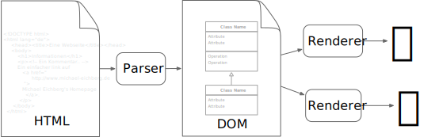

.. meta::
    :version: renaissance
    :author: Michael Eichberg
    :keywords: Web Programmierung, HTML
    :description lang=de: Einführung in HTML(5)
    :id: vorlesung-web-programmierung-html
    :first-slide: last-viewed
    :master-password: WirklichSchwierig!

.. include:: ../docutils.defs

.. class:: animated-logo

HTML(5)
================================================

*Eine Einführung in die grundlegenden Konzepte von HTML*

:Dozent: `Prof. Dr. Michael Eichberg <https://delors.github.io/cv/folien.de.rst.html>`__
:Kontakt: michael.eichberg@dhbw.de, Raum 149B
:Version: 2.1.4

.. supplemental::

    :Folien:

        |html-source|

        |pdf-source|

    :Fehler melden:
        https://github.com/Delors/delors.github.io/issues

.. class:: new-section transition-fade

Einführung
------------------------------------------------

HTML(5)
------------------------------------------------

.. class:: incremental-list

:Gegenstand:

    .. class:: list-with-explanations

    - Sprache zur Beschreibung der Darstellung von Inhalten (Markup Language), zwischen denen „navigiert“ werden kann (Hypertext).

      Ursprünglich war HTML ein Akronym für *HyperText Markup Language*; heutzutage wird HTML als Eigenname verwendet.
    - Auszeichnungssprache abgeleitet aus SGML (Standard Generalized Markup Language).

:Verwendung:

    - Webseiten
    - Progressive Web-Apps
    - Desktop Apps (z. B. mit Electron)

Ein einfaches HTML(5) Dokument
------------------------------------------------

.. code:: html
    :class: copy-to-clipboard
    :number-lines:
    
    <!DOCTYPE html>
    <html lang="de">
        <head><title>Eine Webseite</title></head>
        <body>
            <h1>Informationen</h1>
            
<!-- Ein Kommentar ... -->
                Ein einfacher Link auf:
                <a href="http://www.michael-eichberg.de">
                    Michael Eichberg's Homepage
                </a>.
            

        </body>
    </html>

.. supplemental::

    Im Folgenden werden wir uns mit den grundlegenden Konzepten von HTML beschäftigen und die wichtigsten Bestandteile von HTML-Dokumenten kennenlernen. Das Ziel ist es, ein Verständnis für HTML zu entwickeln, dass für die fundierte Entwicklung von Webseiten erforderlich sind.

HTML\ [#]_ - Historie
------------------------------------------------

.. module:: timeline
    :class: align-center

    {
        "class" : "HTML-Timeline",
        "spread" : "0.85",
        "data": [
            {"d":"...","t":"HTML 1.0"},
            {"d":"1995","t":"HTML 2.0"},
            {"d":"1997","t":"HTML 3.2 (3.0 wurde nie veröffentlicht)"},
            {"d":"1998","t":"HTML 4.0/CSS"},
            {"d":"2000","t":"XHTML (HTML 4 in XML)"},
            {"d":"2001","t":"XHTML 1.1"},
            {"d":"seit 2004","t":"HTML5 in Entwicklung"},
            {"d":"2018","t":"XHTML 1.0 und 1.1 - obsolet"},
            {"d":"seit 2019","t":"HTML(5) (W3C und WHATWG)"}
        ]
    }

:`WHATWG`:ab:: Web Hypertext Application Technology Working Group

.. [#] Im Folgenden bezeichnet HTML die HTML(5) Spezifikation (Living Standard).

HTML Universum
------------------------------------------------

Spezifikationen (siehe [#]_), die im Rahmen der Entwicklung von Webseiten/Webanwendungen relevant sind:

.. class:: incremental-list

- **CSS**: Cascading Style Sheets
- **JavaScript**: ECMAScript (Fetch API, :obsolete:`XMLHttpRequest`, ...)
- **DOM**: Document Object Model
- **Encoding**: Unicode
- **HTTP**: Hypertext Transfer Protocol
- **SVG**: Scalable Vector Graphics
- **MathML**: Mathematical Markup Language
- **WebAssembly**: Low-Level Bytecode
- ...

.. [#] https://spec.whatwg.org

HTML vs. XML Syntax vs. DOM
------------------------------------------------

Die HTML-Spezifikation definiert eine abstrakte Sprache zur Beschreibung von Dokumenten. XML und HTML sind konkrete Syntaxbeschreibungen dieser abstrakten Sprache.

.. class:: list-with-explanations incremental-list

- HTML ist eine Beschreibungssprache für entsprechende Dokumente.
- XML ist eine allg. Beschreibungssprache, die auch für HTML verwendet wurde. (MIME Type: ``application/xhtml+xml``)

  (Heutzutage wird XML zur Beschreibung von HTML-Dokumenten nicht mehr verwendet.)

- Das DOM (:eng:`Document Object Model`) ist die In-Memory Darstellung eines Dokuments.

  Das DOM ist (auch) eine API, um HTML-Dokumente zu manipulieren.

.. hint::
    :class: incremental

    Das DOM, die HTML-Syntax und die XML-Syntax können nicht alle denselben Inhalt darstellen.

.. supplemental::

    **Beispiele für Unterschiede**

    - Namespaces werden nicht von der HTML-Syntax unterstützt, aber sowohl vom DOM als auch der XML-Syntax unterstützt.
    - :html:`noscript` wird nur in HTML-Dokumenten unterstützt.
    - Kommentare, die :html:`-->` enthalten, werden nur vom DOM unterstützt; in einem HTML-Dokument beendet dies den Kommentar.

HTML in a Nutshell
------------------------------------------------

HTML-Dokumente bestehen aus einem Baum von Elementen und Text.

.. grid::

    .. cell:: width-60

        .. rubric:: HTML-Dokument

        .. code:: HTML
            :class: copy-to-clipboard
            :number-lines:

            <!DOCTYPE html>
            <html lang="de">
            <head><title>Eine Webseite</title></head>
            <body>
                <h1>Informationen</h1>
                
<!-- Ein Kommentar ... -->
                    Ein einfacher Link auf
                    <a href="
                       http://www.michael-eichberg.de
                    ">
                        Michael Eichberg's Homepage
                    </a>.
                

            </body>
            </html>

    .. cell:: width-40

        .. rubric:: DOM

        .. code:: html
            :number-lines:
            :class: incremental-code

            ├─DOCTYPE: html
            └─html lang="de"
                ├─head
                │ └─title
                │   └─#text: Eine Webseite
                ├─ #text: ⏎
                └─body
                  ├─ #text: ⏎␣␣␣␣
                  ├─ h1
                  ...

.. supplemental::

    Mehrere HTML-Dokumente bilden ggf. auf denselben DOM ab. Zum Beispiel werden die Tags als solches gar nicht abgebildet und wenn im HTML Code ein optionales (schließendes) Tag fehlt, dann ist dies im DOM nicht mehr ersichtlich.

HTML - Verarbeitung
------------------------------------------------

.. class:: exercises

Übung
--------

.. exercise:: Vertraut machen mit dem DOM

    1. Öffnen Sie eine Webseite (z. B. https://delors.github.io/web-html/folien.de.rst.html)
    2. Öffnen Sie die Entwicklerconsole Ihres Browsers
    3. Lassen Sie sich den Sourcecode anzeigen
    4. Vergleichen Sie den DOM mit dem Sourcecode

    .. solution::
        :pwd: GanzAnders

        Wie in dem Beispiel gut zu sehen ist, der HTML Code deutlich anders als der DOM. Der DOM wird durch das JavaScript auf der Webseite erstellt/manipuliert.

.. class:: new-section transition-fade

Aufbau von HTML-Dokumenten
------------------------------------------------

HTML-Dokumente
------------------------------------------------

Die Dokumente müssen aus den folgenden Teilen in der angegebenen Reihenfolge bestehen:

  - Optional ein einzelnes U+FEFF Zeichen (Byte-Order-Mark(BOM)).
  - Eine beliebige Anzahl von Kommentaren und ASCII-Whitespace.
  - Eine DOCTYPE-Deklaration: :html:`<!DOCTYPE html>`.
  - Eine beliebige Anzahl von Kommentaren und ASCII-Whitespace.
  - Das **Dokumentenelement** in Form eines ``html``-Elements\ [#]_.
  - Eine beliebige Anzahl von Kommentaren und ASCII-Leerzeichen.

  -- HTML-Spezifikation

.. [#] HTML ist nicht case-sensitive, d. h. die Tags ``html`` und ``HTML`` sind gleichwertig. Wir verwenden jedoch immer die Kleinschreibung.

Allgemeiner Aufbau von HTML Elementen
-------------------------------------

.. table::
    :class: booktabs incremental-table-rows
    :align: center

    +-------------+--------------------------+-----------+
    | *Start-Tag* | *Inhalt des Elements*    | *End-Tag* |
    +-------------+--------------------------+-----------+
    |                                                    |
    | .. code:: html                                     |
    |                                                    |
    |  <b>        Sehr Wichtig...     </b>               |
    +-------------+--------------------------+-----------+
    | Element                                            |
    +-------------+--------------------------+-----------+

.. warning::
    :class: incremental

    Die Spezifikation verlangt nicht in allen Fällen ein Start und Endtag. Es ist jedoch eine gute Praxis, diese immer zu verwenden, wenn ein Endtag möglich ist.

.. container:: incremental

    Im Fall von Elementen ohne Endtag (z. B. :html:`<wbr>`) darf auch keines hinzugefügt werden!

.. supplemental::

    **Beispiel**

    .. code:: html
        :number-lines:
        :class: copy-to-clipboard

        <!DOCTYPE HTML><head>
                <title>Hello</title>
            </head>
            <body>
                
Welcome to this example.

            </body>
        </html>

    Ist ein gültiges Dokument. Es ist jedoch **keine** gute Praxis (hier wurde das Start-Tag des :html:`html` Elements weggelassen).

Typen von HTML Elementen
---------------------------

Sechs Typen von HTML-Elementen werden unterschieden:

.. class:: incremental-list

:*Void elements*: :html:`area`, :html:`base`, :html:`br`, :html:`col`, :html:`embed`, :html:`hr`, :html:`img`, :html:`input`, :html:`link`, :html:`meta`, :html:`source`, :html:`track`, :html:`wbr`
:*Raw text elements*: :html:`script`, :html:`style`
:*Escapable raw text elements*: :html:`textarea`, :html:`title`
:Das *template* Element: :html:`template`
:*Foreign elements*: Elemente aus dem MathML- und SVG-Namensraum.
:*Normal elements*: **Alle weiteren HTML Elemente** sind *normale Elemente*.

Attribute in HTML
---------------------------------------

Attribute liefern Informationen über das Element.

.. table::
    :class: booktabs
    :align: center

    +--+------------------------+--------------+
    | *Start-Tag*                              |
    +--+------------------------+--------------+
    |                                          |
    | .. code:: html                           |
    |                                          |
    |  <a    class="obsolete" href="#top" >... |
    +--+------------------------+--------------+
    |  | Attribute              |              |
    +--+------------------------+--------------+

.. class:: incremental-list list-with-explanations

- Attribute kommen nur beim Start-Tag vor.
- Attribute (in HTML) können, müssen aber kein Wert haben (Boolsche Attribute).
- Attributwerte sollten in Anführungszeichen (:eng:`quoted`) (entweder: ``"`` oder ``'``) stehen, müssen aber nicht.

  Werte ohne Anführungszeichen dürfen keine Leerzeichen oder Anführungszeichen enthalten.

  Welche Anführungszeichen verwendet werden, ist egal. Es ist jedoch eine gute Praxis, immer die gleichen Anführungszeichen zu verwenden.\ [#]_

- Konkrete Attributwerte aus der HTML-Spezifikation sind *case-insensitive*; andere Werte sind es nicht.

.. supplemental::

  Im Allgemeinen sollten Attributwerte klein geschrieben werden. Selektoren in CSS und JavaScript sind *case-sensitive*.

  Z. B. ist :html:`<input type="text">` und :html:`<input type="TEXT">` gleichwertig, aber :html:`
` und :html:`
` nicht!

  .. [#] Sollte man innerhalb eines Attributwertes Anführungszeichen verwenden wollen, dann sind HTML Entities notwendig: ``&quot;`` für ``"`` und ``&#39;`` für ``'``

HTML-Grundgerüst
------------------------------------------------

.. code:: HTML
    :number-lines:
    :class: copy-to-clipboard incremental-code

    <!DOCTYPE HTML>
    <html lang="de">
        <head>
        ... Metadaten, Skripte, Stylesheets, etc. ...
        </head>

        <body>
        ... das Dokument ...
        </body>
    </html>

HTML :html:`<head>` Element - „obligatorische“ Elemente
-----------------------------------------------------------------

Im Head sollten immer die folgenden Informationen deklariert werden:

:Titel: Der Titel des Dokuments mit Hilfe des :html:`<title>...</title>` elements
:Zeichensatz: Der verwendete Zeichensatz mit Hilfe des passenden meta elements: :html:`<meta charset="utf-8">`
:Viewport: Konfiguration des *Viewports*\ [#]_ (insbesondere für mobile Geräte relevant): :html:`<meta name="viewport" content="width=device-width, initial-scale=1.0">`

.. [#] Der *Viewport* (:ger:`Ansichtsbereich`) des Browsers ist der Bereich des Fensters, in dem der Webinhalt zu sehen ist.

.. supplemental::

    Insbesondere Mobilgeräte haben oft entweder eine geringere Auflösung als Desktop-Computer oder verwenden HiDPI Screens. Beides führt dazu, dass die Webseiten nicht wie gewünscht aussehen. In diesem Fall verwenden die Browser für die Webseiten einen virtuellen Viewport mit (z. B.) 960px und skalieren dann die Seite (z. B.) auf 390px herunter. Wenn dieses Verhalten nicht gewünscht ist — z. B. weil die Seite :eng:`responsive` ist oder von vorneherein auf mobile Endgeräte ausgerichtet ist — dann ist auf jeden Fall eine *Viewport* Konfiguration notwendig.

    .. csv-table::
        :header: "Device", "Viewport Size (width x height)", "Device Resolution (width x height)"

        iPhone 12, 390 x 844, 1170 x 2532
        iPhone 12 Mini, 360 x 780, 1080 x 2340
        iPhone 12 Pro, 390 x 844, 1170 x 2532
        iPhone 12 Pro Max, 428 x 926, 1248 x 2778

    Siehe: https://experienceleague.adobe.com/en/docs/target/using/experiences/vec/mobile-viewports.html?lang=de für weitere Details.

HTML :html:`<head>` Element - weitere Elemente
-----------------------------------------------------------------

Im Head können weitere Informationen und Pragmas deklariert werden bzw. sollten dort deklariert werden, wenn sie benötigt werden:

.. story::

    .. class:: incremental-list

    :Skripte: :html:``

    :CSS: Mittels :html:`<link rel="stylesheet" href="style.css">` oder :html:``

    :*Favorite-Icon*: :html:`<link rel="icon" type="image/png" href="/img/icon.png" />`

    :Pragmas:

        ``http-equiv`` ≘ *HTML equivalent*; d. h. die Informationen könnte auch im HTTP Header stehen.

        - :html:`<meta charset="utf-8">` (alt)
        - :html:`<meta http-equiv="Content-Security-Policy" content="default-src https:">`

          .. container:: incremental

              Äquivalente HTTP Header Definition:

              .. code:: http

                Content-Security-Policy: default-src https:

    :Benannte Metadaten: :html:`<meta name="author" content="Michael Eichberg">`

.. supplemental::

    `Content Security Policies <https://developer.mozilla.org/en-US/docs/Web/HTTP/Headers/Content-Security-Policy>`__

    Pragmas sind Anweisungen, die die Steuerung/Verarbeitung beeinflussen.

Semantisches vs. „generisches“ HTML
-----------------------------------------------------------

.. grid::

    .. cell:: width-50

        .. rubric:: Semantisches HTML

        - Verwendung von HTML Elementen, die die Bedeutung des Inhalts klar machen.
        - Bessere Zugänglichkeit
        - Bessere Suchmaschinen-Optimierung

        .. container:: incremental

            **Beispiel Elemente**

            :html:`<header>`, :html:`<footer>`, :html:`<nav>`, :html:`<article>`, :html:`<section>`, :html:`<aside>`, :html:`<main>`, :html:`<figure>`, :html:`<address>`, :html:`<em>`, :html:`<s>`, ...

    .. cell:: width-50 incremental

        .. rubric:: Semantikfreies HTML

        - Verwendung von :html:`
` und :html:`` Elementen, um den Inhalt zu strukturieren.
        - Keine klare Bedeutung des Inhalts.

Semantisches vs. „generisches“ HTML - Beispiel
---------------------------------------------------------------------

.. grid::

    .. cell:: width-50

        .. code:: html
            :number-lines:
            :class: copy-to-clipboard incremental-code#1

            

                Zwei Wörter
                

                    <a>Ein Wort</a><a>Ein Wort</a>
                

            

            

                

                    
Viele Wörter

                

                

                    
Erste Worte

                    
DaDaDa

                    
BlaBlaBla

                

            

            
Alle Worte

    .. cell:: width-50

        .. code:: html
            :number-lines:
            :class: copy-to-clipboard incremental-code#1

            <header>
                <h1>Zwei Wörter</h1>
                <nav>
                    <a>Ein Wort</a><a>Ein Wort</a>
                </nav>
            </header>
            <main>
                <header>
                    <h1>Viele Wörter</h1>
                </header>
                <section>
                    <h2>Erste Worte</h2>
                    
DaDaDa

                    
BlaBlaBla

                </section>
            </main>
            <footer>
Alle Worte
</footer>

.. supplemental::

    Semantische Informationen im DOM zu haben, ist insbesondere für die Barrierefreiheit notwendig.

    Alternativ zur Verwendung von semantischen Elementen können auch generische Attribute mit dem :html:`role` Attribute versehen werden, um die Bedeutung des Elements zu spezifizieren: :html:`
...
`

.. class:: center-content no-title

HTML dient der Strukturierung von Inhalten
------------------------------------------------

.. class:: dhbw

1. Verwenden Sie HTML zur Strukturierung von Inhalten, und nicht, um das Aussehen der Inhalte zu definieren.

2. Das Aussehen ist Sache von CSS.

Strukturierung von Dokumenten
------------------------------------------------

.. class:: incremental-list list-with-explanations

- :html:`header`, :html:`footer`, :html:`nav`, :html:`article`, :html:`section`, :html:`aside`, :html:`main`, :html:`figure`, :html:`address`, ...

  In Hinblick auf die konkrete Semantik eines Elements gibt es Unterschiede wo und wie oft diese verwendet werden.

  Ein :html:`footer` Element innerhalb eines :html:`article` Elements hat eine andere Bedeutung als ein :html:`footer` Element auf oberster Ebene.

  Ein :html:`main` Element sollte nur einmal pro Dokument verwendet werden.
- Überschriften: :html:`h1`, :html:`h2`, :html:`h3`, :html:`h4`, :html:`h5`, :html:`h6`

  Überschriften sollten in der richtigen Reihenfolge verwendet werden.
- Überschriften gruppiert mit zugehörigem Inhalt: :html:`hgroup`.

.. supplemental::

  Das :html:`hgroup`-Element stellt eine Überschrift und den zugehörigen Inhalt dar. Dient dazu eine Überschrift mit einem oder mehreren p-Elementen zu gruppieren. Zum Beispiel für eine Unterüberschrift oder einen alternativen Titel.

Attribute
------------------------------------------------

.. class:: incremental-list

:Boolsche Attribute: sind wahr, wenn diese angegeben sind und falsch andernfalls.

    Z. B. :html:`<input id="the-checkbox" type="checkbox" checked>`.

:Aufgezählte Attribute (`enumerated values`:eng:): definieren eine begrenzte Anzahl von gültigen Werten sowie einen Default, der verwendet wird, wenn kein Wert angegeben ist, aber das Attribut verwendet wird.

:Globale Attribute:

    können für jedes Element verwendet werden; sind aber nicht immer sinnvoll.\ [#]_

    Globale HTML-Attribute sind Z. B. :html:`id`, :html:`class`, :html:`data-*`, :html:`autofocus`, :html:`role`, :html:`lang`, :html:`style`, :html:`popover`, :html:`tabindex`.

    .. deprecated::

        Event Handler Attribute: :html:`onclick`, :html:`onclose`, ...

.. [#] `Globale Attribute <https://developer.mozilla.org/en-US/docs/Web/HTML/Global_attributes#list_of_global_attributes>`__

.. supplemental::

    Boolsche Attribute sollten in JavaScript durch Hinzufügen bzw. Löschen gesetzt werden (und nicht durch die Manipulation des Wertes eines Attributs).

    .. code:: JavaScript
        :class: copy-to-clipboard
        :number-lines:

        const checkbox = document.getElementById("the-checkbox");
        checkbox.removeAttribute("checked");
        checkbox.setAttribute("checked");

.. supplemental::

    Der Wert eines Attributs kann über mehrere Zeilen gehen solange diese keine Anführungszeichen enthalten. Zeilenumbrüche und Einrückungen (mit Tabulatoren (⇥)) werden dabei automatisch gefiltert.

    Zum Beispiel kann der ``content``-Wert des ``meta``-Elements wie folgt geschrieben werden:

    .. code:: html
        :class: copy-to-clipboard

        <meta name="author" content="
        ⇥ ⇥Michael Eichberg
        ⇥ ⇥Professor
        ">

    Dies ist äquivalent zu:

    .. code:: html
        :class: copy-to-clipboard

        <meta name="author" content="Michael Eichberg Professor">

Ausgewählte globale Attribute
------------------------------------------------

.. story::

    .. class:: incremental-list

    :`id`:html::

        .. class:: list-with-explanations

        - verwendet, um ein Element eindeutig zu identifizieren

          (Welches man in CSS oder JavaScript per Selektor referenzieren kann.)
        - als Ziel von Hyperlinks (:html:`<a href="#id">`)
        - im Rahmen der Unterstützung von Barrierefreiheit
        - der Wert ist *case-sensitive*

        Best Practice: Kleinbuchstaben und Bindestriche verwenden (Unterstriche sind erlaubt aber im Zusammenhang mit CSS nicht optimal).

    :`class`:html::

        - das ``class``\ -Attribut ermöglicht es Elemente mit CSS und JavaScript anzusprechen
        - dient keinem anderen Zweck in HTML
        - wird sehr häufig von Frameworks und Bibliotheken verwendet

    :`style`:html:: Das ``style``-Attribut ermöglicht die (ad-hoc) Anwendung von Inline-Styles auf das entsprechende Element (nicht empfohlen).

    :`data-*`:html:: Das ``data-*``-Attribut ermöglicht es, benutzerdefinierte Daten an das Element zu binden, die von JavaScript verwendet werden können. ``*`` kann ein beliebiger Name sein, aber nicht ``xml`` oder ``:``  enthalten.

HTML - logische Gruppierung von Text
------------------------------------------------

.. story::

    .. class:: incremental-list dd-margin-left-6em

    :Paragraphen: :html:`
Inhalt
`

    :Zitate: :html:`<blockquote>` und :html:`<q>` (für kurze Zitate innerhalb eines Absatzes)

        Das Inline-Zitat-Element :html:`<q>` fügt der Sprache entsprechende Anführungszeichen hinzu.

        **Beispiel**

        .. class:: columns incremental-list

        - .. raw:: html

                    

                    <q lang="de">Ein Zitat</q> (deutsch)
                    

                    <q lang="en">A quote</q> (englisch)

        - .. code:: html

                    <q lang="de">Ein Zitat</q>

                    <q lang="en">A quote</q>

    :Betonung: :html:`<em>` (:eng:`emphasized`) und :html:`<strong>`

    :Randbemerkungen: :html:`<small>` - für Randbemerkungen und Kleingedrucktes (d. h. :html:`small` steht nicht für unwichtige(re)n Text oder die Schriftgröße)

    :Veraltet bzw. nicht mehr korrekt: :html:`<s>`

    :Zitierung: :html:`<cite>` - für den **Titel** eines Werkes oder einer Publikation

    :Definitionen: :html:`<dfn [title="der definierte Begriff"]>` - für die Definition eines Begriffs

    :Abkürzungen: :html:`<abbr title="HyperText Markup Language">HTML</abbr>` - für Abkürzungen

    :Zeitangaben: :html:`<time datetime="2021-10-01">1. Oktober 2021</time>` - für Zeitangaben

       :html:`datetime` dient der Zeitangabe in einem maschinenlesbaren Format (z. B. für Suchmaschinen)

    :Code: :html:`<code>` - für Code; für das Darstellen von Code-Beispielen wird :html:`code` häufig mit :html:`<pre>` kombiniert; die Sprache des Codes wird dann über ein :html:`class` Attribute spezifiziert (z. B. :html:`<pre><code class="language-java">...</code></pre>`)

    :Variablen: :html:`<var>` - für Variablen in mathematischen oder Programmierkontexten

    :(Tastatur-)Eingaben: :html:`<kbd>` - für Tastatureingaben oder andere Benutzereingaben

        .. code:: html

            Drücken Sie <kbd>cmd</kbd> + <kbd>c</kbd> zum Kopieren.

    :Hoch-/Tiefstellung: :html:`` und :html:`` - für Hoch- und Tiefstellung, die nicht typographischen Zwecken dient, sondern inhaltlichen Zwecken.

        .. code:: html

            H2O steht für Wasser.

    :Text mit abweichender Bedeutung: :html:`<i>` - Text, der von normaler Prosa abweicht wie z. B. eine taxonomische Bezeichnung, ein technischer Begriff, ...

        .. code:: html

            In der Biologie gehört der Mensch zur Gattung <i>Homo</i>.

    :Text mit erhöhter Aufmerksamkeit: :html:`<b>` - Text, der erhöhte Aufmerksamkeit erfordert, aber nicht unbedingt betont werden muss; z. B. Schlüsselwörter in einem Artikel.

        .. code:: html

            
Das <b>Wetter</b> ist heute schön.

    :Text mit erhöhter Bedeutung: :html:`<mark>` - Text, der hervorgehoben werden soll, z. B. Suchergebnisse.

.. supplemental::

    Es gibt weitere Elemente, die für spezielle Anwendungsfälle verwendet werden können. Siehe `WHATWG <https://html.spec.whatwg.org/multipage/text-level-semantics.html>`__.

HTML - physische Auszeichnung von Text
------------------------------------------------

.. class:: incremental-list

:Vorformatierter Text: :html:`<pre>...</pre>` - für Text, der so angezeigt werden soll, wie er geschrieben wurde.

:Zeilenumbrüche: :html:` ` - für Zeilenumbrüche, die inhärenter Teil der Daten sind wie zum Beispiel bei Adressen. D. h. sollte nicht innerhalb von Text verwendet werden!

:Optionale Zeilenumbrüche: :html:`<wbr>` (:eng:`word break opportunity`) - ein optionaler Zeilenumbruch

    Beispiel:

    .. code:: html

        
 Er schrie:
            <q lang="de">Lasst<wbr>Mich<wbr>In<wbr>Ruhe!</q>
        

HTML - :html:`` und :html:`
`
------------------------------------------------

- :html:`` und :html:`
` sind generische Container-Elemente, die verwendet werden, um Text oder andere Elemente zu gruppieren.
- :html:`` ist ein Inline-Element
- :html:`
` ist ein Block-Element
- beide werden häufig verwendet, um CSS-Klassen zuzuweisen, um den Inhalt zu gruppieren oder um den Inhalt zu manipulieren.

HTML - :html:`<data>`
------------------------------------------------

- Das :html:`<data>`-Element ermöglicht es, maschinenlesbare Daten an ein Element zu binden, die dann von JavaScript verwendet werden können.
- Die maschinenlesbaren Daten werden im :html:`value` Attribut gespeichert.

  .. code:: html

    <data value="8">Acht</data>

HTML - Links
------------------------------------------------

.. story::

  .. class:: incremental-list

  - Hyperlinks werden mit dem :html:`<a>` Element erstellt.
  - Der :html:`href`-Attribut enthält die Adresse des Ziels (innerhalb des gleichen Dokuments, auf einer anderen Webseite, per E-Mail, ...)

    .. code:: html
      :number-lines:

      <a href="https://www.dhbw-mannheim.de">DHBW Mannheim</a>
      <a href="#teachers">Unsere Lehrenden</a>
      <a href="mailto:michael.eichberg@dhbw.de">E-Mail: Michael Eichberg</a>

    .. container::

      1. Externer Link
      2. Interner Link (:eng:`link fragment identifier`) auf ein Element mit der ID ``teachers``
      3. E-Mail Link - kann ergänzt werden durch ``subject`` und ``body`` Parameter innerhalb des :html:`href` Attributs.
  - Das :html:`target`-Attribut ermöglicht die Definition des Browsing-Kontextes für die Link-Navigation (und die Formularübermittlung).

    .. compound::
        :class: font-size-90

        .. code:: html
            :number-lines:

            <a target="_blank" href="https://www.dhbw-mannheim.de">DHBW Mannheim</a>
            <a target="_self" href="https://www.dhbw-mannheim.de">DHBW Mannheim</a>
            <a target="_top" href="https://www.dhbw-mannheim.de">DHBW Mannheim</a>
            <a target="_parent" href="https://www.dhbw-mannheim.de">DHBW Mannheim</a>
            <a target="dhbw" href="https://www.dhbw-mannheim.de">DHBW Mannheim</a>

        1. Öffnet den Link in einem neuen Fenster oder Tab
        2. Öffnet den Link im gleichen Browsing-Kontext
        3. Öffnet den Link im obersten Browsing-Kontext
        4. Öffnet den Link im übergeordneten Browsing-Kontext
        5. Öffnet den Link im Browsing-Kontext mit dem Namen `dhbw` (Beispiel: :raw-html:`<a target="dhbw" href="https://www.dhbw-mannheim.de">DHBW Mannheim</a>`)

        :html:`_self`, :html:`_top` und `_parent` sind relativ zum aktuellen Browsing-Kontext und unterscheiden sich nur, wenn die Seite in einem Frame oder einem :html:`<iframe>` angezeigt wird.

  - Das :html:`rel`-Attribut legt die Art des Links fest und definiert die Beziehung zwischen dem aktuellen Dokument und der Ressource, auf die der Hyperlink verweist. (Z. B. :html:`rel="license"`, :html:`rel="author"` oder :html:`rel="noopener"`; siehe `MDN rel attribute <https://developer.mozilla.org/en-US/docs/Web/HTML/Attributes/rel>`__)

.. supplemental::

    Durch die Zuweisung zu einem Browsing-Kontext kann verhindert werden, dass dieselbe Seite X-mal geöffnet wird, wenn ein Nutzer auf den Link klickt.

HTML - Listen
------------------------------------------------

Drei Arten von Listen werden unterstützt, die beliebig verschachtelt werden können:

.. story::

    .. class:: incremental-list

    - Definitionslisten: :html:`<dl>`

      .. class:: columns

      - .. code:: html

                <dl>
                    <dt>Erster Begriff</dt>
                    <dd>Erklärung des 1. Begriffs</dd>
                    <dt>Zweiter Begriff</dt>
                    <dd>Erklärung des 2. Begriffs</dd>
                </dl>

      - .. raw:: html

                <dl>
                    <dt style="font-weight:bold">Erster Begriff</dt>
                    <dd style="margin-left:3em">Erklärung des 1. Begriffs</dd>
                    <dt style="font-weight:bold">Zweiter Begriff</dt>
                    <dd style="margin-left:3em">Erklärung des 2. Begriffs</dd>
                </dl>

    - Geordnete Listen: :html:`<ol [reversed] [start=<NO>]>`

      .. class:: columns 

      - .. code:: html

                <ol start="0">
                    <li>Erster Punkt</li>
                    <li>Zweiter Punkt</li>
                    <li value="10">Dritter Punkt</li>
                </ol>

      - .. raw:: html

                <ol start="0">
                    <li>Erster Punkt</li>
                    <li>Zweiter Punkt</li>
                    <li value="10">Dritter Punkt</li>
                </ol>

    - Ungeordnete Listen: :html:`<ul>`

      .. class:: columns

      - .. code:: html

                <ul>
                    <li>Erster Punkt</li>
                    <li>Zweiter Punkt</li>
                </ul>

      - .. raw:: html

                <ul>
                    <li>Erster Punkt</li>
                    <li>Zweiter Punkt</li>
                </ul>

HTML - Navigation
------------------------------------------------

- Das :html:`<nav>` Element wird verwendet, um Navigationslinks zu gruppieren.
- Insbesondere für Screenreader und die Suchmaschine relevant.

.. compound::
    :class: incremental

    .. rubric:: Beispiel

    .. code:: HTML
        :number-lines:

        <nav id="ld-menu">
            <button type="button"
                    id="ld-slides-button"
                    aria-label="show slides"></button>
            <button type="button"
                    id="ld-slides-with-nr-button"
                    aria-label="show slides with numbers"></button>
            <button type="button"
                    id="ld-help-button"
                    aria-label="show help"></button>
        </nav>

HTML - Tabellen
------------------------------------------------

.. story::

    Verwendet für die Darstellung von tabellarischen Daten mit Zeilen und Spalten.

    .. attention::
        :class: incremental

        Die Verwendung von :html:`<table>` sollte sich nach dem Inhalt richten!

        Tabellen sollten nicht zum Layout von Webseiten verwendet werden.

    .. compound::
        :class: incremental

        Aufbau von Tabellen:

        .. grid::

            .. cell::

                .. code:: html
                    :number-lines:

                    <table>
                        <caption>Logische Operation</caption>
                        <thead>
                            <tr><th>not xor</th><th>1</th><th>0</th></tr>
                        </thead>
                        <tbody>
                            <tr><th>1</th><td>1</td><td>0</td></tr>
                            <tr><th>0</th><td>0</td><td>1</td></tr>
                        </tbody>
                        <tfoot></tfoot>
                    </table>

            .. cell::

                .. raw:: html

                    <table>
                        <caption>Logische Operation</caption>
                        <thead>
                            <tr>
                                <th>not xor</th>
                                <th>1</th>
                                <th>0</th>
                            </tr>
                        </thead>
                        <tbody>
                            <tr>
                                <th>1</th>
                                <td>1</td>
                                <td>0</td>
                            </tr>
                            <tr>
                                <th>0</th>
                                <td>0</td>
                                <td>1</td>
                            </tr>
                        </tbody>
                        <tfoot></tfoot>
                    </table>

    .. class:: incremental

    - Zellen, die über mehrere Spalten oder Zeilen gehen können mit Hilfe von :html:`colspan` und :html:`rowspan` Attributen definiert werden.

    - Spalten und Zeilen können mit Hilfe von :html:`<col>` und :html:`<colgroup>` Elementen definiert werden.

HTML - Bilder
------------------------------------------------

.. story::

    .. class:: incremental-list

    - Bilder werden mit dem :html:`` Element eingebunden.

      .. code:: html

            

    - Das :html:`src`-Attribut enthält die Adresse des Bildes.
    - Das :html:`alt`-Attribut enthält eine Beschreibung des Bildes, die angezeigt wird, wenn das Bild nicht geladen werden kann.
    - Die :html:`width` und :html:`height`-Attribute können und sollten verwendet werden, um die ursprünglich reservierte Größe des Bildes festzulegen.
    - Lazy loading ist durch die Verwendung des :html:`loading` Attributs möglich (:html:`loading="lazy"`).

    - Folgende Bildformate werden breit unterstützt: ``jpg``, ``png``, ``gif``, ``svg`` und ``webp``.
    - Responsive Images werden über das :html:`srcset` Attribut unterstützt:

      .. code:: html
        :number-lines:

        

    .. compound::
        :class: incremental

        Weitere `Responsive Features <https://web.dev/learn/design/responsive-images>`__) werden mittels CSS ermöglicht. Um zum Beispiel zu verhindern, dass ein Bild größer als eine Textzeile wird, kann folgendes CSS definiert werden:

        .. code:: css

            img {
                max-inline-size: 100%;
                block-size: auto;
            }

HTML - Formulare
------------------------------------------------

.. story::

    .. compound::
        :class: incremental

        Formulare werden mit dem :html:`<form>` Element erstellt.

        - :html:`action` enthält die Adresse, an die die Formulardaten gesendet werden.
        - :html:`method` definiert die Methode, die zum Senden der Daten verwendet wird (:html:`GET` oder :html:`POST`).
        - :html:`name` setzt den Namen des Formulars.
        - :html:`target` enthält den Namen des Browsing-Kontexts, in dem die Antwort angezeigt wird.
        - :html:`autocomplete` ermöglicht das automatische Ausfüllen von Formularen.
        - :html:`novalidate` verhindert die Validierung der Formulardaten durch den Browser.
        - :html:`accept-charset` definiert die Zeichencodierung, die zum Senden der Formulardaten verwendet wird.

    .. compound::
        :class: incremental

        Formularelemente werden mit dem :html:`<input>` Element erstellt.

        - :html:`type` definiert den Typ des Formularelements.
        - :html:`name` definiert den Namen des Formularelements.
        - :html:`value` definiert den Wert des Formularelements.
        - :html:`placeholder` definiert den Platzhaltertext des Formularelements.
        - :html:`required` definiert, ob das Formularelement erforderlich ist.
        - :html:`disabled` definiert, ob das Formularelement deaktiviert ist.
        - :html:`autofocus` definiert, ob das Formularelement den Fokus erhält.

    .. compound::
        :class: incremental

        .. rubric:: Beispiel

        .. grid::

            .. cell:: width-60

                .. code:: html

                    <form method="GET"
                          name="Folienauswahl">
                      <label for="slide">Folie:</label>
                      <select name="ld-slide-no" id="slide">
                        <option value="8">Elemente</option>
                        <option value="10">Attribute</option>
                        <option value="29">Formulare</option>
                      </select>
                      <input type="submit" value="Submit">
                    </form>

            .. cell:: width-40

                .. raw:: html

                    <form method="GET" name="Folienauswahl">
                      <label for="slide">Folie:</label>
                      <select name="ld-slide-no" id="slide">
                         <option value="8">Elemente</option>
                         <option value="10">Attribute</option>
                         <option value="29">Formulare</option>
                      </select>
                      

                      <input type="submit" value="Submit">
                      

                    </form>

.. supplemental::

    Für weitere Informationen bzgl. Formulare siehe `MDN Web Docs <https://developer.mozilla.org/en-US/docs/Web/HTML/Element/form>`__ oder `Web.dev <https://web.dev/learn/html/forms>`__.

HTML - Zusammenfassungen und Details
------------------------------------------------

Anzeigen von optionalen Details mit Hilfe des :html:`
` Elements.

.. grid::

    .. cell:: width-50

        .. code:: html
            :number-lines:

            

                
Abstract

                
Password guessing ...

            

    .. cell:: width-50

        .. raw:: html

            

                Geschlossen - Details werden erst nach einem Klick angezeigt:

                

                    
Abstract

                    
Password guessing ...

                

            

            

                Offen - Details werden direkt angezeigt:

                

                    
Abstract

                    
Password guessing ...

                

            

HTML - Dialoge
------------------------------------------------

Dialoge werden mit Hilfe des :html:`<dialog>` Elements erstellt. Dialoge sind spezielle Fenster, die den Fokus auf sich ziehen und die Interaktion mit dem Rest der Seite unterbrechen - falls diese modal sind.

.. grid::

    .. cell:: width-50

        Beispiel\ [#]_:

        .. code:: html
            :number-lines:

            <dialog>
                <h1>Dialog</h1>
                
Dialog Inhalt

                <button formmethod="dialog">
                OK
                </button>
                <button autofocus>Abbrechen</button>
            </dialog>

    .. cell:: width-50

        .. raw:: html

            <button style="padding:0.5em; border-radius:0.2em;" onclick="document.querySelector('#html-dialog-example').showModal()">Open Dialog</button>

            <dialog id="html-dialog-example" class="ld-dialog" style="color:white;padding:1em">
                <header>Dialog</header>
                
Dialog Inhalt

                <button formmethod="dialog" tabindex=2 onclick="document.querySelector('#html-dialog-example').close()">OK</button>
                <button autofocus tabindex=1 onclick="document.querySelector('#html-dialog-example').close()">Abbrechen</button>
            </dialog>

.. [#]  :peripheral:`JavaScript Code zum Öffnen des Dialogs wird hier nicht gezeigt.`

HTML Entities
------------------------------------------------

Ausgewählte Zeichen können (in manchen Kontexten) nur durch HTML Entities dargestellt werden:

- ``<`` durch &lt; oder &#60; (:raw-html:`&#60;`)

- ``>`` durch: &gt; oder &#62;  (:raw-html:`&#62;`)

- ``&`` durch: &amp; oder &#38;  (:raw-html:`&#38;`)

- ``"`` durch: &quot; oder &#34;  (:raw-html:`&#34;`)

- ``␣`` durch: &nbsp;  (:raw-html:`&nbsp;`)

.. container:: footer-left  far-smaller

    `Liste benannter Zeichen <https://html.spec.whatwg.org/multipage/named-characters.html#named-character-references>`__

    Die numerischen Werte sind `Unicode Code Points <https://en.wikipedia.org/wiki/List_of_Unicode_characters>`__ (d.h. ``#60`` ist  der Unicode Code Point von ``<``).

Eingebettet Webseiten
------------------------------------------------

Das :html:`<iframe>` Element ermöglicht das Einbetten von Webseiten in Webseiten:

.. grid::

    .. cell:: width-60

        .. code:: html
            :number-lines:

            <iframe src="https://www.dhbw-mannheim.de"
                    width="600"
                    height="400">
                iframes are not supported</iframe>

            <iframe srcdoc="
                        <h1>HTML</h1>
                        
HTML is a markup language.
"
                    width="600"
                    height="400">
                iframes are not supported
            </iframe>

    .. cell:: width-40

        .. module:: embedded-iframe

            <iframe width="100%"
                    style="
                        border:1px solid black;
                        box-shadow: 2px 2px gray"
                    srcdoc='
                    <head>{{ld-embedded-iframe.head.frag.html}}</head>
                    <body>
                        <h1>HTML</h1>
                        
HTML is a markup language.

                    </body>
                    '>
                iframes are not supported
            </iframe>

HTML Erweiterbarkeit
------------------------------------------------

.. class:: incremental-list

- Hinzufügen von Metadaten (:html:`<meta name="" content="">`)
- :html:`class` Attribute
- „Custom Elements“ (z. B. :html:`<my-element>`)
- :peripheral:`Autoren können APIs mit Hilfe des JavaScript-Prototyping-Mechanismus erweitern`

Veraltetes - aber noch unterstütztes - HTML
------------------------------------------------

.. class:: incremental-list

- keine :html:`border` Attribute auf :html:`` Elementen
- keine :html:`charset` Attribute auf :html:`<script>` Elementen (UTF-8 ist gefordert)
- keine :html:`language` Attribute auf :html:`<script>` Elementen (JavaScript ist der Standard)
- kein :html:`type` Attribute auf :html:`<style>` Elementen (``text/css`` ist der Standard)

HTML - „nicht mehr unterstützt (Stand April 2024)“
--------------------------------------------------------------

.. class:: columns

- Nicht mehr unterstützte Elemente (Auswahl):

  - :html:`<big>`
  - :html:`<blink>`
  - :html:`
`
  - :html:``
  - :html:`<marquee>`
  - :html:`<nobr>`
  - :html:`<tt>`
  - :html:`<menuitem>`
  - ...

- Nicht mehr unterstützte Attribute (Auswahl):

  - :html:`align` bei :html:`<h1>` bis :html:`<h6>` Elementen
  - :html:`bgcolor` bei :html:`<body>` Elementen
  - :html:`charset` bei :html:`<a>` und :html:`<link>` Elementen
  - :html:`name` bei :html:``, :html:`<option>`, ... Elementen

Barrierefreiheit ist verpflichtend
--------------------------------------

.. epigraph::

    [...] Webseiten, Onlineshops, Apps, Onlinebuchungs- und Ticketdienste, Fahrkartenautomaten, Selbstbedienungs- und Zahlungsterminals, Telefon- und Messenger-Dienstleistungen sowie E-Book-Reader ab Juni 2025 barrierefrei sein müssen. Denn am 28. Juni 2025 tritt das Barrierefreiheitsstärkungsgesetz (BFSG)\ [#]_ in Kraft. [...]

    .. container:: incremental

        [...] Diese [die Barrierefreie-Informationstechnik-Verordnung (BITV 2.0)] regelt, wie Behörden und Ministerien Webseiten gestalten müssen. In Paragraf 3 Absatz 2 ist festgelegt, dass diese dann als barrierefrei anzusehen sind, wenn sie Normen erfüllen, die im Amtsblatt der EU genannt werden – beispielsweise die EN 301 549 oder die Web Content Accessibility Guidelines 2.1 (WCAG) des World Wide Web Consortiums.

    .. container:: incremental

        [...] Verstöße gegen das Barrierefreiheitsstärkungsgesetz [...] muss mit einem Bußgeld bis zu 100.000 Euro rechnen. [...]

    -- Sept. 2024; `Golem.de - Deutsche Webseiten sind versetzungsgefährdet <https://www.golem.de/news/barrierefreiheit-deutsche-webseiten-sind-versetzungsgefaehrdet-2409-188655.html>`__

.. [#] https://bfsg-gesetz.de/

Web Content Accessibility Guidelines 2.1 (WCAG)
---------------------------------------------------------------

Einige Anforderungen\ [#]_:

.. rubric:: „Harte“ Kriterien

.. class:: incremental-list

- die Schrift auf einer Website wenigstens 16 Pixel groß und
- Zeilen nicht mehr als 80 Zeichen lang sein sollen.
- Der Abstand dazwischen soll das 1,5-Fache ihrer Höhe betragen.
- Um einen ausreichenden Kontrast zu erzeugen, muss die Schrift wenigstens 4,5-mal dunkler sein als der Hintergrund.
- Klickflächen schließlich müssen wenigstens 44 x 44 Pixel groß sein.

.. rubric:: „Weiche“ Kriterien

.. class:: incremental-list

- Starke Animationen sind auf barrierefreien Seiten tabu.
- das Layout der Seite soll außerdem einfach, logisch und auf jeder Unterseite einheitlich aufgebaut sein.

.. [#] Sept. 2024; `Golem.de - So setzen gute Webdesigner Barrierefreiheit um
 <https://www.golem.de/news/barrierefreiheit-deutsche-webseiten-sind-versetzungsgefaehrdet-2409-188655-2.html>`__

.. class:: transition-fade

Referenzen
------------------------------------------------

- `MDN Web Docs <https://developer.mozilla.org/en-US/docs/Web/HTML>`__
- `caniuse.com: Unterstützung von HTML, CSS etc. Features <https://caniuse.com>`__
- `HTML (Living Standard) <https://html.spec.whatwg.org>`__ (aka HTML5)
- `HTML DOM <https://developer.mozilla.org/en-US/docs/Web/API/Document_Object_Model>`__
- `Web Content Accessibility Guidelines <https://www.w3.org/TR/WCAG21/>`__

.. class:: exercises transition-scale

Übung
--------
.. exercise:: Eine einfache HTML Webseite

  .. grid::

    .. cell:: width-40

        Erzeugen Sie ein HTML-Dokument, das wie das Dokument auf der rechten Seite aussieht. Verwenden Sie kein CSS!

        Nutzen Sie den `HTML Validator <https://validator.w3.org/nu/#textarea>`__, um zu verifizieren, dass Ihr Dokument valide ist.

        Achten Sie auf eine korrekte Strukturierung des Dokuments und verwenden Sie semantische Elemente, wo immer dies sinnvoll ist. Denken Sie auch grundlegend an die Barrierefreiheit.

    .. cell:: width-60

        .. module:: embedded-iframe

            <iframe
                    width=100%
                    style="border: 1px solid black; height: 15lh;"
                    data-title="Lebenslauf"
                    srcdoc='
                <!DOCTYPE html>
                <html lang="de">
                <head>
                    <title>Lebenslauf von X Y</title>
                    <meta name="author" content="X Y zu W">
                    <meta charset="utf-8">
                    {{ld-embedded-iframe.head.frag.html}}
                </head>
                <body>
                    <header>
                    <nav>
                    <a href="#Ausbildung">Ausbildung</a> <a href="#ehrenamt">Ehrenamt</a>
                    </nav>
                    

                    </header>
                    <main>
                        <section>
                            <h1>Lebenslauf</h1>
                            <address>
                                Musterstraße 1 
                                12345 Musterstadt
                            </address>
                            

                                <a href="mailto:x.y@nirgendwo.de">x.y@nirgendwo.de</a>
                            

                        </section>
                        <section>
                        <h1 id="Ausbildung">Ausbildung</h1>
                            <table>
                                <thead>
                                    <tr><th>Datum</th><th>Ort</th></tr>
                                </thead>
                                <tbody>
                                    <tr>
                                        <td>1990</td>
                                        <td>

                                            
Theodor Gymnasium

                                            Gegründet von Theodor von und zu Frankenburg im Jahr 1818
                                            

                                        </td>
                                    </tr>
                                    <tr>
                                        <td>2000</td><td><a target="_blank" href="https://www.dhbw-mannheim.de">Duale Hochschule Baden-Württemberg Mannheim (<abbr>DHBW</abbr>)</a></td>
                                    </tr>
                                </tbody>
                            </table>
                        </section>
                        <section>
                        <h1 id="Ehrenamt">Ehrenamtliche Tätigkeiten</h1>
                            <ul>
                                <li>DRK</li>
                                <li>Messdiener</li>
                            </ul>
                        </section>
                    </main>
                    <footer>
                    

                    Seite 1 von 1 - Version: <time datetime="2024">2024</time>
                    </footer>
                </body>
                </html>
            '>iframe is not supported</iframe>

  .. solution::
    :pwd: HTML5Webseite

    .. rubric:: Eine mögliche Lösung

    .. code:: html
        :class: copy-to-clipboard
        :number-lines:

        <!DOCTYPE html>
        <html lang="de">
        <head>
            <title>Lebenslauf von X Y</title>
            <meta name="author" content="X Y zu W">
            <meta charset="utf-8">
        </head>
        <body>
            <header>
            <nav>
               <a href="#Ausbildung">Ausbildung</a> <a href="#ehrenamt">Ehrenamt</a>
            </nav>
            </header>
            

            <main>
                <section>
                    <h1>Lebenslauf</h1>

                    <address>
                        Musterstraße 1 
                        12345 Musterstadt
                    </address>
                    

                        <a href="mailto:x.y@nirgendwo.de">x.y@nirgendwo.de</a>
                    

                </section>
                <section>
                <h1 id="Ausbildung">Ausbildung</h1>
                    <table>
                        <thead>
                            <tr><th>Datum</th><th>Ort</th></tr>
                        </thead>
                        <tbody>
                            <tr>
                                <td>1990</td>
                                <td>

                                
Theodor Gymnasium

                                Gegründet von Theodor von und zu Frankenburg
                                im Jahr 1818

                                </td>
                            </tr>
                            <tr>
                                <td>2000</td>
                                <td><a target="_blank"
                                       href="https://www.dhbw-mannheim.de">
                                       Duale Hochschule
                                       Baden-Württemberg
                                       Mannheim (<abbr>DHBW</abbr>)
                                </a></td>
                            </tr>
                        </tbody>
                    </table>
                </section>
                <section>
                <h1 id="Ehrenamt">Ehrenamtliche Tätigkeiten</h1>
                    <ul>
                        <li>DRK</li>
                        <li>Messdiener</li>
                    </ul>
                </section>
            </main>
            

            <footer>
                Seite 1 von 1 - Version: <time datetime="2024">2024</time>
            </footer>
        </body>
        </html>

.. class:: exercises transition-scale

Übung
--------

.. story::

    .. exercise:: HTML Dialog

        Erstellen Sie folgende Webseite (ohne Verwendung von CSS und/oder JavaScript):

        .. grid::

            .. cell:: width-50

                **Nach dem Laden der Seite**

                .. image:: code/dialogs-open.webp
                        :width: 100%
                        :alt: Dialog ist geöffnet

            .. cell:: width-50 incremental

                **Nach dem Schließen des Dialogs**

                .. image:: code/dialogs-closed.webp
                        :width: 100%
                        :alt: Dialog ist geschlossen

        .. container:: incremental

            Verwenden Sie das :html:`<dialog>` Element, um den Dialog zu erstellen. Damit der Dialog direkt beim Laden geöffnet ist, verwenden Sie das boolsche Attribut :html:`open`. Für den Schließen-Button verwenden Sie ein :html:`<form>` Element mit dem Attribut :html:`method="dialog"` und ein Button-Element (z. B. :html:`<form method="dialog"><button>X</button></form>`).

        .. container:: incremental

            Sie können das :html:`closedby`-Attribut verwenden (see `WhatWg closedby-attribute <https://html.spec.whatwg.org/dev/interactive-elements.html#attr-dialog-closedby>`__), um den Dialog zu schließen, wenn der Benutzer außerhalb des Dialogs klickt.

        .. container:: incremental

            Die Definition von Trumpismus finden Sie hier: `Wikipedia - Trumpismus <https://de.wikipedia.org/wiki/Trumpismus>`__; Sie können auch jegliche andere Definition verwenden.

        .. solution::
            :pwd: HTMLOnlyDialog

            .. include:: code/dialogs.html
                :code: html
                :class: copy-to-clipboard
                :number-lines:
